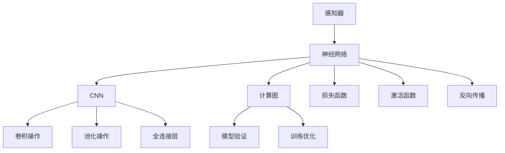

                 

# 感知器到卷积神经网络（CNN）

> 关键词：感知器, 神经网络, 卷积神经网络, CNN, 特征提取, 计算图, 损失函数, 激活函数, 卷积操作, 池化操作, 反向传播, 训练优化, 模型验证

## 1. 背景介绍

### 1.1 问题由来
在机器学习和深度学习领域，神经网络作为基础模型之一，得到了广泛的应用。本文将介绍感知器到卷积神经网络（CNN）的演变过程，阐述其核心思想和关键概念，并探讨其在图像识别、语音识别、自然语言处理等实际场景中的应用。

### 1.2 问题核心关键点
感知器和卷积神经网络（CNN）作为神经网络的两种重要形式，其核心思想在于通过模拟人脑神经元之间的连接，实现对数据的特征提取和分类。本文将重点讨论以下关键点：

- 感知器的基本原理及其局限性
- 神经网络的结构和层次
- 卷积神经网络的结构和特点
- 卷积和池化操作的作用和实现
- 反向传播算法及其优化策略
- CNN在图像处理、语音识别和自然语言处理等实际场景中的应用

## 2. 核心概念与联系

### 2.1 核心概念概述

为更好地理解感知器和CNN的演变和联系，本节将介绍几个关键概念：

- 感知器：一种简单的神经网络模型，由输入层、隐藏层和输出层组成，通过激活函数实现二分类或多元分类。
- 神经网络：由多个神经元构成的层次结构，通过梯度下降等优化算法训练模型参数，实现对数据的复杂映射。
- 卷积神经网络（CNN）：一种特殊形式的神经网络，通过卷积和池化操作实现对数据的局部特征提取，再通过全连接层进行分类或回归。
- 计算图：表示神经网络结构的图形，每个节点代表一个操作，边表示数据流。
- 损失函数：用于衡量模型输出与真实标签之间差异的函数，常见的有交叉熵损失、均方误差损失等。
- 激活函数：用于增加模型的非线性特性，常见的有Sigmoid、ReLU等。
- 卷积操作：通过滑动卷积核提取输入数据的局部特征。
- 池化操作：通过降采样操作减小特征图的大小，保留关键信息。
- 反向传播算法：用于计算损失函数对模型参数的梯度，从而更新模型参数。

这些核心概念之间的逻辑关系可以通过以下Mermaid流程图来展示：



这个流程图展示了几类神经网络之间的联系：

1. 感知器是神经网络的雏形，通过激活函数实现简单分类。
2. 神经网络通过层次结构实现对数据的复杂映射，通过计算图描述操作流程。
3. CNN通过卷积和池化操作提取局部特征，再通过全连接层进行分类或回归。
4. 反向传播算法通过计算图计算梯度，实现模型参数的更新。

## 3. 核心算法原理 & 具体操作步骤
### 3.1 算法原理概述

感知器和CNN的演变过程体现了神经网络结构和算法的不断进化。其核心思想是通过对数据的特征提取和分类，实现对复杂问题的建模和解决。

### 3.2 算法步骤详解

感知器的工作原理如下：
1. 输入数据通过线性变换得到隐藏层的激活值。
2. 隐藏层通过激活函数得到输出结果。
3. 输出结果与真实标签比较，计算误差。
4. 通过梯度下降等优化算法，更新模型参数，使误差最小化。

CNN的工作原理如下：
1. 输入数据通过卷积层提取局部特征。
2. 特征图通过池化层降采样，保留关键信息。
3. 池化后的特征图通过全连接层进行分类或回归。
4. 通过反向传播算法计算损失函数对模型参数的梯度，从而更新模型参数。

### 3.3 算法优缺点

感知器的优点在于结构简单，计算速度快，但存在梯度消失和过拟合等问题。

CNN的优点在于通过卷积和池化操作，提取局部特征，减小计算量，减少过拟合风险。

感知器的缺点在于无法处理非线性问题，存在梯度消失问题。

CNN的缺点在于参数量大，计算复杂，难以处理大尺寸输入。

### 3.4 算法应用领域

感知器和CNN在图像识别、语音识别、自然语言处理等领域得到了广泛应用。

- 图像识别：CNN通过卷积和池化操作提取局部特征，实现对图像的分类和识别。
- 语音识别：CNN通过卷积和池化操作提取语音的频谱特征，实现对语音的分类和识别。
- 自然语言处理：CNN通过卷积和池化操作提取文本的局部特征，实现对文本的分类和识别。

## 4. 数学模型和公式 & 详细讲解 & 举例说明

### 4.1 数学模型构建

本节将使用数学语言对感知器和CNN的工作原理进行严格刻画。

记输入数据为 $x = (x_1, x_2, ..., x_n)$，输出数据为 $y$。

感知器的数学模型为：
$$
y = f(\sum_{i=1}^n w_ix_i + b)
$$
其中，$w_i$ 为权重，$b$ 为偏置，$f$ 为激活函数。

CNN的数学模型为：
$$
y = f(Wx + b)
$$
其中，$W$ 为卷积核，$x$ 为输入数据，$b$ 为偏置，$f$ 为激活函数。

### 4.2 公式推导过程

以下我们以二分类任务为例，推导感知器和CNN的损失函数及其梯度的计算公式。

感知器的二分类任务损失函数为交叉熵损失：
$$
L = -\frac{1}{N}\sum_{i=1}^N[y_i\log f(x_i) + (1-y_i)\log(1-f(x_i))]
$$

CNN的损失函数同样为交叉熵损失，通过反向传播算法计算梯度：
$$
\frac{\partial L}{\partial w} = -\frac{1}{N}\sum_{i=1}^N[y_i(1-f(x_i)) - (1-y_i)f(x_i)]x_i
$$
$$
\frac{\partial L}{\partial b} = -\frac{1}{N}\sum_{i=1}^N[y_i(1-f(x_i)) - (1-y_i)f(x_i)]
$$

### 4.3 案例分析与讲解

以手写数字识别为例，通过CNN模型实现对MNIST数据集的分类。

首先，对数据集进行预处理，将原始图像转换为灰度图像，并进行归一化处理。

然后，将图像输入CNN模型，通过卷积层和池化层提取局部特征。

接着，将池化后的特征图输入全连接层进行分类，通过Softmax函数输出分类概率。

最后，通过交叉熵损失函数计算模型输出与真实标签之间的误差，使用反向传播算法更新模型参数。

通过不断迭代训练，CNN模型能够学习到手写数字的局部特征，并在测试集上取得优异的分类性能。

## 5. 项目实践：代码实例和详细解释说明

### 5.1 开发环境搭建

在进行CNN实践前，我们需要准备好开发环境。以下是使用Python进行TensorFlow开发的环境配置流程：

1. 安装Anaconda：从官网下载并安装Anaconda，用于创建独立的Python环境。

2. 创建并激活虚拟环境：
```bash
conda create -n tensorflow-env python=3.8 
conda activate tensorflow-env
```

3. 安装TensorFlow：根据CUDA版本，从官网获取对应的安装命令。例如：
```bash
conda install tensorflow tensorflow-gpu=cuda11.1 -c pytorch -c conda-forge
```

4. 安装Keras：
```bash
pip install keras
```

5. 安装各类工具包：
```bash
pip install numpy pandas scikit-learn matplotlib tqdm jupyter notebook ipython
```

完成上述步骤后，即可在`tensorflow-env`环境中开始CNN实践。

### 5.2 源代码详细实现

以下是使用TensorFlow实现CNN模型对手写数字识别任务的代码实现。

首先，定义CNN模型：

```python
import tensorflow as tf

model = tf.keras.models.Sequential([
    tf.keras.layers.Conv2D(32, (3, 3), activation='relu', input_shape=(28, 28, 1)),
    tf.keras.layers.MaxPooling2D((2, 2)),
    tf.keras.layers.Conv2D(64, (3, 3), activation='relu'),
    tf.keras.layers.MaxPooling2D((2, 2)),
    tf.keras.layers.Flatten(),
    tf.keras.layers.Dense(64, activation='relu'),
    tf.keras.layers.Dense(10, activation='softmax')
])
```

然后，编译模型：

```python
model.compile(optimizer='adam', loss='sparse_categorical_crossentropy', metrics=['accuracy'])
```

接着，训练模型：

```python
model.fit(train_images, train_labels, epochs=10, validation_data=(test_images, test_labels))
```

最后，评估模型：

```python
test_loss, test_acc = model.evaluate(test_images, test_labels)
print('Test accuracy:', test_acc)
```

### 5.3 代码解读与分析

让我们再详细解读一下关键代码的实现细节：

**Sequential模型**：
- 使用Sequential模型定义CNN的层次结构，依次添加卷积层、池化层、全连接层等。
- 卷积层使用Conv2D，指定卷积核大小、激活函数等参数。
- 池化层使用MaxPooling2D，指定池化窗口大小等参数。
- 全连接层使用Dense，指定神经元数量、激活函数等参数。
- 输出层使用Softmax，指定分类方式。

**compile函数**：
- 使用compile函数编译模型，指定优化器、损失函数和评估指标等参数。
- 这里使用了Adam优化器，交叉熵损失函数和准确率评估指标。

**fit函数**：
- 使用fit函数训练模型，指定训练数据、训练轮数和验证数据等参数。
- 这里使用了MNIST数据集进行训练，设置训练轮数为10。

**evaluate函数**：
- 使用evaluate函数评估模型，指定测试数据和评估指标等参数。
- 这里使用了MNIST数据集进行测试，输出测试集的准确率。

可以看到，TensorFlow提供了便捷的API，可以轻松搭建和训练CNN模型，适合快速迭代研究。开发者可以将更多精力放在模型设计、数据处理等高层逻辑上，而不必过多关注底层实现细节。

当然，工业级的系统实现还需考虑更多因素，如模型的保存和部署、超参数的自动搜索、更灵活的任务适配层等。但核心的CNN实践基本与此类似。

## 6. 实际应用场景
### 6.1 图像识别

CNN在图像识别领域的应用极为广泛，能够识别和分类各种物体、场景和人脸等。例如，Google的Inception模型和Microsoft的ResNet模型，已经在大规模图像识别竞赛中取得了优异成绩。

CNN模型通过卷积和池化操作，提取输入图像的局部特征，再通过全连接层进行分类。在实际应用中，可以通过迁移学习的方式，将在大规模数据集上预训练的模型应用于特定领域的图像识别任务，从而在少量标注数据下取得优异性能。

### 6.2 语音识别

CNN同样可以应用于语音识别领域，通过提取音频信号的频谱特征，实现对语音的分类和识别。例如，DeepSpeech模型就是基于CNN实现的对语音的端到端识别。

CNN通过卷积和池化操作，提取音频信号的局部特征，再通过全连接层进行分类。在实际应用中，可以通过迁移学习的方式，将在大规模语音数据集上预训练的模型应用于特定领域的语音识别任务。

### 6.3 自然语言处理

CNN在自然语言处理领域也有广泛应用，通过提取文本的局部特征，实现对文本的分类和识别。例如，TextCNN模型就是基于CNN实现的对文本的情感分析和主题分类。

CNN通过卷积和池化操作，提取文本的局部特征，再通过全连接层进行分类。在实际应用中，可以通过迁移学习的方式，将在大规模文本数据集上预训练的模型应用于特定领域的文本分类和识别任务。

### 6.4 未来应用展望

随着CNN技术的不断发展，其在图像处理、语音识别和自然语言处理等领域的实际应用前景依然广阔。

未来，CNN将继续提升对复杂数据的建模能力，实现更加高效和鲁棒的特征提取。同时，通过与深度学习、增强学习等技术的结合，CNN将在智能交互、智能推荐等领域发挥更大的作用。

此外，CNN还可以通过多模态融合，实现对视觉、语音、文本等多种数据的协同建模，提升对现实世界的理解和建模能力。未来，CNN将结合更多前沿技术，拓展应用场景，推动人工智能技术的进步。

## 7. 工具和资源推荐
### 7.1 学习资源推荐

为了帮助开发者系统掌握CNN的理论基础和实践技巧，这里推荐一些优质的学习资源：

1. 《深度学习》系列书籍：由多位深度学习领域的专家合著，全面介绍了深度学习的基本概念和前沿技术，包括CNN的基本原理和实际应用。

2. Coursera《深度学习专项课程》：由斯坦福大学教授Andrew Ng主讲的深度学习课程，涵盖CNN模型的设计与训练。

3. TensorFlow官方文档：TensorFlow的官方文档，提供了丰富的API和样例代码，是学习CNN的必备资料。

4. PyTorch官方文档：PyTorch的官方文档，提供了丰富的API和样例代码，是学习CNN的重要参考资料。

5. Keras官方文档：Keras的官方文档，提供了丰富的API和样例代码，是学习CNN的便捷工具。

通过对这些资源的学习实践，相信你一定能够快速掌握CNN的基本原理和实际应用，并在实际项目中灵活运用。

### 7.2 开发工具推荐

高效的开发离不开优秀的工具支持。以下是几款用于CNN开发的常用工具：

1. TensorFlow：由Google主导开发的开源深度学习框架，生产部署方便，适合大规模工程应用。

2. PyTorch：基于Python的开源深度学习框架，灵活动态的计算图，适合快速迭代研究。

3. Keras：基于TensorFlow和Theano的高级API，适合快速搭建和训练CNN模型。

4. Weights & Biases：模型训练的实验跟踪工具，可以记录和可视化模型训练过程中的各项指标，方便对比和调优。

5. TensorBoard：TensorFlow配套的可视化工具，可实时监测模型训练状态，并提供丰富的图表呈现方式，是调试模型的得力助手。

6. Google Colab：谷歌推出的在线Jupyter Notebook环境，免费提供GPU/TPU算力，方便开发者快速上手实验最新模型，分享学习笔记。

合理利用这些工具，可以显著提升CNN开发的效率，加快创新迭代的步伐。

### 7.3 相关论文推荐

CNN的发展离不开学界的持续研究。以下是几篇奠基性的相关论文，推荐阅读：

1. LeNet-5：首次提出卷积神经网络，用于手写数字识别。

2. AlexNet：首次在大规模图像识别竞赛ILSVRC中取得优异成绩，奠定了CNN的基础。

3. GoogLeNet（Inception）：提出Inception模块，提高了CNN的特征提取能力。

4. ResNet：提出残差连接，解决了深度神经网络的梯度消失问题，实现了更深的网络结构。

5. DenseNet：提出密集连接，提高了特征的复用效率，实现了更高效的特征提取。

这些论文代表了大规模CNN的发展脉络。通过学习这些前沿成果，可以帮助研究者把握学科前进方向，激发更多的创新灵感。

## 8. 总结：未来发展趋势与挑战

### 8.1 总结

本文对CNN的演变过程进行了全面系统的介绍。首先阐述了CNN的基本原理和实际应用，明确了CNN在图像识别、语音识别、自然语言处理等领域的广泛应用。其次，从原理到实践，详细讲解了CNN的数学模型和关键步骤，给出了CNN模型开发的完整代码实例。同时，本文还探讨了CNN的未来发展趋势和面临的挑战，展示了CNN技术的广阔前景。

通过本文的系统梳理，可以看到，CNN作为神经网络的重要形式，其核心思想在于通过卷积和池化操作，实现对局部特征的提取和分类，从而实现对复杂数据的建模和解决。CNN在实际应用中具有强大的特征提取能力和泛化能力，广泛应用于图像识别、语音识别、自然语言处理等各个领域。未来，随着CNN技术的不断演进，其在复杂数据建模和智能交互方面的能力将进一步提升，为人工智能技术的进步提供新的动力。

### 8.2 未来发展趋势

展望未来，CNN技术将呈现以下几个发展趋势：

1. 网络结构更加复杂：通过增加卷积层、池化层等，实现更强的特征提取能力。

2. 参数量进一步减小：通过参数共享和深度可分离卷积等技术，减小模型参数量，提升推理效率。

3. 多模态融合更加深入：通过融合视觉、语音、文本等多种数据，实现对现实世界的全面建模。

4. 知识图谱的整合：通过引入知识图谱，增强模型的知识推理能力，提升对现实世界的理解。

5. 语义分割和实例分割：通过语义分割和实例分割等技术，实现对图像的精细定位和分类。

以上趋势凸显了CNN技术的广阔前景。这些方向的探索发展，必将进一步提升CNN模型的性能和应用范围，为人工智能技术的发展提供新的突破。

### 8.3 面临的挑战

尽管CNN技术已经取得了显著成就，但在迈向更加智能化、普适化应用的过程中，它仍面临着诸多挑战：

1. 计算资源消耗大：CNN模型参数量大，计算复杂，需要大量的计算资源。如何在保证性能的同时，提高模型的计算效率，是一个重要挑战。

2. 过拟合风险高：CNN模型复杂度高，容易过拟合。如何通过正则化、dropout等技术，减少过拟合风险，是未来研究的方向。

3. 数据依赖性强：CNN模型需要大量标注数据进行训练，数据获取和标注成本高。如何在数据稀缺的情况下，实现模型的有效训练，是未来研究的重要课题。

4. 模型可解释性不足：CNN模型复杂度高，难以解释其内部工作机制和决策逻辑。如何增强模型的可解释性，是未来研究的方向之一。

5. 安全性和隐私问题：CNN模型可能存在数据泄露和隐私保护问题。如何在保障数据安全的同时，实现模型的有效训练和部署，是未来研究的重要课题。

6. 计算图优化复杂：CNN模型的计算图复杂，难以优化。如何通过剪枝、量化等技术，优化计算图，提高模型效率，是未来研究的方向。

这些挑战凸显了CNN技术在实际应用中仍需不断改进和优化，才能更好地适应各种应用场景。

### 8.4 研究展望

面对CNN技术所面临的诸多挑战，未来的研究需要在以下几个方面寻求新的突破：

1. 研究高效特征提取方法：通过研究高效卷积核设计、稀疏化卷积等方法，减小CNN模型的参数量，提高计算效率。

2. 开发知识引导的CNN模型：通过引入知识图谱、符号化先验知识等，增强模型的知识推理能力，提升对现实世界的理解。

3. 探索多模态融合技术：通过研究视觉、语音、文本等多种数据的融合方法，实现对现实世界的全面建模。

4. 结合强化学习等技术：通过结合强化学习等技术，优化CNN模型的训练过程，提升模型的泛化能力和鲁棒性。

5. 引入因果分析等方法：通过引入因果分析等方法，增强CNN模型的决策可解释性，提高模型的可信度。

这些研究方向将推动CNN技术的不断演进，为人工智能技术的进步提供新的动力。未来，通过不断的技术创新和应用实践，CNN技术必将在智能交互、智能推荐等领域发挥更大的作用，为人类认知智能的进化带来深远影响。

## 9. 附录：常见问题与解答

**Q1：CNN的计算复杂度如何控制？**

A: CNN的计算复杂度主要来自于卷积和池化操作，可以通过以下方法控制：
1. 网络结构设计：通过增加卷积层、池化层等，实现更强的特征提取能力，但需权衡参数量和计算复杂度。
2. 卷积核优化：通过设计高效卷积核，减小卷积操作的计算量，提高推理效率。
3. 模型压缩：通过剪枝、量化等技术，减小模型参数量，优化计算图，提高模型效率。
4. 多GPU加速：通过多GPU并行计算，减小计算时间，提高模型推理效率。

**Q2：CNN的过拟合问题如何解决？**

A: 过拟合是CNN面临的主要挑战之一，常见的解决方法包括：
1. 数据增强：通过数据增强技术，扩充训练集，减少过拟合风险。
2. 正则化：通过L2正则、Dropout等技术，减少过拟合风险。
3. Batch Normalization：通过Batch Normalization技术，规范化输入数据，提高模型泛化能力。
4. 迁移学习：通过迁移学习的方式，在大规模数据集上预训练模型，提高模型的泛化能力。
5. 模型剪枝：通过剪枝技术，减小模型规模，提高模型泛化能力。

这些方法可以灵活组合使用，在不同的任务中寻找最佳解决方案。

**Q3：CNN在实际应用中需要注意哪些问题？**

A: 将CNN模型转化为实际应用，还需要考虑以下问题：
1. 模型裁剪：去除不必要的层和参数，减小模型尺寸，提高推理效率。
2. 模型优化：通过优化算法，减小模型的计算量和存储空间，提高模型效率。
3. 服务化封装：将模型封装为标准化服务接口，便于集成调用。
4. 弹性伸缩：根据请求流量动态调整资源配置，平衡服务质量和成本。
5. 模型评估：使用评估指标，对模型性能进行全面评估，确保模型质量。
6. 安全性保障：通过访问鉴权、数据脱敏等措施，保障数据和模型安全。

通过不断优化和改进模型，提高模型性能，才能确保CNN模型在实际应用中的稳定性和可靠性。

**Q4：CNN的应用前景如何？**

A: CNN在图像识别、语音识别、自然语言处理等领域具有广阔的应用前景，未来将在更多领域得到应用。

在智慧医疗领域，CNN可以用于医学影像识别、病历分析、药物研发等，提升医疗服务的智能化水平。

在智能教育领域，CNN可以用于作业批改、学情分析、知识推荐等，因材施教，促进教育公平，提高教学质量。

在智慧城市治理中，CNN可以用于城市事件监测、舆情分析、应急指挥等环节，提高城市管理的自动化和智能化水平，构建更安全、高效的未来城市。

此外，在企业生产、社会治理、文娱传媒等众多领域，CNN的应用也将不断涌现，为经济社会发展提供新的动力。相信随着技术的日益成熟，CNN将逐步成为人工智能技术的重要组成部分，推动人工智能技术的广泛应用和深入发展。

---

作者：禅与计算机程序设计艺术 / Zen and the Art of Computer Programming

