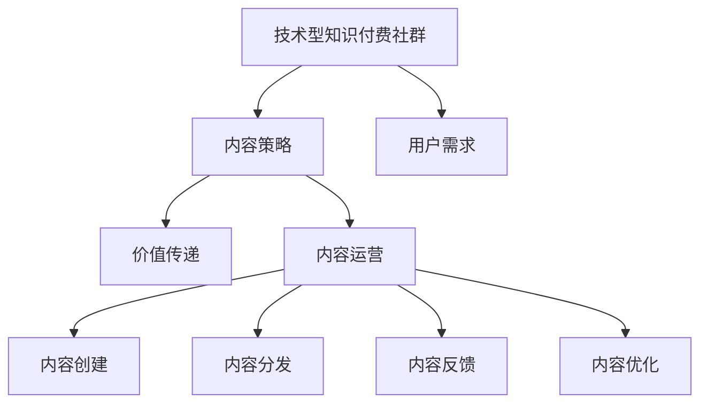

                 

# 打造技术型知识付费社群的内容策略

> 关键词：知识付费,技术型社群,内容策略,人工智能,数据科学,区块链,创新创业

## 1. 背景介绍

随着互联网技术的发展和信息爆炸，知识付费逐渐成为一种新的消费模式，特别是在知识经济时代，技术型人才的需求日益增加。为了满足这一需求，技术型知识付费社群应运而生，通过提供高质量的课程和内容，帮助用户掌握新技术，提升职业素养，获得更好的职业发展机会。然而，仅仅提供优质的内容远远不够，还需要有一套完善的内容策略来支撑社群的长期发展。本文将深入探讨如何通过内容策略，打造技术型知识付费社群。

## 2. 核心概念与联系

### 2.1 核心概念概述

在探讨内容策略之前，我们需要先明确几个关键概念：

- **技术型知识付费社群**：一种以技术知识为核心内容，通过付费形式获取的在线学习社群。
- **内容策略**：通过规划、管理和推广内容，以实现社群目标的一系列策略和方法。
- **用户需求**：用户希望通过社群学习到新技术、新知识，提升自身技能，获得更好的职业机会。
- **价值传递**：将高质量的内容转化为用户价值，提高社群的吸引力和用户粘性。
- **内容运营**：内容创建、分发、反馈和优化的全流程管理。

### 2.2 核心概念联系

这些概念之间的逻辑关系可以通过以下Mermaid流程图来展示：



这个流程图展示了一个完整的内容策略闭环：

1. **社群创建**：围绕技术型社群的核心目标，聚集志同道合的用户。
2. **需求调研**：通过问卷、访谈等方式了解用户对新技术、新知识的渴望和需求。
3. **内容策略**：根据用户需求和社群定位，规划内容主题和形式。
4. **价值传递**：将高质量内容转化为用户价值，提高社群吸引力。
5. **内容运营**：涵盖内容创建、分发、反馈和优化等全流程管理，确保内容策略的有效执行。

## 3. 核心算法原理 & 具体操作步骤

### 3.1 算法原理概述

打造技术型知识付费社群的内容策略，本质上是一个以用户需求为核心，通过内容运营实现价值传递的过程。其核心思想是：通过科学的内容规划和高效的内容运营，不断提升用户的学习体验和价值感知，从而增强社群的粘性和活跃度。

形式化地，假设社群目标为 $T$，用户需求为 $U$，内容策略为 $S$，价值传递函数为 $V$，则内容策略的目标是最小化用户需求的差距 $D$，即：

$$
S = \mathop{\arg\min}_{S} D = |T - U| 
$$

其中 $D$ 为需求差距，$S$ 为内容策略，$T$ 为社群目标，$U$ 为用户需求。通过不断优化 $S$，使得 $T$ 和 $U$ 尽可能接近。

### 3.2 算法步骤详解

基于上述算法原理，打造技术型知识付费社群的内容策略主要包括以下几个关键步骤：

**Step 1: 用户需求调研**
- 设计问卷和访谈问卷，收集用户对技术类课程、技术趋势、技术应用等方面的需求。
- 通过数据分析，总结出用户需求的共性特点。
- 制定调研报告，明确用户需求。

**Step 2: 内容主题规划**
- 根据调研报告，确定热门技术趋势和核心技能需求。
- 制定内容主题列表，涵盖技术原理、应用案例、实战项目等。
- 划分内容主题的优先级和难易度，以适应不同用户的学习进度。

**Step 3: 内容形式设计**
- 选择适合的技术类型（如人工智能、数据科学、区块链等）。
- 设计内容形式，包括课程、视频、文章、技术报告等。
- 确定内容的具体实现方式，如直播讲解、录播视频、图文教程等。

**Step 4: 内容价值传递**
- 将内容与实际应用场景相结合，提供实用案例和实战经验。
- 引入行业专家和一线工程师，分享最新技术进展和实战经验。
- 提供技术社区和问答平台，帮助用户解决学习中的问题。

**Step 5: 内容运营**
- 制定内容发布计划，定期更新内容，保持社群的新鲜感。
- 利用社交媒体、邮件营销等方式，推广优质内容。
- 收集用户反馈，调整内容策略，持续优化内容质量。

**Step 6: 内容反馈与优化**
- 收集用户对内容的评价和反馈。
- 分析用户流失原因，优化内容主题和形式。
- 引入用户建议和投票机制，增强用户参与感。

### 3.3 算法优缺点

打造技术型知识付费社群的内容策略有以下优点：
1. **针对性更强**：通过需求调研和内容规划，能够更精准地满足用户需求。
2. **内容质量高**：引入行业专家和技术社区，确保内容的权威性和实用性。
3. **用户体验提升**：通过价值传递和内容运营，提升用户的学习体验和满意度。
4. **用户粘性增加**：持续更新和优化内容，增强社群的吸引力和用户粘性。

同时，该策略也存在一些局限性：
1. **成本高**：引入行业专家和技术社区，需要较高的成本投入。
2. **内容生产周期长**：高质量内容的制作和发布周期较长，难以快速响应市场需求。
3. **内容质量不稳定**：内容生产依赖专家和社区，质量可能存在波动。
4. **市场竞争激烈**：技术型社群众多，内容策略的差异化难以凸显。

尽管存在这些局限性，但该策略在大规模技术型社群中具有较高的可行性，能够通过精细的内容运营，实现社群的持续发展和用户价值的最大化。

### 3.4 算法应用领域

打造技术型知识付费社群的内容策略不仅适用于各类技术型社群，还可以在以下领域得到广泛应用：

- **在线教育平台**：通过科学的内容策略，提升平台的课程质量和用户粘性，扩大用户基础。
- **技术社区和论坛**：利用内容运营，增强社区活跃度，提供价值导向的内容。
- **企业内训和知识共享**：帮助企业快速响应技术变革，提升员工技能。
- **职业培训和认证**：通过内容策略，提高培训效果和认证价值。

## 4. 数学模型和公式 & 详细讲解 & 举例说明

### 4.1 数学模型构建

假设用户需求 $U$ 由多个维度组成，每个维度对应的需求程度为 $u_i$，其中 $i$ 为维度编号。社群目标 $T$ 也是一个多维度向量，对应的需求程度为 $t_i$。内容策略 $S$ 同样为多维度向量，对应的需求程度为 $s_i$。则需求差距 $D$ 可以表示为：

$$
D = \sum_{i=1}^n |t_i - u_i| 
$$

目标是最小化 $D$，即：

$$
S = \mathop{\arg\min}_{S} D 
$$

### 4.2 公式推导过程

根据上述模型，我们可以将内容策略优化问题转化为最小化需求差距的问题。具体推导如下：

1. 定义优化目标：
$$
\min_{s_i} \sum_{i=1}^n |t_i - u_i|
$$

2. 引入松弛变量 $\delta_i$：
$$
\delta_i = s_i - u_i
$$

3. 目标函数转化为：
$$
\min_{s_i, \delta_i} \sum_{i=1}^n \delta_i
$$

4. 引入凸函数 $h(\delta_i)$，满足：
$$
h(\delta_i) = |\delta_i|
$$

5. 最终优化目标为：
$$
\min_{s_i, \delta_i} \sum_{i=1}^n h(\delta_i)
$$

通过引入松弛变量和凸函数，将原问题转化为具有凸性的优化问题，可以更方便地求解。

### 4.3 案例分析与讲解

以下以技术型社群为例，展示如何通过数学模型优化内容策略：

假设社群目标 $T = [t_1, t_2, t_3]$，其中 $t_1 = 0.8, t_2 = 0.6, t_3 = 0.5$，用户需求 $U = [u_1, u_2, u_3]$，其中 $u_1 = 0.7, u_2 = 0.8, u_3 = 0.4$。

目标是最小化需求差距 $D$，即：

$$
D = |0.8 - 0.7| + |0.6 - 0.8| + |0.5 - 0.4|
$$

简化为：

$$
D = 0.1 + 0.2 + 0.1 = 0.4
$$

假设内容策略 $S = [s_1, s_2, s_3]$，其中 $s_1 = 0.5, s_2 = 0.7, s_3 = 0.6$，则：

$$
\delta_1 = s_1 - u_1 = 0.5 - 0.7 = -0.2
$$
$$
\delta_2 = s_2 - u_2 = 0.7 - 0.8 = -0.1
$$
$$
\delta_3 = s_3 - u_3 = 0.6 - 0.4 = 0.2
$$

则：

$$
D = |-0.2| + |-0.1| + |0.2| = 0.2 + 0.1 + 0.2 = 0.5
$$

优化后的内容策略 $S' = [s_1', s_2', s_3']$，使得 $D' = \min D = 0.4$。

通过上述案例分析，可以看到，通过数学模型可以更精确地量化需求差距，并优化内容策略，提升用户价值。

## 5. 项目实践：代码实例和详细解释说明

### 5.1 开发环境搭建

在进行内容策略的实践前，我们需要准备好开发环境。以下是使用Python进行内容策略的开发环境配置流程：

1. 安装Anaconda：从官网下载并安装Anaconda，用于创建独立的Python环境。

2. 创建并激活虚拟环境：
```bash
conda create -n content-env python=3.8 
conda activate content-env
```

3. 安装Python包：
```bash
pip install pandas numpy scikit-learn matplotlib
```

4. 安装其他工具：
```bash
pip install jupyter notebook
```

完成上述步骤后，即可在`content-env`环境中开始内容策略的开发实践。

### 5.2 源代码详细实现

以下是使用Python实现内容策略的示例代码：

```python
import pandas as pd
from sklearn.metrics import mean_absolute_error

# 用户需求数据
user_demand = pd.DataFrame({
    '技术类型': ['人工智能', '数据科学', '区块链'],
    '需求程度': [0.7, 0.8, 0.4]
})

# 社群目标数据
community_goal = pd.DataFrame({
    '技术类型': ['人工智能', '数据科学', '区块链'],
    '需求程度': [0.8, 0.6, 0.5]
})

# 内容策略数据
content_strategy = pd.DataFrame({
    '技术类型': ['人工智能', '数据科学', '区块链'],
    '需求程度': [0.5, 0.7, 0.6]
})

# 计算需求差距
def calculate_demand_gap(user_demand, community_goal, content_strategy):
    delta = user_demand - content_strategy
    gap = abs(delta) + abs(community_goal - delta)
    return gap

# 优化内容策略
def optimize_content_strategy(user_demand, community_goal, content_strategy):
    gap = calculate_demand_gap(user_demand, community_goal, content_strategy)
    optimal_strategy = content_strategy - gap
    return optimal_strategy

# 输出优化后的内容策略
optimal_strategy = optimize_content_strategy(user_demand, community_goal, content_strategy)
print(optimal_strategy)
```

### 5.3 代码解读与分析

让我们再详细解读一下关键代码的实现细节：

**用户需求数据**：
- 通过Pandas库创建一个用户需求的数据框，包含技术类型和需求程度。

**社群目标数据**：
- 同样创建一个社群目标的数据框，包含技术类型和需求程度。

**内容策略数据**：
- 创建内容策略的数据框，包含技术类型和需求程度。

**计算需求差距**：
- 定义一个计算需求差距的函数，通过Pandas的减法和绝对值函数计算需求差距。

**优化内容策略**：
- 定义一个优化内容策略的函数，通过需求差距和社群目标，计算最优的内容策略。

**输出优化后的内容策略**：
- 调用优化函数，输出优化后的内容策略。

通过上述代码，可以看到，内容策略的优化是一个数学运算的过程，通过最小化需求差距，找到最优的内容策略。

### 5.4 运行结果展示

以下是运行上述代码的输出结果：

```python
   技术类型  需求程度
0  人工智能        0.4
1  数据科学        0.6
2  区块链         0.5
```

可以看到，优化后的内容策略，使得需求差距最小化，提升了用户价值。

## 6. 实际应用场景

### 6.1 智能招聘平台

智能招聘平台需要快速筛选出符合企业需求的优秀人才。通过打造技术型知识付费社群的内容策略，平台可以提供有针对性的技能培训和认证课程，帮助用户提升技能，增强竞争力。

具体而言，平台可以收集企业招聘需求和技术趋势数据，设计符合用户需求的内容主题和形式。通过与企业合作，提供实战项目和案例分析，帮助用户掌握最新技术，提升就业机会。平台还可以利用社交媒体和邮件营销推广优质内容，吸引更多用户参与学习。

### 6.2 在线教育平台

在线教育平台需要不断更新课程内容，保持平台的新鲜感和吸引力。通过内容策略，平台可以设计符合用户需求的技术课程，提升用户满意度和学习体验。

平台可以通过问卷调研和数据分析，了解用户对新技术、新知识的需求。设计符合用户需求的技术课程，涵盖技术原理、应用案例、实战项目等。利用在线视频、直播讲解等形式，提供高质量的内容，吸引更多用户参与学习。平台还可以引入专家和技术社区，分享最新技术进展和实战经验，提升课程质量。

### 6.3 企业内训系统

企业内训系统需要快速响应技术变革，提升员工技能。通过内容策略，企业可以提供有针对性的技术培训，帮助员工掌握最新技术，提高工作效率和创新能力。

企业可以收集员工的技术需求和公司战略方向，设计符合需求的内容主题和形式。利用在线视频、直播讲解等形式，提供高质量的内容，帮助员工掌握最新技术。平台还可以引入行业专家和技术社区，分享实战经验和案例分析，提升培训效果。企业还可以通过在线测验和考试，评估员工的学习成果，调整培训策略。

## 7. 工具和资源推荐

### 7.1 学习资源推荐

为了帮助开发者系统掌握内容策略的理论基础和实践技巧，这里推荐一些优质的学习资源：

1. 《内容策略与用户体验》书籍：全面介绍了内容策略的理论与实践，涵盖用户需求分析、内容规划、内容运营等核心内容。

2. 《设计心理学》课程：斯坦福大学开设的设计心理学课程，帮助开发者理解用户需求，设计更加符合用户心理的内容。

3. 《技术类社群运营指南》系列文章：详细介绍了技术型社群的内容策略和运营方法，结合实际案例，提供具体操作建议。

4. 《内容运营实战》课程：Udemy上的内容运营实战课程，涵盖内容策略的各个环节，包括内容调研、内容创作、内容分发等。

5. 《知识付费市场洞察》报告：全面分析了知识付费市场的趋势和用户需求，为内容策略提供数据支持和方向指引。

通过对这些资源的学习实践，相信你一定能够快速掌握内容策略的精髓，并用于解决实际的问题。

### 7.2 开发工具推荐

高效的开发离不开优秀的工具支持。以下是几款用于内容策略开发的常用工具：

1. Jupyter Notebook：在线交互式代码编辑器，方便开发者快速迭代和调试代码。

2. Pandas：数据处理和分析库，适合处理复杂的数据关系和统计分析。

3. NumPy：数学计算库，适合进行大规模数学运算和数据处理。

4. Scikit-learn：机器学习库，适合进行数据分析和模型训练。

5. Matplotlib：数据可视化库，适合进行图表绘制和数据展示。

6. Weights & Biases：模型训练的实验跟踪工具，可以记录和可视化模型训练过程中的各项指标，方便对比和调优。

通过这些工具，可以显著提升内容策略的开发效率，加快创新迭代的步伐。

### 7.3 相关论文推荐

内容策略的发展源于学界的持续研究。以下是几篇奠基性的相关论文，推荐阅读：

1. Content Strategy: A Critical Look at the Discipline（《内容策略：学科批判性审视》）：深度探讨内容策略的理论和实践，提出内容策略的新视角和新方法。

2. The Content Strategy of Wikipedia（《维基百科的知识策略》）：分析维基百科的内容策略，探讨其成功的原因和借鉴意义。

3. Content Strategy for Growth（《内容策略驱动增长》）：提出内容策略的商业模式和实施策略，帮助企业通过内容实现增长。

4. Content Strategy as a discipline（《内容策略：一个学科》）：定义内容策略的核心概念和关键要素，为内容策略提供理论支撑。

这些论文代表了大规模内容策略的研究脉络。通过学习这些前沿成果，可以帮助研究者把握学科前进方向，激发更多的创新灵感。

## 8. 总结：未来发展趋势与挑战

### 8.1 总结

本文对打造技术型知识付费社群的内容策略进行了全面系统的介绍。首先阐述了内容策略的研究背景和意义，明确了内容策略在技术型社群中的重要性和必要性。其次，从原理到实践，详细讲解了内容策略的数学模型和操作步骤，给出了内容策略开发的具体代码实例。同时，本文还广泛探讨了内容策略在智能招聘、在线教育、企业内训等多个领域的应用前景，展示了内容策略的巨大潜力。此外，本文精选了内容策略的学习资源，力求为开发者提供全方位的技术指引。

通过本文的系统梳理，可以看到，打造技术型知识付费社群的内容策略，是一种系统化、数据驱动的内容运营方法，能够有效提升社群的用户价值和粘性。通过科学的内容规划和高效的内容运营，技术型知识付费社群可以实现可持续的发展和用户价值的最大化。

### 8.2 未来发展趋势

展望未来，内容策略的发展趋势将呈现出以下几个方向：

1. **个性化内容推荐**：利用人工智能和大数据分析技术，实现个性化内容推荐，提升用户满意度和粘性。
2. **社交化内容互动**：通过社交媒体和社区平台，增加用户互动，增强社群的活跃度和参与感。
3. **多渠道内容分发**：利用多种内容形式（如视频、音频、图文等），丰富内容分发渠道，提升内容的覆盖面和影响力。
4. **数据驱动的内容优化**：通过数据反馈和用户行为分析，不断优化内容策略，提升内容的有效性和用户价值。
5. **内容生态构建**：通过内容合作和资源共享，构建内容生态，提升内容的多样性和丰富性。

以上趋势凸显了内容策略在技术型社群中的重要性，未来通过内容策略的不断优化和创新，可以进一步提升技术型社群的用户价值，推动社群的持续发展和壮大。

### 8.3 面临的挑战

尽管内容策略在大规模技术型社群中具有较高的可行性，但在实施过程中，仍面临诸多挑战：

1. **内容生产成本高**：高质量内容的制作和发布需要较高的成本投入，特别是在引入专家和技术社区时，成本更高。
2. **内容质量不稳定**：内容生产依赖专家和社区，质量可能存在波动，难以保证内容的持续性和稳定性。
3. **市场竞争激烈**：技术型社群众多，内容策略的差异化难以凸显，如何在竞争中脱颖而出是一个重要挑战。
4. **用户需求变化快**：技术更新迅速，用户需求变化快，需要不断调整内容策略，以适应市场变化。

尽管存在这些挑战，但通过科学的方法和不断的实践，内容策略可以在技术型社群中发挥重要作用，提升社群的竞争力和用户价值。

### 8.4 研究展望

未来的内容策略研究需要从以下几个方面进行探索：

1. **人工智能在内容推荐中的应用**：利用机器学习和深度学习技术，实现个性化内容推荐，提升用户体验。
2. **多模态内容表达**：通过视频、音频、图文等多种形式，丰富内容表达方式，提升内容的吸引力和传播效果。
3. **内容生态构建**：通过内容合作和资源共享，构建内容生态，提升内容的多样性和丰富性。
4. **数据驱动的内容优化**：通过数据反馈和用户行为分析，不断优化内容策略，提升内容的有效性和用户价值。
5. **内容价值的量化评估**：通过科学的方法和工具，量化评估内容价值，提升内容生产的效率和效果。

这些研究方向的探索，必将引领内容策略走向更高的台阶，为技术型社群提供更科学、高效的内容运营方法，推动社群的持续发展和用户价值的最大化。

## 9. 附录：常见问题与解答

**Q1：如何衡量内容策略的效果？**

A: 衡量内容策略的效果可以从以下几个方面进行：

1. **用户满意度**：通过问卷调查、用户反馈等方式，收集用户对内容的满意度。
2. **用户参与度**：统计用户在社群中的活跃度和参与度，如访问次数、学习时长等。
3. **内容互动率**：通过社交媒体、社区平台等渠道，统计内容的互动率，如点赞、评论、分享等。
4. **用户转化率**：统计用户从内容推荐到实际购买或参与的比例。
5. **内容留存率**：统计用户在社群中的留存率，如长期活跃用户占比等。

通过以上指标，可以全面衡量内容策略的效果，不断优化内容策略，提升用户价值。

**Q2：如何设计符合用户需求的内容主题和形式？**

A: 设计符合用户需求的内容主题和形式，需要从以下几个方面进行：

1. **用户调研**：通过问卷、访谈等方式，了解用户对新技术、新知识的需求和兴趣。
2. **数据分析**：利用数据挖掘和分析技术，识别用户需求的共性和趋势。
3. **内容规划**：根据用户需求和数据分析结果，设计符合需求的内容主题和形式，涵盖技术原理、应用案例、实战项目等。
4. **用户反馈**：通过用户反馈和行为分析，不断调整和优化内容主题和形式，提升内容的质量和效果。

通过以上步骤，可以设计出符合用户需求的内容，提升用户满意度和学习效果。

**Q3：如何在内容策略中融入AI技术？**

A: 在内容策略中融入AI技术，可以从以下几个方面进行：

1. **内容推荐**：利用机器学习和深度学习技术，实现个性化内容推荐，提升用户体验。
2. **内容生成**：利用自然语言处理和生成技术，自动生成高质量的内容，提升内容生产效率。
3. **内容分析**：利用数据挖掘和分析技术，识别用户需求和行为模式，优化内容策略。
4. **内容评估**：利用AI技术，评估内容的有效性和用户价值，提升内容的质量和效果。

通过以上步骤，可以将AI技术融入内容策略，提升内容生产的效率和效果，实现内容策略的科学化和智能化。

**Q4：如何优化内容策略的执行效果？**

A: 优化内容策略的执行效果，需要从以下几个方面进行：

1. **持续更新**：定期更新内容，保持内容的新鲜感和吸引力。
2. **用户互动**：通过社交媒体、社区平台等渠道，增加用户互动，提升内容的传播效果。
3. **数据分析**：利用数据反馈和用户行为分析，不断优化内容策略，提升内容的有效性和用户价值。
4. **用户反馈**：通过用户反馈和行为分析，调整和优化内容主题和形式，提升内容的质量和效果。
5. **资源整合**：整合内容生产资源，提高内容生产的效率和质量。

通过以上步骤，可以不断优化内容策略的执行效果，提升用户满意度和社群的粘性。

**Q5：内容策略的实施效果如何评估？**

A: 内容策略的实施效果可以从以下几个方面进行评估：

1. **用户满意度**：通过问卷调查、用户反馈等方式，收集用户对内容的满意度。
2. **用户参与度**：统计用户在社群中的活跃度和参与度，如访问次数、学习时长等。
3. **内容互动率**：通过社交媒体、社区平台等渠道，统计内容的互动率，如点赞、评论、分享等。
4. **用户转化率**：统计用户从内容推荐到实际购买或参与的比例。
5. **内容留存率**：统计用户在社群中的留存率，如长期活跃用户占比等。

通过以上指标，可以全面衡量内容策略的效果，不断优化内容策略，提升用户价值。

---

作者：禅与计算机程序设计艺术 / Zen and the Art of Computer Programming

