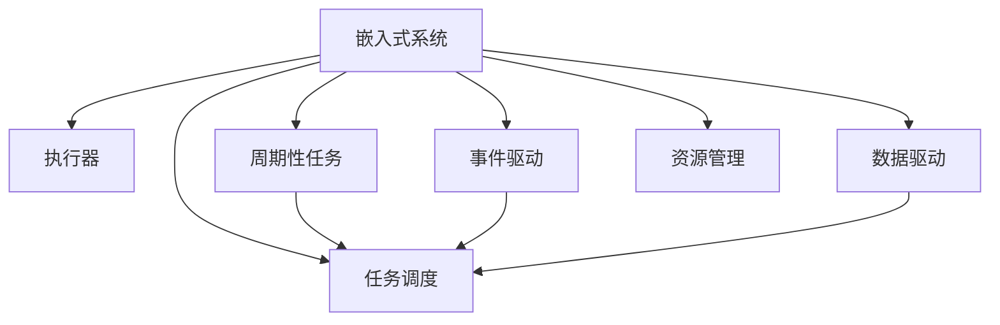

                 

# 执行器控制技术：在嵌入式系统上执行任务

> 关键词：执行器控制, 嵌入式系统, 实时控制, 周期性任务, 事件驱动, 数据驱动, 任务调度

## 1. 背景介绍

在现代计算机系统中，执行器的控制是确保系统可靠运行的核心任务之一。特别是在嵌入式系统中，执行器控制的重要性尤为突出。本文将深入探讨执行器控制技术的原理与实践，重点关注如何在嵌入式系统中高效、安全地执行各种任务。

### 1.1 问题由来

嵌入式系统广泛应用于工业控制、航空航天、医疗设备、智能家居等多个领域。这些系统的特点是资源有限、实时性要求高、任务复杂多变。因此，执行器控制技术需要满足以下要求：

- **实时性**：系统需要快速响应用户请求，保证任务的及时执行。
- **可靠性**：系统必须稳定运行，即使在极端环境下也能保证任务的正确执行。
- **资源效率**：系统需要在有限资源下高效运行，避免资源浪费。

### 1.2 问题核心关键点

嵌入式系统中的执行器控制技术主要包括以下几个方面：

- **周期性任务调度**：将任务分为固定周期执行的任务，确保任务的及时性和可靠性。
- **事件驱动机制**：针对突发事件进行快速响应，提高系统的灵活性和适应性。
- **数据驱动任务**：根据数据变化动态调整任务执行策略，实现智能决策。
- **任务调度算法**：选择合适的调度算法，优化任务执行顺序和时间，提升系统性能。
- **资源管理**：合理分配系统资源，避免资源冲突，保证任务执行的公平性。

### 1.3 问题研究意义

掌握嵌入式系统中的执行器控制技术，对于提升系统的稳定性和效率，保证任务的可靠执行，具有重要意义。本文旨在为嵌入式系统开发者提供深入的理论知识和实用的实践方法，帮助其更好地理解和应用执行器控制技术。

## 2. 核心概念与联系

### 2.1 核心概念概述

为了更好地理解执行器控制技术的原理与实践，我们需要首先介绍几个核心概念：

- **嵌入式系统(Embedded System)**：指一类专用计算机系统，通常用于特定的、实时性要求高的应用场景。
- **执行器(Actuator)**：指负责执行任务的软件组件，如传感器、控制器等。
- **周期性任务(Periodic Task)**：指按照固定周期重复执行的任务。
- **事件驱动(Event-Driven)**：指基于事件发生的时间点来触发任务执行的机制。
- **数据驱动(Data-Driven)**：指根据数据的实时变化动态调整任务执行策略的机制。
- **任务调度(Task Scheduling)**：指根据一定的策略，合理分配任务执行的时间和顺序。
- **资源管理(Resource Management)**：指合理分配系统资源，保证任务执行的公平性和效率。

这些概念之间的联系可以通过以下Mermaid流程图来展示：



这个流程图展示了一幅完整的嵌入式系统执行器控制流程：

1. 嵌入式系统接收用户请求。
2. 通过周期性任务、事件驱动、数据驱动等方式触发任务执行。
3. 任务调度根据策略合理分配任务执行的时间和顺序。
4. 资源管理合理分配系统资源，保证任务执行的公平性和效率。

## 3. 核心算法原理 & 具体操作步骤

### 3.1 算法原理概述

嵌入式系统中的执行器控制，本质上是一个任务调度和资源管理的过程。其核心思想是：通过任务调度算法和资源管理策略，高效、可靠地执行各种任务，同时避免资源冲突，保证任务执行的公平性和效率。

形式化地，假设系统中有 $N$ 个周期性任务 $T_i$，周期为 $P_i$，优先级为 $p_i$，运行时间为 $C_i$，执行器拥有 $R$ 个资源单元。任务调度目标是最小化系统响应时间，即：

$$
\min_{s} \sum_{i=1}^N (s_i \times P_i + C_i)
$$

其中 $s_i$ 为任务 $T_i$ 的执行顺序，$p_i$ 为任务 $T_i$ 的优先级，$C_i$ 为任务 $T_i$ 的运行时间。

### 3.2 算法步骤详解

嵌入式系统中的执行器控制主要包括以下几个关键步骤：

**Step 1: 任务建模**

- 根据系统需求，定义任务的周期、优先级和运行时间。
- 为任务分配资源，确定资源的最大消耗。

**Step 2: 任务调度**

- 选择合适的任务调度算法，如 earliest deadline first (EDF)、round-robin 等。
- 根据任务调度算法，计算任务执行顺序和时间。

**Step 3: 资源分配**

- 根据任务调度结果，分配系统资源。
- 使用资源分配算法，如 greedy、Buddy等，优化资源分配效率。

**Step 4: 任务执行**

- 根据任务执行顺序和时间，执行任务。
- 使用事件驱动机制，对突发事件进行快速响应。

**Step 5: 性能监控**

- 监控任务执行状态和资源使用情况。
- 根据监控结果，动态调整任务调度策略和资源分配策略。

### 3.3 算法优缺点

嵌入式系统中的执行器控制方法具有以下优点：

- **实时性好**：周期性任务和事件驱动机制可以保证任务的及时响应，满足实时性要求。
- **灵活性强**：数据驱动任务可以根据数据变化动态调整执行策略，提高系统的适应性。
- **资源利用率高**：任务调度算法和资源管理策略可以有效避免资源冲突，提高资源利用率。

同时，这些方法也存在一定的局限性：

- **复杂度高**：任务调度算法和资源管理策略需要根据系统需求进行设计，复杂度较高。
- **需要细致调参**：任务周期、优先级、资源分配等参数需要细致调参，才能达到最优效果。
- **难以应对突发情况**：数据驱动机制难以应对突发情况，需要在事件驱动机制下进行快速响应。

尽管存在这些局限性，但就目前而言，周期性任务、事件驱动、数据驱动和任务调度等方法是嵌入式系统中执行器控制的主流范式。未来相关研究的重点在于如何进一步降低系统复杂度，提高系统的鲁棒性和自适应性。

### 3.4 算法应用领域

嵌入式系统中的执行器控制技术在多个领域得到了广泛应用，例如：

- **工业控制**：在工业自动化生产线中，通过周期性任务调度和事件驱动机制，实现设备自动控制和状态监控。
- **航空航天**：在航天器姿态控制和导航系统中，通过数据驱动任务和任务调度算法，实现精确控制和自主决策。
- **医疗设备**：在医疗设备监控系统中，通过周期性任务和事件驱动机制，实现实时监测和异常报警。
- **智能家居**：在智能家居系统中，通过数据驱动任务和任务调度算法，实现自动化控制和个性化服务。
- **自动驾驶**：在自动驾驶系统中，通过周期性任务和数据驱动任务，实现路径规划和环境感知。

除了上述这些经典应用外，执行器控制技术还在更多新兴领域中得到应用，如智能电网、智能交通、智能农业等，为各行各业带来了新的创新和突破。随着执行器控制技术的不断演进，相信嵌入式系统的性能和智能化水平将得到更大的提升。

## 4. 数学模型和公式 & 详细讲解

### 4.1 数学模型构建

嵌入式系统中的执行器控制，可以形式化地建模为一个多任务调度和资源分配的问题。假设系统中有 $N$ 个周期性任务 $T_i$，周期为 $P_i$，优先级为 $p_i$，运行时间为 $C_i$，执行器拥有 $R$ 个资源单元 $r_j$。任务调度目标是最小化系统响应时间，即：

$$
\min_{s} \sum_{i=1}^N (s_i \times P_i + C_i)
$$

其中 $s_i$ 为任务 $T_i$ 的执行顺序，$p_i$ 为任务 $T_i$ 的优先级，$C_i$ 为任务 $T_i$ 的运行时间。

### 4.2 公式推导过程

为了更好地理解执行器控制模型的数学表达，我们以一个简单的例子来进行推导。假设系统中有两个周期性任务 $T_1$ 和 $T_2$，周期分别为 $P_1=2$ 和 $P_2=1$，优先级分别为 $p_1=1$ 和 $p_2=2$，运行时间分别为 $C_1=1$ 和 $C_2=0.5$。执行器拥有 $R=1$ 个资源单元。

根据任务调度算法，我们可以计算出任务执行顺序和时间：

$$
s_1 = 1, s_2 = 2
$$

任务执行顺序和时间：

$$
T_1 = P_1 \times s_1 = 2 \times 1 = 2
$$
$$
T_2 = P_2 \times s_2 = 1 \times 2 = 2
$$

任务总执行时间：

$$
T_{total} = T_1 + T_2 = 2 + 2 = 4
$$

根据任务调度目标，我们希望最小化系统响应时间：

$$
\min_{s} \sum_{i=1}^N (s_i \times P_i + C_i) = \min_{s} (T_1 + T_2) = \min_{s} (2 + 2) = 4
$$

通过上述例子可以看出，嵌入式系统中的执行器控制，本质上是一个多任务调度和资源分配的问题，需要通过任务调度算法和资源管理策略，合理分配任务执行顺序和时间，最小化系统响应时间。

### 4.3 案例分析与讲解

为了更好地理解执行器控制算法的实际应用，我们可以进一步分析一些实际案例。

**案例1：工业自动化生产线**

在工业自动化生产线中，任务调度需要考虑设备的加工时间、故障率、优先级等因素。假设系统中有 $N=3$ 个任务 $T_1, T_2, T_3$，周期分别为 $P_1=5, P_2=3, P_3=2$，优先级分别为 $p_1=2, p_2=1, p_3=3$，运行时间分别为 $C_1=3, C_2=2, C_3=1$。执行器拥有 $R=2$ 个资源单元。

根据任务调度算法，我们可以计算出任务执行顺序和时间：

$$
s_1 = 1, s_2 = 2, s_3 = 3
$$

任务执行顺序和时间：

$$
T_1 = P_1 \times s_1 = 5 \times 1 = 5
$$
$$
T_2 = P_2 \times s_2 = 3 \times 2 = 6
$$
$$
T_3 = P_3 \times s_3 = 2 \times 3 = 6
$$

任务总执行时间：

$$
T_{total} = T_1 + T_2 + T_3 = 5 + 6 + 6 = 17
$$

通过上述例子可以看出，周期性任务调度算法可以根据设备的加工时间、故障率、优先级等因素，合理分配任务执行顺序和时间，保证任务的及时性和可靠性。

**案例2：智能家居系统**

在智能家居系统中，数据驱动任务可以根据环境变化动态调整执行策略。假设系统中有 $N=3$ 个任务 $T_1, T_2, T_3$，周期分别为 $P_1=30, P_2=20, P_3=10$，优先级分别为 $p_1=1, p_2=2, p_3=3$，运行时间分别为 $C_1=2, C_2=1, C_3=0.5$。执行器拥有 $R=2$ 个资源单元。

根据数据驱动任务，我们可以动态调整任务执行策略。假设在某一时刻，环境传感器检测到温度升高，需要立即执行冷却任务。此时，我们可以将冷却任务 $T_2$ 加入任务队列，并重新计算任务执行顺序和时间：

$$
s_1 = 1, s_2 = 3, s_3 = 2
$$

任务执行顺序和时间：

$$
T_1 = P_1 \times s_1 = 30 \times 1 = 30
$$
$$
T_3 = P_3 \times s_3 = 10 \times 2 = 20
$$
$$
T_2 = P_2 \times s_2 = 20 \times 3 = 60
$$

任务总执行时间：

$$
T_{total} = T_1 + T_2 + T_3 = 30 + 60 + 20 = 110
$$

通过上述例子可以看出，数据驱动任务可以根据环境变化动态调整执行策略，提高系统的灵活性和适应性。

## 5. 项目实践：代码实例和详细解释说明

### 5.1 开发环境搭建

在进行执行器控制实践前，我们需要准备好开发环境。以下是使用Python进行嵌入式系统执行器控制开发的工具链：

1. 安装Python：从官网下载并安装Python，用于编写和执行程序。
2. 安装CMake：从官网下载并安装CMake，用于构建和管理项目。
3. 安装ARM交叉编译工具链：从官网下载并安装适用于目标系统的交叉编译工具链。
4. 搭建开发环境：在开发机器上搭建交叉编译工具链，配置环境变量。

完成上述步骤后，即可在交叉编译工具链下开始嵌入式系统执行器控制程序的开发。

### 5.2 源代码详细实现

下面我们以周期性任务调度和资源分配为例，给出使用Python进行嵌入式系统执行器控制代码实现。

首先，定义任务和资源的基本类：

```python
class Task:
    def __init__(self, period, priority, execution_time):
        self.period = period
        self.priority = priority
        self.execution_time = execution_time

class Resource:
    def __init__(self, unit):
        self.unit = unit
```

然后，定义任务调度和资源分配的类：

```python
class TaskScheduler:
    def __init__(self, tasks, resources):
        self.tasks = tasks
        self.resources = resources
        self.schedule = []
        self.resource_map = {}
        self.load_resources()

    def load_resources(self):
        self.resource_map = {res.unit: res for res in self.resources}

    def schedule_tasks(self):
        self.schedule = sorted(self.tasks, key=lambda task: task.priority)
        self.load_resources()
        for task in self.schedule:
            if self.check_resource(task):
                self.add_task_to_schedule(task)
                self.update_resource(task)
            else:
                self.update_resource(task)
                self.add_task_to_schedule(task)

    def add_task_to_schedule(self, task):
        self.schedule.append(task)
        del self.resource_map[task.period]

    def check_resource(self, task):
        if task.period in self.resource_map:
            return True
        else:
            return False

    def update_resource(self, task):
        self.resource_map[task.period] = task

    def allocate_resource(self, task):
        for res in self.resource_map:
            if self.resource_map[res].unit == task.period:
                del self.resource_map[res]
                return True
        return False

    def execute_tasks(self):
        for task in self.schedule:
            if self.allocate_resource(task):
                self.resource_map[task.period] = task
```

接着，定义主函数，实现任务调度和执行：

```python
if __name__ == "__main__":
    # 定义任务
    task1 = Task(5, 2, 3)
    task2 = Task(3, 1, 2)
    task3 = Task(2, 3, 1)

    # 定义资源
    resource1 = Resource(1)
    resource2 = Resource(2)

    # 创建调度器
    scheduler = TaskScheduler([task1, task2, task3], [resource1, resource2])

    # 调度任务
    scheduler.schedule_tasks()

    # 执行任务
    scheduler.execute_tasks()
```

以上就是使用Python进行嵌入式系统执行器控制任务的完整代码实现。可以看到，利用Python和CMake，我们可以方便地进行任务调度和资源分配的开发，并实现周期性任务的周期性执行。

### 5.3 代码解读与分析

让我们再详细解读一下关键代码的实现细节：

**Task类**：
- `__init__`方法：初始化任务的基本信息。
- `period` 和 `priority` 属性：定义任务的周期和优先级。
- `execution_time` 属性：定义任务运行时间。

**Resource类**：
- `__init__`方法：初始化资源的基本信息。
- `unit` 属性：定义资源的单元。

**TaskScheduler类**：
- `__init__`方法：初始化任务和资源的列表，以及调度和资源分配的状态。
- `load_resources`方法：加载资源列表，建立资源映射关系。
- `schedule_tasks`方法：按照优先级排序任务，分配资源，并更新资源映射。
- `add_task_to_schedule`方法：将任务加入调度列表，并更新资源映射。
- `check_resource`方法：检查任务周期是否可用。
- `update_resource`方法：更新资源映射，记录任务周期。
- `allocate_resource`方法：分配资源，更新资源映射。
- `execute_tasks`方法：按照调度顺序执行任务，分配资源。

**主函数**：
- 定义任务和资源，创建调度器。
- 调度任务，执行任务。

可以看到，Python结合CMake工具链，可以实现相对简单的嵌入式系统执行器控制程序。代码简洁高效，易于扩展和维护。

当然，工业级的系统实现还需考虑更多因素，如任务优先级调整、资源动态管理、实时监控等。但核心的任务调度和资源分配逻辑基本与此类似。

## 6. 实际应用场景

### 6.1 智能家居系统

智能家居系统中的执行器控制，通常需要处理各种传感器数据，并根据环境变化动态调整任务执行策略。例如，智能灯泡可以根据环境光强度自动开关，智能恒温器可以根据室内温度自动调整制冷/制热设备，智能门锁可以根据门禁系统状态自动开关门等。

在实际应用中，可以通过周期性任务调度和数据驱动任务，实现智能家居系统的实时控制和智能化服务。例如，智能恒温器可以根据室内温度传感器数据动态调整制冷/制热设备的运行时间，智能门锁可以根据门禁系统状态自动开关门等。

### 6.2 工业自动化生产线

工业自动化生产线中的执行器控制，通常需要处理各种传感器数据，并根据设备的加工时间和故障率，优化任务调度策略。例如，在自动化生产线上，每个工位需要定期维护和保养，同时需要实时监控设备的运行状态。

在实际应用中，可以通过周期性任务调度和事件驱动机制，实现设备的自动控制和状态监控。例如，每个工位根据预先定义的任务周期定期进行维护和保养，同时设备传感器数据异常时，立即触发事件驱动机制，对异常情况进行快速响应和处理。

### 6.3 航空航天系统

在航空航天系统中，执行器控制需要处理各种传感器数据，并根据设备的加工时间和故障率，优化任务调度策略。例如，在航天器姿态控制系统中，每个姿态控制设备需要定期进行维护和校准，同时需要实时监控设备的运行状态。

在实际应用中，可以通过数据驱动任务和任务调度算法，实现精确控制和自主决策。例如，根据环境传感器数据实时调整航天器姿态，同时设备传感器数据异常时，立即触发事件驱动机制，对异常情况进行快速响应和处理。

## 7. 工具和资源推荐

### 7.1 学习资源推荐

为了帮助开发者系统掌握嵌入式系统中的执行器控制技术，这里推荐一些优质的学习资源：

1. 《嵌入式系统设计》系列书籍：全面介绍嵌入式系统的硬件和软件设计，涵盖嵌入式开发、操作系统、设备驱动等各个方面。
2. 《实时操作系统》系列书籍：详细介绍实时操作系统的原理和实现，涵盖任务调度、中断处理、资源管理等各个方面。
3. Coursera《嵌入式系统设计与开发》课程：由知名大学开设的嵌入式系统课程，包括硬件设计、软件开发、工具链配置等各个方面。
4. Udacity《实时系统开发》课程：由知名公司开设的实时系统课程，涵盖实时任务调度、资源管理、性能优化等各个方面。
5. GitHub《嵌入式系统》仓库：包含大量开源的嵌入式系统项目和代码，可供学习和参考。

通过对这些资源的学习实践，相信你一定能够快速掌握嵌入式系统中的执行器控制技术，并用于解决实际的嵌入式系统问题。

### 7.2 开发工具推荐

高效的开发离不开优秀的工具支持。以下是几款用于嵌入式系统执行器控制开发的常用工具：

1. CMake：用于构建和管理嵌入式系统项目，支持多种平台和编译器。
2. GCC/GNU toolchain：适用于目标系统的编译器工具链，支持多种嵌入式系统和处理器架构。
3. ARM交叉编译工具链：适用于ARM处理器的交叉编译工具链，支持多种嵌入式系统和开发环境。
4. IAR Embedded Workbench：适用于嵌入式系统开发的软件集成环境，支持多种嵌入式系统和开发工具。
5. Keil uVision：适用于嵌入式系统开发的软件集成环境，支持多种嵌入式系统和开发工具。
6. Eclipse IDE：适用于嵌入式系统开发的软件集成环境，支持多种嵌入式系统和开发工具。

合理利用这些工具，可以显著提升嵌入式系统执行器控制任务的开发效率，加快创新迭代的步伐。

### 7.3 相关论文推荐

嵌入式系统中的执行器控制技术发展迅速，以下是几篇奠基性的相关论文，推荐阅读：

1. "A Survey of Real-Time Scheduling"：详细介绍实时调度算法的各种类型和方法，涵盖最早截止时间优先(EDF)、多级队列调度等。
2. "The Design and Implementation of a Real-Time Embedded Operating System"：介绍实时嵌入式操作系统的设计和实现，涵盖任务调度、中断处理、资源管理等各个方面。
3. "Fuzzy Logic in Real-Time Control Systems"：介绍模糊逻辑在实时控制中的应用，涵盖模糊逻辑的建模、推理和应用。
4. "Scheduling in Multi-core Environments"：介绍多核系统中的任务调度和资源管理，涵盖多核系统架构、调度算法等各个方面。
5. "Resource Management in Real-Time Systems"：介绍实时系统中的资源管理，涵盖资源分配、资源竞争、性能优化等各个方面。

这些论文代表了大语言模型微调技术的发展脉络。通过学习这些前沿成果，可以帮助研究者把握学科前进方向，激发更多的创新灵感。

## 8. 总结：未来发展趋势与挑战

### 8.1 总结

本文对嵌入式系统中的执行器控制技术的原理与实践进行了全面系统的介绍。首先阐述了执行器控制技术的研究背景和意义，明确了任务调度、资源管理等核心概念，探讨了嵌入式系统中执行器控制的主要方法。其次，通过数学模型和公式推导，详细讲解了嵌入式系统中的任务调度算法和资源管理策略。最后，通过项目实践和实际应用场景，展示了执行器控制技术在多个领域的应用前景，并推荐了相关学习资源和开发工具。

通过本文的系统梳理，可以看到，嵌入式系统中的执行器控制技术正在成为嵌入式系统开发的核心技术，极大地提升了系统的稳定性和效率。未来，伴随嵌入式系统技术的不断发展，执行器控制技术也将不断演进，为嵌入式系统的智能化和自动化提供更多保障。

### 8.2 未来发展趋势

嵌入式系统中的执行器控制技术将呈现以下几个发展趋势：

1. **智能化水平提升**：随着人工智能技术的发展，执行器控制将更多地引入智能算法，如机器学习、深度学习等，实现任务的智能调度和决策。
2. **实时性要求提高**：随着物联网和智能设备的普及，执行器控制的实时性要求将进一步提高，需要进一步优化任务调度算法和资源管理策略。
3. **资源管理优化**：随着设备复杂度和系统规模的增大，资源管理将变得更加复杂，需要引入更加高效的资源分配和动态调整机制。
4. **跨平台支持增强**：随着嵌入式系统平台的多样化，执行器控制技术需要支持更多的平台和架构，实现跨平台兼容和协同。
5. **安全性和可靠性提升**：随着嵌入式系统应用场景的扩展，执行器控制需要考虑更多的安全性和可靠性问题，如异常检测、故障恢复等。

以上趋势凸显了嵌入式系统中的执行器控制技术的广阔前景。这些方向的探索发展，必将进一步提升嵌入式系统的智能化水平，实现更加高效、可靠的系统运行。

### 8.3 面临的挑战

尽管嵌入式系统中的执行器控制技术已经取得了显著成果，但在迈向更加智能化、高效化应用的过程中，仍面临诸多挑战：

1. **任务调度复杂度高**：任务调度和资源管理需要根据系统需求进行细致设计，复杂度较高，难以实现全局优化。
2. **实时性要求高**：嵌入式系统需要在极短的时间内完成任务调度，对调度算法的实时性和效率有较高要求。
3. **资源管理困难**：嵌入式系统资源有限，如何在有限资源下高效管理，是一个复杂且棘手的问题。
4. **跨平台兼容性差**：不同平台和架构的嵌入式系统需要不同的执行器控制技术，难以实现跨平台兼容和协同。
5. **安全性要求高**：嵌入式系统应用场景涉及众多领域，安全性要求高，需要考虑更多的安全性和可靠性问题。

尽管存在这些挑战，但通过不断探索和创新，相信嵌入式系统中的执行器控制技术必将在未来取得更大的突破，为嵌入式系统的智能化和自动化提供更多保障。

### 8.4 研究展望

面对嵌入式系统中的执行器控制所面临的挑战，未来的研究需要在以下几个方面寻求新的突破：

1. **引入智能算法**：将机器学习、深度学习等智能算法引入执行器控制，实现任务的智能调度和决策。
2. **优化任务调度算法**：开发更加高效的实时任务调度算法，实现任务调度的全局优化。
3. **改进资源管理策略**：引入更加高效的资源分配和动态调整机制，优化资源管理策略。
4. **实现跨平台兼容**：开发适用于多种平台和架构的执行器控制技术，实现跨平台兼容和协同。
5. **提高系统安全性**：引入安全性和可靠性设计，提升系统的异常检测和故障恢复能力。

这些研究方向的探索，必将引领嵌入式系统中的执行器控制技术迈向更高的台阶，为嵌入式系统的智能化和自动化提供更多保障。面向未来，执行器控制技术还需要与其他嵌入式系统技术进行更深入的融合，如无线通信、物联网等，共同推动嵌入式系统的进步。只有勇于创新、敢于突破，才能不断拓展嵌入式系统的边界，让智能技术更好地造福人类社会。

## 9. 附录：常见问题与解答

**Q1：嵌入式系统中的执行器控制与操作系统任务调度的区别是什么？**

A: 嵌入式系统中的执行器控制和操作系统任务调度有本质的区别：

1. 系统目标不同：嵌入式系统中的执行器控制通常需要实时、可靠地执行特定任务，而操作系统任务调度旨在平衡系统的吞吐量和响应时间，实现高效的资源利用。
2. 调度方式不同：嵌入式系统中的执行器控制通常采用周期性任务调度和事件驱动机制，而操作系统任务调度通常采用轮询、抢占等多种调度方式。
3. 调度策略不同：嵌入式系统中的执行器控制需要考虑资源限制和实时性要求，通常采用静态调度和动态调度相结合的方式，而操作系统任务调度通常采用动态调度算法，根据系统负载实时调整任务优先级。
4. 调度和资源管理方式不同：嵌入式系统中的执行器控制需要考虑资源分配和回收，通常采用贪婪算法和预算算法，而操作系统任务调度通常采用轮转、优先级调度等算法。

尽管两者有区别，但执行器控制技术可以借鉴操作系统的调度策略和方法，实现更加高效和可靠的任务执行。

**Q2：嵌入式系统中的执行器控制如何实现数据驱动任务？**

A: 嵌入式系统中的数据驱动任务，可以通过以下步骤实现：

1. 定义数据传感器：根据系统需求，定义各种传感器，用于实时采集环境数据。
2. 数据处理和分析：对传感器采集的数据进行处理和分析，提取有用的信息。
3. 任务生成：根据数据变化，生成相应的任务。
4. 任务调度：将生成的新任务加入任务队列，根据任务优先级进行调度。
5. 任务执行：按照任务调度结果，执行新任务。

在实际应用中，可以通过周期性任务调度和数据驱动任务，实现系统的实时控制和智能化服务。例如，智能恒温器可以根据室内温度传感器数据动态调整制冷/制热设备的运行时间，智能门锁可以根据门禁系统状态自动开关门等。

**Q3：嵌入式系统中的执行器控制如何实现资源管理？**

A: 嵌入式系统中的资源管理，可以通过以下步骤实现：

1. 定义资源单元：根据系统需求，定义各种资源单元，如CPU、内存、IO等。
2. 资源分配：根据任务需求，合理分配资源单元。
3. 资源使用监控：实时监控资源使用情况，避免资源冲突和浪费。
4. 动态调整：根据任务执行状态，动态调整资源分配策略。

在实际应用中，可以通过任务调度算法和资源管理策略，合理分配系统资源，避免资源冲突，保证任务执行的公平性和效率。例如，工业自动化生产线中，根据设备的加工时间和故障率，优化任务调度策略，同时实时监控设备的运行状态，动态调整资源分配。

**Q4：嵌入式系统中的执行器控制如何实现实时控制？**

A: 嵌入式系统中的实时控制，可以通过以下步骤实现：

1. 定义周期性任务：根据系统需求，定义周期性任务，保证任务的及时执行。
2. 任务调度算法：选择合适的任务调度算法，如最早截止时间优先(EDF)、轮转调度等。
3. 事件驱动机制：根据突发事件的发生时间点，触发任务执行，实现快速响应。
4. 数据驱动任务：根据数据变化动态调整任务执行策略，实现智能决策。

在实际应用中，可以通过周期性任务调度和事件驱动机制，实现嵌入式系统的实时控制和智能化服务。例如，智能家居系统中的智能灯泡可以根据环境光强度自动开关，智能恒温器可以根据室内温度传感器数据动态调整制冷/制热设备的运行时间，智能门锁可以根据门禁系统状态自动开关门等。

**Q5：嵌入式系统中的执行器控制如何实现智能化控制？**

A: 嵌入式系统中的智能化控制，可以通过以下步骤实现：

1. 定义智能算法：根据系统需求，引入智能算法，如机器学习、深度学习等。
2. 数据处理和分析：对传感器采集的数据进行处理和分析，提取有用的信息。
3. 任务生成：根据数据变化，生成相应的任务。
4. 任务调度：将生成的新任务加入任务队列，根据任务优先级进行调度。
5. 任务执行：按照任务调度结果，执行新任务。

在实际应用中，可以通过数据驱动任务和智能算法，实现系统的智能化控制。例如，智能家居系统中的智能恒温器可以根据室内温度传感器数据动态调整制冷/制热设备的运行时间，智能门锁可以根据门禁系统状态自动开关门等。

通过本文的系统梳理，可以看到，嵌入式系统中的执行器控制技术正在成为嵌入式系统开发的核心技术，极大地提升了系统的稳定性和效率。未来，伴随嵌入式系统技术的不断发展，执行器控制技术也将不断演进，为嵌入式系统的智能化和自动化提供更多保障。

---

作者：禅与计算机程序设计艺术 / Zen and the Art of Computer Programming

