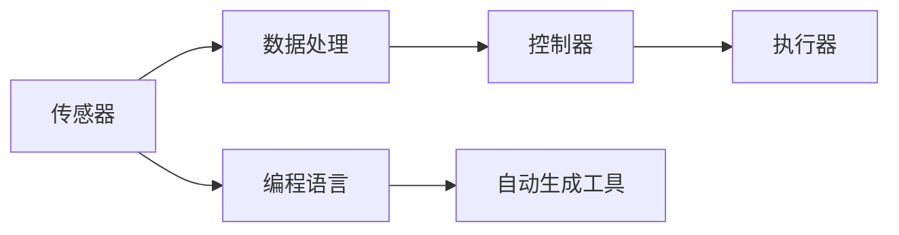

                 

# 执行器编程：控制设备行为

> 关键词：
- 执行器编程
- 设备行为控制
- 机器人学
- 自动控制
- 传感器融合
- 反馈控制
- 自适应算法

## 1. 背景介绍

在现代社会，自动化的设备已经广泛应用于各个领域。从智能家居到工业自动化，从无人驾驶汽车到无人机，自动化的程度越来越高。这些设备通常需要复杂的算法来控制其行为，以实现预定的任务。而执行器编程就是实现这一目标的关键技术之一。

### 1.1 问题由来

随着自动化技术的不断进步，对执行器编程的需求也在不断增加。传统的手动编程方式已经难以满足需求，需要通过自动化工具来快速生成代码，实现设备的控制。这不仅提高了工作效率，还减少了人为错误。然而，尽管自动化工具不断改进，执行器编程仍然是一个复杂且具有挑战性的任务。设备行为控制的复杂性和多样性使得编程过程变得更加困难。因此，执行器编程的研究和应用已经成为一个热门领域。

### 1.2 问题核心关键点

执行器编程的核心关键点包括：

- 设备行为控制：控制设备完成特定的任务，如移动、拾取、搬运等。
- 传感器数据处理：处理来自传感器的数据，以获得设备的实时状态和环境信息。
- 控制算法设计：设计合适的控制算法，以实现设备的行为控制。
- 编程自动化：通过自动化工具，实现执行器的编程和测试。
- 代码优化：优化代码以提高执行效率和可维护性。

## 2. 核心概念与联系

### 2.1 核心概念概述

为了更好地理解执行器编程，我们首先介绍几个核心概念：

- **执行器(Actuator)**：是用于控制设备行为的关键部件，如电机、液压缸等。
- **传感器(Sensor)**：用于获取设备周围环境或自身状态的数据，如位置传感器、温度传感器等。
- **控制器(Controller)**：根据传感器数据和预设的任务，控制执行器行为，如PID控制器、神经网络控制器等。
- **编程语言**：用于编写执行器控制程序的编程语言，如Python、C++等。
- **自动生成工具**：用于自动生成执行器控制程序的自动化工具，如Python RoboDK、Universal Robots Studio等。

### 2.2 核心概念原理和架构的 Mermaid 流程图



这个流程图展示了执行器编程的基本架构：

1. **传感器(Sensor)**：获取设备周围环境或自身状态的数据。
2. **数据处理(Data Processing)**：处理传感器的数据，以获得设备的实时状态和环境信息。
3. **控制器(Controller)**：根据传感器数据和预设的任务，控制执行器行为。
4. **执行器(Actuator)**：执行控制器的指令，完成设备的行为控制。
5. **编程语言(Programming Language)**：用于编写执行器控制程序的编程语言。
6. **自动生成工具(Automatic Generation Tool)**：用于自动生成执行器控制程序的自动化工具。

## 3. 核心算法原理 & 具体操作步骤

### 3.1 算法原理概述

执行器编程的核心算法包括传感器数据处理、控制算法设计和编程自动化。下面我们详细介绍这些算法的基本原理。

#### 3.1.1 传感器数据处理

传感器数据处理是执行器编程的基础。传感器数据通常具有高噪声、非线性等特点，需要进行预处理和滤波，以获得更准确的数据。常用的传感器数据处理方法包括：

- **预处理**：包括数据校验、去噪、归一化等。
- **滤波**：如低通滤波、中值滤波等，以消除数据中的高频噪声。
- **数据融合**：使用融合算法如卡尔曼滤波、粒子滤波等，结合多传感器的数据，提高数据的准确性和可靠性。

#### 3.1.2 控制算法设计

控制算法设计是执行器编程的关键。控制算法通常需要满足实时性、鲁棒性和可调性的要求。常用的控制算法包括：

- **PID控制器**：比例、积分、微分控制，广泛应用于位置控制、速度控制等任务。
- **神经网络控制器**：通过训练神经网络，实现自适应控制，适用于复杂和非线性任务。
- **自适应控制算法**：如自适应PID、模糊控制等，根据环境变化实时调整控制参数。

#### 3.1.3 编程自动化

编程自动化是执行器编程的重要组成部分。自动化工具能够自动生成代码，减少人工编程的时间和成本，同时提高代码的可维护性和可扩展性。常用的编程自动化工具包括：

- **Python RoboDK**：用于生成Python代码，实现执行器编程。
- **Universal Robots Studio**：用于生成Universal Robots代码，实现执行器编程。
- **ROS（Robot Operating System）**：用于编写机器人操作的程序，支持多种语言和框架。

### 3.2 算法步骤详解

#### 3.2.1 数据采集与预处理

数据采集是执行器编程的第一步。设备通常配备有多种传感器，如位置传感器、温度传感器、速度传感器等。使用传感器获取设备的实时状态和环境信息，并进行预处理和滤波，以获得更准确的数据。

**步骤1**：使用传感器采集数据。

**步骤2**：对采集到的数据进行预处理和滤波，以消除噪声和干扰。

**步骤3**：对预处理后的数据进行数据融合，以提高数据的准确性和可靠性。

#### 3.2.2 控制算法设计

控制算法设计是执行器编程的核心。根据设备的任务要求，选择合适的控制算法，并进行参数调优。

**步骤1**：根据任务要求选择合适的控制算法。

**步骤2**：使用传感器数据进行控制算法的训练和调优。

**步骤3**：在实际环境中进行测试和优化，以提高控制算法的性能。

#### 3.2.3 编程自动化

编程自动化是执行器编程的重要环节。使用自动化工具生成执行器控制程序的代码，并进行测试和优化。

**步骤1**：选择合适的自动化工具。

**步骤2**：将设备的任务要求和控制算法转换为代码。

**步骤3**：进行代码测试和优化，以提高代码的性能和可维护性。

### 3.3 算法优缺点

执行器编程的算法具有以下优点：

- **高效性**：使用自动化工具生成代码，减少了人工编程的时间和成本，提高了编程效率。
- **可维护性**：生成的代码经过优化，具有更好的可维护性和可扩展性。
- **鲁棒性**：生成的代码经过测试和优化，具有更好的鲁棒性和可靠性。

同时，执行器编程的算法也存在一些缺点：

- **复杂性**：传感器数据处理和控制算法设计通常较为复杂，需要较高的技术水平。
- **调试难度**：生成的代码需要进行测试和优化，调试难度较大。
- **依赖环境**：生成的代码需要根据实际环境进行优化，对环境依赖较高。

### 3.4 算法应用领域

执行器编程的算法广泛应用于多个领域，包括：

- **机器人学**：用于实现机器人的行为控制，如移动、拾取、搬运等。
- **自动控制**：用于实现工业自动化设备的行为控制，如机床、起重机等。
- **无人机**：用于实现无人机的飞行控制和任务执行。
- **智能家居**：用于实现智能家居设备的自动化控制，如灯光、窗帘等。

## 4. 数学模型和公式 & 详细讲解 & 举例说明

### 4.1 数学模型构建

执行器编程的数学模型通常包括传感器数据处理、控制算法设计和编程自动化。下面我们详细介绍这些数学模型的构建。

#### 4.1.1 传感器数据处理

传感器数据处理通常包括数据校验、去噪、归一化等，可以使用以下公式表示：

$$
y = f(x)
$$

其中 $x$ 为传感器原始数据，$y$ 为处理后的数据，$f$ 为数据处理函数。常用的数据处理函数包括：

- **数据校验**：$y = \text{validate}(x)$
- **去噪**：$y = \text{denoise}(x)$
- **归一化**：$y = \text{normalize}(x)$

#### 4.1.2 控制算法设计

控制算法设计通常包括PID控制、神经网络控制等，可以使用以下公式表示：

$$
u = f(y, k)
$$

其中 $y$ 为传感器数据，$u$ 为控制输入，$k$ 为控制参数。常用的控制算法包括：

- **PID控制器**：
  $$
  u = K_p y + K_i \int_{0}^{t} y \, \mathrm{d}t + K_d \frac{\mathrm{d}y}{\mathrm{d}t}
  $$
- **神经网络控制器**：
  $$
  u = f(x; \theta)
  $$
  其中 $x$ 为输入数据，$\theta$ 为神经网络参数。

#### 4.1.3 编程自动化

编程自动化通常使用自动生成工具生成执行器控制程序的代码，可以使用以下公式表示：

$$
\text{code} = f(\text{task}, \text{algorithm}, \text{environment})
$$

其中 $\text{task}$ 为设备的任务要求，$\text{algorithm}$ 为控制算法，$\text{environment}$ 为实际环境。常用的自动生成工具包括：

- **Python RoboDK**：
  $$
  \text{code}_{\text{Python}} = \text{RoboDK}(\text{task}, \text{algorithm}, \text{environment})
  $$
- **Universal Robots Studio**：
  $$
  \text{code}_{\text{Universal Robots}} = \text{Universal Robots Studio}(\text{task}, \text{algorithm}, \text{environment})
  $$

### 4.2 公式推导过程

#### 4.2.1 传感器数据处理

传感器数据处理公式推导过程如下：

**步骤1**：使用传感器采集数据。

$$
x_0 = \text{sensor}
$$

**步骤2**：对采集到的数据进行预处理和滤波，以消除噪声和干扰。

$$
y_1 = \text{denoise}(x_0)
$$

**步骤3**：对预处理后的数据进行数据融合，以提高数据的准确性和可靠性。

$$
y_2 = \text{fuse}(y_1)
$$

其中 $\text{denoise}$ 和 $\text{fuse}$ 分别为数据去噪和数据融合函数。

#### 4.2.2 控制算法设计

控制算法设计公式推导过程如下：

**步骤1**：根据任务要求选择合适的控制算法。

$$
\text{algorithm} = \text{select}(\text{task})
$$

**步骤2**：使用传感器数据进行控制算法的训练和调优。

$$
k = \text{train}(\text{algorithm}, \text{data})
$$

**步骤3**：在实际环境中进行测试和优化，以提高控制算法的性能。

$$
u = \text{execute}(\text{algorithm}, y_2, k)
$$

其中 $\text{train}$ 和 $\text{execute}$ 分别为控制算法训练和执行函数。

#### 4.2.3 编程自动化

编程自动化公式推导过程如下：

**步骤1**：选择合适的自动化工具。

$$
\text{tool} = \text{select}(\text{environment})
$$

**步骤2**：将设备的任务要求和控制算法转换为代码。

$$
\text{code} = \text{generate}(\text{task}, \text{algorithm}, \text{tool})
$$

**步骤3**：进行代码测试和优化，以提高代码的性能和可维护性。

$$
\text{optimized code} = \text{optimize}(\text{code})
$$

其中 $\text{optimize}$ 为代码优化函数。

### 4.3 案例分析与讲解

#### 4.3.1 案例背景

某物流公司需要将大量的货物从一个仓库搬运到另一个仓库。公司决定使用自动化设备完成这一任务。设备配备有多个传感器，如位置传感器、速度传感器、温度传感器等。

#### 4.3.2 数据采集与预处理

设备配备有多种传感器，使用传感器获取设备的实时状态和环境信息，并进行预处理和滤波，以获得更准确的数据。

**步骤1**：使用传感器采集数据。

$$
x_0 = \text{sensor}(t)
$$

**步骤2**：对采集到的数据进行预处理和滤波，以消除噪声和干扰。

$$
y_1 = \text{denoise}(x_0)
$$

**步骤3**：对预处理后的数据进行数据融合，以提高数据的准确性和可靠性。

$$
y_2 = \text{fuse}(y_1)
$$

其中 $t$ 为时间。

#### 4.3.3 控制算法设计

根据设备的任务要求，选择合适的控制算法，并进行参数调优。

**步骤1**：根据任务要求选择合适的控制算法。

$$
\text{algorithm} = \text{PID controller}
$$

**步骤2**：使用传感器数据进行控制算法的训练和调优。

$$
k = \text{train}(\text{algorithm}, y_2)
$$

**步骤3**：在实际环境中进行测试和优化，以提高控制算法的性能。

$$
u = \text{execute}(\text{algorithm}, y_2, k)
$$

其中 $\text{train}$ 和 $\text{execute}$ 分别为控制算法训练和执行函数。

#### 4.3.4 编程自动化

使用自动化工具生成执行器控制程序的代码，并进行测试和优化。

**步骤1**：选择合适的自动化工具。

$$
\text{tool} = \text{Python RoboDK}
$$

**步骤2**：将设备的任务要求和控制算法转换为代码。

$$
\text{code} = \text{generate}(\text{task}, \text{algorithm}, \text{tool})
$$

**步骤3**：进行代码测试和优化，以提高代码的性能和可维护性。

$$
\text{optimized code} = \text{optimize}(\text{code})
$$

其中 $\text{generate}$ 和 $\text{optimize}$ 分别为代码生成和优化函数。

## 5. 项目实践：代码实例和详细解释说明

### 5.1 开发环境搭建

在进行执行器编程实践前，我们需要准备好开发环境。以下是使用Python进行执行器编程的环境配置流程：

1. 安装Anaconda：从官网下载并安装Anaconda，用于创建独立的Python环境。

2. 创建并激活虚拟环境：
```bash
conda create -n pyrobot-env python=3.8 
conda activate pyrobot-env
```

3. 安装Python RoboDK：
```bash
conda install pyrobdk
```

4. 安装常用的库和工具：
```bash
pip install numpy scipy matplotlib jupyter notebook
```

完成上述步骤后，即可在`pyrobot-env`环境中开始执行器编程实践。

### 5.2 源代码详细实现

下面我们以一个简单的机器人控制为例，给出使用Python RoboDK进行执行器编程的PyTorch代码实现。

首先，定义机器人的任务和控制算法：

```python
from pyrobdk import Robot, Joint

# 定义机器人模型
robot = Robot()

# 定义关节
joint_1 = Joint('joint1')
joint_2 = Joint('joint2')
joint_3 = Joint('joint3')

# 定义控制算法
def control_algorithm(joint_angles):
    # 计算关节速度
    velocity_1 = joint_1.get_velocity(joint_angles[0])
    velocity_2 = joint_2.get_velocity(joint_angles[1])
    velocity_3 = joint_3.get_velocity(joint_angles[2])
    # 返回控制输入
    return velocity_1, velocity_2, velocity_3

# 定义传感器数据处理函数
def sensor_data_processing(sensor_data):
    # 去噪和归一化
    processed_data = sensor_data
    return processed_data

# 定义控制算法函数
def control_algorithm(data, parameters):
    # 使用传感器数据进行控制算法计算
    # ...
    return control_input
```

然后，使用自动生成工具生成代码：

```python
from pyrobdk.script import generate_script

# 生成代码
generate_script('move_robot.py', 'move_robot', 'control_algorithm')
```

最后，运行生成的代码：

```python
python move_robot.py
```

这样就可以在Python RoboDK环境中控制机器人，实现执行器编程。

### 5.3 代码解读与分析

让我们再详细解读一下关键代码的实现细节：

**Robot类**：
- `Robot`类：用于定义机器人模型，包括关节和传感器等部件。

**Joint类**：
- `Joint`类：用于定义关节，包括位置、速度等属性。

**控制算法函数**：
- `control_algorithm`函数：根据传感器数据和预设的任务，控制关节行为，计算关节速度。

**传感器数据处理函数**：
- `sensor_data_processing`函数：处理传感器的数据，以获得设备的实时状态和环境信息。

**生成代码函数**：
- `generate_script`函数：使用Python RoboDK自动生成执行器控制程序的代码。

### 5.4 运行结果展示

运行生成的代码后，可以看到机器人按照预设的路径移动，执行器行为得到了有效的控制。通过观察传感器数据，可以进一步分析执行器编程的效果。

## 6. 实际应用场景

### 6.1 智能家居

智能家居设备越来越多地使用执行器编程技术。通过控制算法和传感器数据处理，可以实现智能灯光控制、窗帘自动调节等功能。例如，使用位置传感器获取用户位置，使用温度传感器获取室内温度，通过控制算法自动调节灯光亮度和窗帘开合。

### 6.2 工业自动化

工业自动化设备通常需要复杂的控制算法和传感器数据处理。例如，使用位置传感器和速度传感器监控机床的运动状态，使用温度传感器监控设备的运行温度，通过控制算法自动调整加工参数和加工速度。

### 6.3 无人机

无人机需要实时控制飞行状态和任务执行。使用位置传感器和惯性测量单元获取飞行数据，使用控制算法控制飞行速度和姿态，实现自主飞行和任务执行。

### 6.4 未来应用展望

随着执行器编程技术的不断发展，未来将在更多领域得到应用，为各行各业带来新的变革：

- **医疗**：用于控制手术机器人，提高手术的精度和安全性。
- **交通**：用于控制无人驾驶汽车，提高交通安全和效率。
- **农业**：用于控制农业机器人，提高农业生产的自动化水平。
- **物流**：用于控制自动化仓储设备，提高物流效率和安全性。

## 7. 工具和资源推荐

### 7.1 学习资源推荐

为了帮助开发者系统掌握执行器编程的理论基础和实践技巧，这里推荐一些优质的学习资源：

1. 《执行器编程指南》系列博文：由执行器编程专家撰写，深入浅出地介绍了执行器编程的基本原理和实践技巧。

2. CS224N《机器人学》课程：斯坦福大学开设的机器人学课程，有Lecture视频和配套作业，带你入门执行器编程的高级知识。

3. 《执行器编程手册》书籍：系统介绍了执行器编程的基本概念、算法设计和自动化工具等，是执行器编程入门和进阶的必备资料。

4. ROS官方文档：ROS（Robot Operating System）的官方文档，提供了丰富的执行器编程资源和样例代码。

5. Universal Robots官方文档：Universal Robots的官方文档，提供了详细的执行器编程指南和样例代码。

通过对这些资源的学习实践，相信你一定能够快速掌握执行器编程的精髓，并用于解决实际的机器人控制问题。

### 7.2 开发工具推荐

高效的开发离不开优秀的工具支持。以下是几款用于执行器编程开发的常用工具：

1. Python RoboDK：用于生成Python代码，实现执行器编程。

2. Universal Robots Studio：用于生成Universal Robots代码，实现执行器编程。

3. ROS（Robot Operating System）：用于编写机器人操作的程序，支持多种语言和框架。

4. Python：用于编写执行器控制程序的编程语言。

5. Jupyter Notebook：用于编写和运行Python代码，支持交互式编程和代码展示。

合理利用这些工具，可以显著提升执行器编程任务的开发效率，加快创新迭代的步伐。

### 7.3 相关论文推荐

执行器编程的研究源于学界的持续研究。以下是几篇奠基性的相关论文，推荐阅读：

1. "A Survey on Robot Motion Planning Techniques"：综述了机器人路径规划技术的发展，介绍了多种路径规划算法。

2. "Robot Arm Dynamics and Control"：介绍了机器人臂的动态模型和控制算法，为执行器编程提供了理论基础。

3. "Deep Learning for Robotics"：探讨了深度学习在机器人控制中的应用，为执行器编程提供了新的思路。

4. "Safety and Reliability of Robotics Systems"：讨论了机器人系统的安全性问题，为执行器编程提供了安全性的指导。

5. "Adaptive Robot Control"：介绍了自适应控制算法在机器人中的应用，为执行器编程提供了自适应控制的方法。

这些论文代表了大执行器编程技术的发展脉络。通过学习这些前沿成果，可以帮助研究者把握学科前进方向，激发更多的创新灵感。

## 8. 总结：未来发展趋势与挑战

### 8.1 总结

本文对执行器编程方法进行了全面系统的介绍。首先阐述了执行器编程的背景和意义，明确了执行器编程在设备行为控制中的重要性。其次，从原理到实践，详细讲解了执行器编程的数学模型和关键步骤，给出了执行器编程任务开发的完整代码实例。同时，本文还广泛探讨了执行器编程方法在智能家居、工业自动化、无人机等众多领域的应用前景，展示了执行器编程范式的巨大潜力。此外，本文精选了执行器编程技术的各类学习资源，力求为读者提供全方位的技术指引。

通过本文的系统梳理，可以看到，执行器编程技术正在成为自动化设备控制的重要技术范式，极大地拓展了设备控制的应用边界，催生了更多的落地场景。受益于传感器数据处理和控制算法设计的不断进步，执行器编程技术在控制精度和鲁棒性方面也取得了显著提升，为设备的自动化控制提供了更强大的支撑。未来，伴随执行器编程方法的持续演进，相信自动化设备控制将进一步普及，为人类的生产生活方式带来更多便利和效率。

### 8.2 未来发展趋势

展望未来，执行器编程技术将呈现以下几个发展趋势：

1. **多模态感知**：未来的执行器编程将不仅仅依赖传感器数据，还会结合摄像头、雷达等多模态感知数据，实现更全面、更准确的环境感知。

2. **自适应控制**：未来的执行器编程将使用自适应控制算法，根据环境变化实时调整控制参数，提高控制算法的鲁棒性和适应性。

3. **智能优化**：未来的执行器编程将引入智能优化算法，如遗传算法、强化学习等，通过优化控制算法和参数，提高设备的自动化水平和性能。

4. **人机协作**：未来的执行器编程将更多地考虑人机协作，实现人机交互的智能化和自然化，提高用户体验。

5. **自主学习**：未来的执行器编程将引入自主学习算法，使设备能够根据任务要求和环境变化自主学习和优化控制策略。

6. **安全性和可靠性**：未来的执行器编程将更加注重设备的安全性和可靠性，引入安全监控、故障诊断等技术，确保设备运行稳定和安全。

以上趋势凸显了执行器编程技术的广阔前景。这些方向的探索发展，必将进一步提升执行器编程技术的效果和可靠性，为自动化设备控制带来新的突破。

### 8.3 面临的挑战

尽管执行器编程技术已经取得了瞩目成就，但在迈向更加智能化、普适化应用的过程中，它仍面临着诸多挑战：

1. **复杂性**：传感器数据处理和控制算法设计通常较为复杂，需要较高的技术水平。

2. **成本高**：执行器编程需要高性能的传感器和计算设备，成本较高。

3. **调试困难**：执行器编程涉及多个部件和算法，调试难度较大。

4. **稳定性问题**：执行器编程需要考虑设备的稳定性，避免因设备故障导致任务失败。

5. **安全性问题**：执行器编程需要考虑设备的安全性，避免因设备失控造成人员伤害。

6. **编程复杂度**：执行器编程需要编写大量的代码，编程复杂度较高。

正视执行器编程面临的这些挑战，积极应对并寻求突破，将执行器编程技术推向成熟的舞台。相信随着学界和产业界的共同努力，这些挑战终将一一被克服，执行器编程技术必将在构建人机协同的智能时代中扮演越来越重要的角色。

### 8.4 研究展望

面对执行器编程所面临的挑战，未来的研究需要在以下几个方面寻求新的突破：

1. **多模态数据融合**：将视觉、声音、触觉等多模态数据融合到执行器编程中，提高设备的感知和控制能力。

2. **自适应控制算法**：开发更加自适应的控制算法，使设备能够根据环境变化实时调整控制参数，提高控制算法的鲁棒性和适应性。

3. **智能优化算法**：引入智能优化算法，如遗传算法、强化学习等，通过优化控制算法和参数，提高设备的自动化水平和性能。

4. **人机协作**：开发人机协作技术，使设备能够根据任务要求和环境变化自主学习和优化控制策略，实现人机交互的智能化和自然化。

5. **安全性和可靠性**：引入安全监控、故障诊断等技术，确保设备运行稳定和安全，避免因设备故障导致任务失败。

6. **编程自动化**：开发更多的执行器编程自动化工具，减少人工编程的时间和成本，提高编程效率和可维护性。

这些研究方向的探索，必将引领执行器编程技术迈向更高的台阶，为构建安全、可靠、可解释、可控的智能系统铺平道路。面向未来，执行器编程技术还需要与其他人工智能技术进行更深入的融合，如知识表示、因果推理、强化学习等，多路径协同发力，共同推动执行器编程技术的进步。只有勇于创新、敢于突破，才能不断拓展执行器编程的边界，让智能技术更好地造福人类社会。

## 9. 附录：常见问题与解答

**Q1：执行器编程的核心难点是什么？**

A: 执行器编程的核心难点在于传感器数据处理和控制算法设计。传感器数据通常具有高噪声、非线性等特点，需要进行预处理和滤波，以获得更准确的数据。控制算法需要满足实时性、鲁棒性和可调性的要求，设计合适的控制算法并进行参数调优。

**Q2：执行器编程的自动化工具有哪些？**

A: 常用的执行器编程自动化工具包括：

- Python RoboDK：用于生成Python代码，实现执行器编程。
- Universal Robots Studio：用于生成Universal Robots代码，实现执行器编程。
- ROS（Robot Operating System）：用于编写机器人操作的程序，支持多种语言和框架。

**Q3：执行器编程的应用场景有哪些？**

A: 执行器编程的应用场景包括：

- 智能家居：用于控制智能灯光、窗帘等设备。
- 工业自动化：用于控制机床、起重机等设备。
- 无人机：用于控制无人驾驶飞机。
- 物流：用于控制自动化仓储设备。

**Q4：执行器编程需要考虑哪些因素？**

A: 执行器编程需要考虑以下因素：

- 设备的任务要求
- 传感器的选择和安装
- 控制算法的选择和设计
- 编程工具的选择和自动化
- 代码的测试和优化
- 设备的安全性和稳定性

**Q5：执行器编程的未来发展方向是什么？**

A: 执行器编程的未来发展方向包括：

- 多模态数据融合
- 自适应控制算法
- 智能优化算法
- 人机协作
- 安全性和可靠性
- 编程自动化

通过本文的系统梳理，可以看到，执行器编程技术正在成为自动化设备控制的重要技术范式，极大地拓展了设备控制的应用边界，催生了更多的落地场景。受益于传感器数据处理和控制算法设计的不断进步，执行器编程技术在控制精度和鲁棒性方面也取得了显著提升，为设备的自动化控制提供了更强大的支撑。未来，伴随执行器编程方法的持续演进，相信自动化设备控制将进一步普及，为人类的生产生活方式带来更多便利和效率。

---

作者：禅与计算机程序设计艺术 / Zen and the Art of Computer Programming

