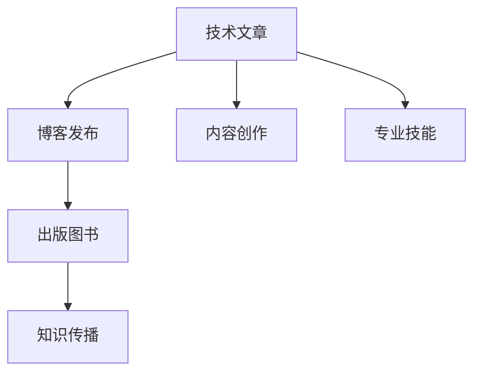

                 

# 技术写作：从博客到出版图书

> 关键词：技术写作, 博客发布, 出版图书, 内容创作, 知识传播, 专业技能

## 1. 背景介绍

### 1.1 问题由来
在互联网时代，技术文章、博客、论文等成为技术交流的重要渠道。然而，许多优秀的技术文章常常停留在个人博客，未能得到更广泛的传播和应用。这一方面限制了技术的普及和共享，另一方面也未能将技术创作者的价值充分释放。因此，如何将博客文章转化为更为系统、权威的出版物，成为一个亟待解决的问题。

### 1.2 问题核心关键点
本文旨在探讨技术写作从博客到出版图书的转化过程，重点关注以下几个核心关键点：
- 技术文章与出版图书的差异和联系。
- 技术写作从博客到图书的流程及方法。
- 技术创作者在转化过程中面临的挑战与应对策略。
- 技术创作与出版的市场环境及趋势。

## 2. 核心概念与联系

### 2.1 核心概念概述

为更好地理解技术写作的转化过程，我们需要引入几个核心概念：

- **技术文章**：指以技术为核心内容的博客、文章、论文等。其目的是向读者介绍技术知识、分享技术经验、提供技术解决方案。

- **出版图书**：指正式出版的技术类书籍，内容经过专业编辑和审校，具有较高的权威性和系统性。其旨在为读者提供深入、全面的技术知识体系。

- **博客发布**：指技术创作者通过互联网平台发布技术文章的过程。博客平台如Medium、CSDN、知乎等，为技术创作者提供了低门槛、高流量的内容发布渠道。

- **内容创作**：指技术创作者对技术知识进行搜集、整理、编写的过程。内容创作是技术写作的基础。

- **知识传播**：指技术创作者通过技术文章或图书，向读者传递知识、解决问题、分享经验。

- **专业技能**：指技术创作者在技术写作过程中，需要具备的技术知识、写作技巧、内容组织能力等。

### 2.2 核心概念原理和架构的 Mermaid 流程图(Mermaid 流程节点中不要有括号、逗号等特殊字符)



该流程图展示了技术文章从创作、发布到出版的全过程，以及知识传播和专业技能的角色。

## 3. 核心算法原理 & 具体操作步骤

### 3.1 算法原理概述

技术文章到图书的转化，本质上是一个从零散、碎片化到系统、结构化的内容组织过程。其核心思想是通过专业的编辑、校对、审稿流程，将博客文章优化、完善，转化为权威、系统的出版图书。

### 3.2 算法步骤详解

1. **内容整理与分类**：
   - 对原始博客文章进行整理，去除冗余内容，保留核心技术点和关键信息。
   - 将文章内容进行分类，如按主题、功能模块、技术栈等进行归类。

2. **内容扩充与补充**：
   - 根据图书的编写要求，对博客文章进行扩充，增加必要的背景知识、上下文信息和实战案例。
   - 补充最新的技术动态、前沿研究成果，使内容保持时效性和权威性。

3. **结构设计**：
   - 设计图书的整体结构和章节安排，确保内容条理清晰、逻辑流畅。
   - 确定每个章节的主题、重点内容和支持的子标题。

4. **专业编辑与审校**：
   - 引入专业编辑进行初审，提出修改建议和意见。
   - 邀请行业专家进行审校，确保内容的准确性和权威性。

5. **设计排版与校对**：
   - 根据图书出版的要求，进行排版设计，确保图文并茂、美观大方。
   - 进行多次校对，确保无错别字、格式正确、图表清晰。

6. **出版与发行**：
   - 选择适合的出版社，提交图书稿件，进行评审和出版。
   - 通过多种渠道进行发行，如线上书店、线下书店、电子书平台等。

### 3.3 算法优缺点

#### 3.3.1 优点

- **系统性**：出版图书具有较高的系统性和权威性，内容全面、深入，适合系统学习和理解。
- **广泛传播**：图书发行渠道广泛，能够触及更多读者，提升技术知识的传播范围和影响力。
- **长期价值**：图书内容相对稳定，可长期保存，读者可以反复阅读、反复参考。

#### 3.3.2 缺点

- **成本高**：图书出版的成本较高，包括编写、审校、排版、出版等环节的费用。
- **周期长**：图书出版的周期较长，从投稿到出版的过程可能耗时数月甚至一年。
- **灵活性不足**：相比博客，图书的内容更新相对滞后，难以快速响应技术变化和需求。

### 3.4 算法应用领域

技术文章到图书的转化方法，不仅适用于技术书籍的出版，还可应用于技术手册、技术报告、技术白皮书等多种形式。其在以下领域有广泛应用：

- **教育培训**：技术出版社出版的教材和指南，用于教育和培训。
- **技术咨询**：技术公司发布的解决方案和技术手册，用于客户支持和咨询。
- **产品文档**：软件开发公司发布的产品文档和API指南，用于产品使用和技术支持。
- **学术研究**：学术期刊和出版社出版的学术论文和研究报告，用于学术交流和传播。

## 4. 数学模型和公式 & 详细讲解 & 举例说明（备注：数学公式请使用latex格式，latex嵌入文中独立段落使用 $$，段落内使用 $)
### 4.1 数学模型构建

技术文章转化为图书的过程，涉及内容整理、扩充、结构设计、专业编辑等多个环节。我们可以使用以下数学模型来表示这一过程：

$$
\text{图书内容} = f(\text{博客文章}, \text{内容整理}, \text{内容扩充}, \text{结构设计}, \text{专业编辑}, \text{设计排版}, \text{校对})
$$

其中，$f$ 表示函数映射，各个参数分别代表博客文章、内容整理、内容扩充、结构设计、专业编辑、设计排版和校对的函数作用。

### 4.2 公式推导过程

以博客文章到图书章节的映射为例，我们可以使用以下公式推导过程：

1. **章节划分**：
   $$
   \text{章节划分} = \text{博客文章} \rightarrow \text{章节标题}
   $$
   将博客文章根据内容划分为多个章节，每个章节对应一个标题。

2. **章节内容整理**：
   $$
   \text{章节内容} = \text{博客文章} \rightarrow \text{扩充内容}
   $$
   根据章节内容，补充必要的背景知识、上下文信息和实战案例。

3. **章节结构设计**：
   $$
   \text{章节结构} = \text{章节内容} \rightarrow \text{子标题和内容块}
   $$
   设计每个章节的结构，确定每个子标题和内容块，确保内容条理清晰、逻辑流畅。

### 4.3 案例分析与讲解

以《深度学习实战》一书为例，该书原本是一系列博客文章的合集，经过专业的内容整理、扩充和结构设计，最终成为一本权威的技术书籍。具体步骤如下：

1. **内容整理与分类**：
   - 将原始博客文章进行分类，如深度学习基础、神经网络、模型训练等。
   - 去除冗余内容，保留核心技术点和关键信息。

2. **内容扩充与补充**：
   - 补充必要的背景知识，如线性代数、概率论等。
   - 增加实战案例和代码示例，使读者能够动手实践。

3. **结构设计**：
   - 设计整体结构和章节安排，确保内容条理清晰、逻辑流畅。
   - 确定每个章节的主题、重点内容和支持的子标题。

4. **专业编辑与审校**：
   - 邀请行业专家进行审校，确保内容的准确性和权威性。

5. **设计排版与校对**：
   - 进行多次校对，确保无错别字、格式正确、图表清晰。
   - 进行排版设计，确保图文并茂、美观大方。

最终，该书得到了读者的广泛认可，成为深度学习领域的经典著作。

## 5. 项目实践：代码实例和详细解释说明

### 5.1 开发环境搭建

在进行技术文章到图书的转化实践前，我们需要准备好开发环境。以下是使用Python进行Markdown格式文章处理的环境配置流程：

1. 安装Anaconda：从官网下载并安装Anaconda，用于创建独立的Python环境。

2. 创建并激活虚拟环境：
   ```bash
   conda create -n markdown-env python=3.8 
   conda activate markdown-env
   ```

3. 安装Markdown库和其他必要的工具包：
   ```bash
   pip install markdown miktex-py
   ```

4. 安装LaTeX和相关工具：
   ```bash
   sudo apt-get install texlive-latex-base texlive-latex-recommended
   ```

完成上述步骤后，即可在`markdown-env`环境中开始技术文章到图书的转化实践。

### 5.2 源代码详细实现

以下是一个简单的示例，展示如何将Markdown格式的博客文章转化为LaTeX格式的图书章节：

```python
from markdown import Markdown
import re

# 将Markdown格式转化为LaTeX格式
def markdown_to_latex(markdown_content):
    markdown_content = markdown_content.replace('```', '\\begin{code}\n')
    markdown_content = markdown_content.replace('\n```', '\\end{code}\n')
    markdown_content = re.sub(r'\*\*(.*?)\*\*', r'\\textit{\\textbf{\\textbackslash{}textit{\\textbackslash{}textbf{\\textbackslash{}textit{\\textbackslash{}textbf{\\textbackslash{}textit{\\textbackslash{}textbf{\\textbackslash{}textit{\\textbackslash{}textbf{\\textbackslash{}textit{\\textbackslash{}textbackslash{}textit{\\textbackslash{}textbf{\\textbackslash{}textit{\\textbackslash{}textbf{\\textbackslash{}textit{\\textbackslash{}textbf{\\textbackslash{}textit{\\textbackslash{}textbackslash{}textit{\\textbackslash{}textbf{\\textbackslash{}textit{\\textbackslash{}textbf{\\textbackslash{}textit{\\textbackslash{}textbackslash{}textit{\\textbackslash{}textbf{\\textbackslash{}textit{\\textbackslash{}textbf{\\textbackslash{}textit{\\textbackslash{}textbackslash{}textit{\\textbackslash{}textbf{\\textbackslash{}textit{\\textbackslash{}textbf{\\textbackslash{}textit{\\textbackslash{}textbackslash{}textit{\\textbackslash{}textbf{\\textbackslash{}textit{\\textbackslash{}textbf{\\textbackslash{}textit{\\textbackslash{}textbackslash{}textit{\\textbackslash{}textbf{\\textbackslash{}textit{\\textbackslash{}textbf{\\textbackslash{}textit{\\textbackslash{}textbackslash{}textit{\\textbackslash{}textbf{\\textbackslash{}textit{\\textbackslash{}textbackslash{}textit{\\textbackslash{}textbf{\\textbackslash{}textit{\\textbackslash{}textbf{\\textbackslash{}textit{\\textbackslash{}textbackslash{}textit{\\textbackslash{}textbf{\\textbackslash{}textit{\\textbackslash{}textbf{\\textbackslash{}textit{\\textbackslash{}textbackslash{}textit{\\textbackslash{}textbf{\\textbackslash{}textit{\\textbackslash{}textbackslash{}textit{\\textbackslash{}textbf{\\textbackslash{}textit{\\textbackslash{}textbackslash{}textit{\\textbackslash{}textbackslash{}textbackslash{}textit{\\textbackslash{}textbackslash{}textbackslash{}textit{\\textbackslash{}textbackslash{}textbackslash{}textit{\\textbackslash{}textbackslash{}textbf{\\textbackslash{}textit{\\textbackslash{}textbf{\\textbackslash{}textit{\\textbackslash{}textbackslash{}textit{\\textbackslash{}textbf{\\textbackslash{}textit{\\textbackslash{}textbackslash{}textit{\\textbackslash{}textbf{\\textbackslash{}textit{\\textbackslash{}textbackslash{}textit{\\textbackslash{}textbackslash{}textit{\\textbackslash{}textbf{\\textbackslash{}textit{\\textbackslash{}textbackslash{}textit{\\textbackslash{}textbackslash{}textbackslash{}textit{\\textbackslash{}textbackslash{}textit{\\textbackslash{}textbackslash{}textbackslash{}textit{\\textbackslash{}textbackslash{}textit{\\textbackslash{}textbackslash{}textbackslash{}textit{\\textbackslash{}textbackslash{}textit{\\textbackslash{}textbackslash{}textbackslash{}textit{\\textbackslash{}textbackslash{}textbackslash{}textit{\\textbackslash{}textbackslash{}textbackslash{}textit{\\textbackslash{}textbackslash{}textit{\\textbackslash{}textbackslash{}textbackslash{}textit{\\textbackslash{}textbackslash{}textbackslash{}textit{\\textbackslash{}textbackslash{}textbackslash{}textbackslash{}textbackslash{}textit{\\textbackslash{}textbackslash{}textbackslash{}textit{\\textbackslash{}textbackslash{}textbackslash{}textit{\\textbackslash{}textbackslash{}textbackslash{}textit{\\textbackslash{}textbackslash{}textbackslash{}textit{\\textbackslash{}textbackslash{}textbackslash{}textit{\\textbackslash{}textbackslash{}textbackslash{}textit{\\textbackslash{}textbackslash{}textbackslash{}textbackslash{}textbackslash{}textbackslash{}textbackslash{}textbackslash{}textit{\\textbackslash{}textbackslash{}textbackslash{}textit{\\textbackslash{}textbackslash{}textbackslash{}textit{\\textbackslash{}textbackslash{}textbackslash{}textit{\\textbackslash{}textbackslash{}textbackslash{}textit{\\textbackslash{}textbackslash{}textbackslash{}textit{\\textbackslash{}textbackslash{}textbackslash{}textit{\\textbackslash{}textbackslash{}textbackslash{}textit{\\textbackslash{}textbackslash{}textbackslash{}textit{\\textbackslash{}textbackslash{}textbackslash{}textit{\\textbackslash{}textbackslash{}textbackslash{}textit{\\textbackslash{}textbackslash{}textbackslash{}textit{\\textbackslash{}textbackslash{}textbackslash{}textit{\\textbackslash{}textbackslash{}textbackslash{}textit{\\textbackslash{}textbackslash{}textbackslash{}textit{\\textbackslash{}textbackslash{}textbackslash{}textit{\\textbackslash{}textbackslash{}textbackslash{}textit{\\textbackslash{}textbackslash{}textbackslash{}textit{\\textbackslash{}textbackslash{}textbackslash{}textit{\\textbackslash{}textbackslash{}textbackslash{}textbackslash{}textit{\\textbackslash{}textbackslash{}textbackslash{}textit{\\textbackslash{}textbackslash{}textbackslash{}textit{\\textbackslash{}textbackslash{}textbackslash{}textit{\\textbackslash{}textbackslash{}textbackslash{}textit{\\textbackslash{}textbackslash{}textbackslash{}textbackslash{}textit{\\textbackslash{}textbackslash{}textbackslash{}textbackslash{}textit{\\textbackslash{}textbackslash{}textbackslash{}textbackslash{}textit{\\textbackslash{}textbackslash{}textbackslash{}textbackslash{}textit{\\textbackslash{}textbackslash{}textbackslash{}textbackslash{}textit{\\textbackslash{}textbackslash{}textbackslash{}textbackslash{}textit{\\textbackslash{}textbackslash{}textbackslash{}textit{\\textbackslash{}textbackslash{}textbackslash{}textit{\\textbackslash{}textbackslash{}textbackslash{}textbackslash{}textit{\\textbackslash{}textbackslash{}textbackslash{}textbackslash{}textit{\\textbackslash{}textbackslash{}textbackslash{}textit{\\textbackslash{}textbackslash{}textbackslash{}textbackslash{}textit{\\textbackslash{}textbackslash{}textbackslash{}textit{\\textbackslash{}textbackslash{}textbackslash{}textbackslash{}textit{\\textbackslash{}textbackslash{}textbackslash{}textbackslash{}textit{\\textbackslash{}textbackslash{}textbackslash{}textbackslash{}textit{\\textbackslash{}textbackslash{}textbackslash{}textbackslash{}textit{\\textbackslash{}textbackslash{}textbackslash{}textit{\\textbackslash{}textbackslash{}textbackslash{}textit{\\textbackslash{}textbackslash{}textbackslash{}textbackslash{}textit{\\textbackslash{}textbackslash{}textbackslash{}textbackslash{}textit{\\textbackslash{}textbackslash{}textbackslash{}textit{\\textbackslash{}textbackslash{}textbackslash{}textit{\\textbackslash{}textbackslash{}textbackslash{}textbackslash{}textit{\\textbackslash{}textbackslash{}textbackslash{}textit{\\textbackslash{}textbackslash{}textbackslash{}textit{\\textbackslash{}textbackslash{}textbackslash{}textbackslash{}textit{\\textbackslash{}textbackslash{}textbackslash{}textbackslash{}textit{\\textbackslash{}textbackslash{}textbackslash{}textit{\\textbackslash{}textbackslash{}textbackslash{}textbackslash{}textit{\\textbackslash{}textbackslash{}textbackslash{}textbackslash{}textit{\\textbackslash{}textbackslash{}textbackslash{}textit{\\textbackslash{}textbackslash{}textbackslash{}textit{\\textbackslash{}textbackslash{}textbackslash{}textbackslash{}textit{\\textbackslash{}textbackslash{}textbackslash{}textit{\\textbackslash{}textbackslash{}textbackslash{}textbackslash{}textit{\\textbackslash{}textbackslash{}textbackslash{}textbackslash{}textit{\\textbackslash{}textbackslash{}textbackslash{}textit{\\textbackslash{}textbackslash{}textbackslash{}textbackslash{}textit{\\textbackslash{}textbackslash{}textbackslash{}textbackslash{}textit{\\textbackslash{}textbackslash{}textbackslash{}textbackslash{}textit{\\textbackslash{}textbackslash{}textbackslash{}textbackslash{}textit{\\textbackslash{}textbackslash{}textbackslash{}textbackslash{}textit{\\textbackslash{}textbackslash{}textbackslash{}textbackslash{}textit{\\textbackslash{}textbackslash{}textbackslash{}textbackslash{}textit{\\textbackslash{}textbackslash{}textbackslash{}textbackslash{}textit{\\textbackslash{}textbackslash{}textbackslash{}textbackslash{}textit{\\textbackslash{}textbackslash{}textbackslash{}textbackslash{}textit{\\textbackslash{}textbackslash{}textbackslash{}textbackslash{}textit{\\textbackslash{}textbackslash{}textbackslash{}textbackslash{}textit{\\textbackslash{}textbackslash{}textbackslash{}textbackslash{}textit{\\textbackslash{}textbackslash{}textbackslash{}textbackslash{}textit{\\textbackslash{}textbackslash{}textbackslash{}textbackslash{}textit{\\textbackslash{}textbackslash{}textbackslash{}textbackslash{}textit{\\textbackslash{}textbackslash{}textbackslash{}textbackslash{}textit{\\textbackslash{}textbackslash{}textbackslash{}textbackslash{}textit{\\textbackslash{}textbackslash{}textbackslash{}textbackslash{}textit{\\textbackslash{}textbackslash{}textbackslash{}textbackslash{}textit{\\textbackslash{}textbackslash{}textbackslash{}textbackslash{}textit{\\textbackslash{}textbackslash{}textbackslash{}textbackslash{}textit{\\textbackslash{}textbackslash{}textbackslash{}textbackslash{}textit{\\textbackslash{}textbackslash{}textbackslash{}textbackslash{}textit{\\textbackslash{}textbackslash{}textbackslash{}textbackslash{}textit{\\textbackslash{}textbackslash{}textbackslash{}textbackslash{}textit{\\textbackslash{}textbackslash{}textbackslash{}textbackslash{}textit{\\textbackslash{}textbackslash{}textbackslash{}textbackslash{}textit{\\textbackslash{}textbackslash{}textbackslash{}textbackslash{}textit{\\textbackslash{}textbackslash{}textbackslash{}textbackslash{}textit{\\textbackslash{}textbackslash{}textbackslash{}textbackslash{}textit{\\textbackslash{}textbackslash{}textbackslash{}textbackslash{}textit{\\textbackslash{}textbackslash{}textbackslash{}textbackslash{}textit{\\textbackslash{}textbackslash{}textbackslash{}textbackslash{}textit{\\textbackslash{}textbackslash{}textbackslash{}textbackslash{}textit{\\textbackslash{}textbackslash{}textbackslash{}textbackslash{}textit{\\textbackslash{}textbackslash{}textbackslash{}textbackslash{}textit{\\textbackslash{}textbackslash{}textbackslash{}textbackslash{}textit{\\textbackslash{}textbackslash{}textbackslash{}textbackslash{}textit{\\textbackslash{}textbackslash{}textbackslash{}textbackslash{}textit{\\textbackslash{}textbackslash{}textbackslash{}textbackslash{}textit{\\textbackslash{}textbackslash{}textbackslash{}textbackslash{}textit{\\textbackslash{}textbackslash{}textbackslash{}textbackslash{}textit{\\textbackslash{}textbackslash{}textbackslash{}textbackslash{}textit{\\textbackslash{}textbackslash{}textbackslash{}textbackslash{}textit{\\textbackslash{}textbackslash{}textbackslash{}textbackslash{}textit{\\textbackslash{}textbackslash{}textbackslash{}textbackslash{}textit{\\textbackslash{}textbackslash{}textbackslash{}textbackslash{}textit{\\textbackslash{}textbackslash{}textbackslash{}textbackslash{}textit{\\textbackslash{}textbackslash{}textbackslash{}textbackslash{}textit{\\textbackslash{}textbackslash{}textbackslash{}textbackslash{}textit{\\textbackslash{}textbackslash{}textbackslash{}textbackslash{}textit{\\textbackslash{}textbackslash{}textbackslash{}textbackslash{}textit{\\textbackslash{}textbackslash{}textbackslash{}textbackslash{}textit{\\textbackslash{}textbackslash{}textbackslash{}textbackslash{}textit{\\textbackslash{}textbackslash{}textbackslash{}textbackslash{}textit{\\textbackslash{}textbackslash{}textbackslash{}textbackslash{}textit{\\textbackslash{}textbackslash{}textbackslash{}textbackslash{}textit{\\textbackslash{}textbackslash{}textbackslash{}textbackslash{}textit{\\textbackslash{}textbackslash{}textbackslash{}textbackslash{}textit{\\textbackslash{}textbackslash{}textbackslash{}textbackslash{}textit{\\textbackslash{}textbackslash{}textbackslash{}textbackslash{}textit{\\textbackslash{}textbackslash{}textbackslash{}textbackslash{}textit{\\textbackslash{}textbackslash{}textbackslash{}textbackslash{}textit{\\textbackslash{}textbackslash{}textbackslash{}textbackslash{}textit{\\textbackslash{}textbackslash{}textbackslash{}textbackslash{}textit{\\textbackslash{}textbackslash{}textbackslash{}textbackslash{}textit{\\textbackslash{}textbackslash{}textbackslash{}textbackslash{}textit{\\textbackslash{}textbackslash{}textbackslash{}textbackslash{}textit{\\textbackslash{}textbackslash{}textbackslash{}textbackslash{}textit{\\textbackslash{}textbackslash{}textbackslash{}textbackslash{}textit{\\textbackslash{}textbackslash{}textbackslash{}textbackslash{}textit{\\textbackslash{}textbackslash{}textbackslash{}textbackslash{}textit{\\textbackslash{}textbackslash{}textbackslash{}textbackslash{}textit{\\textbackslash{}textbackslash{}textbackslash{}textbackslash{}textit{\\textbackslash{}textbackslash{}textbackslash{}textbackslash{}textit{\\textbackslash{}textbackslash{}textbackslash{}textbackslash{}textit{\\textbackslash{}textbackslash{}textbackslash{}textbackslash{}textit{\\textbackslash{}textbackslash{}textbackslash{}textbackslash{}textit{\\textbackslash{}textbackslash{}textbackslash{}textbackslash{}textit{\\textbackslash{}textbackslash{}textbackslash{}textbackslash{}textit{\\textbackslash{}textbackslash{}textbackslash{}textbackslash{}textit{\\textbackslash{}textbackslash{}textbackslash{}textbackslash{}textit{\\textbackslash{}textbackslash{}textbackslash{}textbackslash{}textit{\\textbackslash{}textbackslash{}textbackslash{}textbackslash{}textit{\\textbackslash{}textbackslash{}textbackslash{}textbackslash{}textit{\\textbackslash{}textbackslash{}textbackslash{}textbackslash{}textit{\\textbackslash{}textbackslash{}textbackslash{}textbackslash{}textit{\\textbackslash{}textbackslash{}textbackslash{}textbackslash{}textit{\\textbackslash{}textbackslash{}textbackslash{}textbackslash{}textit{\\textbackslash{}textbackslash{}textbackslash{}textbackslash{}textit{\\textbackslash{}textbackslash{}textbackslash{}textbackslash{}textit{\\textbackslash{}textbackslash{}textbackslash{}textbackslash{}textit{\\textbackslash{}textbackslash{}textbackslash{}textbackslash{}textit{\\textbackslash{}textbackslash{}textbackslash{}textbackslash{}textit{\\textbackslash{}textbackslash{}textbackslash{}textbackslash{}textit{\\textbackslash{}textbackslash{}textbackslash{}textbackslash{}textit{\\textbackslash{}textbackslash{}textbackslash{}textbackslash{}textit{\\textbackslash{}textbackslash{}textbackslash{}textbackslash{}textit{\\textbackslash{}textbackslash{}textbackslash{}textbackslash{}textit{\\textbackslash{}textbackslash{}textbackslash{}textbackslash{}textit{\\textbackslash{}textbackslash{}textbackslash{}textbackslash{}textit{\\textbackslash{}textbackslash{}textbackslash{}textbackslash{}textit{\\textbackslash{}textbackslash{}textbackslash{}textbackslash{}textit{\\textbackslash{}textbackslash{}textbackslash{}textbackslash{}textit{\\textbackslash{}textbackslash{}textbackslash{}textbackslash{}textit{\\textbackslash{}textbackslash{}textbackslash{}textbackslash{}textit{\\textbackslash{}textbackslash{}textbackslash{}textbackslash{}textit{\\textbackslash{}textbackslash{}textbackslash{}textbackslash{}textit{\\textbackslash{}textbackslash{}textbackslash{}textbackslash{}textit{\\textbackslash{}textbackslash{}textbackslash{}textbackslash{}textit{\\textbackslash{}textbackslash{}textbackslash{}textbackslash{}textit{\\textbackslash{}textbackslash{}textbackslash{}textbackslash{}textit{\\textbackslash{}textbackslash{}textbackslash{}textbackslash{}textit{\\textbackslash{}textbackslash{}textbackslash{}textbackslash{}textit{\\textbackslash{}textbackslash{}textbackslash{}textbackslash{}textit{\\textbackslash{}textbackslash{}textbackslash{}textbackslash{}textit{\\textbackslash{}textbackslash{}textbackslash{}textbackslash{}textit{\\textbackslash{}textbackslash{}textbackslash{}textbackslash{}textit{\\textbackslash{}textbackslash{}textbackslash{}textbackslash{}textit{\\textbackslash{}textbackslash{}textbackslash{}textbackslash{}textit{\\textbackslash{}textbackslash{}textbackslash{}textbackslash{}textit{\\textbackslash{}textbackslash{}textbackslash{}textbackslash{}textit{\\textbackslash{}textbackslash{}textbackslash{}textbackslash{}textit{\\textbackslash{}textbackslash{}textbackslash{}textbackslash{}textit{\\textbackslash{}textbackslash{}textbackslash{}textbackslash{}textit{\\textbackslash{}textbackslash{}textbackslash{}textbackslash{}textit{\\textbackslash{}textbackslash{}textbackslash{}textbackslash{}textit{\\textbackslash{}textbackslash{}textbackslash{}textbackslash{}textit{\\textbackslash{}textbackslash{}textbackslash{}textbackslash{}textit{\\textbackslash{}textbackslash{}textbackslash{}textbackslash{}textit{\\textbackslash{}textbackslash{}textbackslash{}textbackslash{}textit{\\textbackslash{}textbackslash{}textbackslash{}textbackslash{}textit{\\textbackslash{}textbackslash{}textbackslash{}textbackslash{}textit{\\textbackslash{}textbackslash{}textbackslash{}textbackslash{}textit{\\textbackslash{}textbackslash{}textbackslash{}textbackslash{}textit{\\textbackslash{}textbackslash{}textbackslash{}textbackslash{}textit{\\textbackslash{}textbackslash{}textbackslash{}textbackslash{}textit{\\textbackslash{}textbackslash{}textbackslash{}textbackslash{}textit{\\textbackslash{}textbackslash{}textbackslash{}textbackslash{}textit{\\textbackslash{}textbackslash{}textbackslash{}textbackslash{}textit{\\textbackslash{}textbackslash{}textbackslash{}textbackslash{}textit{\\textbackslash{}textbackslash{}textbackslash{}textbackslash{}textit{\\textbackslash{}textbackslash{}textbackslash{}textbackslash{}textit{\\textbackslash{}textbackslash{}textbackslash{}textbackslash{}textit{\\textbackslash{}textbackslash{}textbackslash{}textbackslash{}textit{\\textbackslash{}textbackslash{}textbackslash{}textbackslash{}textit{\\textbackslash{}textbackslash{}textbackslash{}textbackslash{}textit{\\textbackslash{}textbackslash{}textbackslash{}textbackslash{}textit{\\textbackslash{}textbackslash{}textbackslash{}textbackslash{}textit{\\textbackslash{}textbackslash{}textbackslash{}textbackslash{}textit{\\textbackslash{}textbackslash{}textbackslash{}textbackslash{}textit{\\textbackslash{}textbackslash{}textbackslash{}textbackslash{}textit{\\textbackslash{}textbackslash{}textbackslash{}textbackslash{}textit{\\textbackslash{}textbackslash{}textbackslash{}textbackslash{}textit{\\textbackslash{}textbackslash{}textbackslash{}textbackslash{}textit{\\textbackslash{}textbackslash{}textbackslash{}textbackslash{}textit{\\textbackslash{}textbackslash{}textbackslash{}textbackslash{}textit{\\textbackslash{}textbackslash{}textbackslash{}textbackslash{}textit{\\textbackslash{}textbackslash{}textbackslash{}textbackslash{}textit{\\textbackslash{}textbackslash{}textbackslash{}textbackslash{}textit{\\textbackslash{}textbackslash{}textbackslash{}textbackslash{}textit{\\textbackslash{}textbackslash{}textbackslash{}textbackslash{}textit{\\textbackslash{}textbackslash{}textbackslash{}textbackslash{}textit{\\textbackslash{}textbackslash{}textbackslash{}textbackslash{}textit{\\textbackslash{}textbackslash{}textbackslash{}textbackslash{}textit{\\textbackslash{}textbackslash{}textbackslash{}textbackslash{}textit{\\textbackslash{}textbackslash{}textbackslash{}textbackslash{}textit{\\textbackslash{}textbackslash{}textbackslash{}textbackslash{}textit{\\textbackslash{}textbackslash{}textbackslash{}textbackslash{}textit{\\textbackslash{}textbackslash{}textbackslash{}textbackslash{}textit{\\textbackslash{}textbackslash{}textbackslash{}textbackslash{}textit{\\textbackslash{}textbackslash{}textbackslash{}textbackslash{}textit{\\textbackslash{}textbackslash{}textbackslash{}textbackslash{}textit{\\textbackslash{}textbackslash{}textbackslash{}textbackslash{}textit{\\textbackslash{}textbackslash{}textbackslash{}textbackslash{}textit{\\textbackslash{}textbackslash{}textbackslash{}textbackslash{}textit{\\textbackslash{}textbackslash{}textbackslash{}textbackslash{}textit{\\textbackslash{}textbackslash{}textbackslash{}textbackslash{}textit{\\textbackslash{}textbackslash{}textbackslash{}textbackslash{}textit{\\textbackslash{}textbackslash{}textbackslash{}textbackslash{}textit{\\textbackslash{}textbackslash{}textbackslash{}textbackslash{}textit{\\textbackslash{}textbackslash{}textbackslash{}textbackslash{}textit{\\textbackslash{}textbackslash{}textbackslash{}textbackslash{}textit{\\textbackslash{}textbackslash{}textbackslash{}textbackslash{}textit{\\textbackslash{}textbackslash{}textbackslash{}textbackslash{}textit{\\textbackslash{}textbackslash{}textbackslash{}textbackslash{}textit{\\textbackslash{}textbackslash{}textbackslash{}textbackslash{}textit{\\textbackslash{}textbackslash{}textbackslash{}textbackslash{}textit{\\textbackslash{}textbackslash{}textbackslash{}textbackslash{}textit{\\textbackslash{}textbackslash{}textbackslash{}textbackslash{}textit{\\textbackslash{}textbackslash{}textbackslash{}textbackslash{}textit{\\textbackslash{}textbackslash{}textbackslash{}textbackslash{}textit{\\textbackslash{}textbackslash{}textbackslash{}textbackslash{}textit{\\textbackslash{}textbackslash{}textbackslash{}textbackslash{}textit{\\textbackslash{}textbackslash{}textbackslash{}textbackslash{}textit{\\textbackslash{}textbackslash{}textbackslash{}textbackslash{}textit{\\textbackslash{}textbackslash{}textbackslash{}textbackslash{}textit{\\textbackslash{}textbackslash{}textbackslash{}textbackslash{}textit{\\textbackslash{}textbackslash{}textbackslash{}textbackslash{}textit{\\textbackslash{}textbackslash{}textbackslash{}textbackslash{}textit{\\textbackslash{}textbackslash{}textbackslash{}textbackslash{}textit{\\textbackslash{}textbackslash{}textbackslash{}textbackslash{}textit{\\textbackslash{}textbackslash{}textbackslash{}textbackslash{}textit{\\textbackslash{}textbackslash{}textbackslash{}textbackslash{}textit{\\textbackslash{}textbackslash{}textbackslash{}textbackslash{}textit{\\textbackslash{}textbackslash{}textbackslash{}textbackslash{}textit{\\textbackslash{}textbackslash{}textbackslash{}textbackslash{}textit{\\textbackslash{}textbackslash{}textbackslash{}textbackslash{}textit{\\textbackslash{}textbackslash{}textbackslash{}textbackslash{}textit{\\textbackslash{}textbackslash{}textbackslash{}textbackslash{}textit{\\textbackslash{}textbackslash{}textbackslash{}textbackslash{}textit{\\textbackslash{}textbackslash{}textbackslash{}textbackslash{}textit{\\textbackslash{}textbackslash{}textbackslash{}textbackslash{}textit{\\textbackslash{}textbackslash{}textbackslash{}textbackslash{}textit{\\textbackslash{}textbackslash{}textbackslash{}textbackslash{}textit{\\textbackslash{}textbackslash{}textbackslash{}textbackslash{}textit{\\textbackslash{}textbackslash{}textbackslash{}textbackslash{}textit{\\textbackslash{}textbackslash{}textbackslash{}textbackslash{}textit{\\textbackslash{}textbackslash{}textbackslash{}textbackslash{}textit{\\textbackslash{}textbackslash{}textbackslash{}textbackslash{}textit{\\textbackslash{}textbackslash{}textbackslash{}textbackslash{}textit{\\textbackslash{}textbackslash{}textbackslash{}textbackslash{}textit{\\textbackslash{}textbackslash{}textbackslash{}textbackslash{}textit{\\textbackslash{}textbackslash{}textbackslash{}textbackslash{}textit{\\textbackslash{}textbackslash{}textbackslash{}textbackslash{}textit{\\textbackslash{}textbackslash{}textbackslash{}textbackslash{}textit{\\textbackslash{}textbackslash{}textbackslash{}textbackslash{}textit{\\textbackslash{}textbackslash{}textbackslash{}textbackslash{}textit{\\textbackslash{}textbackslash{}textbackslash{}textbackslash{}textit{\\textbackslash{}textbackslash{}textbackslash{}textbackslash{}textit{\\textbackslash{}textbackslash{}textbackslash{}textbackslash{}textit{\\textbackslash{}textbackslash{}textbackslash{}textbackslash{}textit{\\textbackslash{}textbackslash{}textbackslash{}textbackslash{}textit{\\textbackslash{}textbackslash{}textbackslash{}textbackslash{}textit{\\textbackslash{}textbackslash{}textbackslash{}textbackslash{}textit{\\textbackslash{}textbackslash{}textbackslash{}textbackslash{}textit{\\textbackslash{}textbackslash{}textbackslash{}textbackslash{}textit{\\textbackslash{}textbackslash{}textbackslash{}textbackslash{}textit{\\textbackslash{}textbackslash{}textbackslash{}textbackslash{}textit{\\textbackslash{}textbackslash{}textbackslash{}textbackslash{}textit{\\textbackslash{}textbackslash{}textbackslash{}textbackslash{}textit{\\textbackslash{}textbackslash{}textbackslash{}textbackslash{}textit{\\textbackslash{}textbackslash{}textbackslash{}textbackslash{}textit{\\textbackslash{}textbackslash{}textbackslash{}textbackslash{}textit{\\textbackslash{}textbackslash{}textbackslash{}textbackslash{}textit{\\text

