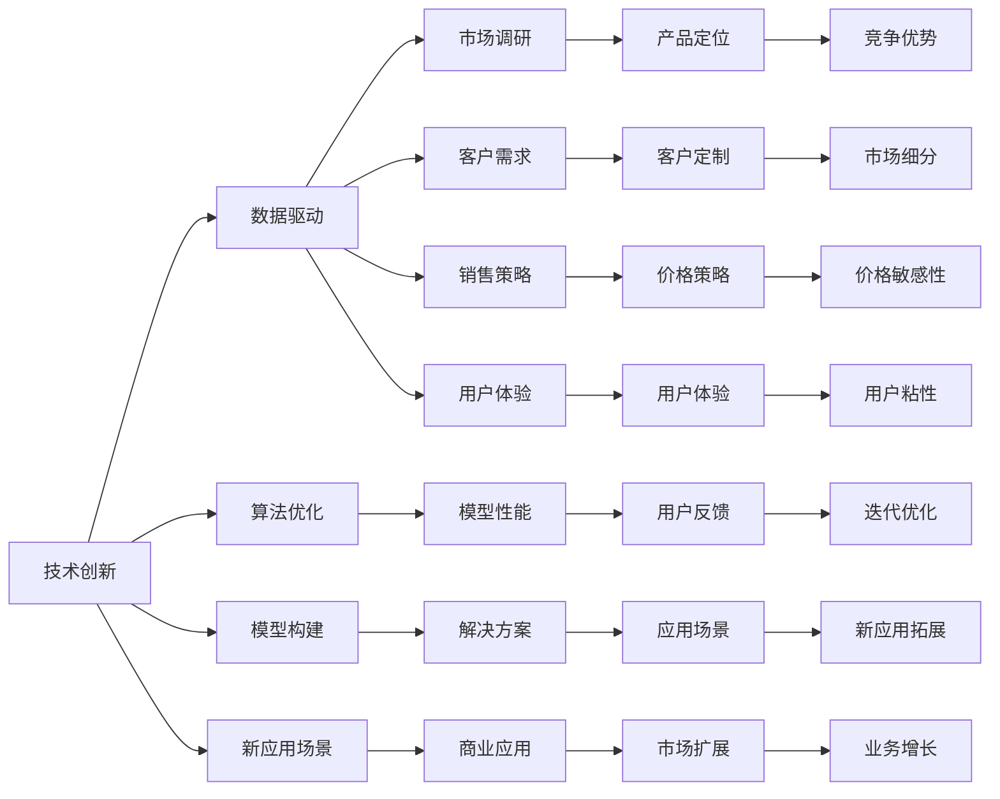

                 

# 技术创新与商业模式：Lepton AI的双轮驱动

> 关键词：技术创新,商业模式,Lepton AI,双轮驱动,数据驱动,业务增长,人工智能(AI),深度学习,数据科学,机器学习

## 1. 背景介绍

### 1.1 问题由来

在过去的十年中，人工智能(AI)技术迅猛发展，尤其是在深度学习领域，取得了令人瞩目的成就。这一系列的突破，不仅推动了AI技术本身的发展，也催生了新的商业模式和应用场景。在这一波AI浪潮中，Lepton AI逐渐崛起，成为人工智能领域的一颗璀璨新星。

Lepton AI的崛起并非偶然，而是得益于其独特的技术创新和商业模式。一方面，Lepton AI专注于AI技术本身，持续进行技术研发和突破；另一方面，其灵活的商业模式，使得AI技术能够快速落地应用，形成良好的商业循环。本文将从技术创新和商业模式两方面深入探讨Lepton AI的双轮驱动机制。

### 1.2 问题核心关键点

Lepton AI的成功得益于其双重驱动：技术创新和商业模式。两者相互促进，共同推动了公司的发展。具体来说，技术创新为其商业模式提供了坚实的基础，而商业模式则为技术创新提供了持续的资金和资源支持。以下将从技术创新和商业模式两个维度深入分析Lepton AI的双轮驱动机制。

## 2. 核心概念与联系

### 2.1 核心概念概述

为更好地理解Lepton AI的双轮驱动机制，我们需要先介绍几个关键概念：

- **技术创新**：包括但不限于深度学习、机器学习、自然语言处理(NLP)等AI技术的发展和创新。技术创新是Lepton AI发展的核心驱动力。
- **商业模式**：包括产品、市场、销售渠道、定价策略等，这些因素共同决定了公司如何实现价值创造和收益。
- **双轮驱动**：技术创新和商业模式的相互促进，共同推动公司发展的机制。Lepton AI通过技术创新和商业模式的协同，实现了快速发展。

### 2.2 核心概念原理和架构的 Mermaid 流程图(Mermaid 流程节点中不要有括号、逗号等特殊字符)



此流程图展示了Lepton AI双轮驱动机制的核心概念和联系。技术创新为Lepton AI提供了不断进化的核心竞争力，而商业模式则确保了这些技术能够被市场和用户接受，实现商业价值。

## 3. 核心算法原理 & 具体操作步骤

### 3.1 算法原理概述

Lepton AI的技术创新主要集中在以下几个方面：

- **深度学习算法**：通过不断优化和改进深度学习算法，提升模型的性能和泛化能力。
- **自然语言处理(NLP)**：利用自然语言处理技术，提升AI与人类交互的自然性和理解能力。
- **机器学习**：通过机器学习算法，不断提升AI模型的预测准确性和决策能力。

这些技术创新不仅提升了Lepton AI的技术实力，也为公司提供了持续发展的动力。

### 3.2 算法步骤详解

Lepton AI的技术创新过程一般包括以下几个关键步骤：

1. **数据收集与处理**：收集大量有代表性的数据，并进行预处理、清洗和标注。
2. **模型构建与训练**：选择合适的算法和模型结构，进行模型构建和训练。
3. **性能评估与优化**：通过评估模型的性能指标，不断优化模型结构和参数设置。
4. **应用场景探索**：将训练好的模型应用于不同的实际场景，探索新的应用领域。
5. **持续迭代**：根据反馈和需求，不断迭代和优化模型和算法。

通过这一系列步骤，Lepton AI能够不断提升其技术实力，保持行业领先地位。

### 3.3 算法优缺点

Lepton AI的技术创新过程具有以下优点：

- **持续进步**：通过不断迭代和优化，Lepton AI能够持续提升其技术实力，保持行业领先。
- **灵活应用**：Lepton AI的技术可以应用于多个领域，包括金融、医疗、教育等，形成多业务布局。
- **市场竞争力**：技术创新为Lepton AI提供了强大的市场竞争力，帮助其在激烈的市场竞争中脱颖而出。

同时，技术创新也存在一些缺点：

- **高成本**：技术研发和创新需要大量的资金和时间投入，成本较高。
- **技术风险**：技术创新过程中可能存在技术瓶颈和风险，需要不断探索和应对。
- **市场接受度**：技术创新需要市场和用户的认可，否则难以实现商业价值。

### 3.4 算法应用领域

Lepton AI的技术创新在多个领域得到了广泛应用，包括：

- **金融科技**：利用深度学习和大数据技术，提升金融风险管理和投资决策能力。
- **医疗健康**：通过自然语言处理技术，提升疾病诊断和治疗建议的准确性。
- **教育科技**：利用AI技术，提升在线教育和个性化学习的效率和效果。
- **智能家居**：通过语音和图像识别技术，提升家居智能化水平。

这些应用领域不仅展示了Lepton AI技术的多样性，也展示了其强大的市场潜力。

## 4. 数学模型和公式 & 详细讲解 & 举例说明

### 4.1 数学模型构建

Lepton AI在技术创新过程中，构建了多个数学模型。以下以深度学习模型为例，介绍其构建过程：

假设输入数据为 $x$，输出为 $y$，深度学习模型可以表示为：

$$
y = f(x; \theta)
$$

其中 $f$ 为模型函数， $\theta$ 为模型参数。深度学习模型通过反向传播算法，最小化损失函数 $L$ 来优化参数 $\theta$：

$$
\theta = \mathop{\arg\min}_{\theta} L(y, f(x; \theta))
$$

常用的损失函数包括交叉熵损失、均方误差损失等。

### 4.2 公式推导过程

以下以交叉熵损失为例，推导其公式：

假设模型输出为 $y_{pred}$，真实标签为 $y_{real}$，则交叉熵损失可以表示为：

$$
L(y_{pred}, y_{real}) = -\frac{1}{N}\sum_{i=1}^N y_{real,i} \log(y_{pred,i}) + (1 - y_{real,i}) \log(1 - y_{pred,i})
$$

其中 $N$ 为样本数量。

### 4.3 案例分析与讲解

以Lepton AI在金融科技领域的深度学习应用为例，介绍其在模型构建和训练过程中的关键步骤：

1. **数据准备**：收集金融市场的历史交易数据，进行清洗和预处理。
2. **模型构建**：选择适合的深度学习模型，如卷积神经网络(CNN)或循环神经网络(RNN)。
3. **训练过程**：使用交叉熵损失函数，通过反向传播算法最小化损失函数，不断优化模型参数。
4. **性能评估**：在测试数据集上评估模型的预测准确率和鲁棒性。
5. **应用实践**：将训练好的模型应用于金融风险评估和投资决策中，提升业务效果。

## 5. 项目实践：代码实例和详细解释说明

### 5.1 开发环境搭建

要进行Lepton AI的深度学习模型开发，首先需要搭建开发环境。以下是一个简单的开发环境搭建流程：

1. **安装Python和相关库**：安装Python 3.6及以上版本，并使用pip安装必要的库，如TensorFlow、Keras等。
2. **配置开发环境**：创建虚拟环境，安装必要的依赖包，如NVIDIA GPU驱动程序、CUDA等。
3. **设置数据集**：准备好训练数据和测试数据，存储在本地或远程服务器上。
4. **配置训练脚本**：编写训练脚本，配置模型参数和训练过程。

### 5.2 源代码详细实现

以下是一个简单的深度学习模型训练脚本，以Lepton AI在金融科技领域的深度学习应用为例：

```python
import tensorflow as tf
from tensorflow.keras import layers

# 定义模型
model = tf.keras.Sequential([
    layers.Dense(64, activation='relu', input_shape=(input_dim,)),
    layers.Dense(1, activation='sigmoid')
])

# 编译模型
model.compile(optimizer='adam', loss='binary_crossentropy', metrics=['accuracy'])

# 训练模型
model.fit(x_train, y_train, epochs=10, batch_size=32, validation_data=(x_test, y_test))

# 评估模型
model.evaluate(x_test, y_test)
```

### 5.3 代码解读与分析

上述代码展示了Lepton AI在金融科技领域的深度学习应用。首先，定义了一个简单的深度学习模型，包括两个全连接层。然后，使用二元交叉熵作为损失函数，进行模型训练。最后，评估模型在测试数据集上的表现。

## 6. 实际应用场景

### 6.1 金融科技

Lepton AI在金融科技领域的应用非常广泛，通过深度学习和大数据技术，帮助金融机构提升风险管理和投资决策能力。具体应用包括：

- **风险评估**：利用深度学习模型，对客户的信用评分和风险进行预测。
- **投资决策**：通过分析历史交易数据，预测市场趋势和投资机会。
- **欺诈检测**：识别和预防金融欺诈行为，保护客户资产安全。

### 6.2 医疗健康

在医疗健康领域，Lepton AI利用自然语言处理技术，提升了疾病的诊断和治疗建议的准确性。具体应用包括：

- **病历分析**：通过分析患者的病历记录，预测疾病发展趋势和可能的并发症。
- **药物研发**：利用深度学习技术，加速新药的研发和测试。
- **个性化治疗**：根据患者的基因信息和病史，提供个性化的治疗方案。

### 6.3 教育科技

Lepton AI在教育科技领域的应用主要集中在个性化学习和智能教育平台。具体应用包括：

- **在线教育**：通过自然语言处理技术，提升在线教育的互动性和个性化。
- **学习推荐**：根据学生的学习记录和行为，推荐合适的学习内容和资源。
- **智能辅导**：利用AI技术，提供智能化的学习辅导和答疑服务。

### 6.4 智能家居

Lepton AI在智能家居领域的应用主要集中在语音识别和图像识别技术。具体应用包括：

- **语音控制**：通过语音识别技术，实现家居设备的智能控制。
- **图像识别**：利用深度学习技术，识别人物和物体，提升家居智能化水平。
- **安全监控**：通过图像识别技术，监测家庭环境的安全性。

## 7. 工具和资源推荐

### 7.1 学习资源推荐

为了帮助开发者系统掌握Lepton AI的技术创新和商业模式，以下是一些优质的学习资源：

1. **Lepton AI官方文档**：Lepton AI的官方文档详细介绍了其技术创新和商业模式的实现过程，是学习其核心技术的最佳资源。
2. **机器学习相关课程**：如Coursera、edX等平台上的机器学习相关课程，可以帮助开发者全面了解深度学习和自然语言处理等技术。
3. **人工智能相关书籍**：如《深度学习》、《Python深度学习》等书籍，深入浅出地介绍了AI技术的核心原理和实现细节。
4. **Lepton AI博客和社区**：Lepton AI的博客和社区提供了丰富的技术文章和讨论，可以帮助开发者及时了解行业动态和最新技术进展。

### 7.2 开发工具推荐

要实现Lepton AI的技术创新和商业模式，以下工具必不可少：

1. **TensorFlow**：由Google开发的深度学习框架，支持多种模型结构和优化算法。
2. **Keras**：一个高级深度学习API，简单易用，支持多种后端引擎。
3. **PyTorch**：由Facebook开发的深度学习框架，灵活性高，适合研究性工作。
4. **Jupyter Notebook**：一个交互式编程环境，适合快速迭代和原型开发。

### 7.3 相关论文推荐

Lepton AI的技术创新和商业模式得益于众多学术论文的支持。以下是几篇奠基性的相关论文，推荐阅读：

1. **深度学习在金融科技中的应用**：探讨了深度学习在金融风险管理和投资决策中的应用。
2. **自然语言处理在医疗健康中的应用**：介绍了自然语言处理技术在疾病诊断和治疗中的应用。
3. **机器学习在教育科技中的应用**：分析了机器学习技术在在线教育和个性化学习中的应用。
4. **智能家居中的语音和图像识别技术**：探讨了深度学习在语音识别和图像识别技术中的应用。

## 8. 总结：未来发展趋势与挑战

### 8.1 研究成果总结

Lepton AI在技术创新和商业模式方面取得了显著成就，以下是其核心研究成果的总结：

- **技术创新**：通过深度学习和大数据技术，提升了AI模型的性能和应用范围。
- **商业模式**：通过灵活的商业模式，实现了技术的快速落地和市场拓展。
- **双轮驱动**：技术创新和商业模式的协同，推动了公司持续发展和市场竞争力的提升。

### 8.2 未来发展趋势

展望未来，Lepton AI的技术创新和商业模式将呈现以下几个发展趋势：

1. **技术集成化**：随着AI技术的不断进步，Lepton AI将逐步实现技术集成化，提供更加全面的解决方案。
2. **产品多样化**：Lepton AI将拓展更多应用场景，提供多样化的产品和服务。
3. **市场全球化**：Lepton AI将进军国际市场，提升全球竞争力。
4. **持续创新**：Lepton AI将持续进行技术研发和创新，保持行业领先。

### 8.3 面临的挑战

尽管Lepton AI在技术创新和商业模式方面取得了显著成就，但未来仍面临诸多挑战：

1. **技术瓶颈**：AI技术的发展需要突破当前的技术瓶颈，提升模型的性能和泛化能力。
2. **市场竞争**：随着AI技术的普及，Lepton AI将面临来自其他企业的激烈竞争。
3. **数据隐私**：AI技术的普及带来了数据隐私和安全问题，Lepton AI需要加强数据保护和隐私保护。
4. **法规限制**：AI技术的应用需要遵守相关法规和政策，Lepton AI需要不断调整和优化商业模式。

### 8.4 研究展望

未来，Lepton AI需要在以下几个方面进行深入研究：

1. **AI与业务融合**：进一步探索AI技术在各个业务领域的应用，提升业务效率和竞争力。
2. **技术可解释性**：提升AI模型的可解释性，增强客户信任和接受度。
3. **跨领域应用**：拓展AI技术在多个领域的应用，形成更多的商业机会。
4. **伦理和合规**：加强AI技术的伦理和合规研究，确保技术应用符合社会价值观和法律法规。

## 9. 附录：常见问题与解答

**Q1: Lepton AI的技术创新主要有哪些方面？**

A: Lepton AI的技术创新主要集中在以下几个方面：

- **深度学习算法**：通过不断优化和改进深度学习算法，提升模型的性能和泛化能力。
- **自然语言处理(NLP)**：利用自然语言处理技术，提升AI与人类交互的自然性和理解能力。
- **机器学习**：通过机器学习算法，不断提升AI模型的预测准确性和决策能力。

**Q2: Lepton AI的商业模式如何实现？**

A: Lepton AI的商业模式主要包括以下几个方面：

- **产品多样化**：提供多种AI产品和服务，满足不同用户的需求。
- **市场全球化**：拓展国际市场，提升全球竞争力。
- **持续创新**：不断进行技术研发和创新，保持行业领先。

**Q3: Lepton AI在金融科技领域的应用有哪些？**

A: Lepton AI在金融科技领域的应用主要包括以下几个方面：

- **风险评估**：利用深度学习模型，对客户的信用评分和风险进行预测。
- **投资决策**：通过分析历史交易数据，预测市场趋势和投资机会。
- **欺诈检测**：识别和预防金融欺诈行为，保护客户资产安全。

**Q4: Lepton AI在医疗健康领域的应用有哪些？**

A: Lepton AI在医疗健康领域的应用主要包括以下几个方面：

- **病历分析**：通过分析患者的病历记录，预测疾病发展趋势和可能的并发症。
- **药物研发**：利用深度学习技术，加速新药的研发和测试。
- **个性化治疗**：根据患者的基因信息和病史，提供个性化的治疗方案。

**Q5: Lepton AI在教育科技领域的应用有哪些？**

A: Lepton AI在教育科技领域的应用主要包括以下几个方面：

- **在线教育**：通过自然语言处理技术，提升在线教育的互动性和个性化。
- **学习推荐**：根据学生的学习记录和行为，推荐合适的学习内容和资源。
- **智能辅导**：利用AI技术，提供智能化的学习辅导和答疑服务。

**Q6: Lepton AI在智能家居领域的应用有哪些？**

A: Lepton AI在智能家居领域的应用主要包括以下几个方面：

- **语音控制**：通过语音识别技术，实现家居设备的智能控制。
- **图像识别**：利用深度学习技术，识别人物和物体，提升家居智能化水平。
- **安全监控**：通过图像识别技术，监测家庭环境的安全性。

---

作者：禅与计算机程序设计艺术 / Zen and the Art of Computer Programming

