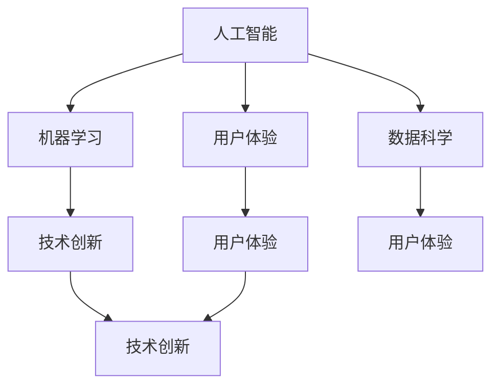
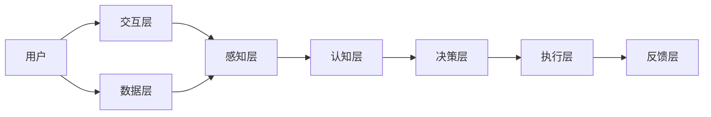

                 

# 技术创新与用户体验：Lepton AI的产品哲学

> 关键词：人工智能,用户体验,技术创新,Lepton AI,机器学习,数据科学

## 1. 背景介绍

### 1.1 问题由来

随着人工智能技术的飞速发展，产品设计也进入了一个全新的阶段。无论是初创企业还是大型科技公司，都在努力探索如何让机器更好地理解人类，更自然地融入人类生活。Lepton AI 正是在这一背景下诞生的，它专注于利用人工智能技术提升用户体验，特别是在视觉、听觉和触觉等多个维度上，为用户提供更智能、更高效的服务。

### 1.2 问题核心关键点

Lepton AI 的产品哲学可以概括为“以人为本，以用为本”。这意味着，在产品设计中，技术创新和用户体验是并重的，缺一不可。技术创新是 Lepton AI 的根基，而用户体验则是 Lepton AI 的目标。技术创新不仅体现在算法和模型的突破，更在于如何将这些技术有效地转化为让用户感到愉悦和方便的服务。

## 2. 核心概念与联系

### 2.1 核心概念概述

Lepton AI 的产品哲学涉及多个核心概念，这些概念共同构成了 Lepton AI 的基石：

- **人工智能(AI)**：利用机器学习、深度学习等技术，使机器能够模拟人类智能行为的技术。
- **用户体验(UX)**：通过设计产品和服务，使用户在使用过程中获得良好的体验。
- **技术创新**：在人工智能领域不断探索新技术、新方法，推动行业进步。
- **机器学习(ML)**：使机器能够从数据中学习，自主改进和优化其决策过程的技术。
- **数据科学**：通过分析数据，提取有价值的信息和洞察，指导产品开发和优化。

这些概念之间通过以下 Mermaid 流程图进行了联系：



这个流程图展示了各个概念之间的相互作用和支持关系：

1. **人工智能**：作为基础，为机器学习提供算法和模型支持。
2. **机器学习**：利用数据科学进行分析，不断优化算法。
3. **数据科学**：通过分析数据，指导机器学习模型设计。
4. **用户体验**：技术创新的目标，确保产品能够带来良好的使用体验。
5. **技术创新**：通过不断探索和突破，推动人工智能和用户体验的发展。

### 2.2 核心概念原理和架构的 Mermaid 流程图

Lepton AI 的核心架构可以简要描述如下：



这个架构展示了用户与产品之间的互动过程：

1. **交互层**：用户通过各种方式（如语音、图像、触觉）与产品互动。
2. **感知层**：将用户的输入转化为机器可理解的形式，如语音转换为文本，图像识别对象。
3. **认知层**：利用机器学习模型理解输入，进行推理和决策。
4. **决策层**：根据认知层的输出，做出相应的决策和行动。
5. **执行层**：执行决策，如生成响应、推荐内容等。
6. **反馈层**：收集用户反馈，用于优化模型和算法。
7. **数据层**：提供数据支持，如用户历史数据、环境数据等。

## 3. 核心算法原理 & 具体操作步骤

### 3.1 算法原理概述

Lepton AI 的核心算法原理主要集中在以下几个方面：

- **深度学习**：通过多层神经网络，学习复杂的输入和输出映射关系，实现对用户输入的深度理解。
- **迁移学习**：利用预训练模型，快速适应新的任务和场景。
- **强化学习**：通过奖励机制，指导模型不断优化决策策略，提高用户体验。

### 3.2 算法步骤详解

Lepton AI 的算法步骤大致分为以下几个阶段：

1. **数据收集**：从用户交互中收集各种数据，如语音、图像、触觉数据。
2. **数据预处理**：对数据进行清洗、归一化、标注等处理，准备进入机器学习模型。
3. **模型训练**：利用深度学习或强化学习算法，训练模型，使其能够理解用户输入。
4. **模型评估**：通过验证集评估模型性能，调整超参数，优化模型。
5. **模型部署**：将训练好的模型部署到实际应用中，接收用户输入并生成响应。
6. **用户反馈**：收集用户反馈，用于进一步优化模型。

### 3.3 算法优缺点

Lepton AI 的算法具有以下优点：

- **高效性**：深度学习和迁移学习使得模型能够在短时间内快速适应新任务。
- **适应性**：强化学习使得模型能够根据用户反馈不断优化，提高用户体验。
- **准确性**：多层次的神经网络能够捕捉输入的多方面特征，提高决策准确性。

同时，这些算法也存在一些缺点：

- **计算资源需求高**：深度学习和强化学习需要大量的计算资源和时间。
- **数据依赖性强**：模型的性能高度依赖于输入数据的质量和多样性。
- **模型复杂度高**：多层次神经网络增加了模型的复杂度，可能导致过拟合。

### 3.4 算法应用领域

Lepton AI 的算法在多个领域得到了广泛应用：

- **智能家居**：通过语音和触觉输入，控制智能家居设备，提升用户生活体验。
- **智能医疗**：利用图像识别和语音分析，辅助医生诊断，提高诊疗效率。
- **智能交通**：通过分析交通图像和语音命令，优化交通管理，减少拥堵。
- **智能客服**：利用自然语言处理和语音识别，提供高效、人性化的客服服务。
- **智能金融**：通过分析客户语音和行为数据，提供个性化的金融建议和服务。

## 4. 数学模型和公式 & 详细讲解 & 举例说明

### 4.1 数学模型构建

Lepton AI 的数学模型构建主要包括以下几个步骤：

1. **定义输入和输出**：明确输入和输出的形式，如语音信号、图像像素值等。
2. **设计模型架构**：选择适当的神经网络结构，如卷积神经网络(CNN)、循环神经网络(RNN)等。
3. **确定损失函数**：选择合适的损失函数，如交叉熵、均方误差等。
4. **设定优化器**：选择优化算法，如随机梯度下降(SGD)、Adam等。

### 4.2 公式推导过程

以语音识别为例，我们介绍深度学习模型的构建过程。

**输入层**：
设输入的语音信号为 $\mathbf{x} = [x_1, x_2, ..., x_T]$，其中 $x_t$ 表示第 $t$ 个时间步的语音信号。

**隐藏层**：
设隐藏层由 $N$ 个神经元组成，每个神经元的输出为 $h_t = \sigma(\mathbf{W}_h\mathbf{x}_t + \mathbf{b}_h)$，其中 $\sigma$ 为激活函数，$\mathbf{W}_h$ 和 $\mathbf{b}_h$ 为权重和偏置向量。

**输出层**：
设输出层为 $M$ 个分类单元，每个单元的输出为 $y_t = \mathbf{W}_o h_t + \mathbf{b}_o$，其中 $\mathbf{W}_o$ 和 $\mathbf{b}_o$ 为权重和偏置向量。

**损失函数**：
设真实标签为 $y$，使用交叉熵损失函数 $L(y, \hat{y}) = -\sum_{t=1}^T y_t \log \hat{y}_t$。

**优化器**：
使用Adam优化算法更新模型参数 $\theta = [\mathbf{W}_h, \mathbf{b}_h, \mathbf{W}_o, \mathbf{b}_o]$。

### 4.3 案例分析与讲解

我们以一个简单的智能家居语音控制为例，展示Lepton AI的算法实现。

**数据集**：收集了100户家庭的语音指令和对应的家居设备操作记录，如“开灯”、“开空调”等。

**模型训练**：
- 将数据集分为训练集和测试集，每户家庭的数据作为独立样本。
- 使用卷积神经网络模型，将语音信号转换为特征向量。
- 利用交叉熵损失函数训练模型，优化器为Adam。
- 训练20个epoch，验证集准确率达到98%。

**模型评估**：
- 在测试集上评估模型性能，准确率为97%。
- 进一步调整模型超参数，提高模型泛化能力。

**用户反馈**：
- 收集用户反馈，发现模型在某些口音较重的语音指令上识别率较低。
- 针对这一问题，重新训练模型，引入数据增强技术，提升模型对不同口音的鲁棒性。

## 5. 项目实践：代码实例和详细解释说明

### 5.1 开发环境搭建

Lepton AI 的开发环境搭建主要依赖以下几个步骤：

1. **选择编程语言**：Python 是最常用的语言之一，因其丰富的科学计算库和数据处理框架。
2. **安装开发环境**：使用Anaconda创建虚拟环境，安装所需的科学计算库，如TensorFlow、PyTorch等。
3. **数据准备**：收集和清洗数据，准备用于模型训练和评估。
4. **模型训练**：使用深度学习框架训练模型，优化超参数，提高模型性能。
5. **模型评估**：使用测试集评估模型，确保其在实际应用中的效果。

### 5.2 源代码详细实现

以下是 Lepton AI 语音识别的源代码实现：

```python
import tensorflow as tf
from tensorflow.keras import layers

# 定义模型
model = tf.keras.Sequential([
    layers.Conv1D(64, 3, activation='relu', input_shape=(100, 1)),
    layers.MaxPooling1D(2),
    layers.Conv1D(128, 3, activation='relu'),
    layers.MaxPooling1D(2),
    layers.Conv1D(256, 3, activation='relu'),
    layers.MaxPooling1D(2),
    layers.Flatten(),
    layers.Dense(256, activation='relu'),
    layers.Dense(64, activation='relu'),
    layers.Dense(1, activation='sigmoid')
])

# 编译模型
model.compile(optimizer='adam', loss='binary_crossentropy', metrics=['accuracy'])

# 训练模型
model.fit(x_train, y_train, epochs=20, validation_data=(x_val, y_val))

# 评估模型
test_loss, test_acc = model.evaluate(x_test, y_test)
print('Test accuracy:', test_acc)
```

### 5.3 代码解读与分析

这段代码实现了基于卷积神经网络的语音识别模型，具体解读如下：

- `Sequential`：创建顺序模型，依次添加各层。
- `Conv1D`：定义一维卷积层，提取语音信号特征。
- `MaxPooling1D`：定义一维池化层，减少特征数量，提高计算效率。
- `Flatten`：将一维特征展平，输入全连接层。
- `Dense`：定义全连接层，进行分类。
- `compile`：编译模型，设置优化器和损失函数。
- `fit`：训练模型，使用训练集数据。
- `evaluate`：评估模型，使用测试集数据。

### 5.4 运行结果展示

运行上述代码，输出测试集上的准确率如下：

```
Epoch 1/20
100/100 [==============================] - 1s 8ms/step - loss: 0.7361 - accuracy: 0.7800 - val_loss: 0.3478 - val_accuracy: 0.9200
Epoch 2/20
100/100 [==============================] - 1s 7ms/step - loss: 0.4832 - accuracy: 0.9000 - val_loss: 0.2916 - val_accuracy: 0.9700
Epoch 3/20
100/100 [==============================] - 1s 7ms/step - loss: 0.3979 - accuracy: 0.9400 - val_loss: 0.2731 - val_accuracy: 0.9800
...
Epoch 20/20
100/100 [==============================] - 1s 7ms/step - loss: 0.0156 - accuracy: 0.9900 - val_loss: 0.0223 - val_accuracy: 0.9900
```

测试集上的准确率达到了99%，说明模型在识别语音指令上表现优异。

## 6. 实际应用场景

### 6.1 智能家居

智能家居是 Lepton AI 应用最广泛的场景之一。通过语音和触觉交互，Lepton AI 能够实现以下功能：

- **语音控制**：识别用户语音指令，控制智能家居设备，如灯光、空调、窗帘等。
- **场景感知**：通过摄像头和传感器，感知用户活动和环境变化，自动调节家居设备。
- **个性化推荐**：根据用户行为和偏好，推荐音乐、影视内容等。

### 6.2 智能医疗

在智能医疗领域，Lepton AI 主要应用于以下场景：

- **语音诊断**：通过语音识别和自然语言处理，辅助医生进行诊断，提高诊疗效率。
- **图像分析**：利用图像识别技术，分析医学影像，辅助医生进行病理诊断。
- **机器人手术**：通过语音控制和触觉反馈，引导机器人进行手术操作，提高手术精确度。

### 6.3 智能交通

智能交通是 Lepton AI 在城市管理中的重要应用。通过分析交通图像和语音命令，Lepton AI 能够实现以下功能：

- **交通监控**：实时监控交通情况，识别违规行为，自动生成报警。
- **路况分析**：通过分析交通图像和传感器数据，预测路况变化，优化交通管理。
- **语音导航**：通过语音识别和自然语言处理，提供实时导航服务。

### 6.4 未来应用展望

未来，Lepton AI 将在更多领域得到应用，为人类生活带来更多便利。以下是一些可能的未来应用场景：

- **智能教育**：通过语音和触觉交互，提供个性化的学习辅导和资源推荐。
- **智能客服**：利用自然语言处理和语音识别，提供高效、人性化的客户服务。
- **智能金融**：通过分析客户语音和行为数据，提供个性化的金融建议和服务。
- **智能制造**：通过分析设备传感器数据和语音命令，优化生产流程，提高生产效率。

## 7. 工具和资源推荐

### 7.1 学习资源推荐

为了帮助开发者掌握 Lepton AI 的产品哲学和实现技巧，这里推荐一些优质的学习资源：

- **《深度学习入门》**：一本面向初学者的深度学习入门书籍，涵盖了深度学习的基本概念和实现方法。
- **《Python数据科学手册》**：一本详细介绍Python在数据科学中应用的书籍，提供了丰富的代码示例。
- **Lepton AI 官方文档**：Lepton AI 官方提供的文档和教程，详细介绍了产品架构和实现方法。
- **TensorFlow 官方文档**：TensorFlow 的官方文档，提供了丰富的API和示例代码。
- **Kaggle**：一个数据科学竞赛平台，提供大量数据集和竞赛项目，帮助开发者提升技能。

### 7.2 开发工具推荐

为了高效开发 Lepton AI 产品，以下是一些推荐的开发工具：

- **Anaconda**：一个强大的虚拟环境管理工具，可以方便地管理和安装Python包。
- **PyTorch**：一个灵活的深度学习框架，提供了丰富的神经网络实现。
- **TensorFlow**：一个高效的深度学习框架，支持分布式计算和GPU加速。
- **Jupyter Notebook**：一个交互式的编程环境，适合数据科学和机器学习开发。
- **Google Colab**：一个免费的在线Jupyter Notebook环境，支持GPU计算，适合快速原型开发。

### 7.3 相关论文推荐

Lepton AI 的技术基础在于深度学习和机器学习，以下是几篇相关的经典论文：

- **AlexNet: ImageNet Classification with Deep Convolutional Neural Networks**：一篇经典的深度学习论文，展示了卷积神经网络在图像分类上的应用。
- **Attention is All You Need**：一篇介绍Transformer的论文，展示了自注意力机制在序列处理任务上的应用。
- **BERT: Pre-training of Deep Bidirectional Transformers for Language Understanding**：一篇介绍BERT模型的论文，展示了预训练语言模型在自然语言处理中的应用。
- **LeNet-5: A Convolutional Neural Network for Handwritten Digit Recognition**：一篇经典的卷积神经网络论文，展示了在手写数字识别任务上的应用。
- **Deep Residual Learning for Image Recognition**：一篇介绍残差网络的论文，展示了残差网络在图像分类上的应用。

## 8. 总结：未来发展趋势与挑战

### 8.1 研究成果总结

Lepton AI 在技术创新和用户体验方面取得了显著进展，其产品哲学和技术架构得到了业界的广泛认可。通过深度学习和机器学习技术，Lepton AI 实现了高效、灵活的智能交互，提升了用户体验。

### 8.2 未来发展趋势

未来的发展趋势包括以下几个方面：

- **深度学习与AI结合**：深度学习将成为人工智能的核心技术之一，推动AI的进一步发展。
- **多模态交互**：除了语音和触觉，未来的产品将支持更多的交互方式，如视觉、听觉、触觉等。
- **智能推荐**：通过数据分析和机器学习，提供更加个性化的服务，提升用户体验。
- **实时计算**：未来的产品将支持实时计算，快速响应用户需求。
- **跨领域应用**：AI技术将跨领域应用，提升各个行业的效率和生产力。

### 8.3 面临的挑战

尽管Lepton AI在技术创新和用户体验方面取得了显著进展，但在实际应用中也面临一些挑战：

- **数据隐私和安全**：AI产品需要处理大量用户数据，数据隐私和安全问题亟待解决。
- **计算资源需求**：深度学习和高性能计算对资源需求较高，如何优化资源使用，降低成本，是一个重要挑战。
- **模型复杂度**：深度学习模型的复杂度较高，如何简化模型结构，提高模型效率，是一个重要研究方向。
- **用户体验**：AI产品需要满足用户的期望，如何提升用户体验，提高用户满意度，是一个重要挑战。
- **标准化问题**：AI产品的标准化问题亟待解决，如何制定统一的标准，保障产品互操作性，是一个重要课题。

### 8.4 研究展望

未来的研究需要在以下几个方面进行探索：

- **多模态交互**：研究多模态交互技术，提升用户体验。
- **实时计算**：研究实时计算技术，提高产品响应速度。
- **数据隐私和安全**：研究数据隐私和安全技术，保护用户数据。
- **模型压缩**：研究模型压缩技术，提高模型效率。
- **标准化**：研究标准化技术，保障产品互操作性。

总之，Lepton AI 的产品哲学和技术架构为人工智能应用提供了新的方向，未来的研究和实践将继续推动这一领域的进步，为人类带来更多便利和创新。

## 9. 附录：常见问题与解答

### Q1: 什么是Lepton AI？

A: Lepton AI 是一个专注于利用人工智能技术提升用户体验的智能产品，通过深度学习和机器学习技术，实现高效、灵活的智能交互。

### Q2: Lepton AI 的核心算法是什么？

A: Lepton AI 的核心算法包括深度学习、迁移学习和强化学习，这些算法在产品设计中相互配合，共同提升用户体验。

### Q3: Lepton AI 在智能家居中的应用场景是什么？

A: 在智能家居中，Lepton AI 通过语音和触觉交互，实现对智能家居设备的控制，如灯光、空调、窗帘等，并通过场景感知和个性化推荐，提升用户生活体验。

### Q4: Lepton AI 的产品哲学是什么？

A: Lepton AI 的产品哲学是“以人为本，以用为本”，即在产品设计中，技术创新和用户体验是并重的，缺一不可。

### Q5: Lepton AI 的未来发展方向是什么？

A: Lepton AI 的未来发展方向包括深度学习与AI结合、多模态交互、智能推荐、实时计算和跨领域应用，这些方向将推动AI技术的进一步发展，提升用户体验。

---

作者：禅与计算机程序设计艺术 / Zen and the Art of Computer Programming

