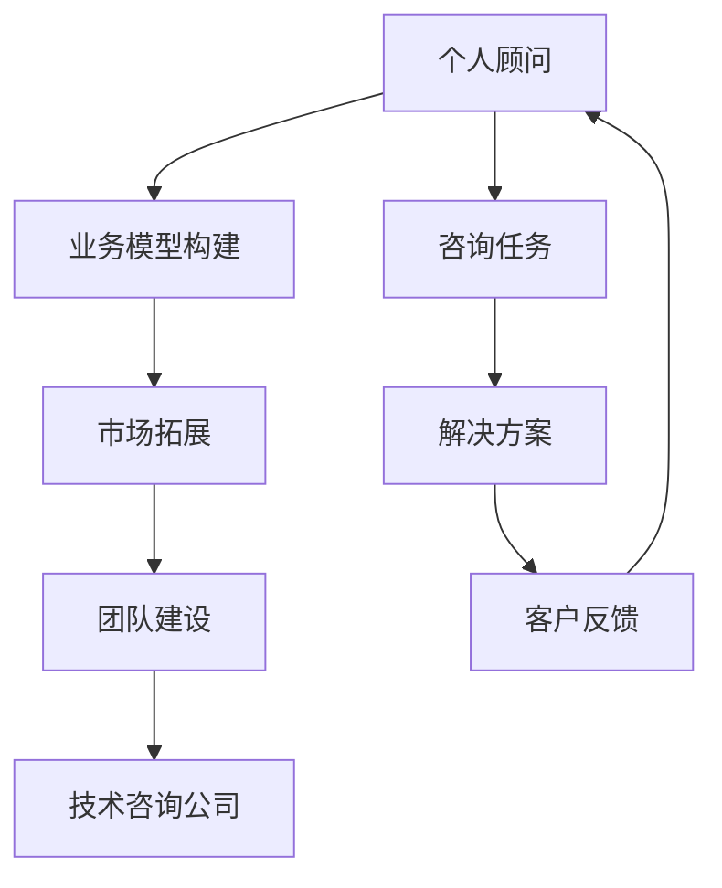

                 

# 技术咨询：从个人顾问到咨询公司

## 1. 背景介绍

随着科技的快速发展，企业对于专业技术和业务咨询的需求日益增长。技术咨询公司凭借其在特定技术领域的专业知识和经验，为企业提供定制化解决方案，帮助其提升核心竞争力。然而，从个人顾问到成功的咨询公司，需要跨过多个关键阶段，包括业务模型构建、市场拓展、团队建设等。本文将探讨从个人顾问到咨询公司的演变，以及其核心技术和策略。

## 2. 核心概念与联系

### 2.1 核心概念概述

在探讨从个人顾问到咨询公司的转变过程中，需要理解以下核心概念及其相互关系：

- **个人顾问（Individual Advisor）**：拥有特定领域专业知识，为企业提供专业建议和解决方案的专家。
- **技术咨询公司（Technology Consulting Firm）**：由一群专家组成的组织，为企业提供综合性的技术解决方案，包括但不限于产品开发、架构设计、战略规划等。
- **业务模型构建（Business Model Building）**：设计咨询公司如何通过服务实现收入和价值的过程。
- **市场拓展（Market Expansion）**：将咨询公司服务推广至不同市场和客户群体，增加业务覆盖范围。
- **团队建设（Team Building）**：构建和维护一支高效、专业的咨询团队，确保高质量的咨询服务。

### 2.2 核心概念原理和架构的 Mermaid 流程图



这个流程图展示了个人顾问如何通过构建业务模型、拓展市场、建设团队，最终转型为成功的技术咨询公司。

## 3. 核心算法原理 & 具体操作步骤

### 3.1 算法原理概述

从个人顾问到技术咨询公司的转变，涉及多个步骤的算法原理和操作步骤：

- **业务模型构建**：确定咨询公司的核心服务、定价策略、客户画像等关键要素，形成清晰的业务蓝图。
- **市场拓展**：利用市场调研和竞争分析，确定目标市场和潜在客户，设计市场进入策略。
- **团队建设**：招聘和培训具备专业技能和软技能的团队成员，构建有凝聚力的团队文化。
- **服务交付**：通过项目管理、质量控制等机制，确保高质量的服务交付。

### 3.2 算法步骤详解

**步骤1：业务模型构建**

- **确定服务类型**：明确咨询公司提供哪些核心服务，如软件开发、系统集成、IT战略规划等。
- **设计定价策略**：根据服务成本、市场需求，制定合理的定价方案，如按项目收费、按月度收费等。
- **构建客户画像**：分析目标客户的需求、预算、决策流程等，形成详细的客户画像。

**步骤2：市场拓展**

- **市场调研**：通过问卷调查、行业报告、竞争对手分析等方式，了解目标市场的规模、趋势和需求。
- **制定市场进入策略**：根据调研结果，选择适当的市场进入模式，如直接销售、渠道合作等。
- **推广活动策划**：设计有针对性的营销和推广活动，提升品牌知名度和客户转化率。

**步骤3：团队建设**

- **招聘与培训**：通过招聘平台、校园招聘、内部推荐等方式，吸引和招聘有潜力的员工，提供系统的专业培训和职业发展路径。
- **团队文化建设**：通过团队建设活动、共享知识平台等方式，增强团队的凝聚力和合作精神。
- **绩效管理**：建立科学的绩效评估和激励机制，确保团队成员的积极性和创造力。

**步骤4：服务交付**

- **项目管理**：采用敏捷、Scrum等项目管理方法，确保项目按时按质交付。
- **质量控制**：建立质量保证体系，通过代码审查、测试、文档审核等手段，确保服务质量。
- **客户反馈**：建立反馈机制，及时收集客户反馈，持续优化服务质量和客户满意度。

### 3.3 算法优缺点

#### 优点

- **专业知识丰富**：个人顾问具有丰富的领域知识和实践经验，能够为客户提供高质量的咨询服务。
- **灵活性高**：可以灵活调整服务内容和方法，满足客户的个性化需求。
- **资源利用率高**：避免了大规模团队带来的高成本和低效率问题。

#### 缺点

- **服务范围有限**：个人顾问通常只能覆盖特定领域，难以提供全面的解决方案。
- **客户信任度低**：个人顾问品牌影响力有限，客户对其信任度较低。
- **业务稳定性差**：个人顾问面临的业务风险较大，客户流失率较高。

### 3.4 算法应用领域

技术咨询公司的服务广泛应用于以下几个领域：

- **IT战略规划**：帮助企业制定IT战略，优化IT架构，提升企业数字化转型能力。
- **系统集成与开发**：提供系统集成、软件开发、测试等全流程技术服务，支持企业业务创新。
- **数据分析与AI**：利用数据分析和人工智能技术，为企业提供商业智能、预测分析、自动化解决方案。
- **安全与合规**：提供网络安全、数据隐私保护、合规审计等咨询和解决方案，保障企业数据安全。

## 4. 数学模型和公式 & 详细讲解

### 4.1 数学模型构建

技术咨询公司业务模型构建可以通过以下数学模型进行描述：

$$
\text{Revenue} = \text{Service} \times \text{Pricing Strategy} \times \text{Client Base}
$$

其中：
- $\text{Service}$ 表示咨询公司提供的服务类型。
- $\text{Pricing Strategy}$ 表示定价策略。
- $\text{Client Base}$ 表示目标客户的数量和规模。

### 4.2 公式推导过程

通过上述公式，我们可以进一步推导咨询公司业务模型构建的关键步骤：

1. **服务类型确定**：
   - 通过市场调研和客户需求分析，确定咨询公司提供的服务类型。

2. **定价策略设计**：
   - 基于成本、市场竞争和客户需求，设计合理的定价策略。

3. **客户基础拓展**：
   - 通过市场推广、合作伙伴关系等方式，不断扩大客户基础。

### 4.3 案例分析与讲解

假设某技术咨询公司提供数据分析和AI服务，其定价策略为项目收费，每年营收目标为1000万美元。公司目标是拓展300个企业客户，每个客户每年支付100万美元。

通过上述模型计算，每年需要完成10个数据分析和AI项目，每个项目平均需产生100万美元的收入。这要求公司具备高效的项目管理和质量控制能力，以确保服务质量并按时交付。

## 5. 项目实践：代码实例和详细解释说明

### 5.1 开发环境搭建

为进行技术咨询公司的业务模型构建和市场拓展，需要搭建如下开发环境：

1. **选择开发平台**：选择Python、R等数据分析和机器学习语言。
2. **安装相关库**：安装NumPy、Pandas、Scikit-learn、TensorFlow等常用库。
3. **数据准备**：收集市场调研数据、客户反馈数据等。

### 5.2 源代码详细实现

以下是一个简单的Python代码示例，用于计算目标营收和服务量：

```python
import numpy as np

# 定义参数
revenue_target = 10000000
client_base = 300
client_payment = 1000000

# 计算每个客户平均项目数
avg_project_per_client = revenue_target / client_base / client_payment

# 输出结果
print(f"每个客户每年平均需完成{avg_project_per_client}个项目")
```

### 5.3 代码解读与分析

这段代码简单易懂，通过简单的数学计算，可以帮助咨询公司理解其目标营收和服务量之间的关系。在实际应用中，还可以结合市场需求、客户画像等数据，进行更深入的分析。

### 5.4 运行结果展示

运行上述代码，输出结果如下：

```
每个客户每年平均需完成3.3333333333333335个项目
```

这表明，要实现每年1000万美元的营收目标，公司每年需要完成333个项目。考虑到项目管理和质量控制的复杂性，实际运营中可能需要更详细的规划和策略。

## 6. 实际应用场景

### 6.1 智能制造

技术咨询公司可以为制造企业提供数字化转型服务，通过物联网、云计算、大数据等技术，优化生产流程、提升生产效率。例如，帮助企业实现设备联网、数据集成、智能调度等功能。

### 6.2 零售电商

技术咨询公司可以为零售电商企业提供业务系统建设、数据驱动营销、智能客服等解决方案，提升客户体验和运营效率。例如，利用机器学习技术进行用户行为分析，精准推荐商品，提高销售转化率。

### 6.3 医疗健康

技术咨询公司可以为医疗机构提供电子病历系统建设、远程医疗、健康数据分析等技术服务，提升医疗服务质量和效率。例如，帮助医院实现患者数据整合、医疗影像智能分析、健康管理平台建设等。

## 7. 工具和资源推荐

### 7.1 学习资源推荐

- **《咨询公司实战手册》**：一本系统介绍咨询公司运营管理的书籍，涵盖业务模型、市场拓展、团队建设等关键内容。
- **在线课程平台**：如Coursera、edX等，提供各类数据分析、项目管理、咨询技巧等课程。
- **行业报告**：定期阅读Gartner、Forrester等咨询公司发布的行业报告，了解最新市场趋势和技术发展。

### 7.2 开发工具推荐

- **项目管理工具**：如JIRA、Trello等，帮助咨询公司高效管理项目。
- **协作工具**：如Slack、Microsoft Teams等，支持团队成员之间的沟通和协作。
- **数据管理工具**：如Airtable、Google Sheets等，帮助管理和分析客户数据。

### 7.3 相关论文推荐

- **《咨询公司如何实现业务增长》**：一篇探讨咨询公司增长策略的学术论文，包含业务模型构建、市场拓展、客户关系管理等内容。
- **《咨询公司项目管理最佳实践》**：一篇关于咨询公司项目管理方法的论文，详细介绍了敏捷、Scrum等方法的应用。

## 8. 总结：未来发展趋势与挑战

### 8.1 研究成果总结

从个人顾问到技术咨询公司的转变，涉及业务模型构建、市场拓展、团队建设等多个环节。通过科学的管理和规划，咨询公司可以逐步实现业务增长和市场扩张。

### 8.2 未来发展趋势

- **数字化转型**：随着数字化技术的普及，技术咨询公司将更加注重数字化转型服务，帮助客户实现业务升级和效率提升。
- **云计算和大数据**：云计算和大数据技术将广泛应用于咨询公司，支持数据分析、预测建模等技术服务。
- **人工智能**：人工智能技术将进一步推动咨询公司服务模式的创新，提升服务质量和客户满意度。

### 8.3 面临的挑战

- **市场竞争激烈**：技术咨询行业竞争日益激烈，企业需要不断提升自身竞争力，保持领先地位。
- **客户需求多样化**：客户需求不断变化，咨询公司需要灵活调整服务内容和方法，满足客户个性化需求。
- **人才资源短缺**：高素质人才资源匮乏，咨询公司需要建立完善的人才招聘和培养体系。

### 8.4 研究展望

- **技术创新**：持续关注最新技术发展，推动咨询服务的技术创新，提升服务质量。
- **市场洞察**：深入研究市场需求和趋势，精准定位目标市场，提升市场覆盖率。
- **人才管理**：加强人才招聘和培养，建设高效、专业的咨询团队，提升团队凝聚力。

## 9. 附录：常见问题与解答

**Q1：如何选择合适的定价策略？**

A：选择合适的定价策略需要综合考虑成本、市场需求和竞争状况。常用的定价策略包括按时收费、按项目收费、按月度收费等。通过市场调研和客户反馈，可以确定最合适的定价策略。

**Q2：如何拓展新市场？**

A：拓展新市场需要进行市场调研，了解目标市场的需求、竞争状况和客户画像。制定有针对性的市场推广策略，如直销、渠道合作、品牌营销等，逐步增加新市场的覆盖范围。

**Q3：如何管理咨询项目？**

A：项目管理是咨询公司成功的关键。采用敏捷、Scrum等项目管理方法，确保项目按时按质交付。建立质量保证体系，通过代码审查、测试、文档审核等手段，确保服务质量。

**Q4：如何提升团队凝聚力？**

A：建立团队文化，通过团队建设活动、共享知识平台等方式，增强团队的凝聚力和合作精神。建立科学的绩效评估和激励机制，确保团队成员的积极性和创造力。

**Q5：如何应对市场竞争？**

A：持续关注市场动态，及时调整业务策略，提升服务质量和客户满意度。建立品牌和口碑，提升市场竞争力。

---

作者：禅与计算机程序设计艺术 / Zen and the Art of Computer Programming

