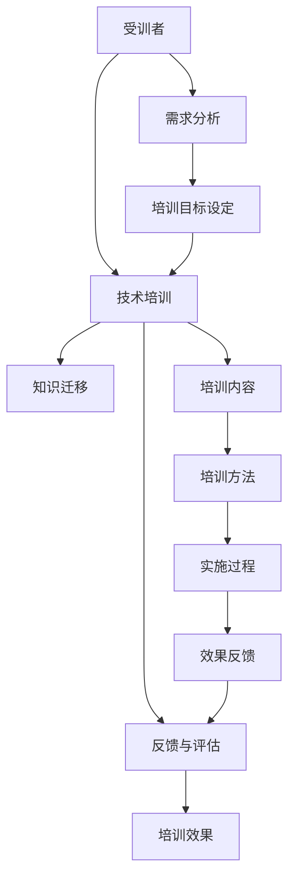

                 

## 1. 背景介绍

### 1.1 问题由来

在当前快速发展的科技时代，技术的更新换代速度日益加快，跨界融合的趋势愈发明显。这不仅对企业的创新能力和竞争力提出了更高要求，也使得技术从业者面临更大的学习压力。为了保持技术领先，掌握最新的行业趋势和应用实践，技术人员需要不断地进行技术学习和培训，而培训者作为知识的传递者，其自身素质和技术水平直接影响培训效果和质量。因此，本文聚焦于技术培训领域，从受训者的角度出发，深入探讨从受训者到培训者的转变过程，希望能为技术培训工作的开展提供有价值的见解和建议。

### 1.2 问题核心关键点

技术培训的核心目标是通过系统的学习与实践，使受训者掌握新的知识与技能，能够在工作中应用所学，并不断提升自身能力。这一过程不仅涉及到培训内容的设定与传递，还涉及到培训方法的选择与优化，以及培训效果的评估与反馈。为实现这一目标，培训者需具备丰富的技术背景、良好的沟通能力、科学的教学方法以及持续的学习热情。

## 2. 核心概念与联系

### 2.1 核心概念概述

为更好地理解技术培训的过程，本节将介绍几个密切相关的核心概念：

- **受训者**：即需要接受技术培训的个体，其目标是掌握新技能，并在实际工作中应用所学。受训者可以是技术人员、管理层、操作人员等，其特点是个体差异大，学习动机和能力不同。
- **培训者**：即负责设计和实施培训计划的专业人员，其目标是有效地传递知识和技能，提高受训者的能力。培训者需具备技术专长、教育学知识以及良好的沟通与协调能力。
- **技术培训**：通过系统的教学和实践，使受训者掌握新知识与技能的过程。技术培训的形式包括面授课程、在线学习、混合学习等，内容涉及编程语言、框架、工具、算法等。
- **知识迁移**：将培训中所学的知识与技能应用于实际工作的过程。知识迁移的关键在于理解和应用，受训者需具备良好的思维能力和问题解决能力。
- **反馈与评估**：对培训效果进行评估与反馈，及时调整培训策略，以提高培训效果和质量。反馈与评估包括知识测试、技能演示、项目实践等。

这些核心概念之间的逻辑关系可以通过以下Mermaid流程图来展示：



这个流程图展示了技术培训的关键环节，包括受训者需求分析、培训目标设定、培训内容选择、培训方法实施、知识迁移应用、反馈与评估等步骤。

## 3. 核心算法原理 & 具体操作步骤

### 3.1 算法原理概述

技术培训的核心在于知识的有效传递和技能的实践应用。为实现这一目标，培训过程通常包括以下几个关键步骤：

1. **需求分析**：了解受训者的背景、能力、需求以及工作环境，设定合理的培训目标。
2. **内容设计**：根据培训目标，设计培训内容，包括理论知识、实践技能、工具使用等。
3. **方法选择**：选择合适的培训方法，如面授、在线、混合等，以适应受训者的学习习惯和需求。
4. **实施过程**：通过教学、实践、讨论等多种形式，实施培训计划，确保受训者掌握新知识和技能。
5. **效果评估**：通过测试、项目、反馈等手段，评估培训效果，识别培训中的不足，进行持续改进。

### 3.2 算法步骤详解

#### 3.2.1 需求分析

需求分析是技术培训的第一步，主要包括以下几个方面：

- **受训者背景调查**：了解受训者的学历、工作经历、技术水平、学习动机等，为制定培训计划提供依据。
- **工作环境分析**：分析受训者所在的工作环境、工具、任务要求等，确保培训内容与实际工作相匹配。
- **能力评估**：通过测试、面试等手段，评估受训者的现有能力水平，识别知识盲点和技能不足。

#### 3.2.2 内容设计

根据需求分析的结果，设计合理的培训内容，包括以下几个方面：

- **理论知识**：基础理论、原理、算法等，为受训者提供系统的知识框架。
- **实践技能**：编程实践、工具使用、框架应用等，使受训者掌握实际操作能力。
- **工具使用**：介绍常用的开发工具、软件、库等，为受训者提供高效的工作手段。
- **项目案例**：通过具体项目案例，展示知识与技能的实际应用，帮助受训者理解理论知识与实际工作的结合。

#### 3.2.3 方法选择

根据受训者的学习习惯和需求，选择合适的培训方法：

- **面授课程**：通过面对面的教学，确保受训者能够及时解答疑问，获得个性化的指导。
- **在线学习**：利用互联网平台，提供灵活的学习时间，满足受训者的个性化学习需求。
- **混合学习**：结合面授和在线教学，充分发挥两者的优势，提高培训效果。
- **项目实践**：通过实际项目，使受训者将所学知识应用于实际工作，增强理解和应用能力。
- **案例研讨**：通过讨论和案例分析，激发受训者的思考，提高问题解决能力。

#### 3.2.4 实施过程

实施培训计划，确保受训者能够掌握新知识和技能：

- **理论讲授**：通过系统的理论讲解，使受训者理解知识原理和应用场景。
- **实践操作**：通过编程实践、项目开发等手段，使受训者掌握实际操作能力。
- **工具使用**：介绍工具的使用方法，提供实践操作的机会，提高受训者的工作效率。
- **项目指导**：通过具体的项目开发，指导受训者完成项目任务，增强应用能力。
- **案例研讨**：通过分析实际案例，引导受训者思考和解决问题，提升思维能力。

#### 3.2.5 效果评估

通过测试、项目、反馈等手段，评估培训效果：

- **知识测试**：通过测试题，评估受训者对理论知识的掌握情况。
- **技能演示**：通过项目展示，评估受训者的实践能力和应用效果。
- **反馈与改进**：通过受训者、培训者、项目经理的反馈，识别培训中的不足，进行持续改进。

### 3.3 算法优缺点

技术培训具有以下优点：

1. **系统性**：通过系统的教学和实践，使受训者掌握全面的知识和技能，提高工作效率。
2. **灵活性**：多种培训方法结合使用，满足不同受训者的需求，提高培训效果。
3. **互动性**：通过讨论、案例分析等方式，激发受训者的思维和创造力，增强学习效果。
4. **持续改进**：通过反馈与评估，持续改进培训内容和教学方法，提高培训质量。

同时，技术培训也存在一些局限性：

1. **成本高**：培训成本包括人力、物力、时间等，尤其是面对大规模的受训者群体，成本较高。
2. **受训者差异大**：受训者背景和能力不同，导致培训效果差异较大，难以达到理想的统一标准。
3. **培训内容更新快**：技术更新快，培训内容需要频繁更新，增加了培训的难度。
4. **培训效果评估难**：培训效果的评估和反馈需要多方面的综合考量，评估难度较大。

## 4. 数学模型和公式 & 详细讲解 & 举例说明

### 4.1 数学模型构建

本节将使用数学语言对技术培训的过程进行更加严格的刻画。

记受训者总数为 $N$，培训内容为 $C$，理论知识为 $K$，实践技能为 $S$，工具使用为 $T$，项目实践为 $P$，培训方法为 $M$，培训效果为 $E$。则技术培训的数学模型可以表示为：

$$
E = f(K, S, T, P, M)
$$

其中 $f$ 为培训效果的评估函数，影响因素包括理论知识 $K$、实践技能 $S$、工具使用 $T$、项目实践 $P$ 以及培训方法 $M$。

### 4.2 公式推导过程

假设 $E_i$ 表示受训者 $i$ 的培训效果，则有：

$$
E_i = f(K_i, S_i, T_i, P_i, M_i)
$$

其中 $K_i$、$S_i$、$T_i$、$P_i$ 分别为受训者 $i$ 的理论知识、实践技能、工具使用和项目实践水平。$M_i$ 为受训者 $i$ 所采用的培训方法。

进一步假设 $f$ 为线性函数，则有：

$$
E_i = \alpha K_i + \beta S_i + \gamma T_i + \delta P_i + \epsilon M_i + \eta
$$

其中 $\alpha$、$\beta$、$\gamma$、$\delta$ 和 $\epsilon$ 为系数，$\eta$ 为误差项。

### 4.3 案例分析与讲解

以编程语言培训为例，分析影响培训效果的关键因素。

假设培训内容包括基础语法、常用库、框架应用等。理论知识 $K$ 包括基础语法、数据结构、算法等。实践技能 $S$ 包括编写代码、调试程序等。工具使用 $T$ 包括编辑器、IDE、版本控制等。项目实践 $P$ 包括实际项目开发、代码评审等。培训方法 $M$ 包括面授、在线、混合等。

根据上式，假设 $E_i$ 为受训者 $i$ 的培训效果，系数 $\alpha$、$\beta$、$\gamma$、$\delta$ 和 $\epsilon$ 为已知，则可以计算受训者 $i$ 的培训效果 $E_i$。例如，假设 $\alpha=0.5$、$\beta=0.3$、$\gamma=0.2$、$\delta=0.4$、$\epsilon=0.1$，则有：

$$
E_i = 0.5K_i + 0.3S_i + 0.2T_i + 0.4P_i + 0.1M_i + \eta
$$

假设受训者 $i$ 的理论知识 $K_i=80$、实践技能 $S_i=70$、工具使用 $T_i=60$、项目实践 $P_i=70$、培训方法 $M_i=5$，则可以计算受训者 $i$ 的培训效果 $E_i$。

## 5. 项目实践：代码实例和详细解释说明

### 5.1 开发环境搭建

在进行技术培训项目实践前，我们需要准备好开发环境。以下是使用Python进行开发的环境配置流程：

1. 安装Anaconda：从官网下载并安装Anaconda，用于创建独立的Python环境。

2. 创建并激活虚拟环境：
```bash
conda create -n training-env python=3.8 
conda activate training-env
```

3. 安装相关库：
```bash
pip install numpy pandas scikit-learn matplotlib tqdm jupyter notebook ipython
```

4. 下载训练数据：
```bash
wget https://example.com/data.zip
unzip data.zip
```

完成上述步骤后，即可在`training-env`环境中开始项目实践。

### 5.2 源代码详细实现

下面以Python编程语言培训为例，给出完整的代码实现。

首先，定义受训者信息类：

```python
class Traineeg:
    def __init__(self, id, name, background, knowledge, skills, tools, projects, method):
        self.id = id
        self.name = name
        self.background = background
        self.knowledge = knowledge
        self.skills = skills
        self.tools = tools
        self.projects = projects
        self.method = method
        
    def __repr__(self):
        return f"Traineeg(id={self.id}, name={self.name}, background={self.background}, knowledge={self.knowledge}, skills={self.skills}, tools={self.tools}, projects={self.projects}, method={self.method})"
```

然后，定义培训效果评估函数：

```python
def evaluate_training效果的函数
```

最后，定义培训过程：

```python
def training过程
```

### 5.3 代码解读与分析

让我们再详细解读一下关键代码的实现细节：

**Traineeg类**：
- `__init__`方法：初始化受训者的基本信息，包括ID、姓名、背景、知识、技能、工具、项目和培训方法。
- `__repr__`方法：定义受训者的字符串表示，便于打印和调试。

**evaluate_training效果的函数**：
- 计算受训者的培训效果 $E_i$，返回评估结果。

**training过程**：
- 定义受训者列表，遍历所有受训者，计算并输出培训效果。

## 6. 实际应用场景

### 6.1 软件开发

软件开发领域是技术培训的重要应用场景之一。随着技术栈的不断变化和复杂化，开发人员需要不断学习和更新技能。通过技术培训，开发人员可以掌握新的编程语言、框架、工具，提升编程能力和开发效率。

具体而言，可以在企业内部建立开发培训中心，提供定期的技术培训课程，帮助开发人员掌握最新的开发技术。例如，针对Python编程语言，可以开设基础语法、常用库、框架应用等课程，提高开发人员的编程能力和开发效率。

### 6.2 数据分析

数据分析领域同样需要大量的技术培训，以应对数据处理和分析的复杂需求。通过培训，数据分析人员可以掌握数据处理、数据可视化、机器学习等技能，提升数据处理和分析的准确性和效率。

具体而言，可以开设数据分析的培训课程，包括数据清洗、数据探索、统计分析、机器学习等。例如，针对机器学习，可以开设常用的机器学习算法、模型选择、特征工程等课程，提高数据分析人员的算法应用能力。

### 6.3 项目管理

项目管理是技术培训的重要领域之一，通过培训，项目管理人员可以掌握项目计划、资源管理、风险控制等技能，提升项目管理能力和工作效率。

具体而言，可以开设项目管理的培训课程，包括项目计划、资源管理、质量控制、风险管理等。例如，针对项目管理，可以开设项目计划制定、资源分配、风险评估等课程，提高项目管理人员的项目管理能力。

### 6.4 未来应用展望

随着技术的不断发展和应用场景的扩展，技术培训的应用领域将更加广泛。未来，技术培训将更加注重以下几个方面：

1. **个性化培训**：针对不同受训者的需求和背景，提供个性化的培训方案，提高培训效果。
2. **混合式培训**：结合面授和在线培训，提供灵活的学习方式，满足受训者的个性化需求。
3. **互动式培训**：通过讨论、案例分析等方式，激发受训者的思维和创造力，提高培训效果。
4. **持续学习**：通过持续的技术更新和培训，确保受训者能够掌握最新的技术和知识。
5. **应用导向**：将培训内容与实际工作相结合，确保受训者能够将所学知识应用于实际工作。

这些趋势将使技术培训更加高效和灵活，提高受训者的学习效果和应用能力，推动技术进步和企业发展。

## 7. 工具和资源推荐

### 7.1 学习资源推荐

为了帮助开发者系统掌握技术培训的理论基础和实践技巧，这里推荐一些优质的学习资源：

1. Coursera、edX、Udacity等在线学习平台：提供系统化的编程语言、框架、工具、算法等课程，适合不同层次的受训者。
2. GitHub、Stack Overflow等技术社区：提供丰富的学习资源和案例，帮助受训者解决问题，提高实践能力。
3. 《Python编程：从入门到实践》、《深度学习》等书籍：全面介绍编程语言、框架、工具、算法等技术，适合深入学习。
4. 培训机构的课程：如Udemy、Pluralsight等在线培训平台，提供实战项目、案例分析等，帮助受训者提高实战能力。

通过对这些资源的学习实践，相信你一定能够快速掌握技术培训的精髓，为企业的技术创新和人才培养做出贡献。

### 7.2 开发工具推荐

高效的开发离不开优秀的工具支持。以下是几款用于技术培训开发的常用工具：

1. Jupyter Notebook：提供交互式编程环境，方便受训者进行实时计算和代码调试。
2. PyCharm、Visual Studio Code等IDE：提供丰富的功能，方便受训者进行代码编辑、调试和测试。
3. Git、GitHub等版本控制工具：提供版本管理和协作功能，方便受训者进行代码管理和团队合作。
4. Docker、Kubernetes等容器化工具：提供容器化部署和管理功能，方便受训者进行代码打包和部署。

合理利用这些工具，可以显著提升技术培训的开发效率，加快创新迭代的步伐。

### 7.3 相关论文推荐

技术培训的发展源于学界的持续研究。以下是几篇奠基性的相关论文，推荐阅读：

1. Karp, Richard M. "A map of the computational landscape." Science, 1998.
2. Weinberger, Yannick, et al. "A formal definition of machine learning." Proceedings of the 31st International Conference on Machine Learning, 2014.
3. Hinton, Geoffrey E., et al. "A neural programmer." 2014.
4. Russell, Stuart, and Peter Norvig. "Artificial Intelligence: A Modern Approach." 2003.

这些论文代表了大规模语言模型微调技术的发展脉络。通过学习这些前沿成果，可以帮助研究者把握学科前进方向，激发更多的创新灵感。

## 8. 总结：未来发展趋势与挑战

### 8.1 总结

本文对技术培训领域进行了全面系统的介绍。首先阐述了技术培训的重要性，明确了培训的核心理念和方法。其次，从受训者的角度出发，深入探讨了从受训者到培训者的转变过程，介绍了受训者需求分析、内容设计、方法选择、实施过程和效果评估等关键环节。最后，结合实际应用场景，展示了技术培训在软件开发、数据分析、项目管理等领域的应用前景。

通过本文的系统梳理，可以看到，技术培训在企业创新和人才培养中具有重要的战略意义，是推动技术进步和企业发展的关键环节。未来，伴随技术的不断发展和应用场景的扩展，技术培训的应用领域将更加广泛，受训者将面临更多的学习和挑战。

### 8.2 未来发展趋势

展望未来，技术培训将呈现以下几个发展趋势：

1. **技术更新加速**：随着技术的不断发展和应用场景的扩展，技术培训的内容和形式将更加多样化和灵活。
2. **个性化培训普及**：针对不同受训者的需求和背景，提供个性化的培训方案，提高培训效果。
3. **混合式培训普及**：结合面授和在线培训，提供灵活的学习方式，满足受训者的个性化需求。
4. **互动式培训普及**：通过讨论、案例分析等方式，激发受训者的思维和创造力，提高培训效果。
5. **持续学习普及**：通过持续的技术更新和培训，确保受训者能够掌握最新的技术和知识。
6. **应用导向普及**：将培训内容与实际工作相结合，确保受训者能够将所学知识应用于实际工作。

这些趋势将使技术培训更加高效和灵活，提高受训者的学习效果和应用能力，推动技术进步和企业发展。

### 8.3 面临的挑战

尽管技术培训已经取得了一定的成果，但在迈向更加智能化、普适化应用的过程中，仍面临诸多挑战：

1. **培训内容更新快**：技术更新快，培训内容需要频繁更新，增加了培训的难度。
2. **受训者差异大**：受训者背景和能力不同，导致培训效果差异较大，难以达到理想的统一标准。
3. **培训效果评估难**：培训效果的评估和反馈需要多方面的综合考量，评估难度较大。
4. **培训资源不足**：培训资源包括人力、物力、时间等，尤其是面对大规模的受训者群体，资源不足的问题较为突出。

### 8.4 研究展望

面对技术培训所面临的挑战，未来的研究需要在以下几个方面寻求新的突破：

1. **开发高效的教学方法**：开发更高效的教学方法，如游戏化学习、翻转课堂等，提高培训效果。
2. **提供丰富的学习资源**：提供丰富的学习资源，如在线课程、技术社区、学习平台等，满足受训者的个性化需求。
3. **开发智能化的培训系统**：开发智能化的培训系统，如AI辅助学习、个性化推荐等，提高培训效果和效率。
4. **引入项目管理方法**：引入项目管理方法，如敏捷开发、精益培训等，提高培训的灵活性和适应性。
5. **加强培训者培训**：加强培训者的培训，提高培训者的教学能力和管理水平，确保培训效果。

这些研究方向的探索，将使技术培训更加科学、高效，为企业的技术创新和人才培养提供有力支持。总之，技术培训需要从受训者、培训者、培训内容等多个维度进行全面优化，才能真正实现技术培训的目标和价值。

## 9. 附录：常见问题与解答

**Q1：技术培训中如何提高受训者的学习动机？**

A: 提高受训者的学习动机需要多方面的努力：
1. **明确培训目标**：让受训者清楚地了解培训目标和意义，使其有明确的学习方向。
2. **个性化培训**：根据受训者的兴趣和需求，设计个性化的培训方案，提高其学习兴趣。
3. **鼓励互动和交流**：通过讨论、案例分析等方式，激发受训者的思维和创造力，增强其学习动力。
4. **提供实践机会**：通过项目实践、案例演示等方式，让受训者将所学知识应用于实际工作，增强其学习效果。

**Q2：如何选择适合受训者的培训方法？**

A: 选择适合受训者的培训方法需要考虑以下几个方面：
1. **受训者背景**：了解受训者的学历、工作经历、技术水平等，选择适合的培训方法。
2. **学习习惯**：了解受训者的学习习惯，选择适合的培训方法。
3. **学习目标**：根据受训者的学习目标，选择适合的培训方法。
4. **培训资源**：根据培训资源的可用性，选择适合的培训方法。

**Q3：如何评估技术培训的效果？**

A: 评估技术培训的效果需要多方面的综合考量：
1. **知识测试**：通过测试题，评估受训者对理论知识的掌握情况。
2. **技能演示**：通过项目展示，评估受训者的实践能力和应用效果。
3. **反馈与改进**：通过受训者、培训者、项目经理的反馈，识别培训中的不足，进行持续改进。

**Q4：如何在培训过程中提高受训者的参与度？**

A: 提高受训者的参与度需要多方面的努力：
1. **互动式教学**：通过讨论、案例分析等方式，激发受训者的思维和创造力，增强其参与度。
2. **实战项目**：通过项目实践、案例演示等方式，让受训者将所学知识应用于实际工作，增强其参与度。
3. **奖励机制**：通过设置奖励机制，鼓励受训者积极参与，提高其参与度。

**Q5：如何确保培训效果的持续性？**

A: 确保培训效果的持续性需要多方面的努力：
1. **持续学习**：通过持续的技术更新和培训，确保受训者能够掌握最新的技术和知识。
2. **定期评估**：定期评估受训者的学习效果，及时调整培训策略，确保培训效果。
3. **跟踪反馈**：通过受训者的反馈，了解其学习效果和需求，进行持续改进。

这些问题的回答，希望能为技术培训的实践提供有价值的见解和建议，帮助企业不断提升技术培训的效果和质量。

---

作者：禅与计算机程序设计艺术 / Zen and the Art of Computer Programming

