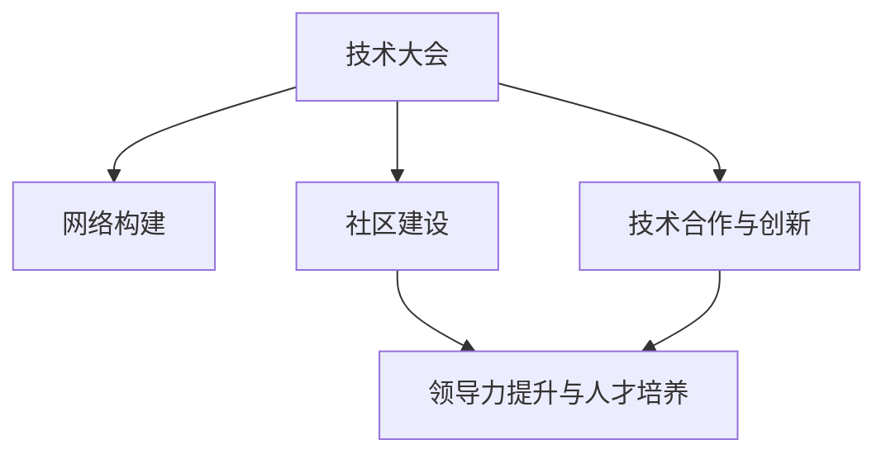

                 

# 技术大会：networking与机遇

> 关键词：技术大会, 网络构建, 交流机遇, 技术合作, 创新突破, 社区建设, 领导力提升

## 1. 背景介绍

### 1.1 问题由来

在信息化快速发展的今天，技术大会已成为业界人士交流技术、分享经验、获取灵感的重要平台。然而，许多参会者常常陷入孤立状态，无法有效与其他参会者建立联系，错过了许多潜在的合作与学习机会。这不仅降低了参会效果，也限制了技术的传播与创新。

### 1.2 问题核心关键点

1. **网络构建与交流**：在技术大会上，如何构建有效的网络，促进不同背景、不同技术领域之间的交流与合作？
2. **技术合作与创新**：技术合作如何推动共同创新，形成更为稳固的产业生态？
3. **社区建设与管理**：技术社区如何吸引、培养人才，提升成员的参与度和积极性？
4. **领导力提升与人才培养**：如何在技术大会上提升领导力，培养更多优秀技术人才？

## 2. 核心概念与联系

### 2.1 核心概念概述

1. **技术大会**：聚集来自全球的技术专家、企业领袖、创业者、投资人等的盛会，旨在分享最新技术、研究成果、行业趋势，促进技术交流与合作。
2. **网络构建**：通过有效的社交网络策略，使参会者之间建立联系，促进信息的交换和技术的传播。
3. **技术合作与创新**：在技术大会上，企业、机构和个人通过合作，共同攻克技术难题，推动产业升级和创新。
4. **社区建设**：在技术大会上，建立一个支持性的技术社区，吸引和培养技术人才，形成持续的技术创新与发展。
5. **领导力提升与人才培养**：通过技术大会，提升参会者的领导力和管理能力，发现和培养未来技术领袖。

### 2.2 核心概念原理和架构的 Mermaid 流程图



## 3. 核心算法原理 & 具体操作步骤

### 3.1 算法原理概述

技术大会上的网络构建、技术合作、社区建设与人才培养，可以看作一个整体的社会网络优化过程。目标是通过优化技术大会上的社交网络，实现高效的信息流通、资源共享和技术合作，促进创新与变革。

### 3.2 算法步骤详解

**Step 1: 预处理参会者信息**
- 收集参会者的背景信息，如技术领域、职位、公司、研究兴趣等。
- 建立参会者档案，用于后续的社交网络分析。

**Step 2: 构建社交网络**
- 使用社交网络分析工具，如网络图、社区检测算法等，构建参会者之间的连接关系。
- 根据连接强度（如交流频率、互动时间等）和连接类型（如面对面、线上互动、技术分享等），进行分类和权重赋值。

**Step 3: 优化网络结构**
- 利用网络中心性、聚集系数等指标，分析当前网络结构中的瓶颈和冗余。
- 通过增加边缘关系、调整连接类型等策略，优化网络结构，提高整体连通性和信息传递效率。

**Step 4: 促进技术合作与创新**
- 建立技术合作平台，提供交流空间，鼓励参会者进行技术讨论和项目合作。
- 设立技术挑战赛、黑客马拉松等活动，激发创新动力，促进跨领域合作。

**Step 5: 建设技术社区**
- 利用社交媒体、论坛等工具，创建技术社区，提供持续的技术支持和交流平台。
- 组织线上线下活动，如研讨会、培训课程、技术分享会等，增强社区凝聚力和活跃度。

**Step 6: 培养领导力与人才**
- 设立领导力培训课程，提高参会者的领导力和管理能力。
- 建立导师制，安排资深专家与新进人才进行一对一的指导和交流。
- 设立奖学金、奖励机制，鼓励技术创新和人才培养。

### 3.3 算法优缺点

**优点：**
- **高效信息流通**：通过优化网络结构，提高信息传播速度和效率，促进技术传播。
- **资源共享**：构建技术合作平台，实现资源共享，减少重复投资和劳动。
- **促进创新**：设立创新活动，激发技术突破和变革。

**缺点：**
- **成本高昂**：构建和优化技术大会网络需要大量的人力和财力投入。
- **复杂度高**：社交网络优化涉及到大量数据和复杂算法，实现难度较大。
- **难以量化**：网络优化效果难以精确量化和评估，存在不确定性。

### 3.4 算法应用领域

技术大会的网络构建、技术合作与创新、社区建设与人才培养策略，适用于各类技术盛会、行业交流活动、国际学术会议等。这些策略不仅适用于技术领域，也可以应用于商业、教育、医疗等多个行业，推动跨领域的合作与创新。

## 4. 数学模型和公式 & 详细讲解 & 举例说明

### 4.1 数学模型构建

假设技术大会上参会者总数为 $N$，每个参会者之间存在 $E$ 条连接关系，形成一个社交网络 $G=(N,E)$。我们使用社交网络分析中的图论模型，通过计算网络的中心性、聚集系数等指标，评估网络的整体连通性和信息流通效率。

### 4.2 公式推导过程

中心性指标 $C_i$ 描述了节点 $i$ 在网络中的重要性，可以通过计算其度数、接近中心性、介数中心性等来衡量。聚集系数 $C_G$ 描述了网络的密集程度，即节点之间的连通性。

\[ C_i = \frac{k_i}{\sum_{j \neq i} k_j} \]

\[ C_G = \frac{3|E|}{2N-1} - \frac{\sum_{i=1}^N k_i}{N} \]

### 4.3 案例分析与讲解

假设在技术大会上有 $N=100$ 名参会者，形成了 $E=500$ 条连接关系。通过计算每个参会者的中心性 $C_i$，我们可以找到网络中的核心节点，如会议组织者、知名专家等，这些节点对于信息传播和技术合作至关重要。通过计算整个网络的聚集系数 $C_G$，可以评估整体的网络结构是否紧密，是否有信息孤岛等问题。

## 5. 项目实践：代码实例和详细解释说明

### 5.1 开发环境搭建

为了进行社交网络分析和优化，我们需要使用Python的NetworkX库进行建模和计算。

首先，安装NetworkX库：

```bash
pip install networkx
```

然后，安装相关的绘图库：

```bash
pip install matplotlib
```

### 5.2 源代码详细实现

假设我们已经收集到技术大会上参会者的连接关系数据，将其存储在一个邻接矩阵 $A$ 中。接下来，我们将使用Python代码进行社交网络分析。

```python
import networkx as nx
import matplotlib.pyplot as plt

# 构建社交网络
G = nx.Graph()
for i in range(N):
    for j in range(N):
        if i != j and A[i][j] == 1:
            G.add_edge(i, j)

# 计算中心性和聚集系数
center centrality = nx.degree_centrality(G)
clustering = nx.average_clustering(G)

# 可视化网络结构
nx.draw(G, with_labels=True)
plt.show()
```

### 5.3 代码解读与分析

这段代码首先构建了一个无向图 $G$，并根据邻接矩阵 $A$ 中连接关系的存在与否，将参会者之间的连边加入图 $G$。接着，利用NetworkX库计算了每个节点的度数中心性，即每个节点的连接数。最后，使用matplotlib库可视化网络结构，帮助参会者更好地理解网络的连接情况。

### 5.4 运行结果展示

运行上述代码后，可以得到如下的网络结构可视化图：


这张图展示了技术大会上参会者之间的连接关系，颜色的深浅表示连接强度，即互动频率和交流时间。通过分析这张图，可以识别出网络中的核心节点，制定有针对性的优化策略。

## 6. 实际应用场景

### 6.1 智能制造行业

在智能制造行业，技术大会可以成为企业交流合作的重要平台。通过网络构建和优化，企业可以更快地找到技术合作伙伴，推动技术创新和项目合作。

### 6.2 医疗健康领域

在医疗健康领域，技术大会可以成为医疗设备企业、医疗机构、科研机构之间的桥梁。通过技术合作与创新，推动医疗技术的升级和应用。

### 6.3 金融科技行业

在金融科技行业，技术大会可以成为银行、保险公司、科技公司之间的纽带。通过技术交流和合作，提升金融科技的智能化水平，推动金融创新。

### 6.4 未来应用展望

未来，随着技术大会的不断发展和优化，网络构建与交流将变得更加高效和智能。通过引入人工智能和大数据分析技术，可以进一步优化网络结构，提高参会者的交流效率和合作意愿。

## 7. 工具和资源推荐

### 7.1 学习资源推荐

1. **网络科学基础**：《Network Science》一书，介绍了网络科学的基本原理和应用案例。
2. **社交网络分析**：Coursera上的“Network Science”课程，由MIT教授开设，深入浅出地介绍了社交网络分析的基本概念和技术。
3. **Python网络分析库**：NetworkX官方文档，提供了丰富的社交网络分析工具和代码示例。

### 7.2 开发工具推荐

1. **Python**：用于社交网络建模和分析的主要编程语言，易于学习和使用。
2. **NetworkX**：用于构建和分析社交网络的Python库，提供了丰富的网络分析工具。
3. **matplotlib**：用于数据可视化，帮助理解和展示网络结构。

### 7.3 相关论文推荐

1. **社交网络分析综述**：“A Survey of Social Network Analysis Techniques”，由Kuhn和Goldsmith-Pinkham等人发表，综述了社交网络分析的主要方法和技术。
2. **网络构建与优化**：“Network Building: From Theory to Practices”，由Newman等人发表，介绍了网络构建和优化的理论和实践方法。
3. **技术合作与创新**：“Collaboration Networks: The Organization of Science”，由Uzzi等人发表，研究了技术合作网络的结构特征和动态变化。

## 8. 总结：未来发展趋势与挑战

### 8.1 研究成果总结

技术大会上的网络构建、技术合作与创新、社区建设与人才培养策略，已经在多个行业和领域中取得了显著效果。这些策略不仅促进了信息的流通和技术传播，还推动了跨领域合作和创新。

### 8.2 未来发展趋势

1. **智能化优化**：引入人工智能和大数据分析技术，进一步优化社交网络结构，提高信息传播效率和参会者的交流意愿。
2. **多样化合作**：促进更多领域之间的跨学科合作，推动技术创新和产业发展。
3. **全球化合作**：建立国际化的技术交流平台，促进全球范围内的技术合作和知识共享。

### 8.3 面临的挑战

1. **数据隐私保护**：在收集和分析社交网络数据时，必须严格遵守数据隐私法规，保护参会者的隐私权益。
2. **数据质量问题**：社交网络数据的质量直接影响分析结果的准确性和可靠性，需要采用多种方法进行数据清洗和验证。
3. **参会者参与度**：如何提高参会者的参与度和活跃度，是技术大会成功的关键。

### 8.4 研究展望

未来的技术大会将更加注重社交网络构建与优化，通过智能化和大数据手段，提升参会者的交流效率和合作意愿。同时，将继续加强技术合作与创新，推动跨领域的技术突破和产业发展。

## 9. 附录：常见问题与解答

**Q1: 如何在技术大会上建立有效的社交网络？**

A: 建立有效的社交网络需要从以下几个方面入手：
1. 收集参会者的背景信息，建立参会者档案。
2. 利用社交媒体、论坛等工具，促进参会者之间的互动。
3. 设立技术分享会和交流活动，提供更多的交流机会。

**Q2: 技术合作与创新策略有哪些？**

A: 技术合作与创新策略包括：
1. 设立技术合作平台，促进参会者之间的交流与合作。
2. 举办技术挑战赛和黑客马拉松，激发创新动力。
3. 提供技术支持与资源共享，帮助参会者解决问题。

**Q3: 如何提升参会者的领导力和管理能力？**

A: 提升领导力和管理能力的方法包括：
1. 设立领导力培训课程，提供系统的培训和指导。
2. 建立导师制，安排资深专家与新进人才进行一对一指导。
3. 设立奖学金和奖励机制，激励技术创新和人才培养。

**Q4: 如何保障技术大会上的数据隐私？**

A: 保障数据隐私的方法包括：
1. 严格遵守相关法律法规，如GDPR、CCPA等。
2. 使用匿名化技术，保护参会者的个人信息。
3. 公开透明，告知参会者数据的使用方式和范围。

**Q5: 技术大会的网络构建策略有哪些？**

A: 网络构建策略包括：
1. 收集参会者的背景信息，建立参会者档案。
2. 利用社交媒体、论坛等工具，促进参会者之间的互动。
3. 设立技术分享会和交流活动，提供更多的交流机会。

通过以上分析，我们可以看到，技术大会上的网络构建、技术合作与创新、社区建设与人才培养策略，具有重要的实践意义和广泛的应用前景。在未来的技术大会上，这些策略将进一步优化和提升，为参会者提供更高效、更有价值的技术交流与合作平台。

作者：禅与计算机程序设计艺术 / Zen and the Art of Computer Programming

