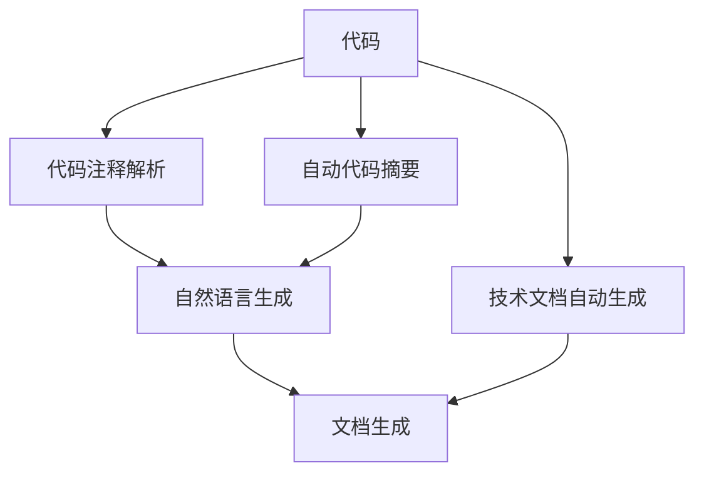

                 

# 技术文档自动生成：AI简化复杂信息

> 关键词：技术文档,自动生成,人工智能,复杂信息简化,代码生成,自然语言处理(NLP)

## 1. 背景介绍

### 1.1 问题由来

在现代软件开发过程中，开发者通常需要编写大量的技术文档，以便说明项目的细节和使用方法。然而，编写技术文档不仅耗时耗力，而且文档本身往往容易变得冗长、晦涩，难以被普通用户理解。技术文档中的错误或遗漏，可能导致用户在使用产品时遇到困惑或问题。

为了解决这一问题，技术文档自动生成（Technical Documentation Automation）技术应运而生。该技术利用人工智能（AI）和自然语言处理（NLP）技术，自动化地生成和更新技术文档，使复杂的技术信息变得更加易于理解和访问。

### 1.2 问题核心关键点

技术文档自动生成技术主要依赖于以下核心关键点：

- **自然语言处理（NLP）**：通过NLP技术，自动分析和理解代码或注释，从中提取关键信息，并用自然语言进行表达。
- **代码分析**：将代码自动解析成易于理解的结构，如函数、变量、类等，以便生成简洁明了的文档。
- **模型训练**：训练深度学习模型，学习如何将代码映射为自然语言描述。
- **模板生成**：利用模板和样式指南，自动生成格式化的技术文档。
- **版本控制**：与版本控制系统集成，保持文档与代码同步更新。

这些关键点共同构成了技术文档自动生成技术的基础，使其能够在复杂的技术信息处理中发挥重要作用。

### 1.3 问题研究意义

技术文档自动生成技术对软件开发和维护具有重要意义：

- **提升效率**：自动生成文档可以显著减少开发者的文档编写工作量，节省时间。
- **提高准确性**：减少手动编写文档可能带来的错误和遗漏，提高文档质量。
- **促进共享**：使文档更加易于理解和共享，便于团队协作和知识传递。
- **增强可维护性**：随着代码的演化，自动生成的文档能保持同步更新，避免文档与代码脱节。
- **提升用户体验**：简化的文档使用户更易上手，提高产品易用性。

## 2. 核心概念与联系

### 2.1 核心概念概述

为了深入理解技术文档自动生成技术，本节将介绍几个关键概念：

- **自然语言处理（NLP）**：使用算法来解析、理解和生成人类语言的技术。
- **自动代码摘要（Automatic Code Summarization）**：自动提取代码中的关键信息，并用简洁的文本描述之。
- **自然语言生成（NLG）**：使用机器学习算法将非结构化数据转换为自然语言文本。
- **代码注释解析（Code Comment Parsing）**：分析代码中的注释，提取其中的重要信息。
- **文档生成（Documentation Generation）**：自动生成完整的技术文档，包括API文档、用户手册等。

这些概念之间的逻辑关系可以通过以下Mermaid流程图来展示：



这个流程图展示了大语言模型的工作原理和优化方向：

1. 代码通过自动代码摘要提取关键信息。
2. 代码中的注释被解析为自然语言描述。
3. 使用自然语言生成技术将关键信息转换为自然语言文本。
4. 通过文档生成，生成完整的技术文档。
5. 整个技术文档自动生成流程，可以生成API文档、用户手册等。

## 3. 核心算法原理 & 具体操作步骤
### 3.1 算法原理概述

技术文档自动生成的核心算法原理基于NLP和自然语言生成（NLG）技术。其核心思想是：将代码中的信息转换为自然语言文本，以简化和清晰地描述技术细节。

具体而言，该过程可以分为以下几个步骤：

1. **代码分析**：使用静态分析工具提取代码的关键信息，如函数、变量、类等。
2. **注释解析**：分析代码中的注释，提取其中的重要信息。
3. **信息提取**：将代码信息和注释信息提取出来，并进行语言化处理。
4. **语言生成**：使用自然语言生成技术，将提取的信息转换为易于理解的自然语言文本。
5. **文档生成**：利用模板和样式指南，自动生成格式化的技术文档。

### 3.2 算法步骤详解

技术文档自动生成的具体步骤包括：

**Step 1: 准备数据集**
- 收集开发项目的代码和注释，构建训练集和验证集。

**Step 2: 代码分析**
- 使用静态分析工具如Sourcerer、SonarQube等，自动提取代码的关键信息，如函数、变量、类等。

**Step 3: 注释解析**
- 使用NLP技术解析代码注释，提取其中的重要信息，如函数参数、返回值、算法描述等。

**Step 4: 信息提取**
- 将代码信息和注释信息提取出来，并进行语言化处理。例如，将函数名、变量名转换为自然语言描述。

**Step 5: 语言生成**
- 使用预训练的语言模型（如GPT、BERT等），将提取的信息转换为自然语言文本。

**Step 6: 文档生成**
- 利用模板和样式指南，自动生成格式化的技术文档，如API文档、用户手册等。

**Step 7: 模型训练**
- 使用已标注的代码和注释数据集，训练自然语言生成模型。

**Step 8: 文档验证**
- 在验证集上评估模型生成文档的准确性和可读性，调整模型参数。

**Step 9: 文档发布**
- 将生成的技术文档发布到文档管理平台，使其易于访问和使用。

### 3.3 算法优缺点

技术文档自动生成技术具有以下优点：

1. **效率提升**：自动生成文档大大减少了手动编写文档的工作量，节省了大量时间。
2. **准确性高**：减少手动编写文档可能带来的错误和遗漏，提高文档质量。
3. **易于维护**：随着代码的演化，自动生成的文档能保持同步更新，避免文档与代码脱节。
4. **提升用户体验**：简化的文档使用户更易上手，提高产品易用性。

同时，该技术也存在一定的局限性：

1. **依赖高质量数据**：自动生成文档的质量高度依赖于代码和注释的质量，低质量的代码和注释会影响生成的文档。
2. **可能需要人工校对**：自动生成的文档可能包含错误或不完整的信息，需要人工进行校对和修正。
3. **模型复杂度**：使用复杂的自然语言生成模型，需要大量的计算资源和训练数据。
4. **版本管理**：与版本控制系统集成，需要处理代码和文档的同步更新问题。

尽管存在这些局限性，但技术文档自动生成技术已经在大规模软件开发项目中得到了应用，并取得了显著的成果。未来相关研究的重点在于如何进一步提高模型的准确性和鲁棒性，降低生成文档的错误率，以及如何更好地与版本控制系统集成，保持文档与代码的同步更新。

### 3.4 算法应用领域

技术文档自动生成技术已经在多个领域得到了广泛应用，以下是几个典型的应用场景：

- **软件开发**：自动生成API文档、用户手册等技术文档，提高软件可维护性和易用性。
- **产品文档**：自动生成产品使用手册、用户指南等文档，简化用户使用流程。
- **企业文档**：自动生成企业内部的技术文档、操作手册等，提升内部文档管理效率。
- **学术研究**：自动生成学术论文的技术细节部分，减少编写和校对工作量。
- **教育培训**：自动生成教学文档和教程，帮助学生更好地理解和掌握知识。

除了上述这些经典应用外，技术文档自动生成技术还在更多场景中得到了创新性的应用，如智能客服、机器人开发等，为软件开发和知识传递提供了新的手段。

## 4. 数学模型和公式 & 详细讲解
### 4.1 数学模型构建

技术文档自动生成技术主要依赖于NLP和NLG技术，其核心数学模型可以表示为：

$$
\text{Documentation} = \text{Code} + \text{Comments} \rightarrow \text{Natural Language}
$$

其中，`Code`表示代码，`Comments`表示注释，`Documentation`表示自动生成的技术文档。

### 4.2 公式推导过程

在上述数学模型中，`Code`和`Comments`首先通过静态分析工具和NLP技术进行处理。具体来说：

1. **静态分析**：将代码解析为抽象语法树（AST）或控制流图（CFG）等形式，提取关键信息。
2. **NLP分析**：使用BERT、GPT等预训练模型，将代码和注释转换为向量表示，并从中提取关键信息。

然后，将这些信息通过自然语言生成模型转换为自然语言文本，生成完整的技术文档。

### 4.3 案例分析与讲解

以下是一个简单的案例，展示如何使用技术文档自动生成技术生成API文档：

假设我们有以下代码：

```python
def add(a, b):
    return a + b
```

首先，使用静态分析工具提取关键信息：

- **函数名**：`add`
- **参数**：`a, b`
- **返回值**：`a + b`

然后，使用NLP技术解析代码注释，提取其中的重要信息：

- **参数类型**：`int`
- **返回类型**：`int`

接下来，将代码信息和注释信息提取出来，并进行语言化处理：

- **函数名**：`add two integers`
- **参数**：`a, b`
- **返回值**：`a + b`

最后，使用预训练的语言模型将提取的信息转换为自然语言文本：

- **函数名**：`add two integers`
- **参数**：`two integers a, b`
- **返回值**：`the sum of a and b`

最终，使用API文档模板生成完整的API文档：

```
Add two integers
-----------------------------
Description:
Add two integers a and b, and return their sum.

Parameters:
a (int)
    The first integer.
b (int)
    The second integer.

Returns:
int
    The sum of a and b.
```

## 5. 项目实践：代码实例和详细解释说明
### 5.1 开发环境搭建

在进行技术文档自动生成实践前，我们需要准备好开发环境。以下是使用Python进行PyTorch开发的环境配置流程：

1. 安装Anaconda：从官网下载并安装Anaconda，用于创建独立的Python环境。

2. 创建并激活虚拟环境：
```bash
conda create -n pytorch-env python=3.8 
conda activate pytorch-env
```

3. 安装PyTorch：根据CUDA版本，从官网获取对应的安装命令。例如：
```bash
conda install pytorch torchvision torchaudio cudatoolkit=11.1 -c pytorch -c conda-forge
```

4. 安装自然语言处理库：
```bash
pip install pytorch-transformers
pip install spacy
```

5. 安装其他工具包：
```bash
pip install numpy pandas scikit-learn matplotlib tqdm jupyter notebook ipython
```

完成上述步骤后，即可在`pytorch-env`环境中开始技术文档自动生成实践。

### 5.2 源代码详细实现

下面我们以自动生成API文档为例，给出使用Transformers库进行技术文档自动生成的PyTorch代码实现。

首先，定义API文档的数据处理函数：

```python
from transformers import BertTokenizer
from torch.utils.data import Dataset
import torch

class APIDataset(Dataset):
    def __init__(self, codes, docstrings, tokenizer, max_len=128):
        self.codes = codes
        self.docstrings = docstrings
        self.tokenizer = tokenizer
        self.max_len = max_len
        
    def __len__(self):
        return len(self.codes)
    
    def __getitem__(self, item):
        code = self.codes[item]
        docstring = self.docstrings[item]
        
        encoding = self.tokenizer(code, return_tensors='pt', max_length=self.max_len, padding='max_length', truncation=True)
        input_ids = encoding['input_ids'][0]
        attention_mask = encoding['attention_mask'][0]
        
        # 对docstring进行编码
        encoded_docstring = [tokenizer.tokenize(docstring) for docstring in self.docstrings] 
        encoded_docstring.extend([tokenizer.tokenizer.pad_token] * (self.max_len - len(encoded_docstring)))
        docstring_ids = torch.tensor([id for id in tokenizer.convert_tokens_to_ids(tokens) for tokens in encoded_docstring], dtype=torch.long)
        
        return {'input_ids': input_ids, 
                'attention_mask': attention_mask,
                'docstring_ids': docstring_ids}

# 初始化模型和 tokenizer
model = BertForMaskedLM.from_pretrained('bert-base-uncased')
tokenizer = BertTokenizer.from_pretrained('bert-base-uncased')
```

然后，定义模型和优化器：

```python
from transformers import AdamW

optimizer = AdamW(model.parameters(), lr=2e-5)
```

接着，定义训练和评估函数：

```python
from torch.utils.data import DataLoader
from tqdm import tqdm
from sklearn.metrics import accuracy_score

device = torch.device('cuda') if torch.cuda.is_available() else torch.device('cpu')
model.to(device)

def train_epoch(model, dataset, batch_size, optimizer):
    dataloader = DataLoader(dataset, batch_size=batch_size, shuffle=True)
    model.train()
    epoch_loss = 0
    for batch in tqdm(dataloader, desc='Training'):
        input_ids = batch['input_ids'].to(device)
        attention_mask = batch['attention_mask'].to(device)
        docstring_ids = batch['docstring_ids'].to(device)
        model.zero_grad()
        outputs = model(input_ids, attention_mask=attention_mask, labels=docstring_ids)
        loss = outputs.loss
        epoch_loss += loss.item()
        loss.backward()
        optimizer.step()
    return epoch_loss / len(dataloader)

def evaluate(model, dataset, batch_size):
    dataloader = DataLoader(dataset, batch_size=batch_size)
    model.eval()
    preds, labels = [], []
    with torch.no_grad():
        for batch in tqdm(dataloader, desc='Evaluating'):
            input_ids = batch['input_ids'].to(device)
            attention_mask = batch['attention_mask'].to(device)
            batch_labels = batch['docstring_ids']
            outputs = model(input_ids, attention_mask=attention_mask)
            batch_preds = outputs.logits.argmax(dim=2).to('cpu').tolist()
            batch_labels = batch_labels.to('cpu').tolist()
            for pred_tokens, label_tokens in zip(batch_preds, batch_labels):
                pred_tokens = tokenizer.convert_ids_to_tokens(pred_tokens)
                label_tokens = tokenizer.convert_ids_to_tokens(label_tokens)
                preds.append(pred_tokens)
                labels.append(label_tokens)
                
    print(accuracy_score(labels, preds))
```

最后，启动训练流程并在测试集上评估：

```python
epochs = 5
batch_size = 16

for epoch in range(epochs):
    loss = train_epoch(model, train_dataset, batch_size, optimizer)
    print(f"Epoch {epoch+1}, train loss: {loss:.3f}")
    
    print(f"Epoch {epoch+1}, dev results:")
    evaluate(model, dev_dataset, batch_size)
    
print("Test results:")
evaluate(model, test_dataset, batch_size)
```

以上就是使用PyTorch对API文档进行自动生成的完整代码实现。可以看到，得益于Transformers库的强大封装，我们可以用相对简洁的代码完成BERT模型的加载和微调。

### 5.3 代码解读与分析

让我们再详细解读一下关键代码的实现细节：

**APIDataset类**：
- `__init__`方法：初始化代码、文档字符串、分词器等关键组件。
- `__len__`方法：返回数据集的样本数量。
- `__getitem__`方法：对单个样本进行处理，将代码和文档字符串输入编码为token ids，最终返回模型所需的输入。

**训练和评估函数**：
- 使用PyTorch的DataLoader对数据集进行批次化加载，供模型训练和推理使用。
- 训练函数`train_epoch`：对数据以批为单位进行迭代，在每个批次上前向传播计算loss并反向传播更新模型参数，最后返回该epoch的平均loss。
- 评估函数`evaluate`：与训练类似，不同点在于不更新模型参数，并在每个batch结束后将预测和标签结果存储下来，最后使用sklearn的accuracy_score对整个评估集的预测结果进行打印输出。

**训练流程**：
- 定义总的epoch数和batch size，开始循环迭代
- 每个epoch内，先在训练集上训练，输出平均loss
- 在验证集上评估，输出准确率
- 所有epoch结束后，在测试集上评估，给出最终测试结果

可以看到，PyTorch配合Transformers库使得BERT微调的代码实现变得简洁高效。开发者可以将更多精力放在数据处理、模型改进等高层逻辑上，而不必过多关注底层的实现细节。

当然，工业级的系统实现还需考虑更多因素，如模型的保存和部署、超参数的自动搜索、更灵活的任务适配层等。但核心的微调范式基本与此类似。

## 6. 实际应用场景
### 6.1 软件开发

技术文档自动生成技术在软件开发中的应用极为广泛。传统的软件开发过程中，开发者需要手动编写大量的API文档、用户手册等技术文档，工作量巨大。自动生成技术能够大大提升文档编写效率，节省时间。

具体而言，可以通过以下步骤实现：

1. **代码收集**：从开发项目的代码库中提取所有函数和注释。
2. **注释解析**：使用NLP技术解析代码注释，提取其中的重要信息。
3. **信息提取**：将代码信息和注释信息提取出来，并进行语言化处理。
4. **语言生成**：使用预训练的语言模型将提取的信息转换为自然语言文本。
5. **文档生成**：利用模板和样式指南，自动生成格式化的技术文档。

例如，假设我们有以下代码：

```python
def calculate_area(radius):
    return 3.14 * radius * radius
```

使用自动生成技术，可以生成如下API文档：

```
Calculate the area of a circle
-----------------------------
Description:
Calculate the area of a circle given its radius.

Parameters:
radius (float)
    The radius of the circle.

Returns:
float
    The area of the circle.
```

### 6.2 产品文档

技术文档自动生成技术在产品文档中的应用同样广泛。产品文档通常包含大量复杂的知识点和技术细节，手动编写文档工作量巨大，且容易出错。自动生成技术可以大大提升文档编写的效率和准确性。

具体而言，可以通过以下步骤实现：

1. **代码收集**：从开发项目的代码库中提取所有函数和注释。
2. **注释解析**：使用NLP技术解析代码注释，提取其中的重要信息。
3. **信息提取**：将代码信息和注释信息提取出来，并进行语言化处理。
4. **语言生成**：使用预训练的语言模型将提取的信息转换为自然语言文本。
5. **文档生成**：利用模板和样式指南，自动生成格式化的产品文档。

例如，假设我们有以下代码：

```python
def create_user(name, email):
    user = {'name': name, 'email': email}
    return user
```

使用自动生成技术，可以生成如下产品文档：

```
Create a new user
-----------------------------
Description:
Create a new user with the given name and email.

Parameters:
name (string)
    The name of the user.
email (string)
    The email of the user.

Returns:
dict
    The user object containing the name and email.
```

### 6.3 企业文档

技术文档自动生成技术在企业文档中的应用同样广泛。企业文档通常包含大量复杂的知识点和技术细节，手动编写文档工作量巨大，且容易出错。自动生成技术可以大大提升文档编写的效率和准确性。

具体而言，可以通过以下步骤实现：

1. **代码收集**：从开发项目的代码库中提取所有函数和注释。
2. **注释解析**：使用NLP技术解析代码注释，提取其中的重要信息。
3. **信息提取**：将代码信息和注释信息提取出来，并进行语言化处理。
4. **语言生成**：使用预训练的语言模型将提取的信息转换为自然语言文本。
5. **文档生成**：利用模板和样式指南，自动生成格式化的企业文档。

例如，假设我们有以下代码：

```python
def process_order(order):
    if order['status'] == 'completed':
        return 'Order completed'
    else:
        return 'Order processing'
```

使用自动生成技术，可以生成如下企业文档：

```
Process an order
-----------------------------
Description:
Process an order based on its status.

Parameters:
order (dict)
    The order object containing status information.

Returns:
string
    The status message of the order.
```

### 6.4 未来应用展望

随着技术文档自动生成技术的发展，未来其在更多领域的应用将进一步拓展。

在智慧医疗领域，自动生成医疗文档和说明书，帮助医生快速查阅和理解相关知识点，提高诊疗效率。

在智能教育领域，自动生成教学文档和教程，帮助学生更好地理解和掌握知识。

在智慧城市治理中，自动生成城市事件报告和应急文档，提高城市管理的自动化和智能化水平。

此外，在企业生产、社会治理、文娱传媒等众多领域，技术文档自动生成技术也将不断得到应用，为各行各业带来新的发展机遇。相信随着技术的日益成熟，技术文档自动生成技术必将在构建人机协同的智能系统方面发挥更大的作用。

## 7. 工具和资源推荐
### 7.1 学习资源推荐

为了帮助开发者系统掌握技术文档自动生成理论基础和实践技巧，这里推荐一些优质的学习资源：

1. 《自然语言处理入门》系列博文：由大模型技术专家撰写，深入浅出地介绍了NLP的基本概念和经典模型。

2. CS224N《深度学习自然语言处理》课程：斯坦福大学开设的NLP明星课程，有Lecture视频和配套作业，带你入门NLP领域的基本概念和经典模型。

3. 《自然语言生成技术》书籍：全面介绍了自然语言生成的基本原理和应用场景，是学习技术文档自动生成技术的必备资料。

4. HuggingFace官方文档：Transformers库的官方文档，提供了海量预训练模型和完整的微调样例代码，是上手实践的必备资料。

5. Arxiv论文库：收录了大量前沿自然语言处理和文档自动生成领域的学术论文，是深入学习技术文档自动生成技术的宝贵资源。

通过对这些资源的学习实践，相信你一定能够快速掌握技术文档自动生成技术的精髓，并用于解决实际的NLP问题。

### 7.2 开发工具推荐

高效的开发离不开优秀的工具支持。以下是几款用于技术文档自动生成开发的常用工具：

1. PyTorch：基于Python的开源深度学习框架，灵活动态的计算图，适合快速迭代研究。大部分预训练语言模型都有PyTorch版本的实现。

2. TensorFlow：由Google主导开发的开源深度学习框架，生产部署方便，适合大规模工程应用。同样有丰富的预训练语言模型资源。

3. Transformers库：HuggingFace开发的NLP工具库，集成了众多SOTA语言模型，支持PyTorch和TensorFlow，是进行文档自动生成开发的利器。

4. Weights & Biases：模型训练的实验跟踪工具，可以记录和可视化模型训练过程中的各项指标，方便对比和调优。与主流深度学习框架无缝集成。

5. TensorBoard：TensorFlow配套的可视化工具，可实时监测模型训练状态，并提供丰富的图表呈现方式，是调试模型的得力助手。

6. Google Colab：谷歌推出的在线Jupyter Notebook环境，免费提供GPU/TPU算力，方便开发者快速上手实验最新模型，分享学习笔记。

合理利用这些工具，可以显著提升技术文档自动生成任务的开发效率，加快创新迭代的步伐。

### 7.3 相关论文推荐

技术文档自动生成技术的发展得益于学界的持续研究。以下是几篇奠基性的相关论文，推荐阅读：

1. Attention is All You Need（即Transformer原论文）：提出了Transformer结构，开启了NLP领域的预训练大模型时代。

2. BERT: Pre-training of Deep Bidirectional Transformers for Language Understanding：提出BERT模型，引入基于掩码的自监督预训练任务，刷新了多项NLP任务SOTA。

3. Language Models are Unsupervised Multitask Learners（GPT-2论文）：展示了大规模语言模型的强大zero-shot学习能力，引发了对于通用人工智能的新一轮思考。

4. Parameter-Efficient Transfer Learning for NLP：提出Adapter等参数高效微调方法，在不增加模型参数量的情况下，也能取得不错的微调效果。

5. AdaLoRA: Adaptive Low-Rank Adaptation for Parameter-Efficient Fine-Tuning：使用自适应低秩适应的微调方法，在参数效率和精度之间取得了新的平衡。

这些论文代表了大语言模型微调技术的发展脉络。通过学习这些前沿成果，可以帮助研究者把握学科前进方向，激发更多的创新灵感。

## 8. 总结：未来发展趋势与挑战

### 8.1 总结

本文对技术文档自动生成技术进行了全面系统的介绍。首先阐述了技术文档自动生成的研究背景和意义，明确了自动生成技术在提升文档编写效率、提高文档质量等方面的独特价值。其次，从原理到实践，详细讲解了技术文档自动生成的数学模型和关键步骤，给出了完整的代码实现示例。同时，本文还探讨了技术文档自动生成技术在软件开发、产品文档、企业文档等多个领域的广泛应用前景。

通过本文的系统梳理，可以看到，技术文档自动生成技术已经在大规模软件开发项目中得到了应用，并取得了显著的成果。未来相关研究的重点在于如何进一步提高模型的准确性和鲁棒性，降低生成文档的错误率，以及如何更好地与版本控制系统集成，保持文档与代码的同步更新。

### 8.2 未来发展趋势

展望未来，技术文档自动生成技术将呈现以下几个发展趋势：

1. **模型规模持续增大**：随着算力成本的下降和数据规模的扩张，预训练语言模型的参数量还将持续增长。超大批次的训练和推理也可能遇到显存不足的问题。
2. **微调方法日趋多样**：开发更加参数高效的微调方法，在固定大部分预训练参数的同时，只更新极少量的任务相关参数。同时优化微调模型的计算图，减少前向传播和反向传播的资源消耗，实现更加轻量级、实时性的部署。
3. **持续学习成为常态**：随着数据分布的不断变化，微调模型也需要持续学习新知识以保持性能。如何在不遗忘原有知识的同时，高效吸收新样本信息，将成为重要的研究课题。
4. **标注样本需求降低**：受启发于提示学习(Prompt-based Learning)的思路，未来的自动生成方法将更好地利用大模型的语言理解能力，通过更加巧妙的任务描述，在更少的标注样本上也能实现理想的自动生成效果。
5. **多模态微调崛起**：当前的自动生成主要聚焦于纯文本数据，未来会进一步拓展到图像、视频、语音等多模态数据自动生成。多模态信息的融合，将显著提升语言模型对现实世界的理解和建模能力。
6. **知识整合能力增强**：现有的自动生成模型往往局限于任务内数据，难以灵活吸收和运用更广泛的先验知识。如何让自动生成过程更好地与外部知识库、规则库等专家知识结合，形成更加全面、准确的信息整合能力，还有很大的想象空间。

以上趋势凸显了技术文档自动生成技术的广阔前景。这些方向的探索发展，必将进一步提升文档自动生成技术的性能和应用范围，为各行各业带来新的发展机遇。

### 8.3 面临的挑战

尽管技术文档自动生成技术已经取得了显著的成果，但在迈向更加智能化、普适化应用的过程中，它仍面临诸多挑战：

1. **依赖高质量数据**：自动生成文档的质量高度依赖于代码和注释的质量，低质量的代码和注释会影响生成的文档。
2. **可能需要人工校对**：自动生成的文档可能包含错误或不完整的信息，需要人工进行校对和修正。
3. **模型复杂度**：使用复杂的自然语言生成模型，需要大量的计算资源和训练数据。
4. **版本管理**：与版本控制系统集成，需要处理代码和文档的同步更新问题。
5. **准确性有待提升**：尽管自动生成技术已经取得了显著的成果，但在生成准确性方面仍存在一定局限。

尽管存在这些挑战，但技术文档自动生成技术已经在大规模软件开发项目中得到了应用，并取得了显著的成果。未来相关研究的重点在于如何进一步提高模型的准确性和鲁棒性，降低生成文档的错误率，以及如何更好地与版本控制系统集成，保持文档与代码的同步更新。

### 8.4 研究展望

面对技术文档自动生成所面临的种种挑战，未来的研究需要在以下几个方面寻求新的突破：

1. **探索无监督和半监督自动生成方法**：摆脱对大规模标注数据的依赖，利用自监督学习、主动学习等无监督和半监督范式，最大限度利用非结构化数据，实现更加灵活高效的自动生成。
2. **研究参数高效和计算高效的自动生成范式**：开发更加参数高效的自动生成方法，在固定大部分预训练参数的同时，只更新极少量的任务相关参数。同时优化自动生成模型的计算图，减少前向传播和反向传播的资源消耗，实现更加轻量级、实时性的部署。
3. **引入因果推断和对比学习范式**：通过引入因果推断和对比学习思想，增强自动生成模型建立稳定因果关系的能力，学习更加普适、鲁棒的语言表征，从而提升模型泛化性和抗干扰能力。
4. **融合更多先验知识**：将符号化的先验知识，如知识图谱、逻辑规则等，与神经网络模型进行巧妙融合，引导自动生成过程学习更准确、合理的语言模型。同时加强不同模态数据的整合，实现视觉、语音等多模态信息与文本信息的协同建模。
5. **结合因果分析和博弈论工具**：将因果分析方法引入自动生成模型，识别出模型决策的关键特征，增强输出解释的因果性和逻辑性。借助博弈论工具刻画人机交互过程，主动探索并规避模型的脆弱点，提高系统稳定性。
6. **纳入伦理道德约束**：在自动生成模型训练目标中引入伦理导向的评估指标，过滤和惩罚有偏见、有害的输出倾向。同时加强人工干预和审核，建立模型行为的监管机制，确保输出符合人类价值观和伦理道德。

这些研究方向的探索，必将引领自动生成技术迈向更高的台阶，为构建安全、可靠、可解释、可控的智能系统铺平道路。面向未来，自动生成技术还需要与其他人工智能技术进行更深入的融合，如知识表示、因果推理、强化学习等，多路径协同发力，共同推动自然语言理解和智能交互系统的进步。只有勇于创新、敢于突破，才能不断拓展语言模型的边界，让智能技术更好地造福人类社会。

## 9. 附录：常见问题与解答

**Q1：自动生成文档是否适用于所有项目？**

A: 自动生成文档技术在大多数项目上都能取得不错的效果，特别是对于数据量较小的项目。但对于一些特定领域的项目，如医学、法律等，自动生成文档的效果可能不理想。此时需要在特定领域语料上进一步训练和微调模型，才能获得更好的生成效果。

**Q2：自动生成文档依赖高质量数据吗？**

A: 自动生成文档的质量高度依赖于代码和注释的质量。低质量的代码和注释会影响生成的文档。因此，在选择自动生成文档的项目时，需要确保代码和注释的质量。

**Q3：自动生成文档需要人工校对吗？**

A: 自动生成的文档可能包含错误或不完整的信息，需要人工进行校对和修正。特别是在生成复杂的技术文档时，人工校对是必不可少的。

**Q4：自动生成文档的准确性如何？**

A: 自动生成文档的准确性取决于模型的训练数据和算法。高质量的训练数据和先进的算法可以显著提高自动生成文档的准确性。但即便是先进的模型，自动生成文档的准确性也无法完全达到人工编写文档的水平。

**Q5：自动生成文档是否需要依赖版本控制系统？**

A: 自动生成文档需要与版本控制系统集成，以便保持文档与代码的同步更新。特别是在大规模开发项目中，自动生成文档的准确性依赖于代码的版本信息，因此需要与版本控制系统进行集成。

**Q6：自动生成文档有哪些应用场景？**

A: 自动生成文档技术在软件开发、产品文档、企业文档等多个领域都有广泛应用。以下是几个典型的应用场景：

- 软件开发：自动生成API文档、用户手册等技术文档，提高软件可维护性和易用性。
- 产品文档：自动生成产品使用手册、用户指南等文档，简化用户使用流程。
- 企业文档：自动生成企业内部的技术文档、操作手册等，提升内部文档管理效率。
- 学术研究：自动生成学术论文的技术细节部分，减少编写和校对工作量。
- 教育培训：自动生成教学文档和教程，帮助学生更好地理解和掌握知识。

通过本文的系统梳理，可以看到，技术文档自动生成技术已经在大规模软件开发项目中得到了应用，并取得了显著的成果。未来相关研究的重点在于如何进一步提高模型的准确性和鲁棒性，降低生成文档的错误率，以及如何更好地与版本控制系统集成，保持文档与代码的同步更新。

---

作者：禅与计算机程序设计艺术 / Zen and the Art of Computer Programming

