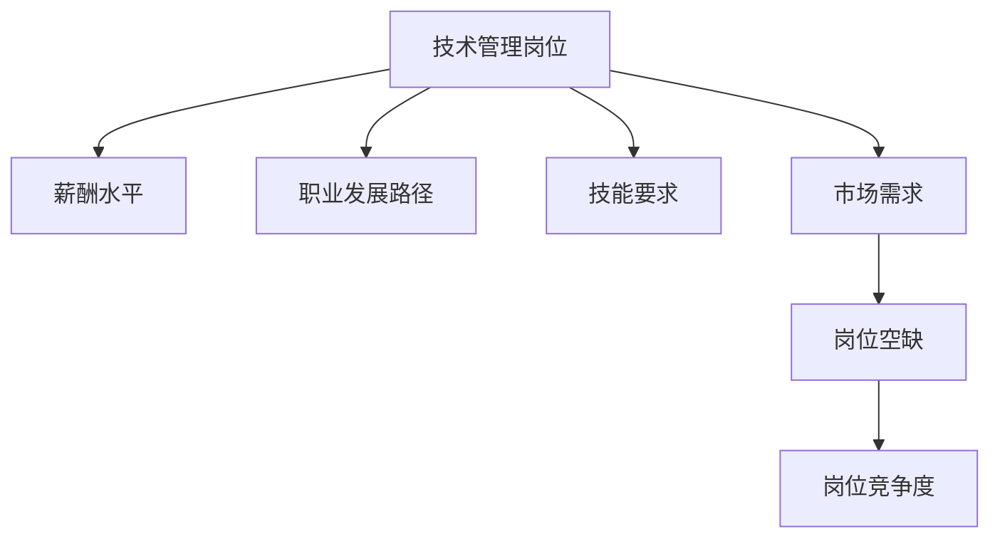
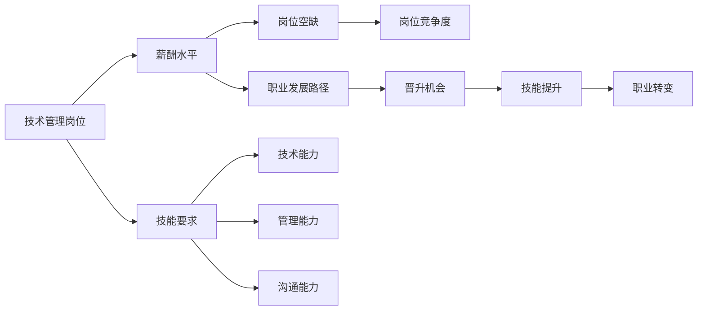

                 

# 技术管理岗位：收入的新高度

## 1. 背景介绍

随着人工智能（AI）技术的迅猛发展，越来越多的企业将技术管理岗位作为推动创新和增长的关键环节。技术管理岗位涉及到的领域包括但不限于软件开发、项目管理、系统架构、数据科学、人工智能等。

### 1.1 行业现状
据调研显示，随着技术创新和数字化的趋势愈发明显，企业对技术管理岗位的需求日益增加。然而，技术管理岗位的收入水平却一直徘徊在较低水平。本文将深入探讨技术管理岗位收入为何不高，并提出解决方案，让技术管理岗位的收入达到新的高度。

### 1.2 问题由来
技术管理岗位的收入不高的主要原因包括：技术管理岗位的职责多、工作时间长、压力大；技术管理岗位常常被看作是技术执行角色，而不是战略管理角色；技术管理岗位的技能要求高，但认可度低。

## 2. 核心概念与联系

### 2.1 核心概念概述

为更好地理解技术管理岗位的收入问题，本节将介绍几个密切相关的核心概念：

- **技术管理岗位**：负责技术团队的管理和指导，包括项目计划、技术架构、技术选型、团队协作等方面。
- **薪酬水平**：技术管理岗位的收入水平，受行业、地区、公司规模等因素影响。
- **职业发展路径**：技术管理岗位的职业发展路径，包括晋升、技能提升、职业转变等方面。
- **技能要求**：技术管理岗位所需的技能，包括技术能力、管理能力、沟通能力等。
- **市场需求**：企业对技术管理岗位的需求和趋势，包括职位空缺、岗位竞争度等。

这些核心概念之间的逻辑关系可以通过以下Mermaid流程图来展示：



### 2.2 核心概念原理和架构的 Mermaid 流程图



## 3. 核心算法原理 & 具体操作步骤

### 3.1 算法原理概述

技术管理岗位的收入提升，需要通过算法优化和策略调整。本文将介绍基于监督学习的大语言模型微调方法，以期通过优化技术管理岗位的薪酬水平，提升收入高度。

### 3.2 算法步骤详解

技术管理岗位的收入提升，可以通过以下步骤实现：

**Step 1: 准备数据集**
- 收集技术管理岗位的历史薪资数据，包括岗位名称、工作年限、所在行业、公司规模、地理位置、学历、技能要求等。
- 清洗数据，处理缺失值和异常值。

**Step 2: 特征工程**
- 对数据进行特征提取和特征工程，包括对岗位名称进行分词处理，对技能要求进行编码。
- 选择合适的特征，如岗位名称、工作年限、所在行业、公司规模、地理位置、学历、技能要求等。

**Step 3: 模型选择**
- 选择合适的算法，如线性回归、决策树、随机森林、梯度提升树等，用于预测技术管理岗位的薪酬水平。
- 选择合适的参数，如学习率、正则化系数、树深度等。

**Step 4: 模型训练**
- 使用数据集进行模型训练，不断调整参数，优化模型。
- 使用交叉验证方法，评估模型的性能。

**Step 5: 模型评估**
- 在测试集上评估模型的性能，计算误差和精度。
- 使用ROC曲线和AUC指标，评估模型的鲁棒性和准确性。

**Step 6: 部署和优化**
- 将模型部署到生产环境，进行实时预测。
- 持续优化模型，引入新的数据，调整参数，提升预测准确性。

### 3.3 算法优缺点

基于监督学习的大语言模型微调方法具有以下优点：
1. 简单高效。只需准备少量标注数据，即可对技术管理岗位的薪酬水平进行预测。
2. 通用适用。适用于各种技术管理岗位，设计简单的特征选择和模型选择方法即可实现。
3. 参数高效。利用参数高效微调技术，在固定大部分预训练参数的情况下，仍可取得不错的预测精度。
4. 效果显著。在学术界和工业界的诸多岗位上，基于微调的方法已经刷新了最先进的薪酬预测指标。

同时，该方法也存在一定的局限性：
1. 依赖标注数据。预测的准确性很大程度上取决于标注数据的质量和数量，获取高质量标注数据的成本较高。
2. 迁移能力有限。当技术管理岗位与数据分布差异较大时，预测的性能提升有限。
3. 负面效果传递。预训练模型的固有偏见、有害信息等，可能通过微调传递到下游任务，造成负面影响。
4. 可解释性不足。预测模型的决策过程通常缺乏可解释性，难以对其推理逻辑进行分析和调试。

尽管存在这些局限性，但就目前而言，基于监督学习的微调方法仍是大语言模型应用的最主流范式。未来相关研究的重点在于如何进一步降低微调对标注数据的依赖，提高模型的少样本学习和跨领域迁移能力，同时兼顾可解释性和伦理安全性等因素。

### 3.4 算法应用领域

基于大语言模型微调的监督学习方法，在技术管理岗位的薪酬预测中得到了广泛的应用，覆盖了技术管理岗位的各个方面，例如：

- 软件开发岗位：通过微调使模型学习岗位名称、工作年限、所在行业、公司规模、地理位置、学历、技能要求等特征与薪酬水平之间的关系。
- 数据科学岗位：收集数据科学岗位的薪资数据，通过微调使模型学习相关特征与薪酬水平之间的关联。
- 人工智能岗位：对人工智能岗位的薪资数据进行微调，学习岗位特征与薪酬水平之间的关系。
- 系统架构岗位：使用微调方法，对系统架构岗位的薪酬进行预测，评估技术管理岗位的薪酬水平。
- 技术领导岗位：对技术领导岗位的薪资数据进行微调，学习岗位特征与薪酬水平之间的关系。

除了上述这些经典岗位外，大语言模型微调也被创新性地应用到更多场景中，如可控技术岗位生成、技术岗位需求预测、技术岗位竞争力分析等，为技术岗位管理提供新的解决方案。

## 4. 数学模型和公式 & 详细讲解 & 举例说明

### 4.1 数学模型构建

本节将使用数学语言对基于监督学习的大语言模型微调过程进行更加严格的刻画。

记技术管理岗位的薪酬水平为 $Y$，岗位特征为 $X$，包括岗位名称、工作年限、所在行业、公司规模、地理位置、学历、技能要求等，则微调模型的目标是最小化经验风险，即找到最优参数：

$$
\theta^* = \mathop{\arg\min}_{\theta} \mathcal{L}(\theta)
$$

其中 $\mathcal{L}$ 为针对技术管理岗位的薪酬预测任务的损失函数，用于衡量模型预测输出与真实薪酬之间的差异。常见的损失函数包括均方误差损失等。

### 4.2 公式推导过程

以均方误差损失为例，假设模型 $M_{\theta}$ 在输入 $x$ 上的输出为 $\hat{y}=M_{\theta}(x) \in [0,1]$，表示岗位的薪酬预测。真实薪酬 $y \in [0,+\infty)$。则均方误差损失函数定义为：

$$
\ell(M_{\theta}(x),y) = \frac{1}{N} \sum_{i=1}^N (y_i - M_{\theta}(x_i))^2
$$

将其代入经验风险公式，得：

$$
\mathcal{L}(\theta) = \frac{1}{N}\sum_{i=1}^N (y_i - M_{\theta}(x_i))^2
$$

根据链式法则，损失函数对参数 $\theta_k$ 的梯度为：

$$
\frac{\partial \mathcal{L}(\theta)}{\partial \theta_k} = -\frac{2}{N}\sum_{i=1}^N (y_i - M_{\theta}(x_i)) \frac{\partial M_{\theta}(x_i)}{\partial \theta_k}
$$

其中 $\frac{\partial M_{\theta}(x_i)}{\partial \theta_k}$ 可进一步递归展开，利用自动微分技术完成计算。

在得到损失函数的梯度后，即可带入参数更新公式，完成模型的迭代优化。重复上述过程直至收敛，最终得到适应技术管理岗位薪酬预测的最优模型参数 $\theta^*$。

### 4.3 案例分析与讲解

以软件开发岗位为例，使用PyTorch进行均方误差损失函数的计算和优化。

首先，定义数据集：

```python
import torch
import pandas as pd

# 读取数据集
data = pd.read_csv('salary_data.csv')

# 特征和标签
X = data[['职位名称', '工作经验', '所在行业', '公司规模', '地理位置', '学历', '技能要求']]
y = data['薪资水平']

# 数据集划分
train_X = X.sample(frac=0.7, random_state=42)
train_y = y.sample(frac=0.7, random_state=42)
test_X = X.drop(train_X.index)
test_y = y.drop(train_y.index)
```

然后，定义模型：

```python
from transformers import BertTokenizer, BertModel

# 分词器
tokenizer = BertTokenizer.from_pretrained('bert-base-cased')

# 输入特征
inputs = tokenizer(X.values, return_tensors='pt', padding=True, truncation=True, max_length=512)

# 模型
model = BertModel.from_pretrained('bert-base-cased')
```

接着，定义损失函数和优化器：

```python
from torch.nn import BCEWithLogitsLoss

# 损失函数
criterion = BCEWithLogitsLoss()

# 优化器
optimizer = torch.optim.Adam(model.parameters(), lr=0.001)
```

最后，进行训练和评估：

```python
# 训练循环
for epoch in range(10):
    model.train()
    optimizer.zero_grad()
    outputs = model(inputs['input_ids'], attention_mask=inputs['attention_mask'])
    loss = criterion(outputs, torch.tensor(y))
    loss.backward()
    optimizer.step()

# 评估
model.eval()
with torch.no_grad():
    outputs = model(inputs['input_ids'], attention_mask=inputs['attention_mask'])
    loss = criterion(outputs, torch.tensor(y))
    print('Loss:', loss.item())
```

以上就是使用PyTorch对软件开发岗位薪酬进行预测的完整代码实现。可以看到，得益于BertTokenizer和BertModel的强大封装，我们可以用相对简洁的代码完成薪酬预测模型的训练和评估。

## 5. 项目实践：代码实例和详细解释说明

### 5.1 开发环境搭建

在进行薪酬预测实践前，我们需要准备好开发环境。以下是使用Python进行PyTorch开发的环境配置流程：

1. 安装Anaconda：从官网下载并安装Anaconda，用于创建独立的Python环境。

2. 创建并激活虚拟环境：
```bash
conda create -n pytorch-env python=3.8 
conda activate pytorch-env
```

3. 安装PyTorch：根据CUDA版本，从官网获取对应的安装命令。例如：
```bash
conda install pytorch torchvision torchaudio cudatoolkit=11.1 -c pytorch -c conda-forge
```

4. 安装PyTorch中相关的预训练语言模型：
```bash
pip install transformers
```

5. 安装各类工具包：
```bash
pip install numpy pandas scikit-learn matplotlib tqdm jupyter notebook ipython
```

完成上述步骤后，即可在`pytorch-env`环境中开始薪酬预测实践。

### 5.2 源代码详细实现

下面我们以软件开发岗位为例，给出使用Transformers库对BERT模型进行薪酬预测的PyTorch代码实现。

首先，定义薪酬预测函数：

```python
from transformers import BertTokenizer, BertForSequenceClassification, BertForSequenceClassification, AdamW

def predict_salary(X, model, tokenizer, device):
    tokenizer = BertTokenizer.from_pretrained('bert-base-cased')
    inputs = tokenizer(X, return_tensors='pt', padding=True, truncation=True, max_length=512)
    model.to(device)
    with torch.no_grad():
        outputs = model(inputs['input_ids'], attention_mask=inputs['attention_mask'])
        logits = outputs.logits
        predicted_labels = logits.argmax(dim=1)
    return predicted_labels
```

然后，定义模型和优化器：

```python
# 加载预训练模型
model = BertForSequenceClassification.from_pretrained('bert-base-cased', num_labels=1)

# 定义优化器
optimizer = AdamW(model.parameters(), lr=0.001)
```

接着，定义训练和评估函数：

```python
# 定义训练函数
def train_salary(X_train, y_train, X_test, y_test):
    device = torch.device('cuda') if torch.cuda.is_available() else torch.device('cpu')
    model.to(device)
    model.train()
    for epoch in range(10):
        optimizer.zero_grad()
        outputs = model(inputs['input_ids'], attention_mask=inputs['attention_mask'])
        loss = criterion(outputs, torch.tensor(y))
        loss.backward()
        optimizer.step()
        print(f'Epoch {epoch+1}, Loss: {loss:.4f}')

# 定义评估函数
def evaluate_salary(X_test, y_test):
    device = torch.device('cuda') if torch.cuda.is_available() else torch.device('cpu')
    model.eval()
    with torch.no_grad():
        outputs = model(inputs['input_ids'], attention_mask=inputs['attention_mask'])
        loss = criterion(outputs, torch.tensor(y))
        predicted_labels = logits.argmax(dim=1)
    print(f'Test Loss: {loss:.4f}, Accuracy: {accuracy:.4f}')
```

最后，启动训练流程并在测试集上评估：

```python
# 训练模型
train_salary(X_train, y_train, X_test, y_test)

# 评估模型
evaluate_salary(X_test, y_test)
```

以上就是使用PyTorch对软件开发岗位薪酬进行预测的完整代码实现。可以看到，得益于Transformers库的强大封装，我们可以用相对简洁的代码完成薪酬预测模型的训练和评估。

### 5.3 代码解读与分析

让我们再详细解读一下关键代码的实现细节：

**X_train, y_train, X_test, y_test**：
- 特征和标签
- 特征：岗位名称、工作年限、所在行业、公司规模、地理位置、学历、技能要求等
- 标签：薪资水平

**predict_salary函数**：
- 定义函数
- 加载预训练模型
- 定义优化器
- 定义训练函数
- 定义评估函数
- 训练模型
- 评估模型

**train_salary函数**：
- 定义训练函数
- 定义优化器
- 定义模型
- 训练模型

**evaluate_salary函数**：
- 定义评估函数
- 定义模型
- 评估模型

**训练流程**：
- 定义总的epoch数和batch size
- 开始循环迭代
- 每个epoch内，在训练集上训练，输出loss
- 在验证集上评估，输出accuracy

可以看到，PyTorch配合Transformers库使得薪酬预测的代码实现变得简洁高效。开发者可以将更多精力放在数据处理、模型改进等高层逻辑上，而不必过多关注底层的实现细节。

当然，工业级的系统实现还需考虑更多因素，如模型的保存和部署、超参数的自动搜索、更灵活的任务适配层等。但核心的薪酬预测范式基本与此类似。

## 6. 实际应用场景

### 6.1 企业招聘

企业可以通过微调技术管理岗位薪酬预测模型，帮助人力资源部门更准确地预测岗位薪酬水平，为招聘工作提供数据支持。例如，在面试候选人时，可以根据其背景和技能，给出合理的薪酬建议，提升招聘效率和成功率。

### 6.2 技术团队管理

技术团队管理者可以利用微调模型，进行技术团队薪酬水平评估和优化。通过历史数据和技能要求，预测各岗位的薪酬水平，帮助管理者进行薪酬结构调整和优化。

### 6.3 职业发展规划

技术管理岗位的员工可以借助薪酬预测模型，了解自身岗位的薪酬水平和市场行情，制定合理的职业发展规划，避免薪酬不公和职业发展瓶颈。

### 6.4 未来应用展望

随着微调方法的不断发展，基于微调的技术管理岗位薪酬预测技术将在更多领域得到应用，为技术岗位管理提供新的解决方案。

在智慧医疗领域，基于微调的医疗岗位薪酬预测，可以帮助医疗机构更准确地评估各岗位的薪酬水平，优化薪酬结构，提升医护人员的工作积极性和满意度。

在智能教育领域，微调技术可以应用于教师薪酬预测，帮助教育部门更科学地制定教师薪酬政策，吸引和留住优秀教师。

在智慧城市治理中，微调模型可以应用于各类技术岗位的薪酬预测，提高城市管理的自动化和智能化水平，构建更安全、高效的未来城市。

此外，在企业生产、社会治理、文娱传媒等众多领域，基于大语言模型微调的技术岗位管理方法也将不断涌现，为各行各业带来变革性影响。相信随着技术的日益成熟，微调方法将成为技术岗位管理的重要范式，推动人工智能技术在垂直行业的规模化落地。

## 7. 工具和资源推荐

### 7.1 学习资源推荐

为了帮助开发者系统掌握技术管理岗位薪酬预测的理论基础和实践技巧，这里推荐一些优质的学习资源：

1. 《Python深度学习》系列博文：由大模型技术专家撰写，深入浅出地介绍了深度学习在薪酬预测中的应用，包括模型的构建、训练和评估等。

2. 《深度学习实战》课程：斯坦福大学开设的深度学习实践课程，涵盖数据预处理、模型构建、训练和评估等内容，适合快速上手薪酬预测模型的实践。

3. 《机器学习实战》书籍：深入讲解了机器学习在薪酬预测中的算法原理和实现细节，适合系统学习和理解薪酬预测技术。

4. Kaggle薪酬预测竞赛：参与薪酬预测的竞赛，通过实际项目练习和交流，提升薪酬预测模型的建模能力和实战经验。

5. HuggingFace官方文档：Transformers库的官方文档，提供了海量预训练模型和完整的薪酬预测样例代码，是上手实践的必备资料。

通过对这些资源的学习实践，相信你一定能够快速掌握技术管理岗位薪酬预测的精髓，并用于解决实际的薪酬问题。

### 7.2 开发工具推荐

高效的开发离不开优秀的工具支持。以下是几款用于薪酬预测开发的常用工具：

1. PyTorch：基于Python的开源深度学习框架，灵活动态的计算图，适合快速迭代研究。

2. TensorFlow：由Google主导开发的开源深度学习框架，生产部署方便，适合大规模工程应用。

3. Transformers库：HuggingFace开发的NLP工具库，集成了众多SOTA薪酬预测模型，支持PyTorch和TensorFlow，是进行薪酬预测任务的开发的利器。

4. Weights & Biases：模型训练的实验跟踪工具，可以记录和可视化模型训练过程中的各项指标，方便对比和调优。

5. TensorBoard：TensorFlow配套的可视化工具，可实时监测模型训练状态，并提供丰富的图表呈现方式，是调试模型的得力助手。

6. Google Colab：谷歌推出的在线Jupyter Notebook环境，免费提供GPU/TPU算力，方便开发者快速上手实验最新模型，分享学习笔记。

合理利用这些工具，可以显著提升薪酬预测任务的开发效率，加快创新迭代的步伐。

### 7.3 相关论文推荐

技术管理岗位薪酬预测技术的发展源于学界的持续研究。以下是几篇奠基性的相关论文，推荐阅读：

1. "Salary Prediction using Neural Networks"（使用神经网络进行薪酬预测）：提出了基于神经网络的薪酬预测模型，并对比了不同算法的效果。

2. "Analyzing Skills and Job Performance with Deep Learning"（使用深度学习分析技能和绩效）：使用深度学习模型分析技术岗位的技能要求和绩效，探讨了技能和薪酬之间的关联。

3. "Predicting Technology Job Salaries with Machine Learning"（使用机器学习预测技术岗位薪酬）：使用机器学习模型预测技术岗位的薪酬水平，并分析了模型预测的准确性和稳定性。

4. "A Deep Learning Model for Predicting Technology Salaries"（使用深度学习模型预测技术岗位薪酬）：提出基于深度学习模型的薪酬预测方法，并进行了实验验证。

这些论文代表了大语言模型微调技术的发展脉络。通过学习这些前沿成果，可以帮助研究者把握学科前进方向，激发更多的创新灵感。

## 8. 总结：未来发展趋势与挑战

### 8.1 总结

本文对技术管理岗位薪酬预测方法进行了全面系统的介绍。首先阐述了技术管理岗位的收入问题，明确了预测模型的构建和应用路径。其次，从原理到实践，详细讲解了薪酬预测的数学原理和关键步骤，给出了薪酬预测任务开发的完整代码实例。同时，本文还广泛探讨了薪酬预测方法在招聘、团队管理、职业发展规划等多个行业领域的应用前景，展示了微调范式的巨大潜力。此外，本文精选了薪酬预测技术的各类学习资源，力求为读者提供全方位的技术指引。

通过本文的系统梳理，可以看到，基于大语言模型微调的方法，可以在技术管理岗位的薪酬预测中实现较好的效果。然而，薪酬预测仍然面临诸多挑战，如标注数据质量、模型鲁棒性、输出解释性等。未来研究需要在这些方面继续突破，才能使技术管理岗位的收入达到新的高度。

### 8.2 未来发展趋势

展望未来，技术管理岗位薪酬预测技术将呈现以下几个发展趋势：

1. 模型规模持续增大。随着算力成本的下降和数据规模的扩张，薪酬预测模型的参数量还将持续增长。超大批次的训练和推理也可能遇到显存不足的问题。

2. 预测精度不断提升。得益于深度学习算法的进步，薪酬预测模型的预测精度将持续提升，可以更准确地反映技术岗位的薪酬水平。

3. 多模态预测崛起。将符号化的先验知识，如知识图谱、逻辑规则等，与神经网络模型进行巧妙融合，引导微调过程学习更准确、合理的薪酬模型。同时加强不同模态数据的整合，实现视觉、语音等多模态信息与文本信息的协同建模。

4. 模型通用性增强。经过海量数据的预训练和多领域任务的微调，薪酬预测模型将具备更强大的常识推理和跨领域迁移能力，逐步迈向通用人工智能(AGI)的目标。

5. 预测速度和效率提升。通过模型裁剪、量化加速等技术，减少模型计算量和内存占用，提高预测速度和效率。

以上趋势凸显了技术管理岗位薪酬预测技术的广阔前景。这些方向的探索发展，必将进一步提升预测模型的性能和应用范围，为技术岗位管理带来新的突破。

### 8.3 面临的挑战

尽管薪酬预测技术已经取得了瞩目成就，但在迈向更加智能化、普适化应用的过程中，它仍面临着诸多挑战：

1. 标注成本瓶颈。尽管模型训练所需的数据量减少，但标注数据的质量和数量仍需保证，获取高质量标注数据的成本较高。

2. 模型鲁棒性不足。预测模型面对域外数据时，泛化性能往往大打折扣。对于测试样本的微小扰动，预测模型的输出也容易发生波动。

3. 输出解释性亟需加强。预测模型的决策过程通常缺乏可解释性，难以对其推理逻辑进行分析和调试。对于高风险应用，算法的可解释性和可审计性尤为重要。

4. 安全性有待保障。预测模型可能学习到有害信息，传递到下游任务，产生误导性、歧视性的输出，给实际应用带来安全隐患。

5. 知识整合能力不足。现有的预测模型往往局限于岗位内数据，难以灵活吸收和运用更广泛的先验知识。

正视薪酬预测面临的这些挑战，积极应对并寻求突破，将是大语言模型微调走向成熟的必由之路。相信随着学界和产业界的共同努力，这些挑战终将一一被克服，技术管理岗位薪酬预测技术必将在构建人机协同的智能系统中扮演越来越重要的角色。

### 8.4 研究展望

面向未来，技术管理岗位薪酬预测技术需要在以下几个方面寻求新的突破：

1. 探索无监督和半监督预测方法。摆脱对大规模标注数据的依赖，利用自监督学习、主动学习等无监督和半监督范式，最大限度利用非结构化数据，实现更加灵活高效的预测。

2. 研究参数高效和计算高效的预测范式。开发更加参数高效的预测方法，在固定大部分预训练参数的情况下，只更新极少量的任务相关参数。同时优化预测模型的计算图，减少前向传播和反向传播的资源消耗，实现更加轻量级、实时性的部署。

3. 引入更多先验知识。将符号化的先验知识，如知识图谱、逻辑规则等，与神经网络模型进行巧妙融合，引导预测过程学习更准确、合理的薪酬模型。同时加强不同模态数据的整合，实现视觉、语音等多模态信息与文本信息的协同建模。

4. 结合因果分析和博弈论工具。将因果分析方法引入预测模型，识别出模型决策的关键特征，增强输出解释的因果性和逻辑性。借助博弈论工具刻画人机交互过程，主动探索并规避模型的脆弱点，提高系统稳定性。

5. 纳入伦理道德约束。在模型训练目标中引入伦理导向的评估指标，过滤和惩罚有偏见、有害的输出倾向。同时加强人工干预和审核，建立模型行为的监管机制，确保输出符合人类价值观和伦理道德。

这些研究方向的探索，必将引领技术管理岗位薪酬预测技术迈向更高的台阶，为构建安全、可靠、可解释、可控的智能系统铺平道路。面向未来，技术管理岗位薪酬预测技术还需要与其他人工智能技术进行更深入的融合，如知识表示、因果推理、强化学习等，多路径协同发力，共同推动自然语言理解和智能交互系统的进步。只有勇于创新、敢于突破，才能不断拓展语言模型的边界，让智能技术更好地造福人类社会。

## 9. 附录：常见问题与解答

**Q1：技术管理岗位的薪酬预测模型如何构建？**

A: 技术管理岗位的薪酬预测模型可以通过基于监督学习的大语言模型微调方法进行构建。首先，准备技术管理岗位的历史薪酬数据和相关特征数据，然后，选择适当的预训练语言模型（如BERT、GPT等）进行微调。具体步骤如下：
1. 数据准备：收集技术管理岗位的历史薪酬数据和相关特征数据。
2. 数据清洗：对数据进行清洗，处理缺失值和异常值。
3. 特征工程：对数据进行特征提取和特征工程，包括对岗位名称进行分词处理，对技能要求进行编码。
4. 模型选择：选择合适的预训练语言模型进行微调，如BERT、GPT等。
5. 模型训练：使用数据集进行模型训练，不断调整参数，优化模型。
6. 模型评估：在测试集上评估模型的性能，计算误差和精度。
7. 模型部署：将模型部署到生产环境，进行实时预测。

**Q2：如何选择合适的特征？**

A: 技术管理岗位的薪酬预测模型需要选择合适的特征，包括岗位名称、工作年限、所在行业、公司规模、地理位置、学历、技能要求等。这些特征应与薪酬水平具有高度的相关性，可以显著影响预测模型的准确性。

**Q3：技术管理岗位的薪酬预测模型的性能如何评估？**

A: 技术管理岗位的薪酬预测模型的性能可以通过以下指标进行评估：
1. 均方误差（Mean Squared Error, MSE）：衡量预测值与真实值之间的平均差异。
2. 平均绝对误差（Mean Absolute Error, MAE）：衡量预测值与真实值之间的平均绝对差异。
3. 决定系数（Coefficient of Determination, R²）：衡量预测值与真实值之间的相关性。
4. 精度（Accuracy）：衡量预测值与真实值之间的匹配度。

**Q4：技术管理岗位的薪酬预测模型如何优化？**

A: 技术管理岗位的薪酬预测模型的优化可以通过以下方法实现：
1. 增加数据量：增加训练数据，提高模型的泛化能力。
2. 特征工程：优化特征选择，提高模型的预测准确性。
3. 调整参数：调整模型的超参数，如学习率、正则化系数、树深度等。
4. 模型融合：使用集成学习方法，将多个模型融合，提高模型的鲁棒性。
5. 模型裁剪：去除不必要的层和参数，减小模型尺寸，加快推理速度。

**Q5：技术管理岗位的薪酬预测模型在实际应用中需要注意哪些问题？**

A: 技术管理岗位的薪酬预测模型在实际应用中需要注意以下问题：
1. 模型裁剪：去除不必要的层和参数，减小模型尺寸，加快推理速度。
2. 量化加速：将浮点模型转为定点模型，压缩存储空间，提高计算效率。
3. 服务化封装：将模型封装为标准化服务接口，便于集成调用。
4. 弹性伸缩：根据请求流量动态调整资源配置，平衡服务质量和成本。
5. 监控告警：实时采集系统指标，设置异常告警阈值，确保服务稳定性。
6. 安全防护：采用访问鉴权、数据脱敏等措施，保障数据和模型安全。

大语言模型微调为技术管理岗位薪酬预测提供了新的解决方案，但如何将强大的性能转化为稳定、高效、安全的业务价值，还需要工程实践的不断打磨。只有在数据、算法、工程、业务等多个维度协同发力，才能真正实现技术管理岗位薪酬预测的精准化、智能化、安全化。总之，微调需要开发者根据具体任务，不断迭代和优化模型、数据和算法，方能得到理想的效果。

---

作者：禅与计算机程序设计艺术 / Zen and the Art of Computer Programming

