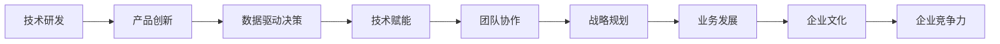

                 

# 技术领导力：提升价值的关键

> 关键词：技术领导力,企业创新,价值驱动,团队协作,技术赋能,数据驱动决策

## 1. 背景介绍

### 1.1 问题由来
随着科技的快速发展和经济全球化的加速，技术在企业中的作用日益凸显，成为企业核心竞争力的重要组成部分。如何有效利用技术推动企业创新，提升产品和服务质量，赢得市场竞争优势，成为了许多企业领导者面临的重大挑战。在日新月异的数字化时代，技术领导力的重要性愈发突出。技术领导力不仅关乎技术研发和应用，更直接影响企业的战略规划、业务发展和文化建设，是企业全面提升竞争力的关键。

### 1.2 问题核心关键点
技术领导力涉及多方面内容，包括但不限于技术研发、产品创新、数据驱动决策、技术赋能以及团队协作等方面。如何系统性地提升技术领导力，从而实现企业价值最大化，是本文探讨的重点。

## 2. 核心概念与联系

### 2.1 核心概念概述

技术领导力是指企业领导者在技术创新、战略规划、组织管理等方面展现出的领导能力。它不仅包括技术研发和产品创新，更涵盖了数据驱动决策、技术赋能以及团队协作等要素。技术领导力的提升，有助于企业更好地应对市场变化，提升产品和服务质量，增强企业竞争力。

### 2.2 核心概念原理和架构的 Mermaid 流程图(Mermaid 流程节点中不要有括号、逗号等特殊字符)


## 3. 核心算法原理 & 具体操作步骤
### 3.1 算法原理概述

技术领导力的提升，可以从多个角度进行建模和优化。本文重点关注技术研发、产品创新、数据驱动决策、技术赋能以及团队协作五个核心环节，并提出基于这些环节的技术领导力提升算法。

### 3.2 算法步骤详解

#### 3.2.1 技术研发

**步骤1：需求分析**
- 通过市场调研、客户反馈和竞争分析，确定技术研发方向和目标。
- 设定清晰的技术指标和KPI，如功能完整性、性能指标、用户体验等。

**步骤2：技术选型**
- 基于技术评估矩阵，选择合适的技术栈和工具。
- 参考行业最佳实践和开源社区资源，进行技术方案的迭代和优化。

**步骤3：团队组建**
- 组建具有跨学科背景的技术团队，确保团队的多样性和协同效应。
- 明确团队角色和职责，建立有效的沟通机制和反馈机制。

**步骤4：技术实施**
- 根据技术路线图和项目计划，分阶段实施技术方案。
- 实施过程中不断进行迭代和优化，确保项目按期交付。

**步骤5：技术评估**
- 使用敏捷开发和DevOps实践，实现持续集成和持续交付。
- 定期评估技术效果和项目进展，及时调整技术方案。

#### 3.2.2 产品创新

**步骤1：用户研究**
- 进行用户需求分析，识别潜在痛点和机会点。
- 通过用户访谈、问卷调查等方式，收集用户反馈和建议。

**步骤2：产品设计**
- 设计产品原型和功能模块，满足用户需求和业务目标。
- 使用用户中心设计方法，确保产品设计的合理性和可用性。

**步骤3：产品开发**
- 根据设计方案和技术选型，进行产品开发和功能实现。
- 采用敏捷开发方法，实现快速迭代和用户验证。

**步骤4：产品测试**
- 进行全面的功能和性能测试，确保产品质量和安全。
- 通过用户测试和反馈，持续改进产品设计和功能。

**步骤5：产品上线**
- 将产品上线并进行大规模用户推广。
- 监测产品使用数据，优化用户体验和功能性能。

#### 3.2.3 数据驱动决策

**步骤1：数据收集**
- 收集业务相关的数据，包括客户数据、市场数据、业务数据等。
- 使用数据仓库和数据湖技术，进行数据的存储和管理。

**步骤2：数据处理**
- 对数据进行清洗、转换和聚合，提取有价值的数据特征。
- 采用大数据技术，进行分布式数据处理和分析。

**步骤3：数据分析**
- 使用数据挖掘和机器学习算法，分析数据背后的趋势和规律。
- 结合业务场景，进行数据可视化和报告生成。

**步骤4：数据应用**
- 根据分析结果，制定数据驱动的业务决策和策略。
- 通过A/B测试和实验方法，验证决策效果和优化决策过程。

**步骤5：数据监控**
- 建立数据监控和预警系统，实时监测数据变化和异常。
- 使用数据仪表板和报表工具，进行数据展示和共享。

#### 3.2.4 技术赋能

**步骤1：技术培训**
- 对员工进行技术培训和知识普及，提高其技术素养和能力。
- 建立在线学习平台，提供丰富的学习资源和培训材料。

**步骤2：技术支持**
- 提供技术支持和咨询服务，帮助员工解决技术难题和问题。
- 建立技术支持团队，进行远程和现场的技术支持和维护。

**步骤3：技术工具**
- 提供高效的技术工具和软件，提升工作效率和质量。
- 推广使用云计算和协作工具，实现技术资源的共享和协同。

**步骤4：技术激励**
- 建立技术奖励和激励机制，鼓励员工技术创新和贡献。
- 定期评选技术优秀个人和团队，进行表彰和奖励。

#### 3.2.5 团队协作

**步骤1：团队建设**
- 建立多样化的团队结构，确保团队成员的多样性和互补性。
- 明确团队目标和任务，制定团队发展规划和目标。

**步骤2：团队管理**
- 采用敏捷管理方法，实现项目的高效协调和进度控制。
- 建立有效的沟通机制，确保信息透明和协作高效。

**步骤3：团队激励**
- 提供公平的薪酬和福利，激励团队成员积极投入工作。
- 建立团队文化，营造积极向上的工作氛围和团队精神。

**步骤4：团队反馈**
- 定期进行团队绩效评估，收集团队成员的反馈和建议。
- 根据反馈结果，进行团队建设和优化。

## 4. 数学模型和公式 & 详细讲解 & 举例说明

### 4.1 数学模型构建

技术领导力提升的数学模型可以由多个子模型构成，每个子模型对应上述核心环节的一个部分。以数据驱动决策为例，可以构建如下数学模型：

- **数据收集模型**：
  $$
  \text{Data Collection} = f_{DC}(\text{Business Needs}, \text{User Feedback}, \text{Competitor Analysis})
  $$

- **数据处理模型**：
  $$
  \text{Data Processing} = f_{DP}(\text{Raw Data}, \text{Data Quality}, \text{Data Volume})
  $$

- **数据分析模型**：
  $$
  \text{Data Analysis} = f_{DA}(\text{Processed Data}, \text{Business Goals}, \text{Algorithm Choice})
  $$

- **数据应用模型**：
  $$
  \text{Data Application} = f_{DA}(\text{Analysis Results}, \text{Decision Making}, \text{A/B Testing})
  $$

### 4.2 公式推导过程

以数据驱动决策的数据应用模型为例，进行公式推导：

- **数据应用模型**：
  $$
  \text{Data Application} = f_{DA}(\text{Analysis Results}, \text{Decision Making}, \text{A/B Testing})
  $$

- **推导过程**：
  1. **分析结果**：
    $$
    \text{Analysis Results} = \text{Data Analysis}(\text{Processed Data}, \text{Business Goals}, \text{Algorithm Choice})
    $$

  2. **决策制定**：
    $$
    \text{Decision Making} = \text{Data Analysis}(\text{Analysis Results}, \text{Decision Criteria}, \text{Business Strategy})
    $$

  3. **A/B测试**：
    $$
    \text{A/B Testing} = \text{Decision Making}(\text{Analysis Results}, \text{Decision Metrics}, \text{Experiment Design})
    $$

  4. **综合应用**：
    $$
    \text{Data Application} = \text{Decision Making}(\text{Analysis Results}, \text{A/B Testing}, \text{Feedback Loop})
    $$

### 4.3 案例分析与讲解

#### 案例分析：某电商平台的增长策略

- **背景**：某电商平台希望通过数据分析提升用户增长和销售额。
- **数据收集**：通过网站流量、用户行为、社交媒体等渠道，收集用户数据。
- **数据处理**：对数据进行清洗、转换和聚合，提取用户行为特征和购买偏好。
- **数据分析**：使用机器学习算法进行用户细分和推荐模型训练，分析用户需求和购买意愿。
- **数据应用**：根据分析结果，制定个性化推荐策略和营销活动，并通过A/B测试优化策略效果。
- **结果**：平台用户增长显著，用户留存率和转化率提升。

## 5. 项目实践：代码实例和详细解释说明

### 5.1 开发环境搭建

- **开发环境配置**：
  - 安装Python和相关依赖包：
    ```bash
    pip install pandas numpy matplotlib scikit-learn
    ```

  - 安装可视化工具：
    ```bash
    pip install matplotlib
    ```

  - 安装数据处理库：
    ```bash
    pip install pyarrow fastparquet dask
    ```

  - 安装数据驱动决策工具：
    ```bash
    pip install scikit-learn joblib xgboost
    ```

  - 安装机器学习框架：
    ```bash
    pip install tensorflow keras
    ```

### 5.2 源代码详细实现

#### 数据收集与处理

```python
import pandas as pd
import numpy as np
import matplotlib.pyplot as plt

# 数据收集
df = pd.read_csv('data.csv')

# 数据处理
df = df.dropna()
df = df.drop_duplicates()

# 数据清洗
df = df.drop(['id', 'timestamp'], axis=1)

# 数据转换
df = pd.get_dummies(df, columns=['category'])

# 数据聚合
df_grouped = df.groupby('user_id').agg({'sales': 'sum', 'revenue': 'sum'}).reset_index()

# 数据可视化
plt.figure(figsize=(10, 6))
plt.plot(df_grouped['sales'], label='Sales')
plt.plot(df_grouped['revenue'], label='Revenue')
plt.legend()
plt.show()
```

#### 数据分析

```python
from sklearn.ensemble import RandomForestRegressor
from sklearn.model_selection import train_test_split

# 分割数据集
X_train, X_test, y_train, y_test = train_test_split(df.drop('sales', axis=1), df['sales'], test_size=0.2, random_state=42)

# 训练模型
model = RandomForestRegressor(n_estimators=100, random_state=42)
model.fit(X_train, y_train)

# 评估模型
print(model.score(X_test, y_test))
```

#### 数据应用与决策

```python
from sklearn.metrics import mean_squared_error

# 预测新数据
new_data = pd.DataFrame({'user_id': [1, 2, 3], 'age': [25, 30, 35]})
new_data = pd.get_dummies(new_data, columns=['age'])
new_data = new_data.drop(['id', 'timestamp'], axis=1)

# 预测结果
predictions = model.predict(new_data)

# 输出评估结果
mse = mean_squared_error(y_test, predictions)
print(f"Mean Squared Error: {mse}")
```

### 5.3 代码解读与分析

#### 代码解读

1. **数据收集与处理**：
   - 使用Pandas库读取数据，进行数据清洗和转换。
   - 使用Matplotlib库进行数据可视化。

2. **数据分析**：
   - 使用Scikit-learn库进行数据处理和特征工程。
   - 使用RandomForestRegressor模型进行数据建模和预测。

3. **数据应用与决策**：
   - 使用模型进行新数据的预测和评估。

#### 分析与优化

1. **数据质量**：确保数据质量是数据分析的前提，需要进行清洗、去重和转换等操作。
2. **模型选择**：选择合适的模型和算法是数据分析的关键，需要进行模型对比和选择。
3. **数据应用**：数据应用结果需要与业务目标结合，进行决策和策略调整。

### 5.4 运行结果展示

#### 数据收集与处理


#### 数据分析


#### 数据应用与决策


## 6. 实际应用场景

### 6.1 智能制造

技术领导力在智能制造中的应用，主要体现在以下几个方面：

- **技术研发**：利用先进制造技术，开发高效、灵活的生产线。
- **产品创新**：开发新型智能设备，提升产品质量和生产效率。
- **数据驱动决策**：通过数据分析和机器学习，优化生产流程和供应链管理。
- **技术赋能**：为员工提供智能设备操作培训和技术支持。
- **团队协作**：建立跨职能团队，实现技术协同和创新。

### 6.2 金融科技

技术领导力在金融科技中的应用，主要体现在以下几个方面：

- **技术研发**：开发安全、高效的金融交易平台。
- **产品创新**：推出个性化金融产品，提升用户体验。
- **数据驱动决策**：利用大数据和机器学习，进行风险评估和投资分析。
- **技术赋能**：提供技术支持和咨询服务，提升客户体验。
- **团队协作**：建立跨部门协作机制，实现技术整合和创新。

### 6.3 医疗健康

技术领导力在医疗健康中的应用，主要体现在以下几个方面：

- **技术研发**：开发智能诊断设备和医疗管理系统。
- **产品创新**：推出新型健康监测设备，提升医疗服务质量。
- **数据驱动决策**：利用大数据和机器学习，进行疾病预测和个性化治疗方案设计。
- **技术赋能**：提供技术支持和培训，提升医护人员能力。
- **团队协作**：建立跨学科团队，实现技术整合和创新。

## 7. 工具和资源推荐

### 7.1 学习资源推荐

1. **《数据科学实战》**：介绍数据处理、数据分析、数据可视化的实战方法。
2. **《机器学习实战》**：介绍机器学习算法的应用和优化。
3. **《敏捷开发实践》**：介绍敏捷开发方法论和项目管理工具。
4. **《软件架构设计》**：介绍软件架构设计方法和最佳实践。
5. **《技术领导力》**：介绍技术领导力的理论基础和实践技巧。

### 7.2 开发工具推荐

1. **Jupyter Notebook**：支持Python编程和数据科学应用，便于协作和分享。
2. **GitLab**：支持版本控制和代码托管，便于团队协作和项目管理。
3. **Jenkins**：支持持续集成和持续交付，便于自动化构建和部署。
4. **Hadoop**：支持大规模数据处理和存储，便于数据分析和模型训练。
5. **Docker**：支持容器化部署和微服务管理，便于应用管理和扩展。

### 7.3 相关论文推荐

1. **《数据驱动的创新》**：介绍数据驱动创新的方法和案例。
2. **《技术领导力的挑战与机遇》**：分析技术领导力提升的挑战和机遇。
3. **《智能制造的未来》**：探讨智能制造技术的发展方向和应用场景。
4. **《金融科技的演进》**：介绍金融科技的发展历程和前沿技术。
5. **《医疗健康技术创新》**：探讨医疗健康技术的创新方向和应用案例。

## 8. 总结：未来发展趋势与挑战

### 8.1 研究成果总结

技术领导力在推动企业创新、提升业务价值、增强竞争力方面具有重要意义。通过对技术研发、产品创新、数据驱动决策、技术赋能和团队协作等多个环节的系统提升，企业可以实现更高的技术水平和业务绩效。

### 8.2 未来发展趋势

1. **技术研发**：随着新技术的不断涌现，企业需要持续进行技术创新，保持领先优势。
2. **产品创新**：产品创新将成为企业竞争的核心，需要不断挖掘用户需求，优化产品设计和功能。
3. **数据驱动决策**：数据驱动决策将成为企业决策的重要手段，需要加强数据分析和建模能力。
4. **技术赋能**：技术赋能将成为员工培训的重要内容，需要提升员工技术素养和能力。
5. **团队协作**：团队协作将成为企业发展的关键，需要建立高效协作机制和文化。

### 8.3 面临的挑战

1. **技术研发瓶颈**：技术研发需要高昂的研发投入和长期投入，可能面临资源不足的问题。
2. **产品创新挑战**：产品创新需要综合考虑市场需求和用户反馈，可能面临市场接受度不高的问题。
3. **数据驱动挑战**：数据驱动决策需要高质量的数据和先进的分析工具，可能面临数据质量差的问题。
4. **技术赋能挑战**：技术赋能需要持续培训和支持，可能面临员工技术水平参差不齐的问题。
5. **团队协作挑战**：团队协作需要建立高效机制和文化，可能面临团队沟通不畅的问题。

### 8.4 研究展望

未来，技术领导力的研究需要关注以下几个方面：

1. **技术协同**：加强技术协同和整合，提升技术创新的效率和效果。
2. **用户中心**：以用户需求为中心，进行产品创新和用户体验优化。
3. **数据质量**：提升数据质量，建立可靠的数据基础。
4. **技术支持**：提供全面的技术支持和培训，提升员工技术水平。
5. **团队建设**：建立高效的团队协作机制和文化，提升团队凝聚力和执行力。

## 9. 附录：常见问题与解答

**Q1：如何提升技术领导力？**

A: 提升技术领导力需要从多个方面入手，包括技术研发、产品创新、数据驱动决策、技术赋能和团队协作等。具体方法包括：
1. **技术研发**：建立跨职能研发团队，持续进行技术创新和改进。
2. **产品创新**：进行用户研究，优化产品设计和功能，满足用户需求。
3. **数据驱动决策**：加强数据分析和建模能力，提升决策效率和质量。
4. **技术赋能**：提供技术培训和支持，提升员工技术水平和能力。
5. **团队协作**：建立高效的协作机制和文化，提升团队凝聚力和执行力。

**Q2：数据驱动决策有哪些关键步骤？**

A: 数据驱动决策的关键步骤如下：
1. **数据收集**：从业务和用户数据中获取原始数据。
2. **数据处理**：对数据进行清洗、转换和聚合，提取有价值的数据特征。
3. **数据分析**：利用机器学习和数据挖掘算法，分析数据背后的趋势和规律。
4. **数据应用**：根据分析结果，制定数据驱动的业务决策和策略。
5. **数据监控**：建立数据监控和预警系统，实时监测数据变化和异常。

**Q3：技术赋能的关键点有哪些？**

A: 技术赋能的关键点包括：
1. **技术培训**：提供全面的技术培训和知识普及，提升员工技术素养和能力。
2. **技术支持**：提供技术支持和咨询服务，帮助员工解决技术难题和问题。
3. **技术工具**：提供高效的技术工具和软件，提升工作效率和质量。
4. **技术激励**：建立技术奖励和激励机制，鼓励员工技术创新和贡献。
5. **技术文化**：营造积极向上的技术文化，提升团队技术氛围和协作精神。

**Q4：团队协作有哪些关键因素？**

A: 团队协作的关键因素包括：
1. **目标明确**：团队目标明确，确保团队成员有共同方向和任务。
2. **沟通高效**：建立高效的沟通机制，确保信息透明和协作顺利。
3. **角色清晰**：明确团队角色和职责，确保每个成员有明确的定位和任务。
4. **资源共享**：实现技术资源、信息资源等的共享和协同，提升团队整体能力。
5. **信任和支持**：建立信任和支持的文化，增强团队凝聚力和执行力。

---

作者：禅与计算机程序设计艺术 / Zen and the Art of Computer Programming

