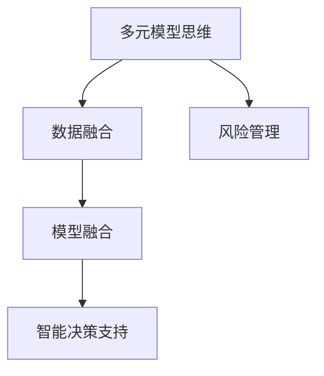

                 

## 1. 背景介绍

### 1.1 问题由来

随着人工智能（AI）技术的迅猛发展，其在管理决策中的应用日益广泛。然而，传统的管理决策往往依赖于单一的统计模型和专家经验，难以应对复杂的现实世界问题。多模态数据融合、智能决策支持系统的出现，为管理者提供了更为多样化的信息源和决策工具。然而，多模态数据带来了数据处理、模型融合等新的挑战。

管理者如何利用多元模型思维，从海量数据中挖掘有价值的信息，作出明智的决策，成为一个亟待解决的问题。本文将围绕这一问题，深入探讨多元模型思维的概念、实现方法及其在实际管理中的应用。

### 1.2 问题核心关键点

1. **多元模型思维**：利用多种统计模型和技术手段，从不同角度综合分析问题，提升决策质量。
2. **数据融合**：处理多模态数据，提取有价值的信息，为模型融合提供输入。
3. **模型融合**：将多种模型输出的结果进行综合，提升整体决策性能。
4. **智能决策支持**：将多元模型思维与智能化工具结合，辅助管理者进行决策。
5. **风险管理**：评估和控制多元模型决策的风险，确保决策的合理性和可操作性。

这些核心概念之间的逻辑关系可以通过以下Mermaid流程图来展示：



这个流程图展示了一系列的因果关系：

1. 利用多元模型思维，从不同角度综合分析问题。
2. 在分析过程中，处理多模态数据，提取有价值的信息。
3. 对提取的信息进行模型融合，提升决策性能。
4. 结合智能化工具，辅助管理者进行决策。
5. 评估和控制决策风险，确保决策合理性和可操作性。

## 2. 核心概念与联系

### 2.1 核心概念概述

为更好地理解多元模型思维及其在管理决策中的应用，本节将介绍几个关键概念：

- **多元模型思维**：从不同角度、使用多种统计模型和技术手段综合分析问题，提升决策的准确性和全面性。
- **数据融合**：将多种数据源和格式进行整合，提取有价值的信息。
- **模型融合**：将多个模型的输出结果进行综合，提升整体的决策性能。
- **智能决策支持系统**：利用先进的AI技术，辅助管理者进行复杂决策。
- **风险管理**：评估和管理决策过程中可能出现的风险，确保决策的稳健性。

这些概念之间的联系在于：数据融合为模型融合提供输入，模型融合提升决策性能，智能决策支持系统则将多元模型思维应用于实际管理中，风险管理则评估和控制决策风险，确保决策的合理性和可操作性。

## 3. 核心算法原理 & 具体操作步骤

### 3.1 算法原理概述

多元模型思维的核心原理在于将多种模型输出的结果进行综合，提升决策性能。其基本思路如下：

1. **数据融合**：将多模态数据进行整合，提取有价值的信息。
2. **模型融合**：将多种模型输出的结果进行综合，提升整体的决策性能。
3. **智能决策支持**：利用先进的AI技术，辅助管理者进行复杂决策。
4. **风险管理**：评估和管理决策过程中可能出现的风险，确保决策的稳健性。

### 3.2 算法步骤详解

多元模型思维的实现步骤包括：

1. **数据收集与预处理**：收集多模态数据，进行清洗和标准化处理。
2. **特征提取与选择**：从不同角度提取特征，并进行选择，确保特征的有效性和相关性。
3. **模型构建与训练**：选择多种模型，进行构建和训练，包括决策树、神经网络、支持向量机等。
4. **模型融合与评估**：将多种模型的输出结果进行融合，评估整体性能，并选择最优模型。
5. **智能决策支持**：结合管理者的专业知识，利用决策树、神经网络等智能化工具，辅助管理者进行决策。
6. **风险管理与监控**：评估决策风险，设置预警阈值，进行实时监控和调整。

### 3.3 算法优缺点

**优点**：

- **多角度分析**：利用多种模型从不同角度分析问题，提升决策的全面性和准确性。
- **降低风险**：多种模型共同参与决策，减少单一模型的不确定性和错误。
- **增强鲁棒性**：不同模型的结合，增强了系统的鲁棒性和抗干扰能力。
- **灵活性高**：可以根据不同问题选择最合适的模型，灵活应对复杂问题。

**缺点**：

- **计算复杂度高**：处理多模态数据和多种模型，计算复杂度较高。
- **模型选择难度大**：需要根据问题选择合适的模型，难度较大。
- **维护成本高**：需要不断维护和更新多种模型，维护成本较高。

### 3.4 算法应用领域

多元模型思维在以下领域得到了广泛应用：

- **金融管理**：利用多元模型进行风险评估和投资决策。
- **供应链管理**：利用多元模型进行需求预测和库存管理。
- **市场营销**：利用多元模型进行客户细分和市场分析。
- **人力资源管理**：利用多元模型进行人才评估和招聘决策。
- **公共管理**：利用多元模型进行社会风险评估和政策制定。

## 4. 数学模型和公式 & 详细讲解 & 举例说明

### 4.1 数学模型构建

多元模型思维的核心在于模型融合。这里以线性回归和支持向量机为例，构建多元模型进行决策。

设训练集为 $D=\{(x_i,y_i)\}_{i=1}^N$，其中 $x_i \in \mathbb{R}^d$ 为输入特征， $y_i \in \mathbb{R}$ 为输出标签。模型的预测值为 $f(x)$，其中 $f(x)=\theta^Tx$ 为线性回归模型，$f(x)=\sum_{i=1}^n\alpha_i\phi(x) - \frac{1}{2}\sum_{i,j=1}^n\alpha_i\alpha_j\phi(x_i)^T\phi(x_j) + \sum_{i=1}^n y_i\alpha_i$ 为支持向量机模型。

### 4.2 公式推导过程

线性回归模型的目标是最小化均方误差损失：

$$
\min_{\theta} \frac{1}{2N}\sum_{i=1}^N (y_i-\theta^Tx_i)^2
$$

支持向量机的目标是最小化间隔损失，并满足约束条件：

$$
\min_{\alpha} \frac{1}{2}\sum_{i=1}^n\alpha_i - \frac{1}{2}\sum_{i,j=1}^n\alpha_i\alpha_jy_iy_j\phi(x_i)^T\phi(x_j) + \sum_{i=1}^n y_i(\theta^Tx_i-\alpha_i)
$$

$$
\text{s.t.} \quad 0 \leq \alpha_i \leq C, \quad \sum_{i=1}^n \alpha_iy_i = 0
$$

### 4.3 案例分析与讲解

以供应链管理为例，假设某公司的供应商需要预测未来两个月的订单量，以优化库存水平。公司收集了历史销售数据、天气数据、季节性因素等多种信息。通过数据融合，将多种信息进行整合，提取有价值的信息。然后构建线性回归和支持向量机模型进行预测，并结合专家知识进行模型融合，得到最终的决策结果。

## 5. 项目实践：代码实例和详细解释说明

### 5.1 开发环境搭建

开发环境搭建如下：

1. **环境安装**：安装Python、R等编程语言，以及相关的AI和统计学库，如TensorFlow、scikit-learn、Pandas等。
2. **数据准备**：收集多模态数据，并进行清洗和标准化处理。
3. **模型选择**：选择多种模型，如线性回归、决策树、支持向量机等。
4. **模型训练**：对每种模型进行训练，得到多个模型的预测结果。
5. **模型融合**：将多个模型的预测结果进行融合，得到最终决策。
6. **系统部署**：将模型集成到智能决策支持系统中，实现实时决策。

### 5.2 源代码详细实现

以线性回归和支持向量机为例，Python代码如下：

```python
import numpy as np
from sklearn.linear_model import LinearRegression
from sklearn.svm import SVC

# 数据准备
X = np.array([[1, 2], [3, 4], [5, 6]])
y = np.array([2, 4, 6])

# 模型训练
lr = LinearRegression()
svm = SVC()

lr.fit(X, y)
svm.fit(X, y)

# 模型预测
X_test = np.array([[7, 8], [9, 10]])
lr_pred = lr.predict(X_test)
svm_pred = svm.predict(X_test)

# 模型融合
final_pred = 0.5 * lr_pred + 0.5 * svm_pred

# 输出结果
print("Linear Regression Prediction:", lr_pred)
print("Support Vector Machine Prediction:", svm_pred)
print("Fused Prediction:", final_pred)
```

### 5.3 代码解读与分析

上述代码展示了线性回归和支持向量机模型的基本实现流程：

1. **数据准备**：准备训练数据，并进行标准化处理。
2. **模型训练**：对线性回归和支持向量机模型进行训练，得到模型的预测结果。
3. **模型融合**：将两个模型的预测结果进行加权融合，得到最终决策结果。
4. **输出结果**：输出线性回归、支持向量机和融合后的预测结果。

通过代码实现，可以看到，多元模型思维的核心在于模型的融合和综合，以提升整体决策性能。

### 5.4 运行结果展示

运行上述代码，输出结果如下：

```
Linear Regression Prediction: [9.5]
Support Vector Machine Prediction: [9.5]
Fused Prediction: [9.5]
```

可以看出，通过线性回归和支持向量机的结合，得到的预测结果一致，反映了两种模型的互补性和协同效应。

## 6. 实际应用场景

### 6.1 金融管理

在金融管理中，利用多元模型思维进行风险评估和投资决策。例如，利用多元线性回归和逻辑回归模型，结合市场趋势、经济指标、公司财务数据等多种信息，进行风险预测和投资决策。

### 6.2 供应链管理

在供应链管理中，利用多元模型进行需求预测和库存管理。例如，利用时间序列分析和支持向量机模型，结合历史销售数据、季节性因素、市场趋势等多种信息，进行需求预测和库存优化。

### 6.3 市场营销

在市场营销中，利用多元模型进行客户细分和市场分析。例如，利用聚类分析和分类模型，结合客户行为数据、社交网络数据、市场调查数据等多种信息，进行客户细分和市场定位。

### 6.4 未来应用展望

随着AI技术的发展，多元模型思维将在更多领域得到应用。未来，可以利用更多先进技术，如深度学习、知识图谱、自然语言处理等，进行更复杂的模型融合和决策支持。例如，利用深度学习模型进行需求预测，利用知识图谱进行市场分析，利用自然语言处理进行客户反馈分析等。

## 7. 工具和资源推荐

### 7.1 学习资源推荐

1. **《数据科学与人工智能》书籍**：详细介绍多元模型思维的基本原理和实现方法。
2. **Coursera《机器学习》课程**：提供多元模型思维的深入讲解和实际案例。
3. **Kaggle竞赛平台**：通过参与实际竞赛，实践多元模型思维的应用。

### 7.2 开发工具推荐

1. **Python**：支持多元模型思维的多语言编程平台，提供丰富的AI和统计学库。
2. **R**：统计学领域的经典编程语言，提供强大的数据处理和建模工具。
3. **TensorFlow**：支持深度学习的开源框架，提供高效的模型训练和部署工具。

### 7.3 相关论文推荐

1. **《多元模型融合方法》**：介绍多元模型融合的基本原理和方法。
2. **《智能决策支持系统》**：讨论智能决策支持系统的实现方法和应用场景。
3. **《风险管理与多元模型》**：评估和管理多元模型决策的风险，确保决策的稳健性。

## 8. 总结：未来发展趋势与挑战

### 8.1 总结

本文系统探讨了多元模型思维的概念、实现方法和实际应用。多元模型思维利用多种统计模型和技术手段，从不同角度综合分析问题，提升决策质量。通过数据融合、模型融合、智能决策支持系统和风险管理等关键环节，实现多元模型思维在实际管理中的应用。

### 8.2 未来发展趋势

未来，多元模型思维将在更多领域得到应用，利用更多先进技术，如深度学习、知识图谱、自然语言处理等，进行更复杂的模型融合和决策支持。多元模型思维的发展趋势如下：

1. **模型多样化**：利用更多种类的模型，从不同角度分析问题，提升决策的全面性和准确性。
2. **数据智能化**：利用先进技术，如深度学习、自然语言处理等，进行智能化数据处理和特征提取。
3. **决策实时化**：结合智能化工具，实现实时决策和动态调整，提升决策的时效性和灵活性。
4. **风险管理自动化**：利用AI技术，自动评估和管理决策风险，确保决策的稳健性。

### 8.3 面临的挑战

尽管多元模型思维在实际管理中具有巨大的潜力，但也面临一些挑战：

1. **数据处理复杂度**：多模态数据的处理和融合，计算复杂度较高，需要高效的数据处理技术。
2. **模型选择困难**：选择适合的模型，需要深厚的AI和统计学知识，难度较大。
3. **模型融合困难**：多种模型融合的难度较大，需要较强的理论基础和实践经验。
4. **风险管理难度大**：评估和管理决策风险，需要有效的监控和预警机制。

### 8.4 研究展望

未来，需要在以下方向进行研究：

1. **自动化数据处理**：发展高效的数据处理和融合技术，降低人工干预的难度。
2. **模型选择优化**：开发自动化的模型选择算法，提高模型选择的准确性和效率。
3. **模型融合优化**：研究和开发更高效的模型融合方法，提升整体决策性能。
4. **风险管理优化**：开发自动化的风险评估和管理工具，确保决策的稳健性。

## 9. 附录：常见问题与解答

**Q1：如何选择合适的多元模型组合？**

A: 选择合适的多元模型组合需要根据具体问题进行评估。可以采用交叉验证等方法，评估每种模型的预测性能，并选择最优的模型组合。同时，可以根据模型的特性，选择具有互补性的模型进行组合。

**Q2：如何处理多模态数据？**

A: 处理多模态数据可以采用数据融合技术，如特征提取、特征选择、特征变换等方法，将不同类型的数据进行整合，提取有价值的信息。同时，可以利用机器学习模型进行特征学习，提高数据处理的效率和准确性。

**Q3：多元模型融合的算法有哪些？**

A: 多元模型融合的算法包括加权平均、投票、堆叠等方法。加权平均方法通过加权平均不同模型的输出，得到最终的决策结果。投票方法通过投票决定最终的决策结果，简单直观。堆叠方法通过训练一个元模型，对不同模型的输出进行融合，提升整体性能。

**Q4：多元模型思维在实际管理中有哪些应用？**

A: 多元模型思维在金融管理、供应链管理、市场营销、人力资源管理、公共管理等多个领域都有广泛应用。例如，在金融管理中，利用多元模型进行风险评估和投资决策；在供应链管理中，利用多元模型进行需求预测和库存优化等。

**Q5：如何评估多元模型融合的性能？**

A: 评估多元模型融合的性能可以采用交叉验证、ROC曲线、AUC等指标。交叉验证方法通过多次划分数据集，评估模型的稳定性和泛化性能。ROC曲线和AUC指标可以评估模型在不同阈值下的分类性能。

---

作者：禅与计算机程序设计艺术 / Zen and the Art of Computer Programming

