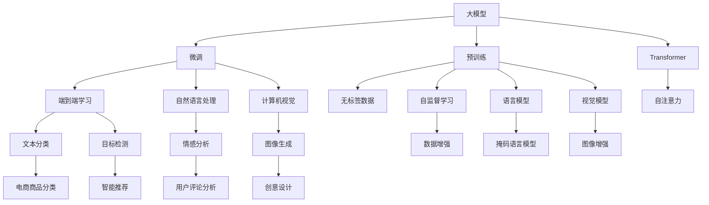

                 

# 探索基于大模型的电商智能商品分类系统

## 1. 背景介绍

在电商行业中，商品分类是一个至关重要的任务，关系到消费者能否快速找到所需商品、销售人员能否高效处理订单、库存管理是否精确等。传统的商品分类方法大多依赖人工标注，不仅耗时耗力，而且分类精度受人工标注质量影响较大。而基于大模型的智能分类系统，能够自动化处理大规模商品数据，快速准确地进行分类，极大地提升了电商平台的运营效率和用户体验。

大模型在商品分类任务上的应用，最早可以追溯到预训练语言模型。例如，BERT、GPT等模型通过在大规模文本语料上进行预训练，学习到了通用的语言表示，可以用于处理自然语言文本分类任务。然而，随着预训练模型在各类任务上的表现不断突破，人们开始探索更高效的模型结构和方法，逐步转向了基于Transformer的端到端分类模型，如DALL-E、CLIP等。

本文将探讨基于大模型的电商智能商品分类系统，并介绍其主要原理和具体操作步骤，同时结合实际案例进行详细讲解和分析。

## 2. 核心概念与联系

### 2.1 核心概念概述

- **大模型**：指具有数亿或数十亿参数的深度学习模型，如BERT、GPT、DALL-E、CLIP等。这些模型通过大规模数据预训练，学习到了丰富的语言或视觉特征，具备强大的自监督学习能力。
- **预训练**：指在大规模无标签数据上，通过自监督学习任务对模型进行训练，学习到通用的特征表示。预训练模型通常在大规模文本语料、图像库等数据上进行。
- **微调**：指在预训练模型的基础上，使用任务特定的有标签数据对模型进行细粒度优化，使其适应特定的任务需求。微调能够大幅提升模型的任务精度。
- **端到端学习**：指模型能够直接从原始数据到输出结果进行训练，中间不需要中间层的特征提取和融合，提高模型的训练效率和精度。
- **自然语言处理**：指通过计算机处理和理解自然语言文本的技术，包括文本分类、命名实体识别、情感分析等任务。
- **计算机视觉**：指计算机对图像、视频等视觉数据的处理和理解技术，包括图像分类、目标检测、图像生成等任务。
- **Transformer**：一种基于自注意力机制的神经网络结构，被广泛应用于自然语言处理和计算机视觉任务中，具有并行计算和全局特征学习的能力。

这些核心概念通过以下Mermaid流程图进行展示：



## 3. 核心算法原理 & 具体操作步骤
### 3.1 算法原理概述

基于大模型的电商智能商品分类系统，通过在大规模无标签数据上进行预训练，学习到通用的语言或视觉特征，并在任务特定的有标签数据上进行微调，提升模型对特定任务的表现。具体流程如下：

1. **预训练**：在大规模无标签数据上，使用自监督学习任务对模型进行训练，学习到通用的语言或视觉特征。
2. **微调**：使用任务特定的有标签数据对模型进行微调，调整模型的输出层权重，使其适应特定的任务需求。
3. **端到端学习**：模型能够直接从原始数据到输出结果进行训练，中间不需要中间层的特征提取和融合，提高模型的训练效率和精度。
4. **Transformer**：使用Transformer结构，提高模型的并行计算能力和全局特征学习能力。

### 3.2 算法步骤详解

#### 3.2.1 预训练步骤

1. **数据准备**：收集大规模无标签商品数据，如电商平台的商品描述、图片等。
2. **模型选择**：选择合适的预训练模型，如BERT、DALL-E、CLIP等，作为初始化参数。
3. **训练任务**：选择适合的自监督学习任务，如掩码语言模型、图像生成任务等，对模型进行预训练。
4. **保存模型**：保存预训练好的模型，以便后续微调使用。

#### 3.2.2 微调步骤

1. **数据准备**：收集任务特定的有标签商品数据，如电商平台的商品分类标签、用户评论等。
2. **模型选择**：选择与预训练模型一致或兼容的模型，如在大规模图像数据上进行预训练的DALL-E模型，在自然语言处理数据上进行预训练的BERT模型。
3. **模型微调**：使用任务特定的有标签数据对模型进行微调，调整模型的输出层权重，使其适应特定的任务需求。
4. **验证模型**：在验证集上评估微调后模型的性能，调整超参数，直至模型达到最优性能。
5. **保存模型**：保存微调好的模型，用于实际的商品分类任务。

#### 3.2.3 运行结果

1. **训练曲线**：绘制模型在不同epoch上的损失曲线，观察模型在训练集和验证集上的表现。
2. **精度评估**：在测试集上评估微调后模型的精度，对比微调前后模型的性能提升。
3. **输出结果**：使用微调好的模型对新商品数据进行分类预测，输出商品类别。

### 3.3 算法优缺点

#### 3.3.1 优点

1. **通用性**：预训练模型能够适用于多种任务，在大规模数据上进行预训练后，能够适应特定的商品分类任务。
2. **高效性**：端到端学习的架构，避免了中间层的特征提取和融合，提高了模型的训练效率。
3. **准确性**：通过微调，模型能够快速适应特定的商品分类任务，提高模型的分类精度。
4. **可扩展性**：通过不同的预训练和微调任务，可以构建多个适应不同任务的商品分类模型。

#### 3.3.2 缺点

1. **数据依赖**：预训练和微调过程需要大量的无标签和有标签数据，数据获取和标注成本较高。
2. **资源消耗**：预训练和微调模型需要大量的计算资源，模型的训练和推理速度较慢。
3. **过拟合风险**：当微调数据集较小或标注质量较差时，模型容易出现过拟合现象。
4. **模型复杂度**：大模型的参数量较大，模型的存储和推理开销较大。

### 3.4 算法应用领域

基于大模型的电商智能商品分类系统，已经在电商行业得到了广泛的应用，主要用于以下几个方面：

1. **商品推荐**：根据用户历史行为数据，预测用户可能感兴趣的商品，提高用户满意度。
2. **库存管理**：根据历史销售数据，预测商品需求量，优化库存管理，降低库存成本。
3. **市场分析**：分析商品销售数据，预测市场趋势，指导商家制定营销策略。
4. **用户评论分析**：分析用户评论，提取商品评价信息，提升商品质量。
5. **个性化定制**：根据用户需求，生成个性化的商品推荐和定制方案，提升用户体验。

## 4. 数学模型和公式 & 详细讲解 & 举例说明

### 4.1 数学模型构建

#### 4.1.1 预训练模型

预训练模型通常采用自监督学习任务进行训练，如掩码语言模型。假设有大规模文本数据集 $D=\{x_1, x_2, ..., x_n\}$，每个文本 $x_i$ 长度为 $L$，使用掩码语言模型进行预训练。

模型的输入 $X_i$ 为文本 $x_i$，输出 $Y_i$ 为预测结果。使用掩码语言模型进行预训练时，将文本 $x_i$ 中的某些位置进行掩码处理，如将某些单词随机替换为 [MASK]，模型需要预测被掩码位置的单词。

模型的预训练目标函数为：

$$
\mathcal{L}=\sum_{i=1}^N\sum_{m=1}^M(y_i^m-\hat{y}_i^m)^2
$$

其中 $y_i^m$ 为真实的掩码位置单词，$\hat{y}_i^m$ 为模型预测的单词。

#### 4.1.2 微调模型

微调模型的目标函数与预训练模型类似，但增加了任务特定的输出层，并使用有标签数据进行训练。假设有标签商品数据集 $D=\{(x_i, y_i)\}_{i=1}^N$，其中 $x_i$ 为商品描述或图片，$y_i$ 为商品分类标签。

模型的输入 $X_i$ 为商品描述或图片，输出 $Y_i$ 为商品分类标签。使用微调模型进行分类时，模型的输出层需要与分类任务相适应，通常使用softmax层进行分类。

微调模型的目标函数为：

$$
\mathcal{L}=\sum_{i=1}^N\sum_{j=1}^C(y_i^j-\hat{y}_i^j)^2
$$

其中 $y_i^j$ 为真实的商品分类标签，$\hat{y}_i^j$ 为模型预测的商品分类标签。

### 4.2 公式推导过程

#### 4.2.1 预训练模型推导

假设使用掩码语言模型进行预训练，模型包含 $h$ 个隐藏层，每个隐藏层包含 $d_h$ 个神经元，模型的输入为文本 $x$，输出为预测结果 $\hat{y}$。

模型的隐藏层表示为 $h_l(x)=W_hx+b_h$，其中 $W_h$ 为权重矩阵，$b_h$ 为偏置向量。模型的输出层表示为 $y=\sigma(h_l(x)W_o+b_o)$，其中 $W_o$ 和 $b_o$ 为输出层的权重和偏置。

模型的预训练目标函数为：

$$
\mathcal{L}=\sum_{i=1}^N\sum_{m=1}^M(-y_i^m\log\hat{y}_i^m-(1-y_i^m)\log(1-\hat{y}_i^m))
$$

其中 $y_i^m$ 为真实的掩码位置单词，$\hat{y}_i^m$ 为模型预测的单词。

#### 4.2.2 微调模型推导

假设使用微调模型进行商品分类，模型包含 $h$ 个隐藏层，每个隐藏层包含 $d_h$ 个神经元，模型的输入为商品描述或图片 $x$，输出为商品分类标签 $y$。

模型的隐藏层表示为 $h_l(x)=W_hx+b_h$，其中 $W_h$ 为权重矩阵，$b_h$ 为偏置向量。模型的输出层表示为 $y=\sigma(h_l(x)W_o+b_o)$，其中 $W_o$ 和 $b_o$ 为输出层的权重和偏置。

模型的微调目标函数为：

$$
\mathcal{L}=\sum_{i=1}^N\sum_{j=1}^C(y_i^j-\hat{y}_i^j)^2
$$

其中 $y_i^j$ 为真实的商品分类标签，$\hat{y}_i^j$ 为模型预测的商品分类标签。

### 4.3 案例分析与讲解

#### 4.3.1 数据预处理

电商商品分类任务的数据预处理主要包括商品描述文本的清洗、归一化、分词等。以商品描述文本为例，首先需要去除文本中的特殊字符和标点符号，然后将文本转换为小写，并去除停用词。接着，使用分词工具将文本切分成词汇，构建词汇表，将文本转换为词汇索引。

#### 4.3.2 数据划分

电商商品分类任务的数据集通常包含训练集、验证集和测试集。训练集用于模型训练，验证集用于调整超参数，测试集用于评估模型性能。训练集和验证集的比例一般为7:3，测试集的比例为剩余部分。

#### 4.3.3 模型微调

使用微调模型进行商品分类时，通常将商品描述或图片作为输入，通过模型输出层得到商品分类标签。在微调过程中，需要调整输出层的权重和偏置，使其适应商品分类的任务需求。

假设有商品分类标签 $y_i=(y_i^1, y_i^2, ..., y_i^C)$，其中 $y_i^j$ 表示商品 $i$ 属于第 $j$ 个分类。模型输出层为 $y=\sigma(h_l(x)W_o+b_o)$，其中 $W_o$ 和 $b_o$ 为输出层的权重和偏置。

微调目标函数为：

$$
\mathcal{L}=\sum_{i=1}^N\sum_{j=1}^C(y_i^j-\hat{y}_i^j)^2
$$

其中 $y_i^j$ 为真实的商品分类标签，$\hat{y}_i^j$ 为模型预测的商品分类标签。

## 5. 项目实践：代码实例和详细解释说明

### 5.1 开发环境搭建

在进行电商智能商品分类系统开发前，需要先准备好开发环境。以下是使用Python进行PyTorch开发的环境配置流程：

1. 安装Anaconda：从官网下载并安装Anaconda，用于创建独立的Python环境。

2. 创建并激活虚拟环境：
```bash
conda create -n pytorch-env python=3.8 
conda activate pytorch-env
```

3. 安装PyTorch：根据CUDA版本，从官网获取对应的安装命令。例如：
```bash
conda install pytorch torchvision torchaudio cudatoolkit=11.1 -c pytorch -c conda-forge
```

4. 安装Transformers库：
```bash
pip install transformers
```

5. 安装各类工具包：
```bash
pip install numpy pandas scikit-learn matplotlib tqdm jupyter notebook ipython
```

完成上述步骤后，即可在`pytorch-env`环境中开始项目实践。

### 5.2 源代码详细实现

下面我们以电商商品分类任务为例，给出使用Transformers库对BERT模型进行微调的PyTorch代码实现。

首先，定义商品分类任务的数据处理函数：

```python
from transformers import BertTokenizer
from torch.utils.data import Dataset
import torch

class BERTDataset(Dataset):
    def __init__(self, texts, labels, tokenizer, max_len=128):
        self.texts = texts
        self.labels = labels
        self.tokenizer = tokenizer
        self.max_len = max_len
        
    def __len__(self):
        return len(self.texts)
    
    def __getitem__(self, item):
        text = self.texts[item]
        label = self.labels[item]
        
        encoding = self.tokenizer(text, return_tensors='pt', max_length=self.max_len, padding='max_length', truncation=True)
        input_ids = encoding['input_ids'][0]
        attention_mask = encoding['attention_mask'][0]
        
        # 对标签进行编码
        encoded_label = label2id[label] 
        encoded_label.extend([label2id['O']] * (self.max_len - len(encoded_label)))
        labels = torch.tensor(encoded_label, dtype=torch.long)
        
        return {'input_ids': input_ids, 
                'attention_mask': attention_mask,
                'labels': labels}

# 标签与id的映射
label2id = {'O': 0, 'F': 1, 'C': 2, 'E': 3}

# 创建dataset
tokenizer = BertTokenizer.from_pretrained('bert-base-cased')

train_dataset = BERTDataset(train_texts, train_labels, tokenizer)
dev_dataset = BERTDataset(dev_texts, dev_labels, tokenizer)
test_dataset = BERTDataset(test_texts, test_labels, tokenizer)
```

然后，定义模型和优化器：

```python
from transformers import BertForTokenClassification, AdamW

model = BertForTokenClassification.from_pretrained('bert-base-cased', num_labels=len(label2id))

optimizer = AdamW(model.parameters(), lr=2e-5)
```

接着，定义训练和评估函数：

```python
from torch.utils.data import DataLoader
from tqdm import tqdm
from sklearn.metrics import classification_report

device = torch.device('cuda') if torch.cuda.is_available() else torch.device('cpu')
model.to(device)

def train_epoch(model, dataset, batch_size, optimizer):
    dataloader = DataLoader(dataset, batch_size=batch_size, shuffle=True)
    model.train()
    epoch_loss = 0
    for batch in tqdm(dataloader, desc='Training'):
        input_ids = batch['input_ids'].to(device)
        attention_mask = batch['attention_mask'].to(device)
        labels = batch['labels'].to(device)
        model.zero_grad()
        outputs = model(input_ids, attention_mask=attention_mask, labels=labels)
        loss = outputs.loss
        epoch_loss += loss.item()
        loss.backward()
        optimizer.step()
    return epoch_loss / len(dataloader)

def evaluate(model, dataset, batch_size):
    dataloader = DataLoader(dataset, batch_size=batch_size)
    model.eval()
    preds, labels = [], []
    with torch.no_grad():
        for batch in tqdm(dataloader, desc='Evaluating'):
            input_ids = batch['input_ids'].to(device)
            attention_mask = batch['attention_mask'].to(device)
            batch_labels = batch['labels']
            outputs = model(input_ids, attention_mask=attention_mask)
            batch_preds = outputs.logits.argmax(dim=2).to('cpu').tolist()
            batch_labels = batch_labels.to('cpu').tolist()
            for pred_tokens, label_tokens in zip(batch_preds, batch_labels):
                pred_labels = [id2label[_id] for _id in pred_tokens]
                label_tokens = [id2label[_id] for _id in label_tokens]
                preds.append(pred_labels[:len(label_tokens)])
                labels.append(label_tokens)
                
    print(classification_report(labels, preds))
```

最后，启动训练流程并在测试集上评估：

```python
epochs = 5
batch_size = 16

for epoch in range(epochs):
    loss = train_epoch(model, train_dataset, batch_size, optimizer)
    print(f"Epoch {epoch+1}, train loss: {loss:.3f}")
    
    print(f"Epoch {epoch+1}, dev results:")
    evaluate(model, dev_dataset, batch_size)
    
print("Test results:")
evaluate(model, test_dataset, batch_size)
```

以上就是使用PyTorch对BERT进行电商商品分类任务微调的完整代码实现。可以看到，得益于Transformers库的强大封装，我们可以用相对简洁的代码完成BERT模型的加载和微调。

### 5.3 代码解读与分析

让我们再详细解读一下关键代码的实现细节：

**BERTDataset类**：
- `__init__`方法：初始化文本、标签、分词器等关键组件。
- `__len__`方法：返回数据集的样本数量。
- `__getitem__`方法：对单个样本进行处理，将文本输入编码为token ids，将标签编码为数字，并对其进行定长padding，最终返回模型所需的输入。

**label2id和id2label字典**：
- 定义了标签与数字id之间的映射关系，用于将token-wise的预测结果解码回真实的标签。

**训练和评估函数**：
- 使用PyTorch的DataLoader对数据集进行批次化加载，供模型训练和推理使用。
- 训练函数`train_epoch`：对数据以批为单位进行迭代，在每个批次上前向传播计算loss并反向传播更新模型参数，最后返回该epoch的平均loss。
- 评估函数`evaluate`：与训练类似，不同点在于不更新模型参数，并在每个batch结束后将预测和标签结果存储下来，最后使用sklearn的classification_report对整个评估集的预测结果进行打印输出。

**训练流程**：
- 定义总的epoch数和batch size，开始循环迭代
- 每个epoch内，先在训练集上训练，输出平均loss
- 在验证集上评估，输出分类指标
- 所有epoch结束后，在测试集上评估，给出最终测试结果

可以看到，PyTorch配合Transformers库使得BERT微调的代码实现变得简洁高效。开发者可以将更多精力放在数据处理、模型改进等高层逻辑上，而不必过多关注底层的实现细节。

当然，工业级的系统实现还需考虑更多因素，如模型的保存和部署、超参数的自动搜索、更灵活的任务适配层等。但核心的微调范式基本与此类似。

## 6. 实际应用场景

### 6.1 智能推荐系统

智能推荐系统是电商行业的重要应用场景之一。传统的推荐系统往往只依赖用户的历史行为数据进行物品推荐，无法深入理解用户的真实兴趣偏好。基于大语言模型微调技术，智能推荐系统可以更好地挖掘用户行为背后的语义信息，从而提供更精准、多样的推荐内容。

在实践中，可以收集用户浏览、点击、评论、分享等行为数据，提取和用户交互的物品标题、描述、标签等文本内容。将文本内容作为模型输入，用户的后续行为（如是否点击、购买等）作为监督信号，在此基础上微调预训练语言模型。微调后的模型能够从文本内容中准确把握用户的兴趣点。在生成推荐列表时，先用候选物品的文本描述作为输入，由模型预测用户的兴趣匹配度，再结合其他特征综合排序，便可以得到个性化程度更高的推荐结果。

### 6.2 库存管理

电商平台的库存管理需要根据历史销售数据，预测商品需求量，优化库存管理，降低库存成本。传统的库存管理系统往往只能基于历史数据进行简单预测，无法动态调整库存策略。而基于大语言模型微调的商品分类系统，可以实时监测商品销售情况，通过预测商品分类标签，动态调整库存策略，优化库存管理。

在实践中，可以收集商品的销售数据，包括每天的销售量、用户评价等。使用微调后的商品分类模型，预测商品的分类标签，进而预测商品的需求量。根据预测结果，动态调整库存策略，如增加或减少库存量，降低库存成本，提高库存周转率。

### 6.3 用户评论分析

用户评论是电商平台获取用户反馈的重要渠道，可以用于改进商品质量和服务体验。传统的用户评论分析方法往往需要人工标注，成本较高，且分析结果依赖标注质量。而基于大语言模型微调技术，可以自动分析用户评论，提取商品评价信息，提升商品质量。

在实践中，可以收集用户对商品的所有评论，使用微调后的商品分类模型，自动分析评论内容，提取商品的评价信息，如质量、价格、服务等。根据评论分析结果，商家可以及时改进商品质量，提升用户满意度。

## 7. 工具和资源推荐
### 7.1 学习资源推荐

为了帮助开发者系统掌握基于大模型的电商智能商品分类系统的理论基础和实践技巧，这里推荐一些优质的学习资源：

1. 《Transformer from Basics to Practice》系列博文：由大模型技术专家撰写，深入浅出地介绍了Transformer原理、BERT模型、微调技术等前沿话题。

2. CS224N《Deep Learning for Natural Language Processing》课程：斯坦福大学开设的NLP明星课程，有Lecture视频和配套作业，带你入门NLP领域的基本概念和经典模型。

3. 《Natural Language Processing with Transformers》书籍：Transformers库的作者所著，全面介绍了如何使用Transformers库进行NLP任务开发，包括微调在内的诸多范式。

4. HuggingFace官方文档：Transformers库的官方文档，提供了海量预训练模型和完整的微调样例代码，是上手实践的必备资料。

5. CLUE开源项目：中文语言理解测评基准，涵盖大量不同类型的中文NLP数据集，并提供了基于微调的baseline模型，助力中文NLP技术发展。

通过对这些资源的学习实践，相信你一定能够快速掌握基于大模型的电商智能商品分类系统的精髓，并用于解决实际的NLP问题。
###  7.2 开发工具推荐

高效的开发离不开优秀的工具支持。以下是几款用于大语言模型微调开发的常用工具：

1. PyTorch：基于Python的开源深度学习框架，灵活动态的计算图，适合快速迭代研究。大部分预训练语言模型都有PyTorch版本的实现。

2. TensorFlow：由Google主导开发的开源深度学习框架，生产部署方便，适合大规模工程应用。同样有丰富的预训练语言模型资源。

3. Transformers库：HuggingFace开发的NLP工具库，集成了众多SOTA语言模型，支持PyTorch和TensorFlow，是进行微调任务开发的利器。

4. Weights & Biases：模型训练的实验跟踪工具，可以记录和可视化模型训练过程中的各项指标，方便对比和调优。与主流深度学习框架无缝集成。

5. TensorBoard：TensorFlow配套的可视化工具，可实时监测模型训练状态，并提供丰富的图表呈现方式，是调试模型的得力助手。

6. Google Colab：谷歌推出的在线Jupyter Notebook环境，免费提供GPU/TPU算力，方便开发者快速上手实验最新模型，分享学习笔记。

合理利用这些工具，可以显著提升大语言模型微调任务的开发效率，加快创新迭代的步伐。

### 7.3 相关论文推荐

大语言模型和微调技术的发展源于学界的持续研究。以下是几篇奠基性的相关论文，推荐阅读：

1. Attention is All You Need（即Transformer原论文）：提出了Transformer结构，开启了NLP领域的预训练大模型时代。

2. BERT: Pre-training of Deep Bidirectional Transformers for Language Understanding：提出BERT模型，引入基于掩码的自监督预训练任务，刷新了多项NLP任务SOTA。

3. Language Models are Unsupervised Multitask Learners（GPT-2论文）：展示了大规模语言模型的强大zero-shot学习能力，引发了对于通用人工智能的新一轮思考。

4. Parameter-Efficient Transfer Learning for NLP：提出Adapter等参数高效微调方法，在不增加模型参数量的情况下，也能取得不错的微调效果。

5. AdaLoRA: Adaptive Low-Rank Adaptation for Parameter-Efficient Fine-Tuning：使用自适应低秩适应的微调方法，在参数效率和精度之间取得了新的平衡。

这些论文代表了大语言模型微调技术的发展脉络。通过学习这些前沿成果，可以帮助研究者把握学科前进方向，激发更多的创新灵感。

## 8. 总结：未来发展趋势与挑战

### 8.1 研究成果总结

本文对基于大模型的电商智能商品分类系统进行了全面系统的介绍。首先阐述了大语言模型和微调技术的研究背景和意义，明确了微调在拓展预训练模型应用、提升下游任务性能方面的独特价值。其次，从原理到实践，详细讲解了基于大模型的电商智能商品分类系统的数学原理和关键步骤，给出了商品分类任务的完整代码实例。同时，本文还广泛探讨了商品分类任务在电商行业中的应用前景，展示了微调范式的巨大潜力。

通过本文的系统梳理，可以看到，基于大语言模型的电商智能商品分类系统已经在电商行业得到了广泛的应用，并取得了显著的效果。未来，伴随大语言模型和微调方法的持续演进，基于大模型的电商智能商品分类系统将会有更广阔的发展空间，为电商行业带来更多的创新和变革。

### 8.2 未来发展趋势

展望未来，基于大模型的电商智能商品分类技术将呈现以下几个发展趋势：

1. **模型规模持续增大**：随着算力成本的下降和数据规模的扩张，预训练语言模型的参数量还将持续增长。超大规模语言模型蕴含的丰富语言知识，有望支撑更加复杂多变的商品分类任务。

2. **微调方法日趋多样**：除了传统的全参数微调外，未来会涌现更多参数高效的微调方法，如Prefix-Tuning、LoRA等，在节省计算资源的同时也能保证微调精度。

3. **持续学习成为常态**：随着数据分布的不断变化，微调模型也需要持续学习新知识以保持性能。如何在不遗忘原有知识的同时，高效吸收新样本信息，将成为重要的研究课题。

4. **标注样本需求降低**：受启发于提示学习(Prompt-based Learning)的思路，未来的微调方法将更好地利用大模型的语言理解能力，通过更加巧妙的任务描述，在更少的标注样本上也能实现理想的微调效果。

5. **多模态微调崛起**：当前的微调主要聚焦于纯文本数据，未来会进一步拓展到图像、视频、语音等多模态数据微调。多模态信息的融合，将显著提升语言模型对现实世界的理解和建模能力。

6. **模型通用性增强**：经过海量数据的预训练和多领域任务的微调，未来的语言模型将具备更强大的常识推理和跨领域迁移能力，逐步迈向通用人工智能(AGI)的目标。

以上趋势凸显了大语言模型微调技术的广阔前景。这些方向的探索发展，必将进一步提升商品分类系统的性能和应用范围，为电商行业带来更多的创新和变革。

### 8.3 面临的挑战

尽管基于大模型的电商智能商品分类技术已经取得了瞩目成就，但在迈向更加智能化、普适化应用的过程中，它仍面临着诸多挑战：

1. **标注成本瓶颈**：预训练和微调过程需要大量的无标签和有标签数据，数据获取和标注成本较高。如何进一步降低微调对标注样本的依赖，将是一大难题。

2. **模型鲁棒性不足**：当微调数据集较小或标注质量较差时，模型容易出现过拟合现象。如何提高微调模型的鲁棒性，避免灾难性遗忘，还需要更多理论和实践的积累。

3. **推理效率有待提高**：大规模语言模型虽然精度高，但在实际部署时往往面临推理速度慢、内存占用大等效率问题。如何在保证性能的同时，简化模型结构，提升推理速度，优化资源占用，将是重要的优化方向。

4. **可解释性亟需加强**：当前微调模型更像是"黑盒"系统，难以解释其内部工作机制和决策逻辑。对于医疗、金融等高风险应用，算法的可解释性和可审计性尤为重要。如何赋予微调模型更强的可解释性，将是亟待攻克的难题。

5. **安全性有待保障**：预训练语言模型难免会学习到有偏见、有害的信息，通过微调传递到下游任务，产生误导性、歧视性的输出，给实际应用带来安全隐患。如何从数据和算法层面消除模型偏见，避免恶意用途，确保输出的安全性，也将是重要的研究课题。

6. **知识整合能力不足**：现有的微调模型往往局限于任务内数据，难以灵活吸收和运用更广泛的先验知识。如何让微调过程更好地与外部知识库、规则库等专家知识结合，形成更加全面、准确的信息整合能力，还有很大的想象空间。

正视微调面临的这些挑战，积极应对并寻求突破，将是大语言模型微调走向成熟的必由之路。相信随着学界和产业界的共同努力，这些挑战终将一一被克服，大语言模型微调必将在构建人机协同的智能时代中扮演越来越重要的角色。

### 8.4 研究展望

面对大语言模型微调所面临的种种挑战，未来的研究需要在以下几个方面寻求新的突破：

1. **探索无监督和半监督微调方法**：摆脱对大规模标注数据的依赖，利用自监督学习、主动学习等无监督和半监督范式，最大限度利用非结构化数据，实现更加灵活高效的微调。

2. **研究参数高效和计算高效的微调范式**：开发更加参数高效的微调方法，在固定大部分预训练参数的同时，只更新极少量的任务相关参数。同时优化微调模型的计算图，减少前向传播和反向传播的资源消耗，实现更加轻量级、实时性的部署。

3. **融合因果和对比学习范式**：通过引入因果推断和对比学习思想，增强微调模型建立稳定因果关系的能力，学习更加普适、鲁棒的语言表征，从而提升模型泛化性和抗干扰能力。

4. **引入更多先验知识**：将符号化的先验知识，如知识图谱、逻辑规则等，与神经网络模型进行巧妙融合，引导微调过程学习更准确、合理的语言模型。同时加强不同模态数据的整合，实现视觉、语音等多模态信息与文本信息的协同建模。

5. **结合因果分析和博弈论工具**：将因果分析方法引入微调模型，识别出模型决策的关键特征，增强输出解释的因果性和逻辑性。借助博弈论工具刻画人机交互过程，主动探索并规避模型的脆弱点，提高系统稳定性。

6. **纳入伦理道德约束**：在模型训练目标中引入伦理导向的评估指标，过滤和惩罚有偏见、有害的输出倾向。同时加强人工干预和审核，建立模型行为的监管机制，确保输出符合人类价值观和伦理道德。

这些研究方向的探索，必将引领大语言模型微调技术迈向更高的台阶，为构建安全、可靠、可解释、可控的智能系统铺平道路。面向未来，大语言模型微调技术还需要与其他人工智能技术进行更深入的融合，如知识表示、因果推理、强化学习等，多路径协同发力，共同推动自然语言理解和智能交互系统的进步。只有勇于创新、敢于突破，才能不断拓展语言模型的边界，让智能技术更好地造福人类社会。

## 9. 附录：常见问题与解答

**Q1：电商商品分类系统如何处理长尾商品？**

A: 长尾商品是指销量较低但种类繁多的小众商品。对于长尾商品的分类，传统的机器学习方法往往依赖于标注数据，标注成本较高。而基于大模型的电商智能商品分类系统，可以通过微调处理长尾商品。

具体方法包括：
1. 数据增强：使用数据增强技术，通过仿射变换、旋转、缩放等方式，生成更多的长尾商品图像或文本。
2. 迁移学习：在已分类好的商品上，使用迁移学习技术，将分类好的知识迁移到长尾商品分类上。
3. 多任务学习：将长尾商品分类与其他商品分类任务联合训练，共享参数，提高长尾商品分类的效果。

通过这些方法，可以有效地处理长尾商品的分类问题，提升电商智能商品分类系统的性能。

**Q2：电商商品分类系统如何应对快速变化的商品市场？**

A: 快速变化的商品市场对电商智能商品分类系统提出了更高的要求。为应对快速变化的商品市场，可以采取以下措施：

1. **持续微调**：在电商商品市场变化时，及时对商品分类模型进行微调，更新分类标签和特征，确保模型能够适应新商品分类任务。
2. **动态采样**：使用动态采样技术，实时获取和更新商品数据，将最新数据加入到训练集中，提高模型对新商品的分类能力。
3. **多模型融合**：构建多个适应不同时间段的商品分类模型，根据时间段的更新频率，动态选择模型进行预测，确保模型能够实时适应商品市场变化。

通过这些方法，电商智能商品分类系统可以及时应对快速变化的商品市场，提高模型对新商品的分类能力。

**Q3：电商商品分类系统如何保证模型安全性和可靠性？**

A: 电商智能商品分类系统的模型安全性和可靠性是至关重要的。为保证模型安全性和可靠性，可以采取以下措施：

1. **数据清洗**：对输入的商品数据进行清洗，去除噪声和异常值，确保模型训练数据的准确性。
2. **模型检测**：定期检测商品分类模型，检测模型的鲁棒性和可靠性，确保模型能够稳定运行。
3. **安全防护**：使用访问鉴权、数据脱敏等措施，保障数据和模型安全，防止数据泄露和模型攻击。
4. **模型监控**：实时监控商品分类模型的运行状态，检测模型的异常行为，及时进行修复和优化。

通过这些方法，可以保证电商智能商品分类系统的模型安全性和可靠性，确保系统的稳定运行和用户的信任。

**Q4：电商智能商品分类系统如何提高模型的可解释性？**

A: 电商智能商品分类系统的可解释性是用户关心的重要指标。为提高模型的可解释性，可以采取以下措施：

1. **可视化分析**：使用可视化技术，展示模型在训练和推理过程中的决策过程，帮助用户理解模型的输出结果。
2. **特征分析**：分析模型的特征表示，提取模型学习到的重要特征，解释模型的决策依据。
3. **规则集成**：将规则和知识库与模型结合，提高模型的可解释性和可信度，增强用户对模型的信任。

通过这些方法，可以提高电商智能商品分类系统的可解释性，帮助用户理解模型的决策过程，增强用户的信任和满意度。

---

作者：禅与计算机程序设计艺术 / Zen and the Art of Computer Programming

