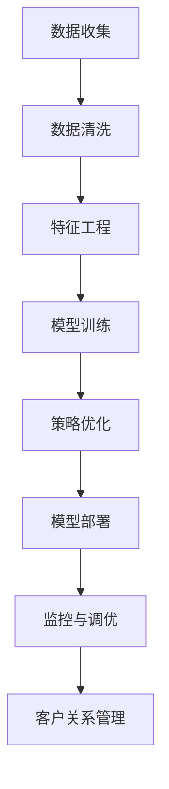

                 

# 探索基于大模型的电商智能客户生命周期管理系统

> 关键词：客户生命周期管理, 电商, 大模型, 智能推荐, 预测模型, 营销策略

## 1. 背景介绍

### 1.1 问题由来
在数字化转型的大背景下，电商企业面临着复杂多变的市场竞争环境。如何有效管理客户生命周期，提高客户忠诚度和复购率，成为电商企业的核心挑战。传统的客户关系管理(CRM)系统往往依赖大量人工规则和经验，难以适应快速变化的电商市场。近年来，基于人工智能(AI)的智能客户生命周期管理系统(CCMS)逐渐崭露头角，通过数据分析、模型预测和策略优化等手段，实现了客户关系管理的自动化和智能化，从而提升了客户满意度、销售转化率和客户终身价值。

在CCMS系统中，数据驱动的预测模型和策略优化是其核心。通过深入分析历史交易记录、客户行为数据、市场趋势等，模型能够预测客户未来的行为和需求，从而帮助企业制定更加精准、高效的营销策略。然而，构建高精度的预测模型并不是一件容易的事情，需要大量的数据、先进的算法和深厚的技术积累。在电商领域，如何设计和使用高效、准确的预测模型，成为亟待解决的难题。

### 1.2 问题核心关键点
智能客户生命周期管理系统(CCMS)的核心在于如何利用机器学习和大数据技术，对客户数据进行建模和预测，从而优化营销策略和客户关系管理。以下是CCMS系统设计中需要重点关注的几个关键点：

1. **数据质量与特征工程**：客户数据的质量和特征设计，直接影响到模型预测的准确性和效果。如何高效、准确地提取和处理客户特征，是CCMS系统设计的基础。

2. **模型选择与评估**：选择合适的预测模型，并根据实际应用场景进行评估和调优，是CCMS系统设计的核心。常见的模型包括线性回归、随机森林、神经网络等。

3. **策略优化与决策支持**：基于模型预测结果，制定最优的营销策略和决策方案，是CCMS系统的最终目标。如何将模型预测与业务决策紧密结合，实现智能化客户关系管理，是CCMS系统设计的重要考量。

4. **模型部署与监控**：将模型部署到实际生产环境中，并对其进行实时监控和调优，是CCMS系统设计的关键步骤。如何确保模型在实时环境中的稳定性和准确性，是CCMS系统设计的挑战。

## 2. 核心概念与联系

### 2.1 核心概念概述

在CCMS系统中，基于大模型的预测模型是整个系统的核心组件。以下是几个关键概念的介绍：

- **客户生命周期管理(Customer Lifecycle Management, CLM)**：指通过对客户在整个生命周期内的行为数据进行分析，预测其未来的购买倾向和需求，从而指导企业制定相应的营销策略和客户服务方案。

- **预测模型(Prediction Model)**：指利用历史数据和机器学习算法，对未来客户行为和需求进行预测的模型。常见的预测模型包括线性回归、逻辑回归、决策树、随机森林、神经网络等。

- **客户分群(Customer Segmentation)**：指根据客户的行为特征和属性，将其分为不同的群体，以便进行差异化的营销和管理。

- **营销策略(Marketing Strategy)**：指根据客户分群和预测模型，制定针对性的营销方案和促销活动，以提升客户满意度和忠诚度。

这些核心概念之间的逻辑关系可以通过以下Mermaid流程图来展示：



这个流程图展示了CCMS系统的数据流和决策流程，从数据收集、清洗到模型训练、优化，再到策略部署和监控，每一步都是系统设计的重要环节。

## 3. 核心算法原理 & 具体操作步骤
### 3.1 算法原理概述

基于大模型的预测模型，利用历史交易数据、客户行为数据和市场趋势数据，通过机器学习算法对客户未来的行为进行预测。常用的预测模型包括线性回归、随机森林、神经网络等。

预测模型的核心原理是通过学习历史数据，发现数据中的规律和模式，从而对未来的数据进行预测。具体步骤如下：

1. **数据收集**：收集客户的历史交易数据、行为数据、属性数据等，作为模型的输入。

2. **数据清洗**：对数据进行去重、缺失值填充、异常值处理等预处理操作，以保证数据质量。

3. **特征工程**：选择和构造对预测有影响的特征，进行归一化、编码等处理。

4. **模型训练**：选择合适的预测模型，并使用训练数据对模型进行训练。

5. **模型评估**：使用测试数据对模型进行评估，计算模型的准确率、召回率、F1分数等指标。

6. **模型优化**：根据评估结果对模型进行调整，如增加特征、调整超参数等。

7. **模型部署**：将训练好的模型部署到实际生产环境中，进行实时预测。

8. **监控与调优**：对模型的运行状态进行监控，并根据实际效果进行调优。

### 3.2 算法步骤详解

以下是一个基于大模型的预测模型的具体操作步骤：

**Step 1: 数据收集与预处理**
- 收集客户的历史交易数据、行为数据、属性数据等，作为模型的输入。
- 对数据进行去重、缺失值填充、异常值处理等预处理操作，以保证数据质量。

**Step 2: 特征工程**
- 选择和构造对预测有影响的特征，如客户的购买频率、浏览记录、年龄段、性别等。
- 对特征进行归一化、编码等处理，如将类别特征转换为独热编码。

**Step 3: 模型训练**
- 选择合适的预测模型，如随机森林、神经网络等。
- 使用训练数据对模型进行训练，优化模型参数。

**Step 4: 模型评估**
- 使用测试数据对模型进行评估，计算模型的准确率、召回率、F1分数等指标。
- 根据评估结果调整模型参数，如增加特征、调整超参数等。

**Step 5: 模型部署**
- 将训练好的模型部署到实际生产环境中，进行实时预测。

**Step 6: 监控与调优**
- 对模型的运行状态进行监控，确保其稳定性和准确性。
- 根据实际效果对模型进行调整，如重新训练模型、增加新特征等。

### 3.3 算法优缺点

基于大模型的预测模型具有以下优点：

1. **预测精度高**：大模型能够捕捉复杂的数据模式，预测精度较高。

2. **自动化程度高**：模型训练和预测过程完全自动化，无需人工干预。

3. **可扩展性强**：模型能够处理大规模数据，适用于多维度、高维度的客户数据。

4. **实时性较好**：模型的预测过程可以快速完成，适合实时化客户关系管理。

然而，大模型也存在一些缺点：

1. **数据依赖性强**：模型的预测结果高度依赖于训练数据的质量和数量，数据偏差可能影响模型的性能。

2. **计算资源需求高**：大模型的训练和预测过程需要大量的计算资源，如高性能GPU、大容量内存等。

3. **模型复杂度高**：大模型通常较为复杂，难以理解和调试。

4. **可解释性不足**：大模型往往被视为"黑盒"系统，难以解释其内部工作机制和决策逻辑。

### 3.4 算法应用领域

基于大模型的预测模型广泛应用于客户生命周期管理的各个环节，包括客户分群、预测客户流失、预测客户购买意愿、优化营销策略等。具体如下：

- **客户分群**：利用大模型对客户进行分群，以便进行差异化的营销和管理。
- **预测客户流失**：使用大模型预测客户的流失概率，帮助企业提前采取措施，减少客户流失。
- **预测客户购买意愿**：利用大模型预测客户未来的购买行为，帮助企业制定精准的营销策略。
- **优化营销策略**：根据预测结果，制定最优的营销方案和促销活动，提升客户满意度和忠诚度。

## 4. 数学模型和公式 & 详细讲解  
### 4.1 数学模型构建

在本节中，我们将使用数学语言对基于大模型的预测模型进行详细阐述。

记客户历史交易数据为 $X=\{(x_i,y_i)\}_{i=1}^N$，其中 $x_i$ 为输入特征向量，$y_i$ 为标签（如0表示不流失，1表示流失）。假设大模型的预测结果为 $\hat{y}$，则预测模型的目标是最小化损失函数：

$$
\mathcal{L}(\theta)=\frac{1}{N}\sum_{i=1}^N[\ell(\hat{y_i},y_i)]
$$

其中 $\ell$ 为损失函数，常见的有均方误差（MSE）、交叉熵（Cross-Entropy）等。

### 4.2 公式推导过程

以二分类问题为例，假设模型的预测结果为 $\hat{y}=\sigma(\langle w,x_i \rangle+b)$，其中 $\sigma$ 为激活函数，$\langle w,x_i \rangle+b$ 为线性回归模型的输出，$w$ 为权重向量，$b$ 为偏置。模型的损失函数为交叉熵损失：

$$
\ell(\hat{y_i},y_i)=-y_i\log \hat{y_i}-(1-y_i)\log (1-\hat{y_i})
$$

模型的目标是最小化损失函数：

$$
\mathcal{L}(\theta)=\frac{1}{N}\sum_{i=1}^N[-y_i\log \hat{y_i}-(1-y_i)\log (1-\hat{y_i})]
$$

其中 $\theta$ 包括权重向量 $w$ 和偏置 $b$。通过梯度下降等优化算法，对参数 $\theta$ 进行优化，使得模型预测结果与真实标签 $y_i$ 尽可能接近。

### 4.3 案例分析与讲解

为了更清晰地理解大模型的预测过程，我们以客户流失预测为例进行案例分析。假设客户流失数据为 $D=\{(x_i,y_i)\}_{i=1}^N$，其中 $x_i$ 为特征向量，$y_i$ 为标签。我们采用随机森林模型进行预测，步骤如下：

1. 数据收集与预处理：收集客户的历史交易数据、行为数据、属性数据等，作为模型的输入。对数据进行去重、缺失值填充、异常值处理等预处理操作，以保证数据质量。

2. 特征工程：选择和构造对预测有影响的特征，如客户的购买频率、浏览记录、年龄段、性别等。对特征进行归一化、编码等处理，如将类别特征转换为独热编码。

3. 模型训练：使用随机森林模型对数据进行训练，优化模型参数。训练过程包括特征选择、决策树构建、模型融合等步骤。

4. 模型评估：使用测试数据对模型进行评估，计算模型的准确率、召回率、F1分数等指标。根据评估结果调整模型参数，如增加特征、调整超参数等。

5. 模型部署：将训练好的模型部署到实际生产环境中，进行实时预测。

6. 监控与调优：对模型的运行状态进行监控，确保其稳定性和准确性。根据实际效果对模型进行调整，如重新训练模型、增加新特征等。

## 5. 项目实践：代码实例和详细解释说明
### 5.1 开发环境搭建

在进行项目实践前，我们需要准备好开发环境。以下是使用Python进行PyTorch开发的环境配置流程：

1. 安装Anaconda：从官网下载并安装Anaconda，用于创建独立的Python环境。

2. 创建并激活虚拟环境：
```bash
conda create -n pytorch-env python=3.8 
conda activate pytorch-env
```

3. 安装PyTorch：根据CUDA版本，从官网获取对应的安装命令。例如：
```bash
conda install pytorch torchvision torchaudio cudatoolkit=11.1 -c pytorch -c conda-forge
```

4. 安装各类工具包：
```bash
pip install numpy pandas scikit-learn matplotlib tqdm jupyter notebook ipython
```

完成上述步骤后，即可在`pytorch-env`环境中开始项目实践。

### 5.2 源代码详细实现

下面我们以客户流失预测为例，给出使用PyTorch进行随机森林模型训练的代码实现。

```python
import torch
from sklearn.ensemble import RandomForestClassifier
from sklearn.metrics import accuracy_score, precision_score, recall_score, f1_score
from sklearn.model_selection import train_test_split

# 加载数据
X, y = load_data()

# 数据预处理
X_train, X_test, y_train, y_test = train_test_split(X, y, test_size=0.2, random_state=42)

# 构建模型
model = RandomForestClassifier()

# 模型训练
model.fit(X_train, y_train)

# 模型评估
y_pred = model.predict(X_test)
accuracy = accuracy_score(y_test, y_pred)
precision = precision_score(y_test, y_pred)
recall = recall_score(y_test, y_pred)
f1 = f1_score(y_test, y_pred)

print(f'Accuracy: {accuracy:.2f}, Precision: {precision:.2f}, Recall: {recall:.2f}, F1: {f1:.2f}')
```

以上代码展示了从数据预处理到模型训练和评估的全过程。需要注意的是，实际应用中可能需要根据数据特点进行更复杂的特征工程和模型调优。

### 5.3 代码解读与分析

**特征工程**：

在数据预处理阶段，需要对特征进行选择和处理。例如，将类别特征转换为独热编码，对数值型特征进行归一化处理。这些操作可以显著提高模型的预测效果。

**模型选择**：

在模型选择阶段，需要根据实际应用场景选择合适的模型。对于客户流失预测问题，常用的模型包括逻辑回归、随机森林、梯度提升树等。在实际应用中，还需要根据模型性能和计算资源进行综合考虑。

**模型训练与评估**：

在模型训练阶段，需要使用训练数据对模型进行训练，优化模型参数。在模型评估阶段，需要使用测试数据对模型进行评估，计算模型的准确率、召回率、F1分数等指标。根据评估结果调整模型参数，如增加特征、调整超参数等。

**模型部署与监控**：

在模型部署阶段，需要将训练好的模型部署到实际生产环境中，进行实时预测。在模型监控阶段，需要对模型的运行状态进行监控，确保其稳定性和准确性。根据实际效果对模型进行调整，如重新训练模型、增加新特征等。

## 6. 实际应用场景

### 6.1 智能客服系统

智能客服系统是CCMS系统的典型应用场景。通过基于大模型的预测模型，客户服务系统可以自动识别客户问题，自动匹配最佳解决方案，提升客户满意度。具体应用如下：

1. **问题分类**：使用大模型对客户输入的问题进行分类，识别出客户的真实需求。
2. **解决方案推荐**：根据客户需求，自动推荐最合适的解决方案。
3. **自动响应**：使用大模型生成最合适的自动回复，提高客户服务效率。
4. **客户反馈分析**：通过分析客户的反馈，不断优化问题分类和解决方案推荐模型，提高服务质量。

### 6.2 营销策略优化

基于大模型的预测模型在营销策略优化中也有广泛应用。通过预测客户未来的购买行为和需求，企业可以制定更加精准的营销策略。具体应用如下：

1. **客户分群**：利用大模型对客户进行分群，根据不同群体的特点制定差异化的营销策略。
2. **预测客户流失**：使用大模型预测客户的流失概率，提前采取措施，减少客户流失。
3. **预测客户购买意愿**：利用大模型预测客户未来的购买行为，制定精准的营销策略。
4. **优化广告投放**：根据预测结果，优化广告投放策略，提高广告效果。

### 6.3 个性化推荐系统

个性化推荐系统也是CCMS系统的典型应用场景。通过基于大模型的预测模型，推荐系统可以推荐最适合客户的产品和内容，提升客户满意度和购买率。具体应用如下：

1. **客户分群**：利用大模型对客户进行分群，根据不同群体的特点推荐个性化内容。
2. **预测客户需求**：使用大模型预测客户的未来需求，推荐最合适的产品。
3. **优化推荐策略**：根据预测结果，优化推荐策略，提高推荐效果。
4. **客户行为分析**：通过分析客户的浏览、购买等行为，不断优化推荐模型，提高推荐精准度。

## 7. 工具和资源推荐
### 7.1 学习资源推荐

为了帮助开发者系统掌握大模型的预测模型，以下是一些优质的学习资源：

1. 《机器学习实战》系列博文：由大模型技术专家撰写，详细介绍了机器学习算法、数据处理、模型评估等基础概念。

2. Coursera《机器学习》课程：斯坦福大学开设的机器学习课程，有Lecture视频和配套作业，适合初学者入门。

3. 《Python机器学习》书籍：Scikit-learn库的作者所著，全面介绍了机器学习库的使用，包括预测模型的训练和评估。

4. Kaggle：机器学习竞赛平台，提供大量数据集和模型样例，适合实践和竞赛。

5. Weights & Biases：模型训练的实验跟踪工具，可以记录和可视化模型训练过程中的各项指标，方便对比和调优。

6. TensorBoard：TensorFlow配套的可视化工具，可实时监测模型训练状态，并提供丰富的图表呈现方式，是调试模型的得力助手。

通过对这些资源的学习实践，相信你一定能够快速掌握大模型的预测模型，并用于解决实际的预测问题。

### 7.2 开发工具推荐

高效的开发离不开优秀的工具支持。以下是几款用于预测模型开发的常用工具：

1. PyTorch：基于Python的开源深度学习框架，灵活动态的计算图，适合快速迭代研究。大部分预训练语言模型都有PyTorch版本的实现。

2. TensorFlow：由Google主导开发的开源深度学习框架，生产部署方便，适合大规模工程应用。同样有丰富的预训练语言模型资源。

3. Scikit-learn：Python的机器学习库，提供多种常用的机器学习算法和工具，适合快速原型设计和实验。

4. Weights & Biases：模型训练的实验跟踪工具，可以记录和可视化模型训练过程中的各项指标，方便对比和调优。

5. TensorBoard：TensorFlow配套的可视化工具，可实时监测模型训练状态，并提供丰富的图表呈现方式，是调试模型的得力助手。

6. Jupyter Notebook：交互式的Python开发环境，支持代码编辑、运行、结果展示，适合快速原型设计和实验。

合理利用这些工具，可以显著提升预测模型的开发效率，加快创新迭代的步伐。

### 7.3 相关论文推荐

预测模型和大模型技术的发展源于学界的持续研究。以下是几篇奠基性的相关论文，推荐阅读：

1. Perceptron: An Improved Training Algorithm for Multiclass Logistic Regression（逻辑回归论文）：提出了逻辑回归算法，是分类任务中常用的预测模型之一。

2. Random Forests：提出了随机森林算法，通过集成多个决策树来提升模型性能和鲁棒性。

3. Convolutional Neural Networks for Sentence Classification（卷积神经网络在句子分类上的应用）：展示了卷积神经网络在文本分类任务中的潜力。

4. Generative Adversarial Nets（生成对抗网络）：提出了生成对抗网络，用于生成新的数据样本和提升模型性能。

5. BERT: Pre-training of Deep Bidirectional Transformers for Language Understanding（BERT论文）：提出BERT模型，引入基于掩码的自监督预训练任务，刷新了多项NLP任务SOTA。

6. Parameter-Efficient Transfer Learning for NLP（PELT）：提出Adapter等参数高效微调方法，在固定大部分预训练参数的情况下，只更新极少量的任务相关参数。

这些论文代表了大模型预测模型的发展脉络。通过学习这些前沿成果，可以帮助研究者把握学科前进方向，激发更多的创新灵感。

## 8. 总结：未来发展趋势与挑战
### 8.1 总结

本文对基于大模型的预测模型进行了全面系统的介绍。首先阐述了预测模型在客户生命周期管理中的重要性和应用场景，明确了模型设计的基本步骤和关键点。其次，从原理到实践，详细讲解了预测模型的数学原理和关键步骤，给出了预测模型任务开发的完整代码实例。同时，本文还广泛探讨了预测模型在智能客服、营销策略优化、个性化推荐等多个行业领域的应用前景，展示了预测模型的广阔应用空间。此外，本文精选了预测模型的各类学习资源，力求为读者提供全方位的技术指引。

通过本文的系统梳理，可以看到，基于大模型的预测模型在客户生命周期管理中扮演着越来越重要的角色。这些模型的预测能力、自动化程度和可扩展性，使其成为实现智能化客户关系管理的重要手段。未来，伴随预测模型和大模型技术的持续演进，基于预测模型的智能客户生命周期管理系统必将在更多领域得到应用，为各行各业带来变革性影响。

### 8.2 未来发展趋势

展望未来，预测模型和大模型技术将呈现以下几个发展趋势：

1. **预测模型多样化**：除了传统的分类和回归模型外，未来将涌现更多高效的预测模型，如深度神经网络、卷积神经网络、Transformer等，用于不同类型的数据预测任务。

2. **模型泛化能力增强**：未来的预测模型将具备更强的泛化能力，能够应对更多的数据类型和应用场景。

3. **计算资源优化**：预测模型的计算资源需求将逐渐降低，预测过程将变得更加轻量级、实时性更强。

4. **模型可解释性提高**：未来的预测模型将具备更好的可解释性，能够提供更直观的决策路径和理由，帮助业务人员理解模型结果。

5. **模型自适应性增强**：未来的预测模型将具备更强的自适应能力，能够根据数据和业务需求进行动态调整和优化。

以上趋势凸显了预测模型和大模型技术的广阔前景。这些方向的探索发展，必将进一步提升预测模型的性能和应用范围，为各行各业带来更大的价值。

### 8.3 面临的挑战

尽管预测模型和大模型技术已经取得了瞩目成就，但在迈向更加智能化、普适化应用的过程中，仍面临诸多挑战：

1. **数据质量瓶颈**：预测模型的预测结果高度依赖于训练数据的质量，数据偏差可能影响模型的性能。如何获取高质量的数据，是预测模型设计的重要挑战。

2. **计算资源需求高**：大模型的训练和预测过程需要大量的计算资源，如高性能GPU、大容量内存等。如何优化计算资源使用，降低模型训练成本，是预测模型部署的重要课题。

3. **模型复杂度高**：大模型通常较为复杂，难以理解和调试。如何设计简洁、易于维护的模型结构，是预测模型设计的重要考量。

4. **模型鲁棒性不足**：预测模型在面对异常数据和噪声数据时，泛化性能往往不足。如何增强模型鲁棒性，避免模型过拟合，是预测模型设计的重要方向。

5. **可解释性不足**：大模型往往被视为"黑盒"系统，难以解释其内部工作机制和决策逻辑。如何提升模型可解释性，增强业务人员对模型结果的理解，是预测模型设计的重要方向。

6. **安全性和隐私保护**：预测模型可能会学习到有偏见、有害的信息，如何保护数据隐私和模型安全性，是预测模型设计的重要挑战。

### 8.4 研究展望

面对预测模型和大模型技术所面临的挑战，未来的研究需要在以下几个方面寻求新的突破：

1. **无监督学习和半监督学习**：探索无监督和半监督学习范式，摆脱对大规模标注数据的依赖，利用自监督学习、主动学习等方法，最大限度利用非结构化数据，实现更加灵活高效的预测模型。

2. **模型压缩与优化**：开发更加参数高效和计算高效的预测模型，通过模型压缩、剪枝、量化等技术，降低模型参数量和计算资源消耗，实现更轻量级的模型部署。

3. **因果分析和对比学习**：引入因果推断和对比学习思想，增强预测模型建立稳定因果关系的能力，学习更加普适、鲁棒的语言表征，从而提升模型泛化性和抗干扰能力。

4. **融合先验知识**：将符号化的先验知识，如知识图谱、逻辑规则等，与神经网络模型进行巧妙融合，引导预测模型学习更准确、合理的语言模型。同时加强不同模态数据的整合，实现视觉、语音等多模态信息与文本信息的协同建模。

5. **因果分析和博弈论**：将因果分析方法引入预测模型，识别出模型决策的关键特征，增强输出解释的因果性和逻辑性。借助博弈论工具刻画人机交互过程，主动探索并规避模型的脆弱点，提高系统稳定性。

6. **数据隐私与伦理**：在模型训练目标中引入伦理导向的评估指标，过滤和惩罚有偏见、有害的输出倾向。同时加强人工干预和审核，建立模型行为的监管机制，确保输出符合人类价值观和伦理道德。

这些研究方向将引领预测模型和大模型技术迈向更高的台阶，为构建安全、可靠、可解释、可控的智能系统铺平道路。面向未来，预测模型和大模型技术还需要与其他人工智能技术进行更深入的融合，如知识表示、因果推理、强化学习等，多路径协同发力，共同推动智能客户生命周期管理系统的进步。只有勇于创新、敢于突破，才能不断拓展预测模型的边界，让智能技术更好地造福人类社会。

## 9. 附录：常见问题与解答

**Q1：预测模型在电商场景中的核心价值是什么？**

A: 预测模型在电商场景中的核心价值在于通过分析客户的历史行为和属性，预测客户未来的购买行为和需求，从而指导企业制定更加精准的营销策略和客户服务方案。具体来说，预测模型可以：

1. **预测客户流失**：通过预测客户的流失概率，帮助企业提前采取措施，减少客户流失。
2. **预测客户购买意愿**：利用预测模型预测客户未来的购买行为，制定精准的营销策略。
3. **优化广告投放**：根据预测结果，优化广告投放策略，提高广告效果。
4. **客户分群**：利用预测模型对客户进行分群，根据不同群体的特点制定差异化的营销策略。

**Q2：如何选择合适的预测模型？**

A: 选择合适的预测模型需要考虑以下几个因素：

1. **任务类型**：不同的预测任务需要选择不同类型的模型。例如，分类任务可以选择逻辑回归、随机森林、神经网络等模型；回归任务可以选择线性回归、决策树、梯度提升树等模型。

2. **数据类型和特征**：数据类型和特征的不同会影响模型的选择。例如，文本数据可以使用卷积神经网络、Transformer等模型；图像数据可以使用卷积神经网络等模型。

3. **计算资源**：计算资源的不同会影响模型的选择。例如，大模型的训练和预测过程需要大量的计算资源，如高性能GPU、大容量内存等。

4. **模型性能**：不同模型的预测性能和鲁棒性不同，需要根据实际应用场景进行综合考虑。

5. **可解释性**：部分模型具备更好的可解释性，能够提供更直观的决策路径和理由，帮助业务人员理解模型结果。

**Q3：预测模型在电商场景中如何部署？**

A: 预测模型在电商场景中的部署可以分为以下几个步骤：

1. **数据预处理**：收集客户的历史交易数据、行为数据、属性数据等，作为模型的输入。对数据进行去重、缺失值填充、异常值处理等预处理操作，以保证数据质量。

2. **模型训练**：选择合适的预测模型，并使用训练数据对模型进行训练，优化模型参数。

3. **模型评估**：使用测试数据对模型进行评估，计算模型的准确率、召回率、F1分数等指标。根据评估结果调整模型参数，如增加特征、调整超参数等。

4. **模型部署**：将训练好的模型部署到实际生产环境中，进行实时预测。

5. **模型监控**：对模型的运行状态进行监控，确保其稳定性和准确性。根据实际效果对模型进行调整，如重新训练模型、增加新特征等。

**Q4：预测模型在电商场景中如何优化？**

A: 预测模型在电商场景中的优化可以从以下几个方面入手：

1. **数据质量优化**：提高数据质量，减少数据偏差，提升模型的预测能力。

2. **模型结构优化**：简化模型结构，降低模型参数量和计算资源消耗，实现更轻量级的模型部署。

3. **特征工程优化**：优化特征选择和构造，提高特征的有效性，提升模型的预测效果。

4. **模型调参优化**：优化模型的超参数，如学习率、正则化系数、特征重要性等，提升模型的性能。

5. **模型融合优化**：结合多个预测模型的结果，进行集成预测，提高模型的鲁棒性和泛化能力。

6. **模型更新优化**：定期重新训练模型，根据新数据和新业务需求进行模型更新，提升模型的预测效果。

通过以上优化措施，可以显著提升预测模型的性能，提高电商场景中的预测准确性和业务价值。

**Q5：预测模型在电商场景中的可解释性如何提升？**

A: 提升预测模型的可解释性可以从以下几个方面入手：

1. **模型选择**：选择可解释性较好的预测模型，如逻辑回归、决策树等。

2. **特征工程**：选择对预测结果有显著影响的特征，并解释特征的含义。

3. **模型可视化**：利用可视化工具，展示模型的预测结果和特征重要性，帮助业务人员理解模型结果。

4. **解释工具**：引入解释工具，如SHAP、LIME等，生成模型特征贡献度和决策路径，帮助业务人员理解模型的决策过程。

5. **模型监控**：定期监控模型的预测结果和特征贡献度，及时发现模型的偏差和异常，进行相应的调整和优化。

通过以上措施，可以显著提升预测模型的可解释性，增强业务人员对模型结果的理解，提高模型的可信度和使用效果。

---

作者：禅与计算机程序设计艺术 / Zen and the Art of Computer Programming

