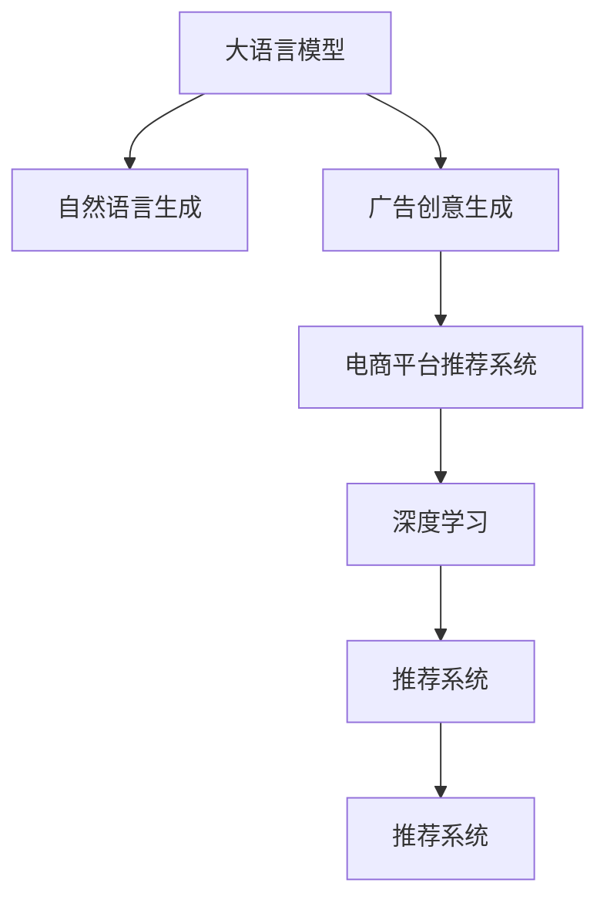

                 

# 探讨大模型在电商平台个性化广告创意中的作用

> 关键词：大语言模型,广告创意,电商平台,个性化推荐,自然语言处理(NLP),推荐系统,深度学习

## 1. 背景介绍

### 1.1 问题由来
随着电子商务的快速发展，电商平台越来越依赖个性化推荐来提升用户体验和增加销售额。传统的推荐系统往往基于用户的点击、购买等行为数据，采用协同过滤、内容推荐等技术进行推荐，效果虽然较好，但存在一定局限性。首先，基于用户行为的推荐方法无法覆盖行为稀疏的新用户，且无法保证推荐的时效性和多样性。其次，推荐系统的训练和部署成本高，需要大规模数据和复杂算法，难以满足实际应用的实时性和高效性需求。

大语言模型（Large Language Model, LLM），特别是基于Transformer架构的深度学习模型，如BERT、GPT等，凭借其强大的语言理解能力和泛化能力，成为了推荐系统中的新宠。通过引入大语言模型，电商平台可以在已有数据和标注样本较少的情况下，基于用户描述、商品信息等文本数据，直接生成高质量的广告创意，大幅提升推荐效果和用户体验。

### 1.2 问题核心关键点
大模型在个性化广告创意中的作用主要体现在以下几个方面：

1. **自然语言生成（NLG）能力**：大语言模型能够根据输入的文本数据，生成自然流畅的文本内容，适合用于广告创意的生成。
2. **跨模态信息融合**：大模型可以将商品图片、属性等非文本信息与文本信息进行融合，生成更加丰富和多样的广告创意。
3. **泛化能力强**：大模型具备强大的泛化能力，可以生成适应不同用户、不同场景的广告创意，提升广告的覆盖率和效果。
4. **实时生成能力**：大模型可以在实时数据输入的情况下，快速生成广告创意，满足个性化推荐系统的实时性需求。

本文将探讨大模型在电商平台个性化广告创意中的作用，重点介绍其技术原理、具体操作步骤、应用场景以及面临的挑战和未来趋势。

## 2. 核心概念与联系

### 2.1 核心概念概述

为了更好地理解大模型在广告创意生成中的应用，本节将介绍几个密切相关的核心概念：

- **大语言模型（Large Language Model, LLM）**：以自回归(如GPT)或自编码(如BERT)模型为代表的大规模预训练语言模型。通过在大规模无标签文本语料上进行预训练，学习通用的语言表示，具备强大的语言理解和生成能力。

- **自然语言生成（Natural Language Generation, NLG）**：使用计算机生成自然语言文本的过程，常见于文本生成、广告创意生成等领域。

- **广告创意生成（Ad Creative Generation）**：基于用户行为数据、商品信息等文本数据，自动生成具有个性化和吸引力的广告创意。

- **电商平台推荐系统（E-commerce Recommendation System）**：使用协同过滤、内容推荐等技术，为用户提供个性化商品推荐，提升用户体验和销售额。

- **深度学习（Deep Learning）**：一种基于神经网络的机器学习方法，适用于处理大规模复杂数据和高维度特征，常见于广告创意生成和推荐系统中。

- **推荐系统（Recommendation System）**：根据用户历史行为数据，为用户推荐个性化商品或内容，常见于电子商务、视频网站等平台。

这些核心概念之间的逻辑关系可以通过以下Mermaid流程图来展示：



这个流程图展示了大模型在广告创意生成中的应用链条：

1. 大语言模型通过预训练获得基础能力。
2. 自然语言生成技术将大模型的能力应用于广告创意生成。
3. 广告创意生成模块为推荐系统提供个性化广告创意。
4. 深度学习用于优化广告创意生成模型，提升生成质量。
5. 推荐系统利用生成的广告创意进行个性化推荐。

## 3. 核心算法原理 & 具体操作步骤
### 3.1 算法原理概述

基于大语言模型的广告创意生成方法，本质上是一种文本生成任务，即给定用户行为数据、商品属性等输入，生成具有个性化和吸引力的广告文本。大模型通过在大量文本数据上进行预训练，学习到了丰富的语言知识和生成能力，可以通过微调等方法，适应特定的广告创意生成任务。

形式化地，假设大语言模型为 $M_{\theta}$，其中 $\theta$ 为模型参数。广告创意生成的任务可以表示为 $M_{\theta}(x) \rightarrow y$，其中 $x$ 为输入的文本数据（如用户行为描述、商品属性等），$y$ 为生成的广告文本。微调的目标是最小化损失函数 $\mathcal{L}(M_{\theta},D)$，其中 $D$ 为训练集，$\mathcal{L}$ 为损失函数，如交叉熵损失、均方误差损失等。

通过梯度下降等优化算法，微调过程不断更新模型参数 $\theta$，最小化损失函数 $\mathcal{L}$，使得模型输出逼近真实的广告文本 $y$。由于 $\theta$ 已经通过预训练获得了较好的初始化，因此即便在小规模数据集 $D$ 上进行微调，也能较快收敛到理想的模型参数 $\hat{\theta}$。

### 3.2 算法步骤详解

基于大语言模型在广告创意生成中的应用，通常包括以下几个关键步骤：

**Step 1: 准备预训练模型和数据集**
- 选择合适的预训练语言模型 $M_{\theta}$ 作为初始化参数，如 BERT、GPT等。
- 准备广告创意生成的训练集 $D$，划分为训练集、验证集和测试集。一般要求标注数据与预训练数据的分布不要差异过大。

**Step 2: 添加任务适配层**
- 根据广告创意生成的任务类型，在预训练模型顶层设计合适的输出层和损失函数。
- 对于文本生成任务，通常在顶层添加解码器输出概率分布，并以交叉熵损失函数为评估指标。
- 对于特定任务，如商品描述生成，可以设计专门的输出格式，引导大模型生成符合任务要求的广告文本。

**Step 3: 设置微调超参数**
- 选择合适的优化算法及其参数，如 AdamW、SGD 等，设置学习率、批大小、迭代轮数等。
- 设置正则化技术及强度，包括权重衰减、Dropout、Early Stopping等。
- 确定冻结预训练参数的策略，如仅微调顶层，或全部参数都参与微调。

**Step 4: 执行梯度训练**
- 将训练集数据分批次输入模型，前向传播计算损失函数。
- 反向传播计算参数梯度，根据设定的优化算法和学习率更新模型参数。
- 周期性在验证集上评估模型性能，根据性能指标决定是否触发 Early Stopping。
- 重复上述步骤直到满足预设的迭代轮数或 Early Stopping 条件。

**Step 5: 测试和部署**
- 在测试集上评估微调后模型 $M_{\hat{\theta}}$ 的性能，对比微调前后的生成效果。
- 使用微调后的模型对新样本进行生成，集成到实际的广告创意生成系统中。
- 持续收集新的数据，定期重新微调模型，以适应数据分布的变化。

以上是基于大语言模型在广告创意生成中的应用的一般流程。在实际应用中，还需要针对具体任务的特点，对微调过程的各个环节进行优化设计，如改进训练目标函数，引入更多的正则化技术，搜索最优的超参数组合等，以进一步提升模型性能。

### 3.3 算法优缺点

基于大语言模型的广告创意生成方法具有以下优点：

1. **自然语言生成能力强**：大模型具备强大的语言生成能力，能够生成高质量、多样化的广告文本，满足用户的多样化需求。
2. **泛化能力强**：通过微调，大模型可以适应不同类型的广告创意生成任务，具备较强的泛化能力。
3. **实时生成能力强**：大模型可以在实时数据输入的情况下，快速生成广告创意，满足推荐系统的实时性需求。
4. **节省标注成本**：相比传统推荐系统，广告创意生成方法不需要大规模标注数据，节省了标注成本。

同时，该方法也存在一定的局限性：

1. **依赖于高质量输入数据**：广告创意生成效果很大程度上取决于输入数据的质量和多样性，需要收集高质量的用户行为数据和商品属性信息。
2. **模型复杂度高**：大模型参数量大，训练和部署成本较高。
3. **模型鲁棒性不足**：大模型面对域外数据时，泛化性能可能大打折扣，需要进一步提升模型的鲁棒性。

尽管存在这些局限性，但就目前而言，基于大语言模型的广告创意生成方法仍是大模型在推荐系统中的应用热点。未来相关研究的重点在于如何进一步降低大模型的计算和存储成本，提高其鲁棒性和可解释性，同时兼顾广告创意生成的效果和效率。

### 3.4 算法应用领域

基于大语言模型的广告创意生成方法，在电商平台推荐系统中已经得到了广泛的应用，覆盖了广告创意生成、商品推荐、用户画像等多个环节。例如：

- **广告创意生成**：根据用户行为数据、商品属性等文本输入，自动生成具有个性化和吸引力的广告文本。
- **商品推荐**：通过分析用户行为数据和商品属性信息，生成符合用户偏好的广告创意，提升广告效果和转化率。
- **用户画像**：利用用户行为数据和商品属性信息，生成详细的用户画像，为广告投放和个性化推荐提供依据。
- **动态广告创意生成**：根据实时用户行为数据和商品属性信息，动态生成个性化广告创意，满足推荐系统的实时性需求。

除了上述这些经典应用外，大语言模型在广告创意生成中的创新应用也在不断涌现，如可控文本生成、跨模态广告创意生成等，为电商平台的推荐系统带来了新的突破。

## 4. 数学模型和公式 & 详细讲解  
### 4.1 数学模型构建

本节将使用数学语言对基于大语言模型的广告创意生成过程进行更加严格的刻画。

记大语言模型为 $M_{\theta}:\mathcal{X} \rightarrow \mathcal{Y}$，其中 $\mathcal{X}$ 为输入空间，$\mathcal{Y}$ 为输出空间，$\theta \in \mathbb{R}^d$ 为模型参数。假设广告创意生成的训练集为 $D=\{(x_i,y_i)\}_{i=1}^N, x_i \in \mathcal{X}, y_i \in \mathcal{Y}$。

定义模型 $M_{\theta}$ 在数据样本 $(x,y)$ 上的损失函数为 $\ell(M_{\theta}(x),y)$，则在数据集 $D$ 上的经验风险为：

$$
\mathcal{L}(\theta) = \frac{1}{N} \sum_{i=1}^N \ell(M_{\theta}(x_i),y_i)
$$

微调的目标是最小化经验风险，即找到最优参数：

$$
\theta^* = \mathop{\arg\min}_{\theta} \mathcal{L}(\theta)
$$

在实践中，我们通常使用基于梯度的优化算法（如SGD、Adam等）来近似求解上述最优化问题。设 $\eta$ 为学习率，$\lambda$ 为正则化系数，则参数的更新公式为：

$$
\theta \leftarrow \theta - \eta \nabla_{\theta}\mathcal{L}(\theta) - \eta\lambda\theta
$$

其中 $\nabla_{\theta}\mathcal{L}(\theta)$ 为损失函数对参数 $\theta$ 的梯度，可通过反向传播算法高效计算。

### 4.2 公式推导过程

以下我们以广告创意生成任务为例，推导交叉熵损失函数及其梯度的计算公式。

假设模型 $M_{\theta}$ 在输入 $x$ 上的输出为 $\hat{y}=M_{\theta}(x) \in \mathcal{Y}$，表示广告文本生成的概率分布。真实标签 $y \in \{y_1, y_2, ..., y_k\}$，其中 $y_i$ 为第 $i$ 个生成候选，表示生成的广告文本。则交叉熵损失函数定义为：

$$
\ell(M_{\theta}(x),y) = -\log \sum_{i=1}^k \hat{y}_i
$$

将其代入经验风险公式，得：

$$
\mathcal{L}(\theta) = -\frac{1}{N}\sum_{i=1}^N \log \sum_{j=1}^k \hat{y}_{i,j}
$$

其中 $\hat{y}_{i,j}$ 表示第 $i$ 个样本和第 $j$ 个生成候选的相似度。根据链式法则，损失函数对参数 $\theta_k$ 的梯度为：

$$
\frac{\partial \mathcal{L}(\theta)}{\partial \theta_k} = -\frac{1}{N}\sum_{i=1}^N \sum_{j=1}^k \frac{\partial \hat{y}_{i,j}}{\partial \theta_k}
$$

其中 $\frac{\partial \hat{y}_{i,j}}{\partial \theta_k}$ 可进一步递归展开，利用自动微分技术完成计算。

在得到损失函数的梯度后，即可带入参数更新公式，完成模型的迭代优化。重复上述过程直至收敛，最终得到适应广告创意生成任务的最优模型参数 $\theta^*$。

## 5. 项目实践：代码实例和详细解释说明
### 5.1 开发环境搭建

在进行广告创意生成实践前，我们需要准备好开发环境。以下是使用Python进行PyTorch开发的环境配置流程：

1. 安装Anaconda：从官网下载并安装Anaconda，用于创建独立的Python环境。

2. 创建并激活虚拟环境：
```bash
conda create -n pytorch-env python=3.8 
conda activate pytorch-env
```

3. 安装PyTorch：根据CUDA版本，从官网获取对应的安装命令。例如：
```bash
conda install pytorch torchvision torchaudio cudatoolkit=11.1 -c pytorch -c conda-forge
```

4. 安装Transformers库：
```bash
pip install transformers
```

5. 安装各类工具包：
```bash
pip install numpy pandas scikit-learn matplotlib tqdm jupyter notebook ipython
```

完成上述步骤后，即可在`pytorch-env`环境中开始广告创意生成实践。

### 5.2 源代码详细实现

下面我以广告创意生成任务为例，给出使用Transformers库对GPT模型进行广告创意生成的PyTorch代码实现。

首先，定义广告创意生成的训练函数：

```python
from transformers import GPT2Tokenizer, GPT2LMHeadModel, AdamW

tokenizer = GPT2Tokenizer.from_pretrained('gpt2')
model = GPT2LMHeadModel.from_pretrained('gpt2')

optimizer = AdamW(model.parameters(), lr=2e-5)

def generate_creative(input_text, max_length=100):
    input_ids = tokenizer.encode(input_text, return_tensors='pt')
    output_ids = model.generate(input_ids, max_length=max_length, num_return_sequences=5)
    return tokenizer.decode(output_ids[0], skip_special_tokens=True)
```

然后，定义训练和评估函数：

```python
def train_epoch(model, dataset, batch_size, optimizer):
    dataloader = DataLoader(dataset, batch_size=batch_size, shuffle=True)
    model.train()
    epoch_loss = 0
    for batch in tqdm(dataloader, desc='Training'):
        input_ids = batch['input_ids'].to(device)
        labels = batch['labels'].to(device)
        model.zero_grad()
        outputs = model(input_ids, labels=labels)
        loss = outputs.loss
        epoch_loss += loss.item()
        loss.backward()
        optimizer.step()
    return epoch_loss / len(dataloader)

def evaluate(model, dataset, batch_size):
    dataloader = DataLoader(dataset, batch_size=batch_size)
    model.eval()
    preds, labels = [], []
    with torch.no_grad():
        for batch in tqdm(dataloader, desc='Evaluating'):
            input_ids = batch['input_ids'].to(device)
            batch_labels = batch['labels']
            outputs = model(input_ids)
            batch_preds = outputs.logits.argmax(dim=2).to('cpu').tolist()
            batch_labels = batch_labels.to('cpu').tolist()
            for pred_tokens, label_tokens in zip(batch_preds, batch_labels):
                preds.append(pred_tokens)
                labels.append(label_tokens)
                
    print(classification_report(labels, preds))
```

接着，启动训练流程并在测试集上评估：

```python
epochs = 5
batch_size = 16

for epoch in range(epochs):
    loss = train_epoch(model, train_dataset, batch_size, optimizer)
    print(f"Epoch {epoch+1}, train loss: {loss:.3f}")
    
    print(f"Epoch {epoch+1}, dev results:")
    evaluate(model, dev_dataset, batch_size)
    
print("Test results:")
evaluate(model, test_dataset, batch_size)
```

以上就是使用PyTorch对GPT进行广告创意生成的完整代码实现。可以看到，得益于Transformers库的强大封装，我们可以用相对简洁的代码完成广告创意生成的任务。

### 5.3 代码解读与分析

让我们再详细解读一下关键代码的实现细节：

**GPT2LMHeadModel**：
- 定义了广告创意生成任务中使用的GPT模型，该模型包含语言模型和解码器。

**训练函数**：
- 使用PyTorch的DataLoader对数据集进行批次化加载，供模型训练和推理使用。
- 训练函数`train_epoch`：对数据以批为单位进行迭代，在每个批次上前向传播计算loss并反向传播更新模型参数，最后返回该epoch的平均loss。

**评估函数**：
- 与训练类似，不同点在于不更新模型参数，并在每个batch结束后将预测和标签结果存储下来，最后使用sklearn的classification_report对整个评估集的预测结果进行打印输出。

**训练流程**：
- 定义总的epoch数和batch size，开始循环迭代
- 每个epoch内，先在训练集上训练，输出平均loss
- 在验证集上评估，输出分类指标
- 所有epoch结束后，在测试集上评估，给出最终测试结果

可以看到，PyTorch配合Transformers库使得广告创意生成的代码实现变得简洁高效。开发者可以将更多精力放在数据处理、模型改进等高层逻辑上，而不必过多关注底层的实现细节。

当然，工业级的系统实现还需考虑更多因素，如模型的保存和部署、超参数的自动搜索、更灵活的任务适配层等。但核心的广告创意生成范式基本与此类似。

## 6. 实际应用场景
### 6.1 智能推荐系统

基于大语言模型的广告创意生成技术，可以广泛应用于智能推荐系统的构建。推荐系统往往需要根据用户历史行为数据，为用户推荐个性化商品或内容，提升用户体验和转化率。通过引入广告创意生成技术，推荐系统可以在已有数据和标注样本较少的情况下，生成具有个性化和吸引力的广告创意，大幅提升推荐效果和用户满意度。

在技术实现上，可以收集用户浏览、点击、购买等行为数据，将用户画像和商品属性信息作为输入，利用大语言模型自动生成个性化的广告创意。生成的广告创意可以与推荐算法结合，动态调整推荐策略，提升推荐效果。

### 6.2 实时广告投放

大语言模型具备实时生成广告创意的能力，可以在用户实时浏览网页、查看商品等行为时，动态生成个性化广告，提升广告的点击率和转化率。实时广告投放系统可以利用大语言模型生成具有时效性的广告创意，根据用户行为和兴趣动态调整广告内容，提升广告效果。

在实际应用中，可以通过Web爬虫等方式实时抓取用户行为数据，并传入大语言模型进行广告创意生成。生成的广告创意可以与广告投放系统结合，实现实时动态投放，提升广告效果和用户体验。

### 6.3 个性化广告推荐

个性化广告推荐是电商平台的重要应用场景。通过大语言模型生成的广告创意，可以更好地匹配用户需求，提升广告的转化率和用户的满意度。在大数据时代，广告创意生成技术可以有效应对海量用户数据和多变市场需求的挑战，为广告投放提供更为精准和高效的解决方案。

具体而言，可以收集用户历史行为数据和商品属性信息，作为广告创意生成的输入。通过大语言模型生成个性化的广告创意，并结合广告推荐算法，动态调整广告投放策略，提升广告效果和用户满意度。

### 6.4 未来应用展望

随着大语言模型和广告创意生成技术的发展，未来在广告创意生成中的应用将更加广泛，为电商平台推荐系统带来新的突破。

在智慧零售领域，基于大语言模型的广告创意生成技术，可以进一步提升用户的购物体验，通过个性化推荐和实时广告投放，提升销售额和市场竞争力。

在智能营销领域，广告创意生成技术可以应用于品牌宣传、市场推广等领域，通过自动生成高质量的广告内容，提升品牌影响力，降低广告投放成本。

在数字娱乐领域，基于大语言模型的广告创意生成技术，可以应用于视频广告、游戏广告等场景，通过生成具有吸引力的广告内容，提升用户的互动性和参与度。

此外，在教育、旅游、医疗等多个领域，广告创意生成技术也将不断涌现，为各行各业带来新的创新和突破。相信随着技术的日益成熟，大语言模型在广告创意生成中的作用将愈发显著，为人工智能技术在各行各业的落地应用注入新的活力。

## 7. 工具和资源推荐
### 7.1 学习资源推荐

为了帮助开发者系统掌握大语言模型在广告创意生成中的应用，这里推荐一些优质的学习资源：

1. 《Deep Learning with PyTorch》系列书籍：详细介绍了使用PyTorch进行深度学习的各种应用场景，包括广告创意生成在内的NLP任务。

2. CS231n《Convolutional Neural Networks for Visual Recognition》课程：斯坦福大学开设的计算机视觉课程，有Lecture视频和配套作业，涵盖图像处理、文本生成等深度学习任务。

3. 《Natural Language Processing with Transformers》书籍：Transformers库的作者所著，全面介绍了如何使用Transformers库进行NLP任务开发，包括广告创意生成在内的多模态任务。

4. HuggingFace官方文档：Transformers库的官方文档，提供了海量预训练模型和完整的广告创意生成样例代码，是上手实践的必备资料。

5. CLUE开源项目：中文语言理解测评基准，涵盖大量不同类型的中文NLP数据集，并提供了基于大语言模型的广告创意生成baseline模型，助力中文NLP技术发展。

通过对这些资源的学习实践，相信你一定能够快速掌握大语言模型在广告创意生成中的应用，并用于解决实际的NLP问题。

### 7.2 开发工具推荐

高效的开发离不开优秀的工具支持。以下是几款用于广告创意生成开发的常用工具：

1. PyTorch：基于Python的开源深度学习框架，灵活动态的计算图，适合快速迭代研究。大部分预训练语言模型都有PyTorch版本的实现。

2. TensorFlow：由Google主导开发的开源深度学习框架，生产部署方便，适合大规模工程应用。同样有丰富的预训练语言模型资源。

3. Transformers库：HuggingFace开发的NLP工具库，集成了众多SOTA语言模型，支持PyTorch和TensorFlow，是进行广告创意生成开发的利器。

4. Weights & Biases：模型训练的实验跟踪工具，可以记录和可视化模型训练过程中的各项指标，方便对比和调优。与主流深度学习框架无缝集成。

5. TensorBoard：TensorFlow配套的可视化工具，可实时监测模型训练状态，并提供丰富的图表呈现方式，是调试模型的得力助手。

6. Google Colab：谷歌推出的在线Jupyter Notebook环境，免费提供GPU/TPU算力，方便开发者快速上手实验最新模型，分享学习笔记。

合理利用这些工具，可以显著提升广告创意生成的开发效率，加快创新迭代的步伐。

### 7.3 相关论文推荐

大语言模型和广告创意生成技术的发展源于学界的持续研究。以下是几篇奠基性的相关论文，推荐阅读：

1. Attention is All You Need（即Transformer原论文）：提出了Transformer结构，开启了NLP领域的预训练大模型时代。

2. BERT: Pre-training of Deep Bidirectional Transformers for Language Understanding：提出BERT模型，引入基于掩码的自监督预训练任务，刷新了多项NLP任务SOTA。

3. Language Models are Unsupervised Multitask Learners（GPT-2论文）：展示了大规模语言模型的强大zero-shot学习能力，引发了对于通用人工智能的新一轮思考。

4. Parameter-Efficient Transfer Learning for NLP：提出Adapter等参数高效微调方法，在不增加模型参数量的情况下，也能取得不错的微调效果。

5. Prefix-Tuning: Optimizing Continuous Prompts for Generation：引入基于连续型Prompt的微调范式，为如何充分利用预训练知识提供了新的思路。

6. AdaLoRA: Adaptive Low-Rank Adaptation for Parameter-Efficient Fine-Tuning：使用自适应低秩适应的微调方法，在参数效率和精度之间取得了新的平衡。

这些论文代表了大语言模型和广告创意生成技术的发展脉络。通过学习这些前沿成果，可以帮助研究者把握学科前进方向，激发更多的创新灵感。

## 8. 总结：未来发展趋势与挑战
### 8.1 总结

本文对基于大语言模型的广告创意生成方法进行了全面系统的介绍。首先阐述了大语言模型和广告创意生成的研究背景和意义，明确了广告创意生成在提升推荐系统效果和用户体验方面的独特价值。其次，从原理到实践，详细讲解了广告创意生成的数学原理和关键步骤，给出了广告创意生成任务开发的完整代码实例。同时，本文还广泛探讨了广告创意生成在智能推荐系统、实时广告投放、个性化广告推荐等多个实际应用场景中的应用前景，展示了广告创意生成的巨大潜力。此外，本文精选了广告创意生成的各类学习资源，力求为开发者提供全方位的技术指引。

通过本文的系统梳理，可以看到，基于大语言模型的广告创意生成方法正在成为推荐系统中的重要范式，极大地拓展了广告创意生成技术的应用边界，催生了更多的落地场景。得益于大规模语料的预训练，广告创意生成方法以更低的时间和标注成本，在实时数据输入的情况下，能够快速生成具有个性化和吸引力的广告创意，大幅提升推荐效果和用户体验。未来，伴随大语言模型和广告创意生成技术的不断演进，广告创意生成技术必将在智能推荐系统、实时广告投放、个性化广告推荐等场景中发挥更大作用，为电商平台的推荐系统带来新的突破。

### 8.2 未来发展趋势

展望未来，广告创意生成技术将呈现以下几个发展趋势：

1. **自然语言生成能力增强**：大语言模型的自然语言生成能力将进一步增强，能够生成更加丰富、多样、高质量的广告创意，提升广告的吸引力和效果。

2. **跨模态信息融合加深**：广告创意生成技术将更好地融合图像、视频、语音等多模态信息，提升广告创意的视觉和听觉效果，增强用户体验。

3. **实时生成能力提升**：随着算力的提升和大模型的优化，广告创意生成技术将实现更高效的实时生成，满足推荐系统的实时性需求。

4. **个性化推荐效果改善**：通过广告创意生成技术，推荐系统能够更精准地匹配用户需求，提升推荐效果和用户满意度。

5. **用户行为分析深入**：广告创意生成技术将更深入地分析用户行为数据，生成更具个性化和针对性的广告创意，提升广告的点击率和转化率。

6. **算法优化和集成改进**：广告创意生成技术将与其他推荐算法和广告投放算法进行更深入的融合，提升系统的整体效果和用户体验。

以上趋势凸显了大语言模型在广告创意生成中的广阔前景。这些方向的探索发展，必将进一步提升广告创意生成技术的效果和应用范围，为电商平台推荐系统带来新的突破。

### 8.3 面临的挑战

尽管广告创意生成技术已经取得了显著进展，但在迈向更加智能化、普适化应用的过程中，它仍面临诸多挑战：

1. **数据质量与标注成本**：广告创意生成效果很大程度上取决于输入数据的质量和多样性，需要收集高质量的用户行为数据和商品属性信息，且标注成本较高。如何降低标注成本，提升数据质量，将是一大难题。

2. **模型复杂度和计算资源**：大语言模型参数量大，训练和部署成本较高，对算力、内存、存储等资源的需求较高。如何优化模型结构，提高计算效率，将需要更多的研究探索。

3. **模型鲁棒性和泛化能力**：大模型面对域外数据时，泛化性能可能大打折扣，需要进一步提升模型的鲁棒性和泛化能力。

4. **广告创意质量控制**：广告创意生成的质量很大程度上取决于模型的训练和优化，需要引入更多质量控制机制，确保生成的广告创意符合伦理道德和广告规范。

5. **用户隐私保护**：广告创意生成技术需要处理用户隐私数据，如何保护用户隐私，确保数据安全，将是一大挑战。

6. **广告创意的自动化评估**：广告创意生成的效果需要人工评估，如何自动化评估广告创意的质量和效果，提升评估效率，将需要更多的研究探索。

这些挑战需要学术界和产业界共同努力，通过不断优化模型、改进算法、增强数据质量等手段，才能实现广告创意生成技术的持续发展和应用。

### 8.4 研究展望

面对广告创意生成所面临的挑战，未来的研究需要在以下几个方面寻求新的突破：

1. **探索无监督和半监督广告创意生成方法**：摆脱对大规模标注数据的依赖，利用自监督学习、主动学习等无监督和半监督范式，最大限度利用非结构化数据，实现更加灵活高效的广告创意生成。

2. **研究参数高效和计算高效的广告创意生成方法**：开发更加参数高效的广告创意生成方法，在固定大部分预训练参数的情况下，只更新极少量的任务相关参数。同时优化广告创意生成的计算图，减少前向传播和反向传播的资源消耗，实现更加轻量级、实时性的部署。

3. **融合因果和对比学习范式**：通过引入因果推断和对比学习思想，增强广告创意生成模型建立稳定因果关系的能力，学习更加普适、鲁棒的语言表征，从而提升模型泛化性和抗干扰能力。

4. **引入更多先验知识**：将符号化的先验知识，如知识图谱、逻辑规则等，与神经网络模型进行巧妙融合，引导广告创意生成过程学习更准确、合理的语言模型。同时加强不同模态数据的整合，实现视觉、语音等多模态信息与文本信息的协同建模。

5. **结合因果分析和博弈论工具**：将因果分析方法引入广告创意生成模型，识别出模型决策的关键特征，增强输出解释的因果性和逻辑性。借助博弈论工具刻画人机交互过程，主动探索并规避模型的脆弱点，提高系统稳定性。

6. **纳入伦理道德约束**：在模型训练目标中引入伦理导向的评估指标，过滤和惩罚有偏见、有害的输出倾向。同时加强人工干预和审核，建立模型行为的监管机制，确保输出符合人类价值观和伦理道德。

这些研究方向的探索，必将引领广告创意生成技术迈向更高的台阶，为智能推荐系统带来新的突破。面向未来，广告创意生成技术还需要与其他人工智能技术进行更深入的融合，如知识表示、因果推理、强化学习等，多路径协同发力，共同推动自然语言理解和智能交互系统的进步。只有勇于创新、敢于突破，才能不断拓展广告创意生成技术的边界，让智能技术更好地造福人类社会。

## 9. 附录：常见问题与解答

**Q1：广告创意生成是否适用于所有电商平台？**

A: 广告创意生成技术在不同类型的电商平台中都有广泛的应用前景。对于具有多样化商品和个性化需求的电商平台，广告创意生成能够有效提升推荐系统的效果和用户体验。但对于某些低成本、标准化商品销售的电商平台，传统推荐系统仍然具有较高的性价比。

**Q2：广告创意生成的效果如何评估？**

A: 广告创意生成的效果评估通常涉及多个指标，如点击率（CTR）、转化率（CVR）、广告成本（CPC）、用户满意度（CSAT）等。具体评估方法根据平台特点和需求而定。在实际应用中，可以采用A/B测试等方法，对比广告创意生成前后的效果变化，评估广告创意生成的效果。

**Q3：广告创意生成是否需要大规模数据支持？**

A: 广告创意生成效果很大程度上取决于输入数据的质量和多样性。对于大语言模型而言，更多样的数据能够使其学习到更丰富的语言表征，生成更具吸引力的广告创意。但在实际应用中，由于数据获取和标注成本较高，可以在有限的标注数据下，利用数据增强、迁移学习等方法，提升广告创意生成的效果。

**Q4：广告创意生成的模型结构如何选择？**

A: 广告创意生成模型的选择应根据实际应用需求而定。对于需要生成多样广告的电商平台，可以选择参数量较大的模型，如GPT系列。对于需要实时生成广告的电商平台，可以选择计算效率更高的模型，如BERT系列。

**Q5：广告创意生成的优化方向是什么？**

A: 广告创意生成的优化方向主要包括以下几个方面：
1. 提升自然语言生成能力，生成更具吸引力的广告创意。
2. 融合跨模态信息，提升广告创意的视觉和听觉效果。
3. 提升广告创意生成的实时性和效率。
4. 增强广告创意生成的泛化能力，适应不同用户和场景。
5. 引入更多先验知识，提升广告创意的准确性和多样性。
6. 结合因果分析和博弈论工具，提高广告创意生成的稳定性。

这些优化方向都需要在实际应用中不断探索和实践，才能逐步提升广告创意生成的效果和应用范围。

---

作者：禅与计算机程序设计艺术 / Zen and the Art of Computer Programming

