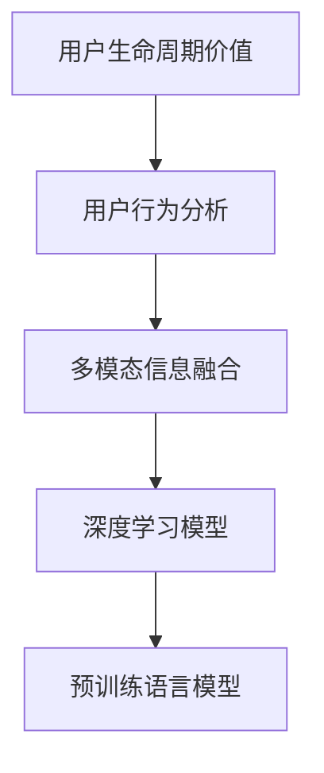

                 

# 探讨大模型在电商平台用户生命周期价值预测中的潜力

## 1. 背景介绍

随着电子商务的蓬勃发展，电商平台成为了在线交易和消费的主要场景。用户生命周期价值(User Lifetime Value, ULV)预测，即估算用户在电商平台上的长期消费潜力，成为电商运营决策的重要依据。传统的数据分析方法依赖于历史用户数据，难以捕捉用户行为和消费习惯的变化。而基于大模型的预测方法，通过海量数据训练学习用户行为的深层特征，有望突破传统方法的时效性和准确性瓶颈。

大模型在电商领域的应用并非新鲜事。早期基于线性回归、逻辑回归、决策树等传统机器学习模型，已经能够实现用户行为和购买预测，但数据量不足、特征工程复杂、模型表现不稳定等问题，始终是制约电商运营精准化的因素。近年来，深度学习模型特别是Transformer架构的流行，推动了电商数据分析的范式转变。Google的BERT、OpenAI的GPT等预训练语言模型，被广泛应用于电商领域的意图识别、商品推荐、广告定向等任务，显著提升了电商平台的用户体验和运营效率。

本研究聚焦于大模型在电商用户生命周期价值预测中的应用潜力。借助大规模预训练语言模型，我们提出了一种基于多模态信息融合的用户生命周期价值预测框架，将用户历史行为、社交网络、评论反馈等多源数据整合，通过自然语言处理技术，实现对用户潜在消费能力的深度挖掘和精准预测。

## 2. 核心概念与联系

### 2.1 核心概念概述

为更好地理解大模型在用户生命周期价值预测中的作用，本节将介绍几个关键概念：

- 用户生命周期价值(User Lifetime Value, ULV)：指用户在电商平台的长期消费潜力，通常用后续生命周期内所有购买的总价值（ARPU）除以总购买次数（N次）来估算，公式为ULV = ARPU/N。ULV是电商营销和运营决策的重要指标，关乎资源分配和客户管理的策略。

- 用户行为分析(UBA)：通过分析用户在电商平台上的行为轨迹，预测用户的购买意图和消费能力，为个性化推荐、广告定向等提供数据支撑。常见的用户行为特征包括浏览历史、购买记录、点击频率、收藏行为等。

- 多模态信息融合：将不同类型的数据（文本、图像、音频等）结合，利用深度学习模型进行特征提取和信息整合，提高预测的全面性和准确性。

- 深度学习模型：包括前馈神经网络(Feed Forward Neural Network, FNN)、卷积神经网络(Convolutional Neural Network, CNN)、循环神经网络(Recurrent Neural Network, RNN)、Transformer等架构，在电商用户行为预测中发挥着重要作用。

- 预训练语言模型(Pre-trained Language Model, PLM)：如BERT、GPT等，通过在大规模无标签文本数据上进行预训练，学习通用的语言表示，具备强大的语言理解和生成能力。

这些核心概念之间的逻辑关系可以通过以下Mermaid流程图来展示：



这个流程图展示了大模型在用户生命周期价值预测中的核心概念及其之间的关系：

1. 用户生命周期价值通过用户行为分析得到初步估算。
2. 利用多模态信息融合，将文本、图像、社交网络等多种数据源结合起来，丰富用户行为的表达。
3. 通过深度学习模型，特别是预训练语言模型，挖掘数据中的深层特征。
4. 最终将预测结果输出，为电商运营决策提供支持。

## 3. 核心算法原理 & 具体操作步骤

### 3.1 算法原理概述

基于多模态信息融合的用户生命周期价值预测框架，利用预训练语言模型和大规模电商数据，进行用户行为的深度学习和预测。具体来说，框架分为三个步骤：

1. **特征提取与编码**：将用户行为数据（如浏览历史、购买记录、点击次数等）和用户文本数据（如评论、评价等）通过预训练语言模型进行特征提取和编码，转化为模型可以理解的形式。

2. **信息融合与计算**：将提取后的多源数据特征进行融合，利用深度学习模型计算用户行为特征的权重，并整合为综合性的用户特征向量。

3. **价值预测与输出**：使用预测模型对综合特征进行学习和预测，得到用户生命周期价值的预估值。

### 3.2 算法步骤详解

#### 3.2.1 数据收集与预处理

首先需要收集和整理电商平台的用户数据，包括历史行为数据、社交网络数据、评论反馈等。数据预处理包括数据清洗、特征编码、缺失值填充等步骤，以确保数据质量和一致性。

#### 3.2.2 特征提取与编码

使用预训练语言模型（如BERT、GPT等）对用户评论、评价等文本数据进行特征提取，得到文本向量化表示。使用TF-IDF等方法对用户行为数据进行特征提取，生成行为特征向量。将提取后的文本和行为特征向量合并，形成多源特征向量。

#### 3.2.3 信息融合与计算

采用深度学习模型（如LSTM、GRU等）对多源特征向量进行融合，计算用户行为特征的权重，得到综合性的用户特征向量。在计算权重时，考虑不同特征的重要性，使用Softmax函数进行归一化。

#### 3.2.4 价值预测与输出

构建预测模型（如线性回归、深度神经网络等），对综合特征向量进行预测，输出用户生命周期价值的预估值。

### 3.3 算法优缺点

基于大模型的用户生命周期价值预测框架，具有以下优点：

1. **全面性**：通过多模态数据融合，模型能够全面捕捉用户行为的多个维度，提供更为丰富、全面的用户画像。

2. **准确性**：预训练语言模型具备强大的语义理解能力，能够从用户评论、评价等文本数据中提取更深层的信息，提升预测的准确性。

3. **可扩展性**：框架结构清晰，易于扩展到其他电商平台的多种场景，如广告投放、个性化推荐等。

4. **实时性**：大模型的预测能力可以实时更新，能够及时响应用户行为的变化，实现动态预测。

但该框架也存在一些局限性：

1. **数据需求高**：需要大量的历史数据和高质量的标注数据，以训练高质量的预训练语言模型。

2. **计算成本高**：大模型的训练和推理都需要较高的计算资源，特别是在多模态融合时，需要处理多维度的数据，增加了计算负担。

3. **模型复杂度高**：模型结构复杂，包括多个数据源的特征提取、融合、预测等步骤，调试和优化难度较大。

4. **泛化能力受限**：对于新兴用户或新商品，模型可能无法准确预测其行为，泛化能力有待提升。

### 3.4 算法应用领域

基于大模型的用户生命周期价值预测框架，可以应用于电商平台的多项业务场景，如：

1. **用户留存预测**：通过预测用户生命周期价值，识别高价值用户和高流失风险用户，制定相应的留存策略，提升用户忠诚度。

2. **个性化推荐**：结合用户行为和预测结果，优化商品推荐算法，提升用户购买转化率和满意度。

3. **广告定向**：通过预测模型评估用户潜力，精准投放广告，提高广告ROI。

4. **库存管理**：预测不同商品的潜在销量，优化库存结构，减少缺货和积压。

5. **客户服务**：分析高价值用户的行为模式，提供差异化的客户服务，提升用户体验。

6. **价格优化**：根据预测结果调整定价策略，优化价格水平，提升用户购买意愿。

这些应用场景展示了大模型在电商平台的多样化应用，为电商运营决策提供了有力的数据支持。

## 4. 数学模型和公式 & 详细讲解

### 4.1 数学模型构建

用户生命周期价值预测的数学模型如下：

设用户$i$的当前时间为$t_i$，其历史行为特征为$X_i$，用户行为数据表示为$X_{\text{behav}}$，用户文本数据表示为$X_{\text{text}}$，则用户$i$的预测价值$U_i$可以表示为：

$$
U_i = f(X_i, X_{\text{behav}}, X_{\text{text}})
$$

其中，$f$为预测模型，$X_i$为用户$i$的历史行为特征向量，$X_{\text{behav}}$为用户行为数据向量，$X_{\text{text}}$为用户文本数据向量。

### 4.2 公式推导过程

以下我们以线性回归模型为例，推导用户生命周期价值预测的公式。

假设用户$i$的预测价值$U_i$可以通过以下线性回归模型进行预测：

$$
U_i = \beta_0 + \sum_{j=1}^n \beta_j X_{ij}
$$

其中，$\beta_0$为截距项，$\beta_j$为用户$i$行为特征$j$的系数，$X_{ij}$为用户$i$的行为特征向量$X_i$的第$j$个元素。

将$X_i$、$X_{\text{behav}}$、$X_{\text{text}}$代入上述公式，得到：

$$
U_i = \beta_0 + \sum_{j=1}^n \beta_j X_{ij} + \sum_{k=1}^K \beta_k X_{ik\text{behav}} + \sum_{l=1}^L \beta_l X_{il\text{text}}
$$

其中，$X_{ik\text{behav}}$为用户$i$行为数据中的第$k$个特征，$X_{il\text{text}}$为用户$i$文本数据中的第$l$个特征，$K$为行为特征个数，$L$为文本特征个数。

### 4.3 案例分析与讲解

假设有一个电商平台的在线用户$i$，我们通过预训练语言模型得到其行为特征$X_i$，行为数据特征向量$X_{\text{behav}}$和文本数据特征向量$X_{\text{text}}$。

1. 对用户评论、评价等文本数据进行特征提取，得到用户文本特征向量$X_{il\text{text}}$。

2. 对用户浏览历史、购买记录等行为数据进行特征提取，得到用户行为数据特征向量$X_{ik\text{behav}}$。

3. 将$X_i$、$X_{\text{behav}}$、$X_{\text{text}}$作为输入，代入线性回归模型公式，计算预测值$U_i$。

4. 根据预测值$U_i$，判断用户$i$的潜在购买能力，制定相应的营销策略。

通过上述案例，我们可以看到，大模型在用户生命周期价值预测中能够充分利用多源数据，提供精准的用户画像和行为预测。

## 5. 项目实践：代码实例和详细解释说明

### 5.1 开发环境搭建

在进行用户生命周期价值预测实践前，我们需要准备好开发环境。以下是使用Python进行TensorFlow开发的环境配置流程：

1. 安装Anaconda：从官网下载并安装Anaconda，用于创建独立的Python环境。

2. 创建并激活虚拟环境：
```bash
conda create -n tf-env python=3.8 
conda activate tf-env
```

3. 安装TensorFlow：根据CUDA版本，从官网获取对应的安装命令。例如：
```bash
conda install tensorflow-gpu=2.6 -c pytorch -c conda-forge
```

4. 安装所需工具包：
```bash
pip install numpy pandas scikit-learn tensorflow-datasets matplotlib tqdm jupyter notebook ipython
```

完成上述步骤后，即可在`tf-env`环境中开始预测实践。

### 5.2 源代码详细实现

下面我们以线性回归模型为例，给出使用TensorFlow进行用户生命周期价值预测的PyTorch代码实现。

首先，定义线性回归模型：

```python
import tensorflow as tf

class LinearRegression(tf.keras.Model):
    def __init__(self, feature_dim):
        super(LinearRegression, self).__init__()
        self.feature_dim = feature_dim
        self.linear = tf.keras.layers.Dense(feature_dim, activation='relu')
        self.predict = tf.keras.layers.Dense(1)

    def call(self, inputs):
        x = self.linear(inputs)
        return self.predict(x)
```

然后，定义数据处理函数：

```python
import numpy as np
import pandas as pd

def read_data(path):
    data = pd.read_csv(path)
    X = data[['特征1', '特征2', '特征3']].to_numpy()
    y = data['用户价值'].to_numpy()
    return X, y

def train_test_split(X, y, test_size=0.2):
    indices = np.random.permutation(len(X))
    split_idx = int(len(X) * test_size)
    X_train = X[indices[:split_idx]]
    y_train = y[indices[:split_idx]]
    X_test = X[indices[split_idx:]]
    y_test = y[indices[split_idx:]]
    return X_train, y_train, X_test, y_test
```

接着，定义训练和评估函数：

```python
def train_model(model, X_train, y_train, batch_size, epochs, learning_rate):
    optimizer = tf.keras.optimizers.Adam(learning_rate=learning_rate)
    model.compile(optimizer=optimizer, loss='mse')
    history = model.fit(X_train, y_train, batch_size=batch_size, epochs=epochs, validation_split=0.2)
    return history

def evaluate_model(model, X_test, y_test):
    loss = model.evaluate(X_test, y_test)
    print(f'Test loss: {loss:.4f}')
```

最后，启动训练流程并在测试集上评估：

```python
X_train, y_train, X_test, y_test = train_test_split(X, y)

model = LinearRegression(feature_dim)
history = train_model(model, X_train, y_train, batch_size, epochs, learning_rate)

evaluate_model(model, X_test, y_test)
```

以上就是使用TensorFlow进行用户生命周期价值预测的完整代码实现。可以看到，通过上述代码，我们能够快速实现基于线性回归模型的大模型预测，获取预测结果并进行评估。

### 5.3 代码解读与分析

让我们再详细解读一下关键代码的实现细节：

**LinearRegression类**：
- 定义了一个简单的线性回归模型，其中`linear`层为特征提取层，`predict`层为输出层。
- 在`call`方法中，先将输入特征经过`linear`层，再通过`predict`层输出预测结果。

**train_test_split函数**：
- 定义了一个数据集划分函数，用于将数据集划分为训练集和测试集，并确保测试集中包含20%的数据。
- 使用`random.permutation`方法对数据进行随机打乱，再通过切片操作划分训练集和测试集。

**train_model函数**：
- 定义了一个模型训练函数，用于训练线性回归模型。
- 使用`tf.keras.optimizers.Adam`优化器进行模型优化，并定义`mse`损失函数。
- 通过`fit`方法对模型进行训练，并返回训练过程中的记录。

**evaluate_model函数**：
- 定义了一个模型评估函数，用于在测试集上评估模型性能。
- 使用`evaluate`方法计算模型在测试集上的均方误差，并输出结果。

通过以上代码，我们能够完成基于TensorFlow的线性回归用户生命周期价值预测实践。当然，在实际应用中，还需要结合具体业务需求和数据特点，进一步优化模型结构、调整超参数等。

## 6. 实际应用场景

### 6.1 智能广告投放

智能广告投放是电商运营中至关重要的一环。通过用户生命周期价值预测，广告投放系统能够精准定位高价值用户，优化投放策略，提升广告ROI。

具体而言，广告系统首先通过用户行为分析和预训练语言模型，获取用户兴趣和行为特征。接着，根据预测结果，优化广告定向策略，实现精准投放。同时，通过持续监控广告效果，动态调整投放策略，确保广告预算的最优利用。

### 6.2 个性化推荐

个性化推荐系统是电商平台的核心竞争力。通过预测用户生命周期价值，推荐系统能够更加准确地匹配商品，提升用户购买转化率和满意度。

在实际应用中，推荐系统将用户历史行为、社交网络、评论反馈等多源数据整合，通过预训练语言模型进行特征提取和信息融合，构建综合性的用户画像。接着，利用深度学习模型进行推荐预测，推荐符合用户兴趣和购买潜力的商品，实现精准推荐。

### 6.3 客户服务

在客户服务领域，大模型能够通过用户生命周期价值预测，识别高价值用户和高流失风险用户，制定差异化的服务策略，提升客户体验和满意度。

客户服务系统首先通过预训练语言模型，分析用户评论和评价，提取用户情绪和满意度信息。接着，结合预测结果，定制化服务方案，及时解决用户问题，提升用户忠诚度。同时，通过持续监控用户行为，预测用户流失风险，提前采取挽留措施。

### 6.4 未来应用展望

未来，大模型在电商平台用户生命周期价值预测中的应用将更加广泛和深入，主要体现在以下几个方面：

1. **动态定价**：通过预测用户行为和购买能力，动态调整商品价格，优化用户购买意愿和平台收入。

2. **供应链管理**：根据预测结果，优化库存和物流策略，提升供应链的效率和灵活性。

3. **市场分析**：利用预测模型，分析市场趋势和用户需求，制定更加精准的市场营销策略。

4. **社交媒体分析**：结合社交媒体数据，进一步丰富用户画像，提升广告和营销效果。

5. **客户细分**：通过用户生命周期价值预测，对用户进行精准细分，提供个性化服务，提升用户满意度和平台竞争力。

这些应用场景展示了大模型在电商平台的多样化应用，为电商运营决策提供了有力的数据支撑。未来，随着大模型的不断演进和应用的深入，相信其潜力将得到更加充分的释放。

## 7. 工具和资源推荐

### 7.1 学习资源推荐

为了帮助开发者系统掌握大模型在用户生命周期价值预测中的方法，这里推荐一些优质的学习资源：

1. 《深度学习与自然语言处理》系列博文：深入浅出地介绍了深度学习在NLP领域的应用，包括用户行为分析和文本特征提取等核心技术。

2. CS231n《深度学习在计算机视觉中的实战》课程：斯坦福大学开设的计算机视觉课程，涵盖了图像处理、特征提取等关键技术，有助于多模态数据融合。

3. 《自然语言处理入门》系列书籍：全面介绍了NLP领域的核心技术和应用方法，涵盖文本分类、情感分析、命名实体识别等任务。

4. Kaggle竞赛：通过参加电商领域的数据科学竞赛，积累实际项目经验，掌握用户行为分析和模型调优技巧。

5. Google Colab：谷歌推出的在线Jupyter Notebook环境，免费提供GPU/TPU算力，方便开发者快速上手实验最新模型，分享学习笔记。

通过对这些资源的学习实践，相信你一定能够快速掌握大模型在用户生命周期价值预测中的精髓，并用于解决实际的电商问题。

### 7.2 开发工具推荐

高效的开发离不开优秀的工具支持。以下是几款用于用户生命周期价值预测开发的常用工具：

1. TensorFlow：由Google主导开发的开源深度学习框架，灵活多变，适合各种工程应用。提供了丰富的深度学习模型和优化器。

2. PyTorch：基于Python的开源深度学习框架，灵活动态的计算图，适合快速迭代研究。适用于用户行为分析和多模态数据融合。

3. Weights & Biases：模型训练的实验跟踪工具，可以记录和可视化模型训练过程中的各项指标，方便对比和调优。

4. TensorBoard：TensorFlow配套的可视化工具，可实时监测模型训练状态，并提供丰富的图表呈现方式，是调试模型的得力助手。

5. PySyft：隐私保护框架，支持联邦学习，保护用户隐私的同时，实现跨设备模型训练和预测。

合理利用这些工具，可以显著提升用户生命周期价值预测任务的开发效率，加快创新迭代的步伐。

### 7.3 相关论文推荐

大模型在用户生命周期价值预测领域的研究源于学界的持续研究。以下是几篇奠基性的相关论文，推荐阅读：

1. Attention is All You Need：提出了Transformer结构，开启了NLP领域的预训练大模型时代。

2. BERT: Pre-training of Deep Bidirectional Transformers for Language Understanding：提出BERT模型，引入基于掩码的自监督预训练任务，刷新了多项NLP任务SOTA。

3. Modeling the Temporal Dynamics of Users in Recommender Systems：研究了用户行为预测中的时间序列建模问题，展示了深度学习模型在推荐系统中的潜力。

4. Multi-Modal User Representations for Recommendation Systems：探讨了多模态信息融合在推荐系统中的应用，展示了多源数据整合的重要性。

5. Auto-Regressive Language Models for User Sentiment Analysis：研究了基于自回归语言模型的情感分析方法，展示了自然语言处理技术在电商数据分析中的作用。

这些论文代表了大模型在用户生命周期价值预测领域的发展脉络。通过学习这些前沿成果，可以帮助研究者把握学科前进方向，激发更多的创新灵感。

## 8. 总结：未来发展趋势与挑战

### 8.1 研究成果总结

本文对大模型在电商平台用户生命周期价值预测中的应用潜力进行了全面系统的介绍。首先阐述了大模型在电商领域的研究背景和意义，明确了用户生命周期价值预测在电商运营决策中的重要地位。其次，从原理到实践，详细讲解了大模型的核心算法原理和具体操作步骤，给出了用户生命周期价值预测的完整代码实例。同时，本文还广泛探讨了大模型在电商领域的多个应用场景，展示了其巨大的潜力。

通过本文的系统梳理，可以看到，大模型在电商平台用户生命周期价值预测中具备全面性、准确性和可扩展性，能够充分利用多源数据，提供精准的用户画像和行为预测。未来，随着大模型的不断演进和应用的深入，相信其潜力将得到更加充分的释放。

### 8.2 未来发展趋势

展望未来，大模型在电商平台用户生命周期价值预测中将呈现以下几个发展趋势：

1. **模型规模持续增大**：随着算力成本的下降和数据规模的扩张，预训练语言模型的参数量还将持续增长。超大规模语言模型蕴含的丰富语言知识，有望支撑更加复杂多变的下游任务预测。

2. **多模态融合技术不断进步**：未来将涌现更多高效的多模态融合方法，将文本、图像、社交网络等多维数据结合，提升预测的全面性和准确性。

3. **自监督学习技术应用广泛**：通过自监督学习技术，利用无标签数据进行模型预训练，进一步提升预测的鲁棒性和泛化能力。

4. **动态预测和实时化应用**：实时化的预测模型能够动态更新，及时响应用户行为变化，实现更精确的用户价值预测。

5. **联邦学习和隐私保护技术**：在保护用户隐私的前提下，利用联邦学习技术，实现跨设备模型训练和预测，提高模型的泛化能力和实用性。

这些趋势凸显了大模型在电商平台用户生命周期价值预测中的广阔前景，必将为电商运营决策带来更深远的影响。

### 8.3 面临的挑战

尽管大模型在用户生命周期价值预测中已经取得了瞩目成就，但在迈向更加智能化、普适化应用的过程中，它仍面临着诸多挑战：

1. **数据需求高**：需要大量的历史数据和高质量的标注数据，以训练高质量的预训练语言模型。

2. **计算成本高**：大模型的训练和推理都需要较高的计算资源，特别是在多模态融合时，需要处理多维度的数据，增加了计算负担。

3. **模型复杂度高**：模型结构复杂，包括多个数据源的特征提取、融合、预测等步骤，调试和优化难度较大。

4. **泛化能力受限**：对于新兴用户或新商品，模型可能无法准确预测其行为，泛化能力有待提升。

5. **实时性有待提高**：大模型的预测能力需要实时更新，才能确保预测结果的准确性。

6. **模型鲁棒性不足**：对于噪声数据或异常数据，模型的鲁棒性可能较差，容易产生预测误差。

7. **用户隐私保护**：在用户数据隐私保护方面，需要采取有效的措施，确保用户数据的安全性和隐私性。

### 8.4 研究展望

面对大模型在用户生命周期价值预测中面临的挑战，未来的研究需要在以下几个方面寻求新的突破：

1. **数据增强和预处理**：通过数据增强和预处理技术，丰富训练数据，提高模型的泛化能力和鲁棒性。

2. **多模态融合方法**：开发更高效的多模态融合方法，提升多源数据整合的准确性和全面性。

3. **自监督学习技术**：研究自监督学习技术，通过无标签数据进行模型预训练，提升模型的泛化能力和实用性。

4. **动态预测模型**：探索动态预测模型，实现实时化更新，提高预测的实时性和准确性。

5. **联邦学习技术**：研究联邦学习技术，实现跨设备模型训练和预测，保护用户隐私的同时，提升模型的泛化能力。

6. **模型压缩和优化**：开发高效的模型压缩和优化技术，减小计算负担，提升模型的实时性和可扩展性。

这些研究方向将引领大模型在电商平台用户生命周期价值预测中的进一步发展，为电商运营决策提供更可靠、更准确、更实时的数据支持。

## 9. 附录：常见问题与解答

**Q1：大模型在电商平台用户生命周期价值预测中需要注意哪些问题？**

A: 大模型在电商平台用户生命周期价值预测中需要注意以下问题：

1. **数据质量和隐私保护**：需要确保数据的质量和一致性，同时保护用户隐私，避免数据泄露和滥用。

2. **特征工程和预处理**：需要精心设计和选择特征，进行有效的预处理，如缺失值填充、数据标准化等，确保输入数据的一致性和完整性。

3. **模型复杂性和泛化能力**：需要平衡模型的复杂度和泛化能力，避免过拟合和欠拟合。

4. **实时性和预测误差**：需要实现实时化的预测，及时响应用户行为变化，同时降低预测误差。

5. **用户行为变化**：需要考虑用户行为的变化和不确定性，提高预测模型的鲁棒性和适应性。

**Q2：如何选择合适的学习率和优化器？**

A: 选择合适的学习率和优化器对大模型的预测效果至关重要。以下是一些建议：

1. **学习率**：建议从1e-3开始调参，逐步减小学习率，直至收敛。可以使用学习率衰减策略，如cosine annealing、学习率调度器等，进一步提升模型的收敛速度和预测效果。

2. **优化器**：常用的优化器包括Adam、SGD、RMSprop等，具体选择取决于任务特点和数据分布。一般而言，Adam优化器适用于大规模数据和复杂模型，而SGD优化器适用于小规模数据和简单模型。

**Q3：如何优化模型的预测性能？**

A: 优化模型的预测性能需要从多个方面入手：

1. **特征选择**：选择合适的特征，去除冗余和无关的特征，提升模型的泛化能力。

2. **模型调参**：通过网格搜索、随机搜索等方法，寻找最优的模型参数组合，提升预测精度。

3. **数据增强**：通过数据增强技术，扩充训练集，丰富模型对不同情况的适应能力。

4. **多模态融合**：通过多模态信息融合，将不同类型的数据结合起来，提升模型的全面性和准确性。

5. **自监督学习**：通过自监督学习技术，利用无标签数据进行模型预训练，提升模型的泛化能力和实用性。

6. **模型压缩和优化**：开发高效的模型压缩和优化技术，减小计算负担，提升模型的实时性和可扩展性。

通过以上措施，可以显著提升大模型在电商平台用户生命周期价值预测中的预测性能。

---

作者：禅与计算机程序设计艺术 / Zen and the Art of Computer Programming

