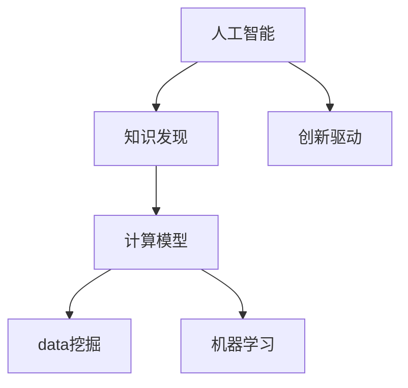

                 

# 推动知识发现和创新：人类计算的智力贡献

> 关键词：人工智能, 知识发现, 创新驱动, 计算模型, 数据挖掘, 机器学习

## 1. 背景介绍

### 1.1 问题由来
随着科技的飞速发展，人工智能（AI）已经逐渐渗透到社会的各个领域，从医疗、教育到金融、交通，人工智能正在重塑我们的生活方式和工作方式。然而，人工智能的发展并非一帆风顺，它面临诸多挑战，其中最核心的问题之一就是知识发现和创新。传统的基于人类直觉和经验的知识发现方式已经难以满足现代科技发展的需求，而人工智能则需要通过计算模型来模拟和延伸人类的智力。

### 1.2 问题核心关键点
知识发现和创新是大数据时代的重要主题，人工智能在这一领域展现了巨大的潜力。然而，如何让计算机更好地理解和应用知识，是当前AI研究的一个重要课题。其中，基于人类计算的智力贡献，即将人类的知识、智慧和经验转化为计算模型，成为了推动知识发现和创新的关键。

## 2. 核心概念与联系

### 2.1 核心概念概述
- **人工智能**：利用计算机模拟和延伸人类智能的技术，包括机器学习、深度学习、自然语言处理等。
- **知识发现**：通过数据分析和模型构建，从大量数据中提取隐含知识和模式。
- **创新驱动**：通过不断探索和实验，推动技术进步和应用拓展。
- **计算模型**：用数学公式或算法描述问题解决方案的模型。
- **数据挖掘**：从数据中自动发现模式、规则、异常等，并转化为有用的知识。
- **机器学习**：让计算机通过数据学习规律，提升其自主决策能力。

### 2.2 核心概念原理和架构的 Mermaid 流程图



这个流程图展示了人工智能、知识发现、创新驱动、计算模型、数据挖掘和机器学习之间的逻辑关系：人工智能通过数据挖掘和机器学习发现和应用知识，创新驱动促进了知识的发现和应用，而计算模型则是实现这些功能和理念的基础架构。

## 3. 核心算法原理 & 具体操作步骤

### 3.1 算法原理概述
基于人类计算的智力贡献，我们主要通过以下两个步骤来实现知识发现和创新：

1. **数据预处理**：从原始数据中提取特征，并将数据转化为模型可以处理的形式。
2. **模型训练和测试**：利用机器学习算法训练模型，并使用验证数据集进行测试，最终得到高性能的模型。

### 3.2 算法步骤详解

**Step 1: 数据收集与预处理**
- 收集相关领域的数据集，如金融交易记录、医疗病例、教育资源等。
- 对数据进行清洗、归一化和特征选择，减少噪音，提高数据质量。
- 数据存储和处理，可以使用Hadoop、Spark等大数据处理工具，以支持大规模数据处理。

**Step 2: 模型选择与训练**
- 根据问题的特点选择合适的机器学习算法，如分类、回归、聚类等。
- 在数据集上训练模型，通常使用交叉验证等技术进行参数调优。
- 评估模型性能，使用准确率、召回率、F1分数等指标。

**Step 3: 模型应用与优化**
- 使用训练好的模型进行预测或分类，输出结果。
- 根据业务需求对模型进行优化，如提升模型准确率、降低计算成本等。
- 持续监控模型性能，定期更新模型以应对数据分布变化。

### 3.3 算法优缺点
**优点**：
- 高效性：自动化处理大量数据，提高处理速度。
- 可扩展性：适应各种规模的数据，支持多领域应用。
- 客观性：减少人为误差，提升结果可靠性。

**缺点**：
- 依赖数据质量：数据质量直接影响模型效果，数据质量差时模型表现不佳。
- 模型过拟合：当模型复杂度较高时，容易出现过拟合现象，影响泛化能力。
- 计算资源需求高：处理大规模数据需要大量计算资源。

### 3.4 算法应用领域
基于人类计算的智力贡献，在以下领域中得到了广泛应用：

1. **金融**：风险评估、欺诈检测、市场预测等。
2. **医疗**：疾病诊断、治疗方案推荐、患者风险评估等。
3. **教育**：个性化学习、智能推荐、学习路径优化等。
4. **交通**：交通流量预测、车辆调度、路径优化等。
5. **零售**：客户行为分析、推荐系统、库存管理等。

## 4. 数学模型和公式 & 详细讲解

### 4.1 数学模型构建

我们以分类问题为例，构建一个简单的分类模型：

**Step 1: 数据预处理**
- 将数据集划分为训练集和测试集。
- 将数据集进行归一化处理。

**Step 2: 模型构建**
- 使用K近邻算法（KNN）进行分类。
- 使用欧氏距离计算样本间的相似度。

**Step 3: 模型训练**
- 在训练集上训练模型，计算模型参数。
- 使用交叉验证技术进行参数调优。

**Step 4: 模型测试**
- 在测试集上测试模型性能。
- 计算模型的准确率、召回率等指标。

### 4.2 公式推导过程

假设我们的数据集为 $D = \{(x_1, y_1), (x_2, y_2), ..., (x_n, y_n)\}$，其中 $x_i$ 表示样本，$y_i$ 表示标签。K近邻算法的基本思想是在训练集中找到与测试样本 $x$ 距离最近的K个样本，根据这些样本的标签进行投票，得出预测结果。具体推导如下：

设 $x$ 为测试样本，$x_i$ 为训练集中的样本。假设 $d(x, x_i)$ 表示样本 $x$ 和 $x_i$ 之间的距离（如欧氏距离），$\bar{y}_k$ 表示距离 $x$ 最近的K个样本中标签 $y$ 的平均值。则预测结果为：

$$
y = \mathop{\arg\min}_{y \in \{1, 2, ..., C\}} \frac{1}{K} \sum_{i=1}^K I(\bar{y}_k = y)
$$

其中 $C$ 表示类别数，$I(\cdot)$ 表示指示函数。

### 4.3 案例分析与讲解

以医疗诊断为例，我们可以使用支持向量机（SVM）算法构建分类模型。假设我们有5000个医疗病例，其中2000个病例为良性肿瘤，3000个病例为恶性肿瘤。我们选择SVM算法进行分类，并使用交叉验证进行参数调优。

我们使用支持向量机模型进行训练，计算模型参数。具体步骤如下：
1. 在训练集上训练SVM模型，得到模型参数。
2. 使用交叉验证技术进行参数调优，选择最优的惩罚参数和核函数参数。
3. 在测试集上测试模型性能，计算模型的准确率、召回率等指标。

## 5. 项目实践：代码实例和详细解释说明

### 5.1 开发环境搭建

以下是使用Python进行机器学习开发的开发环境配置流程：

1. 安装Anaconda：从官网下载并安装Anaconda，用于创建独立的Python环境。
2. 创建并激活虚拟环境：
```bash
conda create -n pytorch-env python=3.8 
conda activate pytorch-env
```

3. 安装所需的机器学习库：
```bash
pip install numpy pandas scikit-learn matplotlib seaborn
```

### 5.2 源代码详细实现

以下是使用KNN算法进行分类的Python代码实现：

```python
from sklearn.neighbors import KNeighborsClassifier
from sklearn.datasets import load_breast_cancer
from sklearn.model_selection import train_test_split
from sklearn.metrics import accuracy_score

# 加载数据集
data = load_breast_cancer()
X = data.data
y = data.target

# 划分训练集和测试集
X_train, X_test, y_train, y_test = train_test_split(X, y, test_size=0.2, random_state=42)

# 构建KNN模型
model = KNeighborsClassifier(n_neighbors=5)

# 训练模型
model.fit(X_train, y_train)

# 预测测试集
y_pred = model.predict(X_test)

# 计算准确率
acc = accuracy_score(y_test, y_pred)
print("Accuracy:", acc)
```

### 5.3 代码解读与分析

让我们再详细解读一下关键代码的实现细节：

**KNN分类器**：
- 使用Scikit-learn库的KNN分类器，设置$k$值为5。
- 训练集和测试集的划分使用`train_test_split`函数，确保数据分布的随机性。

**模型训练**：
- 使用`fit`函数训练模型，计算模型参数。
- 在训练集上使用交叉验证进行参数调优，选择最优的$k$值。

**模型测试**：
- 使用`predict`函数预测测试集，输出预测结果。
- 使用`accuracy_score`函数计算模型准确率。

**运行结果展示**：
- 输出模型的准确率，评估模型性能。

## 6. 实际应用场景

### 6.1 金融领域的应用

在金融领域，基于人类计算的智力贡献的应用主要包括风险评估、欺诈检测和市场预测。例如，银行可以利用机器学习模型分析客户交易数据，识别出潜在的欺诈行为，从而及时采取措施，减少损失。此外，股票交易系统可以通过分析历史数据和市场趋势，预测股票价格波动，帮助投资者做出更明智的投资决策。

### 6.2 医疗领域的应用

医疗领域是人工智能应用的热点之一。基于人类计算的智力贡献，我们可以开发智能诊断系统，帮助医生分析患者症状和病历，提高诊断的准确率。此外，还可以开发个性化治疗方案推荐系统，根据患者的病历和基因信息，推荐最适合的治疗方案。

### 6.3 教育领域的应用

在教育领域，基于人类计算的智力贡献的应用包括个性化学习、智能推荐和学习路径优化。例如，在线教育平台可以利用机器学习模型分析学生的学习行为和成绩，推荐适合的学习资源，帮助学生提高学习效果。此外，还可以开发智能学习路径规划系统，根据学生的学习情况和兴趣，推荐合适的学习路径。

## 7. 工具和资源推荐

### 7.1 学习资源推荐

为了帮助开发者系统掌握基于人类计算的智力贡献的理论基础和实践技巧，以下是一些优质的学习资源：

1. 《机器学习基础》课程：由斯坦福大学开设的在线课程，涵盖机器学习的基本概念和算法。
2. 《深度学习》书籍：Deep Learning 的经典著作，介绍了深度学习的基本原理和应用。
3. 《Python数据分析与科学计算》书籍：介绍了Python在数据分析和科学计算中的应用，适合初学者。
4. Coursera和Udacity：提供各种机器学习相关的在线课程和专项课程，涵盖理论和实践。

### 7.2 开发工具推荐

以下是几款用于机器学习开发的常用工具：

1. Python：功能强大的编程语言，拥有丰富的科学计算和数据分析库。
2. R语言：统计分析和数据挖掘的经典语言，拥有丰富的统计分析和机器学习库。
3. Scikit-learn：基于Python的机器学习库，提供了丰富的机器学习算法和工具。
4. TensorFlow：谷歌开发的深度学习框架，支持大规模深度学习模型的开发和训练。
5. Keras：基于Python的深度学习库，提供了简单易用的API，支持快速原型开发。

### 7.3 相关论文推荐

以下是几篇奠基性的相关论文，推荐阅读：

1. "Support Vector Machines"（核方法）：由Cortes和Vapnik提出的支持向量机算法，为机器学习奠定了基础。
2. "Decision Trees and Random Forests"：由Breiman提出的决策树和随机森林算法，广泛应用于分类和回归问题。
3. "Neural Networks and Deep Learning"：Ian Goodfellow等人撰写的深度学习经典书籍，介绍了深度学习的基本原理和应用。
4. "Machine Learning Yearning"：Andrew Ng撰写的机器学习实践指南，介绍了机器学习的实践经验和技巧。

## 8. 总结：未来发展趋势与挑战

### 8.1 总结

本文对基于人类计算的智力贡献在知识发现和创新中的应用进行了全面系统的介绍。首先阐述了人工智能在知识发现和创新中的重要作用，明确了计算模型在其中的核心地位。其次，从原理到实践，详细讲解了基于人类计算的智力贡献的数学模型构建、算法步骤、模型评估等，给出了完整的代码实例。同时，本文还探讨了基于人类计算的智力贡献在金融、医疗、教育等多个领域的应用前景，展示了其广阔的想象空间。最后，本文精选了学习资源和开发工具，力求为读者提供全方位的技术指引。

通过本文的系统梳理，可以看到，基于人类计算的智力贡献在知识发现和创新中的应用前景广阔，为AI技术的发展提供了新的思路和方向。未来，伴随技术的不断进步和应用领域的拓展，基于人类计算的智力贡献必将在更多领域得到应用，为社会进步和人类发展注入新的动力。

### 8.2 未来发展趋势

展望未来，基于人类计算的智力贡献将呈现以下几个发展趋势：

1. 技术日趋成熟：随着算法和模型的不断优化，基于人类计算的智力贡献将更加高效和准确。
2. 应用领域拓展：将在更多领域得到应用，如交通、物流、城市管理等，推动智能化社会的构建。
3. 跨领域融合：与其他人工智能技术进行更深入的融合，形成更加全面、智能的解决方案。
4. 伦理道德关注：在应用过程中，将更加注重伦理道德问题，保护用户隐私和数据安全。
5. 人机协同：将更注重人机协作，提升系统的可解释性和透明度。

### 8.3 面临的挑战

尽管基于人类计算的智力贡献已经取得了显著成就，但在迈向更广泛应用的过程中，仍面临以下挑战：

1. 数据隐私和安全：如何保护用户隐私和数据安全，避免数据泄露和滥用。
2. 模型透明性：如何提高模型的透明性和可解释性，增强用户信任。
3. 伦理道德问题：如何避免算法偏见和歧视，确保算法的公平性和公正性。
4. 计算资源需求：如何优化计算资源使用，降低成本，提高系统效率。
5. 跨领域应用：如何将不同领域的数据和知识进行有效整合，形成完整的解决方案。

### 8.4 研究展望

未来的研究需要在以下几个方面寻求新的突破：

1. 探索更好的数据挖掘技术：开发更加高效和准确的数据挖掘算法，提升知识发现能力。
2. 开发新的计算模型：设计更加高效和鲁棒的计算模型，提升创新驱动能力。
3. 注重伦理道德问题：在算法设计和应用过程中，更加注重伦理道德问题，保护用户权益。
4. 跨领域协作：与其他人工智能技术进行更深入的融合，推动跨领域知识发现和应用。
5. 加强人机协同：增强人机协作，提升系统的透明性和可解释性，推动人机协同的智能社会构建。

这些研究方向和突破将进一步推动基于人类计算的智力贡献在知识发现和创新中的应用，为社会进步和人类发展注入新的动力。

## 9. 附录：常见问题与解答

**Q1: 基于人类计算的智力贡献是否适用于所有领域？**

A: 基于人类计算的智力贡献在许多领域都有应用，如金融、医疗、教育等。但在一些特殊领域，如军事、司法等，需要考虑其特殊性，避免过度依赖机器学习。

**Q2: 在应用基于人类计算的智力贡献时，如何保护用户隐私？**

A: 保护用户隐私是数据应用中的重要问题。可以通过数据脱敏、加密等技术，保护用户的隐私。同时，在算法设计和应用过程中，注重伦理道德问题，确保算法的公平性和公正性。

**Q3: 如何提高基于人类计算的智力贡献的透明性和可解释性？**

A: 提高模型的透明性和可解释性，可以通过多种方法，如增加模型的可解释性模块、引入因果分析等。同时，注重人机协同，增强系统的透明性和可解释性，增强用户信任。

**Q4: 在应用基于人类计算的智力贡献时，如何避免算法偏见？**

A: 避免算法偏见是人工智能应用中的重要问题。可以通过数据清洗、正则化等技术，减少数据中的偏见。同时，在设计算法时，注重伦理道德问题，确保算法的公平性和公正性。

**Q5: 在应用基于人类计算的智力贡献时，如何优化计算资源使用？**

A: 优化计算资源使用，可以通过多种方法，如数据预处理、模型压缩、并行计算等。同时，注重算法设计和应用过程中的资源优化，提高系统的效率。

---

作者：禅与计算机程序设计艺术 / Zen and the Art of Computer Programming

