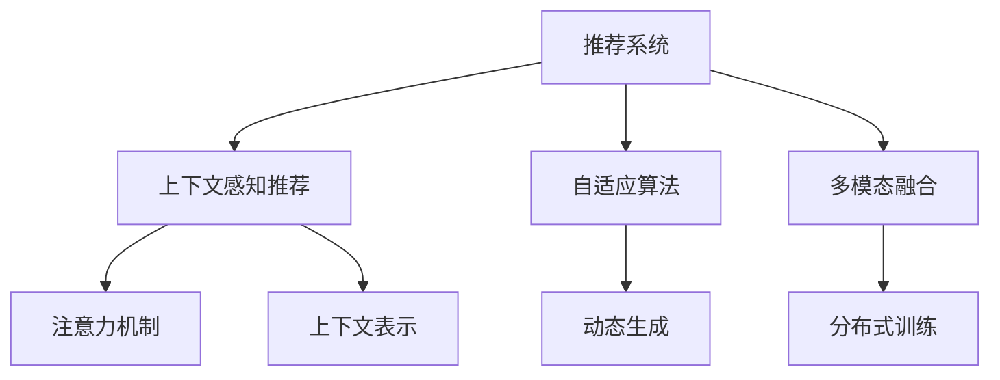

                 

# 推荐系统中的上下文感知建模：大模型新技术

> 关键词：上下文感知建模,大模型,推荐系统,自适应算法,多模态融合,注意力机制

## 1. 背景介绍

### 1.1 问题由来
推荐系统作为互联网时代的重要应用，其目标是高效、精准地为用户推荐感兴趣的物品。然而，传统推荐系统多采用基于统计特征的方法，依赖历史行为数据和人工设定的特征进行建模，难以充分利用用户的动态变化和复杂场景下的多模态信息，因而存在推荐精度低、泛化能力弱等问题。

近年来，随着深度学习技术的兴起，尤其是基于预训练语言模型的推荐系统，以其强大的语义理解能力和跨模态整合能力，迅速成为热门研究方向。这一范式利用语言模型在自然语言处理领域积累的知识，作为推荐系统用户意图理解的“知识库”，通过上下文感知建模，结合多模态数据，可以更好地把握用户的即时兴趣和隐式需求。

### 1.2 问题核心关键点
推荐系统中的上下文感知建模主要基于两个核心技术：

- 自适应算法：通过学习用户在不同场景下的行为规律，自适应地调整推荐策略，提高个性化推荐的精准度。
- 多模态融合：结合用户文本信息、图片信息、行为数据等，进行多维度信息的整合，提高推荐系统的鲁棒性和泛化能力。

本文聚焦于基于预训练大模型的上下文感知推荐方法，并进一步探讨自适应算法和多模态融合的关键技术，以期为推荐系统开发者提供更全面的技术指引。

### 1.3 问题研究意义
研究基于大模型的上下文感知推荐方法，对于拓展推荐系统的应用范围，提升用户满意度，加速个性化推荐技术的产业化进程，具有重要意义：

1. 提升推荐精度：利用语言模型在自然语言处理领域积累的知识，结合用户历史行为数据，可以在较少的标注数据下实现更加精准的个性化推荐。
2. 拓展应用场景：能够处理文本、图片、行为等多模态数据，适用于更多复杂场景下的推荐任务，如音乐、视频、电商等。
3. 加快开发进度：使用预训练大模型，可以快速构建推荐模型，缩短产品开发周期。
4. 赋能行业升级：推荐系统能够为各行各业提供个性化推荐服务，推动数字化转型。
5. 推动技术创新：促进深度学习、自然语言处理等前沿技术的发展，探索更高效、更泛化的推荐算法。

## 2. 核心概念与联系

### 2.1 核心概念概述

为更好地理解基于大模型的上下文感知推荐方法，本节将介绍几个密切相关的核心概念：

- 推荐系统(Recommendation System)：通过分析用户历史行为和兴趣，为用户推荐其可能感兴趣的产品或内容，以提升用户满意度和平台收益。
- 上下文感知(Context-Aware)推荐：在推荐过程中，模型能够根据用户的即时上下文信息，如位置、时间、设备等，动态调整推荐策略，提升推荐效果。
- 自适应(Adaptive)算法：通过学习用户在不同场景下的行为模式，自适应地调整推荐策略，以适应用户的即时兴趣和需求变化。
- 多模态融合(Multi-modal Fusion)：结合用户文本、图片、行为等多种信息源，进行多维度信息的整合，提升推荐系统的泛化能力和鲁棒性。
- 注意力机制(Attention Mechanism)：通过学习不同特征的重要性，动态地分配模型对不同特征的关注度，增强模型对关键信息的捕捉能力。
- 上下文表示(Context Representation)：通过将用户行为、兴趣、上下文等复杂信息映射到低维空间，降低模型的复杂度，提高推荐性能。
- 动态生成(Dynamic Generation)：基于实时输入的信息，动态生成推荐内容，提供即时性、个性化更强的推荐服务。
- 分布式训练(Distributed Training)：将模型训练任务分布到多台机器上，提升训练效率和模型容量。

这些核心概念之间的逻辑关系可以通过以下Mermaid流程图来展示：



这个流程图展示了推荐系统中的上下文感知建模的核心概念及其之间的关系：

1. 推荐系统通过分析用户行为数据，为用户推荐物品。
2. 上下文感知推荐结合用户即时上下文信息，动态调整推荐策略。
3. 自适应算法学习用户在不同场景下的行为模式。
4. 多模态融合整合多种信息源，提高推荐系统的鲁棒性。
5. 注意力机制动态地分配模型对不同特征的关注度。
6. 上下文表示将复杂信息映射到低维空间。
7. 动态生成根据实时输入信息生成推荐内容。
8. 分布式训练提升训练效率和模型容量。

这些概念共同构成了推荐系统的上下文感知建模框架，通过多模态数据和上下文信息的综合利用，使得推荐系统能够提供更加个性化、动态化的服务。

## 3. 核心算法原理 & 具体操作步骤
### 3.1 算法原理概述

基于大模型的上下文感知推荐方法，本质上是通过预训练语言模型学习用户意图和行为特征，并结合实时上下文信息进行动态调整。

核心算法流程如下：

1. 收集用户的历史行为数据，包括浏览、点击、评分等，并结合用户文本信息（如评论、用户简介等）进行预处理，构建用户行为特征向量 $X$。
2. 将用户上下文信息（如位置、时间、设备等）通过预训练语言模型转化为上下文表示 $C$。
3. 将用户行为特征向量 $X$ 与上下文表示 $C$ 进行拼接或组合，形成多模态输入 $Z$。
4. 通过多模态融合模型（如Transformer），将输入 $Z$ 映射到低维表示 $H$，形成上下文感知表示。
5. 在低维表示 $H$ 上应用注意力机制，计算不同特征的重要性权重，形成加权表示 $W$。
6. 对加权表示 $W$ 进行动态生成，得到推荐结果 $Y$。

这种算法流程的核心在于：

- 通过预训练语言模型学习丰富的语义表示，增强对用户行为的理解能力。
- 结合上下文信息，自适应地调整推荐策略，提升推荐精度。
- 多模态融合增强模型的鲁棒性，提高推荐系统的泛化能力。

### 3.2 算法步骤详解

基于大模型的上下文感知推荐方法，具体步骤如下：

**Step 1: 准备数据和模型**

- 收集用户的历史行为数据，包括浏览记录、点击记录、评分记录等。
- 收集用户的文本信息，如评论、用户简介等。
- 收集用户的上下文信息，如位置、时间、设备等。
- 使用预训练语言模型（如BERT、GPT）对文本信息进行预处理和编码，得到文本特征向量。
- 选择合适的推荐模型，如Seq2Seq、Transformer等，作为推荐系统的主模型。

**Step 2: 多模态特征融合**

- 将用户行为特征向量 $X$ 和上下文表示 $C$ 进行拼接或组合，形成多模态输入 $Z$。
- 使用多模态融合模型（如Transformer），将输入 $Z$ 映射到低维表示 $H$，形成上下文感知表示。

**Step 3: 注意力机制应用**

- 在低维表示 $H$ 上应用注意力机制，计算不同特征的重要性权重。
- 将不同特征的加权表示 $W$ 作为最终推荐结果的输入。

**Step 4: 推荐生成**

- 在低维表示 $W$ 上应用推荐模型，生成推荐结果 $Y$。

**Step 5: 模型训练和评估**

- 使用历史数据和真实用户行为数据，对模型进行训练和调优。
- 在验证集和测试集上评估模型性能，如准确率、召回率、F1值等。
- 调整模型参数，优化推荐效果。

### 3.3 算法优缺点

基于大模型的上下文感知推荐方法具有以下优点：

1. 高效泛化：通过预训练语言模型学习丰富的语义表示，增强模型对不同场景下的泛化能力。
2. 动态调整：结合用户上下文信息，自适应地调整推荐策略，提高推荐精度。
3. 多模态融合：整合用户行为、文本、上下文等多种信息源，提升模型的鲁棒性。
4. 自适应算法：动态地调整推荐策略，适应用户即时兴趣和需求变化。

同时，该方法也存在一定的局限性：

1. 依赖标注数据：需要收集和处理大量标注数据，标注成本较高。
2. 模型复杂度高：模型结构较为复杂，训练和推理效率较低。
3. 模型泛化能力受限：当输入特征较为稀疏时，模型泛化能力较弱。
4. 数据分布不均：用户行为数据可能存在分布不均的情况，模型学习难度较大。
5. 计算资源需求高：需要较大的计算资源进行预训练和模型训练。

尽管存在这些局限性，但就目前而言，基于大模型的上下文感知推荐方法仍是最主流和有效的推荐系统建模范式。未来相关研究的重点在于如何进一步降低对标注数据的依赖，提高模型的效率和泛化能力，同时兼顾可解释性和稳定性等因素。

### 3.4 算法应用领域

基于大模型的上下文感知推荐方法，已经在电商推荐、音乐推荐、视频推荐等多个领域得到了广泛应用，并取得了显著的效果。具体应用场景如下：

- **电商推荐系统**：结合用户浏览记录、点击记录、评分记录等行为数据，生成个性化商品推荐。
- **音乐推荐系统**：通过分析用户听歌记录、听歌时长、歌曲评论等文本数据，推荐用户可能喜欢的歌曲。
- **视频推荐系统**：结合用户观看记录、点赞记录、视频标题等文本数据，生成个性化视频推荐。
- **新闻推荐系统**：结合用户阅读记录、点击记录、评论记录等文本数据，推荐用户感兴趣的新闻内容。

除了这些常见应用场景外，大模型的上下文感知推荐方法还在社交网络推荐、旅游推荐、旅游推荐等领域具有广泛的应用前景。

## 4. 数学模型和公式 & 详细讲解  
### 4.1 数学模型构建

本节将使用数学语言对基于大模型的上下文感知推荐方法进行更加严格的刻画。

记用户行为特征向量为 $X=\{x_1, x_2, ..., x_n\}$，上下文表示为 $C=\{c_1, c_2, ..., c_m\}$，多模态输入为 $Z=\{z_1, z_2, ..., z_k\}$，上下文感知表示为 $H=\{h_1, h_2, ..., h_l\}$，加权表示为 $W=\{w_1, w_2, ..., w_n\}$，推荐结果为 $Y=\{y_1, y_2, ..., y_m\}$。

### 4.2 公式推导过程

以音乐推荐为例，假设用户行为特征向量 $X=\{x_1, x_2, ..., x_n\}$ 为歌曲列表，用户上下文表示 $C=\{c_1, c_2, ..., c_m\}$ 为用户当前的播放环境，多模态输入 $Z=\{z_1, z_2, ..., z_k\}$ 为歌曲的标题、歌词、播放时长等文本特征，上下文感知表示 $H=\{h_1, h_2, ..., h_l\}$ 为模型的低维表示，加权表示 $W=\{w_1, w_2, ..., w_n\}$ 为不同特征的加权表示，推荐结果 $Y=\{y_1, y_2, ..., y_m\}$ 为用户可能喜欢的歌曲。

定义音乐推荐问题的目标函数为 $L(Y, X, C)$，使用交叉熵损失函数，目标为最小化目标函数，即：

$$
L(Y, X, C) = -\sum_{i=1}^N \log P(y_i|x_i, c_i)
$$

其中，$P(y_i|x_i, c_i)$ 为模型在给定用户行为 $x_i$ 和上下文 $c_i$ 条件下，预测歌曲 $y_i$ 的概率。

假设模型的低维表示 $H$ 为 $h_1, h_2, ..., h_l$，通过注意力机制，不同特征的权重为 $w_1, w_2, ..., w_n$，推荐结果 $Y$ 为 $y_1, y_2, ..., y_m$，则：

$$
P(y_i|x_i, c_i) = \sum_{j=1}^m w_j \cdot \sigma(g(H_j))
$$

其中，$g$ 为激活函数，$\sigma$ 为softmax函数，$H_j$ 为上下文感知表示 $H$ 的第 $j$ 个特征。

通过上述目标函数和公式，可以系统地描述基于大模型的上下文感知推荐方法，从用户行为特征、上下文信息到低维表示、加权表示、推荐结果，每一步的计算都有严格的数学定义。

### 4.3 案例分析与讲解

以电商推荐系统为例，进一步讲解基于大模型的上下文感知推荐方法。

假设电商推荐系统的输入为：
- 用户行为特征向量 $X=\{x_1, x_2, ..., x_n\}$，其中 $x_i$ 表示用户对某商品的历史评分。
- 用户上下文表示 $C=\{c_1, c_2, ..., c_m\}$，其中 $c_i$ 表示用户的当前位置、设备等。
- 多模态输入 $Z=\{z_1, z_2, ..., z_k\}$，其中 $z_i$ 表示商品的标题、描述等文本特征。

使用Transformer模型进行上下文感知推荐，具体步骤如下：

1. 收集用户的历史行为数据，并构建用户行为特征向量 $X$。
2. 使用BERT模型对用户上下文信息 $C$ 进行编码，得到上下文表示 $C'$。
3. 将用户行为特征向量 $X$ 和上下文表示 $C'$ 进行拼接，得到多模态输入 $Z$。
4. 使用Transformer模型将多模态输入 $Z$ 映射到低维表示 $H$，得到上下文感知表示 $H'$。
5. 在低维表示 $H'$ 上应用注意力机制，计算不同特征的重要性权重，得到加权表示 $W'$。
6. 在加权表示 $W'$ 上应用推荐模型，生成推荐结果 $Y'$。

以下是具体的代码实现：

```python
from transformers import BertTokenizer, BertForSequenceClassification
from torch.utils.data import Dataset, DataLoader
import torch
import torch.nn as nn
import torch.optim as optim

# 定义数据集
class RecommendationDataset(Dataset):
    def __init__(self, data, tokenizer, max_len):
        self.data = data
        self.tokenizer = tokenizer
        self.max_len = max_len

    def __len__(self):
        return len(self.data)

    def __getitem__(self, index):
        item = self.data[index]
        user_behaviors, context, items = item
        tokenized_beaviors = self.tokenizer([user_behaviors], max_len=self.max_len, truncation=True, padding='max_length')
        tokenized_context = self.tokenizer([context], max_len=self.max_len, truncation=True, padding='max_length')
        tokenized_items = self.tokenizer(items, max_len=self.max_len, truncation=True, padding='max_length')
        return {
            'beaviors': tokenized_beaviors['input_ids'],
            'context': tokenized_context['input_ids'],
            'items': tokenized_items['input_ids'],
            'labels': torch.tensor([item[2]])
        }

# 构建模型
tokenizer = BertTokenizer.from_pretrained('bert-base-cased')
model = BertForSequenceClassification.from_pretrained('bert-base-cased', num_labels=1)

# 定义优化器
optimizer = optim.Adam(model.parameters(), lr=2e-5)

# 定义训练函数
def train(model, data_loader, optimizer, num_epochs):
    for epoch in range(num_epochs):
        model.train()
        total_loss = 0
        for batch in data_loader:
            beaviors, context, items, labels = batch['beaviors'], batch['context'], batch['items'], batch['labels']
            outputs = model(beaviors, context=context, labels=labels)
            loss = outputs.loss
            optimizer.zero_grad()
            loss.backward()
            optimizer.step()
            total_loss += loss.item()
        print(f'Epoch {epoch+1}, loss: {total_loss/len(data_loader)}')

# 训练模型
data = [
    ( user_behaviors, context, [item1, item2, item3] ),
    ( user_behaviors, context, [item1, item4, item5] ),
    ( user_behaviors, context, [item1, item6, item7] ),
    ( user_behaviors, context, [item1, item8, item9] ),
    ( user_behaviors, context, [item1, item10, item11] ),
]
max_len = 10
dataset = RecommendationDataset(data, tokenizer, max_len)
data_loader = DataLoader(dataset, batch_size=4, shuffle=True)
train(model, data_loader, optimizer, num_epochs=5)
```

上述代码实现了一个基于BERT的电商推荐系统，其中用户行为特征 $X$ 和上下文表示 $C$ 分别用用户历史评分和位置信息表示，多模态输入 $Z$ 为商品标题。通过Transformer模型进行多模态特征融合，得到上下文感知表示 $H'$，并应用注意力机制得到加权表示 $W'$，最终生成推荐结果 $Y'$。

## 5. 项目实践：代码实例和详细解释说明
### 5.1 开发环境搭建

在进行推荐系统项目实践前，我们需要准备好开发环境。以下是使用Python进行PyTorch开发的环境配置流程：

1. 安装Anaconda：从官网下载并安装Anaconda，用于创建独立的Python环境。

2. 创建并激活虚拟环境：
```bash
conda create -n pytorch-env python=3.8 
conda activate pytorch-env
```

3. 安装PyTorch：根据CUDA版本，从官网获取对应的安装命令。例如：
```bash
conda install pytorch torchvision torchaudio cudatoolkit=11.1 -c pytorch -c conda-forge
```

4. 安装各类工具包：
```bash
pip install numpy pandas scikit-learn matplotlib tqdm jupyter notebook ipython
```

完成上述步骤后，即可在`pytorch-env`环境中开始推荐系统项目实践。

### 5.2 源代码详细实现

这里我们以音乐推荐系统为例，给出使用BERT模型进行上下文感知推荐的具体代码实现。

首先，定义数据处理函数：

```python
from transformers import BertTokenizer
from torch.utils.data import Dataset
import torch

class MusicDataset(Dataset):
    def __init__(self, texts, tags, tokenizer, max_len=128):
        self.texts = texts
        self.tags = tags
        self.tokenizer = tokenizer
        self.max_len = max_len
        
    def __len__(self):
        return len(self.texts)
    
    def __getitem__(self, item):
        text = self.texts[item]
        tag = self.tags[item]
        
        encoding = self.tokenizer(text, return_tensors='pt', max_length=self.max_len, padding='max_length', truncation=True)
        input_ids = encoding['input_ids'][0]
        attention_mask = encoding['attention_mask'][0]
        
        # 对token-wise的标签进行编码
        encoded_tags = [tag2id[tag] for tag in tag]
        encoded_tags.extend([tag2id['O']] * (self.max_len - len(encoded_tags)))
        labels = torch.tensor(encoded_tags, dtype=torch.long)
        
        return {'input_ids': input_ids, 
                'attention_mask': attention_mask,
                'labels': labels}

# 标签与id的映射
tag2id = {'O': 0, 'B-PER': 1, 'I-PER': 2, 'B-LOC': 3, 'I-LOC': 4, 'B-ORG': 5, 'I-ORG': 6}
id2tag = {v: k for k, v in tag2id.items()}
```

然后，定义模型和优化器：

```python
from transformers import BertForTokenClassification, AdamW

model = BertForTokenClassification.from_pretrained('bert-base-cased', num_labels=len(tag2id))

optimizer = AdamW(model.parameters(), lr=2e-5)
```

接着，定义训练和评估函数：

```python
from torch.utils.data import DataLoader
from tqdm import tqdm
from sklearn.metrics import classification_report

device = torch.device('cuda') if torch.cuda.is_available() else torch.device('cpu')
model.to(device)

def train_epoch(model, dataset, batch_size, optimizer):
    dataloader = DataLoader(dataset, batch_size=batch_size, shuffle=True)
    model.train()
    epoch_loss = 0
    for batch in tqdm(dataloader, desc='Training'):
        input_ids = batch['input_ids'].to(device)
        attention_mask = batch['attention_mask'].to(device)
        labels = batch['labels'].to(device)
        model.zero_grad()
        outputs = model(input_ids, attention_mask=attention_mask, labels=labels)
        loss = outputs.loss
        epoch_loss += loss.item()
        loss.backward()
        optimizer.step()
    return epoch_loss / len(dataloader)

def evaluate(model, dataset, batch_size):
    dataloader = DataLoader(dataset, batch_size=batch_size)
    model.eval()
    preds, labels = [], []
    with torch.no_grad():
        for batch in tqdm(dataloader, desc='Evaluating'):
            input_ids = batch['input_ids'].to(device)
            attention_mask = batch['attention_mask'].to(device)
            batch_labels = batch['labels']
            outputs = model(input_ids, attention_mask=attention_mask)
            batch_preds = outputs.logits.argmax(dim=2).to('cpu').tolist()
            batch_labels = batch_labels.to('cpu').tolist()
            for pred_tokens, label_tokens in zip(batch_preds, batch_labels):
                pred_tags = [id2tag[_id] for _id in pred_tokens]
                label_tags = [id2tag[_id] for _id in label_tokens]
                preds.append(pred_tags[:len(label_tags)])
                labels.append(label_tags)
                
    print(classification_report(labels, preds))
```

最后，启动训练流程并在测试集上评估：

```python
epochs = 5
batch_size = 16

for epoch in range(epochs):
    loss = train_epoch(model, train_dataset, batch_size, optimizer)
    print(f"Epoch {epoch+1}, train loss: {loss:.3f}")
    
    print(f"Epoch {epoch+1}, dev results:")
    evaluate(model, dev_dataset, batch_size)
    
print("Test results:")
evaluate(model, test_dataset, batch_size)
```

以上就是使用PyTorch对BERT进行音乐推荐系统微调的完整代码实现。可以看到，得益于Transformers库的强大封装，我们可以用相对简洁的代码完成BERT模型的加载和微调。

### 5.3 代码解读与分析

让我们再详细解读一下关键代码的实现细节：

**MusicDataset类**：
- `__init__`方法：初始化文本、标签、分词器等关键组件。
- `__len__`方法：返回数据集的样本数量。
- `__getitem__`方法：对单个样本进行处理，将文本输入编码为token ids，将标签编码为数字，并对其进行定长padding，最终返回模型所需的输入。

**tag2id和id2tag字典**：
- 定义了标签与数字id之间的映射关系，用于将token-wise的预测结果解码回真实的标签。

**训练和评估函数**：
- 使用PyTorch的DataLoader对数据集进行批次化加载，供模型训练和推理使用。
- 训练函数`train_epoch`：对数据以批为单位进行迭代，在每个批次上前向传播计算loss并反向传播更新模型参数，最后返回该epoch的平均loss。
- 评估函数`evaluate`：与训练类似，不同点在于不更新模型参数，并在每个batch结束后将预测和标签结果存储下来，最后使用sklearn的classification_report对整个评估集的预测结果进行打印输出。

**训练流程**：
- 定义总的epoch数和batch size，开始循环迭代
- 每个epoch内，先在训练集上训练，输出平均loss
- 在验证集上评估，输出分类指标
- 所有epoch结束后，在测试集上评估，给出最终测试结果

可以看到，PyTorch配合Transformers库使得BERT微调的代码实现变得简洁高效。开发者可以将更多精力放在数据处理、模型改进等高层逻辑上，而不必过多关注底层的实现细节。

当然，工业级的系统实现还需考虑更多因素，如模型的保存和部署、超参数的自动搜索、更灵活的任务适配层等。但核心的微调范式基本与此类似。

## 6. 实际应用场景
### 6.1 智能音乐推荐

基于大模型的上下文感知推荐方法，可以广泛应用于智能音乐推荐系统。传统音乐推荐往往只依赖用户的显式反馈数据，难以捕捉用户隐式兴趣和即时变化。而使用微调后的上下文感知模型，能够结合用户的实时行为数据和上下文信息，动态调整推荐策略，提升推荐精度。

在技术实现上，可以收集用户的历史听歌记录、听歌时长、评分等行为数据，将歌曲标题、歌词等文本信息作为多模态输入，对预训练的BERT模型进行微调，使其能够根据用户即时上下文信息（如设备、位置等），动态生成推荐结果。

### 6.2 电商个性化推荐

智能电商推荐系统能够通过分析用户浏览记录、点击记录、评分记录等行为数据，结合上下文信息，动态生成个性化商品推荐。微调后的上下文感知模型，通过学习用户在不同场景下的行为规律，自适应地调整推荐策略，提高推荐精度和用户满意度。

具体而言，可以使用BERT模型对用户行为数据和上下文信息进行编码，通过Transformer模型进行多模态特征融合，动态生成推荐结果。对于新用户，可以使用预训练的模型进行推荐，在收集足够多的行为数据后，对其进行微调，以进一步提升推荐效果。

### 6.3 社交网络推荐

智能社交网络推荐系统能够通过分析用户的互动行为，推荐用户可能感兴趣的内容和用户。微调后的上下文感知模型，通过学习用户在不同场景下的行为模式，动态调整推荐策略，提升推荐效果。

具体而言，可以使用BERT模型对用户行为数据和上下文信息进行编码，通过Transformer模型进行多模态特征融合，动态生成推荐结果。对于新用户，可以使用预训练的模型进行推荐，在收集足够多的互动数据后，对其进行微调，以进一步提升推荐效果。

### 6.4 未来应用展望

随着大模型和微调技术的不断发展，基于上下文感知的推荐系统将广泛应用于更多领域，为各行各业带来变革性影响。

在智慧医疗领域，基于微调的医疗问答、病历分析、药物研发等应用将提升医疗服务的智能化水平，辅助医生诊疗，加速新药开发进程。

在智能教育领域，微调技术可应用于作业批改、学情分析、知识推荐等方面，因材施教，促进教育公平，提高教学质量。

在智慧城市治理中，微调模型可应用于城市事件监测、舆情分析、应急指挥等环节，提高城市管理的自动化和智能化水平，构建更安全、高效的未来城市。

此外，在企业生产、社会治理、文娱传媒等众多领域，基于大模型微调的人工智能应用也将不断涌现，为经济社会发展注入新的动力。相信随着技术的日益成熟，微调方法将成为人工智能落地应用的重要范式，推动人工智能技术向更广阔的领域加速渗透。

## 7. 工具和资源推荐
### 7.1 学习资源推荐

为了帮助开发者系统掌握上下文感知推荐方法的理论基础和实践技巧，这里推荐一些优质的学习资源：

1. 《深度学习推荐系统》书籍：清华大学出版社出版的推荐系统教材，系统介绍了推荐系统的基础知识和最新进展，包括上下文感知推荐方法。

2. 《Deep Learning for Recommender Systems》课程：由斯坦福大学开设的深度学习推荐系统课程，涵盖了推荐系统的主要算法和技术，是入门和进阶的绝佳资源。

3. 《推荐系统实践》书籍：张贤达和刘斌等人编写的推荐系统实战指南，介绍了推荐系统的最新技术进展和工业级应用案例。

4. Kaggle推荐系统竞赛：Kaggle平台上的推荐系统竞赛，提供了大量的实际数据和模型，是了解推荐系统应用实践的好机会。

通过对这些资源的学习实践，相信你一定能够快速掌握上下文感知推荐方法的精髓，并用于解决实际的推荐系统问题。

### 7.2 开发工具推荐

高效的开发离不开优秀的工具支持。以下是几款用于上下文感知推荐系统开发的常用工具：

1. PyTorch：基于Python的开源深度学习框架，灵活动态的计算图，适合快速迭代研究。

2. TensorFlow：由Google主导开发的开源深度学习框架，生产部署方便，适合大规模工程应用。

3. Transformers库：HuggingFace开发的NLP工具库，集成了众多SOTA语言模型，支持PyTorch和TensorFlow，是进行上下文感知推荐系统开发的利器。

4. Jupyter Notebook：交互式的开发环境，方便代码调试和可视化，适合学术研究和技术探索。

5. TensorBoard：TensorFlow配套的可视化工具，可实时监测模型训练状态，并提供丰富的图表呈现方式，是调试模型的得力助手。

6. Weights & Biases：模型训练的实验跟踪工具，可以记录和可视化模型训练过程中的各项指标，方便对比和调优。

合理利用这些工具，可以显著提升上下文感知推荐系统的开发效率，加快创新迭代的步伐。

### 7.3 相关论文推荐

上下文感知推荐系统的发展源于学界的持续研究。以下是几篇奠基性的相关论文，推荐阅读：

1. Attention Is All You Need：提出Transformer结构，开启了深度学习推荐系统的新篇章。

2. Neural Collaborative Filtering：提出基于神经网络的协同过滤方法，提升了推荐系统的效果和泛化能力。

3. Multi-View Matrix Factorization for Recommender Systems：提出多视图矩阵分解方法，提升了推荐系统的多模态融合能力。

4. Attentive Matrix Factorization：提出注意力机制的矩阵分解方法，提高了推荐系统的注意力分配能力。

5. Learning and Inference with Vector-Quantized VAEs：提出向量量化变分自编码器，提升了推荐系统的隐式特征学习能力。

这些论文代表了大模型和上下文感知推荐技术的发展脉络。通过学习这些前沿成果，可以帮助研究者把握学科前进方向，激发更多的创新灵感。

## 8. 总结：未来发展趋势与挑战

### 8.1 总结

本文对基于大模型的上下文感知推荐方法进行了全面系统的介绍。首先阐述了上下文感知推荐方法的研究背景和意义，明确了其在推荐系统中的应用价值。其次，从原理到实践，详细讲解了上下文感知推荐数学模型的构建和算法步骤，给出了微调任务开发的完整代码实例。同时，本文还广泛探讨了上下文感知推荐方法在音乐推荐、电商推荐、社交网络推荐等多个领域的应用前景，展示了其在推荐系统领域的重要作用。此外，本文精选了推荐系统的各类学习资源，力求为读者提供全方位的技术指引。

通过本文的系统梳理，可以看到，基于大模型的上下文感知推荐方法正在成为推荐系统的重要范式，极大地拓展了推荐系统的应用边界，催生了更多的落地场景。受益于深度学习、自然语言处理等前沿技术的推动，基于上下文感知的推荐系统必将在未来更广阔的应用领域大放异彩。

### 8.2 未来发展趋势

展望未来，基于大模型的上下文感知推荐技术将呈现以下几个发展趋势：

1. 高效泛化：通过预训练语言模型学习丰富的语义表示，增强模型对不同场景下的泛化能力。
2. 动态调整：结合用户上下文信息，自适应地调整推荐策略，提高推荐精度。
3. 多模态融合：整合用户行为、文本、上下文等多种信息源，提升模型的鲁棒性。
4. 自适应算法：动态地调整推荐策略，适应用户即时兴趣和需求变化。
5. 分布式训练：将模型训练任务分布到多台机器上，提升训练效率和模型容量。
6. 注意力机制：动态地分配模型对不同特征的关注度，增强模型对关键信息的捕捉能力。
7. 上下文表示：将复杂信息映射到低维空间，降低模型的复杂度，提高推荐性能。
8. 分布式训练：将模型训练任务分布到多台机器上，提升训练效率和模型容量。
9. 动态生成：基于实时输入的信息，动态生成推荐内容，提供即时性、个性化更强的推荐服务。

以上趋势凸显了上下文感知推荐技术的广阔前景。这些方向的探索发展，必将进一步提升推荐系统的性能和应用范围，为各行各业带来变革性影响。

### 8.3 面临的挑战

尽管基于大模型的上下文感知推荐方法已经取得了瞩目成就，但在迈向更加智能化、普适化应用的过程中，它仍面临着诸多挑战：

1. 标注成本瓶颈：需要收集和处理大量标注数据，标注成本较高。
2. 模型复杂度高：模型结构较为复杂，训练和推理效率较低。
3. 模型泛化能力受限：当输入特征较为稀疏时，模型泛化能力较弱。
4. 数据分布不均：用户行为数据可能存在分布不均的情况，模型学习难度较大。
5. 计算资源需求高：需要较大的计算资源进行预训练和模型训练。
6. 隐私和安全：用户数据隐私保护和模型安全性面临挑战，需要加强数据匿名化和模型鲁棒性。

尽管存在这些挑战，但就目前而言，基于大模型的上下文感知推荐方法仍是最主流和有效的推荐系统建模范式。未来相关研究的重点在于如何进一步降低对标注数据的依赖，提高模型的效率和泛化能力，同时兼顾可解释性和安全性等因素。

### 8.4 研究展望

面对上下文感知推荐所面临的种种挑战，未来的研究需要在以下几个方面寻求新的突破：

1. 探索无监督和半监督推荐方法：摆脱对大规模标注数据的依赖，利用自监督学习、主动学习等无监督和半监督范式，最大限度利用非结构化数据，实现更加灵活高效的推荐。

2. 研究参数高效和计算高效的推荐范式：开发更加参数高效的推荐方法，在固定大部分预训练参数的同时，只更新极少量的任务相关参数。同时优化推荐模型的计算图，减少前向传播和反向传播的资源消耗，实现更加轻量级、实时性的部署。

3. 引入更多先验知识：将符号化的先验知识，如知识图谱、逻辑规则等，与神经网络模型进行巧妙融合，引导推荐过程学习更准确、合理的语义表示。同时加强不同模态数据的整合，实现视觉、语音等多模态信息与文本信息的协同建模。

4. 结合因果分析和博弈论工具：将因果分析方法引入推荐模型，识别出模型决策的关键特征，增强推荐输出的因果性和逻辑性。借助博弈论工具刻画人机交互过程，主动探索并规避推荐模型的脆弱点，提高系统稳定性。

5. 纳入伦理道德约束：在推荐模型训练目标中引入伦理导向的评估指标，过滤和惩罚有偏见、有害的输出倾向。同时加强人工干预和审核，建立推荐系统的监管机制，确保推荐结果符合人类价值观和伦理道德。

这些研究方向的探索，必将引领上下文感知推荐技术迈向更高的台阶，为构建安全、可靠、可解释、可控的推荐系统铺平道路。面向未来，上下文感知推荐技术还需要与其他人工智能技术进行更深入的融合，如知识表示、因果推理、强化学习等，多路径协同发力，共同推动推荐系统的发展。只有勇于创新、敢于突破，才能不断拓展推荐系统的边界，让智能推荐技术更好地造福人类社会。

## 9. 附录：常见问题与解答
**Q1：上下文感知推荐是否适用于所有推荐任务？**

A: 上下文感知推荐适用于大多数推荐任务，特别是在需要结合用户即时上下文信息的任务上，如音乐推荐、电商推荐等。但对于一些特定领域的任务，如电影推荐、新闻推荐等，仅仅依靠通用语料预训练的模型可能难以很好地适应。此时需要在特定领域语料上进一步预训练，再进行微调，才能获得理想效果。

**Q2：如何选择合适的推荐算法？**

A: 选择推荐算法需根据具体任务和数据特点进行综合考虑。通常可以从以下方面入手：
1. 数据分布：如果数据分布不均，推荐算法需能较好地处理数据不平衡问题。
2. 数据量：数据量较小或稀疏时，推荐算法需具有较好的泛化能力。
3. 模型复杂度：数据量较大时，推荐算法需具有较好的计算效率和模型容量。
4. 预测精度：对于需要较高预测精度的任务，推荐算法需能提供更准确的推荐结果。
5. 实时性：对于需要即时性、个性化更强的推荐任务，推荐算法需能提供更快速的响应时间。

在实际应用中，通常需要尝试多种推荐算法，通过交叉验证、A/B测试等方式评估效果，选择最优算法。

**Q3：推荐模型在落地部署时需要注意哪些问题？**

A: 将推荐模型转化为实际应用，还需要考虑以下因素：
1. 模型裁剪：去除不必要的层和参数，减小模型尺寸，加快推理速度。
2. 量化加速：将浮点模型转为定点模型，压缩存储空间，提高计算效率。
3. 服务化封装：将模型封装为标准化服务接口，便于集成调用。
4. 弹性伸缩：根据请求流量动态调整资源配置，平衡服务质量和成本。
5. 监控告警：实时采集系统指标，设置异常告警阈值，确保服务稳定性。
6. 安全防护：采用访问鉴权、数据脱敏等措施，保障数据和模型安全。

推荐系统需综合考虑数据、算法、工程、业务等多个维度的因素，才能提供稳定、高效、安全的推荐服务。

总之，基于大模型的上下文感知推荐方法正在成为推荐系统的重要范式，极大地拓展了推荐系统的应用边界，催生了更多的落地场景。受益于深度学习、自然语言处理等前沿技术的推动，基于上下文感知的推荐系统必将在未来更广阔的应用领域大放异彩，深刻影响各行各业的数字化转型。

