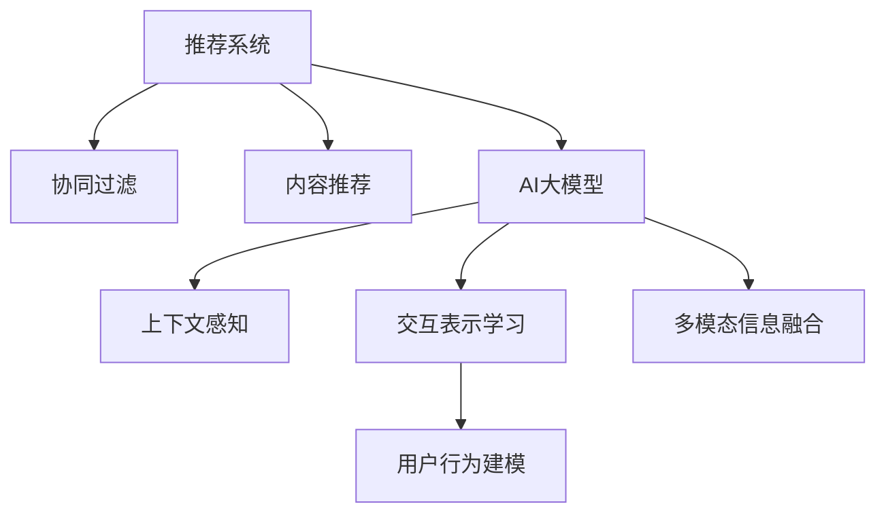

                 

# 推荐系统中的上下文感知：AI大模型的新方向

> 关键词：推荐系统,上下文感知,人工智能大模型,深度学习,协同过滤,序列模型

## 1. 背景介绍

### 1.1 问题由来

推荐系统作为互联网时代的重要应用之一，通过个性化的信息匹配，极大地提升了用户的体验和满意度。然而，随着用户需求的日益个性化，传统的基于协同过滤的推荐方法逐渐暴露出其局限性。

首先，协同过滤依赖用户历史行为数据的数量和质量，对于新用户的冷启动问题尤为严重，难以有效推荐。其次，随着用户行为数据的多样性和复杂性增加，传统的基于内容的推荐方法也无法应对。最后，协同过滤对用户行为的建模较为浅显，缺乏对用户上下文、上下文特征的综合考虑。

针对这些问题，近年来研究者开始探索将AI大模型引入推荐系统，以解决上述痛点。AI大模型（如BERT、GPT-3等）具有强大的泛化能力和上下文感知能力，可以在一定程度上缓解冷启动、稀疏数据等问题。同时，通过上下文感知的交互表示学习，AI大模型可以在保持个性化推荐的同时，综合考虑用户属性、行为、时间、上下文等多维特征。

### 1.2 问题核心关键点

AI大模型在推荐系统中的应用主要聚焦在以下三个关键点：

1. **上下文感知交互表示学习**：AI大模型通过自监督学习任务预训练获得强大的语义表示能力，可以在推荐系统中结合用户属性、行为、时间、上下文等特征，学习更全面的用户交互表示。
2. **用户行为建模**：AI大模型能够学习到用户行为中的隐含语义，通过上下文感知的方式，对用户的行为意图进行更准确的推断。
3. **多模态信息融合**：AI大模型可以自然地融合文本、图像、音频等多模态信息，丰富推荐系统的特征表示。

## 2. 核心概念与联系

### 2.1 核心概念概述

为更好地理解AI大模型在推荐系统中的应用，本节将介绍几个密切相关的核心概念：

- **推荐系统**：通过算法匹配用户与物品，为用户推荐感兴趣的内容。推荐系统可以分为基于协同过滤的推荐和基于内容的推荐。

- **AI大模型**：如BERT、GPT-3等，通过大规模数据和强大计算资源进行训练，具有强大的泛化能力和上下文感知能力。

- **上下文感知**：AI大模型能够综合考虑用户属性、行为、时间、上下文等多维特征，构建更全面的用户交互表示。

- **交互表示学习**：AI大模型通过上下文感知的方式，学习到用户行为中的隐含语义，提升推荐的准确性和个性化。

- **多模态信息融合**：AI大模型可以自然地融合文本、图像、音频等多模态信息，丰富推荐系统的特征表示。

这些核心概念之间的逻辑关系可以通过以下Mermaid流程图来展示：



这个流程图展示了大语言模型的核心概念及其之间的关系：

1. 推荐系统通过协同过滤、内容推荐等方法为用户推荐内容。
2. AI大模型通过上下文感知的方式，提升推荐的准确性和个性化。
3. 交互表示学习增强AI大模型对用户行为的建模能力。
4. 多模态信息融合丰富了AI大模型的特征表示，提升推荐系统的效果。

## 3. 核心算法原理 & 具体操作步骤
### 3.1 算法原理概述

AI大模型在推荐系统中的应用，本质上是通过上下文感知的交互表示学习，提升推荐系统的个性化和准确性。其核心思想是：将AI大模型视为一种强大的"特征提取器"，通过学习用户行为中的隐含语义，结合上下文特征，生成个性化的推荐。

形式化地，假设AI大模型为 $M_{\theta}$，其中 $\theta$ 为模型参数。给定用户 $u$ 和物品 $i$，推荐系统的目标是通过最小化损失函数，优化模型参数 $\theta$，使得模型输出的预测值尽可能接近真实值：

$$
\hat{y}_u^i = M_{\theta}(u, i)
$$

其中 $y_u^i \in \{0, 1\}$ 为真实推荐结果，$M_{\theta}(u, i)$ 为AI大模型输出的预测结果。

### 3.2 算法步骤详解

AI大模型在推荐系统中的应用一般包括以下几个关键步骤：

**Step 1: 准备预训练模型和数据集**
- 选择合适的AI大模型 $M_{\theta}$ 作为初始化参数，如 BERT、GPT-3等。
- 准备推荐系统的训练集 $D=\{(u_i, y_i, i_i)\}_{i=1}^N$，其中 $u_i$ 为第 $i$ 个用户，$y_i$ 为第 $i$ 个用户的物品推荐列表，$i_i$ 为第 $i$ 个用户的历史行为数据。

**Step 2: 设计任务适配层**
- 根据推荐系统的具体任务，设计合适的输出层和损失函数。
- 对于推荐任务，通常使用伯努利分布的交叉熵损失函数，表示预测结果与真实标签的差异。

**Step 3: 设置微调超参数**
- 选择合适的优化算法及其参数，如 AdamW、SGD 等，设置学习率、批大小、迭代轮数等。
- 设置正则化技术及强度，包括权重衰减、Dropout、Early Stopping等。
- 确定冻结预训练参数的策略，如仅微调顶层，或全部参数都参与微调。

**Step 4: 执行梯度训练**
- 将训练集数据分批次输入模型，前向传播计算损失函数。
- 反向传播计算参数梯度，根据设定的优化算法和学习率更新模型参数。
- 周期性在验证集上评估模型性能，根据性能指标决定是否触发 Early Stopping。
- 重复上述步骤直到满足预设的迭代轮数或 Early Stopping 条件。

**Step 5: 测试和部署**
- 在测试集上评估微调后模型 $M_{\hat{\theta}}$ 的性能，对比微调前后的精度提升。
- 使用微调后的模型对新样本进行推理预测，集成到实际的应用系统中。
- 持续收集新的数据，定期重新微调模型，以适应数据分布的变化。

以上是AI大模型在推荐系统中的一般流程。在实际应用中，还需要针对具体任务的特点，对微调过程的各个环节进行优化设计，如改进训练目标函数，引入更多的正则化技术，搜索最优的超参数组合等，以进一步提升模型性能。

### 3.3 算法优缺点

AI大模型在推荐系统中的应用，具有以下优点：

1. 强大的泛化能力。AI大模型通过预训练获得广泛的语义知识，能够在推荐系统中结合用户行为数据，提升推荐效果。
2. 上下文感知能力。AI大模型能够考虑用户属性、行为、时间、上下文等多维特征，构建更全面的用户交互表示。
3. 多模态融合能力。AI大模型可以自然地融合文本、图像、音频等多模态信息，丰富推荐系统的特征表示。
4. 高效的特征提取。AI大模型能够学习到用户行为中的隐含语义，提升了推荐系统的个性化和准确性。

同时，该方法也存在一定的局限性：

1. 数据需求量大。AI大模型需要大量高质量的标注数据和用户行为数据进行预训练和微调。
2. 计算成本高。AI大模型的参数量巨大，对计算资源的要求较高。
3. 模型可解释性不足。AI大模型的决策过程较为复杂，难以解释模型的内部机制。
4. 可能存在偏见。AI大模型可能学习到训练数据中的偏见，影响推荐系统的公平性和可靠性。

尽管存在这些局限性，但就目前而言，AI大模型在推荐系统中的应用，已经展现出强大的潜力和发展前景。未来相关研究的重点在于如何进一步降低数据需求，提高模型效率，提升推荐系统的公平性和可解释性。

### 3.4 算法应用领域

AI大模型在推荐系统中的应用已经覆盖了多个领域，如电商推荐、社交媒体推荐、视频推荐、音乐推荐等。以下是几个典型的应用场景：

- **电商推荐**：通过分析用户浏览、点击、购买等行为数据，AI大模型可以为用户推荐感兴趣的商品。利用上下文感知和序列模型，AI大模型能够在用户浏览序列中捕捉到购买意图，提升推荐的相关性和个性化。
- **社交媒体推荐**：AI大模型可以综合分析用户的关注关系、点赞、评论等行为数据，为用户推荐相关的内容。利用多模态融合和上下文感知，AI大模型能够更好地理解用户的多样需求。
- **视频推荐**：通过分析用户观看的视频序列和内容特征，AI大模型可以为用户推荐相关的视频内容。利用序列模型和上下文感知，AI大模型能够捕捉到用户观看的连续性，提升推荐的连贯性。
- **音乐推荐**：利用用户听歌的历史数据和音乐特征，AI大模型可以为用户推荐相似的音乐。利用多模态融合和交互表示学习，AI大模型能够捕捉到用户的音乐品味，提升推荐的相关性。

除了上述这些经典应用外，AI大模型还被创新性地应用到更多场景中，如智能家居推荐、智能广告推荐等，为推荐系统的应用场景带来了新的突破。随着AI大模型的不断演进，相信其在推荐系统中的应用将更加广泛和深入。

## 4. 数学模型和公式 & 详细讲解
### 4.1 数学模型构建

本节将使用数学语言对AI大模型在推荐系统中的应用进行更加严格的刻画。

假设推荐系统的用户集合为 $U$，物品集合为 $I$，用户行为数据集合为 $B=\{(u_i, b_i)\}_{i=1}^N$，其中 $u_i \in U$ 为用户，$b_i \in I \times B$ 为用户的历史行为数据。

定义AI大模型 $M_{\theta}$ 在用户行为 $u$ 和物品 $i$ 上的输出为 $\hat{y}_u^i = M_{\theta}(u, i)$，其中 $\theta$ 为模型参数。

推荐系统的损失函数定义为交叉熵损失函数：

$$
\mathcal{L}(\theta) = -\frac{1}{N}\sum_{i=1}^N \sum_{j=1}^J \big[y_{u_i}^{i_j} \log \hat{y}_{u_i}^{i_j} + (1 - y_{u_i}^{i_j}) \log (1 - \hat{y}_{u_i}^{i_j})\big]
$$

其中 $y_{u_i}^{i_j} \in \{0, 1\}$ 为第 $i$ 个用户在物品 $i_j$ 上的行为标签，$j$ 为历史行为的序号。

在实际应用中，为了提升推荐效果，通常会结合用户属性、时间、上下文等多维特征，对AI大模型的输入进行扩展。例如，在电商推荐中，可以将用户属性、商品属性、时间戳等信息拼接成特征向量，输入到AI大模型中进行推理。

### 4.2 公式推导过程

以电商推荐为例，假设用户的属性信息为 $x_u$，商品的属性信息为 $x_i$，时间戳为 $t$，上下文特征为 $c$，则AI大模型输出的用户对物品 $i$ 的兴趣度为：

$$
\hat{y}_u^i = M_{\theta}(u, x_u, x_i, t, c)
$$

其中 $M_{\theta}(\cdot)$ 为AI大模型。

假设用户的最终推荐结果为 $y_u^i \in \{0, 1\}$，推荐系统的损失函数可以表示为：

$$
\mathcal{L}(\theta) = -\frac{1}{N}\sum_{i=1}^N \sum_{j=1}^J \big[y_{u_i}^{i_j} \log \hat{y}_{u_i}^{i_j} + (1 - y_{u_i}^{i_j}) \log (1 - \hat{y}_{u_i}^{i_j})\big]
$$

在实际应用中，AI大模型通常采用序列模型（如LSTM、GRU）来处理用户的连续行为数据。序列模型能够捕捉到用户行为中的时间依赖性，提升了推荐系统的连贯性和个性化。

### 4.3 案例分析与讲解

以下我们以电商推荐为例，展示AI大模型的应用过程。

假设一个电商网站需要为用户推荐感兴趣的商品，可以采取以下步骤：

1. **数据预处理**：收集用户浏览、点击、购买等行为数据，将用户属性、商品属性、时间戳等信息拼接成特征向量。

2. **特征编码**：将特征向量输入到预训练的AI大模型中，获得用户的兴趣表示 $h_u$。

3. **交互表示学习**：利用用户的兴趣表示 $h_u$ 和商品的特征表示 $h_i$，通过上下文感知的交互表示学习，生成用户对物品 $i$ 的兴趣度 $\hat{y}_u^i$。

4. **推荐排序**：将所有物品的兴趣度 $\hat{y}_u^i$ 进行排序，推荐Top $k$ 的商品给用户。

在实际应用中，为了提升推荐效果，可以通过以下策略进一步优化：

1. **用户行为建模**：利用上下文感知的方式，学习到用户行为中的隐含语义，提升推荐的相关性。
2. **多模态信息融合**：结合商品图片、评论等信息，丰富推荐系统的特征表示。
3. **上下文感知交互表示学习**：综合考虑用户属性、行为、时间、上下文等多维特征，构建更全面的用户交互表示。

通过以上策略，AI大模型可以在电商推荐中提升推荐效果，提升用户满意度和转化率。

## 5. 项目实践：代码实例和详细解释说明
### 5.1 开发环境搭建

在进行推荐系统开发前，我们需要准备好开发环境。以下是使用Python进行PyTorch开发的环境配置流程：

1. 安装Anaconda：从官网下载并安装Anaconda，用于创建独立的Python环境。

2. 创建并激活虚拟环境：
```bash
conda create -n pytorch-env python=3.8 
conda activate pytorch-env
```

3. 安装PyTorch：根据CUDA版本，从官网获取对应的安装命令。例如：
```bash
conda install pytorch torchvision torchaudio cudatoolkit=11.1 -c pytorch -c conda-forge
```

4. 安装Transformers库：
```bash
pip install transformers
```

5. 安装各类工具包：
```bash
pip install numpy pandas scikit-learn matplotlib tqdm jupyter notebook ipython
```

完成上述步骤后，即可在`pytorch-env`环境中开始推荐系统开发。

### 5.2 源代码详细实现

下面我们以电商推荐为例，给出使用Transformers库对BERT模型进行推荐系统开发的PyTorch代码实现。

首先，定义电商推荐任务的数据处理函数：

```python
from transformers import BertTokenizer
from torch.utils.data import Dataset
import torch

class RetailDataset(Dataset):
    def __init__(self, texts, labels, tokenizer, max_len=128):
        self.texts = texts
        self.labels = labels
        self.tokenizer = tokenizer
        self.max_len = max_len
        
    def __len__(self):
        return len(self.texts)
    
    def __getitem__(self, item):
        text = self.texts[item]
        label = self.labels[item]
        
        encoding = self.tokenizer(text, return_tensors='pt', max_length=self.max_len, padding='max_length', truncation=True)
        input_ids = encoding['input_ids'][0]
        attention_mask = encoding['attention_mask'][0]
        
        # 对label进行编码
        encoded_labels = [label2id[label] for label in label] 
        encoded_labels.extend([label2id['not_bought']] * (self.max_len - len(encoded_labels)))
        labels = torch.tensor(encoded_labels, dtype=torch.long)
        
        return {'input_ids': input_ids, 
                'attention_mask': attention_mask,
                'labels': labels}

# 标签与id的映射
label2id = {'bought': 0, 'not_bought': 1}
id2label = {v: k for k, v in label2id.items()}

# 创建dataset
tokenizer = BertTokenizer.from_pretrained('bert-base-cased')

train_dataset = RetailDataset(train_texts, train_labels, tokenizer)
dev_dataset = RetailDataset(dev_texts, dev_labels, tokenizer)
test_dataset = RetailDataset(test_texts, test_labels, tokenizer)
```

然后，定义模型和优化器：

```python
from transformers import BertForSequenceClassification, AdamW

model = BertForSequenceClassification.from_pretrained('bert-base-cased', num_labels=len(label2id))

optimizer = AdamW(model.parameters(), lr=2e-5)
```

接着，定义训练和评估函数：

```python
from torch.utils.data import DataLoader
from tqdm import tqdm
from sklearn.metrics import accuracy_score

device = torch.device('cuda') if torch.cuda.is_available() else torch.device('cpu')
model.to(device)

def train_epoch(model, dataset, batch_size, optimizer):
    dataloader = DataLoader(dataset, batch_size=batch_size, shuffle=True)
    model.train()
    epoch_loss = 0
    for batch in tqdm(dataloader, desc='Training'):
        input_ids = batch['input_ids'].to(device)
        attention_mask = batch['attention_mask'].to(device)
        labels = batch['labels'].to(device)
        model.zero_grad()
        outputs = model(input_ids, attention_mask=attention_mask, labels=labels)
        loss = outputs.loss
        epoch_loss += loss.item()
        loss.backward()
        optimizer.step()
    return epoch_loss / len(dataloader)

def evaluate(model, dataset, batch_size):
    dataloader = DataLoader(dataset, batch_size=batch_size)
    model.eval()
    preds, labels = [], []
    with torch.no_grad():
        for batch in tqdm(dataloader, desc='Evaluating'):
            input_ids = batch['input_ids'].to(device)
            attention_mask = batch['attention_mask'].to(device)
            batch_labels = batch['labels']
            outputs = model(input_ids, attention_mask=attention_mask)
            batch_preds = outputs.logits.argmax(dim=2).to('cpu').tolist()
            batch_labels = batch_labels.to('cpu').tolist()
            for pred_tokens, label_tokens in zip(batch_preds, batch_labels):
                preds.append(pred_tokens[:len(label_tokens)])
                labels.append(label_tokens)
                
    print('Accuracy: {:.2f}%'.format(accuracy_score(labels, preds)))
```

最后，启动训练流程并在测试集上评估：

```python
epochs = 5
batch_size = 16

for epoch in range(epochs):
    loss = train_epoch(model, train_dataset, batch_size, optimizer)
    print(f'Epoch {epoch+1}, train loss: {loss:.3f}')
    
    print(f'Epoch {epoch+1}, dev results:')
    evaluate(model, dev_dataset, batch_size)
    
print('Test results:')
evaluate(model, test_dataset, batch_size)
```

以上就是使用PyTorch对BERT进行电商推荐系统微调的完整代码实现。可以看到，得益于Transformers库的强大封装，我们可以用相对简洁的代码完成BERT模型的加载和微调。

### 5.3 代码解读与分析

让我们再详细解读一下关键代码的实现细节：

**RetailDataset类**：
- `__init__`方法：初始化文本、标签、分词器等关键组件。
- `__len__`方法：返回数据集的样本数量。
- `__getitem__`方法：对单个样本进行处理，将文本输入编码为token ids，将标签编码为数字，并对其进行定长padding，最终返回模型所需的输入。

**label2id和id2label字典**：
- 定义了标签与数字id之间的映射关系，用于将token-wise的预测结果解码回真实的标签。

**训练和评估函数**：
- 使用PyTorch的DataLoader对数据集进行批次化加载，供模型训练和推理使用。
- 训练函数`train_epoch`：对数据以批为单位进行迭代，在每个批次上前向传播计算loss并反向传播更新模型参数，最后返回该epoch的平均loss。
- 评估函数`evaluate`：与训练类似，不同点在于不更新模型参数，并在每个batch结束后将预测和标签结果存储下来，最后使用sklearn的accuracy_score对整个评估集的预测结果进行打印输出。

**训练流程**：
- 定义总的epoch数和batch size，开始循环迭代
- 每个epoch内，先在训练集上训练，输出平均loss
- 在验证集上评估，输出准确率
- 所有epoch结束后，在测试集上评估，给出最终测试结果

可以看到，PyTorch配合Transformers库使得BERT微调的代码实现变得简洁高效。开发者可以将更多精力放在数据处理、模型改进等高层逻辑上，而不必过多关注底层的实现细节。

当然，工业级的系统实现还需考虑更多因素，如模型的保存和部署、超参数的自动搜索、更灵活的任务适配层等。但核心的微调范式基本与此类似。

## 6. 实际应用场景
### 6.1 电商推荐

基于AI大模型的电商推荐系统，可以极大地提升用户的购物体验和转化率。传统推荐系统往往依赖用户历史行为数据，难以有效推荐新商品。而AI大模型可以通过上下文感知的方式，结合用户的属性、行为、时间、上下文等多维特征，生成个性化的推荐。

在技术实现上，可以收集用户的浏览、点击、购买等行为数据，提取商品的属性、评论等信息，将其拼接成特征向量。将特征向量作为输入，利用上下文感知的交互表示学习，生成用户对物品的兴趣度，并进行推荐排序。AI大模型能够捕捉到用户行为的连续性，提升了推荐的相关性和个性化。

### 6.2 社交媒体推荐

AI大模型在社交媒体推荐中的应用同样具有重要价值。社交媒体平台需要为用户推荐感兴趣的内容，提升用户活跃度和留存率。通过收集用户的点赞、评论、关注等行为数据，AI大模型可以构建更全面的用户兴趣图谱。

在技术实现上，可以将用户的关注关系、点赞、评论等信息拼接成特征向量，输入到预训练的AI大模型中，生成用户的兴趣表示。利用上下文感知的方式，学习到用户行为中的隐含语义，生成用户对内容的推荐度。通过推荐排序，为用户推荐感兴趣的内容。

### 6.3 视频推荐

视频推荐系统需要为用户推荐相关视频内容，提升用户的观看体验。AI大模型可以综合考虑用户的观看历史、评分、时间戳等信息，生成个性化的推荐。

在技术实现上，可以将用户的观看历史、评分等信息拼接成特征向量，输入到预训练的AI大模型中，生成用户的兴趣表示。利用上下文感知的交互表示学习，生成用户对视频的推荐度。通过推荐排序，为用户推荐相关视频内容。

### 6.4 未来应用展望

随着AI大模型的不断演进，其在推荐系统中的应用将更加广泛和深入。未来，AI大模型可能会在更多领域得到应用，如智能家居推荐、智能广告推荐等，为推荐系统的应用场景带来新的突破。

在智慧医疗领域，基于AI大模型的推荐系统可以帮助医生推荐相关的医疗信息，提升诊疗效果。在智能教育领域，AI大模型可以推荐适合用户的学习内容，提高学习效率和质量。在智慧城市治理中，AI大模型可以推荐高效的城市管理方案，提升城市管理水平。

除了上述这些经典应用外，AI大模型还被创新性地应用到更多场景中，如基于用户兴趣和行为的多模态推荐、跨领域的推荐模型等，为推荐系统的应用场景带来了新的突破。随着AI大模型的不断演进，相信其在推荐系统中的应用将更加广泛和深入。

## 7. 工具和资源推荐
### 7.1 学习资源推荐

为了帮助开发者系统掌握AI大模型在推荐系统中的应用，这里推荐一些优质的学习资源：

1. 《深度学习理论与实践》系列博文：由大模型技术专家撰写，深入浅出地介绍了深度学习理论和实践，包括AI大模型在推荐系统中的应用。

2. CS244《深度学习》课程：斯坦福大学开设的深度学习课程，涵盖深度学习的基本概念和前沿技术，包括AI大模型的应用。

3. 《深度学习框架PyTorch》书籍：介绍PyTorch的各项功能，包括AI大模型的加载和微调。

4. Weights & Biases：模型训练的实验跟踪工具，可以记录和可视化模型训练过程中的各项指标，方便对比和调优。与主流深度学习框架无缝集成。

5. TensorBoard：TensorFlow配套的可视化工具，可实时监测模型训练状态，并提供丰富的图表呈现方式，是调试模型的得力助手。

通过对这些资源的学习实践，相信你一定能够快速掌握AI大模型在推荐系统中的应用，并用于解决实际的推荐问题。
###  7.2 开发工具推荐

高效的开发离不开优秀的工具支持。以下是几款用于AI大模型推荐系统开发的常用工具：

1. PyTorch：基于Python的开源深度学习框架，灵活动态的计算图，适合快速迭代研究。大部分预训练语言模型都有PyTorch版本的实现。

2. TensorFlow：由Google主导开发的开源深度学习框架，生产部署方便，适合大规模工程应用。同样有丰富的预训练语言模型资源。

3. Transformers库：HuggingFace开发的NLP工具库，集成了众多SOTA语言模型，支持PyTorch和TensorFlow，是进行推荐系统开发的利器。

4. Weights & Biases：模型训练的实验跟踪工具，可以记录和可视化模型训练过程中的各项指标，方便对比和调优。与主流深度学习框架无缝集成。

5. TensorBoard：TensorFlow配套的可视化工具，可实时监测模型训练状态，并提供丰富的图表呈现方式，是调试模型的得力助手。

6. Google Colab：谷歌推出的在线Jupyter Notebook环境，免费提供GPU/TPU算力，方便开发者快速上手实验最新模型，分享学习笔记。

合理利用这些工具，可以显著提升AI大模型推荐系统的开发效率，加快创新迭代的步伐。

### 7.3 相关论文推荐

AI大模型在推荐系统中的应用源于学界的持续研究。以下是几篇奠基性的相关论文，推荐阅读：

1. Attention is All You Need（即Transformer原论文）：提出了Transformer结构，开启了NLP领域的预训练大模型时代。

2. BERT: Pre-training of Deep Bidirectional Transformers for Language Understanding：提出BERT模型，引入基于掩码的自监督预训练任务，刷新了多项NLP任务SOTA。

3. Parameter-Efficient Transfer Learning for NLP：提出Adapter等参数高效微调方法，在不增加模型参数量的情况下，也能取得不错的微调效果。

4. Transfer Learning with Unsupervised Pre-training：提出无监督预训练的方法，利用语料库中的丰富语言知识，提升推荐系统的泛化能力。

5. Multi-View Deep Collaborative Filtering for Recommendation：提出多视图的协同过滤方法，融合用户行为、商品属性等多维特征，提升推荐系统的效果。

6. Multi-task Learning for Recommendation System：提出多任务学习的方法，将不同任务的标签进行联合优化，提升推荐系统的鲁棒性。

这些论文代表了大模型在推荐系统中的应用方向。通过学习这些前沿成果，可以帮助研究者把握学科前进方向，激发更多的创新灵感。

## 8. 总结：未来发展趋势与挑战

### 8.1 总结

本文对AI大模型在推荐系统中的应用进行了全面系统的介绍。首先阐述了AI大模型的强大泛化能力和上下文感知能力，明确了其在推荐系统中的应用潜力。其次，从原理到实践，详细讲解了AI大模型的数学模型和实现细节，给出了推荐系统开发的完整代码实例。同时，本文还广泛探讨了AI大模型在电商推荐、社交媒体推荐、视频推荐等多个领域的应用前景，展示了AI大模型的广泛适用性。此外，本文精选了AI大模型推荐系统开发的各类学习资源，力求为读者提供全方位的技术指引。

通过本文的系统梳理，可以看到，AI大模型在推荐系统中的应用已经展现出强大的潜力和发展前景。随着AI大模型的不断演进，相信其在推荐系统中的应用将更加广泛和深入。未来，伴随预训练语言模型的进一步发展和优化，相信推荐系统将能够更好地服务于用户，提升各行各业的信息化和智能化水平。

### 8.2 未来发展趋势

展望未来，AI大模型在推荐系统中的应用将呈现以下几个发展趋势：

1. 上下文感知能力不断增强。未来的AI大模型将进一步提升上下文感知的交互表示学习能力，捕捉到更多用户行为中的隐含语义。

2. 多模态信息融合能力提升。未来的AI大模型将更好地融合文本、图像、音频等多模态信息，提升推荐系统的特征表示和推荐效果。

3. 序列模型和上下文感知模型的结合。未来的推荐系统将更多地利用序列模型和上下文感知模型，提升推荐系统的连贯性和个性化。

4. 模型轻量化与高效推理。未来的AI大模型将进一步优化模型结构，提升推理速度，减少计算资源消耗，实现轻量化和高效推理。

5. 知识图谱的引入。未来的AI大模型将更好地利用知识图谱中的结构化信息，提升推荐系统的泛化能力和鲁棒性。

以上趋势凸显了AI大模型在推荐系统中的应用潜力。这些方向的探索发展，必将进一步提升推荐系统的性能和应用范围，为人工智能技术在各行各业的应用带来新的突破。

### 8.3 面临的挑战

尽管AI大模型在推荐系统中的应用已经展现出显著的效果，但在迈向更加智能化、普适化应用的过程中，它仍面临诸多挑战：

1. 数据需求量大。AI大模型需要大量高质量的标注数据和用户行为数据进行预训练和微调。

2. 计算成本高。AI大模型的参数量巨大，对计算资源的要求较高。

3. 模型可解释性不足。AI大模型的决策过程较为复杂，难以解释模型的内部机制。

4. 可能存在偏见。AI大模型可能学习到训练数据中的偏见，影响推荐系统的公平性和可靠性。

5. 多模态信息融合难度大。现有的多模态融合方法难以高效地融合不同模态的数据。

尽管存在这些挑战，但就目前而言，AI大模型在推荐系统中的应用已经展现出显著的效果。未来相关研究的重点在于如何进一步降低数据需求，提高模型效率，提升推荐系统的公平性和可解释性。

### 8.4 研究展望

面向未来，大模型在推荐系统中的应用仍需进一步优化和创新，特别是在以下几个方面：

1. 引入更多先验知识。将符号化的先验知识，如知识图谱、逻辑规则等，与神经网络模型进行巧妙融合，引导AI大模型学习更准确、合理的推荐特征。

2. 结合因果分析和博弈论工具。将因果分析方法引入推荐系统，识别出推荐过程中的关键特征，增强推荐系统的稳定性和可信度。

3. 纳入伦理道德约束。在推荐系统的设计中引入伦理导向的评估指标，过滤和惩罚有偏见、有害的推荐内容，确保推荐系统的公平性和安全性。

这些研究方向的探索，必将引领AI大模型在推荐系统中的应用走向成熟，为推荐系统的发展注入新的动力。相信随着技术的不断进步，AI大模型推荐系统将成为推荐系统领域的重要范式，为推荐系统的应用场景带来新的突破。

