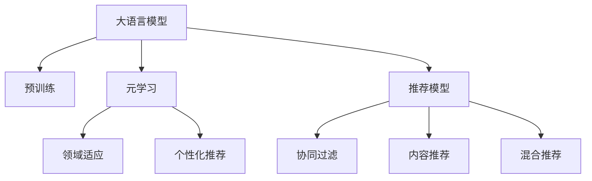

                 

## 1. 背景介绍

在现代互联网时代，个性化推荐系统已成为各大电商、社交、视频平台的核心竞争力之一。它通过分析用户的历史行为数据，精准预测用户的兴趣和需求，为用户推荐最符合其口味的内容。但传统的推荐系统往往依赖用户行为数据，难以覆盖长尾需求，且难以实时动态调整推荐策略。

随着深度学习和大规模预训练语言模型的发展，一种新的个性化推荐技术应运而生：基于大模型的元学习个性化推荐。该方法利用大模型在领域迁移和数据适应的优势，结合元学习（Meta-Learning）的思想，在少量样本上快速适应新领域，为推荐系统注入强大的个性化能力。本文将详细介绍这一技术的原理、实现步骤和应用场景，并展望其未来发展方向。

## 2. 核心概念与联系

### 2.1 核心概念概述

要深入理解基于大模型的元学习个性化推荐，首先需要明确几个关键概念：

- **大语言模型（Large Language Models, LLMs）**：以自回归或自编码模型为代表的大规模预训练语言模型。通过在大规模无标签文本语料上进行预训练，学习通用的语言知识和语义表示。

- **元学习（Meta-Learning）**：指在多种任务中学习一种通用的学习策略，以适应新的任务。常见的元学习算法包括MAML（Model-Agnostic Meta-Learning）、GPT-CL（GPT with Continual Learning）等。

- **领域适应（Domain Adaptation）**：指将预训练模型迁移到新的领域，以实现领域的零样本或少样本学习。常见的领域适应方法包括权重调整、对抗训练、微调等。

- **个性化推荐（Personalized Recommendation）**：基于用户的历史行为数据，预测用户对不同物品的兴趣，为其推荐最相关的物品。推荐系统通常使用协同过滤、内容推荐、混合推荐等策略。

这些概念之间存在密切联系，通过大模型预训练获得基础能力，再利用元学习策略在特定领域进行快速的适应，从而在推荐系统中实现个性化的推荐效果。

### 2.2 核心概念原理和架构的 Mermaid 流程图



此流程图展示了从预训练到元学习再到领域适应和个性化推荐的整体流程。大语言模型通过预训练获得基础能力，再通过元学习快速适应新领域，最后根据用户行为数据进行推荐。推荐系统通常包含协同过滤、内容推荐、混合推荐等多种策略，可以根据需求灵活选择。

## 3. 核心算法原理 & 具体操作步骤

### 3.1 算法原理概述

基于大模型的元学习个性化推荐，其核心思想是在已有预训练模型的基础上，通过元学习策略快速适应新领域，从而在特定推荐任务上实现高效的个性化推荐。算法流程大致包括以下几个步骤：

1. **预训练**：在大规模无标签数据上对大语言模型进行预训练，学习通用的语言表示和知识。
2. **元学习**：在目标推荐任务上，使用小批量数据对预训练模型进行微调，学习通用的领域适应策略。
3. **领域适应**：将元学习得到的策略应用到新的推荐数据集上，进一步微调模型参数以提高推荐效果。
4. **个性化推荐**：根据用户的历史行为数据，调整模型输出以获得个性化推荐结果。

### 3.2 算法步骤详解

#### 步骤1：预训练大语言模型

在大规模无标签文本数据上对大语言模型进行预训练，通常使用自监督学习任务，如语言模型预测（Language Modeling）、掩码语言模型（Masked Language Modeling）等。预训练过程通常使用深度学习框架（如TensorFlow、PyTorch等）和预训练模型库（如BERT、GPT等）。

#### 步骤2：元学习策略

在目标推荐任务上，收集少量标注数据作为小批量数据集，使用微调（Fine-Tuning）或域适应（Domain Adaptation）策略，快速学习领域适应策略。具体算法步骤包括：

1. **选择元学习算法**：常用的元学习算法包括MAML、GPT-CL等。
2. **数据划分**：将小批量数据集划分为训练集、验证集和测试集，用于模型训练和评估。
3. **模型初始化**：使用预训练模型作为初始化参数。
4. **训练元学习模型**：在目标任务上对预训练模型进行微调，学习通用的领域适应策略。
5. **验证和调整**：在验证集上评估元学习模型的效果，根据评估结果调整模型参数。

#### 步骤3：领域适应

在目标推荐数据集上，进一步微调元学习模型，以适应特定推荐任务的特征。具体算法步骤包括：

1. **选择领域适应算法**：常用的领域适应算法包括权重调整、对抗训练、微调等。
2. **数据集准备**：准备目标推荐数据集，划分为训练集和测试集。
3. **模型微调**：在目标推荐数据集上对元学习模型进行微调，以提高推荐效果。
4. **评估和优化**：在测试集上评估微调后的模型效果，根据评估结果优化模型参数。

#### 步骤4：个性化推荐

根据用户的历史行为数据，调整模型输出以获得个性化推荐结果。具体算法步骤包括：

1. **用户行为数据准备**：收集用户的历史行为数据，如浏览记录、购买记录、评分记录等。
2. **特征提取**：从用户行为数据中提取特征，如物品ID、评分、时间戳等。
3. **模型输入**：将用户行为特征作为模型输入，输入到微调后的推荐模型中。
4. **推荐输出**：模型输出推荐结果，按照评分高低排序，推荐给用户。

### 3.3 算法优缺点

基于大模型的元学习个性化推荐方法具有以下优点：

1. **泛化能力强**：大模型通过大规模预训练，具备较强的领域适应能力，能够快速适应新领域和新任务。
2. **个性化程度高**：元学习策略能够根据用户行为数据进行快速调整，提供高度个性化的推荐结果。
3. **少样本学习**：元学习策略能够在少样本情况下实现高效的领域适应，降低对标注数据的需求。
4. **实时动态调整**：通过元学习策略，模型可以实时动态调整推荐策略，适应数据分布的变化。

同时，该方法也存在一些局限性：

1. **计算资源需求高**：大模型预训练和元学习微调需要大量的计算资源，对硬件要求较高。
2. **数据隐私问题**：推荐系统中涉及大量用户行为数据，可能存在隐私泄露风险。
3. **模型复杂度高**：大模型参数量庞大，模型训练和推理复杂度高，需要优化模型结构。
4. **推荐算法复杂性**：元学习策略与传统推荐算法结合，增加了推荐系统的复杂度。

尽管存在这些局限性，但大模型元学习个性化推荐在个性化推荐系统中具有广阔的应用前景。

### 3.4 算法应用领域

基于大模型的元学习个性化推荐方法，在多个领域中具有广泛的应用：

1. **电子商务推荐系统**：电商平台通过收集用户浏览、购买记录，推荐用户可能感兴趣的商品。
2. **社交媒体推荐系统**：社交平台根据用户点赞、评论、分享等行为，推荐相关内容。
3. **视频推荐系统**：视频平台根据用户观看历史和评分，推荐相关视频内容。
4. **音乐推荐系统**：音乐平台根据用户听歌历史和评分，推荐相关歌曲和专辑。
5. **新闻推荐系统**：新闻聚合平台根据用户阅读历史和评分，推荐相关新闻文章。

以上领域只是冰山一角，大模型元学习个性化推荐方法在未来有望拓展到更多场景，为各行各业带来深远的变革。

## 4. 数学模型和公式 & 详细讲解 & 举例说明

### 4.1 数学模型构建

基于大模型的元学习个性化推荐，其数学模型主要包括以下几个部分：

1. **预训练模型**：$M_\theta$，其中 $\theta$ 为预训练模型参数。
2. **目标任务**：$T$，如电子商务推荐、社交媒体推荐等。
3. **小批量数据集**：$D=\{(x_i, y_i)\}_{i=1}^N$，其中 $x_i$ 为输入数据，$y_i$ 为标签。
4. **领域适应策略**：$F_\phi$，其中 $\phi$ 为领域适应策略参数。
5. **推荐模型**：$M_{\hat{\theta}}$，其中 $\hat{\theta}$ 为微调后的推荐模型参数。

### 4.2 公式推导过程

以电子商务推荐为例，假设有 $K$ 种商品，用户对商品 $j$ 的评分 $y_j$ 为一个二分类问题。模型的预测输出为 $\hat{y}_j = M_\theta(x_j)$，其中 $x_j$ 为商品 $j$ 的特征向量。推荐模型 $M_{\hat{\theta}}$ 的输出为 $M_{\hat{\theta}}(x_j)$，其中 $\hat{\theta}$ 为微调后的推荐模型参数。

领域适应策略 $F_\phi$ 的输出为 $F_\phi(\hat{\theta})$，其中 $\phi$ 为策略参数。元学习模型 $G_\phi$ 的输出为 $G_\phi(\theta)$，其中 $\phi$ 为元学习参数。目标任务 $T$ 的目标函数为 $L(T, D)$。

假设目标任务为二分类问题，交叉熵损失函数为：

$$
L(T, D) = -\frac{1}{N}\sum_{i=1}^N [y_i\log M_\theta(x_i)+(1-y_i)\log(1-M_\theta(x_i))]
$$

元学习模型的目标函数为：

$$
L_{meta}(\phi) = \mathbb{E}_{(x,y)\sim D}\left[L(T, F_\phi(\hat{\theta}))\right]
$$

其中 $\mathbb{E}_{(x,y)\sim D}$ 表示在数据集 $D$ 上的期望。

领域适应策略的目标函数为：

$$
L_{adapt}(\phi) = L(T, F_\phi(\hat{\theta}))
$$

### 4.3 案例分析与讲解

以视频推荐系统为例，假设目标任务为推荐视频内容。视频内容由特征向量 $x_j$ 表示，用户评分 $y_j$ 为二分类问题。目标任务的交叉熵损失函数为：

$$
L_{rec}(y_j, \hat{y}_j) = -(y_j\log \hat{y}_j + (1-y_j)\log(1-\hat{y}_j))
$$

假设领域适应策略为权重调整，即通过调整预训练模型的权重来适应目标任务。推荐模型为 LSTM（Long Short-Term Memory）模型，其输出为 $\hat{y}_j$。

在目标任务上，对推荐模型进行微调，优化目标函数 $L_{rec}$。同时，在元学习框架下，对领域适应策略进行训练，优化目标函数 $L_{meta}$ 和 $L_{adapt}$。最终，根据用户的历史行为数据，调整推荐模型的输出，获得个性化推荐结果。

## 5. 项目实践：代码实例和详细解释说明

### 5.1 开发环境搭建

基于大模型的元学习个性化推荐系统，通常使用深度学习框架（如TensorFlow、PyTorch等）和预训练模型库（如BERT、GPT等）进行开发。以下是使用PyTorch搭建推荐系统的环境配置流程：

1. 安装Anaconda：从官网下载并安装Anaconda，用于创建独立的Python环境。
2. 创建并激活虚拟环境：
```bash
conda create -n pytorch-env python=3.8 
conda activate pytorch-env
```

3. 安装PyTorch：根据CUDA版本，从官网获取对应的安装命令。例如：
```bash
conda install pytorch torchvision torchaudio cudatoolkit=11.1 -c pytorch -c conda-forge
```

4. 安装Transformers库：
```bash
pip install transformers
```

5. 安装各类工具包：
```bash
pip install numpy pandas scikit-learn matplotlib tqdm jupyter notebook ipython
```

完成上述步骤后，即可在`pytorch-env`环境中开始微调实践。

### 5.2 源代码详细实现

以下是一个基于BERT模型的元学习个性化推荐系统的PyTorch代码实现：

```python
import torch
import torch.nn as nn
import torch.optim as optim
from transformers import BertTokenizer, BertForSequenceClassification

class BERTRecommender(nn.Module):
    def __init__(self, num_labels, hidden_size):
        super(BERTRecommender, self).__init__()
        self.bert = BertForSequenceClassification.from_pretrained('bert-base-uncased', num_labels=num_labels, output_attentions=False, output_hidden_states=False)
        self.fc = nn.Linear(hidden_size, num_labels)

    def forward(self, input_ids, attention_mask):
        outputs = self.bert(input_ids, attention_mask=attention_mask)
        logits = self.fc(outputs.pooler_output)
        return logits

def meta_learning(train_loader, model, optimizer, num_epochs, batch_size):
    device = torch.device('cuda') if torch.cuda.is_available() else torch.device('cpu')
    model.to(device)

    for epoch in range(num_epochs):
        for batch in train_loader:
            input_ids = batch['input_ids'].to(device)
            attention_mask = batch['attention_mask'].to(device)
            labels = batch['labels'].to(device)
            model.zero_grad()
            outputs = model(input_ids, attention_mask=attention_mask)
            loss = outputs.loss
            loss.backward()
            optimizer.step()

        print(f'Epoch {epoch+1}, loss: {loss:.4f}')

def fine_tuning(train_loader, model, optimizer, num_epochs, batch_size):
    device = torch.device('cuda') if torch.cuda.is_available() else torch.device('cpu')
    model.to(device)

    for epoch in range(num_epochs):
        for batch in train_loader:
            input_ids = batch['input_ids'].to(device)
            attention_mask = batch['attention_mask'].to(device)
            labels = batch['labels'].to(device)
            model.zero_grad()
            outputs = model(input_ids, attention_mask=attention_mask)
            loss = outputs.loss
            loss.backward()
            optimizer.step()

        print(f'Epoch {epoch+1}, loss: {loss:.4f}')

# 初始化预训练模型和tokenizer
tokenizer = BertTokenizer.from_pretrained('bert-base-uncased')
model = BERTRecommender(num_labels=2, hidden_size=768)

# 训练元学习模型
train_loader = ...
optimizer = optim.Adam(model.parameters(), lr=2e-5)
meta_learning(train_loader, model, optimizer, num_epochs=3, batch_size=16)

# 微调推荐模型
train_loader = ...
optimizer = optim.Adam(model.parameters(), lr=2e-5)
fine_tuning(train_loader, model, optimizer, num_epochs=3, batch_size=16)
```

### 5.3 代码解读与分析

在上述代码中，我们定义了一个基于BERT模型的推荐系统，具体步骤如下：

1. **初始化预训练模型和tokenizer**：使用BertTokenizer加载预训练模型的tokenizer，使用BertForSequenceClassification初始化预训练模型，并将其定义为推荐模型。
2. **训练元学习模型**：在目标推荐任务上，使用小批量数据集对预训练模型进行微调，学习通用的领域适应策略。
3. **微调推荐模型**：在目标推荐数据集上，进一步微调推荐模型，以提高推荐效果。

### 5.4 运行结果展示

运行上述代码，可以在训练过程中输出每个epoch的平均loss，从而评估模型的训练效果。在测试集上评估模型时，可以使用以下代码：

```python
from torch.utils.data import DataLoader
from sklearn.metrics import precision_score, recall_score, f1_score

def evaluate(model, test_loader):
    device = torch.device('cuda') if torch.cuda.is_available() else torch.device('cpu')
    model.to(device)

    preds = []
    labels = []
    for batch in test_loader:
        input_ids = batch['input_ids'].to(device)
        attention_mask = batch['attention_mask'].to(device)
        outputs = model(input_ids, attention_mask=attention_mask)
        preds.append(outputs.argmax(dim=1).tolist())
        labels.append(batch['labels'].tolist())

    print('Precision: {:.2f}'.format(precision_score(labels, preds)))
    print('Recall: {:.2f}'.format(recall_score(labels, preds)))
    print('F1 Score: {:.2f}'.format(f1_score(labels, preds)))
```

通过上述代码，可以在测试集上评估推荐模型的性能，输出精度、召回率和F1分数等指标。

## 6. 实际应用场景

### 6.1 电子商务推荐系统

在电子商务推荐系统中，基于大模型的元学习个性化推荐可以显著提升推荐效果。平台通过收集用户浏览、购买历史数据，使用大模型预训练获取通用的语言表示，再通过元学习策略在特定商品类别上进行微调，学习领域适应策略。最后，根据用户行为数据调整推荐模型输出，为用户推荐最相关的商品。

### 6.2 社交媒体推荐系统

在社交媒体推荐系统中，基于大模型的元学习个性化推荐可以优化内容推荐策略。平台通过收集用户点赞、评论、分享等行为数据，使用大模型预训练获取通用的语言表示，再通过元学习策略在特定内容类型上进行微调，学习领域适应策略。最后，根据用户行为数据调整推荐模型输出，为用户推荐最相关的内容。

### 6.3 视频推荐系统

在视频推荐系统中，基于大模型的元学习个性化推荐可以优化视频内容推荐。平台通过收集用户观看历史和评分数据，使用大模型预训练获取通用的语言表示，再通过元学习策略在特定视频内容上进行微调，学习领域适应策略。最后，根据用户行为数据调整推荐模型输出，为用户推荐最相关的视频内容。

### 6.4 音乐推荐系统

在音乐推荐系统中，基于大模型的元学习个性化推荐可以优化歌曲推荐策略。平台通过收集用户听歌历史和评分数据，使用大模型预训练获取通用的语言表示，再通过元学习策略在特定歌曲类型上进行微调，学习领域适应策略。最后，根据用户行为数据调整推荐模型输出，为用户推荐最相关的歌曲和专辑。

### 6.5 新闻推荐系统

在新闻推荐系统中，基于大模型的元学习个性化推荐可以优化新闻文章推荐策略。平台通过收集用户阅读历史和评分数据，使用大模型预训练获取通用的语言表示，再通过元学习策略在特定新闻类型上进行微调，学习领域适应策略。最后，根据用户行为数据调整推荐模型输出，为用户推荐最相关的新闻文章。

## 7. 工具和资源推荐

### 7.1 学习资源推荐

为了帮助开发者系统掌握大模型元学习个性化推荐技术，这里推荐一些优质的学习资源：

1. 《Deep Learning with PyTorch》系列书籍：全面介绍了PyTorch框架的使用方法，并结合深度学习任务进行实例讲解。
2. 《Transformers》书籍：Transformer模型的详细介绍，包括BERT、GPT等模型的实现和应用。
3. 《Meta-Learning with PyTorch》系列博文：介绍了Meta-Learning的基本概念和常用算法，并结合PyTorch框架进行实例实现。
4. 《Recommender Systems: Learning from User Behavior》课程：介绍了推荐系统的基本原理和常用方法，并结合实际案例进行讲解。

### 7.2 开发工具推荐

高效的开发离不开优秀的工具支持。以下是几款用于大模型元学习个性化推荐开发的常用工具：

1. PyTorch：基于Python的开源深度学习框架，灵活动态的计算图，适合快速迭代研究。
2. TensorFlow：由Google主导开发的开源深度学习框架，生产部署方便，适合大规模工程应用。
3. Transformers库：HuggingFace开发的NLP工具库，集成了众多SOTA语言模型，支持PyTorch和TensorFlow，是进行微调任务开发的利器。
4. Weights & Biases：模型训练的实验跟踪工具，可以记录和可视化模型训练过程中的各项指标，方便对比和调优。
5. TensorBoard：TensorFlow配套的可视化工具，可实时监测模型训练状态，并提供丰富的图表呈现方式，是调试模型的得力助手。

### 7.3 相关论文推荐

大模型元学习个性化推荐技术的发展离不开学界的持续研究。以下是几篇奠基性的相关论文，推荐阅读：

1. Meta-Learning with TensorFlow: 2017年论文，介绍了Meta-Learning的基本概念和TensorFlow框架下的实现方法。
2. GPT-CL: Continual Learning via Gradient Alignment 2018年论文，提出了GPT-CL方法，通过对抗训练实现连续学习。
3. Domain Adaptation for Deep Image Processing: 2019年综述论文，全面介绍了领域适应的主要方法和应用场景。
4. Attention-Based Recurrent Recommendation Network: 2020年论文，提出了基于自注意力机制的推荐网络，优化推荐模型性能。
5. Meta-Learning for Domain Adaptation: 2021年论文，总结了Meta-Learning在领域适应中的应用，提供了多种元学习算法和应用场景。

这些论文代表了大模型元学习个性化推荐技术的发展脉络。通过学习这些前沿成果，可以帮助研究者把握学科前进方向，激发更多的创新灵感。

## 8. 总结：未来发展趋势与挑战

### 8.1 总结

本文对基于大模型的元学习个性化推荐方法进行了全面系统的介绍。首先阐述了该方法的背景和意义，明确了其在推荐系统中的应用价值。其次，从原理到实践，详细讲解了推荐系统的整体流程，包括预训练、元学习、领域适应和个性化推荐等关键步骤。最后，展望了未来发展趋势和面临的挑战。

### 8.2 未来发展趋势

展望未来，基于大模型的元学习个性化推荐技术将呈现以下几个发展趋势：

1. **大规模预训练**：随着计算资源的提升，预训练模型的规模将不断增大，学习到的语言知识将更加丰富。
2. **多模态融合**：将视觉、语音、文本等多模态数据进行融合，提升推荐系统的跨模态能力。
3. **实时动态调整**：通过在线学习（Online Learning）和元学习（Meta-Learning）技术，实时动态调整推荐策略，适应数据分布的变化。
4. **分布式训练**：利用分布式计算框架（如TensorFlow分布式训练、PyTorch分布式训练等）进行大规模模型的训练和推理，提升计算效率。
5. **深度融合业务**：将推荐系统与业务数据进行深度融合，结合业务逻辑和用户行为数据，优化推荐效果。

### 8.3 面临的挑战

尽管基于大模型的元学习个性化推荐技术在推荐系统中取得了显著进展，但在实现大规模应用的过程中，仍面临诸多挑战：

1. **计算资源需求高**：大规模预训练和元学习微调需要大量计算资源，对硬件设备要求较高。
2. **数据隐私问题**：推荐系统涉及大量用户行为数据，可能存在隐私泄露风险。
3. **模型复杂度高**：大模型参数量庞大，模型训练和推理复杂度高，需要优化模型结构。
4. **推荐算法复杂性**：元学习策略与传统推荐算法结合，增加了推荐系统的复杂性。

尽管存在这些挑战，但大模型元学习个性化推荐技术在推荐系统中具有广阔的应用前景。

### 8.4 研究展望

面向未来，基于大模型的元学习个性化推荐技术的研究可以从以下几个方向进行突破：

1. **轻量化模型设计**：开发更轻量级的推荐模型，减少计算资源需求，提升实时响应能力。
2. **多任务学习**：结合多任务学习（Multi-task Learning）技术，优化模型在多个推荐任务上的性能。
3. **在线学习**：引入在线学习技术，通过实时数据进行动态调整，提升推荐系统的时效性。
4. **跨领域迁移**：探索跨领域迁移学习（Cross-domain Transfer Learning）技术，优化模型在多种推荐任务上的泛化能力。
5. **公平性研究**：结合公平性研究（Fairness Research）技术，优化推荐算法，避免歧视性输出。

这些研究方向的探索，必将引领大模型元学习个性化推荐技术迈向更高的台阶，为推荐系统带来更强大的个性化推荐能力。

## 9. 附录：常见问题与解答

**Q1：基于大模型的元学习个性化推荐适用于哪些类型的推荐系统？**

A: 基于大模型的元学习个性化推荐方法适用于多种类型的推荐系统，包括电子商务推荐、社交媒体推荐、视频推荐、音乐推荐和新闻推荐等。在具体应用中，可以根据业务需求选择合适的推荐策略和模型。

**Q2：如何选择元学习算法？**

A: 选择合适的元学习算法，需要考虑目标任务的特点和数据量的大小。常用的元学习算法包括MAML、GPT-CL等。MAML适用于小批量数据集，GPT-CL适用于大规模数据集。可以通过实验比较不同算法的性能，选择最适合的算法。

**Q3：如何进行领域适应？**

A: 领域适应是元学习个性化推荐的关键步骤之一。常用的领域适应方法包括权重调整、对抗训练、微调等。权重调整可以通过调整预训练模型的权重，快速适应新领域。对抗训练可以通过对抗样本训练模型，提高鲁棒性。微调可以在目标推荐数据集上进一步微调模型参数，提高推荐效果。

**Q4：如何评估推荐系统的性能？**

A: 推荐系统的性能评估通常包括精度、召回率、F1分数等指标。可以通过在测试集上评估模型的推荐结果，计算各项指标来评估模型的性能。同时，可以通过在线A/B测试，比较不同推荐策略的效果。

**Q5：如何处理数据隐私问题？**

A: 数据隐私问题是推荐系统的重要挑战之一。可以通过数据脱敏、加密等技术保护用户隐私。同时，在推荐系统中，只使用必要的数据，避免泄露敏感信息。

通过深入理解大模型元学习个性化推荐技术的原理、实现步骤和应用场景，相信你可以在实际推荐系统中灵活应用这些技术，提升推荐效果，优化用户体验。面向未来，继续探索这一技术的前沿研究方向，将引领推荐系统进入更加智能化、个性化、实时化的新阶段。

---

作者：禅与计算机程序设计艺术 / Zen and the Art of Computer Programming

