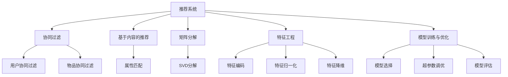

                 

# 推荐系统在电子商务中的应用：个性化购物体验

> 关键词：推荐系统, 电子商务, 个性化购物, 数据挖掘, 机器学习, 用户行为分析

## 1. 背景介绍

### 1.1 问题由来
在当今电子商务时代，个性化购物体验已经成为了用户选择商品的重要考量因素。传统的推荐系统多基于简单的协同过滤或基于内容的推荐方法，已经难以满足用户多样化的需求。为了提升用户体验，电商平台纷纷引入先进的推荐技术，以精细化的推荐模型对用户进行个性化服务。

推荐系统通过收集用户的浏览、点击、购买等行为数据，以及商品属性、交易记录等海量数据，利用先进的机器学习算法对用户行为进行分析，构建出准确的推荐模型，从而将高质量的商品推荐给用户。因此，推荐系统在提升用户满意度、促进用户转化率、提升销售业绩等方面发挥着至关重要的作用。

### 1.2 问题核心关键点
- 推荐算法原理：协同过滤、基于内容的推荐、矩阵分解等方法。
- 数据预处理：数据清洗、缺失值处理、归一化等。
- 特征工程：构造有效特征、降维处理等。
- 模型训练与优化：交叉验证、超参数调优、模型评估等。
- 推荐系统部署：构建推荐引擎、部署推荐服务等。
- 用户体验优化：A/B测试、行为跟踪、实时推荐等。

这些关键点构成了推荐系统在电子商务中的核心技术框架，并决定了其性能和效果。

### 1.3 问题研究意义
研究推荐系统在电子商务中的应用，对于提升电商平台的用户体验和业务价值，具有重要意义：

1. **提升用户满意度**：通过个性化推荐，满足用户的独特需求，提升用户的购买体验和满意度。
2. **优化转化率**：通过精准推荐，提高用户点击率和购买率，提升平台的转化率。
3. **增加销售额**：推荐系统能够有效挖掘用户的潜在购买需求，实现交叉销售和追加销售，增加平台的销售额。
4. **降低运营成本**：通过推荐系统，能够减少对昂贵广告的依赖，降低平台运营成本。
5. **数据驱动决策**：通过推荐算法，可以发现用户的行为模式和偏好，为电商平台的决策提供数据支持。

## 2. 核心概念与联系

### 2.1 核心概念概述

为更好地理解推荐系统在电子商务中的应用，本节将介绍几个密切相关的核心概念：

- **推荐系统(Recommendation System)**：利用数据挖掘、机器学习等技术，对用户行为进行分析，推荐符合用户兴趣的商品的系统。推荐系统可细分为协同过滤、基于内容的推荐、混合推荐等类型。
- **协同过滤(Collaborative Filtering)**：通过分析用户的历史行为数据，预测用户对其他商品的兴趣，从而进行推荐。协同过滤可分为基于用户的协同过滤和基于物品的协同过滤。
- **基于内容的推荐(Content-Based Recommendation)**：根据商品的属性信息，结合用户的历史浏览记录，推荐相似的商品。
- **矩阵分解(Matrix Factorization)**：通过将用户-商品评分矩阵分解为用户和商品因子矩阵，寻找用户和商品的潜在特征，进行推荐。
- **特征工程(Feature Engineering)**：根据电商平台的业务需求，从原始数据中提取有效特征，并对特征进行编码、归一化、降维等预处理。
- **模型训练与优化(Model Training and Optimization)**：包括模型选择、超参数调优、模型评估等步骤，目的是提升推荐模型的准确度和泛化能力。

这些核心概念之间的逻辑关系可以通过以下Mermaid流程图来展示：



这个流程图展示了一体化推荐系统的构建流程：

1. 推荐系统作为核心模块，依据用户历史行为数据进行推荐。
2. 协同过滤、基于内容的推荐、矩阵分解等技术作为推荐算法的实现方式。
3. 特征工程提取有效特征，并进行预处理。
4. 模型训练与优化确保模型准确度和泛化能力。

## 3. 核心算法原理 & 具体操作步骤
### 3.1 算法原理概述

电子商务中的推荐系统，其核心在于通过机器学习算法，预测用户对商品的兴趣，并进行精准推荐。推荐系统的基本框架可以表示为：

$$
\hat{y} = f(x)
$$

其中 $x$ 为用户行为数据，$y$ 为用户对商品兴趣的评分，$f$ 为推荐模型。推荐模型的目标是最大化预测准确率，即最大化 $y$ 和 $\hat{y}$ 的拟合度。

在电子商务中，常用的推荐算法包括协同过滤、基于内容的推荐和矩阵分解。协同过滤基于用户-商品评分矩阵，通过分析用户历史评分数据，预测用户对其他商品的兴趣。基于内容的推荐则根据商品属性信息，匹配用户的历史兴趣。矩阵分解通过将用户-商品评分矩阵分解为低维因子矩阵，寻找用户和商品的潜在特征，从而进行推荐。

### 3.2 算法步骤详解

推荐系统的构建流程一般包括以下几个关键步骤：

**Step 1: 数据收集与预处理**

1. **数据收集**：收集用户的行为数据，包括浏览记录、点击行为、购买记录等。同时收集商品的属性信息，如价格、分类、品牌等。
2. **数据清洗**：处理数据中的异常值、重复记录、缺失值等问题，确保数据的质量。
3. **数据归一化**：对数值型数据进行归一化处理，使不同特征之间的尺度一致。

**Step 2: 特征工程**

1. **特征提取**：从原始数据中提取有效的特征，如用户ID、商品ID、购买时间、商品价格等。
2. **特征编码**：将特征进行编码，例如将商品分类用one-hot编码表示。
3. **特征降维**：对高维特征进行降维处理，常用的方法包括PCA、LDA等。

**Step 3: 模型训练**

1. **模型选择**：选择合适的推荐算法，如协同过滤、基于内容的推荐、矩阵分解等。
2. **超参数调优**：调整模型超参数，如学习率、正则化系数等，以提升模型效果。
3. **模型评估**：使用交叉验证等方法评估模型的性能，常见的评估指标包括准确率、召回率、F1分数等。

**Step 4: 推荐引擎部署**

1. **构建推荐引擎**：将训练好的模型集成到推荐系统中。
2. **部署推荐服务**：将推荐引擎部署到服务器，供前端应用调用。

**Step 5: 用户体验优化**

1. **A/B测试**：通过对比不同推荐策略的效果，优化推荐算法。
2. **行为跟踪**：实时跟踪用户行为，更新推荐模型，提升推荐效果。
3. **实时推荐**：在用户实时浏览页面时，根据用户当前行为进行推荐，提升用户体验。

### 3.3 算法优缺点

推荐系统的优点在于：

1. **个性化推荐**：通过分析用户行为数据，提供精准的商品推荐，提升用户满意度。
2. **高效性**：推荐系统能够实时响应用户需求，快速调整推荐结果。
3. **可扩展性**：能够处理大规模数据，适应电商平台的业务需求。

同时，推荐系统也存在一些局限性：

1. **数据隐私**：用户行为数据的收集和分析可能涉及到隐私问题，需要严格的数据保护措施。
2. **模型复杂性**：推荐模型通常需要复杂的算法和大规模数据支持，开发和维护成本较高。
3. **冷启动问题**：对于新用户和新商品，推荐模型难以进行有效预测，需要额外的冷启动策略。
4. **动态变化**：用户行为和商品属性会随时间动态变化，需要定期更新推荐模型。

尽管存在这些局限性，推荐系统依然在电子商务领域发挥着不可替代的作用，推动着电商平台的发展。

### 3.4 算法应用领域

推荐系统在电子商务中的应用非常广泛，主要体现在以下几个方面：

- **商品推荐**：根据用户浏览和购买历史，推荐可能感兴趣的商品。
- **店铺推荐**：根据用户对店铺的偏好，推荐感兴趣的店铺。
- **活动推荐**：推荐平台上的促销活动、限时折扣等。
- **个性化展示**：根据用户行为数据，动态调整商品展示位置，提升点击率。
- **搜索优化**：推荐相关搜索结果，提升用户的搜索体验。

此外，推荐系统还被应用于跨领域推荐、内容推荐、广告推荐等多个领域，显著提升了用户对电商平台的粘性。

## 4. 数学模型和公式 & 详细讲解  
### 4.1 数学模型构建

推荐系统的核心在于建立一个精确的预测模型，以预测用户对商品的兴趣。假设用户对商品 $i$ 的评分 $r_{ui}$ 可以用以下模型表示：

$$
r_{ui} = f(x_u, x_i)
$$

其中 $x_u$ 为用户的行为特征向量，$x_i$ 为商品的属性特征向量，$f$ 为推荐模型。在推荐模型中，常见的模型有线性模型、决策树、神经网络等。

### 4.2 公式推导过程

以线性模型为例，推荐模型可以表示为：

$$
r_{ui} = \theta_u^T \phi_i + b
$$

其中 $\theta_u$ 为用户的特征向量，$\phi_i$ 为商品的特征向量，$b$ 为截距。

训练模型的目标是最小化预测值与真实值之间的平方误差，即：

$$
\min_{\theta_u, \theta_i, b} \frac{1}{n} \sum_{(u,i)} (r_{ui} - \hat{r}_{ui})^2
$$

其中 $n$ 为样本数量，$(u,i)$ 为用户-商品对。

通过梯度下降等优化算法，最小化损失函数，即可得到最优的模型参数。

### 4.3 案例分析与讲解

假设某电商平台收集了用户的历史浏览记录和商品的属性信息，进行协同过滤推荐。用户对商品 $i$ 的评分 $r_{ui}$ 可以根据用户和商品的历史评分数据进行预测。具体步骤如下：

1. **数据准备**：收集用户 $u$ 和商品 $i$ 的历史评分数据 $R$，构建用户-商品评分矩阵 $M$。
2. **相似度计算**：计算用户 $u$ 对商品 $i$ 的评分，需要找到与用户 $u$ 相似的其他用户 $u'$，计算相似度 $s(u,u')$。
3. **评分预测**：使用相似度 $s(u,u')$ 和用户 $u'$ 对商品 $i$ 的评分，预测用户 $u$ 对商品 $i$ 的评分 $r_{ui}$。
4. **推荐生成**：选择评分最高的若干商品推荐给用户 $u$。

## 5. 项目实践：代码实例和详细解释说明
### 5.1 开发环境搭建

在进行推荐系统实践前，我们需要准备好开发环境。以下是使用Python进行PyTorch开发的环境配置流程：

1. 安装Anaconda：从官网下载并安装Anaconda，用于创建独立的Python环境。

2. 创建并激活虚拟环境：
```bash
conda create -n recsys python=3.8 
conda activate recsys
```

3. 安装PyTorch：根据CUDA版本，从官网获取对应的安装命令。例如：
```bash
conda install pytorch torchvision torchaudio cudatoolkit=11.1 -c pytorch -c conda-forge
```

4. 安装Scikit-learn、Numpy、Pandas等工具包：
```bash
pip install scikit-learn numpy pandas
```

5. 安装推荐系统相关的库：
```bash
pip install recsys scikit-matrix factorization
```

完成上述步骤后，即可在`recsys`环境中开始推荐系统开发。

### 5.2 源代码详细实现

这里我们以协同过滤推荐系统为例，给出使用PyTorch进行推荐系统开发的PyTorch代码实现。

首先，定义协同过滤模型的类：

```python
import torch
import torch.nn as nn
from sklearn.metrics import mean_squared_error
from sklearn.metrics import r2_score

class CollaborativeFilteringModel(nn.Module):
    def __init__(self, num_users, num_items, num_factors=50, num_epochs=100, learning_rate=0.01):
        super(CollaborativeFilteringModel, self).__init__()
        self.num_users = num_users
        self.num_items = num_items
        self.num_factors = num_factors
        self.learning_rate = learning_rate
        
        self.user_factors = nn.Parameter(torch.randn(num_users, num_factors))
        self.item_factors = nn.Parameter(torch.randn(num_items, num_factors))
        
    def forward(self, user_idx, item_idx):
        user_factors = self.user_factors[user_idx]
        item_factors = self.item_factors[item_idx]
        
        pred_r = (user_factors * item_factors).sum(dim=1)
        
        return pred_r
    
    def predict(self, user_idx, item_idx):
        pred_r = self.forward(user_idx, item_idx)
        return pred_r
```

然后，定义数据处理函数：

```python
from sklearn.datasets import make_recommendation_data
from sklearn.model_selection import train_test_split
from sklearn.preprocessing import scale

def prepare_data(num_users=1000, num_items=1000, num_factors=50, num_epochs=100, learning_rate=0.01):
    # 生成模拟数据
    X, y, uids, iids = make_recommendation_data(n_samples=num_users*num_items, n_features=num_factors, random_state=42)
    
    # 标准化数据
    X = scale(X)
    X_train, X_test, y_train, y_test, uids_train, uids_test, iids_train, iids_test = train_test_split(X, y, uids, iids, test_size=0.2)
    
    # 构建用户-商品评分矩阵
    M_train = torch.tensor(X_train.dot(X_train.t()).to_dense()).float().to(device)
    M_test = torch.tensor(X_test.dot(X_test.t()).to_dense()).float().to(device)
    
    return M_train, M_test, uids_train, uids_test, iids_train, iids_test
```

接着，定义训练函数：

```python
def train_model(model, M_train, uids_train, iids_train, M_test, uids_test, iids_test, num_epochs=100, learning_rate=0.01):
    device = torch.device('cuda' if torch.cuda.is_available() else 'cpu')
    
    for epoch in range(num_epochs):
        model.train()
        for user_idx in range(model.num_users):
            for item_idx in range(model.num_items):
                pred_r = model.predict(user_idx, item_idx)
                loss = (pred_r - M_train[user_idx, item_idx]).pow(2).sum() / 2
                loss.backward()
                optimizer.step()
        print(f'Epoch {epoch+1}/{num_epochs}, training loss: {loss.item()}')
        
    print('Evaluation:')
    evaluation = mean_squared_error(M_test, model.predict(uids_test, iids_test))
    print(f'Mean Squared Error: {evaluation:.4f}')
    r2 = r2_score(M_test, model.predict(uids_test, iids_test))
    print(f'R-squared: {r2:.4f}')
```

最后，启动训练流程并在测试集上评估：

```python
M_train, M_test, uids_train, uids_test, iids_train, iids_test = prepare_data()

model = CollaborativeFilteringModel(num_users=1000, num_items=1000, num_factors=50, learning_rate=0.01)

optimizer = torch.optim.SGD(model.parameters(), lr=0.01)

train_model(model, M_train, uids_train, iids_train, M_test, uids_test, iids_test)
```

以上就是使用PyTorch对协同过滤推荐系统进行开发的完整代码实现。

### 5.3 代码解读与分析

让我们再详细解读一下关键代码的实现细节：

**CollaborativeFilteringModel类**：
- `__init__`方法：初始化模型参数，包括用户-商品因子矩阵。
- `forward`方法：进行前向传播，计算预测评分。
- `predict`方法：用于生成推荐结果。

**prepare_data函数**：
- `make_recommendation_data`：生成模拟数据，包括用户-商品评分矩阵。
- `train_test_split`：将数据集划分为训练集和测试集。
- `scale`：对数据进行标准化处理，以便模型训练。

**train_model函数**：
- 定义训练过程中的超参数，如epoch数、学习率等。
- 在每个epoch中，对用户-商品评分矩阵进行前向传播，计算损失并更新模型参数。
- 使用均方误差和R方值评估模型的性能。

**训练流程**：
- 定义总的epoch数和learning_rate，开始循环迭代
- 在每个epoch中，对用户-商品评分矩阵进行训练，并输出每个epoch的训练损失
- 在训练结束后，使用测试集评估模型的性能

可以看出，PyTorch和Scikit-learn等工具使得推荐系统开发的代码实现变得简洁高效。开发者可以将更多精力放在数据处理、模型改进等高层逻辑上，而不必过多关注底层的实现细节。

当然，工业级的系统实现还需考虑更多因素，如模型的保存和部署、超参数的自动搜索、更灵活的任务适配层等。但核心的推荐范式基本与此类似。

## 6. 实际应用场景
### 6.1 智能推荐引擎

智能推荐引擎是推荐系统在电子商务中最广泛的应用场景。通过分析用户的浏览、点击、购买等行为数据，智能推荐引擎能够精准预测用户对商品的需求，实时推荐符合用户兴趣的商品。推荐引擎通常部署在电商平台的后台，由数据流处理引擎进行实时计算，生成推荐结果，并在用户界面进行展示。

推荐引擎可以支持多种推荐策略，如协同过滤、基于内容的推荐、混合推荐等。通过灵活组合不同的推荐算法，可以最大化满足用户的个性化需求。例如，针对不同用户群体，采用不同的推荐策略，提升推荐的准确度和覆盖面。

### 6.2 个性化店铺推荐

个性化店铺推荐是推荐系统在电子商务中的另一个重要应用场景。电商平台上通常有多个店铺，不同店铺的商品种类和质量各不相同。通过分析用户的店铺浏览历史，推荐系统可以为用户推荐感兴趣的店铺。店铺推荐可以有效提升用户的购物体验，减少用户在不同店铺之间切换的时间和精力。

店铺推荐通常结合店铺属性、商品信息、用户行为等多种因素进行综合推荐。例如，对于经常光顾某品牌的用户，推荐系统可以优先推荐该品牌的店铺。

### 6.3 限时折扣活动推荐

限时折扣活动推荐是推荐系统在电子商务中的创新应用。通过分析用户的历史购买行为，推荐系统可以精准推荐用户感兴趣的商品折扣活动。例如，针对经常购买某类商品的用户，推荐系统可以优先推荐该类商品的折扣活动，提升用户的购买意愿和满意度。

折扣活动推荐需要结合用户的偏好和行为数据，进行精细化的推荐。例如，对于喜欢打折的用户，推荐系统可以优先推荐促销活动。

### 6.4 未来应用展望

随着推荐系统的不断发展，未来的应用场景将更加多样化和智能化：

1. **个性化购物助手**：通过自然语言交互，推荐系统可以为用户提供个性化的购物建议，提升购物体验。
2. **智能客服**：推荐系统可以结合智能客服技术，为顾客提供实时的咨询服务，提升用户满意度。
3. **跨平台推荐**：推荐系统可以跨平台进行推荐，提升用户在不同平台上的购物体验。
4. **大数据分析**：推荐系统可以结合大数据分析技术，发现用户的潜在需求，进行跨领域推荐，提升平台的业务价值。
5. **增强现实购物**：推荐系统可以结合增强现实技术，为用户推荐虚拟商品，提升用户体验。

## 7. 工具和资源推荐
### 7.1 学习资源推荐

为了帮助开发者系统掌握推荐系统的理论基础和实践技巧，这里推荐一些优质的学习资源：

1. 《推荐系统实战》书籍：详细介绍了推荐系统的原理、算法、评估等基础知识，适合入门和进阶读者。
2. 《深度学习》课程：由斯坦福大学开设的深度学习课程，涵盖了深度学习的基础和应用，包括推荐系统等。
3. Kaggle竞赛：Kaggle提供了多个推荐系统竞赛，通过实战练习，可以提升推荐系统的开发和优化能力。
4. Google Scholar：学术界的研究论文，提供丰富的推荐系统相关的文献和算法。
5. GitHub开源项目：推荐的开源推荐系统项目，可以帮助开发者快速了解推荐系统的实现细节。

通过对这些资源的学习实践，相信你一定能够快速掌握推荐系统的精髓，并用于解决实际的电子商务问题。

### 7.2 开发工具推荐

高效的开发离不开优秀的工具支持。以下是几款用于推荐系统开发的常用工具：

1. PyTorch：基于Python的开源深度学习框架，灵活的动态计算图，适合深度学习模型的开发和优化。
2. TensorFlow：由Google主导开发的开源深度学习框架，易于部署和扩展，适合大规模工程应用。
3. Scikit-learn：基于Python的机器学习库，提供了丰富的算法和工具，支持推荐系统的开发和优化。
4. Weights & Biases：模型训练的实验跟踪工具，可以记录和可视化模型训练过程中的各项指标，方便对比和调优。
5. TensorBoard：TensorFlow配套的可视化工具，可实时监测模型训练状态，并提供丰富的图表呈现方式。

合理利用这些工具，可以显著提升推荐系统的开发效率，加快创新迭代的步伐。

### 7.3 相关论文推荐

推荐系统的发展离不开学界的持续研究。以下是几篇奠基性的相关论文，推荐阅读：

1. Probabilistic Matrix Factorization Techniques and Application to Recommendation Systems：提出基于概率矩阵分解的推荐系统算法。
2. A Collaborative Filtering Algorithm for Recommendation System：提出基于协同过滤的推荐算法。
3. Fast Matrix Factorization Techniques for Recommendation Systems：介绍矩阵分解算法的优化方法。
4. A Probabilistic Latent Factor Model for Recommender Systems：提出基于概率模型推荐系统算法。
5. Context-aware Recommender Systems：提出结合上下文信息的推荐系统算法。

这些论文代表了大推荐系统的发展脉络。通过学习这些前沿成果，可以帮助研究者把握学科前进方向，激发更多的创新灵感。

## 8. 总结：未来发展趋势与挑战

### 8.1 总结

本文对推荐系统在电子商务中的应用进行了全面系统的介绍。首先阐述了推荐系统的背景和意义，明确了推荐系统在提升用户体验和业务价值方面的独特价值。其次，从原理到实践，详细讲解了推荐系统的构建流程和算法细节，给出了推荐系统开发的完整代码实现。同时，本文还广泛探讨了推荐系统在个性化购物、店铺推荐、限时折扣活动等多个领域的应用前景，展示了推荐系统的广泛应用。此外，本文精选了推荐系统的学习资源、开发工具和相关论文，力求为开发者提供全方位的技术指引。

通过本文的系统梳理，可以看到，推荐系统在电子商务领域具有广泛的应用前景和重要价值。未来的推荐系统将更加个性化、智能化，能够为用户提供更加精准、优质的购物体验。

### 8.2 未来发展趋势

推荐系统的未来发展趋势可以归纳为以下几点：

1. **深度学习技术的融合**：结合深度学习技术，提升推荐模型的精度和泛化能力，支持更为复杂的推荐场景。
2. **跨领域推荐**：结合多源数据，实现跨领域推荐，提升推荐系统的覆盖面和效果。
3. **实时推荐**：实现实时推荐引擎，提升用户体验和平台竞争力。
4. **个性化购物助手**：结合自然语言处理技术，开发个性化购物助手，提升购物体验。
5. **跨平台推荐**：实现跨平台推荐，提升用户在不同平台上的购物体验。
6. **增强现实购物**：结合增强现实技术，提升用户的购物体验。

以上趋势凸显了推荐系统的广阔前景。这些方向的探索发展，必将进一步提升推荐系统的性能和效果，推动电子商务的发展。

### 8.3 面临的挑战

尽管推荐系统已经取得了显著的成就，但在向更加智能化、个性化、实时化方向发展的过程中，仍面临着诸多挑战：

1. **数据隐私问题**：用户行为数据的收集和分析可能涉及到隐私问题，需要严格的数据保护措施。
2. **模型复杂性**：推荐模型通常需要复杂的算法和大规模数据支持，开发和维护成本较高。
3. **冷启动问题**：对于新用户和新商品，推荐模型难以进行有效预测，需要额外的冷启动策略。
4. **动态变化**：用户行为和商品属性会随时间动态变化，需要定期更新推荐模型。
5. **计算资源消耗**：推荐系统的实时推荐和实时训练需要大量的计算资源，可能对性能和成本造成影响。

尽管存在这些挑战，未来的推荐系统仍有很大的发展空间，亟需学术界和产业界的共同努力。

### 8.4 研究展望

面对推荐系统所面临的种种挑战，未来的研究需要在以下几个方面寻求新的突破：

1. **数据隐私保护**：通过差分隐私、联邦学习等技术，保护用户隐私，增强用户信任。
2. **模型优化**：结合稀疏矩阵分解、神经网络等技术，优化推荐算法，降低计算资源消耗。
3. **冷启动策略**：结合协同过滤、深度学习等技术，解决冷启动问题，提升新用户和商品的表现。
4. **动态推荐**：结合增量学习、在线学习等技术，实现动态推荐，提升推荐系统的实时性和准确性。
5. **多源数据融合**：结合多源数据，提升推荐系统的覆盖面和效果，实现跨领域推荐。

这些研究方向的探索，必将引领推荐系统走向更加智能化、个性化、实时化的方向，为电子商务的发展提供更加强大的技术支撑。

## 9. 附录：常见问题与解答

**Q1：推荐系统是否适用于所有电商平台？**

A: 推荐系统在多数电商平台中都能取得不错的效果，但对于一些特定领域或特殊类型的电商平台，可能需要进行定制化开发。例如，针对B2B平台，推荐系统的算法需要考虑更复杂的企业行为数据。

**Q2：推荐系统的实时性如何保证？**

A: 推荐系统的实时性需要依赖高效的计算引擎和缓存机制。通常采用流处理技术，对实时数据进行增量处理，同时使用缓存机制，提高查询效率。例如，Spark Streaming、Flink等流处理框架可以支持实时推荐引擎的构建。

**Q3：推荐系统的业务场景有哪些？**

A: 推荐系统在电子商务中的业务场景非常多样，包括商品推荐、店铺推荐、限时折扣活动推荐、个性化展示等。同时，推荐系统还被广泛应用于音乐、电影、新闻、广告等多个领域。

**Q4：推荐系统如何进行评估？**

A: 推荐系统的评估可以从多个维度进行，如准确率、召回率、F1分数、R方值等。常用的评估方法包括A/B测试、交叉验证、均方误差等。

**Q5：推荐系统的数据来源有哪些？**

A: 推荐系统的数据来源包括用户的浏览记录、点击行为、购买记录等行为数据，以及商品的属性信息、交易记录等。通常需要构建用户-商品评分矩阵，用于模型训练和预测。

通过本文的系统梳理，可以看到，推荐系统在电子商务中具有广泛的应用前景和重要价值。未来的推荐系统将更加个性化、智能化，能够为用户提供更加精准、优质的购物体验。

---

作者：禅与计算机程序设计艺术 / Zen and the Art of Computer Programming

