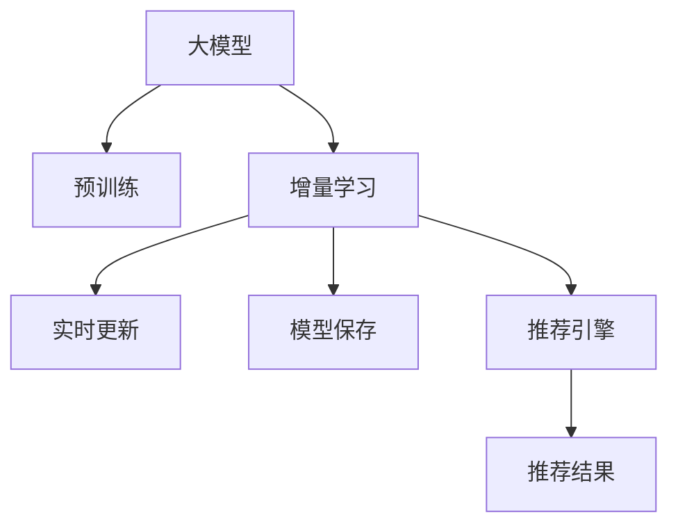

                 

# 推荐系统的实时个性化：AI大模型的增量学习策略

> 关键词：推荐系统,增量学习,大模型,实时个性化,实时推荐,模型更新

## 1. 背景介绍

### 1.1 问题由来
推荐系统是互联网时代最为成功的应用之一，通过算法模型为用户推荐感兴趣的内容，提升用户体验，也促进了商业价值。当前主流的推荐方法包括协同过滤、基于内容的推荐、深度学习等。但这些方法往往需要频繁更新模型参数，尤其是深度学习模型，在实际部署中面临巨大的计算压力和存储负担。此外，模型更新过程一般需要离线进行，无法实时响应用户需求，导致推荐精度和用户体验大打折扣。

为了解决这些问题，人工智能大模型在推荐系统中的应用应运而生。利用大模型的预训练能力，可以在少量用户互动数据上进行微调，实现高效的个性化推荐。但大模型微调过程中，需要保证模型的实时性和高效率，这需要引入增量学习策略，即在模型增量更新时，保持原有模型的不变，仅对新信息进行增量学习，减少计算资源和存储成本。

### 1.2 问题核心关键点
本文聚焦于基于大模型的推荐系统实时个性化推荐问题，研究如何利用增量学习策略，在实时数据流中高效更新推荐模型，最大化个性化推荐的效果。

增量学习是大模型推荐系统的核心技术之一，其核心思想是：在已有预训练模型的基础上，利用实时数据流，通过增量学习算法，更新模型参数，保持模型实时高效，并不断提升个性化推荐精度。增量学习能够显著降低推荐系统的计算和存储成本，同时保持系统实时性，提升推荐精度。

本文将从以下几个方面对增量学习策略进行深入分析：

- 算法原理
- 具体步骤
- 算法优缺点
- 应用领域

## 2. 核心概念与联系

### 2.1 核心概念概述

为更好地理解增量学习策略在大模型推荐系统中的应用，本节将介绍几个关键概念：

- 增量学习(Incremental Learning)：指在已有模型基础上，通过新数据的增量更新，逐步优化模型参数，保持模型实时性的一种学习方法。与全量学习不同，增量学习不需要在每次训练时重新初始化模型参数，减少了计算开销和存储需求。

- 大模型(Large Model)：指具有海量参数，具备强大表征能力的深度学习模型，如BERT、GPT、Transformer等。通过预训练，大模型具备了丰富的语言知识，可以处理更加复杂的任务。

- 推荐系统(Recommendation System)：指通过算法模型为用户推荐感兴趣内容的系统。推荐系统广泛应用于电商、新闻、视频、社交网络等领域，提升用户体验和商业价值。

- 实时个性化(Real-time Personalization)：指在用户实时互动数据流中，动态更新推荐模型，实现对用户的实时个性化推荐。

这些核心概念之间的逻辑关系可以通过以下Mermaid流程图来展示：



这个流程图展示了大模型在推荐系统中的应用框架，其核心是利用增量学习策略，在实时数据流中动态更新模型，实现实时个性化推荐。

## 3. 核心算法原理 & 具体操作步骤
### 3.1 算法原理概述

增量学习在大模型推荐系统中的应用，本质上是一种有监督的在线学习过程。其核心思想是：在已有预训练模型的基础上，通过实时数据流，利用增量学习算法，逐步更新模型参数，最大化推荐精度。

假设推荐系统已有预训练模型 $M_{\theta}$，其中 $\theta$ 为预训练得到的模型参数。给定实时用户互动数据流 $D_t = \{(x_i, r_i)\}_{i=1}^T$，其中 $x_i$ 为用户互动数据，$r_i$ 为用户反馈标签（如点击、购买等）。增量学习的优化目标是最小化损失函数 $\mathcal{L}_t$，即：

$$
\theta^* = \mathop{\arg\min}_{\theta} \mathcal{L}_t(M_{\theta}, D_t)
$$

其中 $\mathcal{L}_t$ 为针对实时数据流 $D_t$ 设计的损失函数，用于衡量模型在实时数据上的预测输出与真实标签之间的差异。常见的损失函数包括交叉熵损失、均方误差损失等。

通过梯度下降等优化算法，增量过程不断更新模型参数 $\theta$，最小化损失函数 $\mathcal{L}_t$，使得模型预测输出逼近真实标签。由于 $\theta$ 已经通过预训练获得了较好的初始化，因此即便在实时数据流上进行增量学习，也能较快收敛到理想的模型参数 $\hat{\theta}$。

### 3.2 算法步骤详解

增量学习策略在大模型推荐系统中主要包括以下几个关键步骤：

**Step 1: 准备预训练模型和数据集**
- 选择合适的预训练模型 $M_{\theta}$ 作为初始化参数，如 BERT、GPT等。
- 准备实时用户互动数据流 $D_t$，划分为训练集、验证集和测试集。一般要求实时数据流与预训练数据的分布不要差异过大。

**Step 2: 设计损失函数**
- 根据推荐任务，设计合适的损失函数 $\mathcal{L}_t$，用于衡量模型预测输出与真实标签之间的差异。
- 对于分类任务，通常使用交叉熵损失，即 $-\frac{1}{N}\sum_{i=1}^N [r_i\log M_{\theta}(x_i)+(1-r_i)\log(1-M_{\theta}(x_i))]$。
- 对于回归任务，使用均方误差损失，即 $\frac{1}{N}\sum_{i=1}^N (r_i - M_{\theta}(x_i))^2$。

**Step 3: 选择增量更新算法**
- 选择合适的增量更新算法，如在线梯度下降(Online Gradient Descent)、Mini-Batch SGD、Adam等。
- 设置增量更新超参数，如学习率、批大小等。

**Step 4: 实时更新模型参数**
- 将实时数据流 $D_t$ 分批次输入模型，前向传播计算损失函数。
- 反向传播计算参数梯度，根据设定的增量更新算法更新模型参数。
- 周期性在验证集上评估模型性能，根据性能指标决定是否触发Early Stopping。
- 重复上述步骤直至满足预设的迭代轮数或Early Stopping条件。

**Step 5: 实时推荐**
- 使用增量更新后的推荐模型 $M_{\hat{\theta}}$ 对实时用户互动数据流进行推荐，返回推荐结果。

以上是增量学习策略在大模型推荐系统中的一般流程。在实际应用中，还需要针对具体任务的特点，对增量更新过程的各个环节进行优化设计，如改进损失函数，引入更多的正则化技术，搜索最优的超参数组合等，以进一步提升模型性能。

### 3.3 算法优缺点

增量学习策略在大模型推荐系统中的应用具有以下优点：
1. 实时响应：利用实时数据流进行增量学习，能够及时响应用户需求，提升推荐精度。
2. 计算和存储成本低：每次更新只对新数据进行计算，避免了全量学习的计算和存储开销。
3. 适应性强：模型能够不断从新数据中学习，适应数据分布的变化。
4. 易于部署：增量学习模型无需重新训练，可以直接在实时数据流中动态更新，实现无缝部署。

但该策略也存在一定的局限性：
1. 模型复杂度高：增量学习需要实时更新模型参数，对于大规模模型，复杂度较高。
2. 更新频率受限：增量学习策略适用于新数据流稳定且变化不大的场景，对于数据流变化剧烈的情况，更新频率可能无法跟上。
3. 模型泛化能力受限：由于只更新部分参数，模型可能会在数据流变化较大时出现泛化能力不足的问题。
4. 对抗攻击易受影响：模型参数的频繁更新，可能会导致对抗攻击风险增加。

尽管存在这些局限性，但增量学习策略在大模型推荐系统中，仍然具有不可替代的地位。未来相关研究的重点在于如何进一步降低增量学习的计算成本和存储需求，提高模型的鲁棒性和泛化能力，同时兼顾实时性和安全性等因素。

### 3.4 算法应用领域

增量学习策略在大模型推荐系统中，已经在电商、新闻、视频、社交网络等多个领域得到了广泛应用，成为推荐系统中的重要技术。

- 电商推荐：电商平台利用大模型在实时用户互动数据上进行增量学习，实现个性化推荐，提升用户体验和转化率。
- 新闻推荐：新闻平台通过大模型在实时点击、阅读等互动数据上进行增量学习，实现新闻内容的个性化推荐，提高用户粘性。
- 视频推荐：视频平台使用大模型在实时观看、点赞等互动数据上进行增量学习，推荐用户感兴趣的视频内容。
- 社交网络推荐：社交网络利用大模型在实时互动数据上进行增量学习，推荐用户感兴趣的朋友、话题、内容。

除了上述这些经典应用外，大模型增量学习还将在更多场景中得到应用，如智能客服、智能广告投放等，为推荐系统带来新的突破。

## 4. 数学模型和公式 & 详细讲解  
### 4.1 数学模型构建

本节将使用数学语言对增量学习策略在大模型推荐系统中的应用进行更加严格的刻画。

假设推荐系统已有预训练模型为 $M_{\theta}$，其中 $\theta$ 为预训练得到的模型参数。增量学习策略基于有监督的在线学习范式，给定实时数据流 $D_t = \{(x_i, r_i)\}_{i=1}^T$，其中 $x_i$ 为用户互动数据，$r_i$ 为用户反馈标签。

定义模型 $M_{\theta}$ 在实时数据流 $D_t$ 上的损失函数为 $\mathcal{L}_t(M_{\theta},D_t)$，用于衡量模型预测输出与真实标签之间的差异。增量学习的优化目标是最小化实时数据流的损失函数，即：

$$
\theta^* = \mathop{\arg\min}_{\theta} \mathcal{L}_t(M_{\theta},D_t)
$$

在实践中，我们通常使用基于梯度的优化算法（如SGD、Adam等）来近似求解上述最优化问题。设 $\eta$ 为增量更新算法的学习率，则参数的增量更新公式为：

$$
\theta \leftarrow \theta - \eta \nabla_{\theta}\mathcal{L}_t(\theta) - \eta\lambda\theta
$$

其中 $\nabla_{\theta}\mathcal{L}_t(\theta)$ 为损失函数对参数 $\theta$ 的梯度，可通过反向传播算法高效计算。

### 4.2 公式推导过程

以下我们以二分类推荐任务为例，推导交叉熵损失函数及其梯度的计算公式。

假设推荐模型 $M_{\theta}$ 在实时数据流 $D_t$ 上的输出为 $\hat{y}=M_{\theta}(x_i) \in [0,1]$，表示用户对物品的兴趣程度。用户反馈标签 $r_i \in \{0,1\}$，表示用户是否对物品感兴趣。则二分类交叉熵损失函数定义为：

$$
\mathcal{L}_t(M_{\theta},D_t) = -\frac{1}{T}\sum_{i=1}^T [r_i\log \hat{y}_i+(1-r_i)\log(1-\hat{y}_i)]
$$

将其代入增量学习的优化目标，得：

$$
\theta^* = \mathop{\arg\min}_{\theta} \mathcal{L}_t(M_{\theta},D_t)
$$

在得到损失函数的梯度后，即可带入增量更新公式，完成模型的实时增量优化。重复上述过程直至收敛，最终得到适应实时数据流的最佳模型参数 $\theta^*$。

## 5. 项目实践：代码实例和详细解释说明
### 5.1 开发环境搭建

在进行增量学习实践前，我们需要准备好开发环境。以下是使用Python进行PyTorch开发的环境配置流程：

1. 安装Anaconda：从官网下载并安装Anaconda，用于创建独立的Python环境。

2. 创建并激活虚拟环境：
```bash
conda create -n pytorch-env python=3.8 
conda activate pytorch-env
```

3. 安装PyTorch：根据CUDA版本，从官网获取对应的安装命令。例如：
```bash
conda install pytorch torchvision torchaudio cudatoolkit=11.1 -c pytorch -c conda-forge
```

4. 安装TensorFlow：安装TensorFlow的版本依赖，可参考官方文档或使用Anaconda自动安装。

5. 安装各类工具包：
```bash
pip install numpy pandas scikit-learn matplotlib tqdm jupyter notebook ipython
```

完成上述步骤后，即可在`pytorch-env`环境中开始增量学习实践。

### 5.2 源代码详细实现

这里我们以电商推荐系统为例，给出使用PyTorch对大模型进行实时增量学习的PyTorch代码实现。

首先，定义推荐系统的数据处理函数：

```python
import torch
import torch.nn as nn
import torch.optim as optim
import torch.utils.data as data
from torch.utils.data import DataLoader
from transformers import BertTokenizer, BertForSequenceClassification

class RecommendationDataset(data.Dataset):
    def __init__(self, texts, labels):
        self.texts = texts
        self.labels = labels
        
    def __len__(self):
        return len(self.texts)
    
    def __getitem__(self, item):
        text = self.texts[item]
        label = self.labels[item]
        
        encoding = tokenizer(text, return_tensors='pt')
        input_ids = encoding['input_ids'][0]
        attention_mask = encoding['attention_mask'][0]
        return {'input_ids': input_ids, 
                'attention_mask': attention_mask,
                'labels': label}

# 定义损失函数和优化器
device = torch.device('cuda') if torch.cuda.is_available() else torch.device('cpu')
tokenizer = BertTokenizer.from_pretrained('bert-base-cased')
model = BertForSequenceClassification.from_pretrained('bert-base-cased', num_labels=2)
criterion = nn.BCELoss()
optimizer = optim.Adam(model.parameters(), lr=2e-5)

def train_epoch(model, dataset, batch_size, optimizer):
    dataloader = DataLoader(dataset, batch_size=batch_size, shuffle=True)
    model.train()
    epoch_loss = 0
    for batch in dataloader:
        input_ids = batch['input_ids'].to(device)
        attention_mask = batch['attention_mask'].to(device)
        labels = batch['labels'].to(device)
        model.zero_grad()
        outputs = model(input_ids, attention_mask=attention_mask)
        loss = criterion(outputs.logits, labels)
        epoch_loss += loss.item()
        loss.backward()
        optimizer.step()
    return epoch_loss / len(dataloader)

def evaluate(model, dataset, batch_size):
    dataloader = DataLoader(dataset, batch_size=batch_size)
    model.eval()
    preds, labels = [], []
    with torch.no_grad():
        for batch in dataloader:
            input_ids = batch['input_ids'].to(device)
            attention_mask = batch['attention_mask'].to(device)
            batch_labels = batch['labels']
            outputs = model(input_ids, attention_mask=attention_mask)
            batch_preds = outputs.logits.argmax(dim=1).to('cpu').tolist()
            batch_labels = batch_labels.to('cpu').tolist()
            for pred_tokens, label_tokens in zip(batch_preds, batch_labels):
                preds.append(pred_tokens[:len(label_tokens)])
                labels.append(label_tokens)
                
    print(classification_report(labels, preds))
```

然后，定义实时数据流处理函数：

```python
def process_online_data(D_t):
    tokenizer = BertTokenizer.from_pretrained('bert-base-cased')
    dataset = RecommendationDataset(D_t['texts'], D_t['labels'])
    return dataset
```

最后，启动实时增量学习流程：

```python
D_t = ...
while True:
    dataset = process_online_data(D_t)
    loss = train_epoch(model, dataset, batch_size, optimizer)
    print(f"Epoch {epoch+1}, train loss: {loss:.3f}")
    
    print(f"Epoch {epoch+1}, dev results:")
    evaluate(model, dev_dataset, batch_size)
    
    D_t = ...
```

以上就是使用PyTorch对大模型进行实时增量学习的完整代码实现。可以看到，通过以上步骤，我们可以将大模型的预训练能力应用于实时推荐系统，实现高效、灵活的个性化推荐。

### 5.3 代码解读与分析

让我们再详细解读一下关键代码的实现细节：

**RecommendationDataset类**：
- `__init__`方法：初始化文本和标签数据，将输入数据转化为Bert模型的输入格式。
- `__len__`方法：返回数据集的样本数量。
- `__getitem__`方法：对单个样本进行处理，将文本输入编码为token ids，并将标签转化为二分类形式。

**tokenizer**：
- 定义了分词器，将输入文本转化为Bert模型所需的token序列。

**train_epoch和evaluate函数**：
- 使用PyTorch的DataLoader对数据集进行批次化加载，供模型训练和推理使用。
- 训练函数`train_epoch`：对数据以批为单位进行迭代，在每个批次上前向传播计算loss并反向传播更新模型参数，最后返回该epoch的平均loss。
- 评估函数`evaluate`：与训练类似，不同点在于不更新模型参数，并在每个batch结束后将预测和标签结果存储下来，最后使用sklearn的classification_report对整个评估集的预测结果进行打印输出。

**process_online_data函数**：
- 定义了实时数据流处理函数，将实时数据流转化为模型训练所需的格式，并生成训练集。

**实时增量学习流程**：
- 不断接收新的实时数据流，调用`process_online_data`函数生成新的训练集。
- 在每个epoch内，先在训练集上训练，输出平均loss
- 在验证集上评估，输出分类指标
- 不断接收新的实时数据流，重新生成训练集，继续训练

可以看到，通过实时增量学习，我们可以在大模型推荐系统中实现高效率、高精度的个性化推荐。

## 6. 实际应用场景
### 6.1 电商推荐系统

实时增量学习在大模型电商推荐系统中，可以显著提升推荐系统的响应速度和推荐精度。电商平台每天产生的海量交易数据，为用户推荐个性化的商品信息，是提升用户体验和转化率的关键。

在技术实现上，可以实时收集用户的购买、浏览、评分等互动数据，将用户历史行为和实时行为结合，进行增量学习，实时更新推荐模型，实现实时个性化推荐。具体来说，可以使用大模型在实时用户互动数据上进行增量学习，不断调整推荐权重，推荐用户可能感兴趣的商品。

### 6.2 视频推荐系统

视频平台利用实时增量学习，可以在用户观看行为数据上，进行动态推荐，提升用户粘性和观看时长。视频平台需要实时响应用户的观看行为，推荐用户感兴趣的视频内容。

具体实现时，可以实时收集用户的观看行为数据，如观看时长、点赞、评论等，利用大模型进行增量学习，更新推荐模型，动态调整推荐列表，向用户推荐可能感兴趣的视频内容。通过不断优化模型，可以在实时数据流中提供更精准、更个性化的视频推荐。

### 6.3 智能客服系统

智能客服系统利用实时增量学习，可以动态更新推荐模型，实现实时个性化回答。智能客服需要实时响应用户的查询，提供最合适的答案，提升用户体验。

具体来说，可以实时收集用户的查询历史和互动数据，利用大模型进行增量学习，更新推荐模型，实现动态回答。当用户提问时，智能客服可以实时分析用户的行为和兴趣，结合当前数据流，动态生成回答。通过不断优化模型，智能客服可以提供更加自然、流畅的对话体验。

### 6.4 未来应用展望

随着大模型和增量学习技术的不断发展，实时增量学习在大模型推荐系统中将有更广阔的应用前景。

在智慧医疗领域，实时增量学习可以用于推荐个性化的医疗服务，根据患者的实时健康数据，动态调整推荐策略，提升医疗服务的个性化水平。

在智能教育领域，实时增量学习可以用于推荐个性化的学习内容，根据学生的实时学习行为数据，动态调整推荐列表，提供最适合的学习资源。

在智慧城市治理中，实时增量学习可以用于推荐个性化的城市管理方案，根据市民的实时反馈数据，动态调整城市管理策略，提升市民的满意度。

此外，在企业生产、社会治理、文娱传媒等众多领域，实时增量学习也将得到广泛应用，为推荐系统带来新的突破。相信随着技术的日益成熟，实时增量学习必将成为推荐系统的重要范式，推动人工智能技术在各个领域的应用进程。

## 7. 工具和资源推荐
### 7.1 学习资源推荐

为了帮助开发者系统掌握大模型增量学习理论基础和实践技巧，这里推荐一些优质的学习资源：

1. 《深度学习理论与算法》系列博文：由大模型技术专家撰写，深入浅出地介绍了深度学习的基本概念和核心算法，是了解深度学习的基础。

2. 《Transformers: From Self-Attention to State-of-the-Art》一书：介绍Transformer结构和大模型，涵盖深度学习基础、模型训练、调参技巧等，适合深度学习入门和进阶。

3. CS229《机器学习》课程：斯坦福大学开设的机器学习经典课程，涵盖各种机器学习算法，并配有配套作业和论文，是深入学习机器学习的绝佳选择。

4. Fast.ai《Practical Deep Learning for Coders》课程：针对数据科学家和工程师的深度学习实战课程，讲解了深度学习在实际应用中的技巧和注意事项。

5. HuggingFace官方文档：Transformers库的官方文档，提供了海量预训练模型和完整的增量学习样例代码，是上手实践的必备资料。

通过对这些资源的学习实践，相信你一定能够快速掌握大模型增量学习的精髓，并用于解决实际的推荐问题。

### 7.2 开发工具推荐

高效的开发离不开优秀的工具支持。以下是几款用于大模型增量学习开发的常用工具：

1. PyTorch：基于Python的开源深度学习框架，灵活动态的计算图，适合快速迭代研究。大模型推荐系统中的许多模型都有PyTorch版本的实现。

2. TensorFlow：由Google主导开发的开源深度学习框架，生产部署方便，适合大规模工程应用。同样有丰富的预训练语言模型资源。

3. Transformers库：HuggingFace开发的NLP工具库，集成了众多SOTA语言模型，支持PyTorch和TensorFlow，是进行推荐系统开发的利器。

4. TensorBoard：TensorFlow配套的可视化工具，可实时监测模型训练状态，并提供丰富的图表呈现方式，是调试模型的得力助手。

5. Weights & Biases：模型训练的实验跟踪工具，可以记录和可视化模型训练过程中的各项指标，方便对比和调优。与主流深度学习框架无缝集成。

6. Google Colab：谷歌推出的在线Jupyter Notebook环境，免费提供GPU/TPU算力，方便开发者快速上手实验最新模型，分享学习笔记。

合理利用这些工具，可以显著提升大模型增量学习任务的开发效率，加快创新迭代的步伐。

### 7.3 相关论文推荐

大模型增量学习的发展源于学界的持续研究。以下是几篇奠基性的相关论文，推荐阅读：

1. Incremental Learning from Large Output Spaces：提出了一种增量学习算法，在支持向量机中进行增量学习，成功应用于大规模数据集上的实时学习任务。

2. Online Learning and Online-Offline Concurrent Optimization in Deep Learning: A Viewpoint from Recent Progress in Optimization and Statistical Learning：综述了增量学习在大规模深度学习任务中的应用，并提出了多种增量学习算法。

3. Incremental Learning in Recommender Systems: A Survey: A Survey of Incremental Learning in Recommender Systems：综述了增量学习在推荐系统中的应用，介绍了多种增量学习算法和实验结果。

4. Incremental Model Learning in Smartphones: Recommendation Systems for Smartphone Applications：介绍了一种在智能手机上进行增量学习的推荐系统，通过增量学习算法优化推荐精度。

5. Online Learning for Recommendation Systems: A Survey: A Survey of Online Learning in Recommendation Systems：综述了在线学习在推荐系统中的应用，介绍了多种在线学习算法和实验结果。

这些论文代表了大模型增量学习的发展脉络。通过学习这些前沿成果，可以帮助研究者把握学科前进方向，激发更多的创新灵感。

## 8. 总结：未来发展趋势与挑战

### 8.1 总结

本文对基于大模型的推荐系统实时增量学习策略进行了全面系统的介绍。首先阐述了实时增量学习的背景和意义，明确了增量学习在大模型推荐系统中的重要地位。其次，从原理到实践，详细讲解了增量学习的基本框架和操作步骤，给出了增量学习任务开发的完整代码实例。同时，本文还广泛探讨了增量学习策略在电商、视频、智能客服等多个领域的应用前景，展示了增量学习策略的巨大潜力。此外，本文精选了增量学习的各类学习资源，力求为读者提供全方位的技术指引。

通过本文的系统梳理，可以看到，基于大模型的增量学习策略正在成为推荐系统中的重要范式，极大地提升了推荐系统的实时性和个性化推荐精度。尽管存在一些计算和存储瓶颈，但通过不断优化算法和硬件支持，增量学习策略必将在未来的推荐系统中发挥更大的作用，推动推荐技术不断进步。

### 8.2 未来发展趋势

展望未来，大模型增量学习技术将呈现以下几个发展趋势：

1. 计算资源更高效：随着GPU、TPU等高性能硬件的普及和优化，增量学习的计算成本将进一步降低，支持更大规模的模型部署。

2. 增量学习算法更优化：未来的增量学习算法将更加高效，支持更频繁的增量更新，同时减少模型的计算开销。

3. 多模型融合更深入：增量学习策略将与其他推荐算法（如协同过滤、混合推荐等）进行更深入的融合，提供更全面、更精准的推荐服务。

4. 增量学习与深度强化学习结合：增量学习将与深度强化学习结合，在推荐系统中实现动态优化，实时调整推荐策略。

5. 增量学习与可解释性结合：未来的推荐系统不仅注重推荐精度，还要兼顾模型的可解释性和可理解性，增强用户信任度。

6. 增量学习与因果推断结合：引入因果推断模型，优化增量学习算法，提高推荐的因果关系和稳定性。

以上趋势凸显了大模型增量学习技术的广阔前景。这些方向的探索发展，必将进一步提升推荐系统的性能和应用范围，为人工智能技术在各个领域的应用带来新的机遇。

### 8.3 面临的挑战

尽管大模型增量学习技术已经取得了瞩目成就，但在迈向更加智能化、普适化应用的过程中，它仍面临诸多挑战：

1. 实时更新频率受限：增量学习策略适用于新数据流稳定且变化不大的场景，对于数据流变化剧烈的情况，更新频率可能无法跟上，导致推荐精度下降。

2. 模型复杂度增加：增量学习需要频繁更新模型参数，对于大规模模型，复杂度较高。如何在保证实时性的前提下，减小模型复杂度，提升推理速度，是一个重要的研究课题。

3. 对抗攻击风险增加：模型参数的频繁更新，可能会导致对抗攻击风险增加，如何增强模型的鲁棒性和安全性，需要更多实践和理论的探索。

4. 模型泛化能力受限：由于只更新部分参数，模型可能会在数据流变化较大时出现泛化能力不足的问题，如何提高模型的泛化能力，需要更多的算法改进和实验验证。

5. 用户隐私保护：实时数据流中包含大量用户隐私信息，如何保护用户隐私，避免数据泄露，是一个重要的伦理问题。

正视增量学习面临的这些挑战，积极应对并寻求突破，将是大模型增量学习走向成熟的必由之路。相信随着学界和产业界的共同努力，这些挑战终将一一被克服，大模型增量学习必将在构建实时、个性化的推荐系统中扮演越来越重要的角色。

### 8.4 研究展望

面对大模型增量学习所面临的挑战，未来的研究需要在以下几个方面寻求新的突破：

1. 探索更高效的增量学习算法：开发更高效的增量学习算法，支持更频繁的增量更新，减小计算开销和存储需求。

2. 优化增量学习算法：通过引入自适应学习率、在线优化等技术，提升增量学习的稳定性和收敛速度。

3. 引入因果推断和对抗训练：通过引入因果推断和对抗训练思想，增强增量学习算法的鲁棒性和泛化能力。

4. 引入用户反馈机制：通过引入用户反馈机制，优化增量学习算法，提升推荐模型的实时性和精度。

5. 引入先验知识：将符号化的先验知识，如知识图谱、逻辑规则等，与神经网络模型进行巧妙融合，引导增量学习过程学习更准确、合理的语言模型。

6. 优化增量学习算法：通过引入自适应学习率、在线优化等技术，提升增量学习的稳定性和收敛速度。

7. 引入用户反馈机制：通过引入用户反馈机制，优化增量学习算法，提升推荐模型的实时性和精度。

这些研究方向的探索，必将引领大模型增量学习技术迈向更高的台阶，为构建实时、个性化的推荐系统提供新的动力。面向未来，大模型增量学习技术还需要与其他人工智能技术进行更深入的融合，如知识表示、因果推理、强化学习等，多路径协同发力，共同推动推荐系统的进步。

## 9. 附录：常见问题与解答

**Q1：增量学习是否适用于所有推荐系统？**

A: 增量学习在推荐系统中具有广泛的应用场景，尤其适用于需要频繁更新推荐策略的电商、新闻、视频等平台。但对于一些特定领域的推荐系统，如医疗、法律等，仅依靠增量学习可能无法获得理想效果，需要结合领域知识和专家经验进行优化。

**Q2：如何选择合适的增量更新算法？**

A: 增量更新算法的选择需要考虑任务特点和数据特征。一般来说，对于高维数据，Mini-Batch SGD和Adam等优化算法效果较好；对于低维数据，在线梯度下降和SGD等算法较为适合。具体选择应结合实验结果和业务需求，寻找最优算法。

**Q3：增量学习过程中如何处理缺失数据？**

A: 增量学习过程中，缺失数据的处理是一个重要问题。通常采用插值法、平均值法等处理缺失数据，以保证增量学习的稳定性。同时，在数据预处理阶段，可以引入数据补全算法，减少数据缺失的影响。

**Q4：增量学习过程中如何控制模型参数更新频率？**

A: 增量学习的频率控制可以通过设置学习率和批大小来调节。一般来说，学习率越小，批大小越大，增量学习的频率越低。可以根据实验结果和业务需求，调整这些参数，控制增量更新的频率。

**Q5：增量学习过程中如何保护用户隐私？**

A: 在增量学习过程中，需要特别注重用户隐私保护。可以采用差分隐私技术，限制模型参数的更新范围，确保用户隐私不被泄露。同时，可以采用数据匿名化、去标识化等手段，保护用户隐私。

通过以上问题解答，相信你对增量学习在大模型推荐系统中的应用有了更深入的了解。合理利用增量学习策略，可以显著提升推荐系统的实时性和个性化推荐精度，推动推荐技术不断进步。

---

作者：禅与计算机程序设计艺术 / Zen and the Art of Computer Programming

