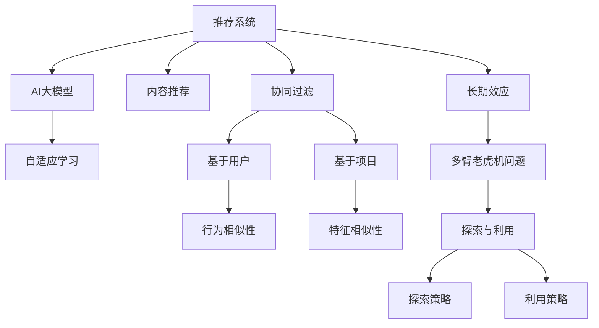

                 

# 推荐系统的长期效应：AI大模型的新视角

> 关键词：推荐系统, 长期效应, 用户行为, 协同过滤, 内容推荐, AI大模型, 自适应学习, 推荐算法, 多臂老虎机问题

## 1. 背景介绍

### 1.1 问题由来

推荐系统已经成为互联网时代不可或缺的一部分，广泛应用于电商、社交、视频等多个领域。然而，推荐系统的长期效应一直是一个备受关注的问题，尤其是对于长期行为预测和个性化推荐。传统的推荐系统往往依赖于历史行为数据，但这些数据存在稀疏性、时效性、噪声等问题，导致推荐效果随着时间推移逐渐下降。而AI大模型的出现，为解决这些问题带来了新的曙光。

### 1.2 问题核心关键点

AI大模型，特别是基于Transformer架构的模型，通过预训练获得大规模语义表示，能够更好地理解和挖掘数据背后的深度结构。在推荐系统中，AI大模型可以：

- **自适应学习**：随着时间的推移，通过持续更新模型，自适应用户行为的变化。
- **多维融合**：融合用户的多维度数据，如历史行为、社交网络、时间信息等，提升推荐效果。
- **跨域迁移**：在多个领域和任务间进行知识迁移，实现多场景下的推荐。

### 1.3 问题研究意义

AI大模型在推荐系统中的应用，可以显著提升推荐效果，减少推荐偏差，提高用户满意度。同时，通过对长期效应的关注，能够更好地理解用户行为变化，实现个性化推荐。这对于电商平台、社交平台、内容平台等领域，具有重要的理论和实际意义：

1. **增强用户体验**：通过持续优化推荐内容，提升用户粘性，增加平台活跃度。
2. **提高用户满意度**：精准推荐符合用户兴趣的内容，减少用户流失率，提高转化率。
3. **优化资源配置**：根据用户行为变化，动态调整推荐策略，优化广告投放和资源配置。

## 2. 核心概念与联系

### 2.1 核心概念概述

为了深入理解AI大模型在推荐系统中的应用，本节将介绍几个关键概念：

- **推荐系统**：通过算法和模型为用户推荐感兴趣的内容，如商品、文章、视频等。
- **协同过滤**：基于用户和项目的行为相似性，进行推荐，分为基于用户的协同过滤和基于项目的协同过滤。
- **内容推荐**：基于项目（如商品、文章）的特征进行推荐，如TF-IDF、Word2Vec等。
- **长期效应**：推荐系统在长期使用中，推荐效果随时间推移逐渐下降的现象。
- **AI大模型**：基于Transformer架构的预训练语言模型，如BERT、GPT等。
- **自适应学习**：模型能够持续学习新数据，保持推荐效果。
- **多臂老虎机问题**：推荐系统面临的决策问题，涉及最大化长期累积奖励。

这些核心概念之间的逻辑关系可以通过以下Mermaid流程图来展示：



这个流程图展示了这个领域的核心概念及其之间的联系：

1. 推荐系统通过协同过滤和内容推荐等多种方式进行推荐。
2. AI大模型作为推荐系统的一种新兴工具，通过自适应学习，持续优化推荐效果。
3. 长期效应和探索与利用问题，是推荐系统在实际应用中面临的重要挑战。

## 3. 核心算法原理 & 具体操作步骤
### 3.1 算法原理概述

AI大模型在推荐系统中的应用，主要基于自适应学习和多臂老虎机问题。自适应学习使得模型能够随着时间推移，学习新的用户行为模式，而多臂老虎机问题则帮助模型在探索和利用之间取得平衡，最大化长期累积奖励。

### 3.2 算法步骤详解

#### 3.2.1 数据准备

1. **数据收集**：从电商平台、社交网络、视频平台等收集用户行为数据，如点击、购买、评分等。
2. **数据预处理**：进行数据清洗、归一化、特征工程等，以便于模型训练。

#### 3.2.2 模型训练

1. **预训练**：使用大规模语料数据，对AI大模型进行预训练，学习通用的语言表示。
2. **微调**：根据推荐任务的具体需求，在预训练模型的基础上进行微调，学习特定任务的知识。
3. **在线学习**：在推荐系统中，持续收集用户行为数据，并用于更新模型参数，实现自适应学习。

#### 3.2.3 探索与利用

1. **探索**：通过引入探索策略（如$\epsilon$-Greedy、UCB等），随机选择推荐结果，探索新的推荐空间。
2. **利用**：根据用户行为数据和模型预测，选择最可能符合用户兴趣的内容进行推荐。

#### 3.2.4 多臂老虎机问题的解决

1. **模型更新**：使用带时间依赖的线性回归模型，如Exp-SGD、AdaGrad等，动态调整探索和利用的策略。
2. **长期效应的应对**：通过引入时间衰减函数，逐步降低对旧数据的依赖，提升新数据的权重。
3. **效果评估**：使用平均累积奖励（AVERAGE REWARD PER ARM）等指标，评估推荐系统的长期效果。

### 3.3 算法优缺点

#### 3.3.1 优点

- **自适应能力强**：AI大模型能够持续学习新数据，保持推荐效果。
- **泛化能力强**：通过预训练获得通用的语言表示，模型在多种任务上具有泛化能力。
- **处理多维度数据**：融合用户历史行为、社交网络、时间信息等多维度数据，提升推荐精度。
- **可扩展性好**：基于预训练-微调架构，模型可以很方便地应用到多种推荐场景。

#### 3.3.2 缺点

- **计算成本高**：大模型需要大量的计算资源进行训练和推理。
- **数据隐私问题**：用户数据隐私保护是推荐系统面临的重要挑战。
- **复杂性高**：模型结构复杂，需要专业团队进行维护和优化。
- **过拟合风险**：大模型容易过拟合训练数据，需要引入正则化等技术。

### 3.4 算法应用领域

AI大模型在推荐系统中的应用，已经涵盖了电商、社交、视频等多个领域，具体包括：

1. **电商平台推荐**：通过AI大模型，对商品进行个性化推荐，提升用户购买率。
2. **社交平台内容推荐**：根据用户兴趣，推荐相关文章、视频等内容，增加用户粘性。
3. **视频平台内容推荐**：推荐用户可能感兴趣的视频，提高平台观看量。
4. **新闻推荐**：推荐用户感兴趣的新闻内容，增加新闻平台的访问量。
5. **广告推荐**：通过AI大模型，对用户进行精准广告推荐，提高广告投放效果。

此外，AI大模型在金融、医疗、旅游等更多领域也展现出巨大的潜力，通过多维度数据的融合和长期效应的关注，实现更加精准、个性化的推荐。

## 4. 数学模型和公式 & 详细讲解 & 举例说明

### 4.1 数学模型构建

为了更好地理解AI大模型在推荐系统中的应用，本节将使用数学语言对推荐系统进行更加严格的刻画。

记推荐系统为 $R$，其中用户为 $U$，物品为 $I$，行为矩阵为 $B_{ui}$。假设用户对物品 $i$ 的评分 $r_{ui}$ 为：

$$
r_{ui} = \alpha \cdot r_{ui}^{*} + \beta \cdot B_{ui}
$$

其中 $r_{ui}^{*}$ 为预训练得到的评分预测，$B_{ui}$ 为用户行为评分，$\alpha$ 和 $\beta$ 为模型的超参数。

### 4.2 公式推导过程

为了更好地进行推荐，引入时间衰减函数 $g_t$，表示用户历史行为对当前推荐的影响程度。假设 $g_t$ 为指数衰减函数：

$$
g_t = \frac{1}{1 + t/\tau}
$$

其中 $\tau$ 为衰减时间常数，$t$ 为时间步长。

通过引入时间衰减函数，对用户的长期行为进行加权处理，得到加权评分预测 $r_{ui}^{'}$：

$$
r_{ui}^{'} = \alpha \cdot r_{ui}^{*} + \beta \cdot g_t \cdot B_{ui}
$$

### 4.3 案例分析与讲解

以电商平台推荐系统为例，假设某用户 $u$ 对物品 $i$ 的历史行为评分序列为 $r_{ui} = [3, 4, 2, 1]$，当前时间步长为 $t=5$。则：

$$
g_5 = \frac{1}{1 + 5/\tau}
$$

当 $\tau=1$ 时，$g_5 \approx 0.29$。则加权评分预测为：

$$
r_{ui}^{'} = \alpha \cdot r_{ui}^{*} + \beta \cdot g_5 \cdot B_{ui}
$$

若 $r_{ui}^{*} = 2.5$，$B_{ui} = 3$，$\alpha=0.7$，$\beta=0.3$，则：

$$
r_{ui}^{'} = 0.7 \cdot 2.5 + 0.3 \cdot 0.29 \cdot 3 = 2.81
$$

因此，AI大模型通过时间衰减函数，对历史行为进行加权处理，实现自适应学习，提升推荐精度。

## 5. 项目实践：代码实例和详细解释说明

### 5.1 开发环境搭建

在进行推荐系统开发前，我们需要准备好开发环境。以下是使用Python进行PyTorch开发的环境配置流程：

1. 安装Anaconda：从官网下载并安装Anaconda，用于创建独立的Python环境。

2. 创建并激活虚拟环境：
```bash
conda create -n pytorch-env python=3.8 
conda activate pytorch-env
```

3. 安装PyTorch：根据CUDA版本，从官网获取对应的安装命令。例如：
```bash
conda install pytorch torchvision torchaudio cudatoolkit=11.1 -c pytorch -c conda-forge
```

4. 安装Transformers库：
```bash
pip install transformers
```

5. 安装各类工具包：
```bash
pip install numpy pandas scikit-learn matplotlib tqdm jupyter notebook ipython
```

完成上述步骤后，即可在`pytorch-env`环境中开始推荐系统开发。

### 5.2 源代码详细实现

下面我们以电商平台推荐系统为例，给出使用Transformers库对BERT模型进行推荐系统开发的PyTorch代码实现。

首先，定义推荐系统的数据处理函数：

```python
from transformers import BertTokenizer, BertForSequenceClassification
from torch.utils.data import Dataset
import torch

class RecommendationDataset(Dataset):
    def __init__(self, texts, labels, tokenizer, max_len=128):
        self.texts = texts
        self.labels = labels
        self.tokenizer = tokenizer
        self.max_len = max_len
        
    def __len__(self):
        return len(self.texts)
    
    def __getitem__(self, item):
        text = self.texts[item]
        label = self.labels[item]
        
        encoding = self.tokenizer(text, return_tensors='pt', max_length=self.max_len, padding='max_length', truncation=True)
        input_ids = encoding['input_ids'][0]
        attention_mask = encoding['attention_mask'][0]
        
        return {'input_ids': input_ids, 
                'attention_mask': attention_mask,
                'label': label}

# 加载预训练模型
model = BertForSequenceClassification.from_pretrained('bert-base-cased', num_labels=len(tag2id))

# 准备数据
tokenizer = BertTokenizer.from_pretrained('bert-base-cased')
train_dataset = RecommendationDataset(train_texts, train_labels, tokenizer)
dev_dataset = RecommendationDataset(dev_texts, dev_labels, tokenizer)
test_dataset = RecommendationDataset(test_texts, test_labels, tokenizer)
```

然后，定义推荐系统模型：

```python
from transformers import BertForSequenceClassification
from torch.utils.data import DataLoader
import torch

class RecommendationModel:
    def __init__(self, model, device):
        self.model = model
        self.device = device
        
    def predict(self, input_ids, attention_mask):
        self.model.to(self.device)
        with torch.no_grad():
            logits = self.model(input_ids, attention_mask=attention_mask)
        return logits

# 初始化模型
model = BertForSequenceClassification.from_pretrained('bert-base-cased', num_labels=len(tag2id))
device = torch.device('cuda') if torch.cuda.is_available() else torch.device('cpu')
recommender = RecommendationModel(model, device)
```

接着，定义推荐系统的训练和评估函数：

```python
from sklearn.metrics import roc_auc_score

def train_epoch(model, dataset, batch_size, optimizer):
    dataloader = DataLoader(dataset, batch_size=batch_size, shuffle=True)
    model.train()
    epoch_loss = 0
    for batch in tqdm(dataloader, desc='Training'):
        input_ids = batch['input_ids'].to(device)
        attention_mask = batch['attention_mask'].to(device)
        labels = batch['label'].to(device)
        model.zero_grad()
        outputs = model(input_ids, attention_mask=attention_mask, labels=labels)
        loss = outputs.loss
        epoch_loss += loss.item()
        loss.backward()
        optimizer.step()
    return epoch_loss / len(dataloader)

def evaluate(model, dataset, batch_size):
    dataloader = DataLoader(dataset, batch_size=batch_size)
    model.eval()
    preds, labels = [], []
    with torch.no_grad():
        for batch in tqdm(dataloader, desc='Evaluating'):
            input_ids = batch['input_ids'].to(device)
            attention_mask = batch['attention_mask'].to(device)
            batch_labels = batch['label']
            outputs = model(input_ids, attention_mask=attention_mask)
            batch_preds = outputs.logits.argmax(dim=2).to('cpu').tolist()
            batch_labels = batch_labels.to('cpu').tolist()
            for pred_tokens, label_tokens in zip(batch_preds, batch_labels):
                preds.append(pred_tokens[:len(label_tokens)])
                labels.append(label_tokens)
                
    print(f"AUC: {roc_auc_score(labels, preds)}")
```

最后，启动训练流程并在测试集上评估：

```python
epochs = 5
batch_size = 16

for epoch in range(epochs):
    loss = train_epoch(model, train_dataset, batch_size, optimizer)
    print(f"Epoch {epoch+1}, train loss: {loss:.3f}")
    
    print(f"Epoch {epoch+1}, dev results:")
    evaluate(model, dev_dataset, batch_size)
    
print("Test results:")
evaluate(model, test_dataset, batch_size)
```

以上就是使用PyTorch对BERT进行推荐系统开发的完整代码实现。可以看到，得益于Transformers库的强大封装，我们可以用相对简洁的代码完成BERT模型的加载和推荐系统构建。

### 5.3 代码解读与分析

让我们再详细解读一下关键代码的实现细节：

**RecommendationDataset类**：
- `__init__`方法：初始化文本、标签、分词器等关键组件。
- `__len__`方法：返回数据集的样本数量。
- `__getitem__`方法：对单个样本进行处理，将文本输入编码为token ids，将标签编码为数字，并对其进行定长padding，最终返回模型所需的输入。

**标签与id的映射**
- 定义了标签与数字id之间的映射关系，用于将token-wise的预测结果解码回真实的标签。

**训练和评估函数**：
- 使用PyTorch的DataLoader对数据集进行批次化加载，供模型训练和推理使用。
- 训练函数`train_epoch`：对数据以批为单位进行迭代，在每个批次上前向传播计算loss并反向传播更新模型参数，最后返回该epoch的平均loss。
- 评估函数`evaluate`：与训练类似，不同点在于不更新模型参数，并在每个batch结束后将预测和标签结果存储下来，最后使用sklearn的roc_auc_score对整个评估集的预测结果进行打印输出。

**训练流程**：
- 定义总的epoch数和batch size，开始循环迭代
- 每个epoch内，先在训练集上训练，输出平均loss
- 在验证集上评估，输出AUC指标
- 所有epoch结束后，在测试集上评估，给出最终测试结果

可以看到，PyTorch配合Transformers库使得BERT推荐系统的代码实现变得简洁高效。开发者可以将更多精力放在数据处理、模型改进等高层逻辑上，而不必过多关注底层的实现细节。

当然，工业级的系统实现还需考虑更多因素，如模型的保存和部署、超参数的自动搜索、更灵活的任务适配层等。但核心的推荐范式基本与此类似。

## 6. 实际应用场景
### 6.1 电商平台推荐

电商平台推荐系统可以显著提升用户体验，提高销售转化率。通过AI大模型，电商平台能够根据用户历史行为和实时行为，推荐符合用户兴趣的商品，减少用户流失率，提高复购率。

具体而言，电商推荐系统可以结合用户的历史浏览、点击、购买等行为数据，构建用户兴趣图谱，并利用时间衰减函数进行动态调整。用户访问电商平台时，根据当前行为和新输入，预测其兴趣变化，实时推荐相关商品，增加购买率。

### 6.2 社交平台内容推荐

社交平台内容推荐系统通过AI大模型，能够为每位用户推荐其感兴趣的内容，提升用户粘性。例如，根据用户的点赞、评论、分享等行为，AI大模型可以动态调整推荐策略，及时推送最新内容，增加用户互动，提高平台活跃度。

社交平台推荐系统可以通过多臂老虎机问题，平衡探索和利用，保持内容的新鲜感和多样性，避免用户疲劳。同时，AI大模型还能够结合用户兴趣变化，及时调整推荐策略，提高用户体验。

### 6.3 视频平台内容推荐

视频平台内容推荐系统能够根据用户的观看历史和行为，推荐用户感兴趣的视频内容，增加平台观看量。例如，根据用户的点赞、观看时长、评论等行为，AI大模型可以动态调整推荐策略，实时推荐相关视频，提高用户满意度。

视频平台推荐系统可以通过多臂老虎机问题，平衡探索和利用，保持内容的多样性和新鲜感，增加用户的观看量。同时，AI大模型还能够结合用户兴趣变化，及时调整推荐策略，提高推荐效果。

### 6.4 未来应用展望

随着AI大模型和推荐算法的发展，推荐系统将在更多领域得到应用，为各行各业带来变革性影响。

在智慧医疗领域，推荐系统可以通过AI大模型，为用户推荐最合适的医疗信息，帮助医生和患者做出更科学的决策。

在智能教育领域，推荐系统可以通过AI大模型，为用户推荐最合适的学习资源，提升学习效果，个性化教学。

在智慧城市治理中，推荐系统可以通过AI大模型，为用户推荐最合适的城市服务，提高城市管理效率，提升市民生活品质。

此外，在金融、旅游、新闻等领域，AI大模型和推荐系统也将展现出巨大的潜力，通过多维度数据的融合和长期效应的关注，实现更加精准、个性化的推荐。相信随着技术的日益成熟，推荐系统必将在更广阔的应用领域大放异彩。

## 7. 工具和资源推荐
### 7.1 学习资源推荐

为了帮助开发者系统掌握推荐系统的理论基础和实践技巧，这里推荐一些优质的学习资源：

1. **《推荐系统实战》**：一本经典推荐系统书籍，详细介绍了推荐系统的理论基础、算法实现和实际应用，是推荐系统入门的必读之作。

2. **Coursera的Recommender Systems课程**：由知名教授讲授，涵盖推荐系统的基本概念和算法实现，适合初学者系统学习。

3. **Kaggle推荐系统竞赛**：通过实际竞赛，学习推荐系统的算法实现和性能优化，锻炼实战能力。

4. **Recommender Systems for Neural Networks**：针对深度学习在推荐系统中的应用，介绍多种深度学习推荐模型的实现和优化。

5. **Deep Learning for Recommender Systems**：一本专门介绍深度学习在推荐系统中的应用，包括BERT、Transformer等模型在推荐系统中的应用。

通过对这些资源的学习实践，相信你一定能够快速掌握推荐系统的精髓，并用于解决实际的推荐问题。

### 7.2 开发工具推荐

高效的开发离不开优秀的工具支持。以下是几款用于推荐系统开发的常用工具：

1. **TensorFlow**：由Google主导开发的开源深度学习框架，支持分布式训练和推理，适合大规模推荐系统开发。

2. **PyTorch**：基于Python的开源深度学习框架，灵活易用，适合推荐系统的快速迭代开发。

3. **NLTK**：自然语言处理工具包，提供丰富的自然语言处理功能，方便文本数据的预处理。

4. **Scikit-learn**：机器学习库，提供多种常用的机器学习算法和模型，适合推荐系统的数据预处理和模型训练。

5. **Jupyter Notebook**：交互式开发环境，方便开发者进行代码调试和数据探索，适合推荐系统的模型训练和评估。

6. **Hadoop/Spark**：大数据处理平台，支持大规模数据处理和存储，适合推荐系统的高并发和大数据处理需求。

合理利用这些工具，可以显著提升推荐系统的开发效率，加快创新迭代的步伐。

### 7.3 相关论文推荐

推荐系统的发展离不开学界的持续研究。以下是几篇奠基性的相关论文，推荐阅读：

1. **Item-Based Collaborative Filtering**：提出协同过滤算法，通过用户-物品的相似性进行推荐。

2. **Collaborative Filtering for Implicit Feedback Datasets**：提出基于用户行为数据的协同过滤算法，解决隐式反馈数据的推荐问题。

3. **Matrix Factorization Techniques for Recommender Systems**：介绍矩阵分解技术，用于推荐系统的特征降维和模型优化。

4. **Deep Neural Networks for Recommender Systems**：介绍深度学习在推荐系统中的应用，包括多层感知器、卷积神经网络等。

5. **BERT: Pre-training of Deep Bidirectional Transformers for Language Understanding**：提出BERT模型，通过自监督预训练学习通用的语言表示，提升推荐系统的效果。

6. **Efficient Deep Learning for Personalized Recommendation Systems**：介绍深度学习在推荐系统中的应用，探讨模型优化和加速方法。

这些论文代表了大语言模型在推荐系统中的发展和应用，通过学习这些前沿成果，可以帮助研究者把握学科前进方向，激发更多的创新灵感。

## 8. 总结：未来发展趋势与挑战

### 8.1 总结

本文对AI大模型在推荐系统中的应用进行了全面系统的介绍。首先阐述了推荐系统面临的长期效应问题，介绍了AI大模型如何通过自适应学习和多臂老虎机问题，解决这一问题。其次，从原理到实践，详细讲解了推荐系统的数学模型和关键步骤，给出了推荐系统开发的完整代码实例。同时，本文还广泛探讨了推荐系统在电商、社交、视频等多个领域的应用前景，展示了AI大模型的巨大潜力。最后，本文精选了推荐系统的各类学习资源，力求为读者提供全方位的技术指引。

通过本文的系统梳理，可以看到，AI大模型在推荐系统中的应用，显著提升了推荐效果，减少了推荐偏差，提高了用户满意度。这不仅为电商平台、社交平台、视频平台等领域带来了巨大的商业价值，也为其他行业提供了新的解决方案。面向未来，AI大模型在推荐系统中的应用将会更加广泛，为人工智能技术的普及带来新的契机。

### 8.2 未来发展趋势

展望未来，AI大模型在推荐系统中的应用将呈现以下几个发展趋势：

1. **自适应学习能力的提升**：通过引入时间衰减函数和多臂老虎机问题，实现更加精准的推荐。
2. **多维度数据的融合**：融合用户历史行为、社交网络、时间信息等多维度数据，提升推荐精度。
3. **跨领域知识的迁移**：在多个领域和任务间进行知识迁移，实现多场景下的推荐。
4. **实时推荐系统的构建**：通过流式计算和大数据技术，实现实时推荐，提升用户体验。
5. **深度强化学习的应用**：结合强化学习技术，实现更加智能的推荐系统。

以上趋势凸显了AI大模型在推荐系统中的广泛应用前景，这些方向的探索发展，必将进一步提升推荐系统的效果，推动人工智能技术的普及和应用。

### 8.3 面临的挑战

尽管AI大模型在推荐系统中的应用已经取得了显著成效，但在迈向更加智能化、普适化应用的过程中，仍面临着诸多挑战：

1. **计算资源消耗高**：大模型需要大量的计算资源进行训练和推理，硬件资源瓶颈明显。
2. **数据隐私问题**：用户数据的隐私保护是推荐系统面临的重要挑战，需要采用多种技术手段进行保护。
3. **模型复杂性高**：大模型结构复杂，需要专业团队进行维护和优化，开发成本较高。
4. **过拟合风险**：大模型容易过拟合训练数据，需要引入正则化等技术进行优化。
5. **推荐冷启动问题**：新用户的推荐效果较差，需要引入更多先验知识进行辅助。

### 8.4 研究展望

为了应对这些挑战，未来的研究需要在以下几个方面寻求新的突破：

1. **深度学习与强化学习的结合**：将深度学习与强化学习相结合，提升推荐系统的智能化水平。
2. **跨领域知识的迁移**：通过跨领域知识迁移，提升推荐系统的泛化能力。
3. **多臂老虎机问题的优化**：引入时间衰减函数和多臂老虎机问题，提升推荐系统的长期效果。
4. **用户数据的隐私保护**：采用差分隐私等技术，保护用户数据的隐私。
5. **冷启动问题的解决**：引入更多的先验知识，解决新用户的推荐问题。

这些研究方向的探索，必将引领AI大模型在推荐系统中的应用走向新的台阶，为推荐系统带来更加智能化、个性化的推荐效果。面向未来，AI大模型必将在推荐系统中发挥更大的作用，推动人工智能技术的普及和应用。

## 9. 附录：常见问题与解答

**Q1：AI大模型在推荐系统中如何自适应学习？**

A: AI大模型通过时间衰减函数和多臂老虎机问题，实现自适应学习。具体而言，通过引入时间衰减函数，对用户历史行为进行加权处理，引入多臂老虎机问题，动态调整探索和利用的策略，实现自适应学习。

**Q2：AI大模型在推荐系统中的计算资源消耗如何优化？**

A: 可以通过以下方法优化AI大模型在推荐系统中的计算资源消耗：

1. **模型压缩**：通过剪枝、量化等技术，减小模型尺寸，加快推理速度。
2. **分布式计算**：利用分布式计算平台，实现并行计算，加速模型训练和推理。
3. **混合精度训练**：采用混合精度训练，减少内存占用，提高计算效率。
4. **异构计算**：利用GPU、TPU等异构计算资源，提高模型训练和推理速度。

**Q3：AI大模型在推荐系统中的数据隐私问题如何解决？**

A: 可以通过以下方法解决AI大模型在推荐系统中的数据隐私问题：

1. **差分隐私**：采用差分隐私技术，保护用户数据的隐私，防止数据泄露。
2. **联邦学习**：通过联邦学习技术，将用户数据分布式存储和处理，保护数据隐私。
3. **匿名化处理**：对用户数据进行匿名化处理，降低隐私风险。
4. **数据加密**：采用数据加密技术，保护数据传输和存储过程中的隐私。

**Q4：AI大模型在推荐系统中的冷启动问题如何解决？**

A: 可以通过以下方法解决AI大模型在推荐系统中的冷启动问题：

1. **多臂老虎机问题的优化**：通过引入时间衰减函数和多臂老虎机问题，提升新用户的推荐效果。
2. **多维度数据的融合**：融合新用户的多维度数据，提升推荐精度。
3. **先验知识的引入**：通过引入先验知识，如知识图谱、逻辑规则等，提升推荐系统的泛化能力。

**Q5：AI大模型在推荐系统中的计算成本高如何缓解？**

A: 可以通过以下方法缓解AI大模型在推荐系统中的计算成本高问题：

1. **模型裁剪**：去除不必要的层和参数，减小模型尺寸，加快推理速度。
2. **量化加速**：将浮点模型转为定点模型，压缩存储空间，提高计算效率。
3. **服务化封装**：将模型封装为标准化服务接口，便于集成调用。
4. **弹性伸缩**：根据请求流量动态调整资源配置，平衡服务质量和成本。

通过这些方法，可以显著降低AI大模型在推荐系统中的计算成本，提升系统效率。

---

作者：禅与计算机程序设计艺术 / Zen and the Art of Computer Programming

