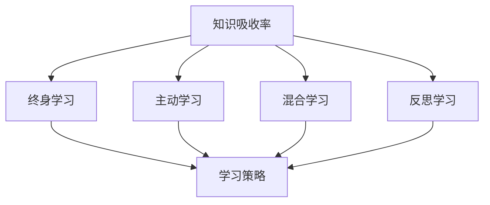

                 

# 提升知识吸收率:管理者成长的关键

> 关键词：知识吸收率,管理能力提升,学习策略,学习环境,领导力发展,终身学习

## 1. 背景介绍

### 1.1 问题由来
在当今瞬息万变的商业环境中，管理者需要不断学习新的知识和技能，以适应市场变化和组织发展需求。然而，如何在有限的时间内高效地吸收和应用新知识，成为了许多管理者面临的共同难题。本文章旨在深入探讨提升知识吸收率的关键因素，提出系统化的方法和策略，帮助管理者更好地成长。

### 1.2 问题核心关键点
管理者提升知识吸收率的核心在于构建高效的学习体系，优化学习方法和环境。本文将围绕以下几个关键点展开：

- **学习策略**：制定科学合理的学习计划，最大化时间利用效率。
- **学习环境**：营造适合学习的环境，减少干扰因素，提升专注度。
- **学习资源**：选择合适的学习资源，利用多种学习工具。
- **实践应用**：通过实际工作中的应用，巩固知识吸收效果。

## 2. 核心概念与联系

### 2.1 核心概念概述

为更好地理解提升知识吸收率的关键因素，本节将介绍几个密切相关的核心概念：

- **知识吸收率(Knowledge Absorption Rate, KAR)**：指学习者在特定时间内能够有效吸收并应用新知识的比例。
- **终身学习(Lifelong Learning)**：倡导在职业生涯中持续学习新知识，适应不断变化的环境。
- **主动学习(Active Learning)**：学习者通过主动参与和实践，主动寻找学习机会，提升学习效果。
- **混合学习(Mixed Learning)**：结合在线学习与线下学习的优势，实现更全面、高效的学习。
- **反思学习(Reflective Learning)**：通过反思自身学习过程和结果，进行自我调整和优化。

这些核心概念之间的逻辑关系可以通过以下Mermaid流程图来展示：



这个流程图展示了几者之间的相互作用关系：

1. 知识吸收率是学习效果的核心指标，与终身学习、主动学习、混合学习和反思学习相互影响。
2. 终身学习、主动学习、混合学习和反思学习共同构成提升知识吸收率的策略体系，通过优化这些环节，可以实现高效的知识吸收。

## 3. 核心算法原理 & 具体操作步骤
### 3.1 算法原理概述

提升知识吸收率的核心算法原理是最大化时间利用效率，优化学习方法和环境。其核心思想是：通过制定科学的学习计划，选择合适的学习资源，营造高效的学习环境，并通过反思和实践，不断优化学习过程。

具体地，知识吸收率可以表示为：

$$
KAR = \frac{A}{T} \times \eta
$$

其中，$A$为学习者有效吸收并应用新知识的数量，$T$为学习者可用于学习的时间，$\eta$为学习效率（受学习策略、环境、资源等因素影响）。

提升知识吸收率的目标是通过优化$A$、$T$、$\eta$等变量，最大化$KAR$。

### 3.2 算法步骤详解

基于上述原理，提升知识吸收率的具体操作步骤包括以下几个关键步骤：

**Step 1: 设定学习目标**
- 明确学习的目标和需求，包括知识点的具体范围、学习的时间周期和预期成果。

**Step 2: 制定学习计划**
- 根据学习目标，制定详细的学习计划，包括每天/每周的学习任务、时间分配和预期完成时间。

**Step 3: 选择学习资源**
- 根据学习目标选择合适的学习资源，如书籍、在线课程、研讨会、培训等。

**Step 4: 营造高效学习环境**
- 创建有利于学习的环境，如安静的学习空间、有效的工具和软件支持等。

**Step 5: 实施学习策略**
- 采用科学的学习策略，如主动学习、混合学习、反思学习等，确保学习的效率和效果。

**Step 6: 反思和调整**
- 定期反思学习过程和效果，根据反馈调整学习计划和策略，不断优化学习过程。

**Step 7: 实践和应用**
- 将学到的知识应用于实际工作中，通过实践检验和巩固学习成果。

### 3.3 算法优缺点

提升知识吸收率的方法具有以下优点：
1. 科学高效。通过系统的学习计划和策略，最大化时间利用效率。
2. 个性化定制。学习计划和策略可根据个人需求和特点进行个性化调整。
3. 效果显著。通过反思和实践，提升学习效果，实现高效知识吸收。

同时，该方法也存在一定的局限性：
1. 需要时间和精力投入。制定和实施学习计划，营造高效学习环境，都需要一定的时间和精力。
2. 灵活性不足。固定的学习计划可能难以应对突发事件和临时任务。
3. 初始难度大。对于缺乏学习习惯和管理经验的管理者，初期实施可能较为困难。

尽管存在这些局限性，但就目前而言，提升知识吸收率的方法仍是管理者成长的有效途径。未来相关研究的重点在于如何进一步降低实施难度，提高灵活性，同时兼顾时间管理效率。

### 3.4 算法应用领域

提升知识吸收率的方法在企业管理、职业培训、终身学习等领域得到了广泛应用，其核心优势在于科学性和系统性，能够显著提升学习效果和管理者的职业能力。

在企业管理中，通过提升知识吸收率，管理者可以更快速地适应市场变化，提升团队协作和创新能力。

在职业培训中，通过系统化的学习计划和策略，员工可以更高效地掌握新技能，提升工作效率和职业竞争力。

在终身学习中，通过反思和实践，学习者可以不断更新知识体系，保持职业生涯的持续发展和进步。

## 4. 数学模型和公式 & 详细讲解  
### 4.1 数学模型构建

为更好地理解提升知识吸收率的关键因素，本节将使用数学语言对学习过程进行严格刻画。

假设学习者可用于学习的时间为$T$，学习者每天可用于学习的时间为$t$，则每天的学习时间可以表示为$T/t$天。

设学习者每天有效学习的时间为$a$，则总的学习时间为$Ta$。

根据学习效率$\eta$，知识吸收率可以表示为：

$$
KAR = \frac{A}{Ta} \times \eta
$$

其中，$A$为学习者有效吸收并应用新知识的数量，$T$为学习者可用于学习的时间，$\eta$为学习效率。

### 4.2 公式推导过程

以下我们以二分类任务为例，推导知识吸收率的计算公式。

假设学习者每天能够掌握$n$个知识点，学习者每天的学习时间分配为$a_1, a_2, ..., a_k$，则总的学习时间$Ta = a_1 + a_2 + ... + a_k$。

根据学习效率$\eta$，知识吸收率可以表示为：

$$
KAR = \frac{n_1a_1 + n_2a_2 + ... + n_ka_k}{Ta} \times \eta
$$

其中，$n_i$为第$i$个知识点在总知识点中所占的比例，$a_i$为学习者每天在第$i$个知识点上投入的学习时间，$Ta$为总的学习时间，$\eta$为学习效率。

在实际应用中，知识吸收率还可以通过多种学习策略进行优化，如主动学习、混合学习、反思学习等。

### 4.3 案例分析与讲解

假设某学习者每天可用于学习的时间为2小时，每天有效学习的时间为1小时，学习效率为0.9，通过学习掌握新知识的能力为每天10个知识点。

则该学习者的知识吸收率为：

$$
KAR = \frac{10}{2} \times 0.9 = 4.5
$$

这意味着该学习者每天可以吸收并应用4.5个新知识。

## 5. 项目实践：代码实例和详细解释说明
### 5.1 开发环境搭建

在进行知识吸收率提升实践前，我们需要准备好开发环境。以下是使用Python进行项目管理的环境配置流程：

1. 安装Python：从官网下载并安装最新版本的Python，确保其与项目依赖库兼容。

2. 创建虚拟环境：
```bash
python -m venv myenv
source myenv/bin/activate
```

3. 安装项目依赖库：
```bash
pip install schedule pywhatkit beautifulsoup4
```

其中，`schedule`用于管理学习计划，`pywhatkit`用于自动创建学习提醒，`beautifulsoup4`用于解析和处理网页内容。

完成上述步骤后，即可在`myenv`环境中开始知识吸收率提升实践。

### 5.2 源代码详细实现

以下是一个简单的Python代码示例，演示如何使用`schedule`库制定学习计划和创建学习提醒：

```python
import schedule
import time
from datetime import datetime, timedelta

# 定义学习计划
study_hours = [(8, 10), (14, 16), (19, 21)]
study_days = [1, 2, 3, 4, 5]  # 周一至周五
study_hours_per_day = 2  # 每天学习时间

# 创建学习提醒
def study_reminder():
    print("现在是学习时间！")

schedule.every().day.at("08:00").do(study_reminder)
schedule.every().day.at("14:00").do(study_reminder)
schedule.every().day.at("19:00").do(study_reminder)

# 启动学习提醒
while True:
    schedule.run_pending()
    time.sleep(1)
```

### 5.3 代码解读与分析

让我们再详细解读一下关键代码的实现细节：

**学习计划**：
- `study_hours`列表：定义了每天的学习时间，即每天上午8点至10点，下午14点至16点，晚上19点至21点。
- `study_days`列表：定义了学习的周期，即周一至周五。
- `study_hours_per_day`变量：定义了每天的学习时间。

**学习提醒**：
- `study_reminder`函数：在每天的学习时间点，输出提醒信息。
- `schedule.every().day.at()`方法：定义学习提醒的时间点。
- `while True`循环：不断运行计划中的任务。

**学习计划和提醒的实现**：
- 通过`schedule`库，我们可以方便地管理学习计划和创建学习提醒，确保学习者能够按时进行学习。

当然，在实际应用中，还需要考虑更多因素，如学习资源的获取、学习策略的实施等。但核心的提升知识吸收率方法基本与此类似。

## 6. 实际应用场景
### 6.1 企业培训管理

在企业培训管理中，通过提升知识吸收率，可以提高培训效果，提升员工技能和绩效。

具体而言，可以收集企业内部员工的技能需求和职业发展目标，制定科学的培训计划和学习资源，结合在线学习和线下培训，通过反思和实践，不断优化培训效果。

### 6.2 个人职业发展

对于个人职业发展，通过提升知识吸收率，可以实现终身学习，持续更新知识体系，保持职业生涯的持续发展和进步。

具体而言，可以根据个人职业发展目标，制定科学的学习计划和学习策略，选择合适的学习资源，通过反思和实践，不断提升自己的职业竞争力。

### 6.3 教育领域

在教育领域，通过提升知识吸收率，可以提高学生的学习效果，促进教育公平，提升教学质量。

具体而言，可以结合在线教育和传统教学，制定科学的学习计划和策略，利用多种学习工具和方法，通过反思和实践，不断优化教学效果，提升学生的学习能力和成绩。

## 7. 工具和资源推荐
### 7.1 学习资源推荐

为了帮助管理者提升知识吸收率，这里推荐一些优质的学习资源：

1. Coursera、edX、Udemy等在线教育平台：提供了大量优质的课程和学习资源，涵盖企业管理、领导力发展、职业培训等多个领域。

2. Harvard Business Review、Harvard Business Review Network等商业杂志：提供了丰富的商业案例和管理实践，帮助管理者提升管理能力和知识吸收率。

3. LinkedIn Learning、Lynda等职业技能培训平台：提供了大量的职业技能培训课程，帮助员工提升职业竞争力。

4. Toastmasters等演讲培训组织：通过提高演讲和沟通能力，提升管理者的领导力和影响力。

5. Khan Academy、Coursera等学习平台：提供了大量的免费学习资源，帮助个人提升终身学习能力。

通过对这些资源的学习实践，相信你一定能够快速掌握提升知识吸收率的关键方法，并应用于实际工作中。

### 7.2 开发工具推荐

高效的开发离不开优秀的工具支持。以下是几款用于知识吸收率提升开发的常用工具：

1. Trello、Asana等项目管理工具：帮助管理者制定和跟踪学习计划，确保学习任务的按时完成。
2. Google Calendar等时间管理工具：帮助管理者合理安排学习时间，避免时间冲突。
3. Notion、Evernote等笔记管理工具：帮助管理者记录学习内容和反思，积累知识经验。
4. Pomodoro技术应用工具：如Tomato Timer、Focus Booster等，帮助管理者优化学习时间和注意力，提升学习效率。
5. Habitica等习惯养成应用：通过游戏化的方式，帮助管理者养成持续学习的习惯。

合理利用这些工具，可以显著提升知识吸收率提升任务的开发效率，加快创新迭代的步伐。

### 7.3 相关论文推荐

知识吸收率提升方法的发展源于学界的持续研究。以下是几篇奠基性的相关论文，推荐阅读：

1. J. S. Bruner的《教育心理学》：提出了有意义学习和发现学习的理论，强调学习者的主动参与和反思。
2. D. H. Chew的《终身学习：走向知识社会的挑战》：探讨了终身学习的重要性和实施策略，强调学习过程的持续性和灵活性。
3. K. M. McKellen的《改进个人和组织学习能力》：提出了科学的学习策略和反思方法，帮助个人和组织提升学习效果。
4. P. T. Greenholtz的《管理学习和发展》：介绍了科学的学习方法和策略，提升管理者的知识吸收率。
5. E. A. Locke的《个人和组织学习策略》：提出了混合学习、反思学习和主动学习的策略，提升学习效果。

这些论文代表了大语言模型微调技术的发展脉络。通过学习这些前沿成果，可以帮助研究者把握学科前进方向，激发更多的创新灵感。

## 8. 总结：未来发展趋势与挑战

### 8.1 总结

本文对提升知识吸收率的方法进行了全面系统的介绍。首先阐述了提升知识吸收率的关键因素，明确了学习策略、学习环境和学习资源的重要性。其次，从原理到实践，详细讲解了提升知识吸收率的数学模型和操作步骤，给出了知识吸收率提升实践的完整代码实例。同时，本文还探讨了提升知识吸收率在企业管理、职业发展、教育等多个领域的应用前景，展示了提升知识吸收率的巨大潜力。最后，本文精选了提升知识吸收率的学习资源、开发工具和相关论文，力求为读者提供全方位的技术指引。

通过本文的系统梳理，可以看到，提升知识吸收率的方法在管理者成长中具有重要意义。这些方法的科学性和系统性，可以帮助管理者更高效地学习新知识，提升管理能力和职业竞争力。未来，伴随这些方法在实际应用中的不断优化和改进，相信管理者能够更好地应对复杂多变的工作环境，实现职业生涯的持续发展和进步。

### 8.2 未来发展趋势

展望未来，提升知识吸收率的方法将呈现以下几个发展趋势：

1. 智能化学习平台：借助人工智能技术，智能推荐个性化的学习资源和策略，提高学习效率。
2. 混合学习模式：结合在线学习和线下学习，提供更灵活、高效的学习方式。
3. 全球化学习环境：利用全球范围内的优质学习资源，提升学习效果。
4. 学习数据分析：通过大数据分析，优化学习计划和策略，提升学习效果。
5. 跨领域学习：将不同领域的学习内容融合，提升跨领域知识的应用能力。
6. 反思学习工具：利用反思学习工具，帮助学习者深入反思学习过程和效果，进行自我调整和优化。

这些趋势展示了提升知识吸收率方法的广阔前景。未来的研究将继续探索如何利用新技术和新工具，提升学习效率和效果，为管理者成长提供更全面的支持。

### 8.3 面临的挑战

尽管提升知识吸收率的方法已经取得了显著成果，但在实践过程中，仍面临诸多挑战：

1. 学习资源的选择和获取：不同学习资源的适用性和质量差异较大，选择合适的学习资源需要时间和精力。
2. 时间管理难度：制定和实施学习计划需要高效的时间管理能力，管理者需要在繁忙的工作中找到合适的时间进行学习。
3. 学习策略的灵活性：固定的学习策略可能难以应对突发事件和临时任务，需要灵活调整。
4. 学习效果的评价：如何科学评价学习效果，及时发现和解决问题，仍然是一个需要深入研究的课题。
5. 跨领域的知识整合：不同领域的学习内容和方法存在差异，如何有效整合跨领域的知识，提升应用能力，仍需进一步探索。
6. 自我管理和自律性：提升知识吸收率需要高度的自我管理和自律性，管理者需要不断提升自我管理能力。

这些挑战需要进一步研究和探索，才能实现知识吸收率提升的持续优化和应用。

### 8.4 研究展望

未来的研究需要在以下几个方面寻求新的突破：

1. 智能化学习资源的开发：利用机器学习和人工智能技术，开发智能推荐系统和学习平台，帮助学习者快速获取高质量的学习资源。
2. 灵活学习策略的设计：开发灵活的学习策略和方法，能够根据学习者的需求和环境进行调整，提高学习效率和效果。
3. 学习效果的科学评价：研究科学的学习效果评价方法，通过定量和定性分析，及时发现和解决学习过程中的问题。
4. 跨领域知识的整合：研究跨领域知识的整合方法，提升学习者跨领域知识的应用能力，增强其综合素质和创新能力。
5. 学习工具和平台的设计：开发高效的学习工具和平台，提供更丰富、便捷的学习体验，提升学习效果和满意度。

这些研究方向的探索，必将引领知识吸收率提升方法迈向更高的台阶，为管理者成长提供更全面的支持。面向未来，知识吸收率提升技术还需要与其他技术进行更深入的融合，如知识图谱、自然语言处理、人工智能等，共同推动知识吸收率提升技术的进步。只有勇于创新、敢于突破，才能不断拓展知识吸收率的边界，让学习者更好地掌握新知识，提升职业竞争力。

## 9. 附录：常见问题与解答

**Q1：如何选择合适的学习资源？**

A: 选择合适的学习资源需要考虑以下因素：
1. 学习目标：选择与学习目标相关的资源，确保学习内容与需求匹配。
2. 学习平台：选择权威、评价高的学习平台，确保学习资源的质量和可靠性。
3. 学习时间：根据学习时间安排选择合适的资源，避免时间冲突。
4. 学习方式：选择适合自身学习方式和学习风格的资源，提升学习效果。

**Q2：如何制定科学的学习计划？**

A: 制定科学的学习计划需要考虑以下步骤：
1. 明确学习目标：设定具体的学习目标，包括知识点的具体范围和时间周期。
2. 分解学习任务：将学习目标分解为具体任务，每天或每周有明确的学习任务。
3. 合理安排时间：根据个人时间安排，合理分配每天的学习时间，避免时间冲突。
4. 定期反思和调整：定期反思学习过程和效果，根据反馈调整学习计划和策略，不断优化学习过程。

**Q3：如何提高学习效率？**

A: 提高学习效率需要考虑以下方法：
1. 主动学习：通过主动参与和实践，主动寻找学习机会，提升学习效果。
2. 反思学习：通过反思学习过程和结果，进行自我调整和优化，提升学习效果。
3. 混合学习：结合在线学习和线下学习，提供更灵活、高效的学习方式。
4. 利用工具：利用高效的学习工具和方法，如番茄工作法、Notion等，提升学习效率。

**Q4：如何科学评价学习效果？**

A: 科学评价学习效果需要考虑以下方法：
1. 设定评估指标：根据学习目标设定评估指标，如知识掌握程度、技能应用能力等。
2. 定期评估和反馈：定期评估学习效果，根据反馈及时发现和解决问题，调整学习计划和策略。
3. 多样化的评估方法：采用多种评估方法，如自测、同伴评估、教师评估等，全面评价学习效果。
4. 数据驱动的评估：利用数据分析工具，如Excel、Python等，进行科学的数据分析和评估，提升评估效果。

**Q5：如何应对学习过程中遇到的问题？**

A: 应对学习过程中遇到的问题需要考虑以下方法：
1. 寻找解决方法：主动寻找解决问题的办法，如在线搜索、咨询专家等。
2. 调整学习计划：根据问题调整学习计划和策略，重新安排学习任务和时间。
3. 反思和总结：通过反思和总结，寻找问题根源，避免类似问题再次出现。
4. 寻求支持：寻求他人的帮助和支持，如同事、朋友、导师等，共同解决问题。

通过这些问题与解答的探讨，相信你一定能够更好地应对提升知识吸收率过程中的各种挑战，实现高效的学习效果和管理者的全面成长。

---

作者：禅与计算机程序设计艺术 / Zen and the Art of Computer Programming

