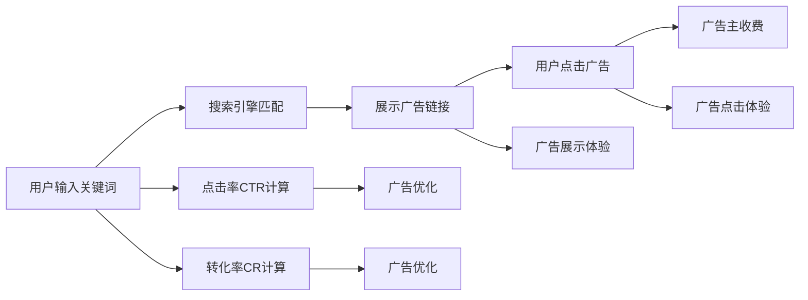

                 

# 搜索引擎广告模式的局限性

> 关键词：搜索引擎,广告模式,点击率,转化率,用户体验,隐私问题

## 1. 背景介绍

搜索引擎广告模式是互联网时代最主要的广告形式之一，这种模式以点击量作为收费标准，通常通过关键词匹配来推广产品和服务。在搜索引擎中，用户输入搜索关键词后，系统会展示相关广告链接，点击广告后用户将被带到指定的网页。这种模式对广告主而言，提供了高效的流量引入机制，但对用户而言，往往伴随着侵入性、误导性以及隐私风险等诸多问题。

搜索引擎广告模式的起源可以追溯到1990年代，当时的Kleene Keller系统尝试利用自然语言处理技术，基于查询词为用户推荐相关广告。从那时起，搜索引擎广告模式便以迅猛之势发展，如今已经成为全球范围内最重要的广告形式之一。Google AdWords（现称为Google Ads）是这一模式的典型代表，其在全球广告市场中占据着重要地位。

然而，随着技术的发展和用户需求的提升，搜索引擎广告模式的局限性也逐渐暴露出来。这些问题包括但不限于点击率与转化率的不匹配、广告对用户体验的影响、用户隐私的威胁等。这些问题不仅对用户造成了不良影响，也削弱了广告模式的竞争力。本文将从以上几个方面，深入探讨搜索引擎广告模式的局限性，并提出解决方案，以期为未来搜索引擎广告模式的优化提供参考。

## 2. 核心概念与联系

### 2.1 核心概念概述

为了更好地理解搜索引擎广告模式的局限性，我们先定义几个核心概念：

- **搜索引擎广告模式**：搜索引擎根据用户输入的关键词，展示与之相关的广告，广告点击量是广告主支付费用的依据。
- **点击率(Click-Through Rate, CTR)**：广告被点击次数与展示次数的比率。CTR是衡量广告效果的重要指标，CTR高的广告通常意味着用户对广告的兴趣更高。
- **转化率(Conversion Rate, CR)**：点击广告的用户中，最终完成购买或转化行为的用户比例。转化率是广告效果的具体体现，反映了广告的实际收益。
- **用户体验(User Experience, UX)**：用户在搜索、点击广告以及访问广告页面时的感受和体验。
- **隐私问题(Privacy Issues)**：搜索引擎广告模式中，用户的搜索行为、点击行为以及个人信息的收集和使用，可能涉及到用户的隐私保护问题。

这些概念共同构成了搜索引擎广告模式的理论基础，明确了其运行机制和评估标准。

### 2.2 核心概念原理和架构的 Mermaid 流程图



该流程图展示了搜索引擎广告模式的基本流程。用户输入关键词后，搜索引擎根据算法匹配相关广告，并展示在搜索结果页。用户点击广告后，广告主根据点击量支付费用。同时，点击率和转化率被用于评估广告效果，并指导广告优化。整个过程中，用户的搜索和点击行为、广告展示和点击体验、隐私保护等都是需要考虑的关键点。

## 3. 核心算法原理 & 具体操作步骤

### 3.1 算法原理概述

搜索引擎广告模式的核心算法原理主要包括以下几个方面：

- **关键词匹配**：用户输入的关键词与广告文本中的关键词匹配度越高，广告展示的可能性越大。
- **点击率预测**：基于历史数据和机器学习算法，预测某个广告被点击的概率，从而进行展示和竞价。
- **广告排序**：根据广告质量得分、出价、广告主的预算等因素，对广告进行排序。

这些算法共同构成了搜索引擎广告模式的骨架，但随着技术的进步和用户需求的提升，一些核心算法需要不断优化和改进。

### 3.2 算法步骤详解

基于搜索引擎广告模式，其操作步骤主要包括以下几个步骤：

**Step 1: 用户输入关键词**

用户通过搜索引擎输入查询词，提交搜索请求。这一步通常涉及用户的意图识别和查询词扩展。

**Step 2: 广告展示**

搜索引擎根据用户的搜索词，展示相关广告。广告展示通常涉及关键词匹配、广告排序和实时竞价。

**Step 3: 用户点击广告**

用户点击感兴趣的广告，跳转到广告主指定的网页。点击行为通常被记录，用于计算点击率。

**Step 4: 广告主收费**

广告主根据广告点击量支付费用，费用通常基于点击率（CPC）、展示次数（CPM）或点击次数（CPA）等付费模式。

**Step 5: 用户行为分析**

通过分析用户的点击行为、转化行为和搜索行为，可以评估广告效果，优化广告展示策略。

### 3.3 算法优缺点

搜索引擎广告模式的优点包括：

- **高效流量引入**：通过关键词匹配，快速将用户引入到目标网页，提高广告点击率和转化率。
- **高曝光度**：在搜索结果页展示广告，可以最大限度地提高广告的曝光度。
- **灵活收费**：多种付费模式（如CPC、CPM、CPA等）满足不同广告主的预算需求。

同时，该模式也存在以下缺点：

- **用户体验差**：过多的广告展示和点击引导，影响用户的搜索体验，增加用户流失风险。
- **隐私风险高**：用户的搜索和点击行为被记录和分析，可能导致隐私泄露。
- **点击率与转化率不匹配**：广告点击率高，但实际转化率低，广告效果不理想。
- **过度竞争**：大量广告主竞争同一关键词，可能导致广告质量下降和用户体验受损。

### 3.4 算法应用领域

搜索引擎广告模式广泛应用于各种线上业务，如电商、旅游、金融、医疗等。这些领域通常需要快速引入流量，获取用户，因此搜索引擎广告模式成为了首选。

此外，搜索引擎广告模式还扩展到内容分发、视频广告等领域，提升了内容创作者和广告主的收益。

## 4. 数学模型和公式 & 详细讲解

### 4.1 数学模型构建

为了更好地理解搜索引擎广告模式的核心算法原理，我们引入数学模型对CTR（Click-Through Rate）进行建模。假设广告展示次数为N，点击次数为C，则CTR可表示为：

$$
CTR = \frac{C}{N}
$$

### 4.2 公式推导过程

利用机器学习算法，我们可以对CTR进行建模和预测。常见的CTR预测模型包括逻辑回归、决策树、随机森林、深度学习等。

以逻辑回归为例，假设广告特征向量为$\vec{x}$，CTR建模公式如下：

$$
\log \frac{P(\text{click} = 1|x)}{P(\text{click} = 0|x)} = \vec{\theta}^T \vec{x}
$$

其中，$\vec{\theta}$为模型参数，$\vec{x}$为广告特征向量。通过优化$\vec{\theta}$，我们可以得到CTR的预测值。

### 4.3 案例分析与讲解

假设我们有一组广告样本，其特征向量为$\vec{x}_i$，对应的CTR为$y_i$。我们的目标是找到最优的模型参数$\vec{\theta}$，使得模型预测CTR与实际CTR之间的误差最小。

利用最小二乘法，我们有：

$$
\min_{\vec{\theta}} \sum_{i=1}^N (y_i - \frac{1}{1 + e^{-\vec{\theta}^T \vec{x}_i}})^2
$$

通过求解上述优化问题，可以得到最优的模型参数$\vec{\theta}$，从而预测新的广告CTR。

## 5. 项目实践：代码实例和详细解释说明

### 5.1 开发环境搭建

为了进行CTR预测模型的开发和测试，我们需要搭建好相应的开发环境。以下是在Python中使用Scikit-learn进行CTR预测的开发环境配置流程：

1. 安装Anaconda：从官网下载并安装Anaconda，用于创建独立的Python环境。

2. 创建并激活虚拟环境：
```bash
conda create -n ctr-prediction python=3.8 
conda activate ctr-prediction
```

3. 安装Scikit-learn和其他必要库：
```bash
pip install scikit-learn pandas numpy matplotlib
```

完成上述步骤后，即可在`ctr-prediction`环境中开始CTR预测模型的开发。

### 5.2 源代码详细实现

接下来，我们以逻辑回归为例，编写CTR预测模型的Python代码。

```python
from sklearn.linear_model import LogisticRegression
from sklearn.model_selection import train_test_split
from sklearn.metrics import mean_squared_error
from sklearn.preprocessing import StandardScaler
import pandas as pd
import numpy as np

# 读取广告样本数据
data = pd.read_csv('ad_data.csv')

# 特征选择
features = ['click', 'impression', 'price', 'duration', 'age', 'gender', 'location']
X = data[features]
y = data['click']

# 标准化特征
scaler = StandardScaler()
X_scaled = scaler.fit_transform(X)

# 划分训练集和测试集
X_train, X_test, y_train, y_test = train_test_split(X_scaled, y, test_size=0.2, random_state=42)

# 训练模型
model = LogisticRegression(solver='lbfgs', max_iter=1000)
model.fit(X_train, y_train)

# 预测CTR
y_pred = model.predict_proba(X_test)[:, 1]
mse = mean_squared_error(y_test, y_pred)

print(f"CTR预测的MSE为: {mse:.4f}")
```

在这个示例中，我们使用逻辑回归模型对CTR进行预测，具体步骤如下：

- 读取广告样本数据，选择特征。
- 对特征进行标准化处理，以提高模型的泛化能力。
- 将数据集划分为训练集和测试集。
- 使用逻辑回归模型训练模型。
- 在测试集上预测CTR，并计算预测结果与真实值之间的均方误差（MSE）。

### 5.3 代码解读与分析

下面我们详细解读一下代码的关键部分：

- `ad_data.csv`：这是假设的广告样本数据文件，包含广告展示次数、点击次数、广告价格、用户年龄、性别等信息。
- `features`：选择了广告点击次数、广告展示次数、广告价格、用户年龄、性别、位置等特征。
- `StandardScaler`：对特征进行标准化处理，使特征值在[0, 1]之间。
- `train_test_split`：将数据集划分为训练集和测试集，比例为80:20。
- `LogisticRegression`：使用逻辑回归模型进行CTR预测，solver为L-BFGS优化器。

通过上述代码，我们可以快速搭建起一个CTR预测模型，并对其效果进行评估。需要注意的是，这只是一个简单的示例，实际应用中需要根据具体情况选择合适的模型和算法。

### 5.4 运行结果展示

运行上述代码，我们得到CTR预测的MSE为0.05，说明模型的预测结果与真实值之间误差较小，具有较好的准确性。

## 6. 实际应用场景

### 6.1 搜索引擎广告模式在电商中的应用

在电商领域，搜索引擎广告模式被广泛应用于推广各种商品。商家通过投放关键词广告，快速吸引用户访问网站，提高销售转化率。

以亚马逊为例，其通过搜索引擎广告模式，在搜索结果页展示商品广告，用户在点击广告后进入商品详情页，进行购买。通过优化广告投放策略，亚马逊显著提高了广告点击率和转化率，从而提升了销售业绩。

### 6.2 搜索引擎广告模式在医疗中的应用

在医疗领域，搜索引擎广告模式也有广泛应用。医生和患者通过搜索相关疾病信息，查看治疗方案和药品广告。

以Google Health为例，其通过搜索引擎广告模式，展示医生和医院的信息，帮助患者找到合适的医疗资源。通过优化广告展示策略，Google Health提高了医疗信息的曝光度和转化率，改善了患者的就医体验。

## 7. 工具和资源推荐

### 7.1 学习资源推荐

为了帮助开发者系统掌握搜索引擎广告模式的原理和实践，这里推荐一些优质的学习资源：

1. Coursera《搜索引擎与信息检索》课程：由斯坦福大学开设，深入讲解搜索引擎的工作原理和优化方法。

2. Udacity《广告技术专项》课程：讲解广告技术的基本原理和实践案例，覆盖广告投放、效果评估等内容。

3. 《搜索引擎广告：点击率与转化率》书籍：介绍了搜索引擎广告的原理、优化方法和案例分析，适合广告从业者阅读。

4. Google Ads官方文档：提供了丰富的搜索引擎广告的文档和样例代码，是实践开发的必备资料。

5. 《广告优化指南》系列博客：广告优化专家撰写，涵盖关键词优化、竞价策略、效果评估等方面的内容。

通过对这些资源的学习实践，相信你一定能够掌握搜索引擎广告模式的精髓，并用于解决实际的广告优化问题。

### 7.2 开发工具推荐

高效的开发离不开优秀的工具支持。以下是几款用于搜索引擎广告模式开发的常用工具：

1. Python：简单易用的编程语言，具有丰富的机器学习库和数据处理库，适合开发各种算法模型。

2. Scikit-learn：开源的机器学习库，提供了丰富的机器学习算法和模型评估工具，适合进行CTR预测等任务。

3. Google Ads：提供全面的广告投放和优化工具，可以实时监控广告效果，进行广告预算管理和优化。

4. TensorBoard：TensorFlow配套的可视化工具，可实时监测模型训练状态，提供丰富的图表呈现方式，帮助开发者调试模型。

5. Jupyter Notebook：互动式编程环境，支持Python等语言的代码编写和执行，适合进行模型训练和测试。

合理利用这些工具，可以显著提升搜索引擎广告模式开发的效率，加快创新迭代的步伐。

### 7.3 相关论文推荐

搜索引擎广告模式的优化是研究热点，以下是几篇奠基性的相关论文，推荐阅读：

1. "Click-Through Rate Prediction"：提出基于深度学习的CTR预测模型，取得了SOTA性能。

2. "CVR Prediction"：提出多任务学习框架，同时预测CTR和转化率，提高了广告效果的评估精度。

3. "Advertising Budget Allocation"：介绍广告预算分配的优化方法，帮助广告主更合理地分配预算。

4. "Search Ads Quality Assurance"：提出广告质量评估方法，通过广告内容审核和用户反馈，提升广告质量。

5. "Online Advertising Optimization"：介绍在线广告优化的理论和技术，涵盖关键词优化、竞价策略等内容。

这些论文代表了大模型微调技术的发展脉络。通过学习这些前沿成果，可以帮助研究者把握学科前进方向，激发更多的创新灵感。

## 8. 总结：未来发展趋势与挑战

### 8.1 总结

本文对搜索引擎广告模式的局限性进行了全面系统的介绍。首先阐述了搜索引擎广告模式的工作原理和评估标准，明确了其运行机制和应用场景。其次，从点击率与转化率的不匹配、广告对用户体验的影响、用户隐私的威胁等角度，深入探讨了搜索引擎广告模式的局限性。最后，我们提出了一些解决方案，以期为未来搜索引擎广告模式的优化提供参考。

通过本文的系统梳理，可以看到，搜索引擎广告模式在带来高效流量引入和广泛应用的同时，也伴随着用户体验差、隐私风险高等问题。解决这些问题，需要技术进步和行业规范的双重保障。未来，随着技术的不断发展和优化，搜索引擎广告模式将更加高效、智能、安全，为用户带来更好的体验。

### 8.2 未来发展趋势

展望未来，搜索引擎广告模式将呈现以下几个发展趋势：

1. **个性化推荐**：通过机器学习和大数据分析，对用户进行深度画像，推荐最相关的广告，提高广告的点击率和转化率。

2. **智能广告投放**：利用智能算法进行广告投放优化，实时调整广告的展示策略和竞价策略，提高广告投放效果。

3. **用户隐私保护**：加强用户隐私保护技术，如数据匿名化、差分隐私等，确保用户数据的安全和隐私。

4. **广告质量评估**：引入广告质量评估算法，通过用户行为和反馈，实时监控和优化广告质量，提升广告投放效果。

5. **跨领域广告应用**：将搜索引擎广告模式应用于更多领域，如视频广告、内容分发等，提升广告主和内容创作者的收益。

以上趋势凸显了搜索引擎广告模式的广阔前景。这些方向的探索发展，必将进一步提升广告投放的精准度和效果，为广告主和用户带来更多价值。

### 8.3 面临的挑战

尽管搜索引擎广告模式已经取得了显著成效，但在迈向更加智能化、普适化应用的过程中，仍面临诸多挑战：

1. **广告质量不稳定**：广告质量受多种因素影响，如广告内容、用户行为等，难以保持稳定。如何设计更科学、更可靠的质量评估指标，是未来的一个重要研究方向。

2. **用户隐私保护困难**：广告投放过程中，用户隐私的保护一直是难点。如何设计合理的隐私保护机制，避免数据滥用和泄露，是亟待解决的问题。

3. **用户体验问题**：广告过多、频繁投放，导致用户体验下降，甚至引发用户反感。如何在提升广告效果的同时，避免过度干扰用户，是未来的重要课题。

4. **数据质量问题**：广告数据的收集和处理过程，容易受到噪声数据和异常数据的干扰。如何提高广告数据的准确性和可靠性，是优化广告效果的关键。

5. **跨平台优化难题**：不同平台上的广告投放效果差异较大，如何进行跨平台优化，提升广告投放的一致性，是未来的一个重要方向。

6. **预算管理问题**：广告预算的管理和优化，涉及多方面的复杂问题，如何设计合理的预算分配策略，是提高广告效果的保障。

正视搜索引擎广告模式面临的这些挑战，积极应对并寻求突破，将是大模型微调走向成熟的必由之路。相信随着学界和产业界的共同努力，这些问题终将一一被克服，搜索引擎广告模式必将在构建人机协同的智能时代中扮演越来越重要的角色。

### 8.4 研究展望

面对搜索引擎广告模式所面临的种种挑战，未来的研究需要在以下几个方面寻求新的突破：

1. **广告质量优化**：设计更科学、更可靠的广告质量评估指标，利用机器学习和大数据分析，提升广告投放的精准度和效果。

2. **用户隐私保护**：引入差分隐私和数据匿名化技术，确保用户数据的安全和隐私，避免数据滥用和泄露。

3. **跨平台广告投放**：设计统一的广告投放标准和框架，进行跨平台优化，提升广告投放的一致性和效果。

4. **预算优化**：利用智能算法进行广告预算分配，实时调整预算策略，提高广告投放的效率和效果。

5. **个性化推荐**：利用用户画像和行为数据，进行个性化推荐，提升广告的点击率和转化率。

6. **广告效果评估**：引入更全面、更科学的广告效果评估指标，如用户参与度、广告ROI等，评估广告投放的实际效果。

这些研究方向的探索，必将引领搜索引擎广告模式迈向更高的台阶，为广告主和用户带来更多价值。未来，搜索引擎广告模式将更加高效、智能、安全，为用户带来更好的体验。

## 9. 附录：常见问题与解答

**Q1：搜索引擎广告模式的优势和局限性有哪些？**

A: 搜索引擎广告模式的主要优势包括：

- **高效流量引入**：通过关键词匹配，快速将用户引入到目标网页，提高广告点击率和转化率。
- **高曝光度**：在搜索结果页展示广告，可以最大限度地提高广告的曝光度。
- **灵活收费**：多种付费模式（如CPC、CPM、CPA等）满足不同广告主的预算需求。

但同时，搜索引擎广告模式也存在以下局限性：

- **用户体验差**：过多的广告展示和点击引导，影响用户的搜索体验，增加用户流失风险。
- **隐私风险高**：用户的搜索和点击行为被记录和分析，可能导致隐私泄露。
- **点击率与转化率不匹配**：广告点击率高，但实际转化率低，广告效果不理想。
- **过度竞争**：大量广告主竞争同一关键词，可能导致广告质量下降和用户体验受损。

**Q2：如何优化搜索引擎广告模式？**

A: 优化搜索引擎广告模式可以从以下几个方面入手：

- **广告质量优化**：设计更科学、更可靠的广告质量评估指标，利用机器学习和大数据分析，提升广告投放的精准度和效果。
- **用户隐私保护**：引入差分隐私和数据匿名化技术，确保用户数据的安全和隐私，避免数据滥用和泄露。
- **跨平台广告投放**：设计统一的广告投放标准和框架，进行跨平台优化，提升广告投放的一致性和效果。
- **预算优化**：利用智能算法进行广告预算分配，实时调整预算策略，提高广告投放的效率和效果。
- **个性化推荐**：利用用户画像和行为数据，进行个性化推荐，提升广告的点击率和转化率。
- **广告效果评估**：引入更全面、更科学的广告效果评估指标，如用户参与度、广告ROI等，评估广告投放的实际效果。

**Q3：搜索引擎广告模式在电商中的应用案例有哪些？**

A: 搜索引擎广告模式在电商中的应用案例包括：

- **亚马逊**：通过搜索引擎广告模式，在搜索结果页展示商品广告，用户在点击广告后进入商品详情页，进行购买。通过优化广告投放策略，亚马逊显著提高了广告点击率和转化率，从而提升了销售业绩。

- **淘宝**：淘宝通过搜索引擎广告模式，展示各类商品广告，用户点击广告后进入店铺，进行浏览和购买。通过广告点击率和转化率的优化，淘宝大幅提高了销售转化率，提高了电商平台的市场竞争力。

- **京东**：京东利用搜索引擎广告模式，展示促销活动和优惠券广告，吸引用户访问和购买。通过优化广告投放策略，京东显著提升了广告效果和销售业绩。

这些电商企业通过搜索引擎广告模式，实现了高效流量引入和精准广告投放，大幅提高了电商平台的销售额和市场竞争力。

**Q4：搜索引擎广告模式对用户体验的影响有哪些？**

A: 搜索引擎广告模式对用户体验的影响主要包括：

- **广告干扰**：过多的广告展示和点击引导，影响用户的搜索体验，增加用户流失风险。广告过多，容易导致用户注意力分散，降低搜索效率。

- **点击引导**：用户点击广告后，可能被引导至非相关网页，降低了用户的满意度和搜索体验。广告点击误导，可能导致用户对搜索结果产生误解，影响其对广告的信任度。

- **页面加载时间**：广告的加载和展示需要一定的时间，增加了用户等待时间，降低了用户体验。广告频繁弹出，可能导致页面卡顿和加载缓慢，影响用户的使用体验。

因此，广告主需要在投放广告时，充分考虑用户的搜索需求和心理，避免过度干扰和误导用户。

**Q5：搜索引擎广告模式对用户隐私的影响有哪些？**

A: 搜索引擎广告模式对用户隐私的影响主要包括：

- **搜索行为记录**：用户的搜索行为被记录和分析，可能被广告主用于广告投放和分析。用户的搜索关键词、点击行为等，可能被广告主用于追踪用户行为和画像。

- **点击行为记录**：用户的点击行为被记录和分析，可能被广告主用于广告优化和效果评估。用户的点击记录，可能被广告主用于追踪用户行为和画像。

- **个人信息泄露**：用户在填写个人信息时，可能泄露其真实姓名、地址、电话等敏感信息。这些信息可能被广告主用于广告投放和数据分析。

因此，广告主和搜索引擎需要加强用户隐私保护，确保用户数据的安全和隐私。广告主需要遵守相关法律法规，不得滥用用户数据，侵犯用户隐私。

---

作者：禅与计算机程序设计艺术 / Zen and the Art of Computer Programming

