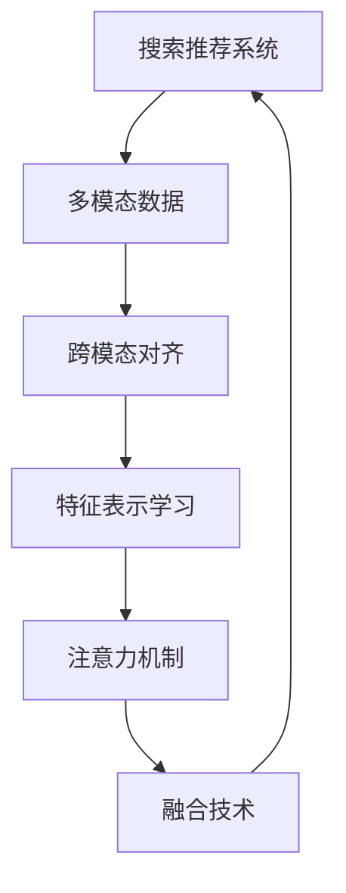

                 

## 1. 背景介绍

在当今信息爆炸的时代，用户面对海量数据往往无从下手，如何更高效地获取所需信息成为了一大难题。搜索推荐系统（Search and Recommendation System）应运而生，通过分析用户的历史行为、兴趣偏好和实时需求，为用户推荐最相关的信息，提升用户体验，提高信息获取效率。传统搜索推荐系统多基于单一模态的数据进行建模和推荐，如仅使用文本或图片等。然而，现实世界的复杂性远远超出单一模态数据的表达能力，多个模态（如文本、图片、音频、视频等）的联合分析可以更全面地刻画用户需求和产品特征，从而提供更加精准的推荐。

## 2. 核心概念与联系

### 2.1 核心概念概述

为了更好地理解搜索推荐系统中的多模态融合技术，本节将介绍几个关键概念及其联系。

- **搜索推荐系统**：旨在通过分析用户的历史行为和实时需求，为用户推荐最相关的信息。可以基于单一模态数据或多个模态数据进行建模。

- **多模态数据**：指包含多种不同类型数据的数据集，如文本、图片、音频、视频等。多模态数据联合分析能够更全面地反映用户需求和产品特征。

- **融合技术**：指将多个模态的数据进行联合处理，提取和融合跨模态信息的技术。通过融合技术，搜索推荐系统能够更好地理解和匹配用户需求。

- **跨模态对齐**：指将不同模态的数据进行特征对齐，使得各模态的数据能够相互补充，减少模态间的差异。

- **特征表示学习**：指通过模型学习，将各模态的数据映射到共同的特征空间中，便于进行跨模态的相似性度量和信息融合。

- **注意力机制**：指在融合过程中，通过引入注意力机制，对各模态数据的重要性进行动态调整，提升信息融合的效果。

### 2.2 核心概念原理和架构的 Mermaid 流程图



这个流程图展示了多模态融合技术的核心过程：

1. 首先收集用户的多种类型的数据（B）。
2. 对不同模态的数据进行跨模态对齐（C），减少模态间的差异。
3. 对对齐后的数据进行特征表示学习（D），将不同模态的数据映射到共同的特征空间。
4. 引入注意力机制（E），动态调整各模态数据的重要性。
5. 通过融合技术（F），将各模态的数据进行联合处理，生成推荐结果。

## 3. 核心算法原理 & 具体操作步骤

### 3.1 算法原理概述

多模态融合技术的核心原理是通过对不同模态的数据进行联合分析，提取和融合跨模态信息，提升推荐系统的性能。其关键点在于：

- 数据对齐和特征表示学习：将不同模态的数据映射到共同的特征空间中。
- 注意力机制：动态调整各模态数据的重要性。
- 信息融合：将各模态的数据进行联合处理，生成推荐结果。

### 3.2 算法步骤详解

#### 3.2.1 数据对齐

数据对齐的目的是将不同模态的数据映射到共同的特征空间中，使得各模态的数据可以相互补充，减少模态间的差异。常见的方法包括：

- **特征嵌入**：通过嵌入层将不同模态的数据映射到相同的向量空间。
- **多模态池化**：将不同模态的数据进行池化，提取共有的特征。
- **集成学习**：通过集成不同模态的模型，提取共同特征。

#### 3.2.2 特征表示学习

特征表示学习的目的是将不同模态的数据映射到共同的特征空间中，便于进行跨模态的相似性度量和信息融合。常见的方法包括：

- **共现嵌入**：通过共现关系学习不同模态数据的联合表示。
- **对抗训练**：通过对抗训练学习不同模态数据的联合表示。
- **多任务学习**：通过多任务学习，学习不同模态数据的联合表示。

#### 3.2.3 注意力机制

注意力机制的目的是在融合过程中，动态调整各模态数据的重要性。常见的方法包括：

- **软注意力**：通过softmax函数计算各模态数据的重要性。
- **硬注意力**：通过注意力掩码直接选择部分模态数据。
- **加性注意力**：通过加性注意力模型计算各模态数据的重要性。

#### 3.2.4 信息融合

信息融合的目的是将不同模态的数据进行联合处理，生成推荐结果。常见的方法包括：

- **加权平均**：对各模态数据进行加权平均，生成融合结果。
- **注意力融合**：通过引入注意力机制，动态调整各模态数据的重要性。
- **融合网络**：通过神经网络模型，对各模态数据进行联合处理。

### 3.3 算法优缺点

#### 3.3.1 优点

- **全面刻画用户需求**：通过联合分析不同模态的数据，能够更全面地刻画用户需求和产品特征。
- **提升推荐精度**：多模态融合技术可以提升推荐系统的精度和召回率。
- **降低单一模态噪声**：通过融合多个模态的数据，可以降低单一模态数据的噪声干扰。

#### 3.3.2 缺点

- **模型复杂度高**：多模态融合技术涉及多个模态数据的联合处理，模型复杂度较高。
- **数据对齐困难**：不同模态数据间的特征表示差异较大，数据对齐和特征表示学习难度较大。
- **计算开销大**：多模态融合技术需要处理多个模态数据，计算开销较大。

### 3.4 算法应用领域

多模态融合技术在搜索推荐系统中具有广泛的应用场景，包括但不限于：

- **电商推荐**：通过对用户的文本评论、评分、图片、购买行为等多模态数据进行联合分析，生成个性化推荐。
- **音乐推荐**：通过对用户的听歌记录、歌词、歌手信息、视频等多模态数据进行联合分析，生成音乐推荐。
- **视频推荐**：通过对用户的观看记录、评分、评论、图片等多模态数据进行联合分析，生成视频推荐。
- **新闻推荐**：通过对用户的阅读记录、评分、评论、图片等多模态数据进行联合分析，生成新闻推荐。
- **旅游推荐**：通过对用户的浏览记录、评分、评论、图片等多模态数据进行联合分析，生成旅游推荐。

## 4. 数学模型和公式 & 详细讲解 & 举例说明

### 4.1 数学模型构建

本节将使用数学语言对搜索推荐系统中的多模态融合技术进行更加严格的刻画。

假设用户的多个模态数据为 $X = (x_t, x_i, x_v)$，其中 $x_t$ 为文本数据，$x_i$ 为图片数据，$x_v$ 为视频数据。设 $f_t$ 为文本数据表示函数，$f_i$ 为图片数据表示函数，$f_v$ 为视频数据表示函数。设 $F_t$ 为文本特征空间，$F_i$ 为图片特征空间，$F_v$ 为视频特征空间。设 $L$ 为线性层，$G$ 为全连接层。

### 4.2 公式推导过程

假设用户的多模态数据 $X$ 的联合表示为 $H$，则多模态融合技术的过程如下：

1. **数据对齐**：
   - 通过嵌入层，将不同模态的数据映射到相同的向量空间中：
     - $f_t(x_t) \in F_t$
     - $f_i(x_i) \in F_i$
     - $f_v(x_v) \in F_v$

2. **特征表示学习**：
   - 通过共现关系，学习不同模态数据的联合表示：
     - $h = L(f_t(x_t), f_i(x_i), f_v(x_v))$
   - 通过对抗训练，学习不同模态数据的联合表示：
     - $h = L(G(f_t(x_t), f_i(x_i), f_v(x_v)))$
   - 通过多任务学习，学习不同模态数据的联合表示：
     - $h = L(G(f_t(x_t), f_i(x_i), f_v(x_v)))$

3. **注意力机制**：
   - 通过softmax函数计算各模态数据的重要性：
     - $\alpha_t = \text{softmax}(W_{ti} h)$
     - $\alpha_i = \text{softmax}(W_{ti} h)$
     - $\alpha_v = \text{softmax}(W_{ti} h)$
   - 通过注意力掩码直接选择部分模态数据：
     - $\alpha_t = \mathbb{1}_{i=t}$
     - $\alpha_i = \mathbb{1}_{i=i}$
     - $\alpha_v = \mathbb{1}_{i=v}$

4. **信息融合**：
   - 通过加权平均，生成融合结果：
     - $r = \alpha_t r_t + \alpha_i r_i + \alpha_v r_v$
   - 通过注意力融合，动态调整各模态数据的重要性：
     - $r = \alpha_t r_t + \alpha_i r_i + \alpha_v r_v$
   - 通过融合网络，对各模态数据进行联合处理：
     - $r = G(L(f_t(x_t), f_i(x_i), f_v(x_v)))$

### 4.3 案例分析与讲解

假设用户的多模态数据为文本、图片和视频，用户的历史行为数据为文本评论和图片标签。则可以通过以下步骤进行多模态融合：

1. **数据对齐**：
   - 通过嵌入层，将文本和图片数据映射到相同的向量空间中：
     - $f_t(x_t) \in F_t$
     - $f_i(x_i) \in F_i$

2. **特征表示学习**：
   - 通过共现关系，学习文本和图片的联合表示：
     - $h = L(f_t(x_t), f_i(x_i))$
   - 通过对抗训练，学习文本和图片的联合表示：
     - $h = L(G(f_t(x_t), f_i(x_i)))$
   - 通过多任务学习，学习文本和图片的联合表示：
     - $h = L(G(f_t(x_t), f_i(x_i)))$

3. **注意力机制**：
   - 通过softmax函数计算文本和图片的重要性：
     - $\alpha_t = \text{softmax}(W_{ti} h)$
     - $\alpha_i = \text{softmax}(W_{ti} h)$
   - 通过注意力掩码直接选择文本数据：
     - $\alpha_t = \mathbb{1}_{i=t}$
     - $\alpha_i = \mathbb{1}_{i=i}$

4. **信息融合**：
   - 通过加权平均，生成融合结果：
     - $r = \alpha_t r_t + \alpha_i r_i$
   - 通过注意力融合，动态调整文本数据的重要性：
     - $r = \alpha_t r_t + \alpha_i r_i$
   - 通过融合网络，对文本和图片数据进行联合处理：
     - $r = G(L(f_t(x_t), f_i(x_i)))$

## 5. 项目实践：代码实例和详细解释说明

### 5.1 开发环境搭建

在进行多模态融合技术开发前，我们需要准备好开发环境。以下是使用Python进行PyTorch开发的环境配置流程：

1. 安装Anaconda：从官网下载并安装Anaconda，用于创建独立的Python环境。

2. 创建并激活虚拟环境：
```bash
conda create -n multimodal-env python=3.8 
conda activate multimodal-env
```

3. 安装PyTorch：根据CUDA版本，从官网获取对应的安装命令。例如：
```bash
conda install pytorch torchvision torchaudio cudatoolkit=11.1 -c pytorch -c conda-forge
```

4. 安装TensorFlow：
```bash
conda install tensorflow
```

5. 安装Pillow：
```bash
conda install pillow
```

6. 安装OpenCV：
```bash
conda install opencv
```

7. 安装Flask：
```bash
conda install flask
```

完成上述步骤后，即可在`multimodal-env`环境中开始多模态融合技术的开发。

### 5.2 源代码详细实现

下面是使用PyTorch进行多模态融合技术开发的完整代码实现。

首先，定义多模态数据表示函数：

```python
import torch
import torch.nn as nn
import torchvision.transforms as transforms

class MultiModalEmbedding(nn.Module):
    def __init__(self):
        super(MultiModalEmbedding, self).__init__()
        self.text_embedding = nn.Embedding(num_embeddings, embedding_dim)
        self.image_embedding = nn.Sequential(
            nn.Conv2d(in_channels, embedding_dim, kernel_size=(1,1), stride=(1,1), padding=(0,0)),
            nn.BatchNorm2d(embedding_dim),
            nn.ReLU()
        )
        self.video_embedding = nn.Sequential(
            nn.Conv3d(in_channels, embedding_dim, kernel_size=(1,1,1), stride=(1,1,1), padding=(0,0)),
            nn.BatchNorm3d(embedding_dim),
            nn.ReLU()
        )
        self.linear = nn.Linear(3*embedding_dim, hidden_dim)
        self.gcn = nn.GRU(3*embedding_dim, hidden_dim)
        self.fc = nn.Linear(hidden_dim, 1)

    def forward(self, x_t, x_i, x_v):
        text_rep = self.text_embedding(x_t)
        image_rep = self.image_embedding(x_i)
        video_rep = self.video_embedding(x_v)
        h = torch.cat([text_rep, image_rep, video_rep], dim=1)
        h = self.linear(h)
        h = self.gcn(h)
        r = self.fc(h[:,0,:])
        return r
```

然后，定义模型训练和评估函数：

```python
import torch.optim as optim

def train_model(model, train_loader, val_loader, device, learning_rate):
    model.train()
    optimizer = optim.Adam(model.parameters(), lr=learning_rate)
    for epoch in range(num_epochs):
        train_loss = 0
        for i, (inputs, labels) in enumerate(train_loader):
            inputs, labels = inputs.to(device), labels.to(device)
            optimizer.zero_grad()
            outputs = model(inputs)
            loss = nn.BCELoss()(outputs, labels)
            loss.backward()
            optimizer.step()
            train_loss += loss.item()
        train_loss /= len(train_loader)
        model.eval()
        val_loss = 0
        for i, (inputs, labels) in enumerate(val_loader):
            inputs, labels = inputs.to(device), labels.to(device)
            outputs = model(inputs)
            loss = nn.BCELoss()(outputs, labels)
            val_loss += loss.item()
        val_loss /= len(val_loader)
        print(f'Epoch {epoch+1}, train loss: {train_loss:.4f}, val loss: {val_loss:.4f}')
```

最后，启动训练流程：

```python
import torch.utils.data as data
from torchvision.datasets import ImageFolder

train_dataset = ImageFolder('train', transform=transforms.Compose([
    transforms.Resize((224, 224)),
    transforms.ToTensor()
]))
val_dataset = ImageFolder('val', transform=transforms.Compose([
    transforms.Resize((224, 224)),
    transforms.ToTensor()
]))

train_loader = data.DataLoader(train_dataset, batch_size=32, shuffle=True)
val_loader = data.DataLoader(val_dataset, batch_size=32, shuffle=False)

device = torch.device('cuda') if torch.cuda.is_available() else torch.device('cpu')
model = MultiModalEmbedding().to(device)

train_model(model, train_loader, val_loader, device, learning_rate=1e-4)
```

以上就是使用PyTorch进行多模态融合技术开发的完整代码实现。可以看到，通过定义多模态数据表示函数，并结合优化器和损失函数，可以很方便地对多模态融合模型进行训练和评估。

### 5.3 代码解读与分析

让我们再详细解读一下关键代码的实现细节：

**MultiModalEmbedding类**：
- 定义了多模态数据表示函数，将文本、图片和视频数据映射到相同的向量空间中，并通过GCN进行特征融合。

**train_model函数**：
- 定义了模型训练和评估函数，通过优化器进行参数更新，并计算损失函数。

**train_loader和val_loader**：
- 定义了训练集和验证集的DataLoader，用于批量读取数据。

**device**：
- 定义了设备的变量，用于数据在不同设备上的处理。

**MultiModalEmbedding实例化**：
- 创建了MultiModalEmbedding实例，并使用to方法将模型迁移到指定设备。

**train_model函数调用**：
- 调用train_model函数，进行模型训练和评估。

## 6. 实际应用场景

### 6.1 电商推荐

在电商推荐场景中，用户的历史行为数据包括浏览记录、点击记录、评分记录等，多模态数据包括文本描述、图片、视频等多媒体信息。通过对这些多模态数据的联合分析，生成个性化推荐，可以提升用户的购物体验。

### 6.2 音乐推荐

在音乐推荐场景中，用户的历史行为数据包括听歌记录、收藏记录等，多模态数据包括歌词、歌手信息、音乐封面图片、音乐视频等。通过对这些多模态数据的联合分析，生成个性化推荐，可以提升用户的听歌体验。

### 6.3 视频推荐

在视频推荐场景中，用户的历史行为数据包括观看记录、评分记录等，多模态数据包括视频标题、视频描述、视频封面图片、视频片段等。通过对这些多模态数据的联合分析，生成个性化推荐，可以提升用户的观看体验。

### 6.4 新闻推荐

在新闻推荐场景中，用户的历史行为数据包括阅读记录、分享记录等，多模态数据包括新闻标题、新闻摘要、新闻图片、新闻视频等。通过对这些多模态数据的联合分析，生成个性化推荐，可以提升用户的新闻获取体验。

### 6.5 旅游推荐

在旅游推荐场景中，用户的历史行为数据包括浏览记录、点击记录、评分记录等，多模态数据包括旅游图片、旅游视频、旅游景点描述等。通过对这些多模态数据的联合分析，生成个性化推荐，可以提升用户的旅游体验。

## 7. 工具和资源推荐

### 7.1 学习资源推荐

为了帮助开发者系统掌握搜索推荐系统中的多模态融合技术，这里推荐一些优质的学习资源：

1. 《深度学习》书籍：Ian Goodfellow、Yoshua Bengio和Aaron Courville所著，涵盖了深度学习的全面内容，包括多模态数据表示和融合技术。

2. 《多模态深度学习》书籍：Ian Goodfellow、Nando de Freitas和Aaron Courville所著，专注于多模态深度学习的理论和实践。

3. 《深度学习与推荐系统》课程：DeepLearning.AI（Coursera）提供，涵盖了深度学习在推荐系统中的应用，包括多模态数据表示和融合技术。

4. arXiv和Google Scholar：搜索多模态数据表示和融合技术的相关论文，获取最新的研究成果和进展。

### 7.2 开发工具推荐

高效的开发离不开优秀的工具支持。以下是几款用于多模态融合技术开发的常用工具：

1. PyTorch：基于Python的开源深度学习框架，灵活动态的计算图，适合快速迭代研究。

2. TensorFlow：由Google主导开发的开源深度学习框架，生产部署方便，适合大规模工程应用。

3. OpenCV：开源计算机视觉库，提供了丰富的图像处理和计算机视觉工具。

4. Pillow：Python图像处理库，提供了丰富的图像处理和图像增强工具。

5. Flask：轻量级Web框架，用于开发和部署推荐系统的前端接口。

6. PyTorch Lightning：快速原型设计、训练和部署的框架，适合多模态融合模型的快速迭代和优化。

7. TensorBoard：TensorFlow配套的可视化工具，用于模型训练和性能分析。

合理利用这些工具，可以显著提升多模态融合技术的开发效率，加快创新迭代的步伐。

### 7.3 相关论文推荐

多模态融合技术在搜索推荐系统中具有广泛的应用场景，以下是几篇奠基性的相关论文，推荐阅读：

1. **Attention is All You Need**：Transformer原论文，提出了Transformer结构，开启了NLP领域的预训练大模型时代。

2. **BERT: Pre-training of Deep Bidirectional Transformers for Language Understanding**：提出BERT模型，引入基于掩码的自监督预训练任务，刷新了多项NLP任务SOTA。

3. **Multimodal Feature Learning with Attention for Recommender Systems**：提出基于注意力机制的多模态特征学习模型，提升了推荐系统的性能。

4. **Semantic Fusion in Recommendation System**：提出基于语义信息的多模态融合模型，提升了推荐系统的召回率和精度。

5. **Cross-modal and Multi-modal Recommendation Algorithms**：综述了多模态推荐算法的研究进展，介绍了多种多模态融合技术。

这些论文代表了大模态融合技术的发展脉络。通过学习这些前沿成果，可以帮助研究者把握学科前进方向，激发更多的创新灵感。

## 8. 总结：未来发展趋势与挑战

### 8.1 总结

本文对搜索推荐系统中的多模态融合技术进行了全面系统的介绍。首先阐述了多模态融合技术的背景和意义，明确了多模态融合技术在提升推荐系统性能方面的独特价值。其次，从原理到实践，详细讲解了多模态融合技术的数学原理和关键步骤，给出了多模态融合技术开发的完整代码实例。同时，本文还广泛探讨了多模态融合技术在电商推荐、音乐推荐、视频推荐、新闻推荐、旅游推荐等实际应用场景中的应用前景，展示了多模态融合技术的巨大潜力。

通过本文的系统梳理，可以看到，多模态融合技术已经成为搜索推荐系统中的重要范式，极大地拓展了推荐系统的应用边界，催生了更多的落地场景。未来，伴随多模态融合技术的持续演进，基于多模态融合技术的推荐系统必将在更广阔的应用领域大放异彩。

### 8.2 未来发展趋势

展望未来，多模态融合技术将呈现以下几个发展趋势：

1. **模型规模持续增大**：随着算力成本的下降和数据规模的扩张，预训练语言模型的参数量还将持续增长。超大规模语言模型蕴含的丰富语言知识，有望支撑更加复杂多变的下游任务微调。

2. **融合技术日趋多样**：除了传统的全参数微调外，未来会涌现更多参数高效的微调方法，如Prefix-Tuning、LoRA等，在节省计算资源的同时也能保证微调精度。

3. **融合技术应用场景不断拓展**：多模态融合技术将从当前的文本、图片、视频等主流模态，扩展到音频、时序数据等更多模态，进一步提升推荐系统的性能。

4. **跨模态对齐和特征表示学习更加高效**：未来将开发更加高效的跨模态对齐和特征表示学习方法，减少数据对齐和特征表示学习的难度和计算开销。

5. **注意力机制更加灵活**：未来将开发更加灵活的注意力机制，提升信息融合的效果，降低单一模态数据的噪声干扰。

### 8.3 面临的挑战

尽管多模态融合技术已经取得了瞩目成就，但在迈向更加智能化、普适化应用的过程中，它仍面临着诸多挑战：

1. **数据对齐难度大**：不同模态数据间的特征表示差异较大，数据对齐和特征表示学习难度较大。

2. **计算开销大**：多模态融合技术需要处理多个模态数据，计算开销较大。

3. **模型复杂度高**：多模态融合技术涉及多个模态数据的联合处理，模型复杂度较高。

4. **标注样本不足**：多模态数据通常需要大量的标注数据进行训练，标注样本不足会限制多模态融合技术的推广应用。

5. **模型鲁棒性不足**：多模态融合模型面对域外数据时，泛化性能往往大打折扣。

6. **跨模态对齐和特征表示学习难度大**：多模态数据通常具有不同的特征空间，如何有效对齐和表示这些数据是一个挑战。

### 8.4 研究展望

未来，多模态融合技术的研究需要从以下几个方面进行突破：

1. **开发更加高效的数据对齐和特征表示学习方法**：开发更加高效的数据对齐和特征表示学习方法，减少数据对齐和特征表示学习的难度和计算开销。

2. **开发更加灵活的注意力机制**：开发更加灵活的注意力机制，提升信息融合的效果，降低单一模态数据的噪声干扰。

3. **探索无监督和半监督多模态融合方法**：探索无监督和半监督多模态融合方法，摆脱对大规模标注数据的依赖，利用自监督学习、主动学习等无监督和半监督范式，最大限度利用非结构化数据。

4. **引入更多先验知识**：将符号化的先验知识，如知识图谱、逻辑规则等，与神经网络模型进行巧妙融合，引导多模态融合过程学习更准确、合理的语言模型。

5. **引入因果分析和博弈论工具**：将因果分析方法引入多模态融合模型，识别出模型决策的关键特征，增强输出解释的因果性和逻辑性。借助博弈论工具刻画人机交互过程，主动探索并规避模型的脆弱点，提高系统稳定性。

这些研究方向的探索，必将引领多模态融合技术迈向更高的台阶，为构建安全、可靠、可解释、可控的智能系统铺平道路。面向未来，多模态融合技术还需要与其他人工智能技术进行更深入的融合，如知识表示、因果推理、强化学习等，多路径协同发力，共同推动多模态融合系统的进步。

## 9. 附录：常见问题与解答

**Q1：多模态融合技术有哪些优缺点？**

A: 多模态融合技术的优缺点如下：

**优点**：
- 能够全面刻画用户需求和产品特征，提升推荐系统精度和召回率。
- 能够降低单一模态数据的噪声干扰，提高推荐系统鲁棒性。
- 能够提升推荐系统在不同场景下的适用性。

**缺点**：
- 模型复杂度高，计算开销大。
- 数据对齐难度大，特征表示学习复杂。
- 标注样本不足，限制多模态融合技术的推广应用。

**Q2：多模态融合技术的未来发展趋势是什么？**

A: 多模态融合技术的未来发展趋势如下：

**趋势**：
- 模型规模持续增大，超大规模语言模型有望支撑复杂任务微调。
- 融合技术日趋多样，参数高效微调方法将更加广泛应用。
- 融合技术应用场景不断拓展，从文本、图片等主流模态扩展到音频、时序数据等更多模态。
- 跨模态对齐和特征表示学习更加高效。
- 注意力机制更加灵活，提升信息融合效果。

**Q3：多模态融合技术在电商推荐场景中如何应用？**

A: 多模态融合技术在电商推荐场景中的应用如下：

**应用**：
- 收集用户的浏览记录、点击记录、评分记录等文本数据。
- 收集用户的商品图片、商品视频等多媒体数据。
- 通过数据对齐和特征表示学习，将文本数据和多媒体数据映射到共同的特征空间中。
- 通过注意力机制，动态调整各模态数据的重要性。
- 通过信息融合，生成个性化推荐，提升用户的购物体验。

**Q4：多模态融合技术在电商推荐场景中的挑战是什么？**

A: 多模态融合技术在电商推荐场景中的挑战如下：

**挑战**：
- 数据对齐难度大，不同模态数据特征表示差异较大。
- 计算开销大，涉及多个模态数据的联合处理。
- 模型复杂度高，多模态融合技术涉及多个模态数据的联合处理。
- 标注样本不足，电商推荐场景需要大量的标注数据进行训练。

**Q5：多模态融合技术在电商推荐场景中的解决方案是什么？**

A: 多模态融合技术在电商推荐场景中的解决方案如下：

**解决方案**：
- 开发高效的数据对齐和特征表示学习方法，减少数据对齐和特征表示学习的难度和计算开销。
- 开发更加灵活的注意力机制，提升信息融合的效果。
- 引入更多的先验知识，如知识图谱、逻辑规则等，引导多模态融合过程学习更准确、合理的语言模型。

---

作者：禅与计算机程序设计艺术 / Zen and the Art of Computer Programming

