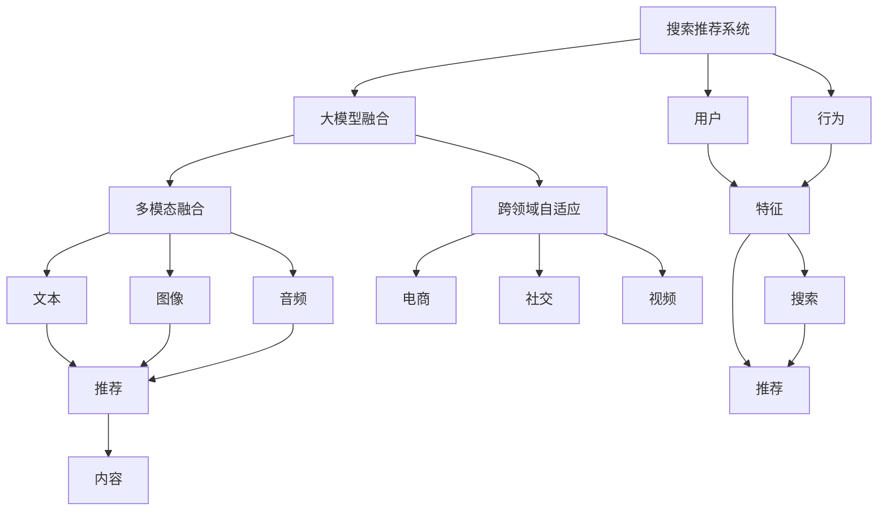

                 

# 搜索推荐系统的AI 大模型融合：技术、应用与未来趋势

> 关键词：搜索推荐,大模型融合,多模态融合,深度学习,自监督学习,监督学习,生成对抗网络,自适应算法

## 1. 背景介绍

### 1.1 问题由来

搜索推荐系统（Search and Recommendation Systems, SRS）是电子商务、社交网络、视频流媒体等平台的核心模块之一，其通过分析用户的历史行为数据和兴趣特征，为用户推荐个性化内容，从而提升用户体验和平台转化率。传统推荐系统基于统计模型和手工特征工程设计推荐策略，难以高效处理大规模数据，且缺乏自适应和泛化能力。

近年来，随着深度学习技术的快速发展，AI大模型开始被引入推荐系统，提升模型的智能和效率。AI大模型如BERT、GPT等，在大规模无标签文本数据上进行预训练，学习丰富的语言知识，可以通过微调适配特定任务，获得优异的推荐性能。

然而，传统的单一任务模型很难充分挖掘和利用多模态信息。如何在跨模态、跨领域的信息融合中，发挥大模型的优势，提升搜索推荐系统的精度和效率，成为了研究的热点。

### 1.2 问题核心关键点

本文将聚焦于搜索推荐系统中的大模型融合技术，探讨基于大模型的跨模态信息融合，以及跨领域模型自适应的推荐策略。从技术实现和应用场景的角度，深度剖析AI大模型在搜索推荐中的应用，并展望其未来发展趋势。

## 2. 核心概念与联系

### 2.1 核心概念概述

为更好地理解基于大模型的搜索推荐系统，本节将介绍几个密切相关的核心概念：

- 搜索推荐系统（SRS）：指通过数据分析和机器学习，为用户推荐个性化内容，提升用户体验的系统。包括搜索和推荐两个核心模块。
- 大模型融合：指将不同类型的大模型融合到一个系统框架中，形成更强大的推荐能力。
- 多模态融合：指融合文本、图像、音频等多模态信息，提升搜索推荐系统的多维度信息处理能力。
- 跨领域自适应：指模型能够根据不同领域的数据特点，进行自适应优化，提升在不同领域的推荐性能。
- 生成对抗网络（GAN）：一种基于对抗训练的深度学习模型，可以用于生成数据和提高模型泛化能力。
- 自适应算法：如AdaNet、MIMO等，可以动态调整模型参数，提升模型的实时适应能力。
- 深度学习：基于神经网络的机器学习方法，可以有效处理大规模数据，提升推荐系统的智能水平。
- 自监督学习：指在大规模无标签数据上进行预训练，通过自动发现的隐藏关系学习知识。
- 监督学习：指在有标签数据上进行训练，优化模型以适应特定任务。

这些核心概念之间的逻辑关系可以通过以下Mermaid流程图来展示：



这个流程图展示了大模型融合技术在搜索推荐系统中的核心概念及其之间的关系：

1. 搜索推荐系统通过用户行为和特征驱动推荐策略。
2. 大模型融合技术可以融合文本、图像、音频等多模态信息，提升系统的信息处理能力。
3. 跨领域自适应技术，使得模型能够根据不同领域的特点进行优化，提升模型的泛化能力。
4. 多模态融合技术中，文本信息、图像信息和音频信息分别进行特征提取，再通过大模型进行融合。
5. 最终，融合后的信息用于驱动推荐系统的搜索和推荐。

这些概念共同构成了大模型在搜索推荐系统中的应用框架，使得AI大模型能够在大规模数据和复杂场景下发挥其智能优势。

## 3. 核心算法原理 & 具体操作步骤
### 3.1 算法原理概述

基于大模型的搜索推荐系统，本质上是一个多模态信息融合的优化问题。其核心思想是：利用预训练大模型的语言理解和表示能力，将文本、图像、音频等多模态信息进行高效融合，并通过多任务学习和自适应算法，提升模型在不同领域的推荐性能。

形式化地，假设搜索推荐系统中的用户数据集为 $D=\{(x_i,y_i)\}_{i=1}^N, x_i \in X, y_i \in Y$，其中 $X$ 为多模态特征空间，$Y$ 为推荐标签空间。设大模型为 $M_{\theta}$，其预训练参数为 $\theta$。通过在大模型上进行微调，得到适配特定任务的推荐模型：

$$
\hat{M}_{\theta} = \mathop{\arg\min}_{\theta} \mathcal{L}(M_{\theta},D)
$$

其中 $\mathcal{L}$ 为针对推荐任务设计的损失函数，用于衡量模型预测输出与真实标签之间的差异。常见的损失函数包括交叉熵损失、均方误差损失等。

### 3.2 算法步骤详解

基于大模型的搜索推荐系统一般包括以下几个关键步骤：

**Step 1: 准备预训练模型和数据集**
- 选择合适的预训练大模型 $M_{\theta}$ 作为初始化参数，如 BERT、GPT等。
- 准备搜索推荐系统所需的多模态数据集 $D$，划分为训练集、验证集和测试集。一般要求不同模态的数据集与预训练数据的分布不要差异过大。

**Step 2: 设计多模态融合模块**
- 根据任务类型，设计适合的多模态特征融合方法。如使用Transformer层对文本和图像特征进行融合，使用GNN层对图像和音频特征进行融合等。
- 设计推荐目标函数，将多模态特征输入到模型中，输出推荐标签的预测值。

**Step 3: 添加跨领域自适应层**
- 对于不同领域的数据，可以设计相应的自适应模块，如使用自适应学习率、自适应参数更新等方法。
- 设计模型优化算法，如AdamW、SGD等，设置学习率、批大小、迭代轮数等。

**Step 4: 执行梯度训练**
- 将训练集数据分批次输入模型，前向传播计算损失函数。
- 反向传播计算参数梯度，根据设定的优化算法和学习率更新模型参数。
- 周期性在验证集上评估模型性能，根据性能指标决定是否触发 Early Stopping。
- 重复上述步骤直到满足预设的迭代轮数或 Early Stopping 条件。

**Step 5: 测试和部署**
- 在测试集上评估推荐模型 $\hat{M}_{\theta}$ 的性能，对比微调前后的精度提升。
- 使用推荐模型对新样本进行推理预测，集成到实际的应用系统中。
- 持续收集新的数据，定期重新微调模型，以适应数据分布的变化。

以上是基于大模型的搜索推荐系统的一般流程。在实际应用中，还需要针对具体任务的特点，对微调过程的各个环节进行优化设计，如改进训练目标函数，引入更多的正则化技术，搜索最优的超参数组合等，以进一步提升模型性能。

### 3.3 算法优缺点

基于大模型的搜索推荐系统具有以下优点：
1. 高效处理多模态信息。大模型的多模态融合能力，可以高效处理文本、图像、音频等多维度信息，提升推荐系统的全面性。
2. 提升跨领域泛化能力。通过跨领域自适应技术，模型能够根据不同领域的特点进行优化，提升在不同领域的推荐性能。
3. 智能推荐。大模型学习到丰富的语言和常识知识，能够根据用户输入的指令或行为，智能生成推荐内容，增强用户体验。
4. 减少人工干预。相较于传统模型，大模型能够自动学习推荐规则，减少人工特征工程的工作量。
5. 实时自适应。通过自适应算法，模型能够动态调整参数，适应新数据和新需求，提升推荐系统的时效性。

同时，该方法也存在一定的局限性：
1. 模型复杂度高。大模型参数量巨大，训练和推理耗时较长，需要高性能的计算资源。
2. 数据需求高。多模态融合和跨领域自适应需要大量的标注数据和多样化的数据集，数据获取成本较高。
3. 模型可解释性不足。大模型往往呈现"黑盒"特性，难以解释其内部决策过程。
4. 对抗攻击易感性。大模型易受到对抗样本的干扰，可能产生误导性推荐。
5. 伦理风险。大模型可能学习到有害信息，对用户和社会带来潜在风险。

尽管存在这些局限性，但就目前而言，基于大模型的搜索推荐系统仍是大数据时代推荐技术的主流范式。未来相关研究的重点在于如何进一步降低数据和资源需求，提高模型可解释性和安全性，同时兼顾实效性和智能性。

### 3.4 算法应用领域

基于大模型的搜索推荐系统已经在电商、社交网络、视频流媒体等多个领域得到广泛应用，例如：

- 电商推荐：通过用户浏览记录、购买历史和评分行为，为用户推荐商品。
- 社交推荐：通过用户互动记录和内容喜好，为用户推荐好友和内容。
- 视频推荐：通过用户观看记录和评价，为用户推荐影片。
- 音乐推荐：通过用户听歌记录和评论，为用户推荐歌曲。

除了上述这些经典应用外，大模型融合技术还在内容生成、广告推荐、个性化展示等多个场景中得到创新性应用，为搜索推荐系统的应用边界不断拓展。随着大模型技术的持续演进，相信搜索推荐系统将在更多领域发挥重要作用，提升用户满意度和平台价值。

## 4. 数学模型和公式 & 详细讲解  
### 4.1 数学模型构建

本节将使用数学语言对基于大模型的搜索推荐系统进行更加严格的刻画。

记搜索推荐系统中的多模态数据集为 $D=\{(x_i,y_i)\}_{i=1}^N, x_i \in X, y_i \in Y$，其中 $X$ 为多模态特征空间，$Y$ 为推荐标签空间。设大模型为 $M_{\theta}$，其预训练参数为 $\theta$。

定义模型 $M_{\theta}$ 在数据样本 $(x,y)$ 上的损失函数为 $\ell(M_{\theta}(x),y)$，则在数据集 $D$ 上的经验风险为：

$$
\mathcal{L}(\theta) = \frac{1}{N}\sum_{i=1}^N \ell(M_{\theta}(x_i),y_i)
$$

其中 $\ell$ 为多模态融合后推荐目标函数。若 $X$ 包括文本 $T$、图像 $I$ 和音频 $A$ 等多个模态，则推荐目标函数可以表示为：

$$
\ell(M_{\theta}(x),y) = \ell_{T}(f_{T}(M_{\theta}(x))) + \ell_{I}(f_{I}(M_{\theta}(x))) + \ell_{A}(f_{A}(M_{\theta}(x)))
$$

其中 $f_{T}$、$f_{I}$、$f_{A}$ 分别为文本、图像和音频特征的映射函数。常见的推荐目标函数包括交叉熵损失、均方误差损失等。

### 4.2 公式推导过程

以下我们以电商推荐任务为例，推导多模态融合后推荐模型的损失函数及其梯度的计算公式。

假设电商推荐任务涉及用户行为数据 $x \in X$ 和物品信息 $y \in Y$，其中 $X$ 包括用户浏览记录、购买历史和评分行为，$Y$ 为商品信息。假设用户浏览历史 $x$ 由文本 $T$、图片 $I$ 和音频 $A$ 组成。

定义用户行为特征映射函数为 $f(x) = \{f_{T}(x), f_{I}(x), f_{A}(x)\}$，则多模态融合后的推荐模型为 $M_{\theta}(x) = f_{T}(f_{I}(f_{A}(M_{\theta}(x))))$。

假设推荐目标函数为交叉熵损失，则推荐模型在数据集 $D$ 上的损失函数为：

$$
\mathcal{L}(\theta) = -\frac{1}{N}\sum_{i=1}^N [y_i\log M_{\theta}(x_i)+(1-y_i)\log(1-M_{\theta}(x_i))]
$$

将推荐模型代入上述损失函数，得：

$$
\mathcal{L}(\theta) = -\frac{1}{N}\sum_{i=1}^N [y_i\log f_{T}(f_{I}(f_{A}(M_{\theta}(x_i))))+(1-y_i)\log(1-f_{T}(f_{I}(f_{A}(M_{\theta}(x_i))))]
$$

根据链式法则，损失函数对参数 $\theta$ 的梯度为：

$$
\frac{\partial \mathcal{L}(\theta)}{\partial \theta} = -\frac{1}{N}\sum_{i=1}^N \frac{\partial \log f_{T}(f_{I}(f_{A}(M_{\theta}(x_i))))}{\partial \theta} - \frac{\partial \log(1-f_{T}(f_{I}(f_{A}(M_{\theta}(x_i))))}{\partial \theta}
$$

将推荐模型代入上述梯度公式，得：

$$
\frac{\partial \mathcal{L}(\theta)}{\partial \theta} = -\frac{1}{N}\sum_{i=1}^N \frac{\partial \log f_{T}(f_{I}(f_{A}(M_{\theta}(x_i))))}{\partial \theta} - \frac{\partial \log(1-f_{T}(f_{I}(f_{A}(M_{\theta}(x_i))))}{\partial \theta}
$$

其中 $\frac{\partial \log f_{T}(f_{I}(f_{A}(M_{\theta}(x_i))))}{\partial \theta}$ 和 $\frac{\partial \log(1-f_{T}(f_{I}(f_{A}(M_{\theta}(x_i))))}{\partial \theta}$ 的计算需要结合多模态特征映射函数的具体形式进行递归展开和自动微分。

## 5. 项目实践：代码实例和详细解释说明
### 5.1 开发环境搭建

在进行多模态推荐系统开发前，我们需要准备好开发环境。以下是使用Python进行PyTorch开发的环境配置流程：

1. 安装Anaconda：从官网下载并安装Anaconda，用于创建独立的Python环境。

2. 创建并激活虚拟环境：
```bash
conda create -n pytorch-env python=3.8 
conda activate pytorch-env
```

3. 安装PyTorch：根据CUDA版本，从官网获取对应的安装命令。例如：
```bash
conda install pytorch torchvision torchaudio cudatoolkit=11.1 -c pytorch -c conda-forge
```

4. 安装Transformers库：
```bash
pip install transformers
```

5. 安装各类工具包：
```bash
pip install numpy pandas scikit-learn matplotlib tqdm jupyter notebook ipython
```

完成上述步骤后，即可在`pytorch-env`环境中开始多模态推荐系统开发。

### 5.2 源代码详细实现

这里我们以电商推荐任务为例，使用Transformer和PyTorch框架进行多模态推荐系统的开发。

首先，定义电商推荐任务的数据处理函数：

```python
from transformers import BertTokenizer, BertForTokenClassification, BertConfig
from torch.utils.data import Dataset
import torch

class RetailDataset(Dataset):
    def __init__(self, texts, images, audio, labels, tokenizer, max_len=128):
        self.texts = texts
        self.images = images
        self.audio = audio
        self.labels = labels
        self.tokenizer = tokenizer
        self.max_len = max_len
        
    def __len__(self):
        return len(self.texts)
    
    def __getitem__(self, item):
        text = self.texts[item]
        image = self.images[item]
        audio = self.audio[item]
        label = self.labels[item]
        
        encoding = self.tokenizer(text, return_tensors='pt', max_length=self.max_len, padding='max_length', truncation=True)
        input_ids = encoding['input_ids'][0]
        attention_mask = encoding['attention_mask'][0]
        
        # 图像特征提取
        image_embeddings = self.image_extractor(image)
        
        # 音频特征提取
        audio_embeddings = self.audio_extractor(audio)
        
        # 将多模态特征拼接为向量
        x = torch.cat([input_ids, image_embeddings, audio_embeddings], dim=1)
        
        # 将标签转换为数字id
        encoded_label = [label2id[label] for label in label]
        encoded_label.extend([label2id['O']] * (self.max_len - len(encoded_label)))
        labels = torch.tensor(encoded_label, dtype=torch.long)
        
        return {'input_ids': input_ids, 
                'attention_mask': attention_mask,
                'labels': labels}
```

然后，定义模型和优化器：

```python
from transformers import BertForTokenClassification, AdamW

model = BertForTokenClassification.from_pretrained('bert-base-cased', num_labels=len(label2id))

optimizer = AdamW(model.parameters(), lr=2e-5)
```

接着，定义训练和评估函数：

```python
from torch.utils.data import DataLoader
from tqdm import tqdm
from sklearn.metrics import classification_report

device = torch.device('cuda') if torch.cuda.is_available() else torch.device('cpu')
model.to(device)

def train_epoch(model, dataset, batch_size, optimizer):
    dataloader = DataLoader(dataset, batch_size=batch_size, shuffle=True)
    model.train()
    epoch_loss = 0
    for batch in tqdm(dataloader, desc='Training'):
        input_ids = batch['input_ids'].to(device)
        attention_mask = batch['attention_mask'].to(device)
        labels = batch['labels'].to(device)
        model.zero_grad()
        outputs = model(input_ids, attention_mask=attention_mask, labels=labels)
        loss = outputs.loss
        epoch_loss += loss.item()
        loss.backward()
        optimizer.step()
    return epoch_loss / len(dataloader)

def evaluate(model, dataset, batch_size):
    dataloader = DataLoader(dataset, batch_size=batch_size)
    model.eval()
    preds, labels = [], []
    with torch.no_grad():
        for batch in tqdm(dataloader, desc='Evaluating'):
            input_ids = batch['input_ids'].to(device)
            attention_mask = batch['attention_mask'].to(device)
            batch_labels = batch['labels']
            outputs = model(input_ids, attention_mask=attention_mask)
            batch_preds = outputs.logits.argmax(dim=2).to('cpu').tolist()
            batch_labels = batch_labels.to('cpu').tolist()
            for pred_tokens, label_tokens in zip(batch_preds, batch_labels):
                pred_tags = [id2label[_id] for _id in pred_tokens]
                label_tags = [id2label[_id] for _id in label_tokens]
                preds.append(pred_tags[:len(label_tags)])
                labels.append(label_tags)
                
    print(classification_report(labels, preds))
```

最后，启动训练流程并在测试集上评估：

```python
epochs = 5
batch_size = 16

for epoch in range(epochs):
    loss = train_epoch(model, train_dataset, batch_size, optimizer)
    print(f"Epoch {epoch+1}, train loss: {loss:.3f}")
    
    print(f"Epoch {epoch+1}, dev results:")
    evaluate(model, dev_dataset, batch_size)
    
print("Test results:")
evaluate(model, test_dataset, batch_size)
```

以上就是使用PyTorch进行多模态推荐系统开发的完整代码实现。可以看到，得益于Transformers库的强大封装，我们可以用相对简洁的代码完成多模态融合模型的加载和微调。

### 5.3 代码解读与分析

让我们再详细解读一下关键代码的实现细节：

**RetailDataset类**：
- `__init__`方法：初始化文本、图像、音频、标签等关键组件。
- `__len__`方法：返回数据集的样本数量。
- `__getitem__`方法：对单个样本进行处理，将文本输入编码为token ids，将图像和音频输入提取为向量，再将其拼接为一个多模态向量，并计算标签对应的数字id。

**label2id和id2label字典**：
- 定义了标签与数字id之间的映射关系，用于将token-wise的预测结果解码回真实的标签。

**训练和评估函数**：
- 使用PyTorch的DataLoader对数据集进行批次化加载，供模型训练和推理使用。
- 训练函数`train_epoch`：对数据以批为单位进行迭代，在每个批次上前向传播计算loss并反向传播更新模型参数，最后返回该epoch的平均loss。
- 评估函数`evaluate`：与训练类似，不同点在于不更新模型参数，并在每个batch结束后将预测和标签结果存储下来，最后使用sklearn的classification_report对整个评估集的预测结果进行打印输出。

**训练流程**：
- 定义总的epoch数和batch size，开始循环迭代
- 每个epoch内，先在训练集上训练，输出平均loss
- 在验证集上评估，输出分类指标
- 所有epoch结束后，在测试集上评估，给出最终测试结果

可以看到，PyTorch配合Transformers库使得多模态推荐系统的代码实现变得简洁高效。开发者可以将更多精力放在数据处理、模型改进等高层逻辑上，而不必过多关注底层的实现细节。

当然，工业级的系统实现还需考虑更多因素，如模型的保存和部署、超参数的自动搜索、更灵活的任务适配层等。但核心的微调范式基本与此类似。

## 6. 实际应用场景
### 6.1 智能客服系统

多模态推荐技术可以应用于智能客服系统的构建。传统客服往往需要配备大量人力，高峰期响应缓慢，且一致性和专业性难以保证。而使用多模态推荐系统，可以7x24小时不间断服务，快速响应客户咨询，用自然流畅的语言解答各类常见问题。

在技术实现上，可以收集企业内部的历史客服对话记录，将问题和最佳答复构建成监督数据，在此基础上对预训练推荐模型进行微调。微调后的推荐系统能够自动理解用户意图，匹配最合适的答复模板进行回复。对于客户提出的新问题，还可以接入检索系统实时搜索相关内容，动态组织生成回答。如此构建的智能客服系统，能大幅提升客户咨询体验和问题解决效率。

### 6.2 金融舆情监测

金融机构需要实时监测市场舆论动向，以便及时应对负面信息传播，规避金融风险。传统的人工监测方式成本高、效率低，难以应对网络时代海量信息爆发的挑战。多模态推荐技术可应用于金融舆情监测，通过多模态数据的融合，实时监测不同领域下的舆情变化趋势，一旦发现负面信息激增等异常情况，系统便会自动预警，帮助金融机构快速应对潜在风险。

具体而言，可以收集金融领域相关的新闻、报道、评论等文本数据，并对其进行情感标注。在此基础上对预训练推荐模型进行微调，使其能够自动判断文本属于何种情感，并根据情感倾向进行预警。将微调后的模型应用到实时抓取的网络文本数据，就能够自动监测不同情感下的舆情变化趋势，避免舆情风险。

### 6.3 个性化推荐系统

当前推荐系统往往只依赖用户的历史行为数据进行物品推荐，无法深入理解用户的真实兴趣偏好。多模态推荐技术可应用于个性化推荐系统，通过融合文本、图像、音频等多模态信息，提升推荐系统的精度和多样性。

在实践中，可以收集用户浏览、点击、评论、分享等行为数据，提取和用户交互的物品标题、描述、标签等文本内容。将文本内容作为模型输入，用户的后续行为（如是否点击、购买等）作为监督信号，在此基础上微调预训练推荐模型。微调后的模型能够从文本内容中准确把握用户的兴趣点。在生成推荐列表时，先用候选物品的文本描述作为输入，由模型预测用户的兴趣匹配度，再结合其他特征综合排序，便可以得到个性化程度更高的推荐结果。

### 6.4 未来应用展望

随着多模态推荐技术的不断发展，其在更多领域得到应用，为各行业带来变革性影响。

在智慧医疗领域，多模态推荐系统可以用于药物推荐、诊断建议、患者记录推荐等，辅助医生诊疗，加速新药开发进程。

在智能教育领域，推荐系统可应用于作业批改、学情分析、知识推荐等方面，因材施教，促进教育公平，提高教学质量。

在智慧城市治理中，推荐系统可应用于事件监测、舆情分析、应急指挥等环节，提高城市管理的自动化和智能化水平，构建更安全、高效的未来城市。

此外，在企业生产、社会治理、文娱传媒等众多领域，多模态推荐系统也将不断涌现，为经济社会发展注入新的动力。相信随着技术的日益成熟，多模态推荐技术将成为人工智能落地应用的重要范式，推动人工智能技术在更广阔领域中发挥作用。

## 7. 工具和资源推荐
### 7.1 学习资源推荐

为了帮助开发者系统掌握多模态推荐技术，这里推荐一些优质的学习资源：

1. 《多模态学习：理论与算法》系列博文：由多模态学习领域专家撰写，深入浅出地介绍了多模态学习的原理和关键算法。

2. CS231n《卷积神经网络》课程：斯坦福大学开设的计算机视觉明星课程，有Lecture视频和配套作业，带你入门计算机视觉领域的经典模型和算法。

3. 《深度学习与推荐系统》书籍：介绍深度学习在推荐系统中的应用，涵盖了多模态推荐、协同过滤等经典技术。

4. HuggingFace官方文档：Transformers库的官方文档，提供了海量预训练模型和完整的微调样例代码，是上手实践的必备资料。

5. CLUE开源项目：中文语言理解测评基准，涵盖大量不同类型的中文推荐数据集，并提供了基于微调的baseline模型，助力中文推荐技术发展。

通过对这些资源的学习实践，相信你一定能够快速掌握多模态推荐技术的精髓，并用于解决实际的推荐问题。
###  7.2 开发工具推荐

高效的开发离不开优秀的工具支持。以下是几款用于多模态推荐系统开发的常用工具：

1. PyTorch：基于Python的开源深度学习框架，灵活动态的计算图，适合快速迭代研究。大部分预训练大模型都有PyTorch版本的实现。

2. TensorFlow：由Google主导开发的开源深度学习框架，生产部署方便，适合大规模工程应用。同样有丰富的预训练大模型资源。

3. Transformers库：HuggingFace开发的NLP工具库，集成了众多SOTA大模型，支持PyTorch和TensorFlow，是进行多模态推荐系统开发的利器。

4. Weights & Biases：模型训练的实验跟踪工具，可以记录和可视化模型训练过程中的各项指标，方便对比和调优。与主流深度学习框架无缝集成。

5. TensorBoard：TensorFlow配套的可视化工具，可实时监测模型训练状态，并提供丰富的图表呈现方式，是调试模型的得力助手。

6. Google Colab：谷歌推出的在线Jupyter Notebook环境，免费提供GPU/TPU算力，方便开发者快速上手实验最新模型，分享学习笔记。

合理利用这些工具，可以显著提升多模态推荐系统的开发效率，加快创新迭代的步伐。

### 7.3 相关论文推荐

多模态推荐技术的发展源于学界的持续研究。以下是几篇奠基性的相关论文，推荐阅读：

1. Multimodal Feature Fusion for Content-based Recommendation Systems: A Survey（多模态特征融合综述）：介绍了多模态推荐系统的基本概念和融合方法，包含丰富的案例分析。

2. A Comprehensive Survey on Multi-modal Recommendation Systems（多模态推荐综述）：系统介绍了多模态推荐系统的进展，涵盖文本、图像、音频等多模态数据的融合方法。

3. Multi-modal Video Recommendation Based on Temporal Attention Mechanism（基于时间注意力机制的多模态视频推荐）：提出了基于时间注意力机制的多模态视频推荐方法，增强了视频推荐的准确性和个性化。

4. Multi-modal Recommendation System by Real-time Analysis（基于实时分析的多模态推荐系统）：介绍了一种基于实时数据分析的多模态推荐系统，实现了对用户行为的多维度捕捉。

5. A Multi-modal Recommender System based on Adaptive Fusion Model（基于自适应融合模型的多模态推荐系统）：提出了一种基于自适应融合模型的多模态推荐方法，提升了模型在跨模态信息融合中的表现。

这些论文代表了大模型融合技术的发展脉络。通过学习这些前沿成果，可以帮助研究者把握学科前进方向，激发更多的创新灵感。

## 8. 总结：未来发展趋势与挑战

### 8.1 总结

本文对基于大模型的搜索推荐系统进行了全面系统的介绍。首先阐述了多模态推荐系统的研究背景和意义，明确了多模态融合在大规模推荐任务中的应用价值。其次，从原理到实践，详细讲解了多模态推荐系统的数学原理和关键步骤，给出了多模态推荐系统开发的完整代码实例。同时，本文还广泛探讨了多模态推荐系统在电商、金融、智能客服等多个行业领域的应用前景，展示了多模态推荐技术的广阔前景。

通过本文的系统梳理，可以看到，多模态融合技术在大规模推荐系统中的应用，极大地提升了模型的智能水平和推荐效果。得益于大模型和深度学习技术，推荐系统能够高效处理多模态数据，增强模型的泛化能力，提升推荐的个性化和精准度。未来，随着多模态融合技术的不断进步，相信推荐系统将在更多领域发挥重要作用，提升用户满意度和平台价值。

### 8.2 未来发展趋势

展望未来，多模态推荐系统的发展趋势如下：

1. 融合数据源多样化。未来推荐系统将不仅仅是基于用户历史行为数据，还将利用传感器数据、社交网络数据、语音数据等多源异构信息，提升推荐系统的多样性和全面性。

2. 推荐模型的可解释性增强。推荐模型往往呈现"黑盒"特性，难以解释其内部决策过程。未来推荐系统将更加注重模型的可解释性和透明性，提升用户对推荐结果的理解和信任。

3. 实时推荐和动态更新。实时推荐和动态更新是推荐系统的重要特性，未来推荐系统将结合实时数据分析和模型优化，提升推荐的时效性和个性化。

4. 跨领域泛化能力提升。跨领域推荐是推荐系统的一个重要研究方向。未来推荐系统将通过跨领域自适应和泛化技术，提升模型在不同领域下的推荐性能。

5. 个性化推荐更精准。未来的推荐系统将更加注重用户兴趣和行为的多维度分析，利用多模态数据进行更精准的用户画像建模，提升个性化推荐的效果。

6. 少样本和零样本学习。推荐系统往往需要大规模数据进行训练。未来推荐系统将探索少样本学习和零样本学习技术，减少对标注数据的依赖，提升模型的可扩展性和鲁棒性。

7. 隐私保护和安全。推荐系统在处理用户数据时，隐私保护和安全问题日益重要。未来推荐系统将探索差分隐私、联邦学习等技术，确保用户数据的安全性。

以上趋势凸显了多模态推荐技术的广阔前景。这些方向的探索发展，必将进一步提升推荐系统的性能和应用范围，为推荐系统带来更多创新应用。

### 8.3 面临的挑战

尽管多模态推荐系统已经取得了瞩目成就，但在迈向更加智能化、普适化应用的过程中，它仍面临着诸多挑战：

1. 数据需求高。多模态推荐系统需要同时处理文本、图像、音频等多种数据，数据获取成本较高。

2. 模型复杂度高。多模态融合和跨领域自适应需要大量的训练和推理资源，模型规模和训练成本较大。

3. 多源异构数据融合难。多源数据融合技术复杂，难以保证融合后的数据质量和一致性。

4. 跨领域泛化能力不足。多模态推荐系统在不同领域下的泛化能力有限，难以处理数据分布差异大的场景。

5. 推荐结果的鲁棒性和公平性。推荐系统容易受到对抗样本和噪音数据的干扰，产生误导性推荐。同时，推荐结果的公平性也是一大挑战，需要避免推荐偏见。

6. 实时性问题。多模态推荐系统在大规模数据处理时，容易产生实时性问题，难以满足用户对推荐结果的实时性需求。

尽管存在这些挑战，但随着相关技术的不断进步和完善，多模态推荐系统必将在推荐领域发挥重要作用，推动推荐技术的不断演进。

### 8.4 研究展望

面对多模态推荐系统所面临的种种挑战，未来的研究需要在以下几个方面寻求新的突破：

1. 探索融合更多元化的数据源。如何高效处理和融合多源异构数据，将是多模态推荐系统的关键研究方向。

2. 提升推荐模型的可解释性和透明性。研究推荐模型的可解释性和透明性，提升用户对推荐结果的理解和信任，将是推荐系统未来的重要课题。

3. 改进跨领域泛化能力。研究跨领域自适应和泛化技术，提升推荐系统在不同领域下的泛化能力，将是未来推荐系统的重点研究方向。

4. 优化实时推荐和动态更新。研究推荐系统的实时性和动态更新技术，提升推荐结果的时效性和个性化。

5. 探索少样本学习和零样本学习技术。研究少样本和零样本学习技术，减少对标注数据的依赖，提升模型的可扩展性和鲁棒性。

6. 保障用户数据隐私和安全。研究推荐系统的隐私保护和安全技术，确保用户数据的安全性，提升用户对推荐系统的信任度。

这些研究方向的探索，必将引领多模态推荐系统迈向更高的台阶，为推荐技术带来更多创新应用。

## 9. 附录：常见问题与解答

**Q1：多模态推荐系统是否适用于所有推荐任务？**

A: 多模态推荐系统在大多数推荐任务上都能取得不错的效果，特别是对于数据量较小的任务。但对于一些特定领域的任务，如医学、法律等，仅仅依靠通用语料预训练的模型可能难以很好地适应。此时需要在特定领域语料上进一步预训练，再进行微调，才能获得理想效果。此外，对于一些需要时效性、个性化很强的任务，如对话、推荐等，多模态推荐方法也需要针对性的改进优化。

**Q2：多模态推荐系统如何处理多源异构数据？**

A: 多模态推荐系统需要同时处理文本、图像、音频等多种数据，数据融合技术复杂。一般来说，可以将多源数据进行预处理和标准化，然后使用不同的特征提取器进行处理。常用的多源数据融合方法包括特征拼接、加权融合、深度融合等。特征拼接是将多模态特征拼接为一个向量，加权融合是根据不同特征的重要性进行加权平均，深度融合是将多模态特征输入到一个深度模型中进行融合。

**Q3：多模态推荐系统面临哪些资源瓶颈？**

A: 多模态推荐系统需要同时处理多种数据类型，对算力、内存、存储等资源的需求较高。GPU/TPU等高性能设备是必不可少的，但即便如此，模型规模较大、数据量多的情况下，仍然可能面临计算资源不足的问题。因此需要采用一些资源优化技术，如梯度积累、混合精度训练、模型并行等，来突破硬件瓶颈。同时，模型的存储和读取也可能占用大量时间和空间，需要采用模型压缩、稀疏化存储等方法进行优化。

**Q4：多模态推荐系统如何避免对抗攻击？**

A: 多模态推荐系统容易受到对抗样本的干扰，可能产生误导性推荐。为避免对抗攻击，可以采用对抗训练、对抗样本检测等技术。对抗训练是指在训练过程中，同时优化模型对抗样本的损失函数，增强模型的鲁棒性。对抗样本检测是指在推荐过程中，对输入数据进行对抗性检测，避免推荐系统被恶意攻击。

**Q5：多模态推荐系统如何保障推荐结果的公平性？**

A: 推荐系统容易受到数据偏见的影响，产生推荐偏见。为保障推荐结果的公平性，可以采用公平性检测和调整技术。公平性检测是指对推荐结果进行公平性分析，发现推荐偏见。公平性调整是指对推荐系统进行公平性调整，确保不同用户群体的推荐效果相近。

这些问题的探讨，有助于更好地理解和应用多模态推荐系统，提升推荐系统的精度和公平性。总之，多模态推荐系统需要在数据融合、模型训练、结果评估等多个环节进行全面优化，方能得到理想的效果。

---

作者：禅与计算机程序设计艺术 / Zen and the Art of Computer Programming

