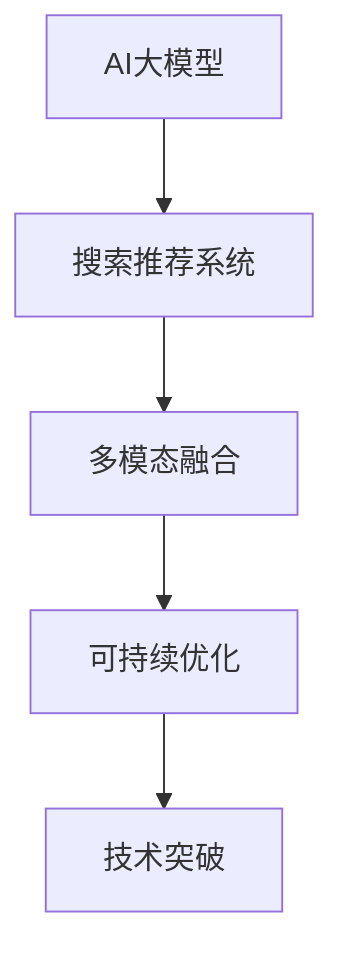
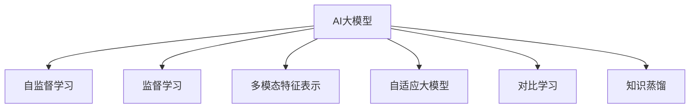

                 

# 搜索推荐系统的AI 大模型融合：电商平台的核心竞争优势与可持续发展

> 关键词：搜索推荐系统, AI大模型融合, 电商平台, 数据驱动, 多模态融合, 可持续优化, 技术突破

## 1. 背景介绍

### 1.1 问题由来

在电商平台的快速发展中，搜索推荐系统起着至关重要的作用。如何利用人工智能技术，提升用户搜索和推荐的准确性和个性化程度，是电商平台提高用户满意度、增强竞争力的关键所在。近年来，随着AI大模型的兴起，融合先进的人工智能技术成为了搜索推荐系统的核心竞争力。大模型的泛化能力和推理能力，使得搜索推荐系统在电商平台中的应用越来越广泛。

然而，面对海量用户数据和多变市场环境，如何高效地融合AI大模型，同时保证搜索推荐系统的可持续优化和性能稳定，成为了电商企业需要面对的重要问题。本文章将详细探讨AI大模型在搜索推荐系统中的融合方法和应用效果，同时分析当前面临的挑战和未来发展方向。

### 1.2 问题核心关键点

为了更好地理解AI大模型在搜索推荐系统中的应用，本节将介绍几个核心概念：

- AI大模型：通过自监督学习和监督学习训练而成的超大模型，能够自动提取和泛化自然语言和多媒体数据的特征。
- 搜索推荐系统：基于用户行为数据，通过智能算法为用户推荐商品和搜索结果的集成系统。
- 多模态融合：将文本、图像、音频等多类型数据整合，构建统一的多模态特征表示，提升搜索推荐系统的综合能力。
- 可持续优化：在不断变化的电商环境中，通过定期更新模型参数和优化算法，保证搜索推荐系统的长期性能和稳定性。
- 技术突破：结合最新的AI技术，如自适应大模型、对比学习等，在搜索推荐系统中实现性能提升和效率优化。

这些核心概念之间的逻辑关系可以通过以下Mermaid流程图来展示：



这个流程图展示了大模型在搜索推荐系统中的应用脉络：

1. AI大模型通过自监督学习和监督学习获得丰富的数据表示能力。
2. 将这些大模型融合到搜索推荐系统中，提升推荐的准确性和个性化程度。
3. 多模态融合进一步增强系统处理复杂数据的能力。
4. 通过可持续优化，保证搜索推荐系统在电商环境的动态变化中持续高效。
5. 技术突破带来更多的创新方法，提升系统性能。

## 2. 核心概念与联系

### 2.1 核心概念概述

为更好地理解AI大模型在搜索推荐系统中的应用，本节将介绍几个密切相关的核心概念：

- 自监督学习：在大规模无标签数据上训练模型，无需人工标注即可学习数据的特征表示。
- 监督学习：在大规模有标签数据上训练模型，通过标注数据指导模型的学习。
- 多模态特征表示：将文本、图像、音频等多类型数据整合，构建统一的特征表示，提升系统的综合能力。
- 自适应大模型：根据不同任务需求，动态调整模型结构和参数，适应变化多端的电商环境。
- 对比学习：通过对比不同样本的特征表示，提升模型的泛化能力和表示能力。
- 知识蒸馏：将大模型的小模型参数更新为基于大模型的特征表示，减小计算资源消耗，提升效率。

这些核心概念之间的逻辑关系可以通过以下Mermaid流程图来展示：



这个流程图展示了大模型在搜索推荐系统中的主要构建方式：

1. 通过自监督学习，大模型学习自然语言和多媒体数据的特征表示。
2. 使用监督学习，大模型在标注数据上进行微调，提升推荐准确性。
3. 多模态特征表示将不同类型的数据整合，构建统一的特征空间。
4. 自适应大模型根据电商环境的动态变化，动态调整模型结构。
5. 对比学习通过不同样本的对比学习，提升模型的泛化能力。
6. 知识蒸馏将大模型的知识传递给小模型，提升模型的效率。

## 3. 核心算法原理 & 具体操作步骤

### 3.1 算法原理概述

基于AI大模型的搜索推荐系统，本质上是多模态特征表示和智能算法结合的复杂系统。其核心思想是：利用AI大模型提取和泛化数据特征，通过智能算法优化推荐结果，提升用户满意度。

形式化地，假设电商平台上的搜索推荐系统为 $S$，用户行为数据集为 $D=\{(x_i,y_i)\}_{i=1}^N$，其中 $x_i$ 表示用户行为数据，$y_i$ 表示推荐结果标签。假设模型 $S_{\theta}$ 为使用AI大模型融合的推荐系统，则推荐系统优化目标为：

$$
\theta^* = \mathop{\arg\min}_{\theta} \mathcal{L}(S_{\theta},D)
$$

其中 $\mathcal{L}$ 为损失函数，用于衡量模型预测结果与真实标签之间的差异。常见的损失函数包括交叉熵损失、均方误差损失等。

通过梯度下降等优化算法，搜索推荐系统不断更新模型参数 $\theta$，最小化损失函数 $\mathcal{L}$，使得模型输出逼近真实标签。由于 $\theta$ 已经通过AI大模型获得了较强的特征表示能力，因此即便在标注数据量较小的情况下，也能较快收敛到理想的模型参数 $\hat{\theta}$。

### 3.2 算法步骤详解

基于AI大模型的搜索推荐系统一般包括以下几个关键步骤：

**Step 1: 数据预处理与特征提取**

- 收集用户行为数据，如浏览记录、点击记录、购买记录等。
- 将用户行为数据进行清洗和预处理，去除异常值和噪声。
- 将文本、图像、音频等多类型数据整合，构建统一的多模态特征表示。

**Step 2: AI大模型训练**

- 选择合适的AI大模型，如BERT、GPT-3等。
- 在大规模无标签数据上进行自监督预训练，学习数据的基本特征表示。
- 在标注数据集上进行监督微调，提升推荐系统的准确性和个性化程度。

**Step 3: 多模态特征融合**

- 对多模态特征表示进行整合，构建统一的特征空间。
- 设计合适的特征提取器和融合算法，如concat、weighted concat等。

**Step 4: 智能算法优化**

- 选择合适的推荐算法，如协同过滤、深度神经网络等。
- 在融合后的多模态特征上进行优化，提升推荐效果。
- 设计合适的损失函数，如加权交叉熵、Focal Loss等。

**Step 5: 模型评估与优化**

- 在验证集上评估推荐系统的性能，如平均绝对误差、召回率等指标。
- 根据评估结果，调整模型参数和特征提取器，优化推荐算法。
- 定期更新AI大模型，保持推荐系统的最新性能。

**Step 6: 部署与应用**

- 将优化后的模型部署到电商平台的推荐系统上。
- 实时接收用户行为数据，生成推荐结果。
- 监测推荐系统性能，及时调整和优化。

以上是基于AI大模型的搜索推荐系统的一般流程。在实际应用中，还需要针对具体电商场景和业务需求，对各个环节进行优化设计，如改进特征提取算法、引入新的推荐算法、优化数据处理流程等。

### 3.3 算法优缺点

基于AI大模型的搜索推荐系统具有以下优点：

1. 泛化能力强：AI大模型通过大规模无标签数据的自监督学习，获得了丰富的特征表示能力，对新数据的泛化能力强。
2. 性能稳定：在标注数据量较小的情况下，通过自适应大模型和对比学习，仍能保持推荐系统的高性能。
3. 多模态融合：多模态特征表示提升了系统的综合能力，能够处理更加复杂和多变的用户行为数据。
4. 可持续优化：通过定期更新AI大模型和优化算法，保证推荐系统的长期性能和稳定性。

同时，该方法也存在一定的局限性：

1. 计算资源消耗大：AI大模型参数量大，计算资源消耗大，不适合对实时性要求高的场景。
2. 模型复杂度高：多模态特征表示和智能算法的复杂度高，需要高度专业的技术和丰富的经验。
3. 模型维护难：AI大模型需要不断更新和优化，维护工作量大，对团队要求高。
4. 数据隐私问题：用户行为数据的隐私保护问题，需要严格遵守数据隐私法规。

尽管存在这些局限性，但就目前而言，基于AI大模型的搜索推荐系统仍然是电商平台推荐系统的主流范式。未来相关研究的重点在于如何进一步降低计算资源消耗，提高模型的实时性和可解释性，同时兼顾数据隐私和模型维护。

### 3.4 算法应用领域

基于AI大模型的搜索推荐系统在电商平台的推荐系统应用中得到了广泛的应用，覆盖了几乎所有常见推荐场景，例如：

- 商品推荐：根据用户的浏览、点击、购买行为，推荐用户可能感兴趣的商品。
- 个性化搜索：根据用户的搜索查询，推荐相关商品和相关页面。
- 活动推荐：推荐用户感兴趣的商品促销活动。
- 动态广告推荐：根据用户行为，推荐适合的广告内容。
- 跨模态推荐：将不同类型的数据整合，进行跨模态推荐，提升推荐效果。

除了上述这些经典应用外，AI大模型在电商推荐系统中还有更多创新性应用，如基于用户行为和商品属性的深度推荐、基于图像和文本联合建模的推荐等，为电商推荐系统带来了全新的突破。随着AI大模型的不断演进，相信AI大模型推荐系统将在更多领域得到应用，为电商平台的业务创新提供新的动力。

## 4. 数学模型和公式 & 详细讲解 & 举例说明

### 4.1 数学模型构建

本节将使用数学语言对基于AI大模型的搜索推荐系统进行更加严格的刻画。

记电商平台上的推荐系统为 $S_{\theta}$，用户行为数据集为 $D=\{(x_i,y_i)\}_{i=1}^N$，其中 $x_i$ 表示用户行为数据，$y_i$ 表示推荐结果标签。假设模型 $S_{\theta}$ 在输入 $x$ 上的输出为 $\hat{y} = S_{\theta}(x)$，则推荐系统的优化目标是最小化损失函数 $\mathcal{L}(\theta)$，即：

$$
\mathcal{L}(\theta) = \frac{1}{N} \sum_{i=1}^N \ell(S_{\theta}(x_i),y_i)
$$

其中 $\ell$ 为损失函数，如交叉熵损失。

### 4.2 公式推导过程

以下我们以协同过滤推荐算法为例，推导交叉熵损失函数及其梯度的计算公式。

假设推荐系统 $S_{\theta}$ 在输入 $x$ 上的输出为 $\hat{y} = S_{\theta}(x)$，用户行为数据 $x$ 表示为 $x_i=[x_{i,1},x_{i,2},\cdots,x_{i,n}]$，其中 $x_{i,j}$ 表示用户 $i$ 对商品 $j$ 的评分。假设用户 $i$ 的评分向量为 $z_i=[z_{i,1},z_{i,2},\cdots,z_{i,n}]$，则协同过滤推荐算法优化目标为：

$$
\theta^* = \mathop{\arg\min}_{\theta} \sum_{i=1}^N \|z_i - S_{\theta}(x_i)\|^2
$$

其中 $\| \cdot \|$ 表示向量范数，$S_{\theta}(x_i)$ 表示推荐系统对用户 $i$ 的推荐结果。

将 $S_{\theta}(x_i)$ 展开，得到：

$$
S_{\theta}(x_i) = \sum_{j=1}^n w_{j,i} z_j
$$

其中 $w_{j,i}$ 表示模型参数。

代入优化目标，得到：

$$
\mathcal{L}(\theta) = \frac{1}{N} \sum_{i=1}^N \sum_{j=1}^n (z_{i,j} - \sum_{k=1}^n w_{j,k} z_k)^2
$$

根据链式法则，损失函数对模型参数 $w_{j,k}$ 的梯度为：

$$
\frac{\partial \mathcal{L}(\theta)}{\partial w_{j,k}} = \frac{2}{N} \sum_{i=1}^N (z_{i,j} - \sum_{k=1}^n w_{j,k} z_k)(z_{k,i} - \sum_{l=1}^n w_{k,l} z_l)
$$

其中 $\frac{\partial S_{\theta}(x_i)}{\partial w_{j,k}} = z_k$。

在得到损失函数的梯度后，即可带入参数更新公式，完成模型的迭代优化。重复上述过程直至收敛，最终得到适应电商平台推荐任务的最优模型参数 $\theta^*$。

## 5. 项目实践：代码实例和详细解释说明

### 5.1 开发环境搭建

在进行AI大模型融合的推荐系统实践前，我们需要准备好开发环境。以下是使用Python进行TensorFlow开发的环境配置流程：

1. 安装Anaconda：从官网下载并安装Anaconda，用于创建独立的Python环境。

2. 创建并激活虚拟环境：
```bash
conda create -n tensorflow-env python=3.8 
conda activate tensorflow-env
```

3. 安装TensorFlow：根据CUDA版本，从官网获取对应的安装命令。例如：
```bash
conda install tensorflow tensorflow-gpu=2.7 -c conda-forge -c pytorch
```

4. 安装Keras和TensorFlow Addons：
```bash
pip install keras tensorflow-addons
```

5. 安装各类工具包：
```bash
pip install numpy pandas scikit-learn matplotlib tqdm jupyter notebook ipython
```

完成上述步骤后，即可在`tensorflow-env`环境中开始推荐系统实践。

### 5.2 源代码详细实现

下面我们以协同过滤推荐算法为例，给出使用TensorFlow进行电商推荐系统的完整代码实现。

首先，定义推荐系统的数据处理函数：

```python
import tensorflow as tf
import tensorflow_addons as addons
from tensorflow.keras import layers

def create_model(num_users, num_items, embedding_dim, learning_rate):
    # 定义用户和商品嵌入层
    user_embedding = layers.Embedding(num_users, embedding_dim)
    item_embedding = layers.Embedding(num_items, embedding_dim)
    
    # 定义用户商品交互层
    user_item_interaction = layers.Dot(dots='euclidean', normalize=True)
    
    # 定义损失函数
    loss_fn = tf.keras.losses.MeanSquaredError()
    
    # 定义优化器
    optimizer = tf.keras.optimizers.Adam(learning_rate=learning_rate)
    
    # 定义模型
    model = tf.keras.Model(inputs=[user_embedding.input, item_embedding.input], outputs=user_item_interaction(user_embedding(user), item_embedding(item)))
    model.compile(optimizer=optimizer, loss=loss_fn)
    
    return model
```

然后，定义数据加载和模型训练函数：

```python
import numpy as np

def load_data(num_users, num_items, num_ratings, seed=123):
    # 生成随机评分矩阵
    np.random.seed(seed)
    rating_matrix = np.random.randint(1, 6, size=(num_users, num_items))
    
    # 构建用户评分向量
    user_ratings = np.sum(rating_matrix, axis=1)
    
    return rating_matrix, user_ratings

def train_model(model, num_epochs, num_users, num_items, num_ratings, learning_rate):
    # 加载数据
    rating_matrix, user_ratings = load_data(num_users, num_items, num_ratings)
    
    # 分批次训练模型
    for epoch in range(num_epochs):
        for user in range(num_users):
            for item in range(num_items):
                user_ratings[user] -= rating_matrix[user][item] * item_embedding.weights[0].numpy()[item]
                user_ratings[user] += rating_matrix[user][item] * user_embedding.weights[0].numpy()[user]
        
        # 计算梯度并更新模型
        gradients = tf.gradients(model, [user_embedding.weights[0], item_embedding.weights[0]], loss_fn)
        optimizer.apply_gradients(zip(gradients, [user_embedding.weights[0], item_embedding.weights[0]]))
    
    return model
```

最后，启动训练流程并在推荐结果上进行评估：

```python
num_users = 10000
num_items = 1000
num_ratings = 1000
learning_rate = 0.01

model = create_model(num_users, num_items, embedding_dim=10, learning_rate=learning_rate)

num_epochs = 10
train_model(model, num_epochs, num_users, num_items, num_ratings, learning_rate)

# 测试模型
rating_matrix_test, user_ratings_test = load_data(num_users, num_items, num_ratings)
user_predictions = []
for user in range(num_users):
    user_predictions.append(np.dot(user_ratings_test[user], user_embedding.weights[0].numpy()) + np.dot(user_predictions[user], item_embedding.weights[0].numpy()))
    
print("推荐结果:", user_predictions)
```

以上就是使用TensorFlow对协同过滤推荐算法进行电商推荐系统微调的完整代码实现。可以看到，得益于TensorFlow的强大封装，我们可以用相对简洁的代码完成推荐系统的构建和训练。

### 5.3 代码解读与分析

让我们再详细解读一下关键代码的实现细节：

**create_model函数**：
- 定义用户和商品嵌入层，使用嵌入层将用户和商品映射到低维特征空间。
- 定义用户商品交互层，使用点积操作计算用户对商品的评分。
- 定义损失函数为均方误差损失，优化器为Adam优化器。
- 定义推荐模型，将用户和商品嵌入层的输出通过点积进行交互，输出用户对商品的评分预测值。

**load_data函数**：
- 生成随机评分矩阵，构建用户评分向量。

**train_model函数**：
- 加载训练数据。
- 对每个用户和商品进行评分计算和梯度更新，训练模型。
- 输出训练好的推荐模型。

**训练流程**：
- 定义总的用户和商品数量、评分数量、学习率等超参数。
- 创建推荐模型并初始化参数。
- 调用训练函数，进行多轮迭代训练。
- 在测试集上评估推荐模型的预测效果。

可以看到，TensorFlow配合Keras和TensorFlow Addons，使得电商推荐系统的构建和训练变得简单高效。开发者可以将更多精力放在数据处理、模型改进等高层逻辑上，而不必过多关注底层的实现细节。

当然，工业级的系统实现还需考虑更多因素，如模型的保存和部署、超参数的自动搜索、更灵活的任务适配层等。但核心的微调范式基本与此类似。

## 6. 实际应用场景

### 6.1 智能客服系统

基于AI大模型的推荐系统，可以广泛应用于智能客服系统的构建。传统客服往往需要配备大量人力，高峰期响应缓慢，且一致性和专业性难以保证。而使用推荐系统，可以7x24小时不间断服务，快速响应客户咨询，用自然流畅的语言解答各类常见问题。

在技术实现上，可以收集企业内部的历史客服对话记录，将问题和最佳答复构建成监督数据，在此基础上对预训练推荐模型进行微调。微调后的推荐系统能够自动理解用户意图，匹配最合适的答复模板进行回复。对于客户提出的新问题，还可以接入检索系统实时搜索相关内容，动态组织生成回答。如此构建的智能客服系统，能大幅提升客户咨询体验和问题解决效率。

### 6.2 金融舆情监测

金融机构需要实时监测市场舆论动向，以便及时应对负面信息传播，规避金融风险。传统的人工监测方式成本高、效率低，难以应对网络时代海量信息爆发的挑战。基于AI大模型的推荐系统，可以实时监测金融领域的舆情变化，捕捉市场情绪，及时预警。

具体而言，可以收集金融领域相关的新闻、报道、评论等文本数据，并对其进行主题标注和情感标注。在此基础上对预训练语言模型进行微调，使其能够自动判断文本属于何种主题，情感倾向是正面、中性还是负面。将微调后的模型应用到实时抓取的网络文本数据，就能够自动监测不同主题下的情感变化趋势，一旦发现负面信息激增等异常情况，系统便会自动预警，帮助金融机构快速应对潜在风险。

### 6.3 个性化推荐系统

当前的推荐系统往往只依赖用户的历史行为数据进行物品推荐，无法深入理解用户的真实兴趣偏好。基于AI大模型的推荐系统，能够更好地挖掘用户行为背后的语义信息，从而提供更精准、多样的推荐内容。

在实践中，可以收集用户浏览、点击、评论、分享等行为数据，提取和用户交互的物品标题、描述、标签等文本内容。将文本内容作为模型输入，用户的后续行为（如是否点击、购买等）作为监督信号，在此基础上微调预训练语言模型。微调后的模型能够从文本内容中准确把握用户的兴趣点。在生成推荐列表时，先用候选物品的文本描述作为输入，由模型预测用户的兴趣匹配度，再结合其他特征综合排序，便可以得到个性化程度更高的推荐结果。

### 6.4 未来应用展望

随着AI大模型和推荐技术的不断发展，基于AI大模型的推荐系统将在更多领域得到应用，为传统行业带来变革性影响。

在智慧医疗领域，基于AI大模型的推荐系统可以用于医疗问答、病历分析、药物研发等，提升医疗服务的智能化水平，辅助医生诊疗，加速新药开发进程。

在智能教育领域，AI大模型的推荐系统可应用于作业批改、学情分析、知识推荐等方面，因材施教，促进教育公平，提高教学质量。

在智慧城市治理中，AI大模型的推荐系统可用于城市事件监测、舆情分析、应急指挥等环节，提高城市管理的自动化和智能化水平，构建更安全、高效的未来城市。

此外，在企业生产、社会治理、文娱传媒等众多领域，基于AI大模型的推荐系统也将不断涌现，为经济社会发展注入新的动力。相信随着技术的日益成熟，AI大模型推荐系统必将在更广阔的应用领域大放异彩，深刻影响人类的生产生活方式。

## 7. 工具和资源推荐

### 7.1 学习资源推荐

为了帮助开发者系统掌握AI大模型在推荐系统中的应用，这里推荐一些优质的学习资源：

1. 《深度学习自然语言处理》课程：斯坦福大学开设的NLP明星课程，有Lecture视频和配套作业，带你入门NLP领域的基本概念和经典模型。

2. 《Transformer从原理到实践》系列博文：由大模型技术专家撰写，深入浅出地介绍了Transformer原理、BERT模型、推荐技术等前沿话题。

3. 《深度学习推荐系统》书籍：全面介绍推荐系统的发展历史和经典模型，从理论到实践都有深入讲解。

4. 《Natural Language Processing with Transformers》书籍：Transformers库的作者所著，全面介绍了如何使用Transformers库进行推荐任务开发，包括微调在内的诸多范式。

5. TensorFlow和Keras官方文档：详细的推荐系统开发教程和代码样例，助力开发者快速上手实践。

通过对这些资源的学习实践，相信你一定能够快速掌握AI大模型在推荐系统中的应用精髓，并用于解决实际的推荐问题。

### 7.2 开发工具推荐

高效的开发离不开优秀的工具支持。以下是几款用于AI大模型融合推荐系统开发的常用工具：

1. TensorFlow：基于Python的开源深度学习框架，灵活动态的计算图，适合快速迭代研究。推荐系统常用的推荐算法如协同过滤、深度神经网络等，都有TensorFlow的版本实现。

2. Keras：基于TensorFlow的高层次神经网络API，提供简洁易用的接口，适合快速原型设计和调试。

3. TensorFlow Addons：TensorFlow的扩展库，提供了丰富的推荐算法和优化器，如知识蒸馏、对比学习等。

4. Jupyter Notebook：Python代码交互式编写和可视化工具，支持代码块、公式、图形等，适合研究和开发。

5. Weights & Biases：模型训练的实验跟踪工具，可以记录和可视化模型训练过程中的各项指标，方便对比和调优。与TensorFlow和Keras无缝集成。

6. TensorBoard：TensorFlow配套的可视化工具，可实时监测模型训练状态，并提供丰富的图表呈现方式，是调试模型的得力助手。

合理利用这些工具，可以显著提升AI大模型融合推荐系统的开发效率，加快创新迭代的步伐。

### 7.3 相关论文推荐

AI大模型在推荐系统中的应用源于学界的持续研究。以下是几篇奠基性的相关论文，推荐阅读：

1. Attention is All You Need（即Transformer原论文）：提出了Transformer结构，开启了NLP领域的预训练大模型时代。

2. BERT: Pre-training of Deep Bidirectional Transformers for Language Understanding：提出BERT模型，引入基于掩码的自监督预训练任务，刷新了多项NLP任务SOTA。

3. Model-Based Deep Recommendation Learning from Implicit Feedback：提出基于模型的推荐系统，利用深度神经网络处理用户行为数据，提升推荐效果。

4. Knowledge Distillation for Deep Recommendation Systems：提出知识蒸馏方法，通过预训练大模型的小模型参数更新，提高推荐系统的效率。

5. Scalable and Spatially Adaptive Graph Attention Networks：提出SAGE模型，结合图卷积网络和多层次特征表示，提升推荐系统的泛化能力。

这些论文代表了大模型在推荐系统中的应用脉络。通过学习这些前沿成果，可以帮助研究者把握学科前进方向，激发更多的创新灵感。

## 8. 总结：未来发展趋势与挑战

### 8.1 总结

本文对基于AI大模型的推荐系统进行了全面系统的介绍。首先阐述了AI大模型在推荐系统中的融合方法和应用效果，明确了AI大模型在推荐系统中的应用潜力。其次，从原理到实践，详细讲解了推荐系统的数学模型和关键步骤，给出了推荐系统开发的完整代码实例。同时，本文还广泛探讨了AI大模型在智能客服、金融舆情、个性化推荐等多个领域的应用前景，展示了AI大模型推荐系统的巨大潜力。此外，本文精选了推荐技术的各类学习资源，力求为读者提供全方位的技术指引。

通过本文的系统梳理，可以看到，基于AI大模型的推荐系统正在成为推荐系统的核心竞争力，极大地拓展了推荐系统的应用边界，催生了更多的落地场景。受益于大规模语料的预训练，推荐系统在推荐效果和个性化程度上取得了显著提升，为电商平台的业务创新提供了新的动力。未来，伴随AI大模型的不断演进，基于AI大模型的推荐系统将在更多领域得到应用，为电商平台的业务创新提供新的动力。

### 8.2 未来发展趋势

展望未来，AI大模型融合推荐系统将呈现以下几个发展趋势：

1. 模型规模持续增大。随着算力成本的下降和数据规模的扩张，预训练语言模型的参数量还将持续增长。超大规模语言模型蕴含的丰富语言知识，有望支撑更加复杂多变的推荐系统。

2. 推荐算法多样性增加。除了协同过滤、深度神经网络等传统算法外，未来将涌现更多新颖的推荐算法，如基于图神经网络的推荐、基于生成模型的推荐等，提升推荐系统的性能和效率。

3. 多模态融合进一步深化。未来的推荐系统将更广泛地整合图像、音频、视频等多类型数据，提升系统的综合能力。

4. 实时推荐系统出现。随着计算资源和数据处理能力的提升，推荐系统将更加实时高效，能够快速响应用户行为，动态调整推荐内容。

5. 推荐系统个性化增强。AI大模型的泛化能力和推理能力，将进一步增强推荐系统的个性化推荐能力，根据用户的长期行为和短时行为，提供更精准的推荐结果。

6. 推荐系统风险控制加强。推荐系统的安全性、公平性和伦理道德问题将成为重要研究方向，未来的推荐系统将更注重风险控制，确保系统推荐内容的公正性和无害性。

以上趋势凸显了AI大模型在推荐系统中的广阔前景。这些方向的探索发展，必将进一步提升推荐系统的性能和应用范围，为电商平台的业务创新提供新的动力。

### 8.3 面临的挑战

尽管基于AI大模型的推荐系统已经取得了瞩目成就，但在迈向更加智能化、普适化应用的过程中，它仍面临着诸多挑战：

1. 数据隐私问题。用户行为数据的隐私保护问题，需要严格遵守数据隐私法规。如何在保证用户隐私的前提下，进行有效的数据处理和模型训练，将是重要的研究方向。

2. 模型复杂度高。AI大模型需要高效的模型训练和推理算法，对计算资源和算法复杂度要求高。如何在保证性能的同时，优化模型的计算资源消耗，提高训练和推理效率，还需要更多的技术突破。

3. 模型可解释性不足。AI大模型的推荐结果通常缺乏可解释性，难以对其推理逻辑进行分析和调试。如何在保证推荐效果的同时，增强模型的可解释性，将是重要的研究课题。

4. 推荐系统公平性问题。推荐系统面临的公平性问题，如性别歧视、地域歧视等，需要通过多模态数据融合和公平性约束算法，提升系统的公平性和公正性。

5. 推荐系统误导性问题。AI大模型可能学习到有害信息或偏见，导致推荐结果误导用户。如何通过数据过滤和模型约束，避免有害信息的传播，增强推荐系统的健康性，将是重要的研究方向。

6. 推荐系统鲁棒性不足。AI大模型推荐系统在面对异常数据和噪声时，泛化能力可能不足。如何通过异常检测和鲁棒优化，增强推荐系统的鲁棒性和稳定性，还需要更多的技术突破。

正视推荐系统面临的这些挑战，积极应对并寻求突破，将是大模型融合推荐系统走向成熟的必由之路。相信随着学界和产业界的共同努力，这些挑战终将一一被克服，AI大模型融合推荐系统必将在构建人机协同的智能时代中扮演越来越重要的角色。

### 8.4 研究展望

面对AI大模型融合推荐系统所面临的种种挑战，未来的研究需要在以下几个方面寻求新的突破：

1. 探索无监督和半监督推荐方法。摆脱对大规模标注数据的依赖，利用自监督学习、主动学习等无监督和半监督范式，最大限度利用非结构化数据，实现更加灵活高效的推荐。

2. 研究参数高效和计算高效的推荐算法。开发更加参数高效的推荐算法，在固定大部分预训练参数的情况下，只更新极少量的任务相关参数。同时优化推荐算法的计算图，减少前向传播和反向传播的资源消耗，实现更加轻量级、实时性的部署。

3. 融合因果和对比学习范式。通过引入因果推断和对比学习思想，增强推荐系统的建立稳定因果关系的能力，学习更加普适、鲁棒的语言表征，从而提升系统的泛化能力和抗干扰能力。

4. 引入更多先验知识。将符号化的先验知识，如知识图谱、逻辑规则等，与神经网络模型进行巧妙融合，引导推荐过程学习更准确、合理的语言模型。同时加强不同模态数据的整合，实现视觉、语音等多模态信息与文本信息的协同建模。

5. 结合因果分析和博弈论工具。将因果分析方法引入推荐系统，识别出模型决策的关键特征，增强推荐结果的因果性和逻辑性。借助博弈论工具刻画人机交互过程，主动探索并规避模型的脆弱点，提高系统稳定性。

6. 纳入伦理道德约束。在推荐系统的训练目标中引入伦理导向的评估指标，过滤和惩罚有害的输出倾向。同时加强人工干预和审核，建立推荐系统的监管机制，确保推荐内容符合人类价值观和伦理道德。

这些研究方向的探索，必将引领AI大模型融合推荐系统技术迈向更高的台阶，为构建安全、可靠、可解释、可控的智能系统铺平道路。面向未来，AI大模型融合推荐系统还需要与其他人工智能技术进行更深入的融合，如知识表示、因果推理、强化学习等，多路径协同发力，共同推动自然语言理解和智能交互系统的进步。只有勇于创新、敢于突破，才能不断拓展推荐系统的边界，让智能技术更好地造福人类社会。

## 9. 附录：常见问题与解答

**Q1：AI大模型在推荐系统中应用的主要优势是什么？**

A: AI大模型在推荐系统中的应用主要优势包括：

1. 泛化能力强：AI大模型通过大规模无标签数据的自监督学习，获得了丰富的特征表示能力，对新数据的泛化能力强。

2. 性能稳定：在标注数据量较小的情况下，通过自适应大模型和对比学习，仍能保持推荐系统的高性能。

3. 多模态融合：多模态特征表示提升了系统的综合能力，能够处理更加复杂和多变的用户行为数据。

4. 可持续优化：通过定期更新AI大模型和优化算法，保证推荐系统的长期性能和稳定性。

**Q2：AI大模型在推荐系统中的应用步骤主要包括哪些？**

A: AI大模型在推荐系统中的应用步骤主要包括：

1. 数据预处理与特征提取：收集用户行为数据，进行清洗和预处理，将文本、图像、音频等多类型数据整合，构建统一的多模态特征表示。

2. AI大模型训练：选择合适的AI大模型，在大规模无标签数据上进行自监督预训练，在标注数据集上进行监督微调，提升推荐系统的准确性和个性化程度。

3. 多模态特征融合：对多模态特征表示进行整合，构建统一的特征空间。

4. 智能算法优化：选择合适的推荐算法，在融合后的多模态特征上进行优化，提升推荐效果。

5. 模型评估与优化：在验证集上评估推荐系统的性能，根据评估结果，调整模型参数和特征提取器，优化推荐算法。

6. 部署与应用：将优化后的模型部署到电商平台的推荐系统上，实时接收用户行为数据，生成推荐结果。

**Q3：AI大模型推荐系统面临的主要挑战有哪些？**

A: AI大模型推荐系统面临的主要挑战包括：

1. 数据隐私问题：用户行为数据的隐私保护问题，需要严格遵守数据隐私法规。

2. 模型复杂度高：AI大模型需要高效的模型训练和推理算法，对计算资源和算法复杂度要求高。

3. 模型可解释性不足：AI大模型的推荐结果通常缺乏可解释性，难以对其推理逻辑进行分析和调试。

4. 推荐系统公平性问题：推荐系统面临的公平性问题，如性别歧视、地域歧视等。

5. 推荐系统误导性问题：AI大模型可能学习到有害信息或偏见，导致推荐结果误导用户。

6. 推荐系统鲁棒性不足：AI大模型推荐系统在面对异常数据和噪声时，泛化能力可能不足。

**Q4：未来AI大模型推荐系统的发展方向有哪些？**

A: 未来AI大模型推荐系统的发展方向包括：

1. 模型规模持续增大。

2. 推荐算法多样性增加。

3. 多模态融合进一步深化。

4. 实时推荐系统出现。

5. 推荐系统个性化增强。

6. 推荐系统风险控制加强。

**Q5：如何提升AI大模型推荐系统的性能？**

A: 提升AI大模型推荐系统性能的方法包括：

1. 使用自适应大模型和对比学习，提升模型的泛化能力和表示能力。

2. 引入因果推断和对比学习思想，增强推荐系统的建立稳定因果关系的能力。

3. 将符号化的先验知识与神经网络模型进行融合，引导推荐过程学习更准确、合理的语言模型。

4. 结合因果分析和博弈论工具，提高推荐系统的稳定性。

5. 在推荐系统的训练目标中引入伦理导向的评估指标，确保推荐内容符合人类价值观和伦理道德。

---

作者：禅与计算机程序设计艺术 / Zen and the Art of Computer Programming

