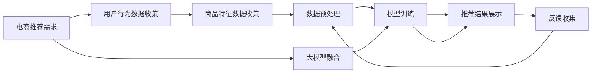

                 

# 搜索推荐系统的AI 大模型融合：电商平台的核心竞争力与可持续发展战略

## 1. 背景介绍

随着电商平台的飞速发展，个性化推荐系统的建设成为电商平台竞争力的重要标志。大模型融合技术以其强大的表征能力和泛化能力，在电商推荐系统中展现了巨大的应用潜力。然而，如何科学高效地构建推荐模型，实现用户行为理解的深度学习，成为电商企业核心竞争力提升的重要挑战。

本文旨在通过分析搜索推荐系统在大模型融合中的最新进展，探讨其核心算法原理与具体操作步骤，介绍其在电商平台的实际应用案例，为电商企业构建先进、高效、可持续发展的推荐系统提供参考。

## 2. 核心概念与联系

### 2.1 核心概念概述

为深入理解搜索推荐系统在大模型融合中的应用，我们首先介绍几个关键概念：

- 推荐系统(Recommendation System)：利用用户行为数据和商品特征数据，通过机器学习或深度学习算法，预测用户对商品感兴趣的程度，向用户推荐相关商品。
- 大模型融合(Big Model Integration)：利用预训练的大模型（如BERT、GPT-3等）在电商推荐中实现知识迁移和特征增强。通过微调或自适应学习等方式，将大模型的表征能力与电商推荐数据紧密结合，提升推荐系统的精度和多样性。
- 搜索推荐系统(Search & Recommendation System)：结合搜索和推荐功能的系统，实时获取用户查询意图并返回相关商品。通过搜索和推荐的双轮交互，提供个性化的购物体验。
- 电商平台(E-commerce Platform)：集成了商品展示、交易、支付、物流等功能的在线购物平台，依赖推荐系统提升用户购物体验和商品转化率。
- 数据融合(Data Fusion)：将多种数据源、多种模态数据融合起来，增强推荐系统的信息获取能力和决策多样性。

这些概念之间通过搜索推荐系统的构建流程相互关联，从数据处理到模型训练，再到结果输出，共同支撑着电商平台的推荐引擎。

### 2.2 核心概念原理和架构的 Mermaid 流程图



这个流程图展示了搜索推荐系统在大模型融合中的基本架构：

1. **需求收集**：通过电商平台的用户行为数据、商品特征数据，收集推荐需求。
2. **数据预处理**：对收集到的数据进行清洗、转换、特征工程等预处理操作。
3. **模型训练**：在预处理后的数据集上，利用大模型融合技术进行模型训练。
4. **推荐结果展示**：基于训练好的模型，将推荐结果实时展示给用户。
5. **反馈收集**：收集用户的点击、购买、评分等反馈数据，用于后续模型迭代和优化。
6. **数据预处理**：反馈数据再次经过预处理，用于模型迭代和优化。

## 3. 核心算法原理 & 具体操作步骤

### 3.1 算法原理概述

大模型融合的核心原理是利用预训练语言模型在大规模语料中学习到的语言和知识表征，通过微调或自适应学习等方法，将知识迁移到电商推荐场景中，以提升推荐系统的效果。

推荐系统的基本流程如下：
1. **数据收集与预处理**：收集用户行为数据和商品特征数据，进行清洗、标准化等预处理。
2. **特征工程**：根据电商推荐需求，设计并提取有效特征。
3. **模型训练**：利用预训练的大模型（如BERT、GPT等），通过微调或自适应学习等方法，进行模型训练。
4. **推荐结果输出**：基于训练好的模型，对用户查询意图进行理解，生成推荐结果。
5. **反馈与优化**：收集用户反馈数据，对模型进行迭代优化。

### 3.2 算法步骤详解

#### 步骤1: 数据收集与预处理

- **用户行为数据收集**：包括点击、浏览、收藏、购买等行为数据。
- **商品特征数据收集**：包括商品类别、品牌、价格、描述等特征。
- **数据清洗**：去除噪声和异常值，处理缺失值。
- **标准化与归一化**：将数据标准化到一定的范围，以便模型训练。

#### 步骤2: 特征工程

- **用户特征**：包括用户ID、用户历史行为、用户画像等。
- **商品特征**：包括商品ID、商品类别、商品属性等。
- **交互特征**：包括用户和商品的交互记录，如浏览时长、购买次数等。
- **时间特征**：包括用户行为发生的时间、节假日等。

#### 步骤3: 模型训练

- **预训练大模型的选择**：选择合适的预训练大模型，如BERT、GPT等。
- **微调与自适应学习**：对预训练模型进行微调，或采用自适应学习方法，将大模型知识迁移到电商推荐场景中。
- **损失函数设计**：选择合适的损失函数，如均方误差、交叉熵等，评估推荐系统效果。
- **优化器选择**：选择合适的优化器，如Adam、SGD等，进行模型参数优化。

#### 步骤4: 推荐结果输出

- **意图理解**：利用预训练模型或微调模型，理解用户查询意图。
- **召回与排序**：根据用户行为和商品特征，生成候选商品列表，并进行排序。
- **结果展示**：将推荐结果展示给用户。

#### 步骤5: 反馈与优化

- **收集反馈数据**：收集用户对推荐结果的点击、购买、评分等反馈数据。
- **模型迭代**：根据反馈数据，对模型进行迭代优化。

### 3.3 算法优缺点

**优点**：
- 大模型融合可以有效提升推荐系统的表现，特别是在电商推荐场景中，通过语义理解和知识迁移，实现更精准的推荐。
- 利用大模型的泛化能力，模型可以适应不同的用户和商品，提供个性化推荐。
- 大模型融合可以减少特征工程的工作量，提升模型训练效率。

**缺点**：
- 大模型融合需要大量标注数据和计算资源，成本较高。
- 预训练大模型的泛化能力有限，模型可能无法准确理解特定电商领域的用户行为。
- 大模型融合模型复杂度高，训练和推理速度较慢。

### 3.4 算法应用领域

大模型融合技术在电商推荐系统的应用领域广泛，具体如下：

- **个性化推荐**：利用大模型融合技术，对用户行为和商品特征进行深度学习，提供个性化推荐。
- **广告投放**：利用大模型融合技术，优化广告投放策略，提升广告点击率和转化率。
- **商品搜索**：利用大模型融合技术，提升商品搜索的准确性和召回率。
- **库存管理**：利用大模型融合技术，预测商品需求，优化库存管理。
- **用户画像**：利用大模型融合技术，构建用户画像，提升用户黏性。

## 4. 数学模型和公式 & 详细讲解 & 举例说明

### 4.1 数学模型构建

在电商推荐系统中，常见的推荐模型包括协同过滤、基于内容的推荐、基于矩阵分解的推荐等。下面以基于内容的推荐模型为例，介绍其数学模型构建过程。

假设用户行为数据为$X=\{x_1,x_2,...,x_n\}$，商品特征数据为$Y=\{y_1,y_2,...,y_m\}$。定义用户-商品交互矩阵$R_{ux}$，其中$R_{ux}=\left\{\begin{matrix}
    1, & \text{用户点击商品} \\
    0, & \text{用户未点击商品}
\end{matrix}\right.$。

目标是为每个用户$x_i$推荐$k$个最相关的商品$y_j$。

**目标函数**：

$$
\min_{\theta} \frac{1}{N}\sum_{u=1}^{U}\sum_{x=1}^{X}\sum_{j=1}^{J}R_{ux}\log\sigma(\theta^Tf(x_i,y_j))
$$

其中，$\sigma(\cdot)$为sigmoid函数，$f(x_i,y_j)$为特征函数，$\theta$为模型参数。

**优化算法**：

- **梯度下降法**：最小化目标函数，更新模型参数$\theta$。
- **正则化**：防止模型过拟合，使用L1或L2正则化。
- **迭代优化**：通过多次迭代，逐步优化模型参数。

### 4.2 公式推导过程

**特征函数设计**：

$$
f(x_i,y_j)=\left\{\begin{matrix}
    x_i^T\phi(y_j), & \text{用户已点击商品} \\
    0, & \text{用户未点击商品}
\end{matrix}\right.
$$

其中$\phi(\cdot)$为特征提取函数。

**目标函数推导**：

$$
\min_{\theta} \frac{1}{N}\sum_{u=1}^{U}\sum_{x=1}^{X}\sum_{j=1}^{J}R_{ux}\log\sigma(\theta^Tf(x_i,y_j))
$$

$$
\Rightarrow \min_{\theta} \frac{1}{N}\sum_{u=1}^{U}\sum_{x=1}^{X}\sum_{j=1}^{J}R_{ux}\log\sigma(\theta^Tx_i\phi(y_j))
$$

### 4.3 案例分析与讲解

以某电商平台的商品推荐系统为例，分析其在用户行为理解和大模型融合中的应用：

**用户行为理解**：
- **行为数据收集**：收集用户浏览、点击、购买等行为数据。
- **特征工程**：将用户行为数据转换为向量表示，设计并提取有效特征。
- **模型训练**：利用BERT等预训练模型进行微调，实现用户行为理解的深度学习。
- **意图理解**：利用微调后的模型，理解用户查询意图，生成推荐结果。

**大模型融合**：
- **大模型选择**：选择BERT作为预训练模型，进行微调。
- **特征映射**：将用户行为和商品特征映射到BERT的向量空间中。
- **知识迁移**：通过微调，将BERT的知识迁移到电商推荐场景中，提升推荐精度。
- **结果输出**：基于用户行为和商品特征，生成推荐列表。

## 5. 项目实践：代码实例和详细解释说明

### 5.1 开发环境搭建

1. **安装Python和Pandas**：
```bash
conda create -n recommendation python=3.8
conda activate recommendation
pip install pandas
```

2. **安装PyTorch和Transformers**：
```bash
conda install pytorch torchvision torchaudio transformers
```

3. **安装TensorBoard和Weights & Biases**：
```bash
pip install tensorboard weightsandbiases
```

### 5.2 源代码详细实现

以商品推荐为例，展示基于大模型融合的推荐系统代码实现：

**数据准备**：
```python
import pandas as pd
from transformers import BertTokenizer, BertModel

# 准备数据
train_data = pd.read_csv('train.csv')
test_data = pd.read_csv('test.csv')

# 分词器
tokenizer = BertTokenizer.from_pretrained('bert-base-cased')
```

**模型构建**：
```python
import torch.nn as nn
from transformers import BertForSequenceClassification

class RecommendationModel(nn.Module):
    def __init__(self, num_labels):
        super(RecommendationModel, self).__init__()
        self.bert = BertModel.from_pretrained('bert-base-cased')
        self.classifier = nn.Linear(self.bert.config.hidden_size, num_labels)
        self.dropout = nn.Dropout(0.1)
        
    def forward(self, input_ids, attention_mask):
        _, pooled_output = self.bert(input_ids, attention_mask=attention_mask)
        pooled_output = self.dropout(pooled_output)
        logits = self.classifier(pooled_output)
        return logits
```

**模型训练**：
```python
from torch.utils.data import DataLoader
from transformers import AdamW

# 加载模型
model = RecommendationModel(num_labels)
model.to('cuda')

# 准备数据
train_dataset = DataLoader(train_data, batch_size=32, shuffle=True)
test_dataset = DataLoader(test_data, batch_size=32, shuffle=False)

# 定义优化器
optimizer = AdamW(model.parameters(), lr=2e-5)

# 训练模型
for epoch in range(10):
    for batch in train_dataset:
        input_ids, attention_mask = batch['input_ids'].to('cuda'), batch['attention_mask'].to('cuda')
        logits = model(input_ids, attention_mask)
        loss = nn.BCEWithLogitsLoss()(logits, batch['labels'].to('cuda'))
        optimizer.zero_grad()
        loss.backward()
        optimizer.step()

    for batch in test_dataset:
        input_ids, attention_mask = batch['input_ids'].to('cuda'), batch['attention_mask'].to('cuda')
        logits = model(input_ids, attention_mask)
        loss = nn.BCEWithLogitsLoss()(logits, batch['labels'].to('cuda'))
        print(f'Epoch {epoch+1}, Test Loss: {loss:.4f}')
```

### 5.3 代码解读与分析

**数据准备**：
- **用户行为数据**：收集用户行为数据，并使用Pandas库进行数据清洗和预处理。
- **商品特征数据**：收集商品特征数据，并使用BERT分词器进行分词。

**模型构建**：
- **BertForSequenceClassification**：选择BERT作为预训练模型，进行微调。
- **RecommendationModel**：自定义推荐模型，将用户行为和商品特征映射到BERT的向量空间中。
- **dropout**：加入dropout层，防止模型过拟合。

**模型训练**：
- **DataLoader**：使用PyTorch的DataLoader，高效批处理数据。
- **AdamW**：使用AdamW优化器进行模型参数更新。
- **BCEWithLogitsLoss**：使用二分类交叉熵损失函数，评估推荐系统效果。

## 6. 实际应用场景

### 6.1 电商平台推荐系统

电商平台推荐系统是搜索推荐系统的典型应用场景。利用大模型融合技术，电商企业可以为用户提供个性化的商品推荐，提升用户购物体验和转化率。

具体而言，电商推荐系统可以利用大模型融合技术，结合用户行为数据和商品特征数据，进行深度学习，生成个性化推荐结果。通过持续的反馈和迭代优化，不断提升推荐系统的准确性和多样性。

### 6.2 智能广告投放

智能广告投放系统是推荐系统的重要应用方向。通过大模型融合技术，广告系统可以实现更加精准的广告投放，提升广告点击率和转化率。

具体而言，广告系统可以利用大模型融合技术，对用户行为和商品特征进行深度学习，生成广告投放策略。通过持续的反馈和迭代优化，不断提升广告系统的投放效果和用户体验。

### 6.3 搜索引擎推荐

搜索引擎推荐系统是搜索推荐系统的另一个重要应用场景。利用大模型融合技术，搜索引擎可以提升搜索结果的相关性和多样性，提升用户搜索体验。

具体而言，搜索引擎推荐系统可以利用大模型融合技术，结合用户查询意图和搜索结果，进行深度学习，生成个性化搜索结果。通过持续的反馈和迭代优化，不断提升搜索结果的相关性和多样性。

## 7. 工具和资源推荐

### 7.1 学习资源推荐

为帮助开发者系统掌握大模型融合技术，这里推荐一些优质的学习资源：

1. **《深度学习自然语言处理》（CS224N）**：斯坦福大学开设的NLP明星课程，涵盖自然语言处理的基本概念和经典模型。

2. **Transformers官方文档**：详细介绍了大模型融合的原理和实现方法，提供了丰富的样例代码。

3. **HuggingFace社区**：提供了丰富的预训练模型和开源代码，方便开发者进行研究和实践。

4. **《自然语言处理与深度学习》**：TensorFlow团队编写的入门书籍，介绍了自然语言处理的基本概念和深度学习技术。

### 7.2 开发工具推荐

为帮助开发者高效实现大模型融合技术，这里推荐一些常用的开发工具：

1. **PyTorch**：开源深度学习框架，支持动态计算图，适合快速迭代研究。

2. **TensorFlow**：由Google主导的深度学习框架，生产部署方便，适合大规模工程应用。

3. **Weights & Biases**：模型训练的实验跟踪工具，可以记录和可视化模型训练过程中的各项指标。

4. **TensorBoard**：TensorFlow配套的可视化工具，实时监测模型训练状态。

5. **Jupyter Notebook**：交互式编程环境，适合进行研究和实验。

### 7.3 相关论文推荐

为帮助开发者深入理解大模型融合技术，这里推荐几篇相关论文：

1. **Attention is All You Need**：提出Transformer结构，开启了预训练大模型时代。

2. **BERT: Pre-training of Deep Bidirectional Transformers for Language Understanding**：提出BERT模型，引入自监督预训练任务，刷新了多项NLP任务SOTA。

3. **AdaLoRA: Adaptive Low-Rank Adaptation for Parameter-Efficient Fine-Tuning**：提出AdaLoRA方法，通过自适应低秩适应的微调方法，提升模型参数效率。

4. **Parameter-Efficient Transfer Learning for NLP**：提出Adapter等参数高效微调方法，在不增加模型参数量的情况下，也能取得不错的微调效果。

## 8. 总结：未来发展趋势与挑战

### 8.1 研究成果总结

大模型融合技术在电商推荐系统中的应用，已经展现出巨大的应用潜力和实际效果。通过深度学习与大模型的结合，电商推荐系统可以实现更精准、更个性化的推荐，提升用户购物体验和转化率。

### 8.2 未来发展趋势

展望未来，大模型融合技术将在电商推荐系统中的应用更加广泛，主要趋势如下：

1. **多模态融合**：结合图像、视频、语音等多模态数据，提升推荐系统的信息获取能力和决策多样性。

2. **强化学习**：引入强化学习，优化推荐策略，提升用户满意度。

3. **因果推断**：引入因果推断，提升推荐系统的可解释性和鲁棒性。

4. **跨领域迁移**：将大模型知识迁移到其他领域，提升模型泛化能力。

5. **持续学习**：利用持续学习技术，不断吸收新数据和新知识，保持推荐系统的时效性。

### 8.3 面临的挑战

尽管大模型融合技术在电商推荐系统中已经取得了一些进展，但仍面临一些挑战：

1. **数据隐私和安全**：如何保护用户数据隐私，防止数据泄露和滥用。

2. **模型公平性**：如何确保推荐系统的公平性，避免推荐偏差和歧视。

3. **计算资源**：如何优化模型训练和推理资源，提高计算效率。

4. **模型解释性**：如何提高模型的可解释性，提升用户信任度和满意度。

5. **用户体验**：如何在推荐过程中提高用户满意度，提升用户粘性。

### 8.4 研究展望

未来，大模型融合技术在电商推荐系统中的应用前景广阔，需要进一步研究和优化。

1. **数据隐私保护**：研究如何在保护用户隐私的前提下，进行推荐系统训练和优化。

2. **公平性研究**：研究如何确保推荐系统的公平性，避免推荐偏差和歧视。

3. **计算资源优化**：研究如何优化模型训练和推理资源，提高计算效率。

4. **模型解释性增强**：研究如何提高模型的可解释性，提升用户信任度和满意度。

5. **用户体验提升**：研究如何在推荐过程中提高用户满意度，提升用户粘性。

总之，大模型融合技术在电商推荐系统中的应用前景广阔，需要进一步研究和优化，才能真正实现电商推荐的智能化、高效化和可持续化。

## 9. 附录：常见问题与解答

**Q1：如何选择合适的预训练大模型？**

A: 选择预训练大模型时，需要考虑模型的规模、性能、泛化能力等因素。BERT和GPT等模型已经在电商推荐系统中有广泛应用，可以考虑基于这些模型的变种进行微调。

**Q2：大模型融合时需要注意哪些问题？**

A: 大模型融合时需要注意数据质量、特征工程、模型参数优化等问题。需要进行充分的数据预处理和特征提取，选择适当的优化器和损失函数，进行多次迭代优化。

**Q3：如何提高大模型融合的计算效率？**

A: 可以通过模型剪枝、量化、分布式训练等方法，提高大模型融合的计算效率。使用GPU、TPU等高性能设备，也可以提升模型训练和推理速度。

**Q4：大模型融合是否需要大量的标注数据？**

A: 大模型融合不一定需要大量的标注数据，可以利用无监督学习、半监督学习等方法，减少对标注数据的依赖。

**Q5：如何平衡推荐系统的精度和多样性？**

A: 可以通过调整模型参数、优化损失函数、引入多样性约束等方法，平衡推荐系统的精度和多样性。

通过本文的系统梳理，可以看到，大模型融合技术在电商推荐系统中的应用前景广阔，有望提升电商平台的竞争力和用户体验。未来，通过持续的研究和优化，大模型融合技术将为电商推荐系统带来更多的创新和突破。

