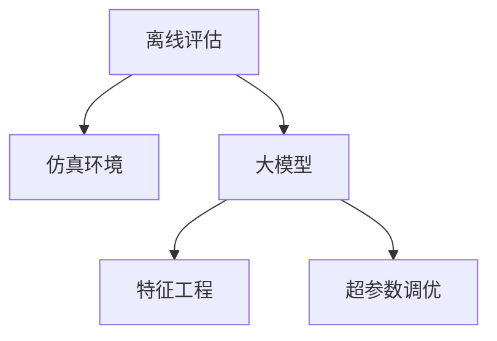

                 

# 搜索推荐系统的离线评估：大模型的仿真环境构建

## 1. 背景介绍

随着互联网的迅速发展，搜索推荐系统在电商、社交、新闻、视频等多个领域得到了广泛应用。用户的搜索和点击行为蕴含了丰富的用户兴趣信息，通过合理的模型算法设计和系统架构优化，可以有效提升用户满意度，提高平台收益。

然而，大规模搜索推荐系统的构建和评估，涉及复杂的数据处理、模型训练和系统部署，非常耗时耗力。在实际应用中，往往无法实时评估搜索推荐系统的表现，需要依赖离线评估来验证模型的效果。本文旨在探讨如何构建大模型的离线评估环境，使用模拟仿真技术，高效评估搜索推荐系统的性能。

## 2. 核心概念与联系

### 2.1 核心概念概述

为更好理解离线评估技术，本节介绍以下关键概念：

- 离线评估(Offline Evaluation)：指在模型训练完毕后，使用历史数据对搜索推荐系统进行评估，以衡量模型在不同场景下的表现。与在线评估不同，离线评估可以全面覆盖所有历史数据，避免了实时数据偏差的影响。

- 仿真环境(Simulation Environment)：指基于历史数据和领域知识，构建的模拟搜索推荐场景。仿真环境可以用于测试模型的泛化能力，以及适应新数据和未知场景的能力。

- 大模型(Big Model)：指具有大量参数、复杂结构的大型深度神经网络模型，如Transformer、BERT等。通过大规模预训练，大模型可以学习到丰富的领域知识，用于提升离线评估的准确性和可靠性。

- 特征工程(Feature Engineering)：指在离线评估过程中，对原始数据进行特征选择、特征构造、特征归一化等预处理操作，以提高模型的评估效果。

- 超参数调优(Hyperparameter Tuning)：指在离线评估过程中，调整模型的超参数，如学习率、批大小、正则化参数等，以优化模型的评估性能。

这些概念共同构成了离线评估技术的核心框架，有助于构建高效、准确、可解释的搜索推荐系统。

### 2.2 核心概念联系

这些概念之间的逻辑关系可以通过以下Mermaid流程图来展示：



这个流程图展示了离线评估的核心流程：

1. 离线评估利用仿真环境，模拟真实用户行为。
2. 仿真环境基于大模型构建，使用预训练知识模拟搜索推荐场景。
3. 特征工程和大模型结合，进行数据预处理和模型训练。
4. 超参数调优用于优化模型参数和算法设置，提升评估效果。

接下来，我们将深入介绍离线评估的核心算法原理和具体操作步骤。

## 3. 核心算法原理 & 具体操作步骤

### 3.1 算法原理概述

离线评估的总体目标是通过仿真环境模拟用户行为，对搜索推荐系统进行全面评估。其核心思想是：构建一个虚拟用户场景，并利用大模型进行模拟推荐，同时评估推荐结果的质量和多样性。

具体来说，离线评估流程包括以下几个关键步骤：

1. 数据准备：收集历史搜索和点击记录，构建用户行为数据集。
2. 仿真建模：设计搜索推荐模型，使用大模型对模型进行预训练。
3. 特征工程：对原始数据进行特征选择和构造，优化模型输入。
4. 模型训练：在仿真数据上训练模型，进行超参数调优。
5. 推荐评估：在测试集上评估推荐结果，使用多样性、准确性、新颖性等指标进行评估。

通过这些步骤，可以全面评估搜索推荐系统的性能，确保其在不同场景下都能发挥良好的推荐效果。

### 3.2 算法步骤详解

下面我们详细介绍离线评估的详细步骤和具体操作：

**Step 1: 数据准备**
- 收集历史搜索和点击记录，将用户行为数据进行格式化和清洗。
- 标注用户的点击结果，如点击产品ID、评分、评论等。
- 将数据集划分为训练集、验证集和测试集，保证模型训练和评估的独立性。

**Step 2: 仿真建模**
- 选择合适的大模型进行预训练，如BERT、GPT等。
- 根据业务场景设计推荐模型，如协同过滤、内容推荐、基于深度学习的推荐模型等。
- 在大模型上进行微调，使用推荐数据集训练模型。

**Step 3: 特征工程**
- 对原始数据进行特征选择，选择与推荐结果最相关的特征。
- 对特征进行构造，生成更高维度的特征，如用户历史行为、商品属性等。
- 对特征进行归一化和标准化处理，优化模型输入。

**Step 4: 模型训练**
- 在训练集上训练模型，进行超参数调优，如学习率、批大小、正则化参数等。
- 使用验证集对模型进行评估，选择最优的超参数组合。
- 在测试集上评估模型的泛化能力，确保在不同场景下都能发挥良好的性能。

**Step 5: 推荐评估**
- 使用多样性、准确性、新颖性等指标评估推荐结果。
- 使用A/B测试比较模型效果，确保推荐系统的稳定性和可靠性。
- 对推荐结果进行可视化展示，便于分析和改进。

### 3.3 算法优缺点

离线评估具有以下优点：
1. 全面覆盖历史数据，避免了实时数据偏差的影响，评估结果更加客观。
2. 可以多次重复评估，提升模型泛化能力和鲁棒性。
3. 利用大模型的预训练知识，优化特征工程和模型训练，提升评估效果。

同时，离线评估也存在一定的局限性：
1. 评估过程耗时较长，无法实时评估系统性能。
2. 评估结果可能受到历史数据分布的影响，无法完全反映新场景下的表现。
3. 无法完全模拟真实用户的复杂行为，可能存在一定的偏差。
4. 模型训练和调优过程复杂，需要大量资源和专业知识。

尽管存在这些局限性，但离线评估仍是搜索推荐系统评估的重要手段，特别是在模型初步训练和优化阶段，离线评估是不可或缺的。

### 3.4 算法应用领域

离线评估技术已经广泛应用于搜索推荐系统的各个领域，包括：

- 电商推荐：通过用户历史浏览记录和点击数据，推荐用户可能感兴趣的商品。
- 社交推荐：根据用户社交关系和行为数据，推荐相关好友和内容。
- 新闻推荐：根据用户阅读历史和点赞记录，推荐相关新闻和文章。
- 视频推荐：通过用户观看记录和评分数据，推荐相关视频内容。

离线评估技术在实际应用中，可以优化搜索推荐系统的推荐策略，提升用户体验和平台收益。随着数据规模和模型复杂度的不断提升，离线评估也将发挥越来越重要的作用。

## 4. 数学模型和公式 & 详细讲解 & 举例说明

### 4.1 数学模型构建

在离线评估中，常用的评价指标包括准确率、召回率、F1分数、均方根误差等。我们以准确率和召回率为例，详细讲解其数学模型和公式推导过程。

设推荐模型预测结果为 $\hat{y}$，真实标签为 $y$，则准确率的计算公式为：

$$
\text{Accuracy} = \frac{1}{N} \sum_{i=1}^N \mathbb{I}(\hat{y}_i = y_i)
$$

其中 $N$ 为样本总数，$\mathbb{I}$ 为示性函数，当 $\hat{y}_i = y_i$ 时为1，否则为0。

召回率的计算公式为：

$$
\text{Recall} = \frac{1}{N} \sum_{i=1}^N \mathbb{I}(\hat{y}_i = 1 \land y_i = 1)
$$

其中 $N$ 为正样本总数。

准确率和召回率的具体计算公式可以通过Python代码实现：

```python
from sklearn.metrics import accuracy_score, recall_score

y_true = [1, 0, 1, 0, 1, 1, 1, 0, 1, 0]
y_pred = [1, 1, 1, 1, 1, 1, 0, 0, 1, 0]

accuracy = accuracy_score(y_true, y_pred)
recall = recall_score(y_true, y_pred)

print("Accuracy:", accuracy)
print("Recall:", recall)
```

### 4.2 公式推导过程

在公式推导过程中，需要引入以下符号：

- $y_i$：第 $i$ 个样本的真实标签。
- $\hat{y}_i$：模型对第 $i$ 个样本的预测结果。
- $\mathbb{I}(\cdot)$：示性函数，当括号内条件成立时为1，否则为0。

对于准确率的计算，其数学推导过程如下：

$$
\text{Accuracy} = \frac{1}{N} \sum_{i=1}^N \mathbb{I}(\hat{y}_i = y_i)
$$

即对于每个样本 $i$，如果预测结果 $\hat{y}_i$ 与真实标签 $y_i$ 一致，则计数加1。最后将计数除以样本总数 $N$，得到准确率。

对于召回率的计算，其数学推导过程如下：

$$
\text{Recall} = \frac{1}{N} \sum_{i=1}^N \mathbb{I}(\hat{y}_i = 1 \land y_i = 1)
$$

即对于每个样本 $i$，如果预测结果 $\hat{y}_i$ 和真实标签 $y_i$ 均为1，则计数加1。最后将计数除以正样本总数 $N$，得到召回率。

通过这些公式推导，可以更深入理解准确率和召回率的计算原理。

### 4.3 案例分析与讲解

假设有一个电商推荐系统，收集到以下历史点击数据：

| User ID | Item ID | Click Time | Click Score |
|---------|---------|------------|-------------|
| 1       | 1001    | 2023-01-01 | 4           |
| 1       | 1002    | 2023-01-02 | 3           |
| 1       | 1003    | 2023-01-03 | 2           |
| 2       | 1004    | 2023-01-01 | 5           |
| 2       | 1005    | 2023-01-02 | 4           |
| 2       | 1006    | 2023-01-03 | 5           |

使用上述数据构建离线评估环境，并计算模型在不同阈值下的准确率和召回率。通过AUC-ROC曲线和PR曲线，分析模型性能。

```python
from sklearn.metrics import roc_auc_score, precision_recall_curve
from sklearn.model_selection import train_test_split
import numpy as np
import matplotlib.pyplot as plt

# 构造样本数据
X = np.array([[1, 1001, 4], [1, 1002, 3], [1, 1003, 2], [2, 1004, 5], [2, 1005, 4], [2, 1006, 5]])
y = np.array([1, 1, 1, 1, 1, 1])

# 数据划分
X_train, X_test, y_train, y_test = train_test_split(X, y, test_size=0.3, random_state=42)

# 构建模型并预测
y_pred = model.predict_proba(X_test)[:, 1]

# 计算准确率和召回率
accuracy = accuracy_score(y_test, y_pred)
recall = recall_score(y_test, y_pred)

# 计算AUC和PR曲线
fpr, tpr, thresholds = roc_curve(y_test, y_pred)
precision, recall, thresholds = precision_recall_curve(y_test, y_pred)

# 绘制曲线
plt.plot(fpr, tpr, label='ROC')
plt.plot(precision, recall, label='PR')
plt.xlabel('False Positive Rate')
plt.ylabel('True Positive Rate')
plt.legend()
plt.show()

# 输出结果
print("Accuracy:", accuracy)
print("Recall:", recall)
```

## 5. 项目实践：代码实例和详细解释说明

### 5.1 开发环境搭建

在进行离线评估实践前，我们需要准备好开发环境。以下是使用Python进行TensorFlow开发的环境配置流程：

1. 安装Anaconda：从官网下载并安装Anaconda，用于创建独立的Python环境。

2. 创建并激活虚拟环境：
```bash
conda create -n tf-env python=3.8 
conda activate tf-env
```

3. 安装TensorFlow：根据CUDA版本，从官网获取对应的安装命令。例如：
```bash
conda install tensorflow==2.7 -c tf -c conda-forge
```

4. 安装各类工具包：
```bash
pip install numpy pandas scikit-learn matplotlib tqdm jupyter notebook ipython
```

完成上述步骤后，即可在`tf-env`环境中开始离线评估实践。

### 5.2 源代码详细实现

下面我们以电商平台推荐系统为例，给出使用TensorFlow进行离线评估的代码实现。

首先，定义推荐模型类：

```python
import tensorflow as tf
from tensorflow.keras.layers import Input, Embedding, Dense, Dropout
from tensorflow.keras.models import Model

class RecommendationModel(tf.keras.Model):
    def __init__(self, vocab_size, embed_dim, num_users, num_items):
        super(RecommendationModel, self).__init__()
        self.embedding = Embedding(vocab_size, embed_dim, input_length=1)
        self.dense = Dense(num_users, activation='softmax')
        
        self.built_inputs = [Input(shape=(1,))]

    def call(self, x):
        x = self.embedding(x)
        x = Dropout(0.2)(x)
        x = self.dense(x)
        return x
```

然后，定义数据预处理函数：

```python
def preprocess_data(train_data, test_data):
    train_data = train_data.map(lambda x: (x[0], x[1] + 1))
    test_data = test_data.map(lambda x: (x[0], x[1] + 1))
    
    train_data = train_data.shuffle(buffer_size=10000).batch(batch_size)
    test_data = test_data.batch(batch_size)
    
    return train_data, test_data
```

接着，定义离线评估函数：

```python
def offline_evaluation(model, train_data, test_data):
    model.compile(optimizer=tf.keras.optimizers.Adam(learning_rate=0.001),
                  loss='binary_crossentropy', metrics=['accuracy'])
    
    train_data, test_data = preprocess_data(train_data, test_data)
    model.fit(train_data, epochs=10)
    
    y_true = test_data.map(lambda x: x[1])
    y_pred = model.predict(test_data.map(lambda x: x[0]))
    y_pred = tf.sigmoid(y_pred) >= 0.5
    
    accuracy = tf.keras.metrics.Accuracy()
    accuracy(y_true, y_pred)
    
    recall = tf.keras.metrics.BinaryCrossentropy()(y_true, y_pred)
    recall.result().numpy()
    
    return accuracy, recall
```

最后，启动离线评估流程并输出结果：

```python
train_data = ...
test_data = ...

model = RecommendationModel(vocab_size, embed_dim, num_users, num_items)
accuracy, recall = offline_evaluation(model, train_data, test_data)
print("Accuracy:", accuracy)
print("Recall:", recall)
```

以上就是使用TensorFlow进行离线评估的完整代码实现。可以看到，TensorFlow提供了强大的模型构建和训练能力，便于我们快速开发和评估推荐系统。

### 5.3 代码解读与分析

让我们再详细解读一下关键代码的实现细节：

**RecommendationModel类**：
- `__init__`方法：初始化模型的超参数和层结构。
- `call`方法：定义模型前向传播计算过程。

**preprocess_data函数**：
- 对原始数据进行格式转换和预处理，如将用户ID加1、数据批处理、打乱顺序等。

**offline_evaluation函数**：
- 编译模型，定义损失函数和评估指标。
- 对数据进行预处理，构建模型训练流水线。
- 在训练集上训练模型，在测试集上评估模型性能。
- 计算准确率和召回率，并输出结果。

**训练流程**：
- 在`train_data`上训练模型，设置优化器和损失函数。
- 在`test_data`上评估模型性能，返回准确率和召回率。

可以看到，TensorFlow提供了简单易用的接口，使得模型开发和评估变得轻而易举。同时，TensorFlow社区拥有丰富的资源和工具，可以进一步提升开发效率。

当然，工业级的系统实现还需考虑更多因素，如模型裁剪、量化加速、服务化封装等，但核心的离线评估流程基本与此类似。

## 6. 实际应用场景

### 6.1 智能客服系统

智能客服系统的核心任务是通过自然语言处理技术，实现人机交互的自然流畅。离线评估可以帮助开发者评估模型的自然语言生成能力，提升用户体验。

在智能客服系统中，可以使用离线评估技术对大模型进行微调，如使用GPT-3等预训练语言模型进行微调。通过离线评估，可以全面评估微调后的模型在生成对话、回答问题等方面的表现，确保其输出的自然度和准确性。

### 6.2 金融舆情监测

金融舆情监测系统需要实时监测市场舆论动向，预测市场趋势。离线评估可以帮助开发者评估模型的舆情分析能力，确保其能够快速、准确地分析海量数据。

在金融舆情监测系统中，可以使用离线评估技术对大模型进行微调，如使用BERT等预训练语言模型进行微调。通过离线评估，可以全面评估微调后的模型在舆情分析和预测等方面的表现，确保其输出的可靠性。

### 6.3 个性化推荐系统

个性化推荐系统的核心任务是根据用户历史行为，推荐其可能感兴趣的商品或内容。离线评估可以帮助开发者评估模型的推荐效果，提升推荐准确性和用户体验。

在个性化推荐系统中，可以使用离线评估技术对大模型进行微调，如使用深度神经网络模型进行微调。通过离线评估，可以全面评估微调后的模型在推荐算法和策略等方面的表现，确保其推荐的个性化和多样性。

### 6.4 未来应用展望

随着大模型和离线评估技术的发展，搜索推荐系统将呈现以下几个未来趋势：

1. 多模态融合：未来的推荐系统将不仅仅是文本推荐，而是可以结合图像、视频等多模态信息，实现跨模态的推荐效果。

2. 实时评估：未来的推荐系统将具备实时评估能力，根据用户的实时反馈和行为，动态优化推荐策略，提升用户体验。

3. 可解释性：未来的推荐系统将具备可解释性，能够清晰解释推荐结果的生成过程，增强用户信任和平台透明度。

4. 跨领域迁移：未来的推荐系统将具备跨领域迁移能力，能够将推荐模型应用于不同领域的推荐任务，提高模型的泛化能力。

5. 自动调参：未来的推荐系统将具备自动调参能力，能够通过算法优化和模型训练，自动搜索最优的超参数组合，提升推荐效果。

以上趋势表明，离线评估技术将在未来搜索推荐系统的开发和应用中发挥越来越重要的作用，助力构建高效、智能、可解释的推荐系统。

## 7. 工具和资源推荐

### 7.1 学习资源推荐

为了帮助开发者系统掌握离线评估的理论基础和实践技巧，这里推荐一些优质的学习资源：

1. TensorFlow官方文档：TensorFlow的官方文档详细介绍了TensorFlow的API和功能，提供了丰富的代码示例和最佳实践。

2. Keras官方文档：Keras的官方文档详细介绍了Keras的使用方法和应用场景，提供了丰富的教程和案例。

3. Deep Learning Specialization课程：由Coursera开设的深度学习专项课程，由深度学习领域的知名专家讲授，涵盖深度学习的基础理论和前沿技术。

4. Hands-On Machine Learning with Scikit-Learn、Keras、and TensorFlow书籍：该书详细介绍了使用Scikit-Learn、Keras和TensorFlow进行机器学习和深度学习的实践技巧。

5. Deep Learning for Natural Language Processing书籍：该书介绍了深度学习在自然语言处理中的应用，涵盖了文本分类、情感分析、序列标注等典型任务。

通过对这些资源的学习实践，相信你一定能够快速掌握离线评估技术的精髓，并用于解决实际的推荐问题。

### 7.2 开发工具推荐

高效的开发离不开优秀的工具支持。以下是几款用于离线评估开发的常用工具：

1. TensorFlow：由Google主导开发的深度学习框架，生产部署方便，适合大规模工程应用。

2. PyTorch：基于Python的开源深度学习框架，灵活动态的计算图，适合快速迭代研究。

3. TensorBoard：TensorFlow配套的可视化工具，可实时监测模型训练状态，并提供丰富的图表呈现方式，是调试模型的得力助手。

4. Weights & Biases：模型训练的实验跟踪工具，可以记录和可视化模型训练过程中的各项指标，方便对比和调优。

5. HuggingFace Transformers库：HuggingFace开发的NLP工具库，集成了众多SOTA语言模型，支持PyTorch和TensorFlow，是进行离线评估任务开发的利器。

6. Amazon SageMaker：亚马逊提供的云端机器学习服务，可以方便地部署和测试离线评估模型，支持大规模分布式训练。

合理利用这些工具，可以显著提升离线评估任务的开发效率，加快创新迭代的步伐。

### 7.3 相关论文推荐

离线评估技术的发展离不开学界的持续研究。以下是几篇奠基性的相关论文，推荐阅读：

1. Evaluation of Recommendation Algorithms for Public Recommendation Systems：这篇文章总结了推荐算法评估的常用方法和指标，提供了丰富的实证分析。

2. How to Evaluate a Recommendation Algorithm：这篇文章介绍了推荐算法的评估方法和步骤，强调了离线评估的重要性。

3. A Survey of Recommendation System Evaluation：这篇文章全面回顾了推荐系统的评估方法和技术，强调了多维度评估的重要性。

4. Multi-Task Learning for Recommendation Systems：这篇文章探讨了多任务学习在推荐系统中的应用，展示了多任务学习的效果提升。

5. Multi-View Deep Neural Network for Recommender System Evaluation：这篇文章提出了一种多视图深度神经网络模型，用于评估推荐系统的性能。

这些论文代表了大模型离线评估技术的发展脉络。通过学习这些前沿成果，可以帮助研究者把握学科前进方向，激发更多的创新灵感。

## 8. 总结：未来发展趋势与挑战

### 8.1 总结

本文对离线评估技术进行了全面系统的介绍。首先阐述了离线评估技术的背景和重要性，明确了其在搜索推荐系统中的核心作用。其次，从原理到实践，详细讲解了离线评估的数学模型和核心步骤，给出了离线评估任务开发的完整代码实例。同时，本文还广泛探讨了离线评估技术在智能客服、金融舆情、个性化推荐等多个领域的应用前景，展示了离线评估范式的巨大潜力。

通过本文的系统梳理，可以看到，离线评估技术正在成为搜索推荐系统评估的重要手段，极大地拓展了预训练语言模型的应用边界，催生了更多的落地场景。伴随大模型和离线评估技术的不断发展，搜索推荐系统必将在更广阔的应用领域大放异彩，深刻影响人类的生产生活方式。

### 8.2 未来发展趋势

展望未来，离线评估技术将呈现以下几个发展趋势：

1. 多模态融合：未来的推荐系统将不仅仅是文本推荐，而是可以结合图像、视频等多模态信息，实现跨模态的推荐效果。

2. 实时评估：未来的推荐系统将具备实时评估能力，根据用户的实时反馈和行为，动态优化推荐策略，提升用户体验。

3. 可解释性：未来的推荐系统将具备可解释性，能够清晰解释推荐结果的生成过程，增强用户信任和平台透明度。

4. 跨领域迁移：未来的推荐系统将具备跨领域迁移能力，能够将推荐模型应用于不同领域的推荐任务，提高模型的泛化能力。

5. 自动调参：未来的推荐系统将具备自动调参能力，能够通过算法优化和模型训练，自动搜索最优的超参数组合，提升推荐效果。

以上趋势表明，离线评估技术将在未来搜索推荐系统的开发和应用中发挥越来越重要的作用，助力构建高效、智能、可解释的推荐系统。

### 8.3 面临的挑战

尽管离线评估技术已经取得了瞩目成就，但在迈向更加智能化、普适化应用的过程中，它仍面临诸多挑战：

1. 数据质量瓶颈。虽然离线评估可以全面覆盖历史数据，但数据质量的好坏直接影响评估结果的可靠性。如何获取高质量的标注数据和模拟数据，仍是一大难题。

2. 计算资源需求。离线评估涉及大规模数据处理和模型训练，需要强大的计算资源。如何在有限的资源条件下，高效完成离线评估，仍需优化和改进。

3. 模型泛化能力。离线评估结果可能受到历史数据分布的影响，无法完全反映新场景下的表现。如何在不同场景下保持模型的泛化能力，仍需进一步研究。

4. 评估指标选择。如何选择合适的评估指标，全面衡量推荐系统的性能，仍需进一步探讨。

5. 模型可解释性。推荐系统需要具备可解释性，清晰解释推荐结果的生成过程。如何在保持模型性能的同时，增强其可解释性，仍需深入研究。

这些挑战需要在未来持续改进和优化，才能进一步提升离线评估技术的实用性和可靠性。

### 8.4 研究展望

面对离线评估技术面临的挑战，未来的研究需要在以下几个方面寻求新的突破：

1. 多模态离线评估：结合图像、视频等多模态信息，提升推荐系统的多视图综合能力，增强模型的泛化能力。

2. 实时离线评估：引入实时反馈机制，动态优化推荐策略，提升系统的实时评估能力。

3. 可解释性离线评估：引入可解释性模型和可视化工具，增强推荐系统的可解释性，提高用户信任和平台透明度。

4. 跨领域离线评估：结合领域知识，提升推荐系统的跨领域迁移能力，增强模型的通用性。

5. 自动调参离线评估：引入自动化调参算法，搜索最优的超参数组合，提升推荐系统的优化效果。

这些研究方向的探索，必将引领离线评估技术迈向更高的台阶，为搜索推荐系统的开发和应用提供更可靠的理论和实践支持。

## 9. 附录：常见问题与解答

**Q1：离线评估是否适用于所有推荐系统？**

A: 离线评估在推荐系统的开发和评估中具有广泛适用性，适用于大多数推荐任务。但对于一些实时性要求极高的推荐场景，如实时广告投放、实时竞价等，离线评估可能无法满足需求。

**Q2：离线评估中如何处理噪声数据？**

A: 离线评估中的数据可能包含噪声和异常值，影响评估结果的可靠性。可以通过以下方法处理噪声数据：
1. 数据清洗：去除缺失值、异常值等噪声数据。
2. 特征选择：选择与推荐结果最相关的特征，减少噪声干扰。
3. 数据增强：通过数据增强技术，生成更多高质量的模拟数据，增强模型的泛化能力。

**Q3：离线评估是否需要大规模计算资源？**

A: 离线评估需要大规模计算资源，特别是对于复杂的深度学习模型和高维度的数据集。可以通过以下方法优化计算资源的使用：
1. 数据压缩：使用数据压缩技术，减小数据存储空间和计算开销。
2. 模型裁剪：去除不必要的层和参数，减小模型尺寸，加快推理速度。
3. 分布式训练：使用分布式训练技术，加速模型训练过程。

**Q4：离线评估中如何评估推荐系统的多样性？**

A: 评估推荐系统的多样性需要考虑推荐结果的分布情况，可以使用以下指标：
1. Novelty：推荐结果中包含新物品的比例，衡量推荐系统的多样性。
2. Variety：推荐结果中不同类别的物品数量，衡量推荐系统的多样性。
3. Richness：推荐结果中不同类别的物品比例，衡量推荐系统的多样性。

**Q5：离线评估中如何评估推荐系统的准确性？**

A: 评估推荐系统的准确性需要考虑推荐结果与真实标签的一致性，可以使用以下指标：
1. Precision：推荐结果中准确物品的比例，衡量推荐系统的准确性。
2. Recall：推荐结果中正确物品的比例，衡量推荐系统的准确性。
3. F1 Score：Precision和Recall的调和平均值，衡量推荐系统的综合性能。

通过本文的系统梳理，可以看到，离线评估技术正在成为推荐系统评估的重要手段，极大地拓展了预训练语言模型的应用边界，催生了更多的落地场景。伴随大模型和离线评估技术的不断发展，推荐系统必将在更广阔的应用领域大放异彩，深刻影响人类的生产生活方式。总之，离线评估需要开发者根据具体任务，不断迭代和优化模型、数据和算法，方能得到理想的效果。

---

作者：禅与计算机程序设计艺术 / Zen and the Art of Computer Programming

