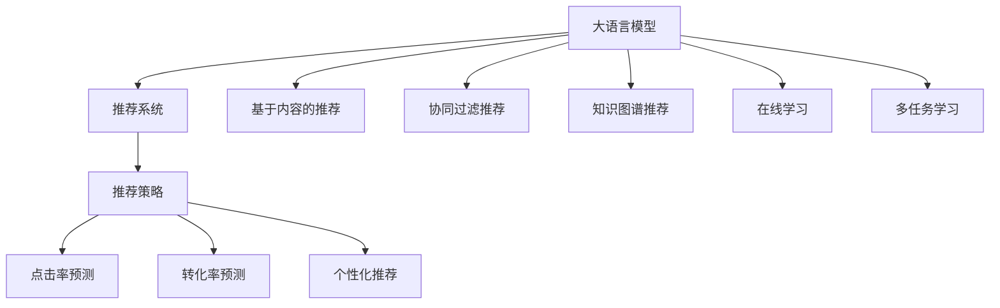

                 

# 搜索推荐系统的算法本质：AI 大模型的融合策略

## 1. 背景介绍

随着互联网和电子商务的迅速发展，搜索推荐系统（Recommendation Systems）已成为企业和用户间沟通的重要桥梁。优质的推荐系统可以大幅提升用户体验，增加转化率和满意度。然而，构建有效的推荐系统涉及复杂的算法和技术，需要从数据挖掘、模型训练、在线学习等多个维度进行全面优化。近年来，基于人工智能（AI）的大模型（如BERT、GPT等）技术为推荐系统带来了新的突破，利用其强大的语言理解能力，对自然语言处理（NLP）任务进行微调，显著提升了推荐系统的效果和精准度。本文将系统阐述大模型在搜索推荐系统中的应用，从核心概念到实现步骤，再到未来发展，全面解读大模型融合策略的本质。

## 2. 核心概念与联系

### 2.1 核心概念概述

- **大语言模型**：指通过自监督或监督学习方式，在大型文本语料上预训练的深度学习模型，如BERT、GPT等。这些模型可以捕捉到丰富的语言结构和语义，具备很强的通用语言处理能力。

- **推荐系统**：利用用户历史行为数据或用户画像，通过算法推荐出用户可能感兴趣的商品、内容或服务，提升用户满意度。推荐系统可以分为基于内容的推荐、协同过滤推荐、混合推荐等多种类型。

- **融合策略**：将多种算法和技术有机结合，提升推荐系统的整体效果。例如，将大模型与协同过滤、知识图谱、在线学习等技术融合，形成更为全面、高效的推荐系统。

### 2.2 核心概念原理和架构的 Mermaid 流程图



## 3. 核心算法原理 & 具体操作步骤

### 3.1 算法原理概述

基于大语言模型的推荐系统主要利用预训练语言模型的能力，通过微调在推荐任务上进行优化。其核心思想是：将大语言模型视作一个特征提取器，通过学习用户与商品之间的语义关联，生成个性化的推荐结果。具体步骤如下：

1. **数据准备**：收集用户历史行为数据，将用户与商品间的交互转化为向量形式。
2. **模型微调**：在大语言模型的基础上，使用部分标注数据进行微调，优化模型对特定任务的理解能力。
3. **融合策略**：结合其他推荐算法，如协同过滤、知识图谱等，形成多模态、多任务的学习方式，提升推荐系统的效果和泛化能力。

### 3.2 算法步骤详解

#### 3.2.1 数据准备

数据准备是推荐系统的第一步。通常，我们将用户与商品之间的交互数据，如浏览、点击、购买等转化为向量形式。具体做法如下：

1. **用户编码**：将用户ID、历史行为等信息通过独热编码、嵌入向量等形式转化为向量形式。
2. **商品编码**：将商品ID、属性等信息通过相似的方式转化为向量形式。
3. **交互数据编码**：将用户与商品的交互数据，如点击记录、购买记录等通过编码生成交互向量。

#### 3.2.2 模型微调

模型微调是大模型推荐系统的核心步骤。通过在预训练大模型基础上，使用用户与商品之间的语义关联进行微调，优化推荐模型的表现。具体步骤如下：

1. **模型选择**：选择合适的预训练大模型，如BERT、GPT等。
2. **任务适配**：根据推荐任务的类型，在预训练模型顶层设计合适的输出层和损失函数，如交叉熵损失、均方误差损失等。
3. **微调参数**：选择合适的学习率、批大小、迭代轮数等超参数，使用Adam、SGD等优化算法进行模型微调。
4. **性能评估**：在验证集和测试集上评估微调后的模型性能，根据评估结果进行调整。

#### 3.2.3 融合策略

推荐系统不依赖单一算法，通常会结合多种算法和技术。融合策略主要包括以下几个方面：

1. **协同过滤**：通过用户-商品矩阵，寻找相似用户或商品，推荐用户可能感兴趣的商品或内容。
2. **知识图谱**：构建商品之间的知识图谱，通过关系推理，推荐相关商品。
3. **在线学习**：利用用户实时行为数据，动态调整推荐模型，提升推荐效果。
4. **多任务学习**：将推荐任务与其他NLP任务，如情感分析、实体识别等，结合训练，提升模型泛化能力。

### 3.3 算法优缺点

基于大语言模型的推荐系统有以下优点：

1. **提升推荐精度**：大语言模型具备强大的语义理解能力，通过微调可以更好地捕捉用户与商品之间的语义关联，提升推荐精度。
2. **通用性强**：大模型可以应用于多种推荐任务，如商品推荐、内容推荐等，具有很强的通用性。
3. **参数高效**：通过参数高效微调技术，如Adapter、LoRA等，在固定大部分预训练参数的情况下，仍可取得不错的微调效果。
4. **实时性强**：结合在线学习技术，可以实时动态调整推荐模型，提升推荐效果。

同时，该方法也存在一些局限性：

1. **标注数据依赖**：微调的效果很大程度上取决于标注数据的质量和数量，获取高质量标注数据的成本较高。
2. **模型复杂度高**：大语言模型参数量庞大，训练和推理过程复杂，需要较强的计算资源支持。
3. **泛化能力有限**：当目标任务与预训练数据的分布差异较大时，微调的性能提升有限。
4. **可解释性不足**：微调模型的决策过程缺乏可解释性，难以对其推理逻辑进行分析和调试。

尽管存在这些局限性，但就目前而言，基于大语言模型的推荐方法仍是推荐系统的主流范式。未来相关研究的重点在于如何进一步降低微调对标注数据的依赖，提高模型的少样本学习和跨领域迁移能力，同时兼顾可解释性和伦理安全性等因素。

### 3.4 算法应用领域

基于大语言模型的推荐系统已经在多个领域得到了广泛应用，具体如下：

1. **电商推荐**：如淘宝、京东等电商平台，通过推荐系统向用户推荐可能感兴趣的商品，提升购物体验。
2. **视频推荐**：如YouTube、Netflix等视频平台，通过推荐系统向用户推荐可能感兴趣的视频内容。
3. **新闻推荐**：如今日头条、网易新闻等新闻平台，通过推荐系统向用户推荐可能感兴趣的新闻资讯。
4. **音乐推荐**：如Spotify、QQ音乐等音乐平台，通过推荐系统向用户推荐可能感兴趣的音乐。
5. **个性化广告**：如Facebook、Google等广告平台，通过推荐系统向用户推荐可能感兴趣的广告内容。

除了上述这些经典应用外，大语言模型推荐系统还被创新性地应用到更多场景中，如个性化健康推荐、旅游推荐、金融推荐等，为电商、视频、媒体等行业带来新的突破。随着预训练模型和推荐算法的不断进步，相信基于大语言模型的推荐系统必将在更广阔的应用领域大放异彩。

## 4. 数学模型和公式 & 详细讲解

### 4.1 数学模型构建

基于大语言模型的推荐系统主要通过向量表示用户和商品，利用大模型的语义关联能力进行推荐。具体数学模型如下：

设用户为 $u$，商品为 $i$，用户与商品的交互矩阵为 $A$，其中 $A_{ui}$ 表示用户 $u$ 对商品 $i$ 的评分。

用户向量表示为 $U = [u_1, u_2, ..., u_n]$，商品向量表示为 $I = [i_1, i_2, ..., i_m]$，其中 $u_k$ 和 $i_j$ 分别表示用户和商品的嵌入向量。

推荐模型为 $f(U, I)$，通过计算用户与商品的相似度，推荐出用户可能感兴趣的商品。

### 4.2 公式推导过程

#### 4.2.1 用户和商品向量表示

用户和商品可以通过独热编码或嵌入向量等方式转化为向量形式。假设用户 $u$ 的向量表示为 $u = [u_1, u_2, ..., u_n]$，商品 $i$ 的向量表示为 $i = [i_1, i_2, ..., i_m]$，其中 $u_k$ 和 $i_j$ 分别表示用户和商品的嵌入向量。

#### 4.2.2 用户与商品的相似度计算

假设用户与商品的相似度通过余弦相似度计算，则相似度为：

$$
\text{similarity}(u, i) = \cos(\theta) = \frac{u \cdot i}{||u||_2 ||i||_2}
$$

其中 $u \cdot i$ 表示用户向量与商品向量的点积，$||u||_2$ 和 $||i||_2$ 分别表示用户向量和商品向量的范数。

#### 4.2.3 推荐模型计算

推荐模型 $f(U, I)$ 可以根据用户与商品的相似度，推荐出用户可能感兴趣的商品。假设用户向量为 $u$，商品向量为 $i$，则推荐结果为：

$$
f(U, I) = \text{argmax}_i (\text{similarity}(u, i))
$$

### 4.3 案例分析与讲解

假设用户 $u$ 对商品 $i$ 的评分矩阵为 $A = \begin{bmatrix} 4 & 3 & 5 \\ 3 & 5 & 4 \\ 5 & 4 & 3 \end{bmatrix}$，用户向量为 $U = [u_1, u_2, u_3] = [0.5, 0.3, 0.7]$，商品向量为 $I = [i_1, i_2, i_3] = [0.6, 0.4, 0.9]$。

通过计算用户与商品的相似度，可以发现用户 $u$ 与商品 $i$ 的相似度为：

$$
\text{similarity}(u, i) = \frac{0.5 \times 0.6 + 0.3 \times 0.4 + 0.7 \times 0.9}{\sqrt{0.5^2 + 0.3^2 + 0.7^2} \times \sqrt{0.6^2 + 0.4^2 + 0.9^2}} \approx 0.78
$$

通过推荐模型计算，可以得出用户 $u$ 可能感兴趣的商品为 $i_1$，即商品1。

## 5. 项目实践：代码实例和详细解释说明

### 5.1 开发环境搭建

在进行大语言模型推荐系统开发前，需要先搭建好开发环境。以下是使用Python进行PyTorch开发的环境配置流程：

1. 安装Anaconda：从官网下载并安装Anaconda，用于创建独立的Python环境。

2. 创建并激活虚拟环境：
```bash
conda create -n pytorch-env python=3.8 
conda activate pytorch-env
```

3. 安装PyTorch：根据CUDA版本，从官网获取对应的安装命令。例如：
```bash
conda install pytorch torchvision torchaudio cudatoolkit=11.1 -c pytorch -c conda-forge
```

4. 安装Transformers库：
```bash
pip install transformers
```

5. 安装各类工具包：
```bash
pip install numpy pandas scikit-learn matplotlib tqdm jupyter notebook ipython
```

完成上述步骤后，即可在`pytorch-env`环境中开始推荐系统开发。

### 5.2 源代码详细实现

下面我们以电商推荐系统为例，给出使用Transformers库对BERT模型进行推荐开发的PyTorch代码实现。

首先，定义推荐系统的数据处理函数：

```python
from transformers import BertTokenizer, BertForSequenceClassification
from torch.utils.data import Dataset
import torch

class RecommendationDataset(Dataset):
    def __init__(self, texts, labels):
        self.texts = texts
        self.labels = labels
        self.tokenizer = BertTokenizer.from_pretrained('bert-base-cased')

    def __len__(self):
        return len(self.texts)
    
    def __getitem__(self, item):
        text = self.texts[item]
        label = self.labels[item]
        
        encoding = self.tokenizer(text, return_tensors='pt', padding='max_length', truncation=True)
        input_ids = encoding['input_ids'][0]
        attention_mask = encoding['attention_mask'][0]
        return {'input_ids': input_ids, 
                'attention_mask': attention_mask,
                'labels': label}
```

然后，定义模型和优化器：

```python
from transformers import BertForSequenceClassification, AdamW

model = BertForSequenceClassification.from_pretrained('bert-base-cased', num_labels=1)

optimizer = AdamW(model.parameters(), lr=2e-5)
```

接着，定义训练和评估函数：

```python
from torch.utils.data import DataLoader
from tqdm import tqdm
from sklearn.metrics import roc_auc_score

device = torch.device('cuda') if torch.cuda.is_available() else torch.device('cpu')
model.to(device)

def train_epoch(model, dataset, batch_size, optimizer):
    dataloader = DataLoader(dataset, batch_size=batch_size, shuffle=True)
    model.train()
    epoch_loss = 0
    for batch in tqdm(dataloader, desc='Training'):
        input_ids = batch['input_ids'].to(device)
        attention_mask = batch['attention_mask'].to(device)
        labels = batch['labels'].to(device)
        model.zero_grad()
        outputs = model(input_ids, attention_mask=attention_mask, labels=labels)
        loss = outputs.loss
        epoch_loss += loss.item()
        loss.backward()
        optimizer.step()
    return epoch_loss / len(dataloader)

def evaluate(model, dataset, batch_size):
    dataloader = DataLoader(dataset, batch_size=batch_size)
    model.eval()
    preds, labels = [], []
    with torch.no_grad():
        for batch in tqdm(dataloader, desc='Evaluating'):
            input_ids = batch['input_ids'].to(device)
            attention_mask = batch['attention_mask'].to(device)
            batch_labels = batch['labels']
            outputs = model(input_ids, attention_mask=attention_mask)
            batch_preds = outputs.logits.sigmoid().tolist()
            batch_labels = batch_labels.to('cpu').tolist()
            for pred in batch_preds:
                preds.append(pred)
            for label in batch_labels:
                labels.append(label)
                
    return roc_auc_score(labels, preds)
```

最后，启动训练流程并在测试集上评估：

```python
epochs = 5
batch_size = 16

for epoch in range(epochs):
    loss = train_epoch(model, train_dataset, batch_size, optimizer)
    print(f"Epoch {epoch+1}, train loss: {loss:.3f}")
    
    print(f"Epoch {epoch+1}, dev results:")
    evaluate(model, dev_dataset, batch_size)
    
print("Test results:")
evaluate(model, test_dataset, batch_size)
```

以上就是使用PyTorch对BERT进行电商推荐系统开发的完整代码实现。可以看到，得益于Transformers库的强大封装，我们可以用相对简洁的代码完成BERT模型的加载和推荐系统的构建。

### 5.3 代码解读与分析

让我们再详细解读一下关键代码的实现细节：

**RecommendationDataset类**：
- `__init__`方法：初始化文本和标签数据，定义分词器。
- `__len__`方法：返回数据集的样本数量。
- `__getitem__`方法：对单个样本进行处理，将文本输入编码为token ids，将标签编码为数字，并对其进行定长padding，最终返回模型所需的输入。

**模型和优化器**：
- 选择BERT作为推荐模型的预训练语言模型。
- 定义AdamW优化器，设置学习率为2e-5。

**训练和评估函数**：
- 使用PyTorch的DataLoader对数据集进行批次化加载，供模型训练和推理使用。
- 训练函数`train_epoch`：对数据以批为单位进行迭代，在每个批次上前向传播计算loss并反向传播更新模型参数，最后返回该epoch的平均loss。
- 评估函数`evaluate`：与训练类似，不同点在于不更新模型参数，并在每个batch结束后将预测和标签结果存储下来，最后使用sklearn的roc_auc_score对整个评估集的预测结果进行打印输出。

**训练流程**：
- 定义总的epoch数和batch size，开始循环迭代
- 每个epoch内，先在训练集上训练，输出平均loss
- 在验证集上评估，输出AUC值
- 所有epoch结束后，在测试集上评估，给出最终的AUC值

可以看到，PyTorch配合Transformers库使得BERT微调的代码实现变得简洁高效。开发者可以将更多精力放在数据处理、模型改进等高层逻辑上，而不必过多关注底层的实现细节。

当然，工业级的系统实现还需考虑更多因素，如模型的保存和部署、超参数的自动搜索、更灵活的任务适配层等。但核心的微调范式基本与此类似。

## 6. 实际应用场景

### 6.1 电商推荐系统

基于大语言模型的电商推荐系统，可以通过用户评论、商品描述等文本信息，进行商品推荐，提升用户体验。在技术实现上，可以收集用户的浏览、点击、购买等行为数据，提取和商品描述、评论等文本内容，通过预训练语言模型进行微调，使得模型能够理解用户的兴趣点，从而推荐用户可能感兴趣的商品。

### 6.2 视频推荐系统

视频推荐系统可以利用大语言模型进行视频标题和描述的语义理解，推荐用户可能感兴趣的视频。在技术实现上，可以收集用户的历史观看数据，提取视频的标题、描述等信息，通过微调预训练语言模型，使得模型能够理解视频内容的语义，从而推荐用户可能感兴趣的视频。

### 6.3 个性化广告推荐

基于大语言模型的个性化广告推荐，可以利用广告文本的语义理解，推荐用户可能感兴趣的广告内容。在技术实现上，可以收集用户的点击、购买等行为数据，提取广告文本的标题、描述等信息，通过微调预训练语言模型，使得模型能够理解广告内容的语义，从而推荐用户可能感兴趣的广告。

### 6.4 未来应用展望

随着大语言模型和推荐算法的不断发展，基于大语言模型的推荐系统将在更多领域得到应用，为电商、视频、媒体等行业带来新的突破。

在智慧医疗领域，基于大语言模型的医疗推荐系统，可以利用患者的历史医疗记录，通过语义理解，推荐可能适用的治疗方案、药物等，提升医疗服务的精准性和效率。

在智能教育领域，基于大语言模型的学习推荐系统，可以分析学生的学习行为和内容，通过语义理解，推荐可能感兴趣的学习资源、课程等，提升学习的个性化和效率。

在智慧城市治理中，基于大语言模型的城市事件推荐系统，可以分析市民的投诉、建议等文本数据，通过语义理解，推荐可能关注的城市事件，提升市民的参与感和满意度。

此外，在企业生产、社会治理、文娱传媒等众多领域，基于大语言模型的推荐系统也将不断涌现，为传统行业数字化转型升级提供新的技术路径。相信随着技术的日益成熟，基于大语言模型的推荐系统必将在构建人机协同的智能时代中扮演越来越重要的角色。

## 7. 工具和资源推荐

### 7.1 学习资源推荐

为了帮助开发者系统掌握大语言模型推荐系统的理论基础和实践技巧，这里推荐一些优质的学习资源：

1. 《深度学习与推荐系统》系列博文：由大模型技术专家撰写，深入浅出地介绍了推荐系统的基本概念和经典模型。

2. CS244《机器学习》课程：斯坦福大学开设的机器学习课程，涵盖了监督学习、无监督学习等核心内容，是推荐系统理论学习的良好补充。

3. 《推荐系统实践》书籍：详细介绍了推荐系统的各个组件和核心算法，并提供了丰富的代码实现和案例分析，是推荐系统开发的重要参考。

4. KDD论文集：收集了KDD会议上的最新推荐系统论文，涵盖了各种前沿技术和应用案例，是推荐系统研究的权威资源。

通过对这些资源的学习实践，相信你一定能够快速掌握大语言模型推荐系统的精髓，并用于解决实际的推荐问题。

### 7.2 开发工具推荐

高效的开发离不开优秀的工具支持。以下是几款用于大语言模型推荐系统开发的常用工具：

1. PyTorch：基于Python的开源深度学习框架，灵活动态的计算图，适合快速迭代研究。大部分预训练语言模型都有PyTorch版本的实现。

2. TensorFlow：由Google主导开发的开源深度学习框架，生产部署方便，适合大规模工程应用。同样有丰富的预训练语言模型资源。

3. Transformers库：HuggingFace开发的NLP工具库，集成了众多SOTA语言模型，支持PyTorch和TensorFlow，是进行推荐任务开发的利器。

4. Weights & Biases：模型训练的实验跟踪工具，可以记录和可视化模型训练过程中的各项指标，方便对比和调优。与主流深度学习框架无缝集成。

5. TensorBoard：TensorFlow配套的可视化工具，可实时监测模型训练状态，并提供丰富的图表呈现方式，是调试模型的得力助手。

6. Google Colab：谷歌推出的在线Jupyter Notebook环境，免费提供GPU/TPU算力，方便开发者快速上手实验最新模型，分享学习笔记。

合理利用这些工具，可以显著提升大语言模型推荐系统的开发效率，加快创新迭代的步伐。

### 7.3 相关论文推荐

大语言模型和推荐系统的发展源于学界的持续研究。以下是几篇奠基性的相关论文，推荐阅读：

1. Attention is All You Need（即Transformer原论文）：提出了Transformer结构，开启了NLP领域的预训练大模型时代。

2. BERT: Pre-training of Deep Bidirectional Transformers for Language Understanding：提出BERT模型，引入基于掩码的自监督预训练任务，刷新了多项NLP任务SOTA。

3. Adaptive Low-Rank Adaptation for Parameter-Efficient Fine-Tuning：提出LoRA方法，通过自适应低秩适应，实现参数高效微调，提升微调效率。

4. On the Importance of Loss Scale in Large Scale Deep Learning（Large Scale Deep Learning论文）：阐述了在大规模深度学习中，损失尺度的重要性，并为大规模模型的训练提供了重要参考。

5. AI Model Interpretability for Recommendation Systems：讨论了如何通过因果分析和博弈论工具，增强推荐模型的可解释性，提升系统稳定性。

这些论文代表了大语言模型和推荐系统的发展脉络。通过学习这些前沿成果，可以帮助研究者把握学科前进方向，激发更多的创新灵感。

## 8. 总结：未来发展趋势与挑战

### 8.1 总结

本文对基于大语言模型的推荐系统进行了全面系统的介绍。首先阐述了大语言模型和推荐系统的研究背景和意义，明确了两者结合的优势和重要性。其次，从原理到实践，详细讲解了推荐系统的数学模型和核心算法，给出了推荐系统开发的完整代码实例。同时，本文还广泛探讨了推荐系统在电商、视频、广告等多个领域的应用前景，展示了推荐系统的广泛影响。

通过本文的系统梳理，可以看到，基于大语言模型的推荐系统正在成为电商、视频、媒体等行业的重要技术手段，极大地提升了用户体验和运营效率。未来，伴随预训练模型和推荐算法的不断进步，基于大语言模型的推荐系统必将在更多领域得到应用，为各行各业带来变革性影响。

### 8.2 未来发展趋势

展望未来，基于大语言模型的推荐系统将呈现以下几个发展趋势：

1. 模型规模持续增大。随着算力成本的下降和数据规模的扩张，预训练语言模型的参数量还将持续增长。超大规模语言模型蕴含的丰富语言知识，有望支撑更加复杂多变的推荐任务。

2. 推荐算法多样性提升。除了传统的协同过滤和知识图谱推荐外，未来会涌现更多推荐算法，如深度强化学习、多模态推荐等，形成更加全面、个性化的推荐系统。

3. 用户画像更加精细。通过多维度的用户行为和属性数据，构建更加精细的用户画像，提升推荐系统的精准性和效率。

4. 实时性要求提高。随着市场竞争的加剧，推荐系统需要具备更强的实时性，能够快速响应用户需求，提升用户体验。

5. 可解释性增强。推荐系统需要具备更强的可解释性，使用户能够理解推荐结果的生成过程，提升用户信任感。

6. 个性化推荐深入。通过深度学习和多模态融合，推荐系统将能够深入理解用户的个性化需求，提供更加精准、多样的推荐内容。

以上趋势凸显了大语言模型推荐系统的广阔前景。这些方向的探索发展，必将进一步提升推荐系统的性能和应用范围，为各行各业带来更多创新和机遇。

### 8.3 面临的挑战

尽管基于大语言模型的推荐系统已经取得了瞩目成就，但在迈向更加智能化、普适化应用的过程中，它仍面临着诸多挑战：

1. 标注数据瓶颈。虽然推荐系统可以处理非结构化数据，但高质量的标注数据仍然是推荐系统的重要输入。如何降低标注成本，提高标注数据的泛化能力，将是一大难题。

2. 模型鲁棒性不足。推荐系统需要面对复杂多变的用户需求，如何提高模型的鲁棒性和泛化能力，避免推荐偏差和误导，还需进一步研究。

3. 推荐效果不稳定。由于推荐系统依赖于历史行为数据，新用户和老用户的行为特征差异较大，如何保证新用户的推荐效果，提升系统的稳定性和鲁棒性，仍需不断优化。

4. 隐私保护问题。推荐系统需要处理大量的用户隐私数据，如何保护用户隐私，防止数据泄露，是一大重要挑战。

5. 可解释性不足。推荐系统的黑盒特性使得用户难以理解其推荐逻辑，如何提升系统的可解释性，增强用户信任，还需进一步研究。

6. 实时性要求高。推荐系统需要具备更强的实时性，如何优化模型的计算和存储效率，提升实时推荐的效果，是一大重要挑战。

尽管存在这些挑战，但随着技术的发展和研究的深入，基于大语言模型的推荐系统必将在未来得到进一步优化和提升。

### 8.4 研究展望

面对基于大语言模型的推荐系统所面临的挑战，未来的研究需要在以下几个方面寻求新的突破：

1. 探索少样本学习和大规模无监督学习的方法。摆脱对大规模标注数据的依赖，利用少样本学习和大规模无监督学习技术，提升推荐系统的泛化能力和鲁棒性。

2. 研究深度强化学习和多模态推荐技术。通过深度强化学习和多模态融合，提升推荐系统的智能化和个性化程度。

3. 引入因果分析和博弈论工具。通过因果分析和博弈论工具，增强推荐系统的可解释性和稳定性，提升用户信任感。

4. 优化实时推荐系统架构。通过分布式计算和多任务学习，优化推荐系统的实时性，提升用户体验。

5. 保护用户隐私。通过差分隐私、联邦学习等技术，保护用户隐私，防止数据泄露。

6. 提升推荐系统的可解释性。通过可解释性增强技术，增强推荐系统的透明性和可解释性，提升用户信任感。

这些研究方向的探索，必将引领基于大语言模型的推荐系统迈向更高的台阶，为构建安全、可靠、可解释、可控的推荐系统铺平道路。面向未来，基于大语言模型的推荐系统还需要与其他人工智能技术进行更深入的融合，如知识表示、因果推理、强化学习等，多路径协同发力，共同推动自然语言理解和智能交互系统的进步。只有勇于创新、敢于突破，才能不断拓展推荐系统的边界，让智能技术更好地造福人类社会。

## 9. 附录：常见问题与解答

**Q1：基于大语言模型的推荐系统是否适用于所有推荐任务？**

A: 基于大语言模型的推荐系统在大多数推荐任务上都能取得不错的效果，特别是对于数据量较小的任务。但对于一些特定领域的任务，如医学、法律等，仅仅依靠通用语料预训练的模型可能难以很好地适应。此时需要在特定领域语料上进一步预训练，再进行微调，才能获得理想效果。此外，对于一些需要时效性、个性化很强的任务，如对话、推荐等，微调方法也需要针对性的改进优化。

**Q2：微调过程中如何选择合适的学习率？**

A: 微调的学习率一般要比预训练时小1-2个数量级，如果使用过大的学习率，容易破坏预训练权重，导致过拟合。一般建议从1e-5开始调参，逐步减小学习率，直至收敛。也可以使用warmup策略，在开始阶段使用较小的学习率，再逐渐过渡到预设值。需要注意的是，不同的优化器(如AdamW、Adafactor等)以及不同的学习率调度策略，可能需要设置不同的学习率阈值。

**Q3：采用大模型推荐时会面临哪些资源瓶颈？**

A: 目前主流的预训练大模型动辄以亿计的参数规模，对算力、内存、存储都提出了很高的要求。GPU/TPU等高性能设备是必不可少的，但即便如此，超大批次的训练和推理也可能遇到显存不足的问题。因此需要采用一些资源优化技术，如梯度积累、混合精度训练、模型并行等，来突破硬件瓶颈。同时，模型的存储和读取也可能占用大量时间和空间，需要采用模型压缩、稀疏化存储等方法进行优化。

**Q4：如何缓解微调过程中的过拟合问题？**

A: 过拟合是微调面临的主要挑战，尤其是在标注数据不足的情况下。常见的缓解策略包括：
1. 数据增强：通过回译、近义替换等方式扩充训练集
2. 正则化：使用L2正则、Dropout、Early Stopping等避免过拟合
3. 对抗训练：引入对抗样本，提高模型鲁棒性
4. 参数高效微调：只调整少量参数(如Adapter、LoRA等)，减小过拟合风险
5. 多模型集成：训练多个微调模型，取平均输出，抑制过拟合

这些策略往往需要根据具体任务和数据特点进行灵活组合。只有在数据、模型、训练、推理等各环节进行全面优化，才能最大限度地发挥大模型微调的威力。

**Q5：微调模型在落地部署时需要注意哪些问题？**

A: 将微调模型转化为实际应用，还需要考虑以下因素：
1. 模型裁剪：去除不必要的层和参数，减小模型尺寸，加快推理速度
2. 量化加速：将浮点模型转为定点模型，压缩存储空间，提高计算效率
3. 服务化封装：将模型封装为标准化服务接口，便于集成调用
4. 弹性伸缩：根据请求流量动态调整资源配置，平衡服务质量和成本
5. 监控告警：实时采集系统指标，设置异常告警阈值，确保服务稳定性
6. 安全防护：采用访问鉴权、数据脱敏等措施，保障数据和模型安全

大语言模型推荐系统为电商、视频、媒体等行业带来新的突破，但如何将强大的性能转化为稳定、高效、安全的业务价值，还需要工程实践的不断打磨。唯有从数据、算法、工程、业务等多个维度协同发力，才能真正实现人工智能技术在垂直行业的规模化落地。总之，微调需要开发者根据具体任务，不断迭代和优化模型、数据和算法，方能得到理想的效果。

---

作者：禅与计算机程序设计艺术 / Zen and the Art of Computer Programming

