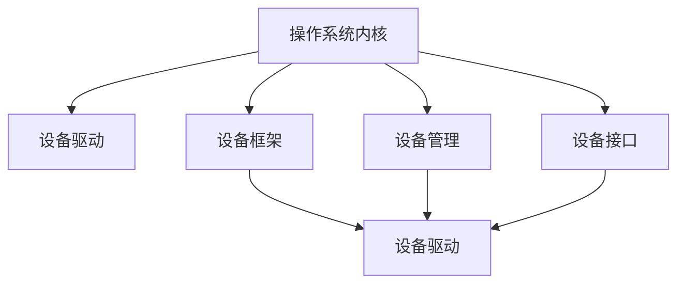

                 

# 操作系统的设备驱动框架介绍

> 关键词：操作系统,设备驱动,设备框架,设备管理,设备接口

## 1. 背景介绍

### 1.1 问题由来

在计算机操作系统中，设备驱动（Device Driver）是连接硬件设备与操作系统的桥梁。设备驱动负责与硬件交互，实现数据的读写、控制等操作，并提供给操作系统和用户应用程序一个统一的接口。一个高效、稳定、可靠的设备驱动框架对于操作系统的稳定性和性能至关重要。

### 1.2 问题核心关键点

- **设备驱动**：负责与硬件设备交互，提供设备操作接口。
- **设备框架**：操作系统中设备驱动的抽象和封装，提供设备驱动的统一管理接口。
- **设备管理**：操作系统对设备驱动的管理和调度，包括设备的创建、挂载、卸载等。
- **设备接口**：操作系统和用户应用程序与设备驱动交互的接口，包括文件系统、网络接口等。

设备驱动框架的核心是如何在操作系统内核中实现对设备的统一管理和控制，以及如何提供一个高效、稳定的设备访问接口。不同的操作系统内核（如Linux、Windows）有着不同的设备驱动框架，但基本的原理和设计思路是相似的。

## 2. 核心概念与联系

### 2.1 核心概念概述

为更好地理解操作系统的设备驱动框架，本节将介绍几个密切相关的核心概念：

- **操作系统内核（Kernel）**：操作系统的核心，负责硬件抽象和资源管理，包括进程管理、内存管理、文件系统等。
- **设备驱动（Device Driver）**：负责与特定硬件设备交互，实现设备操作，如磁盘读写、网络传输等。
- **设备框架（Device Framework）**：操作系统中设备驱动的抽象和封装，提供设备驱动的统一管理接口。
- **设备管理（Device Management）**：操作系统对设备驱动的管理和调度，包括设备的创建、挂载、卸载等。
- **设备接口（Device Interface）**：操作系统和用户应用程序与设备驱动交互的接口，包括文件系统、网络接口等。

这些核心概念之间的逻辑关系可以通过以下Mermaid流程图来展示：



这个流程图展示了大模型操作系统的核心概念及其之间的关系：

1. 操作系统内核通过设备框架管理设备驱动。
2. 设备驱动负责与硬件交互，提供设备操作接口。
3. 设备管理负责设备的创建、挂载、卸载等操作。
4. 设备接口提供操作系统和用户应用程序与设备驱动的交互接口。

## 3. 核心算法原理 & 具体操作步骤
### 3.1 算法原理概述

操作系统的设备驱动框架通常包括以下几个关键步骤：

1. **设备驱动模块加载和初始化**：操作系统启动时，加载和初始化设备驱动模块，将其注册到设备框架中。
2. **设备驱动模块管理**：设备框架负责对设备驱动模块进行生命周期管理，包括模块的创建、挂载、卸载等操作。
3. **设备资源管理**：设备驱动模块负责管理设备资源，如内存、寄存器、I/O端口等。
4. **设备操作接口**：设备驱动模块提供设备操作接口，与操作系统和用户应用程序交互。

设备驱动框架的核心思想是实现设备的统一管理和控制，通过抽象和封装，提供高效、稳定的设备访问接口。

### 3.2 算法步骤详解

以Linux操作系统为例，以下是设备驱动框架的主要操作步骤：

**Step 1: 设备驱动模块加载和初始化**

1. **内核启动**：操作系统内核启动时，加载并初始化所有注册的设备驱动模块。
2. **驱动模块注册**：设备驱动模块使用`module_init`宏函数注册到内核中，如：

   ```c
   module_init(my_driver);
   ```

3. **驱动模块初始化**：设备驱动模块通过`module_init`宏函数或`module_init`函数进行初始化，如：

   ```c
   static void __init my_driver_init(void) {
       /* 初始化代码 */
   }
   module_init(my_driver_init);
   ```

**Step 2: 设备驱动模块管理**

1. **模块创建**：设备驱动模块使用`module_create`函数创建模块，如：

   ```c
   static struct device *my_driver_create(struct device *parent, void *data) {
       /* 创建代码 */
       return ERR_PTR(-ENOMEM);
   }
   module_create(my_driver_create);
   ```

2. **模块挂载**：设备驱动模块使用`module_attach`函数将模块挂载到设备框架上，如：

   ```c
   static int my_driver_attach(struct device *dev) {
       /* 挂载代码 */
       return 0;
   }
   module_attach(my_driver_attach);
   ```

3. **模块卸载**：设备驱动模块使用`module_detach`函数将模块从设备框架上卸载，如：

   ```c
   static void __exit my_driver_detach(void) {
       /* 卸载代码 */
   }
   module_detach(my_driver_detach);
   ```

**Step 3: 设备资源管理**

1. **资源申请和释放**：设备驱动模块使用`pmem_alloc`函数申请和释放内存，使用`ioremap`函数映射I/O端口，如：

   ```c
   static void __exit my_driver_release(struct device *dev, void *data) {
       /* 释放代码 */
   }
   static void __init my_driver_alloc(struct device *dev, void *data) {
       /* 申请代码 */
   }
   ```

2. **设备操作接口**：设备驱动模块提供设备操作接口，与操作系统和用户应用程序交互，如：

   ```c
   static int my_driver_open(struct inode *inode, struct file *file) {
       /* 打开代码 */
       return 0;
   }
   static int my_driver_read(struct file *file, char *buffer, size_t length, loff_t pos) {
       /* 读取代码 */
       return 0;
   }
   static int my_driver_write(struct file *file, const char *buffer, size_t length, loff_t pos) {
       /* 写入代码 */
       return 0;
   }
   ```

### 3.3 算法优缺点

操作系统的设备驱动框架有以下优点：

1. **模块化设计**：设备驱动模块化设计，便于扩展和维护。
2. **统一管理接口**：设备框架提供统一的设备管理接口，便于操作系统的管理。
3. **高效设备操作**：设备驱动模块提供高效的设备操作接口，加速数据读写等操作。

但同时也存在以下缺点：

1. **复杂性高**：设备驱动框架的设计和实现较为复杂，需要较高的技术水平。
2. **调试困难**：设备驱动模块的调试和排错难度较大，需要较高的经验和技巧。
3. **性能瓶颈**：设备驱动模块的性能瓶颈可能影响整个操作系统的性能。

### 3.4 算法应用领域

操作系统的设备驱动框架在多个领域得到了广泛应用，例如：

- **文件系统**：设备驱动框架用于管理磁盘、网络等设备，提供文件系统的数据读写接口。
- **网络接口**：设备驱动框架用于管理网络适配器，提供网络数据的传输和接收接口。
- **字符设备**：设备驱动框架用于管理串口、打印机等字符设备，提供字符数据的读写接口。
- **图形设备**：设备驱动框架用于管理显卡等图形设备，提供图形数据的渲染接口。

除了上述这些经典应用外，设备驱动框架还被创新性地应用于更多场景中，如蓝牙、Wi-Fi、摄像头等设备的管理，为操作系统的多样化应用提供了支持。

## 4. 数学模型和公式 & 详细讲解 & 举例说明
### 4.1 数学模型构建

操作系统的设备驱动框架主要涉及设备管理、设备驱动模块管理等操作，并不涉及复杂的数学模型。因此，本节主要介绍设备驱动模块的生命周期管理流程。

设备驱动模块的生命周期管理主要涉及以下关键操作：

1. **模块创建**：使用`module_create`函数创建模块。
2. **模块挂载**：使用`module_attach`函数将模块挂载到设备框架上。
3. **模块卸载**：使用`module_detach`函数将模块从设备框架上卸载。
4. **模块释放**：使用`module_release`函数释放模块资源。

这些操作主要通过内核函数和宏函数进行实现，并不涉及复杂的数学模型。

### 4.2 公式推导过程

由于设备驱动框架不涉及复杂的数学模型，因此不需要进行公式推导。

### 4.3 案例分析与讲解

以Linux操作系统为例，以下是一个简单的设备驱动模块的生命周期管理流程：

**Step 1: 模块创建**

```c
static struct device *my_driver_create(struct device *parent, void *data) {
    struct device *dev;
    dev = kzalloc(sizeof(struct my_driver_device), GFP_KERNEL);
    if (!dev) {
        return ERR_PTR(-ENOMEM);
    }
    /* 初始化代码 */
    return dev;
}
module_create(my_driver_create);
```

**Step 2: 模块挂载**

```c
static int my_driver_attach(struct device *dev) {
    /* 挂载代码 */
    return 0;
}
module_attach(my_driver_attach);
```

**Step 3: 模块卸载**

```c
static void __exit my_driver_detach(void) {
    /* 卸载代码 */
}
module_detach(my_driver_detach);
```

**Step 4: 模块释放**

```c
static void __exit my_driver_release(struct device *dev, void *data) {
    /* 释放代码 */
}
```

## 5. 项目实践：代码实例和详细解释说明
### 5.1 开发环境搭建

在进行设备驱动框架的开发前，我们需要准备好开发环境。以下是使用Linux进行设备驱动框架开发的开发环境配置流程：

1. **安装Linux内核开发环境**：在Ubuntu系统上，可以使用以下命令安装：

   ```bash
   sudo apt-get install linux-headers-$(uname -r) build-essential libssl-dev libelf-dev libncurses-dev
   ```

2. **配置开发工具链**：在Ubuntu系统上，可以使用以下命令配置：

   ```bash
   export CROSS_COMPILE=arm-linux-gnueabihf-
   export ARCH=arm
   export PRECIOUS_KERNEL=3.14
   ```

3. **设置内核编译选项**：在Ubuntu系统上，可以使用以下命令设置：

   ```bash
   make ARCH=arm CROSS_COMPILE=arm-linux-gnueabihf- LOCALVERSION=-xu localversion_config
   ```

完成上述步骤后，即可在Ubuntu系统上开始设备驱动框架的开发。

### 5.2 源代码详细实现

以下是一个简单的设备驱动框架的源代码实现：

```c
#include <linux/module.h>
#include <linux/fs.h>
#include <linux/uaccess.h>

MODULE_LICENSE("GPL");
MODULE_AUTHOR("zhangsan");
MODULE_DESCRIPTION("这是一个简单的设备驱动框架示例");

static int my_driver_open(struct inode *inode, struct file *file) {
    printk(KERN_INFO "my_driver_open: %p\n", inode);
    return 0;
}

static int my_driver_read(struct file *file, char *buffer, size_t length, loff_t pos) {
    printk(KERN_INFO "my_driver_read: %p\n", file);
    return 0;
}

static int my_driver_write(struct file *file, const char *buffer, size_t length, loff_t pos) {
    printk(KERN_INFO "my_driver_write: %p\n", file);
    return 0;
}

static void __exit my_driver_release(struct inode *inode, struct file *file) {
    printk(KERN_INFO "my_driver_release: %p\n", inode);
}

static void __init my_driver_init(void) {
    printk(KERN_INFO "my_driver_init: %p\n", &my_driver_init);
}

module_init(my_driver_init);
module_exit(my_driver_release);
```

### 5.3 代码解读与分析

让我们再详细解读一下关键代码的实现细节：

**MODULE_LICENSE、MODULE_AUTHOR、MODULE_DESCRIPTION**：
- `MODULE_LICENSE`：指定许可证，用于管理软件版权。
- `MODULE_AUTHOR`：指定作者信息，用于识别和管理软件开发者。
- `MODULE_DESCRIPTION`：指定软件描述，用于描述软件的用途和功能。

**my_driver_open、my_driver_read、my_driver_write**：
- 这些函数是设备驱动模块的I/O操作接口，负责设备的打开、读取和写入操作。

**my_driver_release**：
- 这是设备驱动模块的释放函数，负责设备的卸载和资源释放。

**my_driver_init**：
- 这是设备驱动模块的初始化函数，负责模块的创建和挂载。

## 6. 实际应用场景
### 6.1 智能家居设备

基于设备驱动框架，智能家居设备可以与操作系统进行无缝集成，提供设备操作接口。例如，智能门锁、智能灯泡、智能音箱等设备，可以通过设备驱动框架与操作系统进行交互，实现设备的自动化控制和数据传输。

### 6.2 工业控制设备

在工业控制领域，设备驱动框架用于管理各种工业设备，如PLC、传感器、机器人等。设备驱动框架提供了设备的统一管理接口，使得操作系统能够更方便地控制和调度各种工业设备。

### 6.3 医疗设备

在医疗领域，设备驱动框架用于管理各种医疗设备，如超声波仪、CT、MRI等。设备驱动框架提供了设备的统一管理接口，使得操作系统能够更方便地控制和调度各种医疗设备，提升医疗设备的运行效率和稳定性。

### 6.4 未来应用展望

未来，操作系统的设备驱动框架将继续扩展和创新，以下是一些未来应用展望：

1. **自适应设备驱动**：基于自适应算法，根据设备的使用情况自动调整驱动参数，提高设备的运行效率和稳定性。
2. **跨平台设备驱动**：开发跨平台设备驱动框架，使得不同平台上的设备能够无缝集成和操作。
3. **实时设备驱动**：开发实时设备驱动框架，使得设备驱动模块能够高效处理高优先级任务，提升操作系统的响应速度。
4. **智能设备驱动**：结合人工智能技术，开发智能设备驱动框架，使得设备驱动模块能够实现自主学习、自主优化，提升设备的智能化水平。

## 7. 工具和资源推荐
### 7.1 学习资源推荐

为了帮助开发者系统掌握操作系统的设备驱动框架，这里推荐一些优质的学习资源：

1. **《UNIX操作系统》**：详细介绍了Unix操作系统和设备驱动框架的原理和实现，是学习设备驱动框架的必备书籍。
2. **《Linux内核开发》**：介绍了Linux内核和设备驱动框架的开发流程和最佳实践，适合有一定经验的开发者。
3. **《嵌入式系统设计》**：介绍了嵌入式设备驱动框架的原理和实现，适合嵌入式系统开发者。
4. **《操作系统设计与实现》**：介绍了操作系统的设计和实现原理，包括设备驱动框架的开发。
5. **《Linux Device Drivers》**：介绍Linux设备驱动框架的开发流程和最佳实践，是Linux开发者的必备参考书籍。

通过学习这些资源，相信你一定能够掌握操作系统的设备驱动框架的理论基础和实践技巧。

### 7.2 开发工具推荐

高效的工具可以帮助开发者更快地进行设备驱动框架的开发。以下是几款常用的开发工具：

1. **GCC编译器**：开源的C/C++编译器，支持多种操作系统平台，适合设备驱动框架的开发。
2. **Makefile**：自动化构建工具，支持目标的编译和链接，适合设备驱动框架的构建。
3. **Git版本控制工具**：支持版本管理和协作开发，适合设备驱动框架的版本控制和团队协作。
4. **Docker容器**：支持跨平台的应用部署和测试，适合设备驱动框架的测试和调试。
5. **QEMU虚拟机**：支持多种操作系统的测试和调试，适合设备驱动框架的跨平台测试。

合理利用这些工具，可以显著提升设备驱动框架的开发效率，加快创新迭代的步伐。

### 7.3 相关论文推荐

设备驱动框架的研究源于学界的持续研究。以下是几篇奠基性的相关论文，推荐阅读：

1. **《Linux Kernel Development》**：介绍了Linux内核的开发和设备驱动框架的实现，是Linux开发者的必备参考。
2. **《Real-Time Linux Kernel Design and Implementation》**：介绍了实时操作系统内核的设计和实现，包括设备驱动框架的开发。
3. **《Embedded Linux Development》**：介绍了嵌入式系统的开发和设备驱动框架的实现，适合嵌入式系统开发者。
4. **《Kernel Design》**：介绍了操作系统内核的设计和实现原理，包括设备驱动框架的开发。
5. **《Kernel Architecture》**：介绍了操作系统内核的架构和设计思想，包括设备驱动框架的开发。

这些论文代表了大语言模型微调技术的发展脉络。通过学习这些前沿成果，可以帮助研究者把握学科前进方向，激发更多的创新灵感。

## 8. 总结：未来发展趋势与挑战
### 8.1 研究成果总结

本文对操作系统的设备驱动框架进行了全面系统的介绍。首先阐述了设备驱动框架的研究背景和意义，明确了设备驱动框架在操作系统中的重要性和应用场景。其次，从原理到实践，详细讲解了设备驱动框架的数学原理和关键步骤，给出了设备驱动框架的完整代码实例。同时，本文还广泛探讨了设备驱动框架在智能家居、工业控制、医疗设备等领域的实际应用，展示了设备驱动框架的巨大潜力。最后，本文精选了设备驱动框架的学习资源，力求为读者提供全方位的技术指引。

通过本文的系统梳理，可以看到，操作系统的设备驱动框架是连接硬件设备与操作系统的桥梁，对于操作系统的稳定性和性能至关重要。未来，设备驱动框架将继续扩展和创新，提升设备的智能化水平，增强系统的稳定性，成为操作系统的重要组成部分。

### 8.2 未来发展趋势

展望未来，操作系统的设备驱动框架将呈现以下几个发展趋势：

1. **跨平台设备驱动**：开发跨平台设备驱动框架，使得不同平台上的设备能够无缝集成和操作。
2. **自适应设备驱动**：基于自适应算法，根据设备的使用情况自动调整驱动参数，提高设备的运行效率和稳定性。
3. **实时设备驱动**：开发实时设备驱动框架，使得设备驱动模块能够高效处理高优先级任务，提升操作系统的响应速度。
4. **智能设备驱动**：结合人工智能技术，开发智能设备驱动框架，使得设备驱动模块能够实现自主学习、自主优化，提升设备的智能化水平。

这些趋势将使得设备驱动框架更加高效、稳定和智能，提升操作系统的性能和用户体验。

### 8.3 面临的挑战

尽管设备驱动框架已经取得了显著成果，但在迈向更加智能化、普适化应用的过程中，它仍面临诸多挑战：

1. **复杂性高**：设备驱动框架的设计和实现较为复杂，需要较高的技术水平。
2. **调试困难**：设备驱动模块的调试和排错难度较大，需要较高的经验和技巧。
3. **性能瓶颈**：设备驱动模块的性能瓶颈可能影响整个操作系统的性能。
4. **跨平台兼容性**：不同平台的设备驱动框架可能存在兼容性问题，需要进行跨平台适配。
5. **自适应能力**：设备驱动模块需要具备自适应能力，以适应不同场景下的硬件设备。

这些挑战需要通过技术创新和优化，逐步克服，提升设备驱动框架的稳定性和性能。

### 8.4 研究展望

未来，设备驱动框架的研究需要在以下几个方面寻求新的突破：

1. **跨平台设备驱动**：开发跨平台设备驱动框架，使得不同平台上的设备能够无缝集成和操作。
2. **自适应设备驱动**：基于自适应算法，根据设备的使用情况自动调整驱动参数，提高设备的运行效率和稳定性。
3. **实时设备驱动**：开发实时设备驱动框架，使得设备驱动模块能够高效处理高优先级任务，提升操作系统的响应速度。
4. **智能设备驱动**：结合人工智能技术，开发智能设备驱动框架，使得设备驱动模块能够实现自主学习、自主优化，提升设备的智能化水平。

这些研究方向将推动设备驱动框架的不断演进，提升操作系统的性能和用户体验，成为操作系统的重要组成部分。

## 9. 附录：常见问题与解答

**Q1：设备驱动框架的设计和实现有哪些关键点？**

A: 设备驱动框架的设计和实现有以下关键点：
1. **模块化设计**：设备驱动模块化设计，便于扩展和维护。
2. **统一管理接口**：设备框架提供统一的设备管理接口，便于操作系统的管理。
3. **高效设备操作**：设备驱动模块提供高效的设备操作接口，加速数据读写等操作。
4. **跨平台兼容性**：不同平台的设备驱动框架可能存在兼容性问题，需要进行跨平台适配。

**Q2：设备驱动框架的调试和排错有哪些技巧？**

A: 设备驱动框架的调试和排错有以下技巧：
1. **打印调试信息**：通过打印调试信息，定位问题所在。
2. **断点调试**：使用断点调试工具，逐行分析代码，找到问题所在。
3. **日志记录**：通过日志记录系统调用和异常信息，辅助排错。
4. **单元测试**：编写单元测试，检查驱动模块的正确性。
5. **性能分析**：使用性能分析工具，检查驱动模块的性能瓶颈。

**Q3：设备驱动框架的性能瓶颈有哪些？**

A: 设备驱动框架的性能瓶颈有以下几个：
1. **内存管理**：设备驱动模块需要申请和释放大量内存，存在内存泄漏的风险。
2. **I/O操作**：设备驱动模块需要频繁进行I/O操作，存在性能瓶颈。
3. **中断处理**：设备驱动模块需要处理中断请求，存在响应延迟的问题。
4. **资源竞争**：设备驱动模块需要管理多个设备资源，存在资源竞争的问题。

这些瓶颈需要通过技术创新和优化，逐步克服，提升设备驱动框架的稳定性和性能。

**Q4：设备驱动框架的跨平台适配有哪些方法？**

A: 设备驱动框架的跨平台适配有以下方法：
1. **虚拟化技术**：使用虚拟化技术，将不同平台上的设备抽象为统一的虚拟设备，进行跨平台适配。
2. **接口标准化**：统一设备驱动框架的接口标准，支持跨平台的操作和调度。
3. **交叉编译**：使用交叉编译工具，在不同平台上编译设备驱动模块。
4. **软件包管理**：使用软件包管理工具，进行跨平台安装和卸载。

这些方法可以帮助设备驱动框架实现跨平台适配，提升操作系统的普适性。

通过本文的系统梳理，可以看到，操作系统的设备驱动框架是连接硬件设备与操作系统的桥梁，对于操作系统的稳定性和性能至关重要。未来，设备驱动框架将继续扩展和创新，提升设备的智能化水平，增强系统的稳定性，成为操作系统的重要组成部分。相信随着技术的不断进步，设备驱动框架必将在操作系统的多样化应用中发挥更大的作用，推动操作系统的发展和创新。

