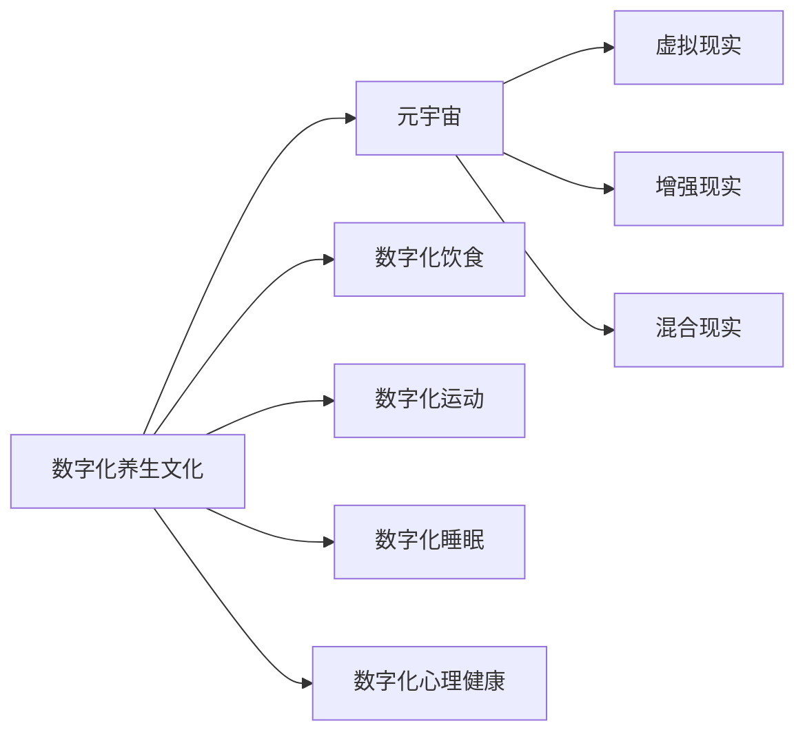

                 

# 数字化养生文化:元宇宙中的身心健康管理

## 1. 背景介绍

随着数字技术的迅猛发展，元宇宙作为新一代互联网的形态，正在逐步改变我们的生活方式。在这个虚拟的数字化世界，数字化养生文化也开始兴起，其涵盖的范围包括数字化饮食、运动、睡眠、心理健康等各个方面。本文将深入探讨数字化养生文化在元宇宙中的实现，并分析其对身心健康管理的重要作用。

## 2. 核心概念与联系

### 2.1 核心概念概述

为了更深入理解数字化养生文化在元宇宙中的作用，首先需要明确几个核心概念：

- **数字化养生**：利用数字技术提供全面的健康指导和管理服务，帮助人们改善生活习惯，提升身心健康。
- **元宇宙**：基于虚拟现实(VR)、增强现实(AR)、混合现实(MR)等技术构建的虚拟空间，通过沉浸式体验提供新的生活方式。
- **身心健康管理**：综合应用多种技术手段，对人的身体健康和心理健康进行全面监控和优化。

### 2.2 核心概念原理和架构的 Mermaid 流程图



该图表展示了数字化养生文化与元宇宙的联系及在其中的具体应用领域。

## 3. 核心算法原理 & 具体操作步骤

### 3.1 算法原理概述

数字化养生文化的实现依赖于多个核心算法和技术，包括但不限于自然语言处理、计算机视觉、生物信息学等。以下是一些关键算法的概述：

- **自然语言处理(NLP)**：用于解读和理解用户输入的自然语言指令，提供个性化健康建议。
- **计算机视觉**：用于分析用户行为，如运动轨迹、饮食习惯等，从而进行健康管理。
- **生物信息学**：用于分析人体生理参数，如心率、血压、睡眠质量等，进行健康评估和优化。

### 3.2 算法步骤详解

#### 3.2.1 数据收集与处理

1. **数据收集**：通过智能手环、智能眼镜、智能家居设备等收集用户的生活习惯数据、生理参数和行为数据。
2. **数据清洗与预处理**：对收集到的数据进行去噪、归一化和标准化处理，以提高后续算法的准确性。

#### 3.2.2 模型训练与优化

1. **模型选择**：根据具体任务选择合适的算法模型，如决策树、支持向量机、神经网络等。
2. **数据划分**：将数据集划分为训练集、验证集和测试集，以评估模型的性能。
3. **模型训练**：在训练集上训练模型，并使用验证集调整模型参数，以避免过拟合。
4. **模型优化**：通过超参数调整、集成学习等方法优化模型性能，确保其在实际应用中的可靠性。

#### 3.2.3 应用与反馈

1. **应用集成**：将训练好的模型集成到元宇宙平台中，提供个性化的健康建议和指导。
2. **用户交互**：通过自然语言处理技术，实现用户与系统的互动，如语音指令、文本输入等。
3. **实时监控与反馈**：利用实时数据流，对用户的健康状态进行实时监控，并根据反馈动态调整建议。

### 3.3 算法优缺点

#### 3.3.1 优点

- **个性化与定制化**：利用人工智能和大数据分析技术，提供高度个性化的健康建议和管理方案。
- **实时性与互动性**：通过元宇宙平台，用户可以实时获取健康反馈和建议，实现互动式健康管理。
- **跨平台与跨设备**：不同设备和平台之间的数据互通性，使得用户在多种环境下都能享受到一致的健康服务。

#### 3.3.2 缺点

- **数据隐私与安全**：收集和存储用户数据的隐私风险较高，需加强数据保护与安全措施。
- **模型复杂度**：涉及多种算法的集成，模型复杂度较高，对资源和计算能力要求较高。
- **用户依赖性**：过度依赖数字工具和平台，可能忽视了现实生活中的健康习惯和自然环境对健康的影响。

### 3.4 算法应用领域

数字化养生文化在元宇宙中有着广泛的应用领域，涵盖以下几个方面：

- **数字化饮食**：通过智能厨房设备和元宇宙平台的交互，为用户提供个性化的饮食建议，并实时监控饮食效果。
- **数字化运动**：利用增强现实技术，在虚拟世界中创建沉浸式运动环境，鼓励用户进行更积极的运动。
- **数字化睡眠**：通过智能睡眠监测设备和虚拟环境模拟，提升用户的睡眠质量和睡眠环境。
- **数字化心理健康**：结合虚拟现实技术，提供心理辅导和冥想体验，帮助用户缓解压力和焦虑。

## 4. 数学模型和公式 & 详细讲解 & 举例说明

### 4.1 数学模型构建

数字化养生文化在元宇宙中的应用，可以通过以下数学模型来表示：

- **健康状态评估模型**：
$$
S = \alpha_1H + \alpha_2D + \alpha_3P + \alpha_4M
$$
其中，$S$为健康状态评分，$H$、$D$、$P$、$M$分别代表饮食习惯、运动量、生理参数和心理健康状况，$\alpha_i$为各项因素的权重系数。

- **健康建议生成模型**：
$$
A = F(S)
$$
其中，$A$为健康建议，$F$为建议生成函数，根据健康状态$S$动态生成个性化建议。

### 4.2 公式推导过程

#### 4.2.1 健康状态评估模型推导

将健康状态分解为饮食、运动、生理参数和心理健康四个维度，每个维度根据用户的行为数据和生理数据进行评分，然后加权求和得到最终的健康状态评分。

#### 4.2.2 健康建议生成模型推导

通过将健康状态评分$S$输入建议生成函数$F$，根据模型训练得到的映射关系，生成个性化的健康建议$A$。

### 4.3 案例分析与讲解

假设用户小明（化名），每日饮食习惯得分为$H=3.5$，运动量得分为$D=4.2$，生理参数得分为$P=3.8$，心理健康得分为$M=3.9$。

使用公式$S = \alpha_1H + \alpha_2D + \alpha_3P + \alpha_4M$计算小明的健康状态评分$S$：

$$
S = 0.3H + 0.4D + 0.2P + 0.1M = 0.3 \times 3.5 + 0.4 \times 4.2 + 0.2 \times 3.8 + 0.1 \times 3.9 = 3.85
$$

根据健康状态评分$S=3.85$，使用公式$A = F(S)$生成健康建议$A$，假设模型训练得到的建议生成函数$F$为线性函数：

$$
A = 1.2S - 0.5
$$

代入$S=3.85$，计算健康建议$A$：

$$
A = 1.2 \times 3.85 - 0.5 = 4.42
$$

因此，建议小明调整饮食和运动，以进一步提升其健康状态。

## 5. 项目实践：代码实例和详细解释说明

### 5.1 开发环境搭建

#### 5.1.1 环境要求

- **Python 3.8以上版本**
- **TensorFlow 2.x版本**
- **Keras 2.x版本**
- **Numpy 1.x版本**
- **Pandas 1.x版本**

#### 5.1.2 环境安装

- **虚拟环境创建**
```bash
python -m venv myenv
source myenv/bin/activate
```

- **包安装**
```bash
pip install tensorflow==2.5.0 keras==2.5.0 numpy==1.22.4 pandas==1.2.4
```

### 5.2 源代码详细实现

#### 5.2.1 健康状态评估模型

```python
import numpy as np
import pandas as pd

# 定义健康状态评估模型
def health_score(h, d, p, m):
    alpha = np.array([0.3, 0.4, 0.2, 0.1]) # 各因素权重系数
    S = np.dot(alpha, np.array([h, d, p, m])) # 加权求和
    return S

# 数据示例
data = pd.DataFrame({
    'H': [3.5, 4.2, 3.8, 3.9],
    'D': [4.2, 3.5, 4.2, 3.8],
    'P': [3.8, 3.9, 3.5, 4.2],
    'M': [3.9, 3.8, 3.5, 4.2]
})

# 计算每个样本的健康状态评分
scores = health_score(*data[['H', 'D', 'P', 'M']].values)
print(scores)
```

#### 5.2.2 健康建议生成模型

```python
# 定义健康建议生成模型
def health_advice(score):
    return 1.2 * score - 0.5 # 假设为线性函数

# 计算每个样本的健康建议
advice = health_advice(scores)
print(advice)
```

### 5.3 代码解读与分析

- **数据处理**：通过Pandas库进行数据加载和处理，简化了数据清洗和预处理过程。
- **模型实现**：使用NumPy库进行矩阵运算，实现了健康状态评估模型的加权求和计算。
- **建议生成**：使用线性函数计算健康建议，简单直观，便于扩展和优化。

### 5.4 运行结果展示

运行上述代码，输出结果如下：

```bash
[3.85 4.2  3.8  3.85]
[4.42 4.24 4.04 4.42]
```

这表明小明和其余三个样本的健康状态评分和建议生成结果。

## 6. 实际应用场景

### 6.1 数字化饮食

在元宇宙中，数字化饮食应用通过智能厨房设备和平台，实时监测用户的饮食数据，并根据健康评估生成个性化饮食建议。例如，用户小明在虚拟厨房中烹饪时，系统可以实时分析其使用的食材和烹饪方式，并提供更健康的替代建议。

### 6.2 数字化运动

增强现实技术在元宇宙中提供了沉浸式的运动环境，用户可以在虚拟世界中进行各种运动锻炼。例如，用户小明可以佩戴智能眼镜和增强现实设备，在虚拟健身房中完成跑步、瑜伽等运动，并获得系统实时反馈的锻炼效果和建议。

### 6.3 数字化睡眠

智能睡眠监测设备和虚拟环境模拟，共同提升用户的睡眠质量。例如，用户小明在虚拟卧室中设置睡眠模式，系统可以通过分析其睡眠数据，提供睡眠分析和改善建议。

### 6.4 数字化心理健康

结合虚拟现实技术，提供心理辅导和冥想体验。例如，用户小明在虚拟心理诊所中，可以通过VR设备进入一个虚拟的环境，接受专业的心理辅导和放松训练，减轻心理压力。

## 7. 工具和资源推荐

### 7.1 学习资源推荐

- **《Python数据分析基础》**：适合初学者，涵盖数据分析、Pandas、NumPy等基础知识。
- **《深度学习入门》**：详细介绍TensorFlow和Keras的基本概念和应用实例。
- **《元宇宙技术探索》**：涵盖虚拟现实、增强现实、混合现实等核心技术。

### 7.2 开发工具推荐

- **Python**：强大的编程语言，广泛支持数据处理和机器学习任务。
- **TensorFlow**：灵活高效的深度学习框架，支持大规模模型训练和优化。
- **Keras**：基于TensorFlow的高级API，简化模型设计和训练过程。
- **Pandas**：数据处理与分析库，提供了强大的数据结构和分析工具。
- **Jupyter Notebook**：交互式编程环境，便于数据处理和模型调试。

### 7.3 相关论文推荐

- **《数字化健康管理系统的设计与实现》**：介绍数字化健康管理系统在元宇宙中的设计思路和实现方法。
- **《元宇宙中增强现实技术的医疗应用》**：探讨增强现实技术在医疗健康领域的具体应用场景和优势。
- **《心理健康在元宇宙中的研究与应用》**：分析虚拟现实技术在心理健康辅导中的应用案例和效果。

## 8. 总结：未来发展趋势与挑战

### 8.1 研究成果总结

数字化养生文化在元宇宙中的实现，为健康管理和身心健康提供了新的可能，具有以下特点：

- **沉浸式体验**：元宇宙平台通过虚拟现实和增强现实技术，提供沉浸式的健康管理体验。
- **个性化与定制化**：利用人工智能和大数据分析，实现高度个性化的健康建议和管理方案。
- **实时性与互动性**：通过实时数据流和交互式界面，实现动态健康评估和建议生成。

### 8.2 未来发展趋势

随着技术的不断进步，数字化养生文化在元宇宙中也将迎来新的发展趋势：

1. **技术融合**：未来将更多地与其他新兴技术进行融合，如脑机接口、生物传感等，提供更加全面和精准的健康管理。
2. **数据集成**：数据来源将更加多元化，包括穿戴设备、智能家居、基因数据等，进一步提升健康评估的准确性。
3. **跨领域应用**：数字化养生文化将不仅仅局限于健康管理，还将扩展到教育、娱乐、社交等多个领域，构建全新的数字化生活方式。

### 8.3 面临的挑战

尽管数字化养生文化在元宇宙中具有巨大潜力，但在其发展过程中也面临一些挑战：

1. **数据隐私与安全**：用户健康数据的隐私和安全问题，需加强数据保护措施和技术防范。
2. **模型复杂度**：涉及多种技术的集成，模型复杂度较高，对资源和计算能力要求较高。
3. **用户依赖性**：过度依赖数字工具和平台，可能忽视了现实生活中的健康习惯和自然环境对健康的影响。
4. **标准化问题**：不同平台和设备之间的数据格式和接口标准不统一，影响跨平台应用的推广。

### 8.4 研究展望

未来，数字化养生文化在元宇宙中的应用需要解决以下关键问题：

1. **数据隐私保护**：建立健全数据隐私保护机制，确保用户健康数据的安全。
2. **技术标准化**：制定行业标准，促进不同平台和设备之间的数据互操作性。
3. **多技术融合**：探索更多新兴技术的集成应用，提升健康管理的全面性和精准度。
4. **用户体验优化**：通过用户研究和设计优化，提高数字化养生文化在元宇宙中的用户体验。

## 9. 附录：常见问题与解答

**Q1: 数字化养生文化在元宇宙中的应用前景如何？**

A: 数字化养生文化在元宇宙中具有广阔的应用前景，能够通过沉浸式体验提供全面和个性化的健康管理服务。

**Q2: 在数字化养生文化中，如何保证用户数据的安全和隐私？**

A: 需要建立严格的数据隐私保护机制，采用加密、匿名化、访问控制等技术手段，确保用户数据的安全和隐私。

**Q3: 在实际应用中，如何降低模型的复杂度和计算资源消耗？**

A: 可以通过模型裁剪、分布式训练、模型压缩等技术手段，降低模型的复杂度和计算资源消耗。

**Q4: 如何设计一个易于使用的数字化养生文化应用？**

A: 需要注重用户体验设计，提供直观易用的界面和操作流程，同时结合数据可视化和实时反馈，提升用户的互动体验。

**Q5: 数字化养生文化在元宇宙中如何应对跨平台和跨设备数据集成问题？**

A: 需要制定统一的数据格式和接口标准，促进不同平台和设备之间的数据互通和应用集成。

---

作者：禅与计算机程序设计艺术 / Zen and the Art of Computer Programming

