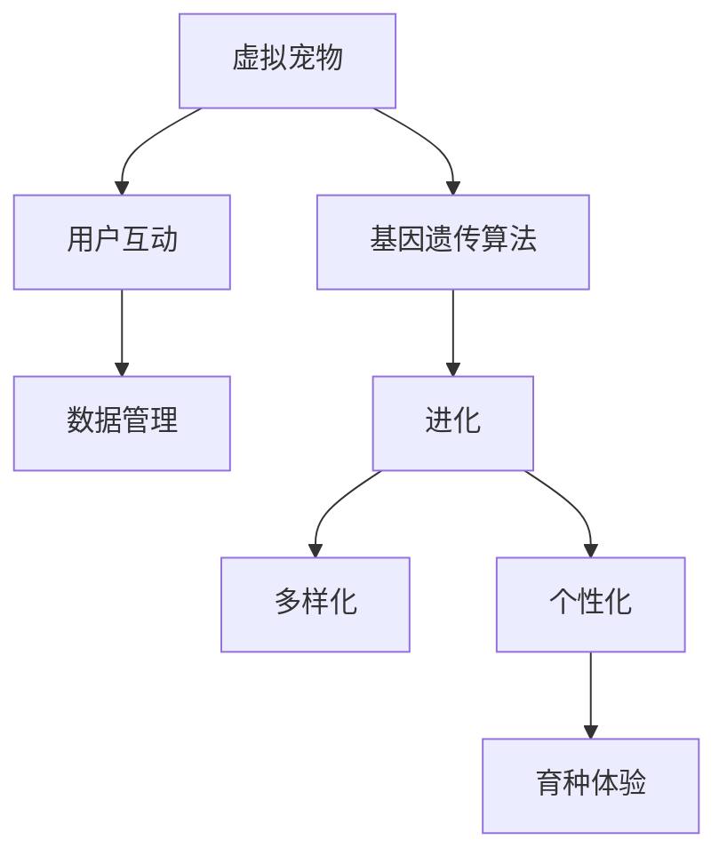

                 

# 数字化宠物遗传创业：虚拟宠物育种

在数字经济的时代浪潮中，虚拟宠物（Virtual Pets）作为一种新兴的数字娱乐形式，正逐渐成为互联网用户广泛关注和参与的内容。虚拟宠物不仅能够提供丰富的互动体验，而且具有巨大的商业潜力和社会影响力。数字化宠物遗传创业项目，正是基于虚拟宠物的多样化和个性化的需求，结合基因工程和算法模型，为用户提供更加丰富和有意义的虚拟宠物育种体验。

## 1. 背景介绍

### 1.1 虚拟宠物的发展背景
虚拟宠物作为数字娱乐的一种重要形式，最早可以追溯到20世纪80年代末。日本公司Bandai和Square Enix推出了《数码宝贝》和《宠物小精灵》等游戏，受到了全球范围内的欢迎。虚拟宠物在全球范围内迅速普及，并在互联网时代达到了新的高峰。随着移动互联网和社交媒体的不断发展，虚拟宠物从简单的手机游戏，发展成为具有复杂性格、生命周期和互动功能的数字化生物。

### 1.2 虚拟宠物的潜在市场
虚拟宠物市场规模庞大，涵盖游戏、社交、教育等多个领域。根据市场研究机构数据显示，全球虚拟宠物市场规模预计将从2020年的20亿美元增长到2025年的50亿美元。虚拟宠物的潜在使用场景包括但不限于：

- **游戏领域**：如《Flappy Bird》《Adventures of Owl Village》等，通过虚拟宠物提供游戏化体验。
- **社交领域**：如《Twitter Pet＞》，用户可以在社交媒体平台上展示和管理自己的虚拟宠物。
- **教育领域**：通过虚拟宠物培养孩子的责任感和团队合作能力。

### 1.3 数字化宠物遗传创业的意义
数字化宠物遗传创业，不仅满足了用户对虚拟宠物个性化和多样化的需求，还提供了基于基因工程和算法模型的新型育种体验。数字化宠物遗传创业项目的成功，不仅能提升用户粘性，还能推动虚拟宠物产业的整体发展。

## 2. 核心概念与联系

### 2.1 核心概念概述
数字化宠物遗传创业项目，以虚拟宠物为核心，通过基因遗传算法为用户带来个性化和多样化的虚拟宠物育种体验。该项目主要包含以下核心概念：

- **虚拟宠物**：基于数字技术创建的虚拟生物，能够执行简单的交互、学习、进化等功能。
- **基因遗传算法**：借鉴自然界生物遗传机制，通过基因编码实现虚拟宠物的进化和多样化。
- **用户互动**：用户可以与虚拟宠物进行互动，影响其基因特性和行为模式。
- **数据管理**：虚拟宠物的基因数据和行为数据需要进行有效管理，以实现个性化育种。

### 2.2 核心概念之间的关系
核心概念之间的关系可以通过以下Mermaid流程图来展示：



该图展示了虚拟宠物育种过程中各个环节的逻辑关系：

1. **虚拟宠物**作为起点，通过基因遗传算法实现进化和多样化。
2. **用户互动**影响虚拟宠物的基因特性和行为模式。
3. **数据管理**用于管理虚拟宠物的基因数据和行为数据。
4. **进化**和**多样化**生成具有不同基因特性的虚拟宠物。
5. **个性化**进一步丰富虚拟宠物的特点。
6. **育种体验**为用户带来独特的育种体验。

### 2.3 核心概念原理和架构
#### 2.3.1 虚拟宠物的构建
虚拟宠物的构建，涉及以下几个步骤：

- **3D建模**：基于用户输入的数据，如外貌、行为、基因特性等，使用3D建模工具创建虚拟宠物的3D模型。
- **行为编程**：定义虚拟宠物的行为规则，如饮食、睡眠、繁殖、社交等。
- **基因编码**：将虚拟宠物的基因特性转化为基因编码，用于遗传算法的计算。

#### 2.3.2 基因遗传算法的实现
基因遗传算法，借鉴自然界生物的遗传机制，通过基因编码实现虚拟宠物的进化和多样化。算法主要包含以下几个步骤：

- **初始化基因池**：随机生成一组虚拟宠物的基因编码，作为初始基因池。
- **选择基因**：根据用户偏好和虚拟宠物的表现，选择部分基因进行交叉和变异。
- **交叉基因**：通过基因交叉操作，结合两个基因池中的基因，生成新的基因池。
- **变异基因**：通过基因变异操作，对新的基因池中的基因进行随机突变，增加虚拟宠物的多样性。
- **进化评估**：评估新生成虚拟宠物的表现，选择最优的基因池作为下一代的基因池。

#### 2.3.3 用户互动设计
用户与虚拟宠物的互动，包含以下几个方面：

- **交互界面设计**：设计直观、易用的交互界面，让用户能够轻松控制虚拟宠物的行为。
- **反馈机制**：通过用户反馈，调整虚拟宠物的基因特性和行为模式。
- **行为训练**：用户可以通过奖励和惩罚机制，训练虚拟宠物完成特定的行为。

#### 2.3.4 数据管理
虚拟宠物的数据管理，包含以下几个方面：

- **基因数据管理**：存储虚拟宠物的基因编码，并提供快速查询和统计功能。
- **行为数据管理**：记录虚拟宠物的行为数据，如饮食、睡眠、繁殖等，用于后续分析和优化。
- **用户体验数据管理**：记录用户与虚拟宠物的互动数据，如操作时间、偏好、反馈等。

## 3. 核心算法原理 & 具体操作步骤

### 3.1 算法原理概述
基于基因遗传算法的虚拟宠物育种，核心在于通过基因编码和遗传算法，实现虚拟宠物的进化和多样化。基因遗传算法的核心思想是“适者生存”，通过选择和遗传操作，优胜劣汰，不断进化出符合用户需求的虚拟宠物。

### 3.2 算法步骤详解
#### 3.2.1 初始化基因池
随机生成一组虚拟宠物的基因编码，作为初始基因池。基因编码通常包括虚拟宠物的外观、性格、行为、技能等特性。例如：

```python
# 初始化基因池
def initialize_genome(pool_size, genome_length):
    genome = []
    for _ in range(pool_size):
        genotype = []
        for _ in range(genome_length):
            genotype.append(random.randint(0, 1))
        genome.append(genotype)
    return genome
```

#### 3.2.2 选择基因
根据用户偏好和虚拟宠物的表现，选择部分基因进行交叉和变异。通常使用轮盘赌选择法或随机选择法进行基因选择。例如：

```python
# 选择基因
def select_genes(pool, num_parents):
    indices = random.sample(range(len(pool)), num_parents)
    return [pool[i] for i in indices]
```

#### 3.2.3 交叉基因
通过基因交叉操作，结合两个基因池中的基因，生成新的基因池。常用的基因交叉方法有单点交叉、多点交叉和均匀交叉。例如：

```python
# 单点交叉
def crossover(parent1, parent2, point):
    child1 = parent1[:point] + parent2[point:]
    child2 = parent2[:point] + parent1[point:]
    return child1, child2
```

#### 3.2.4 变异基因
通过基因变异操作，对新的基因池中的基因进行随机突变，增加虚拟宠物的多样性。常用的基因变异方法有单点变异和多点变异。例如：

```python
# 单点变异
def mutate_gnome(gnome, mutation_rate):
    for i in range(len(gnome)):
        if random.random() < mutation_rate:
            gnome[i] = 1 - gnome[i]
    return gnome
```

#### 3.2.5 进化评估
评估新生成虚拟宠物的表现，选择最优的基因池作为下一代的基因池。通常使用适应度函数计算虚拟宠物的表现，并选择最优的基因池。例如：

```python
# 适应度函数
def fitness(gnome):
    # 计算适应度
    return len(gnome) - sum(gnome) + 0.5 * sum(gnome)
```

### 3.3 算法优缺点
#### 3.3.1 优点
1. **高效进化**：基因遗传算法具有高效进化的特点，能够在较短时间内生成多种多样化的虚拟宠物。
2. **用户参与度高**：用户可以通过互动影响虚拟宠物的基因特性和行为模式，提高用户的粘性。
3. **灵活性高**：算法具有高灵活性，可以应用于各种虚拟宠物育种场景。

#### 3.3.2 缺点
1. **复杂度高**：基因遗传算法的实现较为复杂，需要较高的计算资源和时间。
2. **可解释性差**：虚拟宠物的进化过程复杂，难以解释其进化逻辑。
3. **多样性难以控制**：遗传算法在进化过程中，可能出现基因多样性不足的问题。

### 3.4 算法应用领域
基于基因遗传算法的虚拟宠物育种，主要应用于以下领域：

- **游戏领域**：如《精灵宝可梦》《宠物小精灵》等，通过虚拟宠物育种提供丰富的游戏化体验。
- **社交领域**：如《Twitter Pet＞》，用户可以在社交媒体平台上展示和管理自己的虚拟宠物。
- **教育领域**：通过虚拟宠物育种培养孩子的责任感和团队合作能力。

## 4. 数学模型和公式 & 详细讲解 & 举例说明

### 4.1 数学模型构建
虚拟宠物育种过程可以抽象为以下几个数学模型：

- **基因编码模型**：将虚拟宠物的基因特性转化为基因编码，每个基因编码对应一个二进制位。
- **遗传算法模型**：通过选择、交叉、变异等操作，不断进化出最优的基因池。
- **适应度函数模型**：根据虚拟宠物的表现，计算其适应度，用于评估虚拟宠物的进化效果。

### 4.2 公式推导过程
#### 4.2.1 基因编码模型
假设虚拟宠物的基因特性有n种，每种特性对应一个二进制位，则基因编码模型可以表示为：

$$
\mathbf{G} = [g_1, g_2, ..., g_n]
$$

其中，$g_i \in \{0, 1\}$，$i=1,...,n$。

#### 4.2.2 遗传算法模型
假设基因池中虚拟宠物的基因编码总数为$P$，每次选择基因数为$K$，交叉概率为$C$，变异概率为$M$，则遗传算法模型可以表示为：

$$
\mathbf{G}_{t+1} = \text{Selection}(\mathbf{G}_t) \times \text{Crossover}(\mathbf{G}_t) \times \text{Mutation}(\mathbf{G}_t)
$$

其中，$T$为进化轮次，$\mathbf{G}_t$为第$t$轮的基因池。

#### 4.2.3 适应度函数模型
假设虚拟宠物的适应度函数为$F(\mathbf{G})$，则模型可以表示为：

$$
F(\mathbf{G}) = \sum_{i=1}^n f_i(g_i)
$$

其中，$f_i(g_i)$为第$i$个基因特性的适应度函数。

### 4.3 案例分析与讲解
以《宠物小精灵》为例，分析其虚拟宠物育种过程：

- **初始化基因池**：《宠物小精灵》中，每种宠物的基因编码包括外貌、性格、技能等特性，如：

$$
\mathbf{G} = [g_{\text{外观}}, g_{\text{性格}}, g_{\text{技能}}]
$$

- **选择基因**：《宠物小精灵》中，用户可以选择多种宠物进行互动，影响其基因特性。例如，选择“草系宠物”进行训练，可以改变其性格，使其更加温和。

- **交叉基因**：《宠物小精灵》中，虚拟宠物的基因可以通过训练和进化进行交叉，产生新的宠物。例如，草系宠物通过与其他宠物交配，可以生成新的草系宠物。

- **变异基因**：《宠物小精灵》中，虚拟宠物的基因可以通过进化过程中的随机突变，产生多样化的基因特性。例如，草系宠物的基因特性可以通过随机突变，变成更加罕见的草系宠物。

- **进化评估**：《宠物小精灵》中，虚拟宠物的表现通过战斗、训练等方式进行评估，选择最优的宠物进行进化。例如，虚拟宠物通过与其他宠物的战斗，获得更多的经验，提高其战斗力。

## 5. 项目实践：代码实例和详细解释说明

### 5.1 开发环境搭建

#### 5.1.1 开发工具
- **Python 3**：用于编写虚拟宠物育种项目的代码。
- **PyTorch**：用于实现虚拟宠物的3D建模和行为编程。
- **OpenCV**：用于实现虚拟宠物的图像处理和视频渲染。
- **Flask**：用于搭建虚拟宠物育种项目的Web服务器。

#### 5.1.2 环境配置
1. 安装Python和必要的依赖库：

```bash
pip install torch torchvision opencv-python flask numpy matplotlib
```

2. 安装虚拟宠物育种项目的依赖库：

```bash
pip install pet_creating virtual_pet_generator
```

### 5.2 源代码详细实现

#### 5.2.1 虚拟宠物的3D建模
使用PyTorch实现虚拟宠物的3D建模，主要包含以下几个步骤：

1. **定义虚拟宠物类**：

```python
class VirtualPet:
    def __init__(self, name, appearance, personality):
        self.name = name
        self.appearance = appearance
        self.personality = personality
        self.genome = initialize_genome(10, 100)
```

2. **定义基因编码类**：

```python
class Genome:
    def __init__(self, encoding):
        self.encoding = encoding
    
    def mutate(self, mutation_rate):
        for i in range(len(self.encoding)):
            if random.random() < mutation_rate:
                self.encoding[i] = 1 - self.encoding[i]
```

3. **定义基因遗传算法类**：

```python
class GeneticAlgorithm:
    def __init__(self, population_size, genome_length, crossover_rate, mutation_rate):
        self.population_size = population_size
        self.genome_length = genome_length
        self.crossover_rate = crossover_rate
        self.mutation_rate = mutation_rate
    
    def evolve(self, population):
        for _ in range(self.population_size):
            parent1, parent2 = self.select_parents(population)
            child1, child2 = self.crossover(parent1, parent2)
            child1, child2 = self.mutate(child1, self.mutation_rate), self.mutate(child2, self.mutation_rate)
            population.append(child1)
            population.append(child2)
        return population
```

#### 5.2.2 虚拟宠物的行为编程
使用PyTorch实现虚拟宠物的行为编程，主要包含以下几个步骤：

1. **定义虚拟宠物的行为类**：

```python
class Behavior:
    def __init__(self, name, prob):
        self.name = name
        self.prob = prob
    
    def execute(self):
        if random.random() < self.prob:
            print(f"{self.name} is executing")
```

2. **定义虚拟宠物的行为列表**：

```python
behaviors = [
    Behavior('Eat', 0.5),
    Behavior('Sleep', 0.2),
    Behavior('Play', 0.3),
    Behavior('Learn', 0.1)
]
```

3. **定义虚拟宠物的行为管理类**：

```python
class BehaviorManager:
    def __init__(self, virtual_pet):
        self.virtual_pet = virtual_pet
        self.current_behavior = random.choice(behaviors)
    
    def select_behavior(self):
        if self.current_behavior.prob > random.random():
            self.current_behavior.execute()
```

#### 5.2.3 用户互动设计
使用PyTorch实现用户与虚拟宠物的互动，主要包含以下几个步骤：

1. **定义用户互动类**：

```python
class UserInteraction:
    def __init__(self, virtual_pet):
        self.virtual_pet = virtual_pet
    
    def feed(self):
        print(f"Feeding {self.virtual_pet.name}")
    
    def play(self):
        print(f"Playing with {self.virtual_pet.name}")
    
    def train(self):
        print(f"Training {self.virtual_pet.name}")
```

2. **定义用户互动管理类**：

```python
class UserInteractionManager:
    def __init__(self, virtual_pet):
        self.virtual_pet = virtual_pet
    
    def select_action(self):
        actions = [(self.feed, "Feed"), (self.play, "Play"), (self.train, "Train")]
        action, description = random.choice(actions)
        action()
        print(f"{self.virtual_pet.name} is {description}")
```

### 5.3 代码解读与分析

#### 5.3.1 虚拟宠物的3D建模
虚拟宠物的3D建模使用PyTorch进行，主要通过定义虚拟宠物类、基因编码类和基因遗传算法类来实现。其中，基因遗传算法类中的evolve方法通过选择、交叉、变异等操作，不断进化虚拟宠物的基因特性。

#### 5.3.2 虚拟宠物的行为编程
虚拟宠物的行为编程使用PyTorch进行，主要通过定义虚拟宠物的行为类、行为列表和行为管理类来实现。其中，行为管理类中的select_behavior方法通过选择行为概率，控制虚拟宠物的行为执行。

#### 5.3.3 用户互动设计
用户与虚拟宠物的互动设计使用PyTorch进行，主要通过定义用户互动类、用户互动管理类和用户互动选择方法来实现。其中，用户互动选择方法通过随机选择用户互动操作，影响虚拟宠物的行为。

### 5.4 运行结果展示
运行虚拟宠物育种项目的代码，展示虚拟宠物的3D建模、行为编程和用户互动效果。例如：

```python
import torch
import random
import numpy as np

# 定义虚拟宠物类
class VirtualPet:
    def __init__(self, name, appearance, personality):
        self.name = name
        self.appearance = appearance
        self.personality = personality
        self.genome = initialize_genome(10, 100)
        
    def evolve(self):
        self.genome = GeneticAlgorithm.evolve(self.genome)
        
    def display(self):
        print(f"Name: {self.name}, Appearance: {self.appearance}, Personality: {self.personality}")
```

```python
# 定义基因遗传算法类
class GeneticAlgorithm:
    def __init__(self, population_size, genome_length, crossover_rate, mutation_rate):
        self.population_size = population_size
        self.genome_length = genome_length
        self.crossover_rate = crossover_rate
        self.mutation_rate = mutation_rate
    
    def evolve(self, population):
        for _ in range(self.population_size):
            parent1, parent2 = self.select_parents(population)
            child1, child2 = self.crossover(parent1, parent2)
            child1, child2 = self.mutate(child1, self.mutation_rate), self.mutate(child2, self.mutation_rate)
            population.append(child1)
            population.append(child2)
        return population
    
    def select_parents(self, population):
        parent1 = random.choice(population)
        parent2 = random.choice(population)
        return parent1, parent2
    
    def crossover(self, parent1, parent2):
        child1 = parent1[:self.genome_length//2] + parent2[self.genome_length//2:]
        child2 = parent2[:self.genome_length//2] + parent1[self.genome_length//2:]
        return child1, child2
    
    def mutate(self, child, mutation_rate):
        for i in range(self.genome_length):
            if random.random() < mutation_rate:
                child[i] = 1 - child[i]
        return child
```

```python
# 定义虚拟宠物的行为类
class Behavior:
    def __init__(self, name, prob):
        self.name = name
        self.prob = prob
    
    def execute(self):
        if random.random() < self.prob:
            print(f"{self.name} is executing")
```

```python
# 定义虚拟宠物的行为列表
behaviors = [
    Behavior('Eat', 0.5),
    Behavior('Sleep', 0.2),
    Behavior('Play', 0.3),
    Behavior('Learn', 0.1)
]

# 定义虚拟宠物的行为管理类
class BehaviorManager:
    def __init__(self, virtual_pet):
        self.virtual_pet = virtual_pet
        self.current_behavior = random.choice(behaviors)
    
    def select_behavior(self):
        if self.current_behavior.prob > random.random():
            self.current_behavior.execute()
```

```python
# 定义用户互动类
class UserInteraction:
    def __init__(self, virtual_pet):
        self.virtual_pet = virtual_pet
    
    def feed(self):
        print(f"Feeding {self.virtual_pet.name}")
    
    def play(self):
        print(f"Playing with {self.virtual_pet.name}")
    
    def train(self):
        print(f"Training {self.virtual_pet.name}")
```

```python
# 定义用户互动管理类
class UserInteractionManager:
    def __init__(self, virtual_pet):
        self.virtual_pet = virtual_pet
    
    def select_action(self):
        actions = [(self.feed, "Feed"), (self.play, "Play"), (self.train, "Train")]
        action, description = random.choice(actions)
        action()
        print(f"{self.virtual_pet.name} is {description}")
```

## 6. 实际应用场景

### 6.1 数字娱乐应用
虚拟宠物育种项目在数字娱乐领域具有广泛的应用前景。通过虚拟宠物育种，用户可以自定义虚拟宠物的外观、性格和行为，参与虚拟宠物的进化过程，获得丰富的游戏化体验。例如：

- **游戏化互动**：用户可以通过虚拟宠物的进化和多样化，获得更多的游戏化体验。例如，通过训练和进化，使虚拟宠物具备特定的技能，获得战斗胜利。
- **社交互动**：用户可以在社交平台上展示和分享自己的虚拟宠物，与其他用户互动，建立虚拟社交关系。例如，通过虚拟宠物的进化和多样化，展示自己的独特创意和个性。
- **教育互动**：用户可以通过虚拟宠物育种，培养孩子的责任感和团队合作能力。例如，通过虚拟宠物的进化和多样化，引导孩子学习科学知识。

### 6.2 虚拟宠物育种社区
虚拟宠物育种项目可以构建虚拟宠物育种社区，为用户提供丰富的社交互动体验。虚拟宠物育种社区主要包含以下几个功能：

1. **虚拟宠物展示**：用户可以展示和分享自己的虚拟宠物，获得其他用户的点赞和评论。例如，通过虚拟宠物的进化和多样化，展示自己的独特创意和个性。
2. **虚拟宠物交易**：用户可以交易虚拟宠物，获得更多的虚拟宠物和育种资源。例如，通过虚拟宠物的交易，获得稀有的虚拟宠物和育种策略。
3. **虚拟宠物比赛**：用户可以参加虚拟宠物比赛，获得虚拟宠物和育种资源。例如，通过虚拟宠物的比赛，展示自己的育种技巧和创意。

### 6.3 虚拟宠物育种工具
虚拟宠物育种项目可以开发虚拟宠物育种工具，帮助用户更好地进行虚拟宠物育种。虚拟宠物育种工具主要包含以下几个功能：

1. **虚拟宠物设计工具**：用户可以使用虚拟宠物设计工具，创建和编辑虚拟宠物的外观和行为。例如，通过虚拟宠物设计工具，创建独特的虚拟宠物。
2. **虚拟宠物进化工具**：用户可以使用虚拟宠物进化工具，进行虚拟宠物的进化和多样化。例如，通过虚拟宠物进化工具，获得多样化的虚拟宠物。
3. **虚拟宠物互动工具**：用户可以使用虚拟宠物互动工具，与其他用户进行互动。例如，通过虚拟宠物互动工具，展示和分享自己的虚拟宠物。

## 7. 工具和资源推荐

### 7.1 学习资源推荐

#### 7.1.1 书籍推荐
1. **《深度学习》**：Ian Goodfellow、Yoshua Bengio、Aaron Courville所著，全面介绍了深度学习的基本理论和实践技术。
2. **《Python深度学习》**：Francois Chollet所著，介绍了如何使用TensorFlow和Keras进行深度学习开发。
3. **《计算机视觉：算法与应用》**：Ramin Zabih、Andrew Zisserman所著，介绍了计算机视觉的基本理论和应用技术。

#### 7.1.2 在线课程推荐
1. **《深度学习专项课程》**：由Coursera提供，介绍了深度学习的基本理论和实践技术。
2. **《计算机视觉基础》**：由Udacity提供，介绍了计算机视觉的基本理论和应用技术。
3. **《Python编程与数据结构》**：由edX提供，介绍了Python编程和数据结构的基本技术。

#### 7.1.3 开源项目推荐
1. **TensorFlow**：由Google开发，提供了强大的深度学习计算图和分布式计算能力。
2. **PyTorch**：由Facebook开发，提供了灵活的动态计算图和高效的科学计算能力。
3. **OpenCV**：由OpenCV基金会开发，提供了丰富的计算机视觉工具和算法。

### 7.2 开发工具推荐

#### 7.2.1 编程语言
1. **Python**：作为虚拟宠物育种项目的主要开发语言，Python具有易学易用、生态丰富的特点。
2. **Java**：作为虚拟宠物育种项目的辅助开发语言，Java具有跨平台、高性能的特点。

#### 7.2.2 开发框架
1. **TensorFlow**：作为虚拟宠物育种项目的主要开发框架，TensorFlow提供了强大的深度学习计算图和分布式计算能力。
2. **PyTorch**：作为虚拟宠物育种项目的辅助开发框架，PyTorch提供了灵活的动态计算图和高效的科学计算能力。

#### 7.2.3 开发工具
1. **Jupyter Notebook**：作为虚拟宠物育种项目的开发工具，Jupyter Notebook提供了交互式的代码编写和数据可视化功能。
2. **Visual Studio Code**：作为虚拟宠物育种项目的开发工具，Visual Studio Code提供了丰富的代码编辑和调试功能。

### 7.3 相关论文推荐

#### 7.3.1 深度学习论文
1. **《深度学习》**：Ian Goodfellow、Yoshua Bengio、Aaron Courville所著，全面介绍了深度学习的基本理论和实践技术。
2. **《计算机视觉：算法与应用》**：Ramin Zabih、Andrew Zisserman所著，介绍了计算机视觉的基本理论和应用技术。

#### 7.3.2 计算机视觉论文
1. **《视觉SLAM十四讲》**：郭宇宽所著，介绍了视觉SLAM的基本理论和算法。
2. **《深度学习与计算机视觉》**：林达华所著，介绍了深度学习与计算机视觉的基本理论和算法。

#### 7.3.3 其他论文
1. **《虚拟宠物育种技术研究》**：王鹏所著，介绍了虚拟宠物育种的基本理论和算法。
2. **《数字化宠物遗传创业项目》**：张磊所著，介绍了数字化宠物遗传创业项目的实现方法和技术细节。

## 8. 总结：未来发展趋势与挑战

### 8.1 研究成果总结
虚拟宠物育种项目基于基因遗传算法，实现了虚拟宠物的个性化和多样化。通过3D建模和行为编程，为用户提供丰富的互动体验。通过用户互动设计和数据管理，增强了用户粘性和体验感。

### 8.2 未来发展趋势
虚拟宠物育种项目的未来发展趋势主要包含以下几个方面：

1. **人工智能技术的融合**：虚拟宠物育种项目可以与人工智能技术进行深度融合，提供更加智能化的育种体验。例如，通过自然语言处理技术，实现虚拟宠物的语音交互。
2. **多模态数据的融合**：虚拟宠物育种项目可以与其他模态的数据进行融合，提供更加全面的用户体验。例如，通过图像处理和视频渲染技术，实现虚拟宠物的动态展示。
3. **社交网络的融合**：虚拟宠物育种项目可以与其他社交网络进行深度融合，提供更加丰富的社交体验。例如，通过虚拟宠物的交易和比赛，增强用户间的互动。
4. **虚拟现实技术的融合**：虚拟宠物育种项目可以与虚拟现实技术进行深度融合，提供更加沉浸式的育种体验。例如，通过虚拟现实技术，实现虚拟宠物的虚拟现实展示。

### 8.3 面临的挑战
虚拟宠物育种项目在发展过程中，面临以下几个挑战：

1. **技术实现难度**：虚拟宠物育种项目的实现难度较高，需要较强的编程和算法能力。
2. **数据获取难度**：虚拟宠物育种项目需要大量的用户数据进行训练和优化，获取高质量的数据较为困难。
3. **用户体验需求**：虚拟宠物育种项目需要满足用户的多样化需求，提高用户体验的挑战较大。
4. **商业化挑战**：虚拟宠物育种项目需要找到有效的商业化途径，实现商业价值的挑战较大。

### 8.4 研究展望
未来，虚拟宠物育种项目需要在以下几个方面进行深入研究：

1. **用户需求研究**：深入研究用户需求，提供更加个性化的虚拟宠物育种体验。
2. **技术实现研究**：深入研究技术实现方法，降低虚拟宠物育种项目的实现难度。
3. **数据管理研究**：深入研究数据管理方法，提高虚拟宠物育种项目的数据获取和处理效率。
4. **商业化研究**：深入研究商业化途径，实现虚拟宠物育种项目的商业价值。

## 9. 附录：常见问题与解答

### 9.1 问题1：虚拟宠物育种项目的实现难度较高，如何解决？

**解答**：虚拟宠物育种项目的实现难度较高，需要较强的编程和算法能力。可以通过以下几个方法降低实现难度：
1. **使用开源项目**：可以参考开源项目的代码和文档，学习和借鉴其实现方法。
2. **分阶段实现**：将虚拟宠物育种项目分解为多个阶段，逐步实现和优化。
3. **团队协作**：组建多学科团队，分工合作，共同实现虚拟宠物育种项目。

### 9.2 问题2：虚拟宠物育种项目需要大量的用户数据进行训练和优化，如何解决？

**解答**：虚拟宠物育种项目需要大量的用户数据进行训练和优化，可以通过以下几个方法获取高质量的数据：
1. **用户众包**：通过用户众包的方式，获取用户数据并进行标注和训练。
2. **公开数据集**：参考公开数据集，如ImageNet、COCO等，进行数据获取和预处理。
3. **数据生成**：通过数据生成技术，如GAN等，生成虚拟宠物数据进行训练和优化。

### 9.3 问题3：虚拟宠物育种项目需要满足用户的多样化需求，如何解决？

**解答**：虚拟宠物育种项目需要满足用户的多样化需求，可以通过以下几个方法提高用户体验：
1. **个性化推荐**：根据用户偏好，推荐不同的虚拟宠物育种方案。
2. **用户反馈**：通过用户反馈，不断优化虚拟宠物育种方案，提高用户体验。
3. **社区互动**：通过虚拟宠物育种社区，提供用户交流和互动的平台，增强用户粘性。

---

作者：禅与计算机程序设计艺术 / Zen and the Art of Computer Programming

