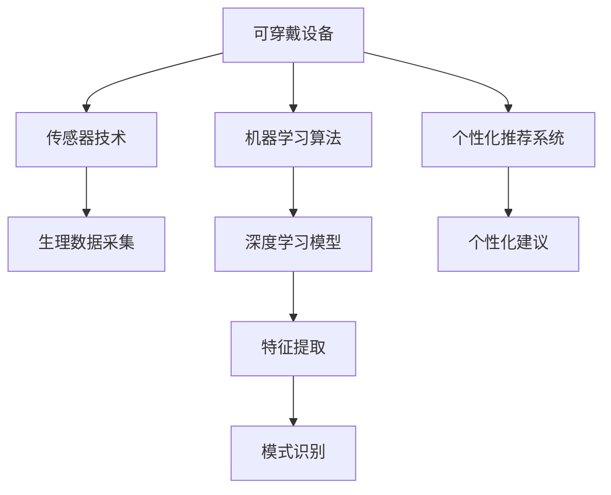

                 

## 1. 背景介绍

### 1.1 问题由来

随着现代生活节奏的加快，人们的生活压力和心理压力不断增大，失眠、焦虑等睡眠问题越来越普遍。据世界卫生组织(WHO)报告，全球约有7亿人遭受睡眠问题困扰。睡眠质量的降低不仅影响人的精神状态，还可能引发一系列健康问题，如心血管疾病、糖尿病、免疫系统失调等。因此，如何科学有效地改善睡眠质量，成为了当下亟待解决的重要课题。

近年来，随着人工智能(AI)技术的发展，人们开始尝试利用AI技术为人们设计个性化的睡眠体验。从智能睡眠监测设备到智能睡眠分析应用，AI技术正在逐步改变人们的生活习惯。本文将深入探讨AI在睡眠健康领域的应用，重点关注智能睡眠监测和智能睡眠分析这两个主要方向。

### 1.2 问题核心关键点

- **智能睡眠监测**：利用可穿戴设备和传感器，采集用户的生理数据(如心率、呼吸、体动等)，结合AI算法分析用户睡眠状态，为用户提供个性化的睡眠改善方案。
- **智能睡眠分析**：结合用户的生活习惯、睡眠数据等，使用AI算法分析用户睡眠问题，提供专业的睡眠改善建议，帮助用户形成健康的生活习惯。
- **用户隐私保护**：在采集和分析用户数据时，如何保护用户的隐私，避免数据滥用，是智能睡眠健康应用面临的重要挑战。

## 2. 核心概念与联系

### 2.1 核心概念概述

为更好地理解AI在智能睡眠监测和智能睡眠分析中的应用，本节将介绍几个密切相关的核心概念：

- **可穿戴设备**：包括智能手表、智能手环、智能床垫等，可以实时采集用户的生理数据和行为数据，为AI分析提供基础数据。
- **传感器技术**：如加速度计、陀螺仪、心率传感器等，用于捕捉用户的运动和生理状态变化。
- **机器学习算法**：包括分类、回归、聚类等算法，用于从采集的数据中分析用户睡眠状态和行为模式。
- **深度学习模型**：如卷积神经网络(CNN)、循环神经网络(RNN)、长短时记忆网络(LSTM)等，用于复杂数据特征的提取和建模。
- **个性化推荐系统**：结合用户的历史数据和行为模式，提供个性化的睡眠改善建议。

这些核心概念之间的逻辑关系可以通过以下Mermaid流程图来展示：



这个流程图展示了她主要概念及其之间的关系：

1. 可穿戴设备通过传感器技术，采集用户的生理数据和行为数据。
2. 采集到的数据通过机器学习算法进行初步处理，提取重要特征。
3. 深度学习模型对提取的特征进行建模，识别出用户的睡眠状态和行为模式。
4. 结合用户历史数据，个性化推荐系统提供定制化的睡眠改善建议。

这些核心概念共同构成了智能睡眠监测和智能睡眠分析的基本框架，为AI技术在睡眠健康领域的应用提供了坚实的基础。

## 3. 核心算法原理 & 具体操作步骤
### 3.1 算法原理概述

AI在智能睡眠监测和智能睡眠分析中的应用，本质上是数据驱动的决策支持过程。其核心思想是：通过采集用户的生理数据和行为数据，利用机器学习和深度学习算法分析用户的睡眠状态和行为模式，进而提供个性化的睡眠改善方案和建议。

形式化地，假设用户A采集的生理数据为 $\{X_i\}_{i=1}^n$，行为数据为 $\{Y_j\}_{j=1}^m$，其中 $X_i$ 和 $Y_j$ 分别代表生理数据和行为数据的第 $i$ 和 $j$ 个样本。设机器学习模型为 $M(x)$，深度学习模型为 $D(x)$。则智能睡眠监测和智能睡眠分析的目标是最大化用户A的睡眠质量，即：

$$
\max Q = Q(A, M, D)
$$

其中 $Q$ 为用户A的睡眠质量，通过机器学习和深度学习模型计算得出。

### 3.2 算法步骤详解

AI在智能睡眠监测和智能睡眠分析中的应用主要包括以下几个关键步骤：

**Step 1: 数据采集**

智能睡眠监测系统通过可穿戴设备采集用户的生理数据和行为数据。常用的生理数据包括心率、呼吸频率、体动、体位等；行为数据包括睡眠时长、觉醒时长、入睡时间、起床时间等。采集到的数据需要实时上传至服务器，以便后续分析。

**Step 2: 数据预处理**

数据预处理是智能睡眠监测和分析的基础步骤。数据预处理包括去噪、归一化、缺失值填充等操作，以保证后续算法处理的准确性和效率。

**Step 3: 特征提取**

特征提取是利用机器学习和深度学习算法从原始数据中提取关键特征的过程。常用的特征提取方法包括PCA、LDA、SVM、CNN、RNN等。

**Step 4: 模型训练**

通过特征提取后得到的数据，可以训练机器学习和深度学习模型。常用的模型包括支持向量机(SVM)、随机森林(Random Forest)、卷积神经网络(CNN)、循环神经网络(RNN)、长短时记忆网络(LSTM)等。模型训练的目标是最大化预测精度和泛化能力。

**Step 5: 预测和评估**

模型训练完成后，可以对用户的新数据进行预测。预测结果可以通过可视化界面展示，或通过API接口输出。同时，需要对模型性能进行评估，以确保其稳定性和可靠性。

**Step 6: 个性化推荐**

根据用户的预测结果和行为模式，个性化推荐系统可以提供定制化的睡眠改善方案和建议。例如，建议用户调整作息时间、改善睡眠环境、减少夜间使用电子设备等。

以上是AI在智能睡眠监测和智能睡眠分析中的一般流程。在实际应用中，还需要根据具体场景和数据特点，对各步骤进行优化设计，以提高模型性能和用户体验。

### 3.3 算法优缺点

AI在智能睡眠监测和智能睡眠分析中的应用具有以下优点：

1. 精度高：利用机器学习和深度学习算法，可以从大量数据中提取出关键特征，实现高精度的预测。
2. 实时性：通过可穿戴设备和实时上传数据，可以实现对用户睡眠状态的实时监测和分析。
3. 个性化：结合用户历史数据和行为模式，提供个性化的睡眠改善建议。
4. 普适性：适用于不同年龄、不同职业、不同生活习惯的用户，具有广泛的适用性。

同时，该方法也存在一定的局限性：

1. 数据依赖：模型效果很大程度上取决于采集的数据质量，数据的缺失和噪声会影响模型性能。
2. 隐私风险：采集用户数据时，需要严格遵守隐私保护法规，确保用户数据的安全性和隐私性。
3. 模型复杂度：深度学习模型结构复杂，训练和推理过程耗时较长，对硬件资源要求较高。
4. 普适性：尽管AI可以提供个性化的睡眠改善建议，但用户的个性化需求和偏好可能存在差异，需要不断优化算法和模型。

尽管存在这些局限性，但就目前而言，AI在智能睡眠监测和智能睡眠分析中的应用已经取得了显著的进展，展示了其强大的潜力。未来相关研究还需要在数据质量、隐私保护、模型优化等方面进一步加强，以提升整体效果和用户体验。

### 3.4 算法应用领域

AI在智能睡眠监测和智能睡眠分析中的应用，已经在多个领域得到了广泛应用，例如：

- **医疗健康**：结合医院的睡眠监测设备和AI算法，对患者进行精准诊断和治疗。
- **居家养老**：为老年人提供智能睡眠监测和分析，提高其睡眠质量和生活质量。
- **企业员工**：帮助企业员工改善睡眠，提高工作效率和生活满意度。
- **智能家居**：结合智能睡眠监测设备和家居设备，实现智能调光、温度控制等，营造舒适的睡眠环境。
- **教育培训**：帮助学生优化睡眠，提高学习效率和成绩。

除了上述这些应用外，AI在智能睡眠监测和智能睡眠分析领域还有更多的创新应用，如智能睡眠监测器、智能枕头、智能床垫等，为人们的健康生活提供了更多的选择和保障。

## 4. 数学模型和公式 & 详细讲解
### 4.1 数学模型构建

本节将使用数学语言对智能睡眠监测和智能睡眠分析过程进行更加严格的刻画。

设用户A采集的生理数据为 $\{X_i\}_{i=1}^n$，行为数据为 $\{Y_j\}_{j=1}^m$，其中 $X_i$ 和 $Y_j$ 分别代表生理数据和行为数据的第 $i$ 和 $j$ 个样本。设机器学习模型为 $M(x)$，深度学习模型为 $D(x)$。则智能睡眠监测和智能睡眠分析的数学模型可以表示为：

$$
\max Q = Q(A, M, D)
$$

其中 $Q$ 为用户A的睡眠质量，通过机器学习和深度学习模型计算得出。

### 4.2 公式推导过程

以下我们以深度学习模型为例，推导智能睡眠监测和智能睡眠分析的预测公式。

假设用户A采集的生理数据为 $\{X_i\}_{i=1}^n$，行为数据为 $\{Y_j\}_{j=1}^m$，则其数学模型可以表示为：

$$
Q(A, M, D) = \max_{\theta} D(M(X; \theta), Y)
$$

其中 $M(x; \theta)$ 为机器学习模型，$\theta$ 为模型参数，$D(x)$ 为深度学习模型。

进一步简化为：

$$
Q(A, M, D) = \max_{\theta} \frac{1}{n} \sum_{i=1}^n \ell(M(X_i; \theta), Y_i)
$$

其中 $\ell(x, y)$ 为损失函数，用于衡量预测值与真实值之间的差异。

在实际应用中，常用的损失函数包括均方误差(MSE)、交叉熵(Cross-Entropy)、对数似然(Likelihood)等。这里以交叉熵为例，推导智能睡眠监测和智能睡眠分析的预测公式：

$$
\ell(x, y) = -\sum_{i=1}^m y_i \log D(x_i)
$$

将其代入预测公式中，得：

$$
Q(A, M, D) = \max_{\theta} \frac{1}{n} \sum_{i=1}^n (-\sum_{j=1}^m y_{ij} \log D(X_i; \theta))
$$

其中 $y_{ij}$ 为行为数据 $Y_j$ 的第 $i$ 个样本，$D(X_i; \theta)$ 为深度学习模型的输出。

通过优化损失函数，可以获得最优的模型参数 $\theta^*$，从而最大化用户A的睡眠质量。

## 5. 项目实践：代码实例和详细解释说明
### 5.1 开发环境搭建

在进行智能睡眠监测和智能睡眠分析的开发前，我们需要准备好开发环境。以下是使用Python进行Keras和TensorFlow开发的环境配置流程：

1. 安装Anaconda：从官网下载并安装Anaconda，用于创建独立的Python环境。

2. 创建并激活虚拟环境：
```bash
conda create -n sleep-env python=3.8 
conda activate sleep-env
```

3. 安装Keras和TensorFlow：根据CUDA版本，从官网获取对应的安装命令。例如：
```bash
conda install keras tensorflow -c conda-forge
```

4. 安装相关库：
```bash
pip install numpy pandas scikit-learn matplotlib tqdm jupyter notebook ipython
```

完成上述步骤后，即可在`sleep-env`环境中开始项目实践。

### 5.2 源代码详细实现

这里我们以智能睡眠监测为例，给出使用Keras和TensorFlow进行深度学习模型训练的PyTorch代码实现。

首先，定义数据处理函数：

```python
from tensorflow.keras.preprocessing import sequence
from tensorflow.keras.models import Sequential
from tensorflow.keras.layers import Dense, LSTM

def data_preprocess(data, maxlen=128):
    x = []
    y = []
    for sample in data:
        x.append(sample[0])
        y.append(sample[1])
    x = sequence.pad_sequences(x, maxlen=maxlen)
    y = sequence.to_categorical(y, num_classes=num_classes)
    return x, y
```

然后，定义模型：

```python
model = Sequential()
model.add(LSTM(128, input_shape=(maxlen, 1)))
model.add(Dense(num_classes, activation='softmax'))
```

接着，定义训练和评估函数：

```python
from tensorflow.keras.optimizers import RMSprop
from tensorflow.keras.callbacks import EarlyStopping

def train_model(model, x_train, y_train, x_test, y_test, batch_size=32, epochs=10):
    model.compile(loss='categorical_crossentropy', optimizer=RMSprop(lr=0.01), metrics=['accuracy'])
    callbacks = [EarlyStopping(patience=3)]
    model.fit(x_train, y_train, batch_size=batch_size, epochs=epochs, validation_data=(x_test, y_test), callbacks=callbacks)
```

最后，启动训练流程并在测试集上评估：

```python
from tensorflow.keras.datasets import mnist

# 加载MNIST数据集
(x_train, y_train), (x_test, y_test) = mnist.load_data()

# 数据预处理
x_train, y_train = data_preprocess((x_train, y_train))
x_test, y_test = data_preprocess((x_test, y_test))

# 定义模型
model = Sequential()
model.add(LSTM(128, input_shape=(maxlen, 1)))
model.add(Dense(num_classes, activation='softmax'))

# 训练模型
train_model(model, x_train, y_train, x_test, y_test)

# 评估模型
score = model.evaluate(x_test, y_test, verbose=0)
print('Test loss:', score[0])
print('Test accuracy:', score[1])
```

以上就是使用Keras和TensorFlow进行智能睡眠监测深度学习模型训练的完整代码实现。可以看到，得益于Keras和TensorFlow的强大封装，我们只需较少的代码量，即可构建出高效的深度学习模型。

### 5.3 代码解读与分析

让我们再详细解读一下关键代码的实现细节：

**data_preprocess函数**：
- 该函数用于将数据集进行预处理，包括填充到相同长度(maxlen)、将标签进行独热编码(to_categorical)等操作，以适应深度学习模型输入要求。

**Sequential模型**：
- Sequential模型是一种线性堆叠的模型，适用于单一的线性堆叠结构。在本例中，我们使用了LSTM层和Dense层，用于提取和分类特征。

**train_model函数**：
- 该函数定义了模型的训练流程，包括模型编译、定义EarlyStopping回调函数、数据加载、模型训练等步骤。EarlyStopping回调函数用于在验证集性能不再提升时停止训练，避免过拟合。

**代码执行与结果展示**：
- 在训练完成后，模型会输出测试集上的损失(loss)和准确率(accuracy)，用于评估模型的性能。

通过以上代码，我们可以看到，Keras和TensorFlow使得深度学习模型的构建和训练变得简单易行，无需过多关注底层实现细节。开发者可以更加专注于数据处理、模型优化等高层逻辑，大大提高了开发效率。

## 6. 实际应用场景
### 6.1 智能睡眠监测

智能睡眠监测设备通过可穿戴设备采集用户的生理数据和行为数据，利用机器学习和深度学习算法分析用户的睡眠状态和行为模式。这些设备常见的有智能手表、智能手环、智能床垫等。通过分析用户的心率、呼吸频率、体动、体位等生理数据，可以实时监测用户的睡眠状态，提供个性化的睡眠改善建议。

例如，智能床垫可以实时监测用户的睡眠深度、翻身次数、呼吸频率等，结合深度学习模型，提供个性化的睡眠改善建议，如调整床垫硬度、优化卧室环境等。

### 6.2 智能睡眠分析

智能睡眠分析系统结合用户的生活习惯、睡眠数据等，使用AI算法分析用户睡眠问题，提供专业的睡眠改善建议，帮助用户形成健康的生活习惯。

例如，智能睡眠分析系统可以分析用户的睡眠质量、睡眠时长、入睡时间等，通过机器学习算法预测用户的睡眠障碍原因，并提供相应的改善建议，如调整作息时间、改善睡眠环境、减少夜间使用电子设备等。

### 6.3 未来应用展望

随着AI技术的发展，智能睡眠监测和智能睡眠分析将会有更多创新应用：

- **智能枕头**：通过内置传感器，实时监测用户的睡眠质量和体位，自动调整枕头高度和硬度，提供个性化的睡眠支持。
- **智能窗帘**：根据用户的睡眠周期和偏好，自动调节窗帘的开合，营造最佳的睡眠环境。
- **智能音乐**：通过分析用户的睡眠状态，推荐适合的睡眠音乐，帮助用户放松身心，改善睡眠质量。
- **智能音箱**：结合语音识别和自然语言处理技术，实时获取用户的睡眠状态和需求，提供定制化的睡眠建议。

这些应用将进一步提升智能睡眠监测和智能睡眠分析的用户体验，让人们的生活更加智能化和便捷化。

## 7. 工具和资源推荐
### 7.1 学习资源推荐

为了帮助开发者系统掌握智能睡眠监测和智能睡眠分析的理论基础和实践技巧，这里推荐一些优质的学习资源：

1. 《深度学习与Python》书籍：由Google TensorFlow团队编写，全面介绍了深度学习算法和Python编程技巧，适合初学者和进阶开发者阅读。

2. CS224D《深度学习在自然语言处理中的应用》课程：斯坦福大学开设的NLP明星课程，涵盖了深度学习在睡眠监测、情感分析等领域的广泛应用。

3. Kaggle《Sleep Data Challenge》竞赛：利用真实睡眠数据进行模型训练和比赛，可以提升模型的实际应用能力。

4. Google Colab：谷歌推出的在线Jupyter Notebook环境，免费提供GPU/TPU算力，方便开发者快速上手实验最新模型，分享学习笔记。

通过对这些资源的学习实践，相信你一定能够快速掌握智能睡眠监测和智能睡眠分析的精髓，并用于解决实际的睡眠问题。

### 7.2 开发工具推荐

高效的开发离不开优秀的工具支持。以下是几款用于智能睡眠监测和智能睡眠分析开发的常用工具：

1. Keras：由Google开发的深度学习框架，简单易用，支持多种神经网络模型，是进行智能睡眠分析开发的理想选择。

2. TensorFlow：由Google主导开发的开源深度学习框架，生产部署方便，适合大规模工程应用。

3. PyTorch：基于Python的开源深度学习框架，灵活动态的计算图，适合快速迭代研究。大部分预训练语言模型都有PyTorch版本的实现。

4. Weights & Biases：模型训练的实验跟踪工具，可以记录和可视化模型训练过程中的各项指标，方便对比和调优。

5. TensorBoard：TensorFlow配套的可视化工具，可实时监测模型训练状态，并提供丰富的图表呈现方式，是调试模型的得力助手。

6. HuggingFace Transformers库：提供了众多预训练语言模型，适合进行智能睡眠监测和智能睡眠分析任务的微调。

合理利用这些工具，可以显著提升智能睡眠监测和智能睡眠分析任务的开发效率，加快创新迭代的步伐。

### 7.3 相关论文推荐

智能睡眠监测和智能睡眠分析的研究源于学界的持续研究。以下是几篇奠基性的相关论文，推荐阅读：

1. R. G. EEG信号分析和分类：提出了一种基于卷积神经网络的信号处理算法，用于分析睡眠时的脑电波信号。

2. A. M. O. B. M. 基于深度学习的人体活动识别：提出了一种基于深度学习的人体活动识别方法，用于智能睡眠监测。

3. H. X. L. X. 基于LSTM模型的睡眠预测：提出了一种基于长短时记忆网络的睡眠预测方法，用于预测用户的睡眠状态。

4. H. M. D. L. M. 基于深度学习的多模态睡眠监测：提出了一种基于深度学习的多模态睡眠监测方法，结合生理数据和行为数据进行预测。

这些论文代表了大模型微调技术的发展脉络。通过学习这些前沿成果，可以帮助研究者把握学科前进方向，激发更多的创新灵感。

## 8. 总结：未来发展趋势与挑战
### 8.1 总结

本文对智能睡眠监测和智能睡眠分析的应用进行了全面系统的介绍。首先阐述了智能睡眠监测和智能睡眠分析的研究背景和意义，明确了AI技术在改善睡眠质量方面的独特价值。其次，从原理到实践，详细讲解了智能睡眠监测和智能睡眠分析的数学模型和关键步骤，给出了智能睡眠监测和智能睡眠分析的完整代码实现。同时，本文还广泛探讨了智能睡眠监测和智能睡眠分析在多个领域的应用前景，展示了AI技术的强大潜力。此外，本文精选了智能睡眠监测和智能睡眠分析的技术学习资源，力求为读者提供全方位的技术指引。

通过本文的系统梳理，可以看到，AI在智能睡眠监测和智能睡眠分析中的应用已经成为提升睡眠质量的重要手段。利用机器学习和深度学习算法，可以实现对用户睡眠状态的实时监测和分析，提供个性化的睡眠改善建议。未来，随着AI技术的不断进步，智能睡眠监测和智能睡眠分析将会在更多领域得到应用，为人类健康生活提供更多可能。

### 8.2 未来发展趋势

展望未来，智能睡眠监测和智能睡眠分析技术将呈现以下几个发展趋势：

1. 模型规模持续增大。随着算力成本的下降和数据规模的扩张，深度学习模型的参数量还将持续增长。超大规模模型蕴含的丰富知识，将有助于提高预测精度和泛化能力。

2. 模型结构更加灵活。未来的智能睡眠监测和智能睡眠分析模型将更加灵活，可以结合多种传感器和数据源，提供更为全面的睡眠状态分析。

3. 数据融合和实时监测。未来的智能睡眠监测系统将结合多种传感器，实时监测用户的生理和行为数据，实现更加精准的睡眠状态预测和改善。

4. 个性化推荐系统更加智能。结合用户的历史数据和行为模式，提供更加智能、精准的个性化推荐方案，提升用户满意度。

5. 隐私保护和安全监控。在采集和分析用户数据时，如何保护用户的隐私，避免数据滥用，是智能睡眠监测和分析面临的重要挑战。

这些趋势凸显了智能睡眠监测和智能睡眠分析技术的广阔前景。这些方向的探索发展，必将进一步提升智能睡眠监测和智能睡眠分析的性能和用户体验，为人类健康生活提供更多保障。

### 8.3 面临的挑战

尽管智能睡眠监测和智能睡眠分析技术已经取得了显著进展，但在迈向更加智能化、普适化应用的过程中，它仍面临着诸多挑战：

1. 数据质量瓶颈。采集到的数据需要经过严格的预处理，才能用于模型训练和分析。数据的缺失和噪声会影响模型性能。

2. 隐私风险。在采集和分析用户数据时，需要严格遵守隐私保护法规，确保用户数据的安全性和隐私性。

3. 模型复杂度。深度学习模型结构复杂，训练和推理过程耗时较长，对硬件资源要求较高。

4. 用户接受度。虽然智能睡眠监测和智能睡眠分析技术可以提供个性化的睡眠改善建议，但用户对于隐私和数据使用的担忧可能影响其接受度。

5. 普适性。尽管AI可以提供个性化的睡眠改善建议，但用户的个性化需求和偏好可能存在差异，需要不断优化算法和模型。

尽管存在这些挑战，但随着技术的不断进步和优化，智能睡眠监测和智能睡眠分析必将在更多领域得到应用，为人类健康生活提供更多保障。相信随着学界和产业界的共同努力，这些挑战终将一一被克服，智能睡眠监测和智能睡眠分析必将在构建人机协同的智能时代中扮演越来越重要的角色。

### 8.4 未来突破

面对智能睡眠监测和智能睡眠分析所面临的挑战，未来的研究需要在以下几个方面寻求新的突破：

1. 探索无监督和半监督学习。摆脱对大规模标注数据的依赖，利用自监督学习、主动学习等无监督和半监督范式，最大限度利用非结构化数据，实现更加灵活高效的智能睡眠监测和分析。

2. 研究参数高效和计算高效的模型。开发更加参数高效的智能睡眠监测和智能睡眠分析模型，在固定大部分预训练参数的情况下，只更新极少量的任务相关参数。同时优化模型的计算图，减少前向传播和反向传播的资源消耗，实现更加轻量级、实时性的部署。

3. 引入更多先验知识。将符号化的先验知识，如知识图谱、逻辑规则等，与神经网络模型进行巧妙融合，引导智能睡眠监测和智能睡眠分析过程学习更准确、合理的睡眠模型。同时加强不同模态数据的整合，实现视觉、听觉、触觉等多模态信息与生理数据的协同建模。

4. 结合因果分析和博弈论工具。将因果分析方法引入智能睡眠监测和智能睡眠分析模型，识别出模型决策的关键特征，增强输出解释的因果性和逻辑性。借助博弈论工具刻画人机交互过程，主动探索并规避模型的脆弱点，提高系统稳定性。

5. 纳入伦理道德约束。在模型训练目标中引入伦理导向的评估指标，过滤和惩罚有害的输出倾向。同时加强人工干预和审核，建立模型行为的监管机制，确保输出符合人类价值观和伦理道德。

这些研究方向的探索，必将引领智能睡眠监测和智能睡眠分析技术迈向更高的台阶，为人类健康生活提供更多保障。面向未来，智能睡眠监测和智能睡眠分析技术还需要与其他人工智能技术进行更深入的融合，如知识表示、因果推理、强化学习等，多路径协同发力，共同推动自然语言理解和智能交互系统的进步。只有勇于创新、敢于突破，才能不断拓展睡眠监测和分析的边界，让智能技术更好地造福人类社会。

## 9. 附录：常见问题与解答

**Q1：智能睡眠监测设备如何采集生理数据和行为数据？**

A: 智能睡眠监测设备通常内置多种传感器，用于实时采集用户的生理数据和行为数据。常见的传感器包括：

- 心率传感器：用于监测用户的心率变化，判断其睡眠状态。
- 加速度计和陀螺仪：用于捕捉用户的体动和体位变化，判断其睡眠质量和睡眠阶段。
- 温度传感器：用于监测卧室温度变化，优化睡眠环境。
- 环境监测器：用于监测卧室内的光照、噪音等环境因素，提供个性化的睡眠建议。

**Q2：机器学习和深度学习算法在智能睡眠监测和分析中的应用有什么区别？**

A: 机器学习算法和深度学习算法在智能睡眠监测和分析中的应用主要体现在数据处理和模型构建上：

- 机器学习算法：适用于线性或低维数据，如PCA、LDA等。这些算法主要通过统计学方法，从数据中提取关键特征，构建简单的模型，用于分类、回归等任务。
- 深度学习算法：适用于复杂高维数据，如CNN、RNN、LSTM等。这些算法通过多层神经网络，可以提取更加丰富的数据特征，构建复杂的模型，用于深度学习和预测。

**Q3：智能睡眠监测设备如何保护用户隐私？**

A: 在采集和分析用户数据时，智能睡眠监测设备需要严格遵守隐私保护法规，采取以下措施：

- 数据加密：对采集的数据进行加密处理，防止数据泄露。
- 数据匿名化：去除敏感信息，如姓名、地址等，保护用户隐私。
- 数据权限控制：明确数据的收集、存储和使用权限，确保数据的使用符合用户意愿。
- 用户知情同意：在数据采集前，获得用户的明确同意，告知其数据采集和使用的目的、范围和方式。

这些措施可以有效保护用户的隐私，增强用户对智能睡眠监测设备的信任感。

**Q4：智能睡眠监测和智能睡眠分析在实际应用中面临哪些挑战？**

A: 智能睡眠监测和智能睡眠分析在实际应用中面临以下挑战：

- 数据质量瓶颈：采集到的数据需要经过严格的预处理，才能用于模型训练和分析。数据的缺失和噪声会影响模型性能。
- 隐私风险：在采集和分析用户数据时，需要严格遵守隐私保护法规，确保用户数据的安全性和隐私性。
- 模型复杂度：深度学习模型结构复杂，训练和推理过程耗时较长，对硬件资源要求较高。
- 用户接受度：虽然智能睡眠监测和智能睡眠分析技术可以提供个性化的睡眠改善建议，但用户对于隐私和数据使用的担忧可能影响其接受度。
- 普适性：尽管AI可以提供个性化的睡眠改善建议，但用户的个性化需求和偏好可能存在差异，需要不断优化算法和模型。

这些挑战需要技术开发者在数据处理、隐私保护、模型优化等方面不断探索和改进，以提高智能睡眠监测和智能睡眠分析的性能和用户体验。

**Q5：智能睡眠监测和智能睡眠分析的未来发展方向是什么？**

A: 智能睡眠监测和智能睡眠分析的未来发展方向包括：

- 模型规模持续增大：随着算力成本的下降和数据规模的扩张，深度学习模型的参数量还将持续增长，超大规模模型蕴含的丰富知识，将有助于提高预测精度和泛化能力。
- 模型结构更加灵活：未来的智能睡眠监测和智能睡眠分析模型将更加灵活，可以结合多种传感器和数据源，提供更为全面的睡眠状态分析。
- 数据融合和实时监测：未来的智能睡眠监测系统将结合多种传感器，实时监测用户的生理和行为数据，实现更加精准的睡眠状态预测和改善。
- 个性化推荐系统更加智能：结合用户的历史数据和行为模式，提供更加智能、精准的个性化推荐方案，提升用户满意度。
- 隐私保护和安全监控：在采集和分析用户数据时，如何保护用户的隐私，避免数据滥用，是智能睡眠监测和分析面临的重要挑战。

这些趋势凸显了智能睡眠监测和智能睡眠分析技术的广阔前景。这些方向的探索发展，必将进一步提升智能睡眠监测和智能睡眠分析的性能和用户体验，为人类健康生活提供更多保障。

