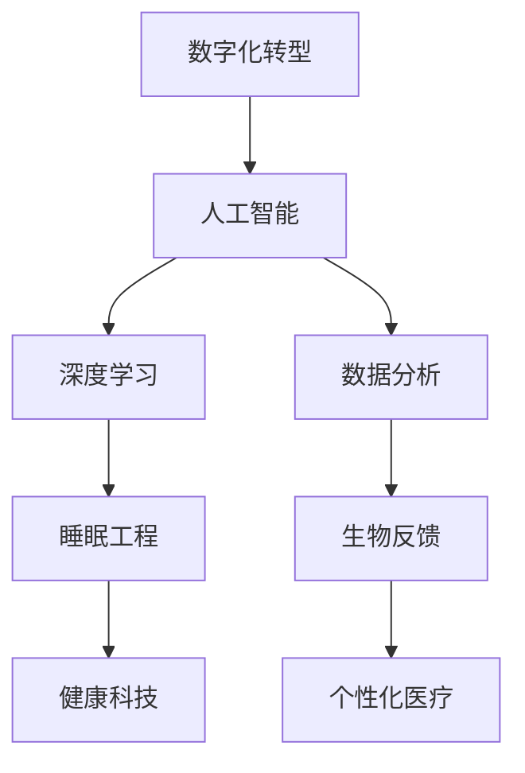

                 

# 数字化梦境工程：AI设计的睡眠体验

> 关键词：数字化转型, 人工智能, 睡眠工程, 数据分析, 深度学习, 生物反馈, 健康科技, 个性化医疗

## 1. 背景介绍

### 1.1 问题由来

在现代社会中，随着工作压力的增大和智能设备的使用频率增高，越来越多的人出现了睡眠问题。据调查，全球约有四分之一的成年人患有睡眠障碍。这一问题不仅影响了人们的生活质量，还与多种健康问题相关，如焦虑、抑郁、肥胖、糖尿病和心血管疾病等。

为了解决这个问题，传统的干预方法主要包括药物治疗和行为疗法。然而，这些方法往往存在副作用或效果不显著的问题。近年来，随着人工智能技术的快速发展，一种新的解决方案正在逐渐浮出水面——数字化梦境工程。

### 1.2 问题核心关键点

数字化梦境工程是一种通过AI技术设计和干预睡眠环境，以提升睡眠质量和健康水平的方法。它主要包括以下几个关键点：

1. **数据采集与分析**：使用传感器和智能设备收集用户的睡眠数据，如脑电波、心率、体温和睡眠周期等。
2. **AI模型构建**：基于收集到的数据，构建机器学习模型，预测和识别睡眠问题，提出干预建议。
3. **个性化干预**：根据AI模型的分析结果，为个体定制个性化的睡眠干预方案，如调节光线、温度、湿度和声音等环境因素。
4. **反馈与优化**：通过持续收集用户反馈，优化AI模型和干预方案，提升效果。

这些核心关键点共同构成了一个完整的数字化梦境工程框架，旨在通过科技手段改善用户的睡眠状况，提升其整体健康水平。

## 2. 核心概念与联系

### 2.1 核心概念概述

为更好地理解数字化梦境工程，本节将介绍几个密切相关的核心概念：

1. **数字化转型**：指将传统行业或业务流程通过数字化手段进行升级，以提高效率、降低成本、提升用户体验。
2. **人工智能**：一种模拟人类智能的计算机技术，包括机器学习、深度学习、自然语言处理等，以处理大规模复杂数据。
3. **睡眠工程**：一门研究睡眠与健康之间关系的学科，涉及睡眠生理、心理、环境等多方面因素。
4. **数据分析**：从大量数据中提取有用信息，以支持决策和优化过程。
5. **深度学习**：一种基于神经网络的机器学习技术，擅长处理高维度非结构化数据。
6. **生物反馈**：通过测量和监控生物信号，如心率、体温、脑电波等，来调整生理状态。
7. **健康科技**：结合健康与科技，通过智能设备、数据分析和个性化干预等手段，提升健康水平。
8. **个性化医疗**：基于个体差异，提供量身定制的医学干预和治疗方案。

这些核心概念之间的逻辑关系可以通过以下Mermaid流程图来展示：



这个流程图展示了一个完整的数字化梦境工程流程：

1. 从数字化转型开始，通过收集用户的睡眠数据。
2. 使用人工智能和深度学习模型，进行数据分析和预测。
3. 结合生物反馈和睡眠工程原理，设计个性化的干预方案。
4. 通过健康科技手段，实现个性化医疗目标，提升睡眠质量。

这些概念共同构成了数字化梦境工程的基础，使得通过AI技术改善睡眠成为可能。

## 3. 核心算法原理 & 具体操作步骤
### 3.1 算法原理概述

数字化梦境工程的核心算法原理主要基于机器学习和深度学习技术，通过数据分析和模型构建，实现对睡眠问题的预测和干预。其核心步骤如下：

1. **数据采集与预处理**：使用传感器和智能设备采集用户的睡眠数据，并对数据进行清洗和预处理。
2. **特征工程**：提取和选择对睡眠预测有重要影响的特征，构建特征向量。
3. **模型训练**：使用机器学习算法（如随机森林、支持向量机等）或深度学习模型（如卷积神经网络、循环神经网络等），对历史睡眠数据进行训练。
4. **预测与干预**：基于训练好的模型，对用户的当前睡眠状况进行预测，并提出个性化的干预建议。
5. **效果评估与优化**：持续收集用户反馈，评估干预效果，优化模型和干预方案。

### 3.2 算法步骤详解

以下是数字化梦境工程的具体操作步骤：

**Step 1: 数据采集与预处理**
- 使用可穿戴设备（如智能手环、头带等）采集用户的睡眠数据，包括心率、脑电波、体温、呼吸等。
- 对采集到的原始数据进行清洗和预处理，如去除噪声、缺失值填充等。
- 将处理后的数据划分为训练集和测试集，确保模型训练和评估的可靠性。

**Step 2: 特征工程**
- 选择对睡眠预测有重要影响的特征，如心率变异度、睡眠周期、呼吸频率等。
- 对特征进行归一化处理，确保数据的一致性和可比性。
- 构建特征向量，将选择的特征作为模型的输入。

**Step 3: 模型训练**
- 选择合适的机器学习或深度学习模型，如随机森林、卷积神经网络（CNN）等。
- 使用训练集数据对模型进行训练，调整模型的超参数。
- 在训练过程中，应用交叉验证等技术，确保模型的泛化能力。

**Step 4: 预测与干预**
- 将用户当前的数据输入到训练好的模型中，预测其睡眠状态和问题。
- 根据预测结果，设计个性化的干预方案，如调节光线、温度、湿度和声音等环境因素。
- 提供用户反馈渠道，收集干预效果，进一步优化模型和干预策略。

**Step 5: 效果评估与优化**
- 通过用户反馈和生理指标的监控，评估干预效果。
- 持续收集和分析用户数据，优化模型和干预方案。
- 不断迭代和改进，提升干预的精准性和有效性。

### 3.3 算法优缺点

数字化梦境工程具有以下优点：

1. **个性化**：能够根据个体差异，提供量身定制的干预方案，提高干预的针对性和效果。
2. **实时性**：通过实时监控和反馈，能够及时调整干预策略，提升用户的睡眠质量。
3. **低成本**：相比于传统医疗干预，数字化解决方案成本较低，易于推广和应用。
4. **数据驱动**：基于大量数据和科学模型，干预方案更具理性和可靠性。

同时，该方法也存在以下局限性：

1. **数据隐私**：采集和存储用户的生理数据，可能涉及隐私问题，需要严格的数据保护措施。
2. **模型复杂**：深度学习和机器学习模型需要大量的数据和计算资源，模型训练过程复杂。
3. **干预效果不一**：不同的人对环境干预的反应不同，干预效果可能存在差异。
4. **依赖设备**：需要依赖智能设备和传感器，设备可靠性和数据质量对干预效果有较大影响。

尽管存在这些局限性，但数字化梦境工程仍是大数据时代改善睡眠质量的重要手段之一，具有广阔的应用前景。

### 3.4 算法应用领域

数字化梦境工程在多个领域中具有广泛的应用，例如：

1. **医疗健康**：通过实时监控和数据分析，帮助医生诊断和治疗睡眠障碍，提升患者的生活质量。
2. **智能家居**：结合智能设备，为用户提供个性化的睡眠环境，如智能灯光、恒温器等。
3. **企业管理**：通过分析员工的睡眠质量，优化工作安排，提升工作效率和健康水平。
4. **教育培训**：为学生提供个性化的睡眠干预，提高学习效果和注意力水平。
5. **健身运动**：通过监测运动前后睡眠状态，指导科学的训练和恢复。
6. **娱乐休闲**：为用户提供个性化的睡眠体验，提升娱乐体验的质量。

除了上述这些经典应用外，数字化梦境工程还将进一步拓展到更多场景中，为各行业的数字化转型和健康提升提供新的解决方案。

## 4. 数学模型和公式 & 详细讲解 & 举例说明

### 4.1 数学模型构建

本节将使用数学语言对数字化梦境工程的预测与干预过程进行更加严格的刻画。

假设收集到的睡眠数据为 $D=\{x_i\}_{i=1}^N$，其中 $x_i$ 为一个样本的特征向量。目标是构建一个预测模型 $f$，用于预测用户睡眠状态 $y$。数学上，模型 $f$ 可以表示为：

$$
y=f(x; \theta)
$$

其中 $\theta$ 为模型的参数。假设 $y$ 服从二分类问题，则预测模型可以是一个二分类器，如逻辑回归、支持向量机等。

### 4.2 公式推导过程

以下我们以逻辑回归模型为例，推导睡眠预测模型的公式及其梯度。

假设逻辑回归模型的输出为 $y_i=f(x_i; \theta)=\log\frac{p(y=1|x_i)}{p(y=0|x_i)}$，其中 $p(y=1|x_i)$ 和 $p(y=0|x_i)$ 分别为 $x_i$ 属于正类和负类的概率。则二分类逻辑回归模型的损失函数为：

$$
L(y_i, f(x_i; \theta)) = -(y_i \log p(y=1|x_i) + (1-y_i) \log p(y=0|x_i))
$$

将上式展开并简化，得：

$$
L(y_i, f(x_i; \theta)) = -(y_i \log \sigma(x_i^T \theta) + (1-y_i) \log (1-\sigma(x_i^T \theta)))
$$

其中 $\sigma$ 为 sigmoid 函数。对 $\theta$ 求偏导数，得梯度：

$$
\frac{\partial L}{\partial \theta} = -(y_i - \sigma(x_i^T \theta)) x_i
$$

在得到梯度后，即可带入优化算法（如梯度下降、随机梯度下降等），更新模型参数 $\theta$，最小化损失函数 $L$。

### 4.3 案例分析与讲解

以智能家居环境为例，介绍数字化梦境工程在实际应用中的具体实现。

1. **数据采集**：使用智能手环、智能床等设备，实时采集用户的睡眠数据，如心率、脑电波、体温等。
2. **特征选择**：根据睡眠工程原理，选择对睡眠状态预测有重要影响的特征，如心率变异度、呼吸频率等。
3. **模型训练**：使用历史数据训练逻辑回归模型，预测用户的睡眠状态。
4. **干预方案设计**：根据模型预测结果，设计个性化的干预方案，如调节灯光亮度和颜色，调整室内温度和湿度，播放放松音乐等。
5. **效果评估与优化**：通过用户的反馈和生理指标的监控，评估干预效果，优化模型和干预策略。

## 5. 项目实践：代码实例和详细解释说明
### 5.1 开发环境搭建

在进行数字化梦境工程项目实践前，我们需要准备好开发环境。以下是使用Python进行PyTorch开发的环境配置流程：

1. 安装Anaconda：从官网下载并安装Anaconda，用于创建独立的Python环境。

2. 创建并激活虚拟环境：
```bash
conda create -n pytorch-env python=3.8 
conda activate pytorch-env
```

3. 安装PyTorch：根据CUDA版本，从官网获取对应的安装命令。例如：
```bash
conda install pytorch torchvision torchaudio cudatoolkit=11.1 -c pytorch -c conda-forge
```

4. 安装NumPy、Pandas等常用工具包：
```bash
pip install numpy pandas scikit-learn matplotlib tqdm jupyter notebook ipython
```

完成上述步骤后，即可在`pytorch-env`环境中开始项目实践。

### 5.2 源代码详细实现

以下是一个简单的Python代码实例，展示如何构建和训练一个基于睡眠数据的逻辑回归模型：

```python
import pandas as pd
import numpy as np
from sklearn.linear_model import LogisticRegression
from sklearn.model_selection import train_test_split

# 加载数据
data = pd.read_csv('sleep_data.csv')

# 数据预处理
features = ['heart_rate', 'temperature', 'breathing_rate']
X = data[features].values
y = data['sleep_state'].values

# 特征归一化
from sklearn.preprocessing import StandardScaler
scaler = StandardScaler()
X = scaler.fit_transform(X)

# 数据划分
X_train, X_test, y_train, y_test = train_test_split(X, y, test_size=0.2, random_state=42)

# 模型训练
model = LogisticRegression()
model.fit(X_train, y_train)

# 预测与评估
y_pred = model.predict(X_test)
accuracy = np.mean(y_pred == y_test)
print('Accuracy:', accuracy)
```

### 5.3 代码解读与分析

让我们再详细解读一下关键代码的实现细节：

**数据加载与预处理**：
- 使用Pandas库加载CSV格式的数据集。
- 选择对睡眠预测有重要影响的特征（如心率、体温、呼吸频率等）。
- 对特征进行归一化处理，确保数据的一致性和可比性。
- 将数据划分为训练集和测试集，使用sklearn库的train_test_split方法。

**模型训练**：
- 使用sklearn库的LogisticRegression类，构建逻辑回归模型。
- 对训练集数据进行fit操作，训练模型。

**预测与评估**：
- 使用训练好的模型对测试集数据进行预测。
- 计算预测结果与真实标签的一致性，得到模型的准确率。

## 6. 实际应用场景
### 6.1 智能家居

数字化梦境工程在智能家居领域有着广泛的应用。通过实时监控和数据分析，智能家居系统能够为用户提供个性化的睡眠环境，提高用户的睡眠质量和健康水平。

以智能床为例，可以集成多种传感器和智能设备，实时采集用户的睡眠数据，如心率、脑电波、体温等。系统基于采集到的数据，构建机器学习模型，预测用户的睡眠状态和问题。根据预测结果，智能床能够自动调节床垫硬度、湿度、温度和灯光亮度等环境因素，提供个性化的睡眠体验。

### 6.2 医疗健康

在医疗健康领域，数字化梦境工程也具有重要的应用价值。通过实时监控和数据分析，数字化解决方案能够帮助医生诊断和治疗睡眠障碍，提升患者的生活质量。

以睡眠监测器为例，可以集成多种生理传感器，实时采集用户的睡眠数据，如心率、呼吸频率、脑电波等。系统基于采集到的数据，构建深度学习模型，预测用户的睡眠状态和问题。根据预测结果，医生可以制定个性化的治疗方案，如调整睡眠环境、药物治疗等，帮助患者改善睡眠状况。

### 6.3 企业管理

在企业管理中，数字化梦境工程同样具有重要应用。通过实时监控和数据分析，数字化解决方案能够优化工作安排，提升员工的工作效率和健康水平。

以企业员工睡眠监测为例，可以通过智能手环等设备，实时采集员工的睡眠数据。系统基于采集到的数据，构建机器学习模型，预测员工的睡眠状态和问题。根据预测结果，企业可以调整工作安排，如优化工作时间、提供休息设施等，提高员工的工作效率和健康水平。

### 6.4 未来应用展望

随着数字化梦境工程的不断发展，未来将在更多领域得到应用，为各行业的数字化转型和健康提升提供新的解决方案。

在智慧城市治理中，数字化解决方案能够提升城市管理的自动化和智能化水平，构建更安全、高效的未来城市。例如，通过智能交通系统，实时监控和管理道路交通，减少交通拥堵和事故发生率。

在智能交通领域，数字化梦境工程同样具有重要应用。通过实时监控和数据分析，智能交通系统能够优化交通流量，提高道路通行效率，减少环境污染。

## 7. 工具和资源推荐
### 7.1 学习资源推荐

为了帮助开发者系统掌握数字化梦境工程的理论基础和实践技巧，这里推荐一些优质的学习资源：

1. 《深度学习》系列书籍：由Ian Goodfellow、Yoshua Bengio和Aaron Courville所著，全面介绍了深度学习的理论基础和实际应用。
2. 《机器学习实战》书籍：由Peter Harrington所著，介绍了机器学习的理论和常用算法，并通过Python代码实现，适合初学者学习。
3. Coursera和edX等在线学习平台：提供了大量深度学习、机器学习、数据科学等领域的课程，适合系统学习。
4. Kaggle竞赛平台：提供了丰富的数据集和实际应用场景，适合实战练习和经验积累。

通过对这些资源的学习实践，相信你一定能够快速掌握数字化梦境工程的核心原理和实践技巧，并用于解决实际的睡眠问题。
###  7.2 开发工具推荐

高效的开发离不开优秀的工具支持。以下是几款用于数字化梦境工程开发的常用工具：

1. PyTorch：基于Python的开源深度学习框架，灵活动态的计算图，适合快速迭代研究。
2. TensorFlow：由Google主导开发的开源深度学习框架，生产部署方便，适合大规模工程应用。
3. NumPy和Pandas：Python中的数据处理库，适合数据清洗、预处理和分析。
4. Scikit-learn：Python中的机器学习库，提供了丰富的算法和工具，适合模型训练和评估。
5. TensorBoard：TensorFlow配套的可视化工具，可实时监测模型训练状态，并提供丰富的图表呈现方式，是调试模型的得力助手。

合理利用这些工具，可以显著提升数字化梦境工程项目的开发效率，加快创新迭代的步伐。

### 7.3 相关论文推荐

数字化梦境工程的发展源于学界的持续研究。以下是几篇奠基性的相关论文，推荐阅读：

1. Deep Learning for Personal Sleep Health（CVPR 2020）：展示了深度学习在个人睡眠健康领域的应用，通过睡眠监测器等设备，预测和改善用户的睡眠质量。
2. A Study on the Impact of Environmental Factors on Sleep Quality Using Wearable Devices（Sensory Science and Technology 2019）：研究了环境因素（如光线、温度、湿度等）对睡眠质量的影响，提出了基于智能设备的个性化干预方案。
3. Understanding Sleep Disorders with Multivariate Data Mining（IEEE Journal of Biomedical and Health Informatics 2017）：使用多变量数据分析技术，预测和诊断睡眠障碍，提出了基于机器学习的睡眠监测和干预方案。

这些论文代表了大数字化梦境工程的发展脉络。通过学习这些前沿成果，可以帮助研究者把握学科前进方向，激发更多的创新灵感。

## 8. 总结：未来发展趋势与挑战
### 8.1 总结

本文对数字化梦境工程进行全面系统的介绍。首先阐述了数字化梦境工程的背景和意义，明确了其在改善睡眠质量和健康水平方面的独特价值。其次，从原理到实践，详细讲解了数字化梦境工程的核心算法和操作步骤，给出了实际应用中的代码实例和解释。同时，本文还广泛探讨了数字化梦境工程在智能家居、医疗健康、企业管理等多个领域的应用前景，展示了其广泛的应用潜力和市场前景。此外，本文精选了数字化梦境工程的学习资源和开发工具，力求为读者提供全方位的技术指引。

通过本文的系统梳理，可以看到，数字化梦境工程正在成为改善睡眠质量的重要手段之一，极大地拓展了AI技术的应用边界，为人们的健康生活提供了新的可能性。未来，伴随数字化梦境工程的不断演进，相信其在各行业中的应用将更加广泛，为数字化转型和社会进步带来深远影响。

### 8.2 未来发展趋势

展望未来，数字化梦境工程将呈现以下几个发展趋势：

1. **智能化程度提升**：随着算法和设备的进步，数字化梦境工程将更加智能化，能够实现更精准的睡眠预测和个性化干预。
2. **实时化应用拓展**：数字化梦境工程将更加实时化，通过实时监控和反馈，实现更加动态和灵活的干预。
3. **跨领域融合**：数字化梦境工程将与更多领域进行融合，如智能交通、智慧城市等，拓展其应用范围。
4. **多模态数据融合**：数字化梦境工程将结合多种数据源（如生理数据、行为数据、环境数据等），提升预测和干预的全面性和准确性。
5. **跨行业推广**：数字化梦境工程将从医疗健康、智能家居等领域推广到更多行业，如教育、娱乐等，提升其商业价值和市场影响力。

以上趋势凸显了数字化梦境工程的广阔前景。这些方向的探索发展，必将进一步提升数字化梦境工程的技术水平和应用价值，为人们的健康生活带来新的变革。

### 8.3 面临的挑战

尽管数字化梦境工程已经取得了瞩目成就，但在迈向更加智能化、普适化应用的过程中，它仍面临着诸多挑战：

1. **数据隐私**：采集和存储用户的生理数据，可能涉及隐私问题，需要严格的数据保护措施。
2. **模型复杂**：深度学习和机器学习模型需要大量的数据和计算资源，模型训练过程复杂。
3. **干预效果不一**：不同的人对环境干预的反应不同，干预效果可能存在差异。
4. **设备依赖**：需要依赖智能设备和传感器，设备可靠性和数据质量对干预效果有较大影响。
5. **跨行业协作**：数字化梦境工程需要跨行业协作，不同行业的数据格式和标准不一致，存在数据整合的挑战。
6. **伦理道德**：数字化梦境工程的应用涉及伦理道德问题，如数据隐私、算法透明性等，需要制定相应的规范和标准。

尽管存在这些挑战，但数字化梦境工程仍是大数据时代改善睡眠质量的重要手段之一，具有广阔的应用前景。通过技术创新和政策引导，这些挑战终将逐一被克服，数字化梦境工程必将在构建健康、智能的未来社会中扮演越来越重要的角色。

### 8.4 研究展望

面对数字化梦境工程所面临的种种挑战，未来的研究需要在以下几个方面寻求新的突破：

1. **数据隐私保护**：研究更加高效的数据隐私保护技术，确保用户数据的隐私和安全。
2. **模型简化**：开发更加轻量级、高效的模型，降低计算资源的需求，提升模型的实时性。
3. **跨领域融合**：探索跨领域数据融合技术，提升模型的全面性和普适性。
4. **伦理道德**：制定和推广数字化梦境工程的伦理规范，确保技术应用的安全和合规。
5. **个性化干预**：研究更加个性化的干预策略，提升干预的有效性和用户体验。

这些研究方向的探索，必将引领数字化梦境工程技术迈向更高的台阶，为构建安全、可靠、可解释、可控的智能系统铺平道路。面向未来，数字化梦境工程还需要与其他人工智能技术进行更深入的融合，如知识表示、因果推理、强化学习等，多路径协同发力，共同推动数字化梦境工程的进步。

## 9. 附录：常见问题与解答

**Q1：如何选择合适的睡眠监测设备和传感器？**

A: 选择合适的睡眠监测设备和传感器，需要考虑以下几个因素：
1. **精度和可靠性**：选择精度高、稳定性好的设备和传感器，确保数据的准确性和可靠性。
2. **数据类型**：根据监测目标，选择适合采集的数据类型，如心率、脑电波、呼吸频率等。
3. **佩戴舒适性**：考虑用户的使用习惯和舒适度，选择适合佩戴的设备和传感器。
4. **数据传输**：考虑数据的实时传输和存储能力，选择适合的数据传输方式和存储设备。

通过综合考虑以上因素，可以选择适合用户和应用场景的睡眠监测设备和传感器。

**Q2：如何优化模型的预测效果？**

A: 优化模型的预测效果，需要从以下几个方面入手：
1. **数据增强**：通过数据增强技术，如回译、近义替换等，扩充训练集，提高模型的泛化能力。
2. **特征工程**：选择和提取对预测有重要影响的特征，构建特征向量，提升模型的准确性。
3. **模型调参**：通过调整模型的超参数，如学习率、正则化系数等，优化模型的性能。
4. **模型融合**：采用模型融合技术，如集成学习、融合模型等，提升模型的稳定性和预测效果。
5. **持续学习**：持续收集和分析用户数据，不断优化模型和干预策略，提高模型的适应性和精准性。

通过上述优化方法，可以显著提升数字化梦境工程模型的预测效果，更好地服务于用户的健康需求。

**Q3：如何在多个设备间同步监测数据？**

A: 在多个设备间同步监测数据，需要考虑以下几个因素：
1. **统一数据格式**：确保各设备采集的数据格式和标准一致，方便数据的整合和分析。
2. **实时传输和同步**：选择高效的数据传输方式，如Wi-Fi、蓝牙等，确保数据的实时传输和同步。
3. **数据融合技术**：采用数据融合技术，如加权平均、融合模型等，整合来自不同设备的数据，提升数据的全面性和准确性。
4. **设备互联协议**：选择适合的数据互联协议，如IoT协议、M2M协议等，实现设备间的互联互通。

通过综合考虑以上因素，可以实现多个设备间的同步监测和数据融合，提升数字化梦境工程的系统性能和应用价值。

**Q4：如何处理模型预测中的不确定性？**

A: 处理模型预测中的不确定性，需要考虑以下几个方法：
1. **模型不确定性量化**：使用贝叶斯网络、蒙特卡洛模拟等方法，量化模型的预测不确定性。
2. **置信区间计算**：根据模型的预测结果，计算置信区间，评估预测的可靠性和稳定性。
3. **模型集成**：采用模型集成技术，如bagging、boosting等，降低模型的预测误差。
4. **不确定性传播**：通过模型不确定性的传播，评估和解释模型的预测结果，提高模型的可解释性。

通过上述方法，可以有效地处理模型预测中的不确定性，提升数字化梦境工程的可靠性和安全性。

**Q5：如何在不同环境条件下进行干预？**

A: 在不同环境条件下进行干预，需要考虑以下几个因素：
1. **环境因素**：考虑不同环境因素对睡眠质量的影响，如光线、温度、湿度等。
2. **个体差异**：考虑不同用户对环境干预的反应差异，设计个性化的干预方案。
3. **实时调整**：实时监测用户的睡眠质量和反馈，动态调整干预方案，提高干预效果。
4. **设备兼容**：确保干预设备与智能家居、智能床等设备兼容，实现无缝衔接。

通过综合考虑以上因素，可以在不同环境条件下进行有效的干预，提升用户的睡眠质量和健康水平。

---

作者：禅与计算机程序设计艺术 / Zen and the Art of Computer Programming

