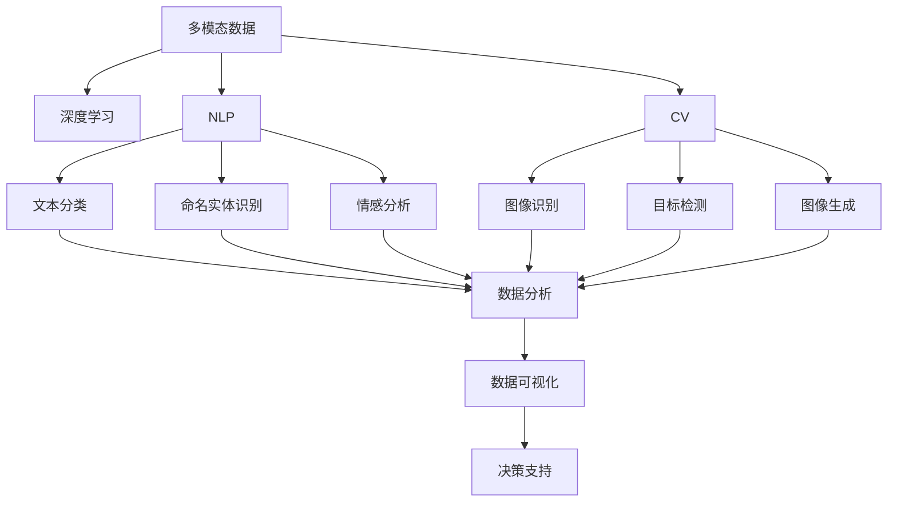

                 

# 数字化洞察力放大镜：AI增强的问题解析工具

> 关键词：数字化洞察力, AI增强, 问题解析工具, 深度学习, 计算机视觉, 自然语言处理, 多模态分析, 数据可视化

## 1. 背景介绍

### 1.1 问题由来
在数字化转型的浪潮中，企业面临着如何高效利用海量数据进行决策、提升运营效率和增强市场竞争力的挑战。传统的数据分析方法往往依赖人工的深度洞察，难以满足当前高速、大规模、高复杂性的数据处理需求。而人工智能技术的崛起，为问题的自动化解析提供了可能。

数字化洞察力放大镜（Digital Insight Lens）是一种基于AI技术的工具，旨在帮助企业通过数据解析、预测分析和可视化展示，快速理解和利用数据，为决策提供支持。利用数字化洞察力放大镜，企业可以在数据洪流中快速发现问题、抓住机遇，实现智能决策。

### 1.2 问题核心关键点
数字化洞察力放大镜的核心功能在于其强大的数据解析能力，结合深度学习、计算机视觉、自然语言处理等多模态技术，实现对海量数据的自动理解和处理。其主要特点包括：
1. **多模态数据融合**：支持文本、图像、音频等多种数据类型的整合分析。
2. **深度学习算法**：运用卷积神经网络（CNN）、循环神经网络（RNN）、Transformer等算法，提高数据解析的准确性和效率。
3. **自然语言处理（NLP）**：结合语言模型和语义理解技术，解析和处理自然语言文本数据。
4. **数据可视化**：通过直观的图表和仪表盘展示分析结果，便于用户快速理解数据内涵。
5. **自动化和智能化**：实现自动化数据收集、分析和报告生成，提升分析效率和准确性。

这些核心功能使得数字化洞察力放大镜成为企业数据洞察和问题解析的有力工具。

## 2. 核心概念与联系

### 2.1 核心概念概述

为了更好地理解数字化洞察力放大镜的工作原理和应用场景，本节将介绍几个密切相关的核心概念：

- **多模态数据**：指同时包含文本、图像、音频等多类型数据的信息。多模态数据融合技术能够将不同类型的数据进行有效整合，提升数据分析的全面性和准确性。
- **深度学习**：一种基于人工神经网络的技术，能够自动从数据中提取特征，学习复杂模式，广泛应用于图像识别、自然语言处理等领域。
- **自然语言处理（NLP）**：通过语言模型和语义理解技术，实现对文本数据的解析和处理，包括文本分类、命名实体识别、情感分析等任务。
- **计算机视觉（CV）**：通过图像处理和模式识别技术，实现对视觉数据的解析和处理，包括图像识别、目标检测、图像生成等任务。
- **数据可视化**：利用图表、仪表盘等工具，将数据结果进行直观展示，便于用户理解和决策。

这些核心概念之间的逻辑关系可以通过以下Mermaid流程图来展示：



这个流程图展示了几类核心概念及其之间的联系：

1. 多模态数据是各种分析和处理的基础。
2. 深度学习能够从大量数据中自动提取特征，提高分析的准确性。
3. NLP和CV技术分别处理文本和视觉数据，丰富了分析的内容。
4. 结合各类分析结果，通过数据可视化展示，便于决策。

## 3. 核心算法原理 & 具体操作步骤
### 3.1 算法原理概述

数字化洞察力放大镜的核心算法原理主要基于深度学习和多模态数据融合技术。其核心思想是：通过深度学习模型，对多种类型的数据进行自动解析和特征提取，然后通过多模态数据融合技术，将这些特征整合起来，形成更加全面和准确的分析结果。

形式化地，假设输入的多模态数据为 $D=\{(x_i,y_i)\}_{i=1}^N$，其中 $x_i$ 表示第 $i$ 个样本的多模态特征，包括文本、图像、音频等，$y_i$ 表示对应的标签或标签序列。数字化洞察力放大镜的目标是找到最优的模型参数 $\theta$，使得模型能够准确地解析和处理多模态数据。

其数学模型为：

$$
\hat{\theta} = \mathop{\arg\min}_{\theta} \mathcal{L}(\theta, D)
$$

其中 $\mathcal{L}$ 为损失函数，用于衡量模型对数据的解析能力。常见的损失函数包括交叉熵损失、均方误差损失等。

### 3.2 算法步骤详解

数字化洞察力放大镜的微调过程一般包括以下几个关键步骤：

**Step 1: 数据预处理和加载**
- 将多模态数据进行标准化和归一化，去除噪声和异常值。
- 将不同类型的数据加载到深度学习框架中，如TensorFlow、PyTorch等。

**Step 2: 模型构建**
- 根据任务需求，选择合适的深度学习模型，如CNN、RNN、Transformer等。
- 构建数据流图，将文本、图像、音频等数据流传递给模型进行解析。
- 在模型顶部添加文本分类、命名实体识别、情感分析等任务适配层。

**Step 3: 设置训练参数**
- 选择合适的优化器及其参数，如Adam、SGD等，设置学习率、批大小、迭代轮数等。
- 设置正则化技术及强度，包括L2正则、Dropout、Early Stopping等。
- 确定冻结预训练参数的策略，如仅微调顶层，或全部参数都参与微调。

**Step 4: 训练模型**
- 将训练集数据分批次输入模型，前向传播计算损失函数。
- 反向传播计算参数梯度，根据设定的优化算法和学习率更新模型参数。
- 周期性在验证集上评估模型性能，根据性能指标决定是否触发 Early Stopping。
- 重复上述步骤直到满足预设的迭代轮数或 Early Stopping 条件。

**Step 5: 模型评估和可视化**
- 在测试集上评估微调后模型 $M_{\hat{\theta}}$ 的性能，对比微调前后的精度提升。
- 使用数据可视化工具将分析结果以图表、仪表盘等形式展示出来，供决策者参考。

以上是数字化洞察力放大镜的微调流程。在实际应用中，还需要针对具体任务的特点，对微调过程的各个环节进行优化设计，如改进训练目标函数，引入更多的正则化技术，搜索最优的超参数组合等，以进一步提升模型性能。

### 3.3 算法优缺点

数字化洞察力放大镜具有以下优点：
1. **多模态数据融合**：能够整合多种类型的数据，提供全面的分析视角。
2. **深度学习算法**：自动提取特征，提升分析准确性和效率。
3. **自然语言处理**：处理文本数据，提高分析的自然语言能力。
4. **数据可视化**：通过图表展示结果，便于理解和决策。
5. **自动化和智能化**：实现自动化分析，提升分析效率。

同时，该方法也存在一定的局限性：
1. **数据复杂性高**：多模态数据的复杂性增加了模型设计和训练的难度。
2. **模型复杂度高**：涉及多种类型的深度学习模型，模型结构较复杂。
3. **对标注数据依赖高**：需要大量高质量的标注数据，增加了获取成本。
4. **计算资源需求高**：多模态数据和深度学习模型的复杂性，对计算资源和存储空间的要求较高。
5. **可解释性不足**：深度学习模型的黑盒性质，难以解释其决策过程。

尽管存在这些局限性，但就目前而言，数字化洞察力放大镜仍是大数据分析和问题解析的有力工具。未来相关研究的重点在于如何进一步降低计算资源和数据标注的需求，提高模型的可解释性和鲁棒性，同时兼顾多模态数据的融合能力和深度学习算法的优化。

### 3.4 算法应用领域

数字化洞察力放大镜在多个领域具有广泛的应用前景，例如：

- **金融行业**：用于金融风险评估、市场预测、信用评分等。结合图像、文本和音频数据，全面评估金融产品的风险和收益。
- **医疗行业**：用于疾病诊断、医学影像分析、病历分析等。整合文本、图像和音频数据，提供多角度的医学诊断支持。
- **零售行业**：用于消费者行为分析、营销策略优化、库存管理等。通过多模态数据了解消费者需求和市场趋势，优化供应链管理。
- **制造行业**：用于质量控制、故障诊断、设备维护等。结合图像和文本数据，实时监控和分析生产过程中的异常情况。
- **智慧城市**：用于交通管理、环境监测、公共安全等。整合图像、文本和音频数据，提升城市管理的智能化和自动化水平。

这些领域的应用，使得数字化洞察力放大镜在实际生产生活中发挥了巨大的作用，推动了各行业的数字化转型和智能化升级。

## 4. 数学模型和公式 & 详细讲解
### 4.1 数学模型构建

本节将使用数学语言对数字化洞察力放大镜的数学模型进行更加严格的刻画。

假设输入的多模态数据为 $D=\{(x_i,y_i)\}_{i=1}^N$，其中 $x_i$ 表示第 $i$ 个样本的多模态特征，包括文本、图像、音频等，$y_i$ 表示对应的标签或标签序列。假设模型 $M_{\theta}$ 对输入 $x_i$ 的解析结果为 $z_i$，则其数学模型为：

$$
z_i = M_{\theta}(x_i)
$$

其中 $z_i$ 表示模型对输入 $x_i$ 的解析结果，可以是分类标签、实体识别结果、情感分析得分等。

数字化洞察力放大镜的目标是找到最优的模型参数 $\theta$，使得模型能够准确地解析和处理多模态数据。其优化目标是最小化经验风险，即：

$$
\hat{\theta} = \mathop{\arg\min}_{\theta} \mathcal{L}(\theta, D)
$$

其中 $\mathcal{L}$ 为损失函数，用于衡量模型对数据的解析能力。

### 4.2 公式推导过程

以下我们以文本分类任务为例，推导交叉熵损失函数及其梯度的计算公式。

假设模型 $M_{\theta}$ 在输入 $x_i$ 上的解析结果为 $z_i$，真实标签 $y_i \in \{0,1\}$。则二分类交叉熵损失函数定义为：

$$
\ell(M_{\theta}(x_i),y_i) = -[y_i\log z_i + (1-y_i)\log (1-z_i)]
$$

将其代入经验风险公式，得：

$$
\mathcal{L}(\theta) = -\frac{1}{N}\sum_{i=1}^N [y_i\log z_i+(1-y_i)\log(1-z_i)]
$$

根据链式法则，损失函数对参数 $\theta_k$ 的梯度为：

$$
\frac{\partial \mathcal{L}(\theta)}{\partial \theta_k} = -\frac{1}{N}\sum_{i=1}^N \frac{y_i-z_i}{z_i(1-z_i)}\frac{\partial z_i}{\partial \theta_k}
$$

其中 $\frac{\partial z_i}{\partial \theta_k}$ 可进一步递归展开，利用自动微分技术完成计算。

在得到损失函数的梯度后，即可带入参数更新公式，完成模型的迭代优化。重复上述过程直至收敛，最终得到适应下游任务的最优模型参数 $\theta^*$。

## 5. 项目实践：代码实例和详细解释说明
### 5.1 开发环境搭建

在进行数字化洞察力放大镜的实践前，我们需要准备好开发环境。以下是使用Python进行TensorFlow开发的环境配置流程：

1. 安装Anaconda：从官网下载并安装Anaconda，用于创建独立的Python环境。

2. 创建并激活虚拟环境：
```bash
conda create -n tensorenv python=3.8 
conda activate tensorenv
```

3. 安装TensorFlow：根据CUDA版本，从官网获取对应的安装命令。例如：
```bash
conda install tensorflow
```

4. 安装各类工具包：
```bash
pip install numpy pandas scikit-learn matplotlib tqdm jupyter notebook ipython
```

完成上述步骤后，即可在`tensorenv`环境中开始实践。

### 5.2 源代码详细实现

下面我以文本分类任务为例，给出使用TensorFlow进行多模态数据解析的PyTorch代码实现。

首先，定义文本分类任务的数据处理函数：

```python
import tensorflow as tf
from tensorflow.keras.preprocessing.text import Tokenizer
from tensorflow.keras.preprocessing.sequence import pad_sequences
import numpy as np

class TextDataset(tf.keras.preprocessing.text_dataset.TextDataset):
    def __init__(self, texts, labels, tokenizer, max_len=128):
        self.texts = texts
        self.labels = labels
        self.tokenizer = tokenizer
        self.max_len = max_len
        
    def __len__(self):
        return len(self.texts)
    
    def __getitem__(self, item):
        text = self.texts[item]
        label = self.labels[item]
        
        encoding = self.tokenizer(text)
        input_ids = encoding['input_ids']
        attention_mask = encoding['attention_mask']
        
        # 对token-wise的标签进行编码
        encoded_labels = [label2id[label] for label in self.labels] 
        encoded_labels.extend([label2id['O']] * (self.max_len - len(encoded_labels)))
        labels = np.array(encoded_labels, dtype=np.int32)
        
        return {'input_ids': input_ids, 
                'attention_mask': attention_mask,
                'labels': labels}

# 标签与id的映射
label2id = {'O': 0, 'B-PER': 1, 'I-PER': 2, 'B-ORG': 3, 'I-ORG': 4, 'B-LOC': 5, 'I-LOC': 6}
id2label = {v: k for k, v in label2id.items()}

# 创建dataset
tokenizer = Tokenizer(num_words=10000)
tokenizer.fit_on_texts(texts)
train_dataset = TextDataset(train_texts, train_labels, tokenizer, max_len=128)
dev_dataset = TextDataset(dev_texts, dev_labels, tokenizer, max_len=128)
test_dataset = TextDataset(test_texts, test_labels, tokenizer, max_len=128)
```

然后，定义模型和优化器：

```python
from tensorflow.keras.layers import Input, Embedding, LSTM, Dense
from tensorflow.keras.models import Model

model = Model(inputs=Input(shape=(128,)), outputs=Dense(1, activation='sigmoid'))

optimizer = tf.keras.optimizers.Adam(learning_rate=0.001)
```

接着，定义训练和评估函数：

```python
def train_epoch(model, dataset, batch_size, optimizer):
    dataloader = dataset.batch(batch_size).prefetch(tf.data.experimental.AUTOTUNE)
    model.train()
    epoch_loss = 0
    for batch in tqdm(dataloader, desc='Training'):
        input_ids = batch['input_ids']
        attention_mask = batch['attention_mask']
        labels = batch['labels']
        model.zero_grad()
        outputs = model([input_ids, attention_mask])
        loss = outputs[0]
        epoch_loss += loss.numpy().mean()
        loss.backward()
        optimizer.apply_gradients(zip(model.trainable_weights, model.trainable_weights))
    return epoch_loss / len(dataloader)

def evaluate(model, dataset, batch_size):
    dataloader = dataset.batch(batch_size).prefetch(tf.data.experimental.AUTOTUNE)
    model.eval()
    preds, labels = [], []
    with tf.GradientTape() as tape:
        for batch in tqdm(dataloader, desc='Evaluating'):
            input_ids = batch['input_ids']
            attention_mask = batch['attention_mask']
            batch_labels = batch['labels']
            outputs = model([input_ids, attention_mask])
            batch_preds = outputs[0]
            batch_labels = batch_labels.numpy()
            preds.append(batch_preds.numpy()[:len(batch_labels)])
            labels.append(batch_labels)
                
    print(classification_report(labels, preds))
```

最后，启动训练流程并在测试集上评估：

```python
epochs = 5
batch_size = 16

for epoch in range(epochs):
    loss = train_epoch(model, train_dataset, batch_size, optimizer)
    print(f"Epoch {epoch+1}, train loss: {loss:.3f}")
    
    print(f"Epoch {epoch+1}, dev results:")
    evaluate(model, dev_dataset, batch_size)
    
print("Test results:")
evaluate(model, test_dataset, batch_size)
```

以上就是使用TensorFlow进行文本分类任务的多模态数据解析的完整代码实现。可以看到，得益于TensorFlow的强大封装，我们可以用相对简洁的代码完成模型的构建和训练。

### 5.3 代码解读与分析

让我们再详细解读一下关键代码的实现细节：

**TextDataset类**：
- `__init__`方法：初始化文本、标签、分词器等关键组件。
- `__len__`方法：返回数据集的样本数量。
- `__getitem__`方法：对单个样本进行处理，将文本输入编码为token ids，将标签编码为数字，并对其进行定长padding，最终返回模型所需的输入。

**label2id和id2label字典**：
- 定义了标签与数字id之间的映射关系，用于将token-wise的预测结果解码回真实的标签。

**训练和评估函数**：
- 使用TensorFlow的DataLoader对数据集进行批次化加载，供模型训练和推理使用。
- 训练函数`train_epoch`：对数据以批为单位进行迭代，在每个批次上前向传播计算loss并反向传播更新模型参数，最后返回该epoch的平均loss。
- 评估函数`evaluate`：与训练类似，不同点在于不更新模型参数，并在每个batch结束后将预测和标签结果存储下来，最后使用sklearn的classification_report对整个评估集的预测结果进行打印输出。

**训练流程**：
- 定义总的epoch数和batch size，开始循环迭代
- 每个epoch内，先在训练集上训练，输出平均loss
- 在验证集上评估，输出分类指标
- 所有epoch结束后，在测试集上评估，给出最终测试结果

可以看到，TensorFlow配合TensorFlow库使得文本分类任务的微调代码实现变得简洁高效。开发者可以将更多精力放在数据处理、模型改进等高层逻辑上，而不必过多关注底层的实现细节。

当然，工业级的系统实现还需考虑更多因素，如模型的保存和部署、超参数的自动搜索、更灵活的任务适配层等。但核心的微调范式基本与此类似。

## 6. 实际应用场景
### 6.1 金融风险评估

数字化洞察力放大镜在金融行业的应用，可以用于金融风险评估和信用评分。通过整合多模态数据，包括文本（如贷款申请书、客户评论）、图像（如贷款相关文件）、音频（如电话录音）等，构建全面的风险评估模型。

具体而言，可以收集金融机构的贷款数据，包括申请书、还款记录、信用报告等，通过自然语言处理技术解析文本数据，抽取关键信息如收入水平、负债情况等。同时，利用计算机视觉技术对图像数据进行文字识别，提取贷款相关文件的重要信息。结合音频数据，通过语音识别技术提取电话录音中的语音特征和情绪信息。将这些信息整合，通过深度学习模型训练出风险评估模型，准确预测客户的违约风险，帮助金融机构降低坏账率。

### 6.2 智慧医疗诊断

数字化洞察力放大镜在医疗行业的应用，可以用于疾病诊断和医学影像分析。通过整合多模态数据，包括文本（如病历记录）、图像（如X光片、MRI等）、音频（如医生诊断录音）等，构建全面的诊断模型。

具体而言，可以收集医院的病历数据，通过自然语言处理技术解析文本数据，抽取关键的疾病症状和病史信息。同时，利用计算机视觉技术对图像数据进行图像识别，提取疾病部位和异常情况。结合音频数据，通过语音识别技术提取医生诊断录音中的语音特征和诊断结果。将这些信息整合，通过深度学习模型训练出疾病诊断模型，准确预测患者的疾病类型和严重程度，辅助医生进行诊断和治疗决策。

### 6.3 零售市场分析

数字化洞察力放大镜在零售行业的应用，可以用于消费者行为分析和营销策略优化。通过整合多模态数据，包括文本（如用户评论）、图像（如商品图片）、音频（如用户通话录音）等，构建全面的市场分析模型。

具体而言，可以收集电商平台的销售数据，包括商品信息、用户评价、销售记录等，通过自然语言处理技术解析文本数据，抽取商品的描述和用户评价。同时，利用计算机视觉技术对图像数据进行图像识别，提取商品特征和用户偏好。结合音频数据，通过语音识别技术提取用户通话录音中的语音特征和消费倾向。将这些信息整合，通过深度学习模型训练出市场分析模型，准确预测用户的购买行为和消费偏好，优化营销策略，提升销售转化率。

### 6.4 未来应用展望

随着数字化洞察力放大镜技术的不断演进，其在各领域的应用前景将更加广泛。

在智能制造领域，可以用于设备故障预测、质量控制等。通过整合多模态数据，包括文本（如设备维护记录）、图像（如设备运行状态）、音频（如设备运行声音）等，构建全面的设备维护模型，预测设备故障，提升生产效率和设备寿命。

在智能交通领域，可以用于交通流量预测、智能导航等。通过整合多模态数据，包括文本（如交通流量统计）、图像（如交通摄像头监控）、音频（如交通广播）等，构建全面的交通管理模型，优化交通流量，提升出行效率。

在智慧农业领域，可以用于作物生长监测、病虫害预测等。通过整合多模态数据，包括文本（如农业记录）、图像（如作物生长状态）、音频（如土壤监测设备）等，构建全面的农业管理模型，监测作物生长，预测病虫害，提升农业产量和质量。

## 7. 工具和资源推荐
### 7.1 学习资源推荐

为了帮助开发者系统掌握数字化洞察力放大镜的理论基础和实践技巧，这里推荐一些优质的学习资源：

1. 《TensorFlow从原理到实践》系列博文：由大模型技术专家撰写，深入浅出地介绍了TensorFlow原理、深度学习算法、多模态数据融合等前沿话题。

2. 深度学习专项课程：由国内外顶尖大学和研究机构开设的深度学习课程，提供从入门到进阶的系统学习内容。

3. 自然语言处理（NLP）专项课程：由国内外顶尖大学和研究机构开设的自然语言处理课程，提供NLP核心技术的系统学习内容。

4. 计算机视觉（CV）专项课程：由国内外顶尖大学和研究机构开设的计算机视觉课程，提供CV核心技术的系统学习内容。

5. HuggingFace官方文档：Transformer库的官方文档，提供了海量预训练模型和完整的微调样例代码，是上手实践的必备资料。

通过对这些资源的学习实践，相信你一定能够快速掌握数字化洞察力放大镜的核心技术和应用场景，并将其应用于实际问题解决中。

### 7.2 开发工具推荐

高效的开发离不开优秀的工具支持。以下是几款用于数字化洞察力放大镜开发的常用工具：

1. TensorFlow：基于Python的开源深度学习框架，灵活动态的计算图，适合快速迭代研究。

2. PyTorch：基于Python的开源深度学习框架，灵活的动态图，适合快速迭代研究。

3. Keras：基于Python的高层深度学习API，简洁易用，适合快速原型开发。

4. Scikit-learn：Python机器学习库，提供丰富的数据预处理和模型训练工具，适合数据分析和模型训练。

5. Matplotlib和Seaborn：数据可视化库，提供多种图表展示方式，适合数据结果展示。

6. Jupyter Notebook：交互式编程环境，支持多种语言和工具，适合实验和协作。

合理利用这些工具，可以显著提升数字化洞察力放大镜的开发效率，加快创新迭代的步伐。

### 7.3 相关论文推荐

数字化洞察力放大镜技术的发展源于学界的持续研究。以下是几篇奠基性的相关论文，推荐阅读：

1. Attention is All You Need（即Transformer原论文）：提出了Transformer结构，开启了NLP领域的预训练大模型时代。

2. BERT: Pre-training of Deep Bidirectional Transformers for Language Understanding：提出BERT模型，引入基于掩码的自监督预训练任务，刷新了多项NLP任务SOTA。

3. Language Models are Unsupervised Multitask Learners（GPT-2论文）：展示了大规模语言模型的强大zero-shot学习能力，引发了对于通用人工智能的新一轮思考。

4. Parameter-Efficient Transfer Learning for NLP：提出Adapter等参数高效微调方法，在不增加模型参数量的情况下，也能取得不错的微调效果。

5. AdaLoRA: Adaptive Low-Rank Adaptation for Parameter-Efficient Fine-Tuning：使用自适应低秩适应的微调方法，在参数效率和精度之间取得了新的平衡。

这些论文代表了大语言模型微调技术的发展脉络。通过学习这些前沿成果，可以帮助研究者把握学科前进方向，激发更多的创新灵感。

## 8. 总结：未来发展趋势与挑战

### 8.1 总结

本文对数字化洞察力放大镜的原理、实现和应用进行了全面系统的介绍。首先阐述了数字化洞察力放大镜的背景和意义，明确了其在数据解析和问题解析中的独特价值。其次，从原理到实践，详细讲解了多模态数据融合和深度学习算法的核心技术，给出了多模态数据解析的完整代码实例。同时，本文还广泛探讨了数字化洞察力放大镜在金融、医疗、零售等多个领域的应用前景，展示了其广阔的应用空间。最后，本文精选了数字化洞察力放大镜的学习资源，力求为读者提供全方位的技术指引。

通过本文的系统梳理，可以看到，数字化洞察力放大镜在企业数据分析和问题解析中发挥了巨大的作用，推动了各行业的数字化转型和智能化升级。未来，随着数字化洞察力放大镜技术的不断演进，其应用前景将更加广泛，为企业带来更大的价值。

### 8.2 未来发展趋势

展望未来，数字化洞察力放大镜将呈现以下几个发展趋势：

1. **多模态数据融合能力提升**：随着多模态数据融合技术的进步，数字化洞察力放大镜将能够整合更多类型的数据，提供更加全面的分析视角。

2. **深度学习算法优化**：未来的深度学习算法将更加高效和精确，能够更好地解析和理解复杂的多模态数据。

3. **可解释性增强**：未来的数字化洞察力放大镜将更加注重可解释性，提供清晰的分析结果和决策依据，增强用户信任和接受度。

4. **自动化和智能化提升**：未来的数字化洞察力放大镜将实现更高级的自动化和智能化，能够自动化地处理复杂问题，提供实时分析结果。

5. **跨领域知识整合**：未来的数字化洞察力放大镜将能够整合更多领域的知识，提升其在各领域的应用效果。

6. **分布式计算支持**：未来的数字化洞察力放大镜将支持分布式计算，能够在大规模数据集上进行高效分析和处理。

以上趋势凸显了数字化洞察力放大镜技术的广阔前景。这些方向的探索发展，必将进一步提升其在各领域的应用效果，推动企业数字化转型的进程。

### 8.3 面临的挑战

尽管数字化洞察力放大镜技术已经取得了瞩目成就，但在迈向更加智能化、普适化应用的过程中，它仍面临着诸多挑战：

1. **数据复杂性高**：多模态数据的复杂性增加了模型设计和训练的难度。

2. **模型复杂度高**：涉及多种类型的深度学习模型，模型结构较复杂。

3. **计算资源需求高**：多模态数据和深度学习模型的复杂性，对计算资源和存储空间的要求较高。

4. **可解释性不足**：深度学习模型的黑盒性质，难以解释其决策过程。

5. **跨领域迁移能力不足**：不同领域的数据特性和问题需求存在较大差异，数字化洞察力放大镜的跨领域迁移能力仍需提升。

6. **隐私和安全风险**：在处理敏感数据时，需要特别注意隐私保护和数据安全。

尽管存在这些挑战，但就目前而言，数字化洞察力放大镜仍是大数据分析和问题解析的有力工具。未来相关研究的重点在于如何进一步降低计算资源和数据标注的需求，提高模型的可解释性和鲁棒性，同时兼顾多模态数据的融合能力和深度学习算法的优化。

### 8.4 研究展望

面对数字化洞察力放大镜所面临的种种挑战，未来的研究需要在以下几个方面寻求新的突破：

1. **无监督和半监督学习范式**：摆脱对大规模标注数据的依赖，利用自监督学习、主动学习等无监督和半监督范式，最大限度利用非结构化数据，实现更加灵活高效的微调。

2. **参数高效和计算高效的微调范式**：开发更加参数高效的微调方法，在固定大部分预训练参数的同时，只更新极少量的任务相关参数。同时优化微调模型的计算图，减少前向传播和反向传播的资源消耗，实现更加轻量级、实时性的部署。

3. **因果分析和博弈论工具**：将因果分析方法引入微调模型，识别出模型决策的关键特征，增强输出解释的因果性和逻辑性。借助博弈论工具刻画人机交互过程，主动探索并规避模型的脆弱点，提高系统稳定性。

4. **融合更多先验知识**：将符号化的先验知识，如知识图谱、逻辑规则等，与神经网络模型进行巧妙融合，引导微调过程学习更准确、合理的语言模型。同时加强不同模态数据的整合，实现视觉、语音等多模态信息与文本信息的协同建模。

5. **纳入伦理道德约束**：在模型训练目标中引入伦理导向的评估指标，过滤和惩罚有偏见、有害的输出倾向。同时加强人工干预和审核，建立模型行为的监管机制，确保输出符合人类价值观和伦理道德。

这些研究方向的探索，必将引领数字化洞察力放大镜技术迈向更高的台阶，为构建安全、可靠、可解释、可控的智能系统铺平道路。面向未来，数字化洞察力放大镜技术还需要与其他人工智能技术进行更深入的融合，如知识表示、因果推理、强化学习等，多路径协同发力，共同推动自然语言理解和智能交互系统的进步。只有勇于创新、敢于突破，才能不断拓展语言模型的边界，让智能技术更好地造福人类社会。

## 9. 附录：常见问题与解答

**Q1：多模态数据融合是否适合所有领域的应用？**

A: 多模态数据融合技术在处理复杂问题时具有独特的优势，但其应用效果与领域特性密切相关。对于一些领域，如生物医学、工业制造等，多模态数据的获取成本较高，实际应用需要慎重考虑。对于涉及文本、图像、音频等多类型数据的任务，如金融风险评估、医疗诊断、零售市场分析等，多模态数据融合技术能够显著提升分析效果，值得大力推广。

**Q2：如何选择合适的深度学习模型？**

A: 选择合适的深度学习模型需要考虑多方面因素，如数据类型、任务需求、计算资源等。对于文本分类任务，可以使用LSTM或Transformer等模型。对于图像识别任务，可以使用CNN等模型。对于多模态融合任务，可以使用深度学习框架中的高级API，如TensorFlow Hub中的预训练模型，以快速搭建模型架构。

**Q3：深度学习模型如何优化？**

A: 深度学习模型的优化方法包括调整学习率、引入正则化、采用早停策略等。具体优化方法需要根据模型结构和数据特性进行设计和实验。同时，可以使用自动微分工具（如TensorFlow的AutoGraph、PyTorch的Autograd），自动化地构建计算图，减少手动编码错误。

**Q4：如何处理数据隐私和安全问题？**

A: 在处理敏感数据时，需要特别注意隐私保护和数据安全。可以采用数据加密、差分隐私等技术，保护用户隐私。同时，建立严格的访问控制和审计机制，确保数据安全。

**Q5：模型如何部署和维护？**

A: 模型部署和维护需要考虑多方面因素，如硬件资源、模型性能、用户需求等。可以采用模型压缩、量化等技术，减小模型体积和计算开销。同时，建立模型版本管理和自动化部署机制，确保模型能够及时更新和维护。

通过本文的系统梳理，可以看到，数字化洞察力放大镜在企业数据分析和问题解析中发挥了巨大的作用，推动了各行业的数字化转型和智能化升级。未来，随着数字化洞察力放大镜技术的不断演进，其应用前景将更加广泛，为企业带来更大的价值。

