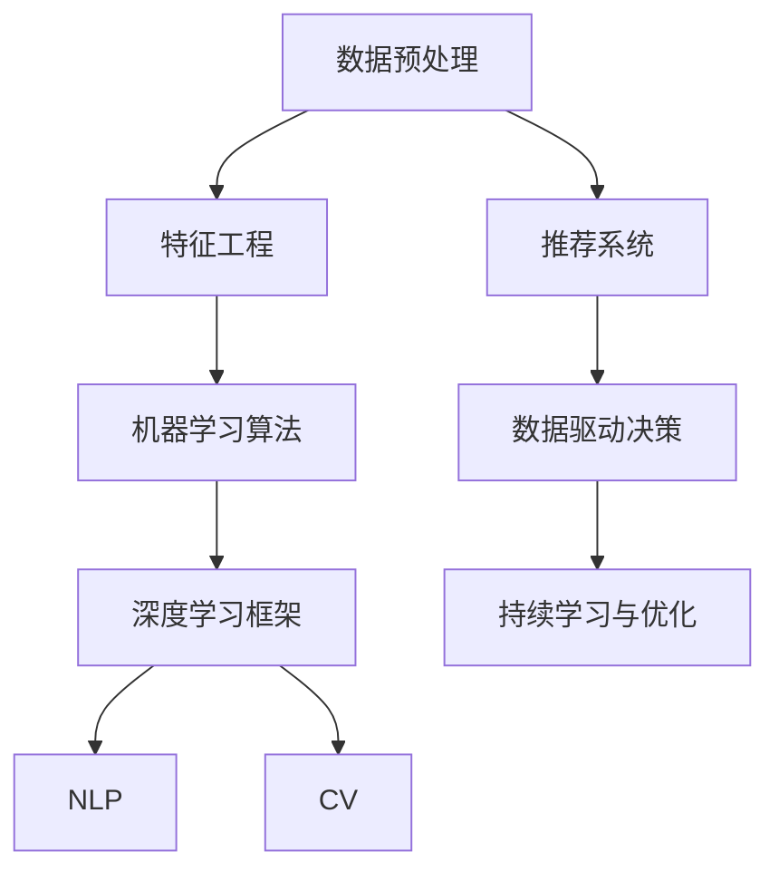

                 

# 数字化直觉培养：AI强化的第六感能力

## 1. 背景介绍

### 1.1 问题由来

在当今信息爆炸、数据纷繁复杂的时代，如何从海量数据中迅速获取有价值的信息，做出准确判断，已成为企业和个人关注的重点。传统的直觉和经验虽然积累丰富，但在数据量巨大的情况下，往往显得力不从心。人工智能（AI）的崛起为处理数据提供了新的途径，而数字化直觉培养，即通过AI技术强化个体的数据处理和决策能力，成为数字化时代的新需求。

### 1.2 问题核心关键点

数字化直觉的培养，本质上是将AI技术应用于数据处理和决策过程中，以提升个体或团队的直觉能力。其关键点在于：
- **数据理解与分析**：通过AI模型分析复杂数据，提取关键信息。
- **模式识别与预测**：利用机器学习算法，识别数据中的模式和趋势，进行预测。
- **决策支持与优化**：基于分析结果，辅助决策，优化决策过程。
- **持续学习与进化**：通过不断的反馈和调整，增强模型的准确性和适应性。

### 1.3 问题研究意义

数字化直觉的培养，有助于在面对复杂多变的数据环境中，快速准确地做出决策，提升个人和组织的竞争力。具体意义包括：
- **提升效率**：自动化数据处理和分析过程，节省时间和人力成本。
- **增强决策质量**：基于客观数据分析进行决策，减少主观偏见。
- **促进创新**：通过数据驱动的决策，促进企业创新和转型。
- **保障安全**：通过AI监控和预警，预防潜在的风险。
- **推动数字化转型**：AI技术成为数字化转型的重要工具，助力传统行业升级。

## 2. 核心概念与联系

### 2.1 核心概念概述

数字化直觉培养涉及多个关键概念，包括但不限于：
- **数据预处理**：对原始数据进行清洗、特征工程、标准化等操作。
- **机器学习算法**：包括监督学习、无监督学习、强化学习等，用于数据建模和分析。
- **深度学习框架**：如TensorFlow、PyTorch，提供高效的数据处理和模型训练功能。
- **自然语言处理（NLP）**：使AI能够处理和理解文本数据，包括语义分析和情感分析等。
- **计算机视觉（CV）**：使AI能够处理和分析图像和视频数据，包括目标检测、图像分类等。
- **推荐系统**：基于用户行为和物品特征，提供个性化的推荐服务。

这些概念之间相互联系，共同构成了数字化直觉培养的技术体系。通过综合应用这些技术，可以实现高效的数据处理和精准的决策支持。

### 2.2 核心概念原理和架构的 Mermaid 流程图



这个流程图展示了数字化直觉培养的关键技术路径，从数据预处理到深度学习框架，再到具体的应用技术（NLP和CV），最后实现数据驱动的决策与优化。

## 3. 核心算法原理 & 具体操作步骤

### 3.1 算法原理概述

数字化直觉培养的算法原理主要基于以下几个方面：
- **监督学习**：通过带有标签的数据集训练模型，进行分类、回归等任务。
- **无监督学习**：从无标签数据中学习数据特征和结构，进行聚类、降维等任务。
- **强化学习**：通过与环境的交互，学习最优策略，进行序列决策等任务。
- **迁移学习**：将已有领域的知识迁移到新领域，提高新任务的性能。
- **自适应学习**：模型能够根据新数据和新任务动态调整，增强适应性。

这些算法原理共同构成了数字化直觉培养的核心技术框架，通过综合应用，可以实现高效的数据分析和精准的决策支持。

### 3.2 算法步骤详解

数字化直觉培养的具体操作包括以下几个关键步骤：
1. **数据获取与清洗**：从不同渠道获取数据，并进行清洗、去重、标准化等预处理。
2. **特征提取与选择**：对原始数据进行特征工程，提取有意义的特征，并进行特征选择。
3. **模型选择与训练**：选择合适的机器学习算法和深度学习框架，对数据进行建模和训练。
4. **模型评估与优化**：使用验证集和测试集评估模型性能，并进行参数调优和模型优化。
5. **应用部署与监控**：将训练好的模型部署到实际应用中，并进行持续监控和优化。
6. **反馈与迭代**：根据实际应用中的反馈，不断调整模型和算法，提升数字化直觉能力。

### 3.3 算法优缺点

数字化直觉培养的算法具有以下优点：
- **高效性**：自动化数据处理和分析过程，大大提升效率。
- **精准性**：基于数据驱动的决策，减少主观偏见，提高决策质量。
- **可扩展性**：适用于各种规模的数据处理和决策支持任务。
- **灵活性**：可以灵活应用于不同领域和场景，如金融、医疗、零售等。

同时，也存在以下缺点：
- **数据依赖**：依赖高质量、大样本的数据集，数据获取和预处理成本高。
- **模型复杂性**：构建和训练复杂模型需要较强的技术背景和计算资源。
- **结果解释性**：部分AI模型如深度学习模型，其决策过程难以解释，影响决策信任度。
- **过拟合风险**：在训练过程中可能出现模型过拟合，影响泛化性能。

### 3.4 算法应用领域

数字化直觉培养在多个领域都有广泛应用，包括但不限于：
- **金融**：通过分析市场数据，预测股票走势，进行投资决策。
- **医疗**：通过分析患者数据，预测疾病风险，制定个性化治疗方案。
- **零售**：通过分析消费者行为，推荐商品，提升销售业绩。
- **物流**：通过分析运输数据，优化路线和配送策略。
- **安全**：通过分析异常行为数据，预防安全威胁。

## 4. 数学模型和公式 & 详细讲解 & 举例说明

### 4.1 数学模型构建

数字化直觉培养的数学模型构建通常包括以下几个步骤：
- **数据表示**：将原始数据表示为向量或张量形式，以便于模型处理。
- **损失函数定义**：定义模型预测结果与真实标签之间的损失函数，如均方误差、交叉熵等。
- **优化目标**：最小化损失函数，优化模型参数。
- **模型评估**：使用验证集和测试集评估模型性能，计算准确率、召回率、F1值等指标。

### 4.2 公式推导过程

以二分类任务为例，假设模型为 $M_{\theta}$，输入为 $x$，输出为 $y$，模型参数为 $\theta$。其目标是最小化交叉熵损失函数：

$$
\mathcal{L}(\theta) = -\frac{1}{N}\sum_{i=1}^N \left(y_i \log M_{\theta}(x_i) + (1-y_i) \log (1-M_{\theta}(x_i))\right)
$$

其中 $y_i$ 为真实标签，$M_{\theta}(x_i)$ 为模型预测结果。通过梯度下降等优化算法，最小化损失函数，更新模型参数 $\theta$：

$$
\theta \leftarrow \theta - \eta \nabla_{\theta}\mathcal{L}(\theta)
$$

其中 $\eta$ 为学习率，$\nabla_{\theta}\mathcal{L}(\theta)$ 为损失函数对模型参数的梯度。

### 4.3 案例分析与讲解

假设某电商平台希望通过数字化直觉培养提升个性化推荐系统的效果。首先，从用户行为数据（如浏览、点击、购买记录）中提取特征，构建用户和商品的向量表示。然后，选择合适的机器学习算法（如协同过滤、深度学习等），构建推荐模型。通过训练集数据进行模型训练，使用验证集评估模型性能，并进行参数调优。最后，将优化后的模型部署到实际应用中，根据用户实时行为数据生成推荐结果。

## 5. 项目实践：代码实例和详细解释说明

### 5.1 开发环境搭建

为了实现数字化直觉培养项目，需要搭建一个高效的开发环境。以下是一个基于Python的示例：

1. 安装Python 3.8及以上版本。
2. 安装Anaconda，创建虚拟环境。
3. 安装深度学习框架TensorFlow或PyTorch。
4. 安装其他相关库，如Pandas、NumPy、Scikit-Learn等。
5. 使用Jupyter Notebook或PyCharm进行开发。

### 5.2 源代码详细实现

以下是一个基于TensorFlow的推荐系统代码示例，用于实现数字化直觉培养的推荐功能：

```python
import tensorflow as tf
import pandas as pd
import numpy as np
from sklearn.model_selection import train_test_split

# 数据预处理
def preprocess_data(data_path):
    df = pd.read_csv(data_path)
    # 数据清洗和特征提取
    # ...
    # 构建用户和商品向量表示
    user_vectors = ...
    item_vectors = ...
    return user_vectors, item_vectors

# 模型构建
class RecommendationModel(tf.keras.Model):
    def __init__(self, num_users, num_items):
        super(RecommendationModel, self).__init__()
        self.user_embeddings = tf.keras.layers.Embedding(num_users, 32)
        self.item_embeddings = tf.keras.layers.Embedding(num_items, 32)
        self.dot_product = tf.keras.layers.Dot(axes=1, normalize=True, use_norm=True)
        
    def call(self, user_vector, item_vector):
        user_embeddings = self.user_embeddings(user_vector)
        item_embeddings = self.item_embeddings(item_vector)
        scores = self.dot_product([user_embeddings, item_embeddings])
        return scores

# 模型训练
def train_model(model, user_vectors, item_vectors, batch_size=64, epochs=10):
    # 划分训练集和验证集
    train_data, val_data = train_test_split((user_vectors, item_vectors), test_size=0.2)
    train_user_vectors, val_user_vectors = train_data
    train_item_vectors, val_item_vectors = val_data
    
    # 定义损失函数和优化器
    loss_fn = tf.keras.losses.mean_squared_error
    optimizer = tf.keras.optimizers.Adam(learning_rate=0.001)
    
    # 训练模型
    for epoch in range(epochs):
        train_loss = 0.0
        for user_vector, item_vector in train_user_vectors:
            with tf.GradientTape() as tape:
                scores = model(user_vector, item_vector)
                loss = loss_fn(tf.reshape(scores, [-1]), labels)
            gradients = tape.gradient(loss, model.trainable_variables)
            optimizer.apply_gradients(zip(gradients, model.trainable_variables))
            train_loss += loss
        val_loss = calculate_loss(val_user_vectors, val_item_vectors, model)
        print(f"Epoch {epoch+1}, Train Loss: {train_loss/len(train_user_vectors)}, Val Loss: {val_loss}")
        
# 模型评估
def calculate_loss(user_vectors, item_vectors, model):
    scores = model(user_vectors, item_vectors)
    return tf.reduce_mean(tf.square(scores - labels))

# 主函数
if __name__ == "__main__":
    user_vectors, item_vectors = preprocess_data('data.csv')
    model = RecommendationModel(len(user_vectors), len(item_vectors))
    train_model(model, user_vectors, item_vectors)
```

### 5.3 代码解读与分析

上述代码实现了基于用户和商品向量表示的推荐系统。关键步骤如下：
1. **数据预处理**：从数据集中提取用户和商品的特征向量。
2. **模型构建**：使用TensorFlow构建推荐模型，包含用户嵌入层和商品嵌入层，以及点积层。
3. **模型训练**：通过交叉熵损失函数和Adam优化器进行模型训练。
4. **模型评估**：计算验证集上的损失函数，评估模型性能。

## 6. 实际应用场景

### 6.1 智能投顾系统

在金融领域，数字化直觉培养可以用于构建智能投顾系统，通过分析市场数据和用户行为，提供个性化的投资建议。智能投顾系统能够实时监控市场动态，预测股票走势，帮助用户制定最优投资策略，提升投资回报率。

### 6.2 医疗诊断系统

数字化直觉培养在医疗领域也有广泛应用，通过分析患者数据和医学文献，提供个性化的诊断和治疗方案。系统能够实时监测患者的健康状况，预测疾病风险，辅助医生制定治疗计划，提升诊疗效果。

### 6.3 零售推荐系统

零售业通过数字化直觉培养，可以构建更精准的推荐系统，提升用户满意度和销售额。通过分析用户行为和商品特征，系统能够实时推荐符合用户偏好的商品，提供个性化的购物体验，增加用户粘性和消费频次。

### 6.4 未来应用展望

未来，数字化直觉培养将进一步拓展其应用场景，推动更多行业数字化转型。以下是几个未来应用展望：
- **智能城市**：通过分析城市数据，优化交通流量、能源消耗，提升城市管理效率。
- **智慧农业**：通过分析农作物数据，优化种植方案，提高农业生产效率和产量。
- **智能制造**：通过分析生产数据，优化生产流程，提升产品质量和生产效率。
- **智能教育**：通过分析学生学习数据，提供个性化学习建议，提升教育效果。

## 7. 工具和资源推荐

### 7.1 学习资源推荐

为了系统掌握数字化直觉培养技术，以下是一些推荐的资源：
- **《Python深度学习》**：介绍深度学习的基本概念和实践，适合初学者入门。
- **Coursera《机器学习》**：斯坦福大学的机器学习课程，提供系统的理论知识。
- **Kaggle竞赛**：通过参加机器学习竞赛，实践和提升数据处理和建模能力。
- **GitHub**：大量开源项目和代码，可以学习和参考。

### 7.2 开发工具推荐

为了高效开发数字化直觉培养项目，以下是一些推荐的工具：
- **TensorFlow**：谷歌开源的深度学习框架，功能强大，易于使用。
- **PyTorch**：Facebook开源的深度学习框架，灵活性高，学术界使用广泛。
- **Jupyter Notebook**：交互式编程环境，便于编写和调试代码。
- **PyCharm**：Python IDE，提供丰富的开发工具和调试功能。

### 7.3 相关论文推荐

数字化直觉培养技术的研究始于学术界，以下是一些经典的论文：
- **《Deep Learning》**：Goodfellow等人的经典著作，系统介绍深度学习理论和实践。
- **《Pattern Recognition and Machine Learning》**：Christopher Bishop的机器学习教材，涵盖广泛的机器学习算法。
- **《Neural Networks and Deep Learning》**：Michael Nielsen的深度学习教材，深入浅出地介绍深度学习原理。

## 8. 总结：未来发展趋势与挑战

### 8.1 研究成果总结

数字化直觉培养技术在金融、医疗、零售等多个领域取得了显著成果，提升了决策效率和准确性，推动了数字化转型。主要研究成果包括：
- **高效的数据处理**：通过自动化数据清洗和特征提取，大幅提升数据处理效率。
- **精准的决策支持**：基于数据驱动的决策，减少主观偏见，提升决策质量。
- **动态的模型优化**：通过持续学习，模型能够适应新数据和新任务，提高适应性。

### 8.2 未来发展趋势

未来，数字化直觉培养技术将呈现以下几个发展趋势：
- **模型智能化**：更加智能化和自适应化的模型，能够更好地应对复杂多变的数据环境。
- **跨领域融合**：与其他AI技术如自然语言处理、计算机视觉等结合，实现更全面、准确的数据处理和决策支持。
- **多模态分析**：融合多种数据模态，提高数据处理能力和决策准确性。
- **伦理与隐私**：更加注重数据隐私和伦理，确保数字化决策的公平性和安全性。

### 8.3 面临的挑战

尽管数字化直觉培养技术取得了显著成果，但在实际应用中仍面临一些挑战：
- **数据隐私**：在处理敏感数据时，如何确保数据隐私和安全。
- **模型可解释性**：部分模型如深度学习模型，其决策过程难以解释，影响决策信任度。
- **跨领域适用性**：不同领域的特征和需求差异较大，模型的通用性有待提升。
- **模型鲁棒性**：在面对异常数据和噪声时，模型的鲁棒性有待增强。
- **计算资源**：大规模数据处理和模型训练需要高计算资源，如何优化计算效率是一个重要问题。

### 8.4 研究展望

未来，数字化直觉培养技术需要在以下几个方面进行深入研究：
- **数据隐私保护**：探索隐私保护技术，如差分隐私、联邦学习等，确保数据隐私和安全。
- **模型可解释性**：开发可解释的模型，增强决策透明度和信任度。
- **跨领域适应性**：开发具有通用性的模型，能够适应不同领域的特征和需求。
- **模型鲁棒性**：通过引入鲁棒性优化技术，增强模型对异常数据和噪声的抵抗能力。
- **计算效率**：探索模型压缩、分布式计算等技术，提高模型训练和推理效率。

## 9. 附录：常见问题与解答

### Q1: 如何提升数字化直觉培养的效率？

A: 提升效率的关键在于数据预处理和特征工程的优化。以下是一些具体措施：
- **数据清洗**：去除噪声和异常值，确保数据质量。
- **特征选择**：选择有意义的特征，减少模型复杂度。
- **模型压缩**：使用模型压缩技术，减少模型参数量，提高计算效率。
- **分布式计算**：使用分布式计算框架，如Spark，提高模型训练效率。

### Q2: 如何提升数字化直觉培养的准确性？

A: 提升准确性的关键在于模型选择和优化。以下是一些具体措施：
- **选择合适的模型**：根据任务特点选择合适的模型，如深度学习、决策树等。
- **模型调优**：通过交叉验证和超参数调整，优化模型参数。
- **数据增强**：通过数据增强技术，增加训练样本数量，提高模型泛化能力。
- **对抗训练**：使用对抗样本训练模型，增强模型鲁棒性。

### Q3: 如何保证数字化直觉培养的公平性和安全性？

A: 保证公平性和安全性的关键在于数据处理和模型训练的规范。以下是一些具体措施：
- **数据公平性**：确保训练数据的多样性和代表性，避免数据偏见。
- **模型透明性**：使用可解释的模型，增强决策透明度。
- **隐私保护**：采用隐私保护技术，如差分隐私、联邦学习等，确保数据隐私。
- **安全审计**：定期进行安全审计，发现并修复潜在的安全漏洞。

### Q4: 如何处理大规模数据？

A: 处理大规模数据的关键在于分布式计算和模型压缩。以下是一些具体措施：
- **分布式计算**：使用分布式计算框架，如Spark、Hadoop等，提高数据处理效率。
- **模型压缩**：使用模型压缩技术，如剪枝、量化等，减少模型参数量，提高计算效率。
- **增量学习**：通过增量学习技术，逐步更新模型，减少计算资源消耗。

### Q5: 如何保证数字化直觉培养的可解释性？

A: 保证可解释性的关键在于选择可解释的模型和增强决策过程的可理解性。以下是一些具体措施：
- **选择可解释的模型**：使用规则模型、线性模型等可解释性强的模型。
- **决策过程可视化**：使用可视化工具，如TensorBoard，展示模型的决策过程。
- **用户友好设计**：设计易于理解的输出格式和解释文本，增强用户体验。

通过不断探索和实践，数字化直觉培养技术将在更多领域展现其价值，推动数字化转型的深入发展。

