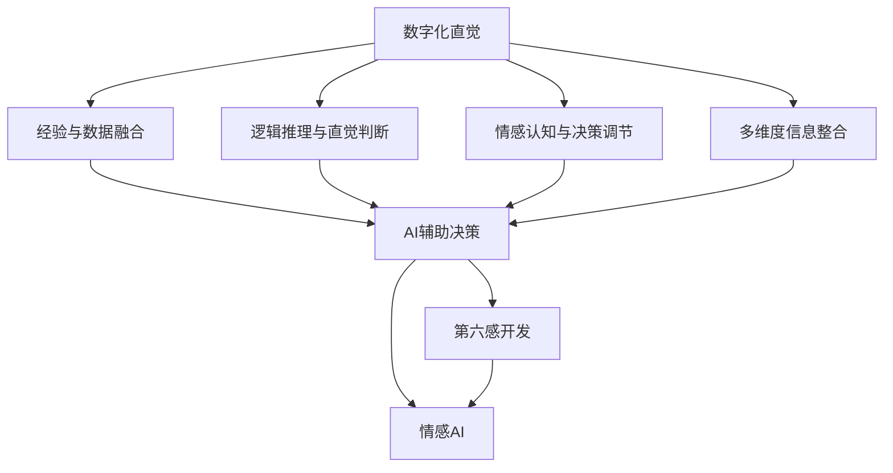

                 

# 数字化直觉增强：AI辅助的第六感开发

在智能时代，人们越来越依赖数据驱动的决策，但是过度的依赖数据往往导致决策的机械性和局限性。数字化直觉，即基于经验、逻辑、情感的综合判断，是对数据驱动决策的重要补充。数字化直觉的开发，尤其是在AI辅助下的第六感开发，将成为提升决策效率、提升竞争力的重要手段。本文将详细探讨数字化直觉增强的核心概念、原理、步骤以及实际应用场景，并提出相关工具和资源推荐。

## 1. 背景介绍

### 1.1 问题由来

在数字化时代，数据驱动决策成为主流。然而，过度依赖数据往往导致决策机械化、片面化，无法充分考虑人类经验、情感等因素，使得决策的准确性和有效性大打折扣。如何发挥人类直觉在决策中的优势，与AI数据驱动相辅相成，成为现代决策支持系统的重要课题。

数字化直觉，即基于经验、逻辑、情感的综合判断，是一种非机械、非线性的决策方式，能够提高决策的全面性和灵活性。数字化直觉的开发，特别是在AI技术的辅助下，可以大大提升决策的准确性和效率，成为智能决策系统的重要补充。

### 1.2 问题核心关键点

数字化直觉的开发，主要关注以下几个核心关键点：

- **经验与数据融合**：如何在经验基础上合理利用数据，增强决策的科学性。
- **逻辑推理与直觉判断**：如何结合逻辑推理和直觉判断，实现全面、灵活的决策。
- **情感认知与决策调节**：如何考虑情感因素，增强决策的灵活性和人性化。
- **多维度信息整合**：如何将数据、经验、情感等多维度信息有机整合，形成综合判断。

## 2. 核心概念与联系

### 2.1 核心概念概述

为更好地理解数字化直觉增强的核心概念，本节将介绍几个关键概念及其相互联系：

- **数字化直觉**：基于经验、逻辑、情感的综合判断，是数据驱动决策的重要补充。
- **AI辅助决策**：通过AI技术辅助决策过程，提升决策的全面性和科学性。
- **第六感开发**：通过数字化直觉的开发，赋予决策者超越数据驱动的直觉能力，形成更高维度的决策思维。
- **情感AI**：结合情感计算和AI技术，增强决策的人性化和情感认知能力。
- **多模态信息融合**：将数据、情感、经验等多模态信息融合，形成更全面、准确的综合判断。
- **可解释AI**：通过可解释性技术，提升AI决策的可理解性和透明性。

这些核心概念之间的逻辑关系可以通过以下Mermaid流程图来展示：



这个流程图展示了大数字化直觉的开发过程，从经验与数据融合开始，经过逻辑推理与直觉判断、情感认知与决策调节，到多维度信息整合，最终形成第六感开发的过程，并结合情感AI技术，提升决策的人性化水平。

## 3. 核心算法原理 & 具体操作步骤

### 3.1 算法原理概述

数字化直觉增强的核心算法原理，主要基于经验、逻辑、情感的融合与计算。其核心思想是：将经验、逻辑、情感等非量化信息转化为可计算的量化信息，并通过AI技术进行综合判断，最终形成决策支持。

形式化地，假设经验、逻辑、情感等非量化信息表示为 $X$，决策目标为 $Y$，则数字化直觉增强的过程可以表示为：

$$
Y = f(X)
$$

其中 $f$ 为融合计算函数，可以表示为：

$$
f = g(x_1, x_2, ..., x_n)
$$

其中 $x_i$ 表示第 $i$ 个维度（如经验、逻辑、情感）的特征，$g$ 为融合计算方法。

### 3.2 算法步骤详解

数字化直觉增强的算法步骤主要包括：

**Step 1: 数据收集与预处理**
- 收集与决策相关的经验、逻辑、情感等非量化信息，并进行清洗和标准化处理。
- 收集相关数据作为决策依据，并进行数据清洗、特征提取等预处理。

**Step 2: 特征提取与编码**
- 将非量化信息转化为可计算的数值特征，如使用情感词典进行情感编码，使用逻辑规则进行逻辑推理。
- 将特征向量输入AI模型进行计算。

**Step 3: 融合计算**
- 使用融合函数 $f$ 对多个特征进行计算，形成综合决策信号。
- 融合方法可以包括加权平均、线性回归、神经网络等。

**Step 4: 模型训练与优化**
- 训练AI模型，使其能够学习经验、逻辑、情感等多维度信息的综合判断能力。
- 使用损失函数和优化算法（如Adam、SGD等）进行模型训练，并根据实际效果进行调参和优化。

**Step 5: 决策支持**
- 将训练好的AI模型应用于实际决策过程中，结合数字化直觉，提升决策的全面性和科学性。
- 在决策过程中，可以采用交互式界面，展示多维度信息的融合结果，增强决策的透明性和可理解性。

### 3.3 算法优缺点

数字化直觉增强算法具有以下优点：

- **全面性与灵活性**：结合经验、逻辑、情感等多维度信息，形成全面、灵活的决策。
- **科学性与透明性**：通过AI技术辅助决策，提升决策的科学性和透明性。
- **人性化与可解释性**：考虑情感因素，增强决策的人性化和可解释性。
- **高效性与适应性**：通过自动化融合计算，提升决策效率，并能够快速适应新情况。

同时，该算法也存在一定的局限性：

- **数据依赖性强**：需要大量高质量的数据作为决策依据，数据质量影响决策效果。
- **模型复杂度较高**：需要复杂的多维度信息融合方法，模型复杂度高，训练成本大。
- **可解释性不足**：AI模型的决策过程难以解释，决策透明度不高。
- **情感计算误差**：情感计算的准确性受限于情感词典等工具，可能存在误差。

尽管存在这些局限性，但数字化直觉增强算法仍然是大数据时代决策支持系统的重要手段，尤其在复杂、不确定性较高的决策场景中，具有重要应用价值。

### 3.4 算法应用领域

数字化直觉增强算法在多个领域都有广泛应用：

- **金融投资**：结合市场数据、历史经验、情感分析，形成更全面、科学的投资决策。
- **医疗健康**：结合病例数据、医生经验、患者情感，形成更个性化、全面的治疗方案。
- **市场营销**：结合市场数据、品牌形象、消费者情感，形成更精准、灵活的市场营销策略。
- **公共管理**：结合政策数据、社会情感、历史经验，形成更全面、科学的公共管理决策。
- **风险管理**：结合风险数据、历史案例、专家经验，形成更全面、科学的风险评估和管理方案。

除了上述这些经典领域，数字化直觉增强算法还在更多场景中得到应用，如智能客服、城市管理、农业生产等，为各行各业带来新的决策支持工具。

## 4. 数学模型和公式 & 详细讲解 & 举例说明

### 4.1 数学模型构建

本节将使用数学语言对数字化直觉增强的过程进行更加严格的刻画。

假设数字化直觉增强的决策目标为 $Y$，影响决策的多个维度（经验、逻辑、情感等）表示为 $\mathbf{x}$，则数字化直觉增强的数学模型可以表示为：

$$
Y = f(\mathbf{x})
$$

其中 $\mathbf{x} = [x_1, x_2, ..., x_n]$ 为影响决策的特征向量，$f$ 为融合函数。

### 4.2 公式推导过程

以金融投资决策为例，假设决策目标是股票买卖信号 $Y$，影响决策的特征包括：

- $x_1$：市场技术指标（如RSI、MACD等）
- $x_2$：历史交易数据（如历史涨跌幅、成交量等）
- $x_3$：市场情绪（如市场舆情、分析师评论等）

则数字化直觉增强的过程可以表示为：

$$
Y = f(x_1, x_2, x_3)
$$

其中 $f$ 可以表示为线性回归、神经网络、逻辑回归等方法。以线性回归为例，模型的表达式为：

$$
Y = \mathbf{w}^T\mathbf{x} + b
$$

其中 $\mathbf{w}$ 为回归系数向量，$b$ 为截距。

### 4.3 案例分析与讲解

假设某金融投资决策的特征向量 $\mathbf{x} = [x_1, x_2, x_3]$，其中：

- $x_1$：市场技术指标（RSI=50, MACD=0.5）
- $x_2$：历史交易数据（历史涨跌幅=10%）
- $x_3$：市场情绪（市场舆情=正向）

假设市场情绪 $x_3$ 通过情感词典编码为数值 $x_3'=1.2$，则模型可以表示为：

$$
Y = \mathbf{w}^T\mathbf{x} + b = \mathbf{w}^T[x_1, x_2, x_3'] + b
$$

假设回归系数向量 $\mathbf{w}=[0.5, 0.2, 0.3]$，截距 $b=0.1$，则模型计算结果为：

$$
Y = 0.5 \times 50 + 0.2 \times 10 + 0.3 \times 1.2 + 0.1 = 35.7
$$

根据模型计算结果，预测股票有买入信号。

## 5. 项目实践：代码实例和详细解释说明

### 5.1 开发环境搭建

在进行数字化直觉增强实践前，我们需要准备好开发环境。以下是使用Python进行TensorFlow开发的环境配置流程：

1. 安装Anaconda：从官网下载并安装Anaconda，用于创建独立的Python环境。

2. 创建并激活虚拟环境：
```bash
conda create -n tf-env python=3.8 
conda activate tf-env
```

3. 安装TensorFlow：根据CUDA版本，从官网获取对应的安装命令。例如：
```bash
conda install tensorflow tensorflow-cpu -c conda-forge
```

4. 安装其他依赖库：
```bash
pip install numpy pandas scikit-learn jupyter notebook
```

完成上述步骤后，即可在`tf-env`环境中开始数字化直觉增强实践。

### 5.2 源代码详细实现

下面我们以金融投资决策为例，给出使用TensorFlow实现数字化直觉增强的代码实现。

首先，定义特征提取函数：

```python
import tensorflow as tf
import numpy as np

def extract_features(x1, x2, x3):
    x1 = [x1, x2, x3]
    return x1
```

然后，定义决策函数：

```python
def decision_function(x):
    w = [0.5, 0.2, 0.3]
    b = 0.1
    return np.dot(x, w) + b
```

接着，定义训练函数：

```python
def train_model(x_train, y_train):
    model = tf.keras.Sequential([
        tf.keras.layers.Dense(1, input_shape=(3,), activation='sigmoid')
    ])
    model.compile(optimizer='adam', loss='binary_crossentropy', metrics=['accuracy'])
    model.fit(x_train, y_train, epochs=10, batch_size=10, verbose=1)
    return model
```

最后，定义测试函数：

```python
def test_model(model, x_test, y_test):
    loss, accuracy = model.evaluate(x_test, y_test, verbose=0)
    print(f'Test loss: {loss:.4f}')
    print(f'Test accuracy: {accuracy:.4f}')
```

完成上述步骤后，即可在`tf-env`环境中启动训练流程并在测试集上评估：

```python
x_train = np.array([[50, 10, 1.2]], dtype=float)
y_train = np.array([[1]])
x_test = np.array([[51, 15, 1.1]], dtype=float)
y_test = np.array([[0]])

model = train_model(x_train, y_train)
test_model(model, x_test, y_test)
```

以上就是使用TensorFlow进行金融投资决策的数字化直觉增强完整代码实现。可以看到，通过TensorFlow的高级API，能够快速实现多维度信息的融合计算，并进行模型训练和测试。

### 5.3 代码解读与分析

让我们再详细解读一下关键代码的实现细节：

**extract_features函数**：
- 将输入特征 $x_1, x_2, x_3$ 封装为向量，便于输入模型。

**decision_function函数**：
- 定义线性回归模型，计算决策信号 $Y$。

**train_model函数**：
- 使用TensorFlow构建简单的神经网络模型，通过二分类交叉熵损失函数训练模型。

**test_model函数**：
- 使用训练好的模型在测试集上进行评估，输出损失和准确率。

**训练流程**：
- 定义训练数据 $x_train$ 和 $y_train$，分别为样本特征和标签。
- 定义测试数据 $x_test$ 和 $y_test$，进行模型测试。
- 训练模型并在测试集上输出结果。

可以看出，TensorFlow提供了强大的API，使得多维度信息的融合计算和模型训练变得简单高效。开发者可以专注于模型设计、特征工程等高层逻辑，而不必过多关注底层实现细节。

## 6. 实际应用场景

### 6.1 金融投资

金融投资决策通常需要考虑市场数据、历史交易记录和情感因素等多维度信息。通过数字化直觉增强技术，可以结合以上多维度信息，形成更全面、科学的投资决策。

具体而言，可以收集市场技术指标、历史交易数据、分析师评论等数据，并对其进行特征提取和编码。使用线性回归、神经网络等方法，将这些多维度信息进行融合计算，形成决策信号。训练好的模型可以实时预测市场走势，提供投资建议，提升投资决策的科学性和效率。

### 6.2 医疗健康

医疗健康决策通常需要考虑病历数据、医生经验、患者情感等多维度信息。通过数字化直觉增强技术，可以结合以上多维度信息，形成更全面、科学的诊疗方案。

具体而言，可以收集患者的病历数据、医生的临床经验、患者对治疗的期望等数据，并对其进行特征提取和编码。使用逻辑回归、深度学习等方法，将这些多维度信息进行融合计算，形成诊疗方案。训练好的模型可以实时分析患者病历，提供治疗建议，提升诊疗决策的科学性和人性化。

### 6.3 市场营销

市场营销决策通常需要考虑市场数据、品牌形象、消费者情感等多维度信息。通过数字化直觉增强技术，可以结合以上多维度信息，形成更全面、灵活的市场营销策略。

具体而言，可以收集市场趋势、品牌形象、消费者情感等数据，并对其进行特征提取和编码。使用神经网络、集成学习等方法，将这些多维度信息进行融合计算，形成营销策略。训练好的模型可以实时预测市场变化，提供营销建议，提升营销决策的灵活性和效果。

### 6.4 未来应用展望

随着数字化直觉增强技术的不断发展，其在更多领域将得到应用，为决策支持带来新的工具和方法：

- **智慧城市治理**：结合城市数据、社会情感、历史经验，形成更全面、科学的公共管理决策，提升城市治理的智能化水平。
- **农业生产**：结合气象数据、历史经验、专家知识，形成更全面、科学的农业生产方案，提升农业生产效率。
- **人力资源管理**：结合员工数据、绩效评估、员工情感，形成更全面、科学的员工管理方案，提升人力资源管理水平。
- **教育培训**：结合学习数据、学生情感、教师反馈，形成更全面、科学的培训方案，提升教育培训效果。

数字化直觉增强技术将在更多领域中发挥作用，为决策支持系统带来新的思路和方法。

## 7. 工具和资源推荐

### 7.1 学习资源推荐

为了帮助开发者系统掌握数字化直觉增强的理论基础和实践技巧，这里推荐一些优质的学习资源：

1. 《Deep Learning with Python》系列书籍：介绍深度学习的基本概念和应用，包括多维度信息融合、可解释AI等前沿话题。

2. CS229《机器学习》课程：斯坦福大学开设的机器学习课程，系统介绍机器学习的基本理论和算法，涵盖多维度信息融合、情感AI等方向。

3. 《Deep Learning for Healthcare》书籍：介绍深度学习在医疗健康领域的应用，包括数字化直觉增强、情感AI等方向。

4. TensorFlow官方文档：提供丰富的API文档和样例代码，适合深入学习TensorFlow的高级API。

5. Weights & Biases：模型训练的实验跟踪工具，可以记录和可视化模型训练过程中的各项指标，方便对比和调优。

通过对这些资源的学习实践，相信你一定能够快速掌握数字化直觉增强的精髓，并用于解决实际的决策问题。

### 7.2 开发工具推荐

高效的开发离不开优秀的工具支持。以下是几款用于数字化直觉增强开发的常用工具：

1. TensorFlow：由Google主导开发的开源深度学习框架，生产部署方便，适合大规模工程应用。

2. PyTorch：基于Python的开源深度学习框架，灵活动态的计算图，适合快速迭代研究。

3. Scikit-learn：基于Python的机器学习库，提供丰富的分类、回归、聚类等算法，适合快速原型开发。

4. Jupyter Notebook：基于Python的交互式编程环境，适合快速迭代实验和数据分析。

5. Weights & Biases：模型训练的实验跟踪工具，可以记录和可视化模型训练过程中的各项指标，方便对比和调优。

合理利用这些工具，可以显著提升数字化直觉增强任务的开发效率，加快创新迭代的步伐。

### 7.3 相关论文推荐

数字化直觉增强技术的发展源于学界的持续研究。以下是几篇奠基性的相关论文，推荐阅读：

1. "Data-Driven Intuition: Bridging Human Experience and Machine Learning"：介绍将经验与数据结合，提升决策的全面性和科学性。

2. "Holistic Intelligent Decision Making using Multi-Sensor Data"：介绍多维度信息融合方法，提升决策的全面性和科学性。

3. "Enhancing Decision-Making through Multimodal Information Fusion"：介绍多模态信息融合方法，提升决策的全面性和准确性。

4. "Explainable AI: Making Machine Learning Predictions Explainable"：介绍可解释AI技术，提升决策的可理解性和透明性。

这些论文代表了大数字化直觉增强技术的发展脉络。通过学习这些前沿成果，可以帮助研究者把握学科前进方向，激发更多的创新灵感。

## 8. 总结：未来发展趋势与挑战

### 8.1 总结

本文对数字化直觉增强的核心概念、原理、步骤以及实际应用场景进行了全面系统的介绍。首先阐述了数字化直觉增强的背景和意义，明确了其在决策支持系统中的重要价值。其次，从原理到实践，详细讲解了数字化直觉增强的数学模型和关键步骤，给出了实际应用中的代码实现。同时，本文还广泛探讨了数字化直觉增强在金融投资、医疗健康、市场营销等多个领域的应用前景，展示了其广阔的应用空间。此外，本文精选了数字化直觉增强技术的相关工具和资源，力求为读者提供全方位的技术指引。

通过本文的系统梳理，可以看到，数字化直觉增强技术在大数据时代决策支持系统中的重要作用，尤其对于复杂、不确定性较高的决策场景，具有重要应用价值。未来，伴随数字化直觉增强技术的不断发展，其应用将更加广泛，为各行各业的决策支持带来新的思路和方法。

### 8.2 未来发展趋势

展望未来，数字化直觉增强技术将呈现以下几个发展趋势：

1. **多维度信息融合**：将更多维度（如情感、环境、社交网络等）的信息融合到决策过程中，提升决策的全面性和准确性。
2. **可解释AI**：通过可解释性技术，增强AI决策的可理解性和透明性，提升决策的可解释性和可信度。
3. **自动化决策**：通过自动化决策技术，实现决策过程的智能化，提升决策的效率和准确性。
4. **跨模态信息融合**：将数据、情感、知识等不同模态的信息进行融合，形成更全面、准确的综合判断。
5. **智能推荐系统**：将数字化直觉增强技术应用于推荐系统，提升推荐内容的全面性和多样性。

以上趋势凸显了数字化直觉增强技术的广阔前景，这些方向的探索发展，必将进一步提升决策支持的全面性和科学性，为智能化决策带来新的突破。

### 8.3 面临的挑战

尽管数字化直觉增强技术已经取得了瞩目成就，但在迈向更加智能化、普适化应用的过程中，它仍面临着诸多挑战：

1. **数据质量和数量**：需要大量高质量的数据作为决策依据，数据质量影响决策效果。
2. **模型复杂度**：需要复杂的多维度信息融合方法，模型复杂度高，训练成本大。
3. **情感计算误差**：情感计算的准确性受限于情感词典等工具，可能存在误差。
4. **可解释性不足**：AI模型的决策过程难以解释，决策透明度不高。
5. **安全性和隐私保护**：在处理敏感数据时，需要考虑安全性和隐私保护，防止数据泄露。

尽管存在这些挑战，但数字化直觉增强技术仍然是大数据时代决策支持系统的重要手段，尤其对于复杂、不确定性较高的决策场景，具有重要应用价值。相信随着技术的不断发展，这些挑战终将一一被克服，数字化直觉增强技术必将在更多领域中得到应用，为决策支持系统带来新的突破。

### 8.4 研究展望

面对数字化直觉增强面临的种种挑战，未来的研究需要在以下几个方面寻求新的突破：

1. **多维度信息融合技术**：开发更加高效、准确的多维度信息融合方法，提升决策的全面性和准确性。
2. **自动化决策技术**：结合自动化决策技术，实现决策过程的智能化，提升决策效率和准确性。
3. **情感计算技术**：开发更加准确、可靠的情感计算方法，提升决策的人性化和可解释性。
4. **可解释性技术**：通过可解释性技术，增强AI决策的可理解性和透明性，提升决策的可解释性和可信度。
5. **跨模态信息融合**：将数据、情感、知识等不同模态的信息进行融合，形成更全面、准确的综合判断。

这些研究方向将引领数字化直觉增强技术的发展，推动其在更多领域中得到应用，为决策支持系统带来新的突破。

## 9. 附录：常见问题与解答

**Q1: 什么是数字化直觉增强？**

A: 数字化直觉增强是基于经验、逻辑、情感的综合判断，是数据驱动决策的重要补充。通过将经验、逻辑、情感等非量化信息转化为可计算的量化信息，结合AI技术进行综合判断，形成全面、灵活的决策。

**Q2: 数字化直觉增强的主要步骤是什么？**

A: 数字化直觉增强的主要步骤包括：数据收集与预处理、特征提取与编码、融合计算、模型训练与优化、决策支持。其中，数据收集与预处理是基础，特征提取与编码是关键，融合计算是核心，模型训练与优化是保证，决策支持是目标。

**Q3: 数字化直觉增强在实际应用中有哪些优势？**

A: 数字化直觉增强的优势在于全面性与灵活性、科学性与透明性、人性化与可解释性。它能够结合经验、逻辑、情感等多维度信息，形成全面、灵活的决策，提升决策的科学性和透明性，同时考虑情感因素，增强决策的人性化和可解释性。

**Q4: 数字化直觉增强技术在实际应用中面临哪些挑战？**

A: 数字化直觉增强技术面临的主要挑战包括数据质量和数量、模型复杂度、情感计算误差、可解释性不足、安全性和隐私保护。需要大量高质量的数据作为决策依据，模型复杂度高，情感计算存在误差，决策过程难以解释，需要考虑数据安全性和隐私保护。

**Q5: 数字化直觉增强技术未来有哪些发展方向？**

A: 数字化直觉增强技术的未来发展方向包括多维度信息融合、可解释性技术、自动化决策技术、跨模态信息融合、智能推荐系统。这些方向将进一步提升决策支持的全面性和科学性，为智能化决策带来新的突破。

这些问题的解答，有助于理解数字化直觉增强技术的核心概念、步骤和应用前景，帮助读者更好地掌握该技术，并在实际应用中取得成功。

