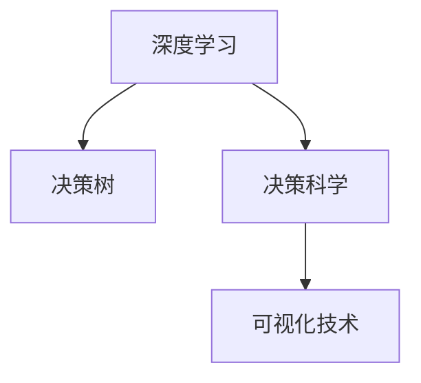

                 

# 数字化直觉：AI辅助的潜意识决策

> 关键词：数字化直觉,潜意识决策,AI辅助,神经网络,深度学习,决策科学

## 1. 背景介绍

### 1.1 问题由来
随着人工智能技术的不断成熟和应用普及，AI辅助决策系统成为了一个热门话题。传统的决策方式依赖于人类的直观感知和经验判断，但在信息过载、复杂多变的现代社会中，单纯依靠直觉的决策往往存在诸多局限。而数字化直觉的提出，旨在将人类的直觉和经验与AI的力量相结合，提升决策的科学性和可靠性。

### 1.2 问题核心关键点
数字化直觉的核心在于利用人工智能技术，通过对大量数据和信息的深度学习，挖掘人类潜意识中的直觉和经验，辅助决策者做出更加准确和高效的判断。数字化直觉的实现主要依赖于以下核心技术：

- **深度学习**：通过神经网络模型对大规模数据进行训练，学习出数据背后的模式和规律。
- **决策科学**：将决策理论与AI技术结合，构建智能化的决策框架和模型。
- **可视化技术**：利用图表、图形等形式，直观展示决策过程和结果，便于决策者理解和使用。

这些核心技术共同构成了数字化直觉的实现基础，使得AI能够在处理海量数据的同时，挖掘出潜意识中的直觉，提升决策的科学性和精度。

### 1.3 问题研究意义
数字化直觉的提出，对现代决策方式有着深远的影响：

1. **提升决策质量**：通过数据驱动的决策过程，减少人为失误，提高决策的科学性和准确性。
2. **优化决策效率**：AI可以快速处理和分析大量数据，缩短决策时间，提高决策效率。
3. **增强决策公平性**：数字化直觉能够避免人为偏见和情感干扰，保证决策的客观性和公平性。
4. **推动业务创新**：数字化直觉可以应用于各个业务领域，辅助企业在竞争中占据优势，推动业务创新和增长。

## 2. 核心概念与联系

### 2.1 核心概念概述

为更好地理解数字化直觉的实现机制，本节将介绍几个关键概念：

- **深度学习**：基于神经网络模型的学习算法，通过反向传播等机制，从数据中学习出复杂模式和规律。
- **决策树**：一种基于树形结构的决策模型，通过一系列的条件判断和分支选择，得出最终的决策结果。
- **决策科学**：研究如何利用数据和模型进行科学决策的理论和方法，包括数据挖掘、机器学习、优化算法等。
- **可视化技术**：利用图表、图形等形式，直观展示数据和模型的结果，帮助决策者理解和应用。

这些核心概念之间的逻辑关系可以通过以下Mermaid流程图来展示：



这个流程图展示了深度学习、决策树和决策科学与可视化技术之间的关系：

1. 深度学习从大量数据中学习模式，为决策树和决策科学提供数据支持。
2. 决策树和决策科学利用深度学习得到的数据，构建决策模型和框架。
3. 可视化技术将决策模型和结果直观展示，便于决策者理解和使用。

## 3. 核心算法原理 & 具体操作步骤
### 3.1 算法原理概述

数字化直觉的实现主要依赖于深度学习和决策科学的技术，通过以下几个关键步骤：

1. **数据预处理**：收集和清洗数据，去除噪声和无关信息，为深度学习模型提供高质量的数据输入。
2. **深度学习模型训练**：使用神经网络模型对数据进行训练，学习出数据背后的模式和规律。
3. **决策模型构建**：结合深度学习得到的特征和决策树等模型，构建智能化的决策框架和模型。
4. **结果可视化**：利用可视化技术，直观展示决策模型和结果，辅助决策者理解和使用。

### 3.2 算法步骤详解

以下是实现数字化直觉的核心算法步骤：

**Step 1: 数据预处理**
- 收集与决策相关的数据，如市场数据、用户行为数据、环境数据等。
- 清洗数据，去除噪声和无关信息，保证数据的准确性和完整性。
- 标准化数据，如归一化、离散化等，为模型训练做准备。

**Step 2: 深度学习模型训练**
- 选择合适的神经网络模型，如卷积神经网络(CNN)、循环神经网络(RNN)、长短期记忆网络(LSTM)等。
- 分割数据集为训练集、验证集和测试集，进行模型的训练、验证和测试。
- 使用交叉验证等技术，优化模型参数，提升模型性能。

**Step 3: 决策模型构建**
- 将深度学习得到的特征和决策树等模型结合，构建决策模型。
- 定义决策规则，如阈值、加权等，对模型结果进行进一步加工。
- 利用可视化技术，将决策模型和结果展示出来，便于决策者理解和使用。

**Step 4: 结果可视化**
- 选择合适的可视化工具，如Tableau、Power BI等。
- 设计可视化图表，如散点图、柱状图、热力图等，直观展示决策结果。
- 设计交互式界面，允许决策者通过拖曳、筛选等操作，动态查看决策过程和结果。

### 3.3 算法优缺点

数字化直觉的实现具有以下优点：

1. **科学决策**：深度学习和大数据驱动的决策过程，减少了人为失误，提高了决策的科学性和可靠性。
2. **高效决策**：AI可以快速处理和分析大量数据，缩短决策时间，提高决策效率。
3. **公平决策**：数字化直觉能够避免人为偏见和情感干扰，保证决策的客观性和公平性。
4. **直观展示**：可视化技术使决策过程和结果更加直观，便于决策者理解和应用。

但数字化直觉也存在一些局限：

1. **数据依赖**：决策的科学性和可靠性高度依赖于数据的质量和完整性。
2. **模型复杂性**：深度学习模型的构建和训练过程复杂，需要大量计算资源和时间。
3. **结果解释**：深度学习模型通常被称为"黑盒"模型，其内部决策过程难以解释，缺乏透明度。
4. **应用限制**：数字化直觉主要用于数据分析和决策辅助，无法完全替代人类的直觉和经验。

尽管存在这些局限，但数字化直觉为现代决策方式带来了新的突破，具有广泛的应用前景。

### 3.4 算法应用领域

数字化直觉的实现涵盖了多个应用领域，包括但不限于：

- **金融投资**：利用市场数据和用户行为数据，构建投资决策模型，辅助投资者做出更加科学的投资决策。
- **医疗诊断**：通过收集和分析患者的病历、影像等数据，构建诊断决策模型，提高医疗诊断的准确性和效率。
- **供应链管理**：结合市场数据和物流数据，构建供应链优化决策模型，提升供应链管理的科学性和效率。
- **客户关系管理**：利用客户行为数据，构建客户分群和营销决策模型，提升客户满意度和忠诚度。
- **风险管理**：通过分析和预测风险事件，构建风险控制决策模型，减少风险损失。

## 4. 数学模型和公式 & 详细讲解  
### 4.1 数学模型构建

数字化直觉的实现涉及多个数学模型和算法，以下以金融投资决策为例，介绍相关数学模型的构建：

- **市场数据模型**：使用时间序列分析、回归分析等方法，构建市场价格变化趋势模型。
- **用户行为模型**：使用聚类分析、分类算法等方法，构建用户行为特征模型。
- **决策模型**：结合市场数据和用户行为数据，构建投资决策模型，如多因素回归模型、决策树模型等。

**金融投资决策模型**：

$$
\hat{y} = \beta_0 + \beta_1x_1 + \beta_2x_2 + ... + \beta_nx_n + \epsilon
$$

其中，$y$ 为投资回报率，$\beta_0$ 为截距项，$\beta_i$ 为第 $i$ 个特征的系数，$x_i$ 为第 $i$ 个特征，$\epsilon$ 为误差项。

### 4.2 公式推导过程

以下我们以多因素回归模型为例，推导其公式及其推导过程：

假设有一个包含 $n$ 个特征的市场数据，表示为 $x_1, x_2, ..., x_n$。令 $y$ 为投资回报率，使用多因素回归模型进行预测：

$$
\hat{y} = \beta_0 + \beta_1x_1 + \beta_2x_2 + ... + \beta_nx_n
$$

其中，$\beta_i$ 为第 $i$ 个特征的系数。

模型参数的估计通常采用最小二乘法，其目标是最小化残差平方和：

$$
\sum_{i=1}^n (y_i - \hat{y}_i)^2
$$

通过求解目标函数的最小值，得到参数 $\beta_i$ 的估计值。

在实际应用中，为了进一步提升模型的预测精度，还可以引入正则化项，如L1正则或L2正则，防止过拟合：

$$
\hat{\beta} = \arg\min_{\beta} \frac{1}{n}\sum_{i=1}^n (y_i - \beta_0 - \beta_1x_1 - ... - \beta_nx_n)^2 + \lambda(\beta_0^2 + \beta_1^2 + ... + \beta_n^2)
$$

其中，$\lambda$ 为正则化系数。

### 4.3 案例分析与讲解

以一个简单的金融投资决策模型为例，展示其构建和应用过程：

假设某金融公司想要构建一个基于市场数据和用户行为数据的投资决策模型。该公司收集了以下数据：

- 市场数据：过去一年内的股票价格变化、市场波动率等。
- 用户行为数据：用户的历史交易记录、投资偏好等。

首先，对市场数据和用户行为数据进行清洗和标准化处理，去除噪声和无关信息。然后，使用回归分析方法，构建多因素回归模型：

$$
\hat{y} = \beta_0 + \beta_1\text{Price} + \beta_2\text{Volatility} + \beta_3\text{UserPreference}
$$

其中，$\text{Price}$ 表示市场价格变化，$\text{Volatility}$ 表示市场波动率，$\text{UserPreference}$ 表示用户偏好。

使用最小二乘法估计模型参数 $\beta_i$，得到：

$$
\hat{\beta} = (X^TX)^{-1}X^Ty
$$

其中，$X$ 为特征矩阵，$y$ 为投资回报率向量。

构建好决策模型后，可以使用历史数据进行验证和测试，评估其预测精度。同时，利用可视化技术，展示模型的结果和预测趋势，帮助决策者做出科学决策。

## 5. 项目实践：代码实例和详细解释说明
### 5.1 开发环境搭建

在进行数字化直觉的实践前，我们需要准备好开发环境。以下是使用Python进行TensorFlow开发的环境配置流程：

1. 安装Anaconda：从官网下载并安装Anaconda，用于创建独立的Python环境。

2. 创建并激活虚拟环境：
```bash
conda create -n tf-env python=3.8 
conda activate tf-env
```

3. 安装TensorFlow：
```bash
conda install tensorflow
```

4. 安装各类工具包：
```bash
pip install numpy pandas scikit-learn matplotlib tqdm jupyter notebook ipython
```

完成上述步骤后，即可在`tf-env`环境中开始数字化直觉的实践。

### 5.2 源代码详细实现

下面我们以金融投资决策模型为例，给出使用TensorFlow进行深度学习和决策模型构建的PyTorch代码实现。

首先，定义金融投资决策模型：

```python
import tensorflow as tf
from tensorflow.keras import layers

def build_model(inputs):
    x = layers.Dense(64, activation='relu')(inputs)
    x = layers.Dense(32, activation='relu')(x)
    x = layers.Dense(1, activation='sigmoid')(x)
    return x
```

然后，定义模型训练函数：

```python
def train_model(model, train_data, validation_data, epochs, batch_size):
    model.compile(optimizer='adam', loss='binary_crossentropy', metrics=['accuracy'])
    model.fit(train_data, epochs=epochs, batch_size=batch_size, validation_data=validation_data)
```

接着，定义数据预处理函数：

```python
def preprocess_data(data):
    # 对数据进行清洗和标准化处理
    # 将数据转换为模型需要的输入格式
    # 返回预处理后的训练集和验证集
    pass
```

最后，启动模型训练和评估：

```python
train_data, validation_data = preprocess_data(train_data)
model = build_model(train_data)
train_model(model, train_data, validation_data, epochs=10, batch_size=32)
```

以上就是使用TensorFlow对金融投资决策模型进行构建和训练的完整代码实现。可以看到，TensorFlow提供了丰富的神经网络模型和优化器，使得模型构建和训练变得简单易行。

### 5.3 代码解读与分析

让我们再详细解读一下关键代码的实现细节：

**模型定义**：
- `build_model`函数：定义一个简单的两层全连接神经网络，使用ReLU激活函数和Sigmoid输出层。

**数据预处理**：
- `preprocess_data`函数：数据预处理是数字化直觉中至关重要的一环，包括数据清洗、标准化、归一化等操作，最终将数据转换为模型需要的输入格式。

**模型训练**：
- `train_model`函数：定义模型的训练过程，使用Adam优化器和二元交叉熵损失函数。

**模型评估**：
- 在训练过程中，使用验证集对模型进行评估，输出模型的训练和验证精度。

## 6. 实际应用场景
### 6.1 金融投资

数字化直觉在金融投资决策中具有广阔的应用前景。传统的金融投资依赖于专家经验和人市感觉，但在信息爆炸、市场波动剧烈的当下，这种依赖往往难以保证决策的科学性和准确性。而数字化直觉则通过深度学习和大数据分析，构建科学的投资决策模型，辅助投资者做出更加明智的决策。

在实际应用中，可以收集市场数据、用户行为数据等，构建多因素回归模型、决策树模型等，通过模型预测投资回报率，提供投资建议。同时，利用可视化技术展示预测结果和趋势，帮助投资者理解模型决策过程，做出更加科学的投资决策。

### 6.2 医疗诊断

医疗诊断是另一个数字化直觉的重要应用领域。传统医疗诊断依赖于医生的经验和判断，但在复杂病例和多样化症状面前，医生也难以保证诊断的准确性。数字化直觉则通过深度学习和大数据，构建智能化的诊断决策模型，提高诊断的科学性和效率。

在实际应用中，可以收集患者的病历、影像等数据，使用卷积神经网络(CNN)等深度学习模型进行图像识别和分类，结合决策树等模型进行综合诊断。同时，利用可视化技术展示诊断结果和趋势，帮助医生理解模型决策过程，做出更加科学的诊断决策。

### 6.3 供应链管理

供应链管理涉及到大量的数据和复杂的业务逻辑，传统的供应链管理依赖于人工经验和规则，难以保证管理的科学性和效率。数字化直觉则通过深度学习和大数据分析，构建智能化的供应链优化决策模型，提升供应链管理的科学性和效率。

在实际应用中，可以收集市场数据、物流数据等，构建供应链优化模型，预测供应链中的需求和风险，优化供应链的布局和运营。同时，利用可视化技术展示供应链数据和优化结果，帮助管理人员理解模型决策过程，做出更加科学的供应链管理决策。

## 7. 工具和资源推荐
### 7.1 学习资源推荐

为了帮助开发者系统掌握数字化直觉的理论基础和实践技巧，这里推荐一些优质的学习资源：

1. **《深度学习》系列博文**：由深度学习专家撰写，深入浅出地介绍了深度学习原理和应用，适合初学者入门。

2. **《决策树与随机森林》课程**：斯坦福大学开设的决策树相关课程，有Lecture视频和配套作业，帮助理解决策树算法和应用。

3. **《数据科学》书籍**：详细介绍了数据科学的基本概念和常用技术，包括数据预处理、模型构建和评估等。

4. **《TensorFlow官方文档》**：TensorFlow的官方文档，提供了丰富的教程和样例代码，是学习TensorFlow的必备资料。

5. **Kaggle竞赛平台**：一个全球知名的数据科学竞赛平台，提供大量的数据集和竞赛任务，帮助学习者积累实战经验。

通过这些资源的学习实践，相信你一定能够快速掌握数字化直觉的精髓，并用于解决实际的决策问题。

### 7.2 开发工具推荐

高效的开发离不开优秀的工具支持。以下是几款用于数字化直觉开发的常用工具：

1. **TensorFlow**：由Google主导开发的深度学习框架，生产部署方便，适合大规模工程应用。

2. **Keras**：一个简单易用的深度学习框架，提供丰富的API和模型，适合快速迭代研究。

3. **Pandas**：用于数据处理和分析的Python库，支持数据清洗、标准化、可视化等操作。

4. **TensorBoard**：TensorFlow配套的可视化工具，可实时监测模型训练状态，并提供丰富的图表呈现方式。

5. **Tableau**：一个流行的数据可视化工具，支持复杂的数据分析和可视化操作，适用于生成交互式报表和仪表盘。

合理利用这些工具，可以显著提升数字化直觉开发的效率，加速创新迭代的步伐。

### 7.3 相关论文推荐

数字化直觉的发展离不开学界的持续研究。以下是几篇奠基性的相关论文，推荐阅读：

1. **《深度学习》原书**：Ian Goodfellow等人的经典教材，全面介绍了深度学习的原理和应用，是学习深度学习的必读书籍。

2. **《决策树算法》原书**：J.Ross Quinlan的经典著作，详细介绍了决策树算法的理论基础和应用方法。

3. **《TensorFlow实战》书籍**：TensorFlow的实战指南，通过丰富的实例和案例，帮助学习者快速上手TensorFlow。

4. **《数据科学实战》书籍**：James E. Alammar等人的著作，介绍了数据科学的实践方法和技术，涵盖数据预处理、模型构建和评估等。

这些论文代表了大语言模型微调技术的发展脉络。通过学习这些前沿成果，可以帮助研究者把握学科前进方向，激发更多的创新灵感。

## 8. 总结：未来发展趋势与挑战
### 8.1 总结

本文对数字化直觉的实现机制进行了全面系统的介绍。首先阐述了数字化直觉的研究背景和意义，明确了深度学习、决策科学和可视化技术在数字化直觉中的重要作用。其次，从原理到实践，详细讲解了数字化直觉的构建过程，包括数据预处理、模型训练和结果可视化等关键步骤，给出了数字化直觉任务开发的完整代码实例。同时，本文还广泛探讨了数字化直觉在金融投资、医疗诊断、供应链管理等领域的实际应用前景，展示了数字化直觉的广阔应用前景。

通过本文的系统梳理，可以看到，数字化直觉为现代决策方式带来了新的突破，具有广泛的应用前景。深度学习和大数据驱动的决策过程，减少了人为失误，提高了决策的科学性和可靠性。AI可以快速处理和分析大量数据，缩短决策时间，提高决策效率。同时，可视化技术使决策过程和结果更加直观，便于决策者理解和应用。未来，伴随深度学习和大数据技术的持续演进，数字化直觉必将进一步提升决策的科学性和精度，为各个领域的决策提供强有力的支持。

### 8.2 未来发展趋势

展望未来，数字化直觉将呈现以下几个发展趋势：

1. **数据依赖减少**：随着深度学习模型的不断优化，数据需求逐渐减少，更多的决策过程将依赖于AI的辅助。
2. **应用场景多样化**：数字化直觉将拓展到更多领域，如智能交通、智慧城市等，为各个行业的决策提供支持。
3. **决策模型自动化**：更多的决策模型将通过自动学习优化，减少人工干预，提升决策的科学性和效率。
4. **结果解释透明化**：未来的决策模型将具备更好的解释能力，使决策过程更加透明和可信。
5. **跨领域融合**：数字化直觉将与其他人工智能技术如自然语言处理、计算机视觉等进行更深层次的融合，提升决策的全面性和准确性。

以上趋势凸显了数字化直觉的广阔前景。这些方向的探索发展，必将进一步提升决策的科学性和精度，为各个领域带来更加智能化和自动化的决策支持。

### 8.3 面临的挑战

尽管数字化直觉具有广泛的应用前景，但在迈向更加智能化、普适化应用的过程中，它仍面临着诸多挑战：

1. **数据质量问题**：数字化直觉的科学性和可靠性高度依赖于数据的质量和完整性。低质量的数据将导致模型性能下降，甚至产生误导性决策。
2. **模型复杂性问题**：深度学习模型的构建和训练过程复杂，需要大量计算资源和时间，难以应用于实时场景。
3. **结果解释问题**：深度学习模型通常被称为"黑盒"模型，其内部决策过程难以解释，缺乏透明度，难以获得决策者的信任。
4. **应用限制问题**：数字化直觉主要用于数据分析和决策辅助，无法完全替代人类的直觉和经验，某些决策仍需要人工干预。

尽管存在这些挑战，但数字化直觉为现代决策方式带来了新的突破，具有广泛的应用前景。研究者需要不断优化模型和算法，提升数据质量，增强模型解释能力，推动数字化直觉技术的不断进步。

### 8.4 研究展望

未来的研究需要在以下几个方面寻求新的突破：

1. **数据预处理技术**：开发更加高效的数据清洗、标准化和归一化技术，提升数据质量，降低数据依赖。
2. **模型优化算法**：研究和开发更加高效、轻量级的深度学习模型，降低模型复杂性和计算需求，提升实时性。
3. **结果解释方法**：引入因果推断和博弈论工具，增强模型的解释能力，使决策过程更加透明和可信。
4. **跨领域融合技术**：将数字化直觉与自然语言处理、计算机视觉等技术进行融合，提升决策的全面性和准确性。
5. **应用落地策略**：开发更加智能化的决策系统，降低人工干预，提升决策的自动化和智能化水平。

这些研究方向的探索，必将推动数字化直觉技术的不断进步，为各个领域的决策提供更加科学和可靠的辅助。

## 9. 附录：常见问题与解答

**Q1：数字化直觉是否适用于所有决策场景？**

A: 数字化直觉主要适用于数据分析和决策辅助的场景，如金融投资、医疗诊断、供应链管理等。对于一些需要直觉和经验判断的决策场景，如创意工作、艺术创作等，仍需要依赖人类的直觉和判断。

**Q2：数字化直觉的决策结果是否完全可靠？**

A: 数字化直觉的决策结果依赖于数据质量和模型性能，可能存在一定的误差。在实际应用中，需要结合人类经验和判断，综合考虑多种因素，做出最终的决策。

**Q3：如何提升数字化直觉的解释能力？**

A: 引入因果推断和博弈论工具，增强模型的解释能力，使决策过程更加透明和可信。同时，设计可视化界面，直观展示模型决策过程和结果，帮助决策者理解和使用。

**Q4：数字化直觉在金融投资中的应用需要注意哪些问题？**

A: 金融投资决策中，需要注意数据质量、模型鲁棒性和结果解释等问题。数据质量低、模型鲁棒性差、结果解释不透明等，都将影响模型的决策效果。

**Q5：数字化直觉在医疗诊断中的应用需要注意哪些问题？**

A: 医疗诊断中，需要注意数据隐私、模型准确性和结果解释等问题。数据隐私保护、模型准确性和结果解释透明等，都是数字化直觉在医疗诊断中需要考虑的关键因素。

---

作者：禅与计算机程序设计艺术 / Zen and the Art of Computer Programming

