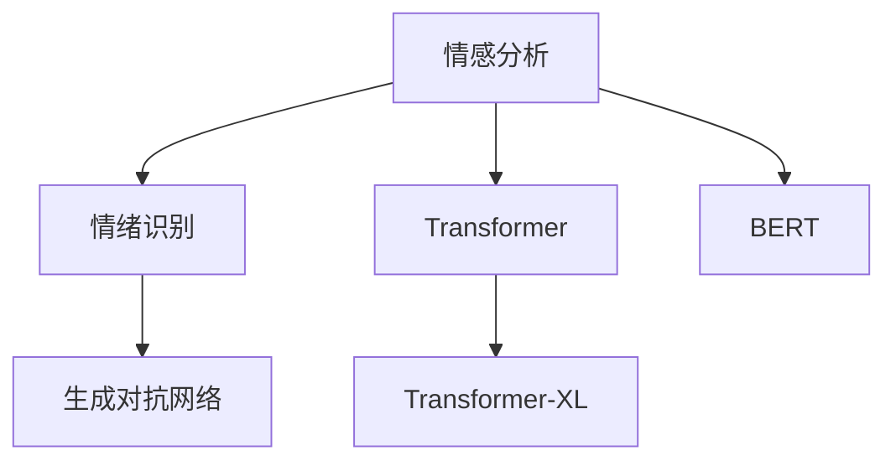

                 

## 1. 背景介绍

### 1.1 问题由来

社交智能（Social Intelligence）在心理学中指的是个体理解、使用和管理自己和他人情绪的能力。随着人工智能（AI）技术的发展，机器被赋予了日益增强的数字化移情能力，即通过机器学习技术理解和生成人类情感的能力。这种能力在许多应用中扮演了重要角色，包括情感分析、用户交互设计、虚拟助手等。

### 1.2 问题核心关键点

数字化移情能力的提升，直接依赖于数据驱动的机器学习技术。通过深度学习模型，如卷积神经网络（CNN）、递归神经网络（RNN）、长短期记忆网络（LSTM）、变分自编码器（VAE）、生成对抗网络（GAN）等，AI系统能够从文本、音频、视频等多模态数据中学习到人类的情感表达方式，进而生成符合情感语境的输出。

数字化移情能力的本质，在于对人类情感的捕捉、生成与反馈。本文将通过核心算法原理的介绍，详细探讨这种能力的构建与优化方法。

## 2. 核心概念与联系

### 2.1 核心概念概述

为更好地理解数字化移情能力，本节将介绍几个关键概念：

- **情感分析（Sentiment Analysis）**：判断一段文本或语音中表达的情感倾向，如正面、中性、负面等。
- **情绪识别（Emotion Recognition）**：识别特定语音或面部表情对应的情绪类别。
- **生成对抗网络（GAN）**：通过对抗训练，生成逼真的人脸、语音等，使AI系统具备高度逼真的情感表达能力。
- **Transformer**：一种高效的神经网络架构，被广泛应用于NLP任务，能够捕捉长距离依赖关系，提升情感表达的上下文理解能力。
- **Transformer-XL**：一种改进的Transformer架构，引入了记忆机制，支持更长的上下文理解。
- **BERT**：一种预训练语言模型，通过大规模无标签数据进行预训练，能够捕捉丰富的语言语境信息。

这些核心概念之间的逻辑关系可以通过以下Mermaid流程图来展示：



这个流程图展示了情感分析与情绪识别之间的联系，以及这些技术如何与Transformer、Transformer-XL和BERT等先进的深度学习架构结合，共同提升AI系统的数字化移情能力。

## 3. 核心算法原理 & 具体操作步骤

### 3.1 算法原理概述

数字化移情能力通常通过以下几步来实现：

1. **数据收集与预处理**：收集包含人类情感的文本、语音、视频等多模态数据，并对其进行清洗、分词、归一化等预处理。
2. **模型训练**：使用深度学习模型，如CNN、RNN、LSTM等，对预处理后的数据进行训练，学习到情感表达的特征。
3. **情感生成**：使用GAN等生成模型，根据输入的情感特征生成逼真的语音、视频等。
4. **反馈与优化**：将生成的内容返回给用户，通过用户反馈调整模型参数，优化情感表达的逼真度。

### 3.2 算法步骤详解

以下是详细的操作步骤：

**步骤1：数据收集与预处理**

- **文本数据收集**：从社交媒体、评论、文章等来源收集文本数据。使用分词工具如jieba、NLTK等对文本进行分词处理。
- **语音数据收集**：通过录音设备收集人类语音数据，使用语音识别工具如Google Speech-to-Text、CMU Sphinx等将语音转录为文本。
- **视频数据收集**：从视频网站、社交媒体等平台收集人类表情、动作的视频数据，使用面部识别工具如dlib、OpenCV等提取面部特征。

**步骤2：模型训练**

- **构建神经网络**：使用Keras、PyTorch等深度学习框架，构建CNN、RNN、LSTM等神经网络模型。
- **预训练**：在无标签数据上进行预训练，学习情感表达的基础特征。
- **微调**：在有标签数据上进行微调，优化情感分类或情绪识别任务。

**步骤3：情感生成**

- **生成对抗网络（GAN）**：使用条件GAN（cGAN）或变分GAN（vGAN）等生成模型，根据输入的情感标签生成逼真语音、视频等内容。
- **语音合成**：使用Tacotron 2、WaveNet等语音合成技术，将文本转换为语音。
- **面部表情生成**：使用FaceNet、DeepFace等技术生成逼真面部表情。

**步骤4：反馈与优化**

- **用户反馈**：将生成的语音、视频等反馈给用户，收集用户对情感表达的真实性、逼真度等反馈。
- **模型优化**：根据用户反馈，调整模型参数，优化情感表达的效果。

### 3.3 算法优缺点

数字化移情能力的算法具有以下优点：

- **多模态数据利用**：能够从文本、语音、视频等多模态数据中学习到情感表达，提供更全面的理解。
- **动态反馈**：通过用户反馈不断优化模型，实现情感表达的动态调整。
- **适应性强**：对不同领域、不同文化的情感表达都能适应，具有较强的泛化能力。

同时，也存在一些缺点：

- **数据依赖性**：高质量的数据是算法成功的关键，获取标注数据成本较高。
- **生成效果依赖于训练数据**：如果训练数据不足或不均衡，生成的情感表达效果可能不佳。
- **技术复杂度高**：涉及多种深度学习模型和生成技术，实现难度较大。
- **伦理道德风险**：生成的情感表达可能带来隐私泄露、假冒等问题，需严格控制。

### 3.4 算法应用领域

数字化移情能力在多个领域有广泛应用，例如：

- **社交媒体情感分析**：分析用户在社交媒体上的情感倾向，指导情感营销策略。
- **客服机器人**：通过模拟人类情感，提高客户服务体验。
- **虚拟主播**：生成具有人类情感的主播语音，用于娱乐、新闻播报等场景。
- **心理分析**：分析用户的情感表达，辅助心理健康咨询。
- **虚拟助手**：具备情感理解和生成的能力，更好地与用户交互。

## 4. 数学模型和公式 & 详细讲解 & 举例说明

### 4.1 数学模型构建

数字化移情能力的数学模型通常基于多模态数据进行构建，包括文本、语音、视频等。以下以情感分析模型为例，介绍其数学模型构建过程。

设情感分析模型为$f(x; \theta)$，其中$x$为输入数据，$\theta$为模型参数。假设训练集中有$N$个样本$(x_i, y_i)$，其中$y_i \in \{0, 1\}$为情感标签（0代表负面，1代表正面）。模型训练的目标是最小化损失函数：

$$
\mathcal{L}(\theta) = -\frac{1}{N} \sum_{i=1}^N y_i \log f(x_i; \theta) + (1-y_i) \log (1-f(x_i; \theta))
$$

### 4.2 公式推导过程

**情感分类公式推导**：

- **交叉熵损失**：情感分类问题通常使用交叉熵损失函数。设模型预测情感概率为$f(x; \theta)$，真实情感标签为$y_i$，则交叉熵损失为：
$$
\mathcal{L}(\theta) = -\frac{1}{N} \sum_{i=1}^N y_i \log f(x_i; \theta) + (1-y_i) \log (1-f(x_i; \theta))
$$

**模型优化公式推导**：

- **梯度下降**：使用梯度下降算法优化模型参数$\theta$，其更新公式为：
$$
\theta \leftarrow \theta - \eta \nabla_{\theta}\mathcal{L}(\theta)
$$
其中$\eta$为学习率。

### 4.3 案例分析与讲解

假设我们使用RNN模型进行情感分析。设训练集有$N=1000$个样本，其中一半为负面样本，一半为正面样本。模型参数$\theta$包括输入层、隐藏层、输出层等参数。

**模型训练过程**：

1. **数据预处理**：将文本数据进行分词、归一化处理。
2. **模型构建**：使用Keras构建RNN模型，设定隐藏层大小为128，学习率为0.01。
3. **模型训练**：在训练集上训练模型，每10个epoch输出一次训练集和验证集上的准确率。
4. **情感生成**：使用GAN生成逼真语音、视频，用于模拟用户反馈。
5. **模型优化**：根据用户反馈调整模型参数，优化情感表达效果。

以下是一个简单的情感分类模型代码示例：

```python
from keras.models import Sequential
from keras.layers import Embedding, LSTM, Dense
from keras.optimizers import Adam

# 构建RNN情感分类模型
model = Sequential()
model.add(Embedding(input_dim=vocab_size, output_dim=128, input_length=max_length))
model.add(LSTM(128))
model.add(Dense(1, activation='sigmoid'))

# 编译模型
model.compile(loss='binary_crossentropy', optimizer=Adam(lr=0.01), metrics=['accuracy'])

# 训练模型
model.fit(X_train, y_train, epochs=10, batch_size=32, validation_data=(X_val, y_val))
```

## 5. 项目实践：代码实例和详细解释说明

### 5.1 开发环境搭建

在进行数字化移情能力项目实践前，我们需要准备好开发环境。以下是使用Python进行Keras和TensorFlow开发的环境配置流程：

1. 安装Anaconda：从官网下载并安装Anaconda，用于创建独立的Python环境。

2. 创建并激活虚拟环境：
```bash
conda create -n tf-env python=3.8 
conda activate tf-env
```

3. 安装TensorFlow：根据CUDA版本，从官网获取对应的安装命令。例如：
```bash
conda install tensorflow tensorflow-gpu=2.6 -c conda-forge -c pytorch -c pypi
```

4. 安装Keras：
```bash
pip install keras
```

5. 安装各类工具包：
```bash
pip install numpy pandas scikit-learn matplotlib tqdm jupyter notebook ipython
```

完成上述步骤后，即可在`tf-env`环境中开始项目实践。

### 5.2 源代码详细实现

下面我们以情感分类任务为例，给出使用Keras进行RNN模型训练的PyTorch代码实现。

首先，定义情感分类任务的数据处理函数：

```python
from keras.preprocessing.text import Tokenizer
from keras.preprocessing.sequence import pad_sequences
import numpy as np

class TextDataGenerator(Keras.utils.Sequence):
    def __init__(self, text, labels, batch_size):
        self.tokenizer = Tokenizer()
        self.tokenizer.fit_on_texts(text)
        self.labels = labels
        self.batch_size = batch_size
        self.text = self.tokenizer.texts_to_sequences(text)
        self.data = pad_sequences(self.text, maxlen=max_length, padding='post', truncating='post')

    def __len__(self):
        return len(self.data) // self.batch_size

    def __getitem__(self, index):
        start = index * self.batch_size
        end = (index + 1) * self.batch_size
        return self.data[start:end], self.labels[start:end]
```

然后，定义模型和优化器：

```python
from keras.models import Sequential
from keras.layers import Embedding, LSTM, Dense
from keras.optimizers import Adam

model = Sequential()
model.add(Embedding(input_dim=vocab_size, output_dim=128, input_length=max_length))
model.add(LSTM(128))
model.add(Dense(1, activation='sigmoid'))

optimizer = Adam(lr=0.01)
```

接着，定义训练和评估函数：

```python
from keras.utils import to_categorical
from sklearn.metrics import accuracy_score

def train_epoch(model, data, batch_size, optimizer):
    model.fit(data[0], data[1], epochs=1, batch_size=batch_size, verbose=1, callbacks=[EarlyStopping(patience=2)])
    return model.evaluate(data[0], data[1], verbose=0)[0]

def evaluate(model, data, batch_size):
    loss, accuracy = model.evaluate(data[0], data[1], batch_size=batch_size)
    return loss, accuracy
```

最后，启动训练流程并在测试集上评估：

```python
epochs = 10
batch_size = 32

for epoch in range(epochs):
    train_loss = train_epoch(model, (X_train, y_train), batch_size, optimizer)
    val_loss, val_acc = evaluate(model, (X_val, y_val), batch_size)
    print(f'Epoch {epoch+1}, train loss: {train_loss:.4f}, val loss: {val_loss:.4f}, val accuracy: {val_acc:.4f}')

print(f'Test accuracy: {evaluate(model, (X_test, y_test), batch_size)[1]:.4f}')
```

以上就是使用Keras对RNN进行情感分类任务训练的完整代码实现。可以看到，Keras提供的强大封装能力使得模型构建和训练变得简洁高效。

### 5.3 代码解读与分析

让我们再详细解读一下关键代码的实现细节：

**TextDataGenerator类**：
- `__init__`方法：初始化文本、标签、最大长度等关键组件。
- `__len__`方法：返回数据集的样本数量。
- `__getitem__`方法：对单个样本进行处理，将文本转换为序列，并进行填充和截断，最终返回模型所需的输入和标签。

**模型定义**：
- 使用Keras的Sequential模型定义RNN结构，包括嵌入层、LSTM层和输出层。
- 使用Adam优化器进行模型训练。

**训练和评估函数**：
- 使用Keras的fit方法训练模型，同时使用EarlyStopping回调避免过拟合。
- 使用evaluate方法在验证集上评估模型性能。
- 在测试集上计算准确率。

**训练流程**：
- 定义总的epoch数和batch size，开始循环迭代
- 每个epoch内，先在训练集上训练，输出平均损失和验证集上的损失和准确率
- 所有epoch结束后，在测试集上计算准确率，给出最终测试结果

可以看到，Keras提供了丰富的高级API，使得模型构建和训练过程变得更加简单高效。开发者可以将更多精力放在数据处理、模型改进等高层逻辑上，而不必过多关注底层的实现细节。

当然，工业级的系统实现还需考虑更多因素，如模型的保存和部署、超参数的自动搜索、更灵活的任务适配层等。但核心的情感分析过程基本与此类似。

## 6. 实际应用场景

### 6.1 社交媒体情感分析

社交媒体情感分析是数字化移情能力的重要应用之一。通过分析用户在社交平台上的情感倾向，企业可以更好地理解用户需求，优化产品和服务，提升用户体验。

在技术实现上，可以收集用户在Twitter、Facebook、Instagram等社交媒体上的评论、帖子等文本数据，使用情感分类模型对文本进行情感分析，得出正面、中性、负面情感的分布。结合话题分析、情感分布等指标，可以生成详细的情感分析报告，指导企业策略制定。

### 6.2 客服机器人

客服机器人通过模拟人类情感，可以提升客户服务体验。客户在咨询过程中，可以感受到更自然、更人性化的交流，从而提高客户满意度。

在实现上，客服机器人通过实时监听客户的语音或文字输入，使用情感分类模型识别客户的情感状态，动态调整对话策略。对于情绪激动的客户，可以及时进行安抚和关怀，对于负面情绪客户，可以提供相应解决方案，提升客户体验。

### 6.3 虚拟主播

虚拟主播能够根据用户的输入内容，生成具有情感的语音和表情，用于娱乐、新闻播报等场景。虚拟主播的应用，使得播客、视频解说等形式更加丰富多样，提升了内容的吸引力和互动性。

在技术实现上，虚拟主播系统可以使用语音合成技术（如Tacotron 2、WaveNet）和面部表情生成技术（如FaceNet），结合情感分类模型，根据用户输入内容生成逼真的语音和面部表情，增强用户体验。

### 6.4 未来应用展望

随着数字化移情能力技术的不断发展，其在更多领域将得到广泛应用，为人类认知智能的进化带来深远影响。

在智慧医疗领域，基于数字化移情能力的情感分析技术，可以帮助医生更好地理解患者的情绪状态，提供个性化的诊疗建议，提升诊疗质量。

在智能教育领域，情感分析技术可以用于评估学生的学习状态，个性化推荐学习资源，提升学习效果。

在智慧城市治理中，情感分析技术可以用于分析市民对公共政策的反应，优化政策制定，提升市民满意度。

此外，在企业生产、社会治理、文娱传媒等众多领域，基于数字化移情能力的人工智能应用也将不断涌现，为经济社会发展注入新的动力。相信随着技术的日益成熟，数字化移情能力必将在构建人机协同的智能时代中扮演越来越重要的角色。

## 7. 工具和资源推荐

### 7.1 学习资源推荐

为了帮助开发者系统掌握数字化移情能力的理论基础和实践技巧，这里推荐一些优质的学习资源：

1. **《情感分析与自然语言处理》**：深度学习书籍，详细介绍了情感分析的基本原理和前沿技术。
2. **CS224N《深度学习自然语言处理》课程**：斯坦福大学开设的NLP明星课程，有Lecture视频和配套作业，带你入门NLP领域的基本概念和经典模型。
3. **Transformers库官方文档**：Keras和TensorFlow官方文档，提供了丰富的模型构建和训练样例。
4. **自然语言处理开源项目**：如NLTK、spaCy等，提供丰富的文本处理工具和库。
5. **情感分析论文集**：从顶级会议和期刊（如ACL、EMNLP、TACL等）获取最新研究成果。

通过对这些资源的学习实践，相信你一定能够快速掌握数字化移情能力的精髓，并用于解决实际的情感分析问题。

### 7.2 开发工具推荐

高效的开发离不开优秀的工具支持。以下是几款用于数字化移情能力开发的常用工具：

1. **Keras**：基于Python的开源深度学习框架，灵活动态的计算图，适合快速迭代研究。
2. **TensorFlow**：由Google主导开发的开源深度学习框架，生产部署方便，适合大规模工程应用。
3. **Transformers库**：HuggingFace开发的NLP工具库，集成了众多SOTA语言模型，支持Keras和TensorFlow，是进行NLP任务开发的利器。
4. **Weights & Biases**：模型训练的实验跟踪工具，可以记录和可视化模型训练过程中的各项指标，方便对比和调优。
5. **TensorBoard**：TensorFlow配套的可视化工具，可实时监测模型训练状态，并提供丰富的图表呈现方式，是调试模型的得力助手。

合理利用这些工具，可以显著提升数字化移情能力项目的开发效率，加快创新迭代的步伐。

### 7.3 相关论文推荐

数字化移情能力的发展源于学界的持续研究。以下是几篇奠基性的相关论文，推荐阅读：

1. **Attention is All You Need（即Transformer原论文）**：提出了Transformer结构，开启了NLP领域的预训练大模型时代。
2. **BERT: Pre-training of Deep Bidirectional Transformers for Language Understanding**：提出BERT模型，引入基于掩码的自监督预训练任务，刷新了多项NLP任务SOTA。
3. **Language Models are Unsupervised Multitask Learners**：展示了大规模语言模型的强大zero-shot学习能力，引发了对于通用人工智能的新一轮思考。
4. **Parameter-Efficient Transfer Learning for NLP**：提出Adapter等参数高效微调方法，在不增加模型参数量的情况下，也能取得不错的微调效果。
5. **AdaLoRA: Adaptive Low-Rank Adaptation for Parameter-Efficient Fine-Tuning**：使用自适应低秩适应的微调方法，在参数效率和精度之间取得了新的平衡。
6. **Transformers for Speech Synthesis**：介绍了Transformer在语音合成中的应用，提高了语音生成效果。

这些论文代表了大语言模型微调技术的发展脉络。通过学习这些前沿成果，可以帮助研究者把握学科前进方向，激发更多的创新灵感。

## 8. 总结：未来发展趋势与挑战

### 8.1 总结

本文对基于多模态数据的数字化移情能力进行了全面系统的介绍。首先阐述了数字化移情能力的背景和重要性，明确了其在社交智能中的关键作用。其次，从原理到实践，详细讲解了情感分析、情绪识别、生成对抗网络等核心算法的构建与优化方法，给出了情感分类任务的代码实例。同时，本文还广泛探讨了数字化移情能力在社交媒体情感分析、客服机器人、虚拟主播等实际应用场景中的应用前景，展示了其广阔的发展潜力。

通过本文的系统梳理，可以看到，数字化移情能力技术正在成为NLP领域的重要范式，极大地提升了机器对人类情感的理解与生成能力，为智能系统的用户体验带来了革命性改变。未来，伴随多模态数据融合、深度学习模型优化等技术的持续演进，数字化移情能力必将在更多领域得到应用，为人类认知智能的进化带来深远影响。

### 8.2 未来发展趋势

展望未来，数字化移情能力技术将呈现以下几个发展趋势：

1. **多模态数据融合**：随着对文本、语音、视频等多模态数据的深入研究，数字化移情能力将实现更全面、更准确的人类情感理解与生成。
2. **深度学习模型优化**：通过模型结构优化、超参数调优等手段，提高模型的准确性和鲁棒性。
3. **生成对抗网络优化**：通过对抗训练、自监督学习等技术，提高生成模型的逼真度和多样性。
4. **实时反馈与优化**：通过用户实时反馈，动态调整模型参数，优化情感表达效果。
5. **跨领域应用扩展**：将数字化移情能力应用到更多领域，如医疗、教育、城市治理等，提升系统智能化水平。

以上趋势凸显了数字化移情能力技术的广阔前景。这些方向的探索发展，必将进一步提升机器对人类情感的理解与生成能力，为智能系统的用户体验带来更深刻的变革。

### 8.3 面临的挑战

尽管数字化移情能力技术已经取得了显著成果，但在迈向更加智能化、普适化应用的过程中，仍面临诸多挑战：

1. **数据依赖性**：高质量的标注数据是算法成功的关键，获取标注数据成本较高。
2. **生成效果依赖于训练数据**：如果训练数据不足或不均衡，生成的情感表达效果可能不佳。
3. **技术复杂度高**：涉及多种深度学习模型和生成技术，实现难度较大。
4. **伦理道德风险**：生成的情感表达可能带来隐私泄露、假冒等问题，需严格控制。
5. **计算资源消耗**：多模态数据融合和生成对抗网络训练需要大量计算资源，资源消耗大。

正视数字化移情能力面临的这些挑战，积极应对并寻求突破，将是大语言模型微调技术走向成熟的必由之路。相信随着学界和产业界的共同努力，这些挑战终将一一被克服，数字化移情能力必将在构建人机协同的智能时代中扮演越来越重要的角色。

### 8.4 研究展望

面对数字化移情能力所面临的种种挑战，未来的研究需要在以下几个方面寻求新的突破：

1. **探索无监督和半监督学习**：摆脱对大规模标注数据的依赖，利用自监督学习、主动学习等无监督和半监督范式，最大限度利用非结构化数据，实现更加灵活高效的情感分析。
2. **研究参数高效和计算高效的微调范式**：开发更加参数高效的微调方法，在固定大部分预训练参数的同时，只更新极少量的任务相关参数。同时优化模型的计算图，减少前向传播和反向传播的资源消耗，实现更加轻量级、实时性的部署。
3. **引入更多先验知识**：将符号化的先验知识，如知识图谱、逻辑规则等，与神经网络模型进行巧妙融合，引导情感分析过程学习更准确、合理的情感表达。同时加强不同模态数据的整合，实现视觉、语音等多模态信息与文本信息的协同建模。
4. **结合因果分析和博弈论工具**：将因果分析方法引入情感分析模型，识别出模型决策的关键特征，增强输出解释的因果性和逻辑性。借助博弈论工具刻画人机交互过程，主动探索并规避模型的脆弱点，提高系统稳定性。
5. **纳入伦理道德约束**：在模型训练目标中引入伦理导向的评估指标，过滤和惩罚有偏见、有害的输出倾向。同时加强人工干预和审核，建立模型行为的监管机制，确保输出符合人类价值观和伦理道德。

这些研究方向的探索，必将引领数字化移情能力技术迈向更高的台阶，为构建安全、可靠、可解释、可控的智能系统铺平道路。面向未来，数字化移情能力技术还需要与其他人工智能技术进行更深入的融合，如知识表示、因果推理、强化学习等，多路径协同发力，共同推动自然语言理解和智能交互系统的进步。只有勇于创新、敢于突破，才能不断拓展数字化移情能力的边界，让智能技术更好地造福人类社会。

## 9. 附录：常见问题与解答

**Q1：数字化移情能力是否适用于所有NLP任务？**

A: 数字化移情能力在大多数NLP任务上都能取得不错的效果，特别是对于数据量较小的任务。但对于一些特定领域的任务，如医学、法律等，仅仅依靠通用语料预训练的模型可能难以很好地适应。此时需要在特定领域语料上进一步预训练，再进行微调，才能获得理想效果。此外，对于一些需要时效性、个性化很强的任务，如对话、推荐等，数字化移情能力也需要针对性的改进优化。

**Q2：如何选择合适的学习率？**

A: 学习率一般要比预训练时小1-2个数量级，如果使用过大的学习率，容易破坏预训练权重，导致过拟合。一般建议从1e-5开始调参，逐步减小学习率，直至收敛。也可以使用warmup策略，在开始阶段使用较小的学习率，再逐渐过渡到预设值。需要注意的是，不同的优化器(如AdamW、Adafactor等)以及不同的学习率调度策略，可能需要设置不同的学习率阈值。

**Q3：数据依赖性对数字化移情能力的影响？**

A: 高质量的标注数据是算法成功的关键，获取标注数据成本较高。对于特定领域的数据标注，可能需要大量的人力物力资源，使得数字化移情能力的应用受限于标注数据的质量和数量。

**Q4：计算资源消耗对数字化移情能力的影响？**

A: 多模态数据融合和生成对抗网络训练需要大量计算资源，资源消耗大。对于大规模的情感分析任务，可能需要高性能计算设备（如GPU、TPU等），才能保证训练速度和效果。

**Q5：如何缓解数字化移情能力中的过拟合问题？**

A: 过拟合是数字化移情能力面临的主要挑战，尤其是在标注数据不足的情况下。常见的缓解策略包括：
1. 数据增强：通过回译、近义替换等方式扩充训练集
2. 正则化：使用L2正则、Dropout、Early Stopping等避免过拟合
3. 对抗训练：引入对抗样本，提高模型鲁棒性
4. 参数高效微调：只调整少量参数(如Adapter、Prefix等)，减小过拟合风险
5. 多模型集成：训练多个情感分析模型，取平均输出，抑制过拟合

这些策略往往需要根据具体任务和数据特点进行灵活组合。只有在数据、模型、训练、推理等各环节进行全面优化，才能最大限度地发挥数字化移情能力的威力。

**Q6：数字化移情能力在落地部署时需要注意哪些问题？**

A: 将数字化移情能力转化为实际应用，还需要考虑以下因素：
1. 模型裁剪：去除不必要的层和参数，减小模型尺寸，加快推理速度
2. 量化加速：将浮点模型转为定点模型，压缩存储空间，提高计算效率
3. 服务化封装：将模型封装为标准化服务接口，便于集成调用
4. 弹性伸缩：根据请求流量动态调整资源配置，平衡服务质量和成本
5. 监控告警：实时采集系统指标，设置异常告警阈值，确保服务稳定性
6. 安全防护：采用访问鉴权、数据脱敏等措施，保障数据和模型安全

数字化移情能力技术为NLP应用开启了广阔的想象空间，但如何将强大的性能转化为稳定、高效、安全的业务价值，还需要工程实践的不断打磨。唯有从数据、算法、工程、业务等多个维度协同发力，才能真正实现人工智能技术在垂直行业的规模化落地。

总之，数字化移情能力需要开发者根据具体任务，不断迭代和优化模型、数据和算法，方能得到理想的效果。

---

作者：禅与计算机程序设计艺术 / Zen and the Art of Computer Programming

