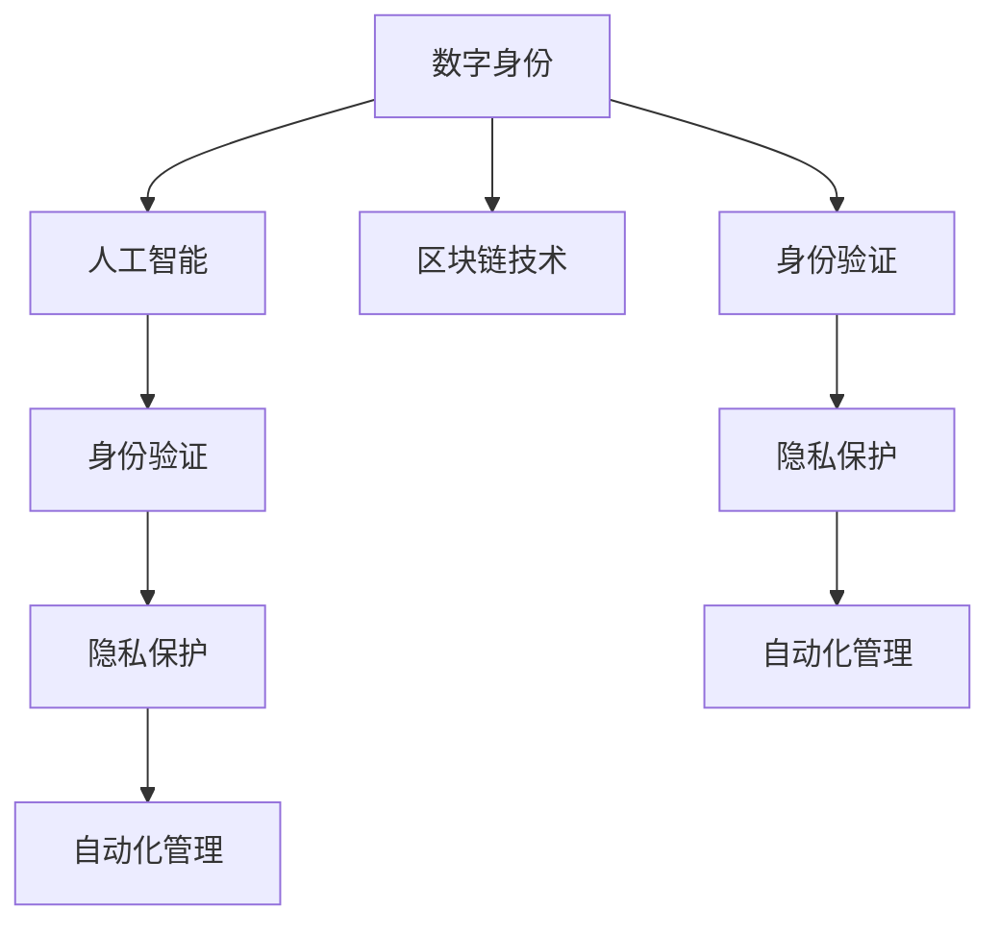

                 

# 数字化自我：AI驱动的身份重构

> 关键词：数字身份, 人工智能, 自我认知, 隐私保护, 区块链技术, 身份验证, 自动化管理, 未来工作

## 1. 背景介绍

### 1.1 问题由来
在数字化时代，我们的身份信息逐渐从线下转移到线上，成为一种“数字化自我”。这种转变不仅影响了我们的日常生活，也带来了诸多挑战和机遇。例如，我们如何在数字化身份与现实自我之间建立有效的映射，如何在隐私保护与身份验证之间找到平衡点，以及如何利用人工智能技术提升身份管理效率，都是当前亟待解决的问题。

### 1.2 问题核心关键点
数字身份重构的本质是如何在数字化时代构建、管理和保护个体身份，使其既能适应线上和线下环境的融合，又能保证个人隐私和信息安全。这包括但不限于以下几个关键点：
- 身份的统一管理：将各类线上身份（如社交、支付、教育等）整合，形成统一的数字化身份。
- 隐私保护与透明度：在确保数据安全的前提下，允许个体对自身数据进行适度控制和管理。
- 身份验证的自动化：通过AI技术实现自动化身份验证，提高身份管理的效率和准确性。
- 身份的动态更新：根据个体在不同场景下的需求变化，动态更新身份信息，提升身份管理的灵活性。

### 1.3 问题研究意义
研究数字身份重构，对于构建安全、便捷、可信的数字化社会，具有重要意义：
- 提升身份管理的效率和安全性，减少手工操作和人为错误。
- 保护用户隐私，防止身份信息被滥用，增强用户对自身数据的掌控。
- 促进不同场景下身份的融合和互通，减少用户在不同平台间的重复注册和认证。
- 推动数字化身份技术的广泛应用，促进各行业的数字化转型升级。

## 2. 核心概念与联系

### 2.1 核心概念概述

为更好地理解AI驱动的数字身份重构方法，本节将介绍几个密切相关的核心概念：

- **数字身份(Digital Identity)**：指个体在数字世界中的唯一标识，通常包括姓名、身份证号、社会安全号、电子邮箱、密码等。数字身份具有唯一性和不可转让性，是各类线上服务的基础。
- **人工智能(Artificial Intelligence, AI)**：通过算法和计算模型模拟人类智能的技术。在身份重构中，AI可以用于身份验证、自动化管理、隐私保护等环节。
- **区块链技术(Blockchain Technology)**：一种分布式账本技术，具备不可篡改、去中心化、透明等特性，常用于构建分布式身份认证系统。
- **隐私保护(Privacy Protection)**：保护个体数据不被未经授权的访问和使用的技术。在身份管理中，隐私保护是确保用户数据安全、尊重用户知情权和控制权的关键。
- **身份验证(Identity Verification)**：通过各种手段确认个体身份的过程。AI可以通过人脸识别、声音识别、生物特征识别等技术实现自动化身份验证。
- **自动化管理(Automatic Management)**：利用AI和自动化技术，实现身份信息的自动采集、更新和处理，提升身份管理的效率和准确性。

这些核心概念之间的逻辑关系可以通过以下Mermaid流程图来展示：



这个流程图展示了数字身份及其相关技术之间的联系：

1. 数字身份是AI、区块链、隐私保护、身份验证和自动化管理的共同对象。
2. AI和区块链技术分别提供了身份验证和隐私保护的重要手段。
3. 身份验证和隐私保护是自动化管理的基础，自动化管理又反过来提升了身份验证和隐私保护的效果。

## 3. 核心算法原理 & 具体操作步骤
### 3.1 算法原理概述

AI驱动的数字身份重构方法，主要基于身份验证和隐私保护技术，通过自动化管理和优化，实现身份信息的有效管理和更新。其核心思想是：
- **身份验证**：通过AI技术实现自动化的身份确认，减少人工干预，提高身份管理的效率和准确性。
- **隐私保护**：利用区块链等技术，保障用户数据的不可篡改性和透明性，确保用户隐私安全。
- **自动化管理**：通过AI技术自动化地采集、处理和更新身份信息，减少用户的手工操作和出错风险。

### 3.2 算法步骤详解

AI驱动的数字身份重构，一般包括以下几个关键步骤：

**Step 1: 构建统一身份管理平台**
- 设计并实现一个跨平台、跨应用的统一身份管理平台，整合用户的各类线上身份信息，形成统一的数字化身份。
- 平台应具备身份验证、隐私保护、自动化管理等核心功能，支持用户自定义和管理身份信息。

**Step 2: 实施AI身份验证技术**
- 利用AI技术进行身份验证，包括人脸识别、声音识别、生物特征识别等。
- 结合多模态验证技术，如人脸+指纹、人脸+声音等，提高身份验证的准确性和鲁棒性。
- 使用对抗样本训练等技术，增强AI模型的鲁棒性，防止攻击和欺诈。

**Step 3: 引入区块链技术保障数据安全**
- 使用区块链技术记录和验证身份信息的变更和交易记录，确保数据的不可篡改性和透明性。
- 设计分布式身份认证系统，通过多个节点共同验证身份信息的合法性，增强系统的可信度。
- 引入智能合约技术，实现身份信息自动化的管理、验证和更新，减少人工干预。

**Step 4: 实现身份信息的自动化管理**
- 利用AI技术自动化地采集、处理和更新身份信息，包括从第三方平台自动导入身份信息、自动更新身份状态等。
- 结合自然语言处理技术，实现身份信息的自动化标签和分类，提升管理效率。
- 设计智能推荐系统，根据用户在不同场景下的需求变化，推荐合适的身份信息更新策略。

**Step 5: 应用场景扩展和优化**
- 将数字身份管理系统应用于各类场景，如社交网络、金融服务、在线教育等，实现身份的跨平台互通。
- 根据具体应用场景，优化AI模型和算法，提升身份管理的效率和效果。
- 引入数据隐私计算技术，在确保数据安全的前提下，实现数据的多方安全共享和协作。

### 3.3 算法优缺点

AI驱动的数字身份重构方法具有以下优点：
1. 提升身份管理的效率和安全性，减少手工操作和人为错误。
2. 增强身份信息的可信度和透明度，提高系统的可靠性和安全性。
3. 提供个性化的身份管理服务，根据用户需求动态更新身份信息。
4. 利用AI和区块链技术，保障用户隐私和数据安全。

同时，该方法也存在一定的局限性：
1. 技术复杂度高，实现难度大，需要跨学科合作和多技术集成。
2. 对数据量和数据质量的依赖性高，数据不完整或不准确会影响系统性能。
3. 隐私保护和身份验证之间的平衡问题，需要权衡用户隐私和系统效率。
4. 自动化管理系统的适应性和扩展性问题，需要不断优化和升级。

尽管存在这些局限性，但AI驱动的数字身份重构方法在理论上具备强大的潜力，能够为数字化社会构建安全、便捷、可信的身份管理机制。

### 3.4 算法应用领域

AI驱动的数字身份重构方法，在多个领域具有广泛的应用前景，例如：

- **金融服务**：利用AI和区块链技术实现身份验证和数据安全，提升金融服务的便捷性和安全性。
- **医疗健康**：实现患者身份信息的自动化管理和验证，保障医疗数据的安全和隐私。
- **教育培训**：自动化管理学生的身份信息，提供个性化的教育服务。
- **社交网络**：实现用户身份的跨平台互通，提升社交体验和安全性。
- **公共服务**：通过AI和区块链技术，实现身份信息的自动化管理和验证，提升公共服务的效率和透明度。

## 4. 数学模型和公式 & 详细讲解 & 举例说明

### 4.1 数学模型构建

本节将使用数学语言对AI驱动的数字身份重构过程进行更加严格的刻画。

设个体 $A$ 的数字身份信息为 $\mathbf{x}$，包含姓名、身份证号、电子邮箱等信息。身份管理平台通过对用户输入的 $\mathbf{x}$ 进行验证，输出验证结果 $\mathbf{y} \in \{0,1\}$，其中 $y=1$ 表示身份验证通过，$y=0$ 表示身份验证失败。

身份验证过程可以建模为如下二分类问题：
$$
\mathbf{y} = f(\mathbf{x};\theta)
$$
其中 $f(\cdot)$ 为验证函数，$\theta$ 为模型参数，通常包括AI模型的权重和区块链的验证规则。

### 4.2 公式推导过程

以人脸识别为例，推导AI身份验证模型的基本框架。假设输入为 $x$，包含人脸图像、时间戳等，输出为 $y$，表示人脸验证结果。

1. **特征提取**：利用卷积神经网络(CNN)提取人脸特征，得到高维特征向量 $x'$。
2. **身份验证**：通过softmax函数将 $x'$ 映射到验证结果的概率分布，即：
   $$
   P(y|x';\theta) = \frac{\exp(z(\mathbf{x}'))}{\sum_{k}\exp(z(\mathbf{x}'))}
   $$
   其中 $z(\cdot)$ 为输出层节点的线性变换函数。
3. **模型训练**：通过反向传播算法更新模型参数 $\theta$，最小化损失函数 $L$，即：
   $$
   L = -\sum_{i=1}^{N}[y_i\log P(y_i|x_i';\theta)+(1-y_i)\log(1-P(y_i|x_i';\theta))]
   $$
   其中 $N$ 为训练样本数。

### 4.3 案例分析与讲解

假设某电商平台采用人脸识别技术验证用户身份，模型已经训练好。以下是身份验证过程的详细步骤：

1. **数据收集**：收集用户的注册照片和交易时的实时人脸图像。
2. **特征提取**：使用预训练的CNN模型提取注册照片和实时图像的特征向量。
3. **模型输入**：将实时图像的特征向量输入到训练好的AI模型中，得到预测结果。
4. **身份验证**：根据预测结果，判断实时图像是否与注册照片匹配，如果匹配则身份验证通过，否则验证失败。

## 5. 项目实践：代码实例和详细解释说明
### 5.1 开发环境搭建

在进行身份重构实践前，我们需要准备好开发环境。以下是使用Python进行PyTorch开发的环境配置流程：

1. 安装Anaconda：从官网下载并安装Anaconda，用于创建独立的Python环境。

2. 创建并激活虚拟环境：
```bash
conda create -n ai-env python=3.8 
conda activate ai-env
```

3. 安装PyTorch：根据CUDA版本，从官网获取对应的安装命令。例如：
```bash
conda install pytorch torchvision torchaudio cudatoolkit=11.1 -c pytorch -c conda-forge
```

4. 安装相关工具包：
```bash
pip install numpy pandas scikit-learn torch torchvision opencv-python face_recognition
```

完成上述步骤后，即可在`ai-env`环境中开始身份重构实践。

### 5.2 源代码详细实现

这里我们以人脸识别验证为例，给出使用PyTorch和Face Recognition库进行AI身份验证的代码实现。

```python
import torch
from face_recognition import FaceRecognitionModel

class FaceVerifier:
    def __init__(self, model_path):
        self.model = FaceRecognitionModel.load(model_path)

    def verify(self, img1, img2):
        face1 = self.model.get_face_encodings(img1)[0]
        face2 = self.model.get_face_encodings(img2)[0]
        distance = self.model.get_distance(face1, face2)
        return distance < self.threshold

if __name__ == '__main__':
    model_path = 'path/to/face_recognition_model.pth'
    face_verifier = FaceVerifier(model_path)
    img1 = 'path/to/user1.jpg'
    img2 = 'path/to/user2.jpg'
    is_valid = face_verifier.verify(img1, img2)
    print(is_valid)
```

### 5.3 代码解读与分析

让我们再详细解读一下关键代码的实现细节：

**FaceVerifier类**：
- `__init__`方法：初始化FaceRecognitionModel模型，并加载预训练模型参数。
- `verify`方法：对两张图片进行人脸识别，计算两个特征向量的距离，如果小于阈值，则验证通过。

**主程序**：
- 创建FaceVerifier对象，传入预训练模型的路径。
- 调用`verify`方法，对两张图片进行人脸识别验证，输出验证结果。

## 6. 实际应用场景
### 6.1 智能金融服务

在金融服务中，身份验证是用户操作的基础，直接关系到账户安全和交易合法性。AI驱动的数字身份重构技术，通过人脸识别、声纹识别、生物特征识别等手段，实现高效的自动化身份验证，提高了金融服务的便捷性和安全性。

具体应用场景包括：
- **账户登录**：通过人脸识别验证用户身份，防止未授权登录。
- **交易验证**：在交易过程中，实时识别用户身份，防止欺诈和盗刷行为。
- **风险评估**：利用AI技术分析用户行为数据，预测风险并及时预警。

### 6.2 智慧医疗健康

在智慧医疗健康领域，AI驱动的数字身份重构技术，可以实现患者的身份验证和信息管理，保障医疗数据的安全和隐私。

具体应用场景包括：
- **患者身份验证**：通过人脸识别、指纹识别等手段，确保患者身份信息的准确性。
- **电子病历管理**：实现患者电子病历的自动化管理和更新，提升医疗服务的效率和质量。
- **远程医疗**：通过AI技术识别患者面部表情和情绪，提供个性化的医疗服务。

### 6.3 在线教育平台

在线教育平台需要高效的身份验证机制，保障用户的学习数据和隐私安全。AI驱动的数字身份重构技术，通过人脸识别、声纹识别等手段，实现智能化的身份验证和管理。

具体应用场景包括：
- **账号登录**：通过人脸识别或声纹识别验证用户身份，防止未授权登录。
- **学习数据管理**：自动记录和更新学习数据，提供个性化的学习推荐。
- **作业批改**：利用AI技术自动批改作业，提升教师和学生的互动效率。

### 6.4 未来应用展望

随着AI和区块链技术的不断进步，数字身份重构技术将进一步普及和应用，带来更多创新和突破。

- **区块链身份认证系统**：利用区块链技术构建去中心化的身份认证系统，增强身份信息的可信度和透明度。
- **多模态身份验证**：结合人脸识别、声纹识别、生物特征识别等多种技术手段，提升身份验证的准确性和鲁棒性。
- **身份数据的自动化管理和共享**：通过AI技术实现身份数据的自动化管理和共享，促进跨平台、跨应用的互联互通。
- **数据隐私计算**：引入数据隐私计算技术，在保障数据安全的前提下，实现数据的多方安全共享和协作。

未来，数字身份重构技术将进一步融合AI、区块链等技术，构建更加安全、便捷、可信的数字化身份系统，推动数字化社会的全面发展。

## 7. 工具和资源推荐
### 7.1 学习资源推荐

为了帮助开发者系统掌握数字身份重构的理论基础和实践技巧，这里推荐一些优质的学习资源：

1. **《人工智能基础》系列课程**：由知名大学和研究机构开设的AI入门课程，涵盖AI基本概念、深度学习、自然语言处理等内容，适合初学者。
2. **《区块链技术与应用》课程**：介绍区块链技术的基本原理、应用场景和开发实践，适合对区块链感兴趣的开发者。
3. **《Python深度学习》书籍**：介绍使用Python进行深度学习开发的实战技巧，涵盖人脸识别、自然语言处理、生成对抗网络等内容。
4. **《自然语言处理与深度学习》书籍**：介绍自然语言处理和深度学习结合的最新进展，涵盖语音识别、文本分类、机器翻译等内容。
5. **Hugging Face Transformers官方文档**：提供丰富的预训练模型和代码样例，适合快速上手实践。
6. **Deep Learning on Coursera**：由深度学习领域的专家开设的在线课程，涵盖深度学习的基本概念和实践技巧。

通过这些资源的学习实践，相信你一定能够快速掌握数字身份重构的精髓，并用于解决实际的NLP问题。

### 7.2 开发工具推荐

高效的开发离不开优秀的工具支持。以下是几款用于数字身份重构开发的常用工具：

1. **PyTorch**：基于Python的开源深度学习框架，灵活动态的计算图，适合快速迭代研究。
2. **TensorFlow**：由Google主导开发的开源深度学习框架，生产部署方便，适合大规模工程应用。
3. **OpenCV-Python**：用于计算机视觉任务的Python库，支持图像处理、特征提取等功能。
4. **Face Recognition**：一个开源的人脸识别库，支持多种人脸识别技术。
5. **TensorBoard**：TensorFlow配套的可视化工具，可实时监测模型训练状态，提供丰富的图表呈现方式。
6. **Weights & Biases**：模型训练的实验跟踪工具，可以记录和可视化模型训练过程中的各项指标。

合理利用这些工具，可以显著提升数字身份重构任务的开发效率，加快创新迭代的步伐。

### 7.3 相关论文推荐

数字身份重构技术的发展源于学界的持续研究。以下是几篇奠基性的相关论文，推荐阅读：

1. **FaceNet: A Unified Embedding for Face Recognition and Clustering**：提出了FaceNet模型，通过三元组损失函数进行人脸特征提取和识别。
2. **DeepFace**：使用深度神经网络对人脸图像进行编码，实现高效的人脸识别和验证。
3. **Blockchain-based Identity Management System**：介绍基于区块链的身份管理系统，通过分布式账本技术实现身份信息的透明和可信。
4. **Multi-modal Identity Authentication**：提出多模态身份验证方法，结合人脸识别、声纹识别、生物特征识别等多种手段，提升身份验证的准确性和鲁棒性。
5. **AI and Blockchain for Digital Identity**：探讨AI和区块链技术的结合，构建安全、可信的数字身份认证系统。

这些论文代表了大规模身份重构技术的发展脉络。通过学习这些前沿成果，可以帮助研究者把握学科前进方向，激发更多的创新灵感。

## 8. 总结：未来发展趋势与挑战
### 8.1 总结

本文对AI驱动的数字身份重构方法进行了全面系统的介绍。首先阐述了数字身份重构的本质和重要性，明确了AI技术在身份验证、隐私保护、自动化管理等环节的关键作用。其次，从原理到实践，详细讲解了数字身份重构的数学模型和关键步骤，给出了具体的代码实例和分析。同时，本文还探讨了数字身份重构方法在金融服务、医疗健康、在线教育等领域的广泛应用前景，展示了数字身份重构技术的巨大潜力。最后，本文精选了相关学习资源和开发工具，力求为读者提供全方位的技术指引。

通过本文的系统梳理，可以看到，AI驱动的数字身份重构方法正在成为数字化社会的重要基础，能够显著提升身份管理的效率和安全性，保障用户隐私，促进各行业的数字化转型升级。未来，伴随AI和区块链技术的不断进步，数字身份重构技术必将带来更多的创新和突破，推动数字化社会的全面发展。

### 8.2 未来发展趋势

展望未来，数字身份重构技术将呈现以下几个发展趋势：

1. **身份验证的多模态化**：结合人脸识别、声纹识别、生物特征识别等多种手段，提升身份验证的准确性和鲁棒性。
2. **身份管理的自动化和智能化**：利用AI技术自动化地采集、处理和更新身份信息，提供个性化的身份管理服务。
3. **隐私保护和数据共享的平衡**：引入数据隐私计算技术，在保障数据安全的前提下，实现数据的多方安全共享和协作。
4. **区块链技术的广泛应用**：利用区块链技术构建去中心化的身份认证系统，增强身份信息的可信度和透明度。
5. **跨平台和跨应用的互联互通**：实现身份信息的跨平台、跨应用的整合和共享，提升身份管理的灵活性和可扩展性。
6. **身份数据的智能化分析**：利用AI技术分析用户行为数据，预测风险并及时预警，提升身份管理的智能化水平。

以上趋势凸显了数字身份重构技术的广阔前景。这些方向的探索发展，必将进一步提升身份管理的效率和效果，保障用户隐私和数据安全，促进数字化社会的全面发展。

### 8.3 面临的挑战

尽管数字身份重构技术已经取得了显著进展，但在迈向更加智能化、普适化应用的过程中，仍面临诸多挑战：

1. **技术复杂度高**：数字身份重构需要跨学科合作和多技术集成，实现难度大。
2. **数据依赖性强**：身份管理的效率和效果依赖于数据的质量和完整性，数据不完整或不准确会影响系统性能。
3. **隐私保护和身份验证的平衡**：需要在保障用户隐私和系统效率之间找到平衡点，防止过度验证和误判。
4. **自动化管理系统的适应性**：需要不断优化和升级自动化管理系统，提升其适应性和扩展性。
5. **技术安全性和可靠性**：需要在保障系统安全的同时，提升系统的可靠性和鲁棒性。

尽管存在这些挑战，但数字身份重构技术的发展前景广阔，有望在未来进一步突破技术瓶颈，实现更加安全、便捷、可信的数字化身份管理。

### 8.4 研究展望

面对数字身份重构技术面临的诸多挑战，未来的研究需要在以下几个方面寻求新的突破：

1. **多模态身份验证技术**：结合多种生物特征识别技术，提升身份验证的准确性和鲁棒性。
2. **隐私保护和数据共享的创新**：引入数据隐私计算和区块链技术，实现数据的安全共享和协作。
3. **跨平台和跨应用的互联互通**：实现身份信息的跨平台、跨应用的整合和共享，提升身份管理的灵活性和可扩展性。
4. **自动化管理系统的优化**：优化AI模型和算法，提升身份管理的效率和效果。
5. **区块链技术的融合**：利用区块链技术构建去中心化的身份认证系统，增强身份信息的可信度和透明度。

这些研究方向的探索，必将引领数字身份重构技术迈向更高的台阶，为数字化社会构建安全、便捷、可信的身份管理机制。面向未来，数字身份重构技术还需要与其他AI技术进行更深入的融合，如知识表示、因果推理、强化学习等，共同推动人工智能技术的发展和应用。只有勇于创新、敢于突破，才能真正实现数字身份重构技术的广泛应用，推动数字化社会的全面发展。

## 9. 附录：常见问题与解答

**Q1: 数字身份重构和传统身份验证有何不同？**

A: 数字身份重构不仅包括传统身份验证（如密码验证、指纹识别等），还包括了身份信息的自动化采集、处理和更新，以及隐私保护和数据共享等多方面内容。与传统身份验证相比，数字身份重构更加全面、智能化和自动化。

**Q2: 如何保障数字身份重构中用户隐私安全？**

A: 数字身份重构中保障用户隐私安全的关键在于区块链技术和数据隐私计算。利用区块链技术记录和验证身份信息的变更和交易记录，确保数据的不可篡改性和透明性。引入数据隐私计算技术，在保障数据安全的前提下，实现数据的多方安全共享和协作。

**Q3: 数字身份重构技术在金融服务中的应用场景有哪些？**

A: 数字身份重构技术在金融服务中的应用场景包括账户登录验证、交易验证、风险评估等。通过人脸识别、声纹识别、生物特征识别等手段，实现高效的自动化身份验证，提高金融服务的便捷性和安全性。

**Q4: 数字身份重构技术的优势和劣势有哪些？**

A: 数字身份重构技术的优势包括提升身份管理的效率和安全性，增强身份信息的可信度和透明度，提供个性化的身份管理服务，保障用户隐私和数据安全。劣势则包括技术复杂度高、数据依赖性强、隐私保护和身份验证的平衡问题等。

**Q5: 数字身份重构技术的发展方向有哪些？**

A: 数字身份重构技术的发展方向包括身份验证的多模态化、身份管理的自动化和智能化、隐私保护和数据共享的平衡、区块链技术的广泛应用、跨平台和跨应用的互联互通、身份数据的智能化分析等。

总之，数字身份重构技术具有广阔的应用前景，但在实际应用中仍需面对诸多挑战。未来，通过跨学科合作和多技术集成，数字身份重构技术必将在保障用户隐私和数据安全的同时，提升身份管理的效率和效果，推动数字化社会的全面发展。

---

作者：禅与计算机程序设计艺术 / Zen and the Art of Computer Programming

