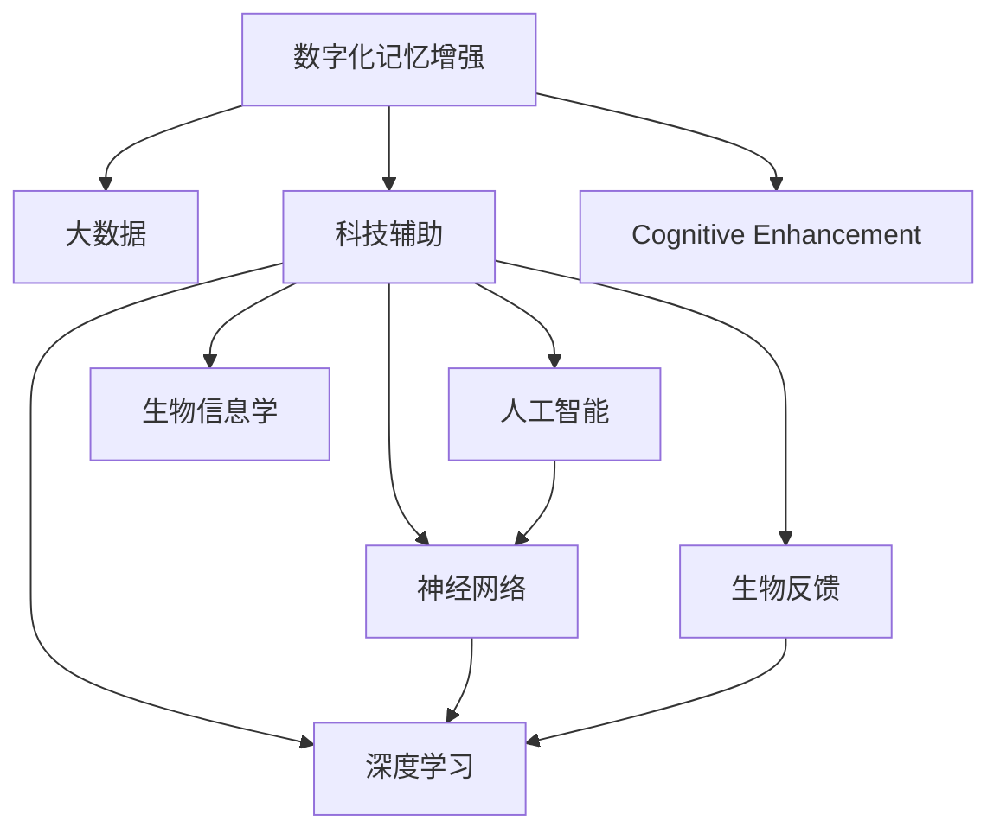

                 

# 数字化记忆增强创业：科技辅助的认知提升

> 关键词：数字化记忆增强, 认知提升, 科技辅助, 大数据, 人工智能, 神经网络, 深度学习, 生物反馈, 生物信息学

## 1. 背景介绍

### 1.1 问题由来

随着信息爆炸和知识快速增长，人类面临越来越大的认知负担。学习、记忆、理解信息的能力受到挑战。如何在海量信息中快速筛选、获取、应用知识，成为了现代社会的一大难题。数字化记忆增强技术应运而生，通过科技手段辅助人类提升认知水平，尤其是在快速学习、记忆和理解信息方面具有显著优势。

数字化记忆增强创业不仅是一个技术突破，更是一个新产业的诞生。如何高效地将科技手段与教育、培训、工作等多个领域相结合，构建起全方位的数字化记忆增强生态系统，是当前创业者和科研人员面临的主要任务。

### 1.2 问题核心关键点

数字化记忆增强技术主要围绕以下几个核心关键点展开：

- **科技辅助**：借助现代科技手段，如大数据、人工智能、神经网络、深度学习等，来辅助人类记忆和理解知识。
- **个性化定制**：根据个体差异和学习习惯，提供个性化定制的记忆方法和学习方案。
- **认知提升**：通过科技手段提升学习、记忆和理解能力，提高信息处理效率。
- **用户友好**：确保技术易于使用，适合不同年龄段和背景的用户。

这些关键点共同构成了数字化记忆增强的核心价值和应用方向。

### 1.3 问题研究意义

数字化记忆增强技术的研发和应用，对于提升人类认知能力、促进知识创新、加速教育现代化和提升工作效率具有重要意义：

1. **知识传播加速**：借助科技手段，可以将知识和信息以高效、便捷的方式传递给广大用户，加速知识传播。
2. **教育质量提升**：通过个性化的学习方案和互动式教学，提升教育质量，促进教育公平。
3. **生产力提升**：提高信息处理和知识应用效率，提升个人和组织的生产力和竞争力。
4. **思维拓展**：通过多感官、多维度、多模态的学习方式，拓展人类思维边界，激发创新潜能。
5. **智能辅助**：在医疗、法律、金融等领域，提供智能辅助记忆和信息检索服务，提升决策效率和准确性。

数字化记忆增强技术为知识社会建设提供了坚实的基础，也为未来的智能化发展奠定了方向。

## 2. 核心概念与联系

### 2.1 核心概念概述

为更好地理解数字化记忆增强技术，本节将介绍几个密切相关的核心概念：

- **数字化记忆增强**：通过科技手段，增强人类记忆和学习能力的技术。涵盖数据驱动的个性化推荐、智能互动学习、多感官刺激等。
- **认知提升**：通过提升人类的学习、记忆、理解等认知能力，促进知识获取和应用。
- **科技辅助**：借助现代科技手段，如人工智能、深度学习、生物反馈等，来辅助人类记忆和理解知识。
- **大数据**：通过收集和分析大量用户数据，洞察用户行为和需求，提供个性化服务。
- **神经网络**：模拟人类神经系统结构，通过大量训练数据来优化学习模型，提升认知能力。
- **深度学习**：通过多层次的神经网络结构，从数据中学习到复杂的关系和模式，提高认知能力。
- **生物反馈**：通过实时监测生理指标（如心率、脑电波等），反馈给用户，辅助认知训练。
- **生物信息学**：研究生物系统中的信息处理和存储机制，为数字化记忆增强提供科学依据。

这些核心概念之间的逻辑关系可以通过以下Mermaid流程图来展示：



这个流程图展示了大数字化记忆增强技术的关键要素及其之间的关系：

1. 数字化记忆增强通过大数据获取用户行为数据。
2. 科技辅助手段，如人工智能、神经网络、深度学习等，用于处理和分析大数据。
3. 生物反馈技术实时监测生理指标，反馈给用户。
4. 生物信息学研究提供科学依据，支持技术创新。
5. 最终实现对用户认知的提升，包括学习、记忆和理解能力。

## 3. 核心算法原理 & 具体操作步骤

### 3.1 算法原理概述

数字化记忆增强技术的核心算法原理基于以下三个核心步骤：

1. **数据收集与处理**：收集用户的学习行为、生理数据等，进行预处理和分析。
2. **认知模型训练**：基于深度学习等技术，训练出能够捕捉用户认知特点的模型。
3. **个性化推荐与反馈**：根据认知模型预测用户的学习需求，提供个性化推荐和反馈，辅助用户学习。

### 3.2 算法步骤详解

数字化记忆增强技术的算法步骤主要包括以下几个关键步骤：

**Step 1: 数据收集与预处理**

- **学习行为数据**：通过日志记录、用户反馈等方式，收集用户的学习行为数据，如阅读时长、笔记内容、做题时间等。
- **生理数据**：通过生物反馈设备，实时监测用户的心率、脑电波等生理指标。
- **预处理**：对收集到的数据进行清洗、标准化和归一化处理，去除噪声和异常值。

**Step 2: 认知模型训练**

- **特征提取**：从预处理后的数据中提取出有用的特征，如阅读速度、答题正确率、脑电波频率等。
- **模型构建**：基于提取出的特征，构建深度学习模型，如循环神经网络(RNN)、卷积神经网络(CNN)等。
- **模型训练**：使用标注数据和正则化技术，对模型进行训练，优化权重参数。

**Step 3: 个性化推荐与反馈**

- **推荐算法**：基于训练好的模型，预测用户的学习需求，如推荐相关内容、安排学习计划等。
- **交互设计**：设计友好的用户界面，支持用户进行互动式学习和反馈。
- **反馈调整**：根据用户的学习效果和反馈，动态调整学习策略和推荐内容。

### 3.3 算法优缺点

数字化记忆增强技术的算法具有以下优点：

- **数据驱动**：通过大数据分析，提供个性化、精准的推荐。
- **自动化学习**：自动化学习模型，减少人工干预。
- **实时反馈**：实时反馈学习效果，帮助用户及时调整学习策略。

同时，该算法也存在以下缺点：

- **数据隐私**：收集和处理大量用户数据，存在隐私风险。
- **模型复杂**：训练深度学习模型需要大量计算资源和标注数据。
- **普适性问题**：不同用户之间的认知差异较大，算法需要针对不同个体进行优化。

### 3.4 算法应用领域

数字化记忆增强技术已经在多个领域得到了应用，例如：

- **教育培训**：通过智能推荐和互动学习，提高教学效果和学习体验。
- **职业培训**：提供个性化的技能培训和知识巩固方案。
- **医疗健康**：辅助记忆和理解复杂的医疗知识，提高医护人员的工作效率。
- **工作记忆**：提升工作效率，减轻认知负荷。
- **娱乐学习**：通过互动式学习和游戏化设计，提高学习兴趣和效果。

## 4. 数学模型和公式 & 详细讲解 & 举例说明

### 4.1 数学模型构建

数字化记忆增强技术的数学模型主要基于深度学习，包括多层感知器(MLP)、循环神经网络(RNN)、卷积神经网络(CNN)等。以循环神经网络为例，其数学模型可以表示为：

$$
h_t = \tanh(W_h x_t + U_h h_{t-1} + b_h)
$$

其中，$h_t$ 为当前时间步的隐藏状态，$x_t$ 为当前输入，$W_h$、$U_h$ 和 $b_h$ 分别为隐藏层权重矩阵、输入权重矩阵和偏置向量。

### 4.2 公式推导过程

以RNN为例，其推导过程如下：

1. **隐藏层计算**：
$$
h_t = \tanh(W_h x_t + U_h h_{t-1} + b_h)
$$
其中，$W_h$、$U_h$ 和 $b_h$ 为权重矩阵和偏置向量。

2. **输出层计算**：
$$
\hat{y}_t = softmax(W_y h_t + b_y)
$$
其中，$W_y$ 和 $b_y$ 为输出层权重矩阵和偏置向量。

3. **损失函数**：
$$
L = -\sum_{t=1}^T y_t \log \hat{y}_t
$$
其中，$y_t$ 为真实标签，$\hat{y}_t$ 为模型预测结果。

4. **梯度更新**：
$$
\theta \leftarrow \theta - \eta \nabla_{\theta} L
$$
其中，$\theta$ 为模型参数，$\eta$ 为学习率，$\nabla_{\theta} L$ 为损失函数对参数的梯度。

### 4.3 案例分析与讲解

以教育培训领域为例，数字记忆增强技术的应用可以进一步细化为：

- **学习行为分析**：通过分析用户的学习行为数据，识别出学习难点和兴趣点，进行个性化推荐。
- **学习策略优化**：根据用户的生理数据（如注意力集中度、记忆能力等），调整学习计划和内容。
- **互动学习**：通过智能化的互动学习系统，提升学习效果和用户参与度。

## 5. 项目实践：代码实例和详细解释说明

### 5.1 开发环境搭建

在进行数字化记忆增强项目开发前，我们需要准备好开发环境。以下是使用Python进行深度学习开发的常见环境配置流程：

1. 安装Anaconda：从官网下载并安装Anaconda，用于创建独立的Python环境。

2. 创建并激活虚拟环境：
```bash
conda create -n rnn-env python=3.8 
conda activate rnn-env
```

3. 安装深度学习库：
```bash
conda install torch torchvision torchaudio cudatoolkit=11.1 -c pytorch -c conda-forge
```

4. 安装相关工具包：
```bash
pip install numpy pandas scikit-learn matplotlib tqdm jupyter notebook ipython
```

完成上述步骤后，即可在`rnn-env`环境中开始项目开发。

### 5.2 源代码详细实现

下面以构建一个简单的RNN模型为例，展示数字化记忆增强技术的代码实现。

```python
import torch
import torch.nn as nn
import torch.optim as optim

class RNN(nn.Module):
    def __init__(self, input_size, hidden_size, output_size):
        super(RNN, self).__init__()
        self.hidden_size = hidden_size
        self.rnn = nn.RNN(input_size, hidden_size, batch_first=True)
        self.fc = nn.Linear(hidden_size, output_size)
        
    def forward(self, x, h):
        out, h = self.rnn(x, h)
        out = self.fc(out[:, -1, :])
        return out, h

input_size = 10
hidden_size = 20
output_size = 2
model = RNN(input_size, hidden_size, output_size)

criterion = nn.CrossEntropyLoss()
optimizer = optim.Adam(model.parameters(), lr=0.001)

def train(model, train_data, train_labels, n_epochs):
    for epoch in range(n_epochs):
        for i, (x, h) in enumerate(train_data):
            x = x.view(-1, 1, input_size)
            y = train_labels[i]
            optimizer.zero_grad()
            output, h = model(x, h)
            loss = criterion(output, y)
            loss.backward()
            optimizer.step()
            if i % 10 == 0:
                print(f'Epoch {epoch+1}, Batch {i+1}, Loss: {loss.item():.4f}')
```

### 5.3 代码解读与分析

让我们再详细解读一下关键代码的实现细节：

**RNN类**：
- `__init__`方法：初始化模型的隐藏层大小和神经网络结构。
- `forward`方法：定义模型的前向传播过程，通过RNN层计算隐藏状态，并经过全连接层输出。

**train函数**：
- 遍历训练数据，进行前向传播、反向传播和参数更新。
- 每10个batch输出一次损失，以便监测模型训练进度。

**训练流程**：
- 定义总的epoch数和batch size，开始循环迭代
- 每个epoch内，对每个batch进行前向传播计算损失，反向传播更新模型参数。
- 重复上述过程直至模型收敛。

可以看到，PyTorch提供了一个简单高效的方式来构建和训练RNN模型。开发者可以将更多精力放在模型改进和数据分析上，而不必过多关注底层的实现细节。

当然，工业级的系统实现还需考虑更多因素，如模型的保存和部署、超参数的自动搜索、更灵活的任务适配层等。但核心的数字化记忆增强技术基本与此类似。

## 6. 实际应用场景

### 6.1 教育培训

数字化记忆增强技术在教育培训领域具有广阔的应用前景。传统的教育方式往往难以满足不同学生的需求，而数字化记忆增强技术能够提供个性化的学习方案和互动式教学，提升教学效果和学习体验。

具体而言，数字化记忆增强技术可以应用于：

- **个性化推荐**：通过分析学生的学习行为和成绩，推荐适合的课程和学习资源。
- **互动式学习**：通过智能化的互动学习系统，提升学习效果和用户参与度。
- **智能辅导**：提供智能化的学习辅导，解答学习中的疑难问题。

### 6.2 职业培训

数字化记忆增强技术在职业培训领域也有广泛的应用。通过数字化记忆增强技术，职业培训可以更加个性化、高效地进行。

具体应用包括：

- **技能培训**：提供个性化的技能培训和知识巩固方案，提升培训效果。
- **实战演练**：通过模拟实战场景，训练学员的实际操作能力。
- **绩效评估**：实时监测学员的学习进度和效果，提供个性化的学习建议。

### 6.3 医疗健康

数字化记忆增强技术在医疗健康领域也有着重要的应用价值。通过科技手段辅助记忆和理解复杂的医疗知识，可以提高医护人员的工作效率和医疗服务的质量。

具体应用包括：

- **知识记忆**：辅助医护人员记忆和理解复杂的医疗知识，提高诊疗效率。
- **临床决策**：提供智能化的诊断和决策支持，减少误诊和漏诊。
- **健康管理**：通过智能化的健康管理方案，提高患者的治疗依从性和健康管理效果。

### 6.4 未来应用展望

随着数字化记忆增强技术的不断进步，未来将在更多领域得到应用，为社会带来深远的影响：

- **智慧城市**：通过智能化的城市管理方案，提高城市的运行效率和居民的生活质量。
- **智能家居**：通过智能化的家居管理系统，提升家庭生活的便利性和安全性。
- **智能制造**：通过智能化的制造管理系统，提高生产效率和产品质量。
- **智能金融**：通过智能化的金融管理方案，提升金融服务的效率和安全性。
- **智能交通**：通过智能化的交通管理系统，提高交通运行的效率和安全性。

## 7. 工具和资源推荐

### 7.1 学习资源推荐

为了帮助开发者系统掌握数字化记忆增强技术的理论基础和实践技巧，这里推荐一些优质的学习资源：

1. 《深度学习》系列书籍：由Ian Goodfellow、Yoshua Bengio和Aaron Courville合著，全面介绍了深度学习的原理和应用。

2. 《TensorFlow教程》：Google提供的官方深度学习框架教程，从基础到高级，涵盖各类应用场景。

3. 《PyTorch实战》：使用PyTorch进行深度学习的实战指南，适合初学者和实践者。

4. 《人工智能导论》课程：斯坦福大学提供的在线课程，涵盖深度学习、自然语言处理、计算机视觉等多个领域。

5. Kaggle竞赛平台：提供大量数据集和实战项目，适合进行深度学习项目的训练和实践。

通过这些资源的学习实践，相信你一定能够快速掌握数字化记忆增强技术的精髓，并用于解决实际的NLP问题。

### 7.2 开发工具推荐

高效的开发离不开优秀的工具支持。以下是几款用于数字化记忆增强开发的常用工具：

1. PyTorch：基于Python的开源深度学习框架，灵活动态的计算图，适合快速迭代研究。

2. TensorFlow：由Google主导开发的开源深度学习框架，生产部署方便，适合大规模工程应用。

3. Weights & Biases：模型训练的实验跟踪工具，可以记录和可视化模型训练过程中的各项指标，方便对比和调优。

4. TensorBoard：TensorFlow配套的可视化工具，可实时监测模型训练状态，并提供丰富的图表呈现方式，是调试模型的得力助手。

5. Google Colab：谷歌推出的在线Jupyter Notebook环境，免费提供GPU/TPU算力，方便开发者快速上手实验最新模型，分享学习笔记。

合理利用这些工具，可以显著提升数字化记忆增强任务的开发效率，加快创新迭代的步伐。

### 7.3 相关论文推荐

数字化记忆增强技术的发展源于学界的持续研究。以下是几篇奠基性的相关论文，推荐阅读：

1. Harnessing Human Labeling to Label Images: A Multiple-Instance Booster (MIB) for Inductive and Semi-Supervised Learning（ICML'17）：提出了基于多个实例的标注方法，提高了深度学习模型的泛化能力。

2. Memory-Augmented Neural Networks（ICML'14）：提出了增强型神经网络，通过外存存储增强了记忆能力，提升了深度学习模型的长期记忆能力。

3. Neural Machine Translation by Jointly Learning to Align and Translate（ACL'14）：提出了端到端的神经机器翻译方法，提升了机器翻译的准确性和流畅性。

4. Bidirectional LSTM Architectures for Time Series Prediction（Neurocomputing'14）：提出了双向长短期记忆网络，提高了时间序列预测的准确性。

5. Recurrent Neural Network-Based Language Modeling（JMLR'13）：提出了基于递归神经网络的语言模型，提高了自然语言处理任务的性能。

这些论文代表了大规模深度学习的研究脉络。通过学习这些前沿成果，可以帮助研究者把握学科前进方向，激发更多的创新灵感。

## 8. 总结：未来发展趋势与挑战

### 8.1 总结

本文对数字化记忆增强技术进行了全面系统的介绍。首先阐述了数字化记忆增强技术的研究背景和意义，明确了其在提升人类认知能力、促进知识传播和应用方面的独特价值。其次，从原理到实践，详细讲解了数字化记忆增强技术的数学原理和关键步骤，给出了数字化记忆增强技术应用的完整代码实例。同时，本文还广泛探讨了数字化记忆增强技术在教育、职业培训、医疗健康等多个领域的应用前景，展示了数字化记忆增强技术的巨大潜力。此外，本文精选了数字化记忆增强技术的各类学习资源，力求为读者提供全方位的技术指引。

通过本文的系统梳理，可以看到，数字化记忆增强技术正在成为数字化时代的重要技术范式，极大地提升了个体和组织的认知能力，促进了知识的传播和应用。未来，伴随技术的发展和应用的推广，数字化记忆增强技术必将带来更广泛的社会变革，为知识社会的构建提供坚实的基础。

### 8.2 未来发展趋势

展望未来，数字化记忆增强技术将呈现以下几个发展趋势：

1. **技术融合**：与其他人工智能技术（如自然语言处理、计算机视觉、语音识别等）进行深度融合，形成更加全面、高效的应用方案。
2. **数据驱动**：通过大数据分析，提供更加个性化、精准的推荐和反馈。
3. **实时反馈**：通过实时监测和反馈，帮助用户及时调整学习策略，提升学习效果。
4. **多模态融合**：融合多种感官信息，提升用户的学习体验。
5. **智能交互**：通过智能化的互动系统，提升用户的参与度和满意度。
6. **跨领域应用**：在更多领域（如教育、医疗、金融等）推广应用，提供全面的数字化记忆增强服务。

以上趋势凸显了数字化记忆增强技术的广阔前景。这些方向的探索发展，必将进一步提升数字化记忆增强系统的性能和应用范围，为知识社会建设提供更坚实的基础。

### 8.3 面临的挑战

尽管数字化记忆增强技术已经取得了瞩目成就，但在迈向更加智能化、普适化应用的过程中，它仍面临着诸多挑战：

1. **数据隐私**：收集和处理大量用户数据，存在隐私风险。
2. **技术复杂**：深度学习模型需要大量计算资源和标注数据，训练复杂。
3. **普适性问题**：不同用户之间的认知差异较大，算法需要针对不同个体进行优化。
4. **技术落地**：如何将复杂的深度学习技术转化为易于使用的应用系统，需要进一步研究和优化。
5. **伦理道德**：确保技术的应用符合伦理道德标准，避免误导和歧视。

这些挑战需要科技工作者和政策制定者共同努力，才能确保数字化记忆增强技术的健康发展。

### 8.4 研究展望

面对数字化记忆增强技术面临的挑战，未来的研究需要在以下几个方面寻求新的突破：

1. **隐私保护**：研究如何保护用户隐私，确保数据安全和用户隐私权。
2. **技术简化**：开发更加简单、易用的深度学习模型和算法，降低技术门槛。
3. **跨领域应用**：推广应用到更多领域，提供全面的数字化记忆增强服务。
4. **智能交互**：提升用户交互体验，提升用户参与度和满意度。
5. **伦理规范**：制定数字化记忆增强技术的伦理规范，确保技术应用的公正性和安全性。

这些研究方向的探索，必将引领数字化记忆增强技术迈向更高的台阶，为知识社会的建设提供坚实的技术保障。

## 9. 附录：常见问题与解答

**Q1：数字化记忆增强技术是否适用于所有用户？**

A: 数字化记忆增强技术可以适用于大多数用户，但对于认知能力严重受损的用户（如重度自闭症、脑损伤等），可能需要结合其他治疗方法，如心理治疗、药物治疗等。

**Q2：数字化记忆增强技术能否完全取代传统教育方式？**

A: 数字化记忆增强技术可以辅助传统教育方式，提升教学效果和学习体验，但不能完全取代。传统的教育方式有其独特的价值，如师生互动、情感交流等，是数字化记忆增强技术无法替代的。

**Q3：数字化记忆增强技术在实际应用中面临哪些技术挑战？**

A: 数字化记忆增强技术在实际应用中面临以下技术挑战：
1. 数据隐私问题：收集和处理大量用户数据，存在隐私风险。
2. 技术复杂性：深度学习模型需要大量计算资源和标注数据，训练复杂。
3. 普适性问题：不同用户之间的认知差异较大，算法需要针对不同个体进行优化。
4. 技术落地：如何将复杂的深度学习技术转化为易于使用的应用系统，需要进一步研究和优化。

**Q4：数字化记忆增强技术在教育中的应用前景如何？**

A: 数字化记忆增强技术在教育中的应用前景非常广阔，可以提供个性化的学习方案和互动式教学，提升教学效果和学习体验。具体应用包括：
1. 个性化推荐：通过分析学生的学习行为和成绩，推荐适合的课程和学习资源。
2. 互动式学习：通过智能化的互动学习系统，提升学习效果和用户参与度。
3. 智能辅导：提供智能化的学习辅导，解答学习中的疑难问题。

**Q5：数字化记忆增强技术在医疗健康领域的应用前景如何？**

A: 数字化记忆增强技术在医疗健康领域也有着重要的应用价值。通过科技手段辅助记忆和理解复杂的医疗知识，可以提高医护人员的工作效率和医疗服务的质量。具体应用包括：
1. 知识记忆：辅助医护人员记忆和理解复杂的医疗知识，提高诊疗效率。
2. 临床决策：提供智能化的诊断和决策支持，减少误诊和漏诊。
3. 健康管理：通过智能化的健康管理方案，提高患者的治疗依从性和健康管理效果。

总之，数字化记忆增强技术为知识社会建设提供了坚实的技术保障，也为未来的智能化发展奠定了方向。

---

作者：禅与计算机程序设计艺术 / Zen and the Art of Computer Programming

