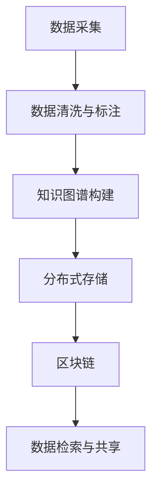

                 

# 数字化记忆存储:全球脑时代的知识传承

## 1. 背景介绍

随着信息技术与互联网的蓬勃发展，我们正步入一个被称为"全球脑时代"的全新阶段。在这个时代，知识不再是仅以纸质书籍、文件档案等物理介质存储，而是借助数字化手段，以全球互联的云平台为基础，实时生成、传播和共享。数字化记忆存储不仅是信息科技发展的必然趋势，更是人类智慧传承与创新的重要工具。本文将深入探讨数字化记忆存储的核心概念、技术原理及其在各个领域的广泛应用，并展望未来发展方向。

## 2. 核心概念与联系

### 2.1 核心概念概述

在讨论数字化记忆存储之前，首先要理解以下几个核心概念：

- **数字化记忆存储**：通过数字技术和互联网平台，将人类智慧、知识和经验的记录与存储，以数字形式进行管理和传承。数字化记忆存储系统通常包括数据采集、存储、检索和共享等环节。

- **知识图谱**：一种基于图结构的语义知识表示方法，用于描述实体、属性和它们之间的关系。知识图谱是数字化记忆存储中用于构建知识体系的重要工具。

- **分布式存储**：一种通过网络分散存储数据的机制，通过多台计算机协同工作，共同完成数据的读取、存储和处理，确保数据的可用性和可靠性。

- **区块链**：一种去中心化的分布式数据库技术，通过共识机制，确保数据的安全性和透明性。区块链在数字化记忆存储中主要应用于确保数据不可篡改和可追溯。

- **数据标注与清洗**：对原始数据进行清洗和标注，去除噪音，提取有用信息，为数字化记忆存储提供高质量的输入数据。

这些概念共同构成了数字化记忆存储的生态系统，通过信息的数字化记录和存储，实现知识的有效传承与创新。

### 2.2 核心概念原理和架构的 Mermaid 流程图



这个流程图展示了数字化记忆存储的总体流程：首先从各类信息源采集数据，然后进行数据清洗和标注，构建知识图谱，接着通过分布式存储和区块链技术将数据安全地存储和共享，最后用户可以通过检索系统获取所需信息。

## 3. 核心算法原理 & 具体操作步骤

### 3.1 算法原理概述

数字化记忆存储的核心在于如何将人类的知识、智慧和经验通过数字化手段进行有效的记录、存储、检索和共享。这需要一系列的技术支持和算法原理的支撑，包括但不限于自然语言处理、图像识别、分布式存储、区块链和数据标注等。

### 3.2 算法步骤详解

数字化记忆存储的算法流程大致可分为以下几个步骤：

1. **数据采集**：从各类信息源采集数据，包括但不限于文本、图像、视频、音频等。
2. **数据清洗与标注**：对原始数据进行清洗和标注，去除噪音，提取有用信息。
3. **知识图谱构建**：利用自然语言处理和图像识别技术，将清洗后的数据构建为语义化的知识图谱。
4. **分布式存储**：通过分布式存储技术，将知识图谱等数据分散存储于多台计算机中，确保数据的可用性和可靠性。
5. **区块链技术应用**：利用区块链的分布式共识机制，确保数据的透明性和不可篡改性。
6. **数据检索与共享**：通过检索系统，用户可以快速找到所需信息并进行共享。

### 3.3 算法优缺点

数字化记忆存储的算法具有以下优点：

- 高效性：分布式存储和区块链技术保证了数据的高可用性和安全性。
- 可扩展性：通过分布式技术，数据可以轻松扩展到全球各地。
- 透明度：区块链确保了数据的透明性和可追溯性。

但其缺点也不可忽视：

- 存储成本：大规模数据存储需要大量计算资源和存储设备。
- 数据隐私：如何在保障数据共享的同时保护用户隐私是个难题。
- 算法复杂性：分布式存储和区块链技术的应用增加了算法的复杂性。

### 3.4 算法应用领域

数字化记忆存储的应用领域非常广泛，包括但不限于以下几个方面：

- **教育**：通过数字化记忆存储，教育资源可以实时共享，学生可以随时随地获取优质教育资源。
- **科研**：研究人员可以通过共享和查阅各类数据和研究成果，加速科研进程。
- **医疗**：患者医疗记录、研究数据等可以通过数字化记忆存储进行有效管理和共享。
- **政府**：政府信息公开、数据共享等领域可以通过数字化记忆存储进行高效管理和访问。
- **金融**：金融数据、交易记录等可以通过数字化记忆存储进行管理和共享。

## 4. 数学模型和公式 & 详细讲解 & 举例说明

### 4.1 数学模型构建

数字化记忆存储的数学模型构建涉及多个方面，包括数据采集、清洗、标注、知识图谱构建等。以下简要介绍这些模型的构建过程。

### 4.2 公式推导过程

以知识图谱的构建为例，假设有两个节点 $A$ 和 $B$，它们之间存在一种关系 $R$。知识图谱构建的公式如下：

$$
\text{Graph}(A, B, R) = \{(A, R, B)\}
$$

其中，$A$ 和 $B$ 为节点，$R$ 为边，表示 $A$ 和 $B$ 之间存在关系 $R$。通过这种图结构，知识图谱将复杂的实体关系表示为可计算的图节点和边。

### 4.3 案例分析与讲解

在实际应用中，知识图谱可以帮助处理各类复杂信息。例如，在医疗领域，知识图谱可以将患者的病情、治疗记录等信息整合成一个语义化的结构，便于医生进行快速诊断和治疗决策。在科研领域，知识图谱可以整合各类文献、数据等资源，方便研究人员快速查找所需信息。

## 5. 项目实践：代码实例和详细解释说明

### 5.1 开发环境搭建

在进行数字化记忆存储系统开发前，需要准备以下开发环境：

1. 安装 Python 3.8 及以上版本，并确保 PyTorch、TensorFlow 等深度学习库已安装。
2. 安装分布式存储系统，如 Apache Hadoop 或 Apache Spark。
3. 安装区块链框架，如 Ethereum 或 Hyperledger Fabric。
4. 配置必要的服务器和数据库，用于存储和检索数据。

### 5.2 源代码详细实现

以下是一个简单的知识图谱构建的代码实现：

```python
import networkx as nx
import pandas as pd

# 数据清洗与标注
data = pd.read_csv('data.csv')
data = data.dropna()
data = data.drop_duplicates()

# 知识图谱构建
G = nx.Graph()
for i in range(len(data)):
    node_A = data['Node_A'][i]
    node_B = data['Node_B'][i]
    relationship = data['Relationship'][i]
    G.add_edge(node_A, node_B, relationship)

# 输出知识图谱
print(G.edges(data=True))
```

### 5.3 代码解读与分析

这段代码首先使用 Pandas 对数据进行清洗和标注，去除重复和缺失数据。接着，通过 NetworkX 构建知识图谱，将数据转化为图结构，并输出边的信息。

### 5.4 运行结果展示

运行上述代码后，输出结果将展示知识图谱的边和边的属性。例如：

```
[('Node_A', 'Relationship', 'Node_B', {'relationship': '关系类型'})]
```

这表示节点 $A$ 和节点 $B$ 之间存在一种关系类型，具体为 '关系类型'。

## 6. 实际应用场景

### 6.1 教育

在教育领域，数字化记忆存储可以极大地丰富教育资源。通过构建知识图谱，教育机构可以将各类教学资源、学术论文、视频课程等整合起来，形成统一的知识体系，便于学生和教师的学习和教学。

### 6.2 科研

科研领域是数字化记忆存储的重要应用之一。通过构建知识图谱，研究人员可以快速查找所需数据和文献，加速科研进程。同时，数字化记忆存储还可以帮助科研机构共享研究成果，促进跨领域合作。

### 6.3 医疗

医疗领域对数字化记忆存储的需求非常迫切。通过数字化记忆存储，医疗机构可以整合各类患者记录、研究数据等，形成统一的知识体系。医生可以通过查询系统快速获取患者的历史数据和病情信息，进行精准诊断和治疗。

### 6.4 政府

政府信息公开、数据共享等领域可以通过数字化记忆存储进行高效管理和访问。政府机构可以将各类公开信息、统计数据等整合到数字化记忆存储系统中，方便公众查询和利用。

### 6.5 金融

金融数据、交易记录等可以通过数字化记忆存储进行管理和共享。金融机构可以整合各类数据，进行风险评估和市场分析，提供更精准的金融服务。

## 7. 工具和资源推荐

### 7.1 学习资源推荐

1. 《深度学习与知识图谱》：详细介绍了深度学习和知识图谱的基础知识，适合初学者入门。
2. 《分布式系统设计与实现》：介绍了分布式存储和区块链技术，适合学习分布式系统设计。
3. 《自然语言处理基础》：介绍了自然语言处理的基本概念和算法，适合学习知识图谱构建。

### 7.2 开发工具推荐

1. PyTorch：基于 Python 的开源深度学习框架，支持分布式训练和推理。
2. TensorFlow：由 Google 主导的深度学习框架，支持分布式计算和模型优化。
3. Apache Hadoop：开源的分布式存储系统，支持大规模数据存储和处理。
4. Ethereum：区块链开源平台，支持智能合约和去中心化应用。
5. Hyperledger Fabric：开源的区块链框架，支持企业级区块链应用开发。

### 7.3 相关论文推荐

1. 《深度学习与知识图谱：理论、算法与应用》：深度学习与知识图谱结合的最新研究成果。
2. 《分布式存储与区块链技术综述》：介绍分布式存储和区块链技术的最新进展。
3. 《自然语言处理中的知识图谱构建》：介绍自然语言处理中知识图谱的构建方法。

## 8. 总结：未来发展趋势与挑战

### 8.1 研究成果总结

数字化记忆存储通过数字化技术，实现了人类知识的高效传承和创新。在教育、科研、医疗、政府、金融等领域，数字化记忆存储已经展现出巨大的应用潜力。然而，数字化记忆存储仍面临诸多挑战，如数据隐私保护、存储成本、算法复杂性等。

### 8.2 未来发展趋势

未来，数字化记忆存储将继续在各个领域发挥重要作用，发展趋势如下：

1. 智能化：通过机器学习和大数据技术，数字化记忆存储系统将变得更加智能，能够自动推荐相关内容，优化用户体验。
2. 全球化：随着全球互联网的普及，数字化记忆存储将进一步全球化，实现跨国界的知识共享和交流。
3. 隐私保护：隐私保护将成为数字化记忆存储发展的重要方向，通过区块链和加密技术，确保用户数据的安全性和隐私性。
4. 多模态融合：未来的数字化记忆存储将不仅仅局限于文本数据，将融合多模态数据，如图像、视频、音频等，提升知识表达的丰富性和多样性。
5. 跨领域应用：数字化记忆存储将跨越更多领域，推动各行业的数字化转型和创新。

### 8.3 面临的挑战

数字化记忆存储在未来的发展过程中，仍面临以下挑战：

1. 数据隐私保护：如何在保障数据共享的同时保护用户隐私是个难题。
2. 存储成本：大规模数据存储需要大量计算资源和存储设备，如何降低存储成本是个挑战。
3. 算法复杂性：分布式存储和区块链技术的应用增加了算法的复杂性。
4. 标准化问题：不同系统之间的数据互操作性仍需解决。

### 8.4 研究展望

未来，数字化记忆存储的研究方向将包括：

1. 智能推荐系统：通过机器学习和大数据技术，实现更智能的知识推荐。
2. 多模态融合技术：融合图像、视频、音频等多模态数据，提升知识表达的丰富性和多样性。
3. 隐私保护技术：通过区块链和加密技术，确保用户数据的安全性和隐私性。
4. 跨领域应用：推动各行业的数字化转型和创新。

总之，数字化记忆存储正在逐步改变人类知识的传承方式，未来将在各个领域发挥更重要的作用。通过不断创新和优化，数字化记忆存储将为人类智慧的传承与创新带来更广阔的空间。

## 9. 附录：常见问题与解答

**Q1：数字化记忆存储是否适用于所有信息源？**

A: 数字化记忆存储适用于各种信息源，包括文本、图像、视频、音频等。不同类型的信息源可以通过不同的技术手段进行数字化存储和处理。

**Q2：如何确保数字化记忆存储的安全性？**

A: 通过分布式存储和区块链技术，可以确保数字化记忆存储的安全性。区块链的分布式共识机制保证了数据的透明性和不可篡改性，分布式存储则提供了数据的冗余性和高可用性。

**Q3：如何处理大规模数据存储的成本问题？**

A: 可以通过优化算法和硬件资源配置，如使用分布式存储技术、压缩算法等，降低数据存储和管理的成本。同时，可以利用云计算平台提供的弹性存储和计算资源，按需使用，降低固定成本。

**Q4：如何处理数据的隐私保护问题？**

A: 通过加密技术和区块链的分布式存储，可以有效保护数据的隐私。加密技术可以确保数据在传输和存储过程中的安全性，而区块链的分布式存储则增加了数据被篡改的难度。

**Q5：如何处理算法的复杂性问题？**

A: 可以通过优化算法设计和资源配置，降低算法的复杂性。如使用高效的分布式算法、优化硬件资源配置等，可以提高算法的运行效率和性能。

---

作者：禅与计算机程序设计艺术 / Zen and the Art of Computer Programming

