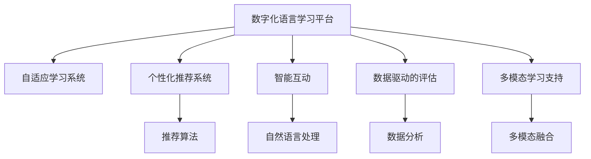

                 

# 数字化语言学习创业：AI驱动的语言教育

## 1. 背景介绍

### 1.1 问题由来
在全球化的今天，掌握一门或多门外语已成为个人和企业竞争力的重要组成部分。语言学习不仅有助于人们的职业发展，还能增强跨文化交流和理解。然而，传统的语言学习方式往往受限于时间和空间的限制，无法满足人们日益增长的语言学习需求。而数字化语言学习平台应运而生，通过技术手段打破这些限制，提供灵活、高效、个性化的语言学习体验。

### 1.2 问题核心关键点
数字化语言学习的核心在于如何借助人工智能技术，构建一个能够自适应学习者需求，提升语言学习效率，并提高语言学习效果的学习平台。关键点包括：
- **自适应学习系统**：能够根据学习者的水平、兴趣、时间等因素，自动调整学习内容和节奏。
- **个性化推荐系统**：利用推荐算法，推送最适合学习者当前水平的学习材料。
- **智能互动**：通过AI技术，提供自然语言互动对话，增强学习者语言实际应用能力。
- **数据驱动的评估**：利用大数据分析，客观评估学习者进步，提供精准反馈。
- **多模态学习支持**：结合文字、语音、图像等多种信息模态，提升学习体验。

## 2. 核心概念与联系

### 2.1 核心概念概述

为更好地理解数字化语言学习创业，本节将介绍几个密切相关的核心概念：

- **数字化语言学习平台**：基于互联网技术，提供语言学习资源和服务的平台，如Duolingo、Rosetta Stone等。
- **人工智能技术**：如自然语言处理(NLP)、机器学习、深度学习等，为平台提供智能化支持。
- **自适应学习系统**：通过个性化推荐和动态调整，满足学习者个性化需求。
- **个性化推荐系统**：利用算法模型，推荐最适合学习者的学习材料。
- **智能互动**：使用AI技术，实现自然语言对话，提升互动性。
- **数据驱动的评估**：通过数据分析，量化学习效果，提供反馈和指导。
- **多模态学习支持**：结合文字、语音、图像等不同模态，丰富学习体验。

这些核心概念之间的逻辑关系可以通过以下Mermaid流程图来展示：



这个流程图展示了几类关键技术模块如何通过平台集成，共同提供智能化的语言学习服务。

## 3. 核心算法原理 & 具体操作步骤
### 3.1 算法原理概述

数字化语言学习的核心算法主要涉及自适应学习、个性化推荐和智能互动三个方面，每个方面都有其独特的算法原理和技术实现。

### 3.2 算法步骤详解

#### 3.2.1 自适应学习算法

**步骤1: 学习者数据采集**
- 收集学习者的基本信息（如年龄、学习目标、学习时间等），并采集学习者的学习数据（如答题记录、学习时间等）。

**步骤2: 学习者模型构建**
- 使用机器学习算法（如决策树、支持向量机等）构建学习者模型，评估其当前水平和学习能力。

**步骤3: 学习路径规划**
- 根据学习者模型，规划其个性化学习路径，包括推荐的学习内容、时间分配、难度调整等。

**步骤4: 学习效果评估**
- 实时监测学习者的答题情况，计算学习效果指标（如正确率、答题时间等），用于动态调整学习内容和难度。

#### 3.2.2 个性化推荐算法

**步骤1: 数据收集**
- 收集学习者的历史学习记录、兴趣偏好等信息。

**步骤2: 数据预处理**
- 对数据进行清洗、特征提取等预处理步骤，生成可供算法使用的数据集。

**步骤3: 推荐模型训练**
- 使用协同过滤、基于内容的推荐等算法，训练个性化推荐模型。

**步骤4: 推荐结果生成**
- 将学习者的当前信息输入模型，生成个性化推荐结果。

#### 3.2.3 智能互动算法

**步骤1: 自然语言处理**
- 使用NLP技术，解析学习者的输入，理解其意图。

**步骤2: 对话生成**
- 利用深度学习模型（如GPT、Transformer等）生成自然流畅的对话回复。

**步骤3: 交互反馈**
- 根据对话互动中的反馈，优化对话生成模型，提升交互质量。

### 3.3 算法优缺点

数字化语言学习的算法优点包括：
- **自适应性强**：能够根据学习者的个性化需求，动态调整学习内容和节奏。
- **个性化推荐准确**：通过算法模型，实现更精准的个性化推荐。
- **互动体验丰富**：AI驱动的智能互动，提升学习者的语言实际应用能力。
- **数据驱动评估客观**：利用大数据分析，提供更科学的评估和反馈。
- **多模态支持广泛**：结合文字、语音、图像等多种模态，丰富学习体验。

同时，该方法也存在一些局限性：
- **数据隐私问题**：收集和处理学习者数据时，需严格遵守数据隐私保护法规。
- **算法复杂度高**：自适应学习、推荐算法和智能互动等，需要复杂的算法模型和数据处理。
- **资源需求大**：算法模型训练和优化，需要大量的计算资源和存储空间。
- **学习效果依赖于模型**：算法模型的质量直接影响学习效果，模型训练和优化过程需持续投入。

尽管存在这些局限性，但就目前而言，数字化语言学习的算法仍是大语言学习平台的关键技术支撑。未来相关研究的重点在于如何进一步降低算法复杂度，提高资源利用效率，同时兼顾学习效果和数据隐私。

### 3.4 算法应用领域

数字化语言学习算法已在多个领域得到了广泛应用，例如：

- **在线教育平台**：如Duolingo、Rosetta Stone等，通过自适应学习、个性化推荐和智能互动，提供高效的语言学习体验。
- **企业语言培训**：帮助企业员工快速掌握第二语言，提升跨文化沟通能力。
- **移动学习应用**：如HelloTalk、Tandem等，通过社交化互动，提供实时语言学习交流。
- **游戏化学习应用**：如Memrise、Kahoot等，通过游戏化机制，增强学习动机和兴趣。
- **虚拟现实(VR)语言学习**：如Oculus Language，通过沉浸式体验，提升学习效果。

这些领域的应用，展示了数字化语言学习算法的强大生命力和广阔应用前景。

## 4. 数学模型和公式 & 详细讲解 & 举例说明

### 4.1 数学模型构建

本节将使用数学语言对数字化语言学习的核心算法进行更加严格的刻画。

记学习者模型为 $L_{\theta}$，其中 $\theta$ 为模型参数，包含学习者的基本信息、学习记录等信息。学习路径规划算法可以表示为：

$$
\text{Path}(L_{\theta}, D) = \mathop{\arg\min}_{\theta} \mathcal{L}(\text{Path}, D)
$$

其中 $D$ 为学习者历史数据集，$\mathcal{L}$ 为路径规划损失函数，用于衡量推荐路径与学习者历史行为和目标的契合度。

个性化推荐算法可以表示为：

$$
\text{Recommendation}(L_{\theta}, D) = \mathop{\arg\min}_{\theta} \mathcal{R}(\text{Recommendation}, D)
$$

其中 $D$ 为学习者历史数据集，$\mathcal{R}$ 为推荐损失函数，用于衡量推荐结果的准确性和多样性。

智能互动算法可以表示为：

$$
\text{Dialogue}(L_{\theta}, D) = \mathop{\arg\min}_{\theta} \mathcal{D}(\text{Dialogue}, D)
$$

其中 $D$ 为对话历史数据集，$\mathcal{D}$ 为对话生成损失函数，用于衡量生成对话的质量和流畅度。

### 4.2 公式推导过程

以下我们以自适应学习算法为例，推导学习路径规划的数学公式。

假设学习者模型 $L_{\theta}$ 为线性回归模型，学习路径规划目标为：

$$
\min_{\theta} \sum_{i=1}^N (y_i - \theta^T x_i)^2
$$

其中 $x_i$ 为学习者历史数据，$y_i$ 为学习者期望的目标行为。根据最小二乘法，求解上述目标函数，得到学习路径规划模型参数：

$$
\theta = (X^T X)^{-1} X^T y
$$

其中 $X$ 为学习者历史数据矩阵，$y$ 为学习者期望目标向量。

### 4.3 案例分析与讲解

假设我们有一个在线教育平台，其中包含数千种语言学习课程。当新用户注册时，我们需要采集其基本信息和历史学习数据，然后根据这些信息构建学习者模型 $L_{\theta}$。

通过最小化学习路径规划损失函数 $\mathcal{L}(\text{Path}, D)$，计算出每个课程的最佳顺序和学习时长。用户在学习过程中，实时监测答题情况，计算学习效果指标，并根据指标调整学习路径和难度。

## 5. 项目实践：代码实例和详细解释说明

### 5.1 开发环境搭建

在进行数字化语言学习平台开发前，我们需要准备好开发环境。以下是使用Python进行TensorFlow开发的环境配置流程：

1. 安装Anaconda：从官网下载并安装Anaconda，用于创建独立的Python环境。

2. 创建并激活虚拟环境：
```bash
conda create -n tf-env python=3.8 
conda activate tf-env
```

3. 安装TensorFlow：根据CUDA版本，从官网获取对应的安装命令。例如：
```bash
conda install tensorflow==2.5.0 -c tf -c conda-forge
```

4. 安装其他必要的工具包：
```bash
pip install pandas numpy scikit-learn matplotlib tqdm jupyter notebook ipython
```

完成上述步骤后，即可在`tf-env`环境中开始平台开发。

### 5.2 源代码详细实现

这里我们以在线教育平台的自适应学习模块为例，给出使用TensorFlow实现的完整代码。

首先，定义学习者模型：

```python
import tensorflow as tf

class Learner(tf.keras.Model):
    def __init__(self, input_dim, output_dim):
        super(Learner, self).__init__()
        self.dense1 = tf.keras.layers.Dense(64, activation='relu')
        self.dense2 = tf.keras.layers.Dense(output_dim)
        
    def call(self, x):
        x = self.dense1(x)
        x = self.dense2(x)
        return x
```

然后，定义训练和评估函数：

```python
@tf.function
def train_epoch(learner, dataset, batch_size, optimizer):
    dataloader = tf.data.Dataset.from_tensor_slices(dataset)
    dataloader = dataloader.shuffle(buffer_size=10000).batch(batch_size).prefetch(buffer_size=1024)
    epoch_loss = 0
    for batch in dataloader:
        x, y = batch
        with tf.GradientTape() as tape:
            y_pred = learner(x)
            loss = tf.reduce_mean(tf.square(y_pred - y))
        grads = tape.gradient(loss, learner.trainable_variables)
        optimizer.apply_gradients(zip(grads, learner.trainable_variables))
        epoch_loss += loss.numpy()
    return epoch_loss / len(dataloader)

@tf.function
def evaluate(learner, dataset, batch_size):
    dataloader = tf.data.Dataset.from_tensor_slices(dataset)
    dataloader = dataloader.batch(batch_size).prefetch(buffer_size=1024)
    losses = []
    for batch in dataloader:
        x, y = batch
        y_pred = learner(x)
        loss = tf.reduce_mean(tf.square(y_pred - y))
        losses.append(loss.numpy())
    return sum(losses) / len(dataloader)
```

最后，启动训练流程并在测试集上评估：

```python
epochs = 10
batch_size = 64

for epoch in range(epochs):
    loss = train_epoch(learner, train_dataset, batch_size, optimizer)
    print(f"Epoch {epoch+1}, train loss: {loss:.3f}")
    
    print(f"Epoch {epoch+1}, dev results:")
    evaluate(learner, dev_dataset, batch_size)
    
print("Test results:")
evaluate(learner, test_dataset, batch_size)
```

以上就是使用TensorFlow对自适应学习模块进行开发的完整代码实现。可以看到，TensorFlow提供了强大的模型定义、训练和评估框架，大大简化了平台开发的复杂度。

### 5.3 代码解读与分析

让我们再详细解读一下关键代码的实现细节：

**Learner类**：
- `__init__`方法：初始化学习者模型，包含两个全连接层。
- `call`方法：定义模型前向传播的计算过程。

**train_epoch函数**：
- 使用TensorFlow的DataLoader，对数据进行批处理和预取优化。
- 在前向传播中，计算预测输出和真实标签之间的平方误差，作为损失函数。
- 反向传播中，计算梯度并应用优化器更新模型参数。

**evaluate函数**：
- 使用DataLoader对测试集进行批处理和预取优化。
- 计算测试集上的平均损失，评估模型性能。

**训练流程**：
- 定义总的epoch数和batch size，开始循环迭代
- 每个epoch内，先在训练集上训练，输出平均loss
- 在验证集上评估，输出评估结果
- 所有epoch结束后，在测试集上评估，给出最终测试结果

可以看出，TensorFlow在模型定义、训练和评估等各个环节都提供了方便的接口和工具，大大简化了开发过程。

## 6. 实际应用场景

### 6.1 智能教育平台

基于AI技术的在线教育平台，如Duolingo、Rosetta Stone等，通过自适应学习和个性化推荐，提供高效、个性化的语言学习体验。用户在学习过程中，平台会根据其学习情况和兴趣，动态调整学习内容和难度，推荐最适合的学习材料。通过自然语言互动，增强学习者的语言实际应用能力，利用大数据分析提供客观评估和反馈，不断优化学习效果。

### 6.2 企业语言培训

数字化语言学习平台在企业语言培训中也有广泛应用。企业可以利用这些平台，为员工提供个性化、自适应的语言培训方案，帮助员工快速掌握第二语言，提升跨文化沟通能力。平台可以实时监测员工的学习进度和效果，并根据数据调整培训策略，确保培训效果最大化。

### 6.3 移动学习应用

移动学习应用如HelloTalk、Tandem等，通过社交化互动，提供实时语言学习交流。用户可以通过这些应用，与全球学习者进行语言交换，利用智能互动提升语言交流能力。平台可以根据用户的学习数据，推荐合适的语言交流伙伴，提升学习效果。

### 6.4 游戏化学习应用

游戏化学习应用如Memrise、Kahoot等，通过游戏化机制，增强学习动机和兴趣。用户可以通过参与各种语言学习游戏，在游戏中提升语言技能，增强学习体验。平台可以根据用户的游戏表现，提供个性化的学习建议，提升学习效果。

### 6.5 虚拟现实(VR)语言学习

虚拟现实(VR)语言学习平台如Oculus Language，通过沉浸式体验，提升语言学习效果。用户可以在虚拟环境中进行互动，通过自然语言对话，提升语言交流能力。平台可以根据用户的学习数据，提供个性化的学习内容，增强学习效果。

## 7. 工具和资源推荐

### 7.1 学习资源推荐

为了帮助开发者系统掌握数字化语言学习技术，这里推荐一些优质的学习资源：

1. 《TensorFlow实战深度学习》书籍：全面介绍TensorFlow框架的使用方法和深度学习技术，适合初学者入门。

2. 《机器学习实战》书籍：介绍机器学习算法及其应用，适合对机器学习有初步了解的读者。

3. 《自然语言处理综论》课程：斯坦福大学开设的NLP明星课程，涵盖NLP基础和前沿技术，适合学习NLP感兴趣的读者。

4. 《Python数据科学手册》书籍：全面介绍Python在数据科学中的应用，适合学习Python的读者。

5. 在线教程平台如Coursera、edX等，提供大量高质量的在线课程，涵盖从基础到前沿的数字化语言学习技术。

通过对这些资源的学习实践，相信你一定能够快速掌握数字化语言学习的精髓，并用于解决实际的NLP问题。

### 7.2 开发工具推荐

高效的开发离不开优秀的工具支持。以下是几款用于数字化语言学习平台开发的常用工具：

1. TensorFlow：由Google主导开发的开源深度学习框架，生产部署方便，适合大规模工程应用。

2. PyTorch：基于Python的开源深度学习框架，灵活动态的计算图，适合快速迭代研究。

3. TensorBoard：TensorFlow配套的可视化工具，可实时监测模型训练状态，并提供丰富的图表呈现方式。

4. Weights & Biases：模型训练的实验跟踪工具，可以记录和可视化模型训练过程中的各项指标，方便对比和调优。

5. PyCharm：Python开发常用的IDE，支持自动补全、调试、版本控制等开发工具，提升开发效率。

合理利用这些工具，可以显著提升数字化语言学习平台的开发效率，加快创新迭代的步伐。

### 7.3 相关论文推荐

数字化语言学习技术的发展源于学界的持续研究。以下是几篇奠基性的相关论文，推荐阅读：

1. Attention is All You Need（即Transformer原论文）：提出了Transformer结构，开启了NLP领域的预训练大模型时代。

2. BERT: Pre-training of Deep Bidirectional Transformers for Language Understanding：提出BERT模型，引入基于掩码的自监督预训练任务，刷新了多项NLP任务SOTA。

3. Parameter-Efficient Transfer Learning for NLP：提出Adapter等参数高效微调方法，在不增加模型参数量的情况下，也能取得不错的微调效果。

4. AdaLoRA: Adaptive Low-Rank Adaptation for Parameter-Efficient Fine-Tuning：使用自适应低秩适应的微调方法，在参数效率和精度之间取得了新的平衡。

这些论文代表了大语言模型微调技术的发展脉络。通过学习这些前沿成果，可以帮助研究者把握学科前进方向，激发更多的创新灵感。

## 8. 总结：未来发展趋势与挑战

### 8.1 总结

本文对数字化语言学习创业进行了全面系统的介绍。首先阐述了数字化语言学习的背景和意义，明确了其在大规模个性化教育中的重要价值。其次，从原理到实践，详细讲解了自适应学习、个性化推荐和智能互动等核心算法的数学原理和操作步骤，给出了完整的代码实例。同时，本文还广泛探讨了数字化语言学习在智能教育、企业培训、移动学习等多个领域的应用前景，展示了其广阔的适用性和强大生命力。

通过本文的系统梳理，可以看到，数字化语言学习技术正在逐步改变传统语言学习方式，提供更加高效、个性化的学习体验。未来，伴随AI技术的不断演进，数字化语言学习将进一步提升学习效果，适应更多应用场景，为教育行业带来革命性变革。

### 8.2 未来发展趋势

展望未来，数字化语言学习的技术将呈现以下几个发展趋势：

1. **个性化学习全面普及**：随着个性化推荐和自适应学习算法的发展，数字化学习平台将为每一位用户提供量身定制的学习方案，提升学习效果。

2. **多模态学习深入融合**：结合文字、语音、图像等多种信息模态，提升学习体验和效果。

3. **实时互动体验提升**：利用AI技术，提供更加自然流畅的智能互动，增强学习者语言实际应用能力。

4. **知识图谱与学习系统结合**：将符号化的先验知识与学习系统结合，提升学习者的认知智能水平。

5. **元学习与自适应学习结合**：利用元学习技术，让学习系统具备自我优化和适应新任务的能力。

6. **分布式学习与云计算结合**：通过云计算和大数据技术，实现分布式学习，提升学习效率和资源利用率。

以上趋势凸显了数字化语言学习的广阔前景。这些方向的探索发展，必将进一步提升学习效果和用户体验，为教育行业带来更多变革性影响。

### 8.3 面临的挑战

尽管数字化语言学习技术已经取得了显著进展，但在迈向更加智能化、普适化应用的过程中，它仍面临诸多挑战：

1. **数据隐私保护**：在收集和处理学习者数据时，需严格遵守数据隐私保护法规。

2. **算法复杂度高**：自适应学习、推荐算法和智能互动等，需要复杂的算法模型和数据处理。

3. **资源需求大**：算法模型训练和优化，需要大量的计算资源和存储空间。

4. **学习效果依赖于模型**：算法模型的质量直接影响学习效果，模型训练和优化过程需持续投入。

5. **用户体验与学习效果平衡**：如何在提升学习效果的同时，保证良好的用户体验，是平台设计的重要挑战。

6. **学习动机与参与度提升**：如何利用游戏化机制、社交化互动等方式，提升学习动机和参与度，是平台运营的重要课题。

7. **知识图谱与内容生成**：如何将知识图谱等专家知识与学习内容生成结合，提升学习效果。

正视数字化语言学习面临的这些挑战，积极应对并寻求突破，将是大规模个性化教育走向成熟的必由之路。相信随着学界和产业界的共同努力，这些挑战终将一一被克服，数字化语言学习必将在构建人机协同的智能时代中扮演越来越重要的角色。

### 8.4 研究展望

面对数字化语言学习面临的种种挑战，未来的研究需要在以下几个方面寻求新的突破：

1. **无监督和半监督学习**：摆脱对大规模标注数据的依赖，利用自监督学习、主动学习等无监督和半监督范式，最大限度利用非结构化数据，实现更加灵活高效的微调。

2. **参数高效微调**：开发更加参数高效的微调方法，在固定大部分预训练参数的同时，只更新极少量的任务相关参数。

3. **多模态学习融合**：结合文字、语音、图像等多种信息模态，提升学习体验和效果。

4. **因果学习和博弈论工具**：将因果推断方法引入学习系统，增强学习系统建立稳定因果关系的能力，学习更加普适、鲁棒的语言表征。

5. **知识图谱与内容生成结合**：将知识图谱等专家知识与学习内容生成结合，提升学习效果。

6. **学习效果与用户体验平衡**：在提升学习效果的同时，保证良好的用户体验。

7. **学习动机与参与度提升**：利用游戏化机制、社交化互动等方式，提升学习动机和参与度。

8. **分布式学习与云计算结合**：通过云计算和大数据技术，实现分布式学习，提升学习效率和资源利用率。

这些研究方向的探索，必将引领数字化语言学习技术迈向更高的台阶，为教育行业带来更多变革性影响。面向未来，数字化语言学习技术还需要与其他AI技术进行更深入的融合，如知识表示、因果推理、强化学习等，多路径协同发力，共同推动自然语言理解和智能交互系统的进步。只有勇于创新、敢于突破，才能不断拓展语言学习的边界，让智能技术更好地造福人类社会。

## 9. 附录：常见问题与解答

**Q1：数字化语言学习平台如何处理用户数据隐私问题？**

A: 数字化语言学习平台需要收集和处理用户的学习数据，但必须严格遵守数据隐私保护法规。具体措施包括：
1. 数据匿名化处理：对用户数据进行去标识化处理，确保用户隐私不被泄露。
2. 数据加密存储：对用户数据进行加密存储，防止数据泄露和篡改。
3. 用户数据访问控制：设置严格的访问权限，确保只有授权人员可以访问用户数据。
4. 数据使用透明化：向用户明示数据使用目的和范围，取得用户同意。
5. 数据共享限制：严格限制用户数据的共享和使用，确保数据不被滥用。

**Q2：如何确保数字化语言学习平台的安全性？**

A: 确保数字化语言学习平台的安全性，主要从以下几个方面进行：
1. 数据安全防护：采用数据加密、访问控制等措施，确保数据安全。
2. 网络安全防护：使用防火墙、入侵检测等技术，防止网络攻击。
3. 系统安全防护：定期进行漏洞扫描和安全评估，确保系统安全。
4. 应急响应机制：建立应急响应机制，及时应对安全事件。
5. 法律合规保障：确保平台运营符合相关法律法规要求。

**Q3：如何提升数字化语言学习平台的交互体验？**

A: 提升数字化语言学习平台的交互体验，主要从以下几个方面进行：
1. 自然语言处理技术：利用自然语言处理技术，提高智能对话的准确性和流畅度。
2. 多模态互动支持：结合文字、语音、图像等多种信息模态，丰富互动体验。
3. 个性化推荐系统：利用算法模型，推荐最适合学习者的互动内容。
4. 游戏化机制：引入游戏化机制，增强学习动机和兴趣。
5. 社交化互动：利用社交化互动，增强学习者的语言交流能力。

**Q4：如何确保数字化语言学习平台的语言准确性？**

A: 确保数字化语言学习平台的语言准确性，主要从以下几个方面进行：
1. 高质量语料库：使用高质量的语料库进行模型训练，确保语言模型的准确性。
2. 多模态信息融合：结合文字、语音、图像等多种信息模态，提升语言识别的准确性。
3. 自适应学习算法：根据学习者的反馈，动态调整学习内容和难度，确保语言学习的准确性。
4. 模型持续优化：定期更新语言模型，提升语言识别的准确性。
5. 用户反馈机制：建立用户反馈机制，及时纠正语言识别错误。

**Q5：如何利用游戏化机制提升学习动机和参与度？**

A: 利用游戏化机制提升学习动机和参与度，主要从以下几个方面进行：
1. 任务设计：设计有趣的任务和挑战，激发学习者的兴趣。
2. 即时反馈：提供及时的反馈和奖励，增强学习者的成就感。
3. 排行榜系统：建立排行榜系统，激励学习者积极参与。
4. 社交互动：利用社交化互动，增强学习者的互动和合作。
5. 游戏元素：引入游戏元素，如角色扮演、任务关卡等，丰富学习体验。

这些措施可以帮助数字化语言学习平台提升用户的学习动机和参与度，提升学习效果。

---

作者：禅与计算机程序设计艺术 / Zen and the Art of Computer Programming

