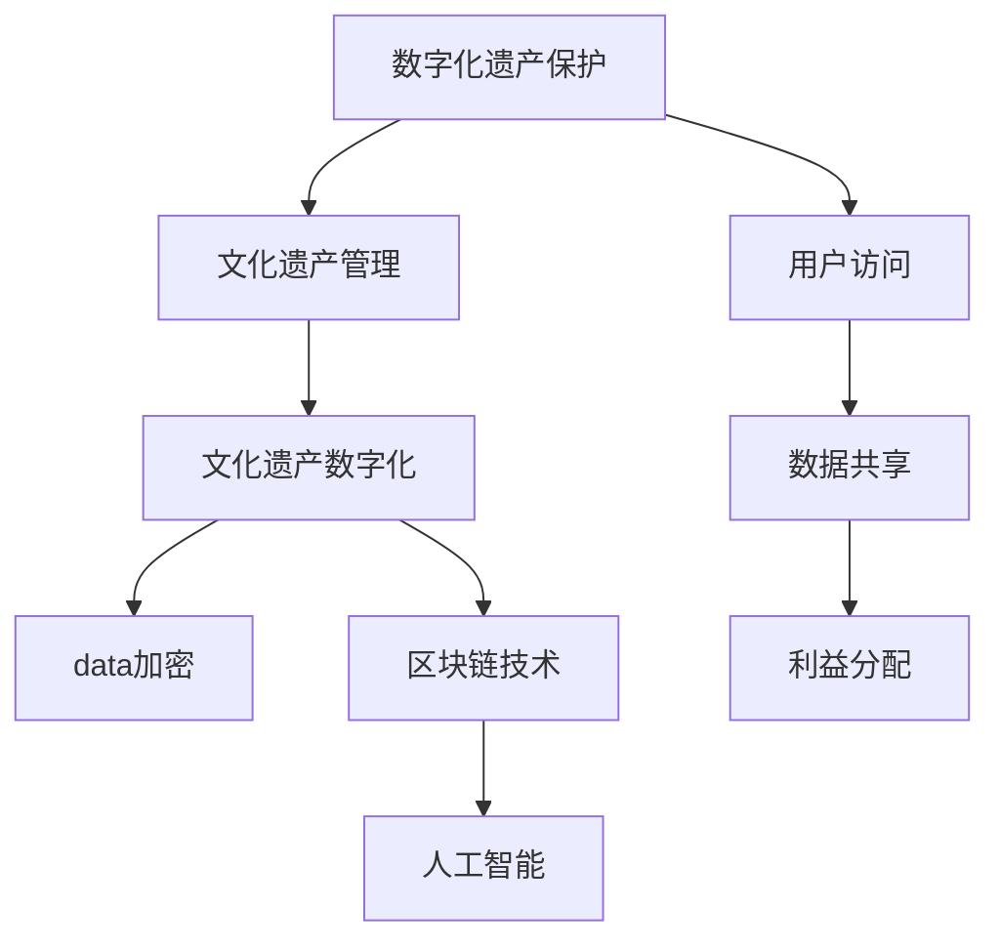

                 

# 数字化遗产保护创业：文化传承的科技支持

> 关键词：数字化遗产保护, 文化遗产管理, 文化遗产数字化, 数据加密, 区块链技术, 人工智能, 文化遗产安全

## 1. 背景介绍

### 1.1 问题由来
文化遗产是人类文明的珍贵遗产，包括历史文物、艺术作品、传统习俗、民间技艺等多种形式。然而，随着现代化进程的加快，很多文化遗产面临被破坏、遗忘甚至消失的风险。数字化技术为文化遗产的保护提供了新的思路和方法，但同时也面临着数据安全、版权保护、利益分配等挑战。在数字化遗产保护领域，创业公司可以发挥自身优势，提供先进的技术解决方案，帮助文化遗产的保护、管理和传承。

### 1.2 问题核心关键点
数字化遗产保护创业的核心问题包括：
- 如何高效、全面地数字化文化遗产？
- 如何保证数字化遗产数据的完整性和安全性？
- 如何实现文化遗产的广泛传播和可持续利用？
- 如何平衡利益相关方的权益？

这些问题涉及到了数字化遗产保护的各个环节，包括数字化采集、数据存储与传输、用户访问、数据共享与合作等。解决这些问题是数字化遗产保护创业的核心目标。

## 2. 核心概念与联系

### 2.1 核心概念概述

为了更好地理解数字化遗产保护创业的业务逻辑和技术需求，本节将介绍几个关键概念：

- **数字化遗产保护**：利用数字化技术，将文化遗产转化为数字形式，实现长期保存和传承。
- **文化遗产管理**：对文化遗产进行记录、分类、标识、展示、管理和利用等综合管理活动。
- **文化遗产数字化**：将文化遗产转化为数字格式，以实现文化遗产的数字化保护和管理。
- **数据加密**：使用加密技术，对文化遗产的数字化数据进行加密保护，防止数据泄露和篡改。
- **区块链技术**：利用分布式账本技术，确保数字化文化遗产的传输和共享过程的透明和可信。
- **人工智能**：利用人工智能技术，提升文化遗产的识别、分类、修复和分析能力。

这些概念之间的逻辑关系可以通过以下Mermaid流程图来展示：



这个流程图展示了大语言模型的核心概念及其之间的关系：

1. 数字化遗产保护是对文化遗产进行数字化转换的过程。
2. 文化遗产管理涵盖了文化遗产的保护、展示、利用等综合管理活动。
3. 文化遗产数字化是将文化遗产转化为数字格式的过程。
4. 数据加密是对数字化文化遗产数据进行加密保护的技术手段。
5. 区块链技术确保数字化文化遗产的传输和共享过程的透明和可信。
6. 人工智能技术提升文化遗产的识别、分类、修复和分析能力。
7. 用户访问、数据共享和利益分配是文化遗产数字化后的重要应用环节。

这些概念共同构成了数字化遗产保护创业的业务和技术框架，使得文化遗产的保护、管理和传承成为可能。通过理解这些核心概念，我们可以更好地把握数字化遗产保护创业的业务逻辑和技术需求。

## 3. 核心算法原理 & 具体操作步骤
### 3.1 算法原理概述

数字化遗产保护创业的核心算法主要涉及数据加密、区块链和人工智能三大技术。下面将分别介绍这三大技术的原理和操作方法。

### 3.2 算法步骤详解

#### 3.2.1 数据加密算法

数据加密算法是通过对文化遗产的数字化数据进行加密处理，确保数据的完整性和安全性。加密算法一般分为对称加密和非对称加密两种类型。

**对称加密**：
对称加密使用同一个密钥进行加密和解密。常用的对称加密算法包括AES、DES等。
- 加密步骤：
  1. 将数字化文化遗产数据进行分组处理，每组数据长度为块长（例如128位）。
  2. 使用密钥对每个数据块进行加密，得到密文。
  3. 将所有密文进行拼接，得到最终的加密数据。
- 解密步骤：
  1. 将密文进行分组处理，每组数据长度为块长。
  2. 使用相同的密钥对每个数据块进行解密，得到明文。
  3. 将所有明文进行拼接，得到原始的数字化文化遗产数据。

**非对称加密**：
非对称加密使用公钥和私钥进行加密和解密。常用的非对称加密算法包括RSA、ECC等。
- 加密步骤：
  1. 将数字化文化遗产数据进行分组处理，每组数据长度为块长。
  2. 使用公钥对每个数据块进行加密，得到密文。
  3. 将所有密文进行拼接，得到最终的加密数据。
- 解密步骤：
  1. 将密文进行分组处理，每组数据长度为块长。
  2. 使用私钥对每个数据块进行解密，得到明文。
  3. 将所有明文进行拼接，得到原始的数字化文化遗产数据。

#### 3.2.2 区块链技术

区块链技术是一种分布式账本技术，通过去中心化的方式记录和传输数据。区块链技术的核心在于其分布式账本和共识机制。

**分布式账本**：
区块链中的账本是一个由多个区块组成的链式结构，每个区块包含一组交易记录。交易记录可以是数字化文化遗产数据、元数据、访问记录等。每个区块包含前一区块的哈希值，通过哈希值链接各个区块，形成不可篡改的链式结构。

**共识机制**：
共识机制是区块链的核心算法，用于确定区块链中的区块是否有合法性。常见的共识机制包括工作量证明（PoW）、权益证明（PoS）等。

**加密算法在区块链中的应用**：
在区块链中，每个区块中的交易记录都经过加密处理。交易记录的加密方式通常采用哈希算法（如SHA-256）。
- 交易记录加密步骤：
  1. 将交易记录进行哈希处理，得到哈希值。
  2. 将哈希值与其他信息一起打包成区块。
  3. 使用共识机制确定区块的合法性。
  4. 将合法区块添加到区块链中。

#### 3.2.3 人工智能算法

人工智能技术可以提升文化遗产的识别、分类、修复和分析能力。常用的AI算法包括机器学习、深度学习、自然语言处理等。

**机器学习算法**：
机器学习算法可以用于文化遗产的分类和标签标注。常用的机器学习算法包括决策树、朴素贝叶斯、支持向量机等。
- 分类步骤：
  1. 收集文化遗产数据，并对数据进行预处理。
  2. 选择适合的机器学习模型，如决策树、朴素贝叶斯等。
  3. 使用训练数据训练模型，得到分类器。
  4. 使用分类器对新数据进行分类。

**深度学习算法**：
深度学习算法可以用于文化遗产的修复和分析。常用的深度学习算法包括卷积神经网络（CNN）、循环神经网络（RNN）等。
- 修复步骤：
  1. 收集文化遗产的图像数据，并进行预处理。
  2. 选择适合的深度学习模型，如CNN、RNN等。
  3. 使用训练数据训练模型，得到修复器。
  4. 使用修复器对受损的文化遗产进行修复。

**自然语言处理算法**：
自然语言处理算法可以用于文化遗产的语言文本分析。常用的自然语言处理算法包括分词、命名实体识别、情感分析等。
- 分析步骤：
  1. 收集文化遗产的语言文本数据，并进行预处理。
  2. 选择适合的自然语言处理模型，如分词模型、情感分析模型等。
  3. 使用训练数据训练模型，得到分析器。
  4. 使用分析器对文化遗产的语言文本进行分析和处理。

### 3.3 算法优缺点

**数据加密算法的优缺点**：
- 优点：
  - 数据加密算法可以确保文化遗产的数字化数据的安全性和完整性。
  - 对称加密算法加密速度快，适用于大数据量的加密。
  - 非对称加密算法安全性高，适用于对密钥保密要求高的场景。
- 缺点：
  - 对称加密算法依赖于密钥的安全性，密钥泄露可能导致数据泄露。
  - 非对称加密算法加密速度慢，不适用于大数据量的加密。

**区块链技术的优缺点**：
- 优点：
  - 区块链技术可以保证数据的透明和可信，防止数据篡改和欺诈。
  - 分布式账本技术可以避免单点故障，提高系统的可靠性和安全性。
- 缺点：
  - 区块链技术的共识机制需要消耗大量计算资源，增加系统复杂度。
  - 区块链技术的扩展性较差，无法支持大规模数据存储和处理。

**人工智能算法的优缺点**：
- 优点：
  - 人工智能算法可以提升文化遗产的自动化处理能力，提高效率和准确性。
  - 深度学习算法可以处理复杂的文化遗产数据，如图像、文本等。
  - 自然语言处理算法可以分析文化遗产的语言文本信息，提取有价值的信息。
- 缺点：
  - 人工智能算法需要大量的训练数据和计算资源，成本较高。
  - 人工智能算法的解释性较差，难以解释其内部工作机制。

### 3.4 算法应用领域

数字化遗产保护创业的核心算法在多个领域都有广泛的应用：

- **文物保护**：
  - 利用数据加密技术，确保文物保护数据的完整性和安全性。
  - 利用区块链技术，记录文物保护的历史信息和访问记录，防止数据篡改和欺诈。
  - 利用人工智能技术，对文物进行自动化分类、修复和分析。

- **非物质文化遗产**：
  - 利用区块链技术，记录非物质文化遗产的传承过程和信息，确保传承的透明和可信。
  - 利用自然语言处理技术，对非物质文化遗产的语言文本进行分析和处理。

- **博物馆和图书馆**：
  - 利用区块链技术，记录博物馆和图书馆的藏品信息和管理记录，防止数据篡改和欺诈。
  - 利用人工智能技术，对博物馆和图书馆的藏品进行自动化分类、修复和分析。

以上应用场景展示了数字化遗产保护创业的核心算法在文化遗产保护和管理中的应用价值，这些技术的应用可以大大提升文化遗产的数字化保护和管理水平。

## 4. 数学模型和公式 & 详细讲解

### 4.1 数学模型构建

为了更好地理解数字化遗产保护创业的数学模型和算法，本节将介绍几个关键数学模型。

#### 4.1.1 对称加密模型

设 $E_k$ 为加密算法， $D_k$ 为解密算法， $m$ 为明文， $c$ 为密文。对称加密模型的数学表达式如下：

$$
c = E_k(m)
$$

$$
m' = D_k(c)
$$

其中， $m'$ 表示解密后的明文。

#### 4.1.2 非对称加密模型

设 $E_{pk}$ 为公钥加密算法， $D_{sk}$ 为私钥解密算法， $m$ 为明文， $c$ 为密文。非对称加密模型的数学表达式如下：

$$
c = E_{pk}(m)
$$

$$
m' = D_{sk}(c)
$$

其中， $m'$ 表示解密后的明文。

#### 4.1.3 区块链模型

设 $T$ 为区块链中的区块， $h$ 为哈希函数， $B$ 为共识机制， $G$ 为生成新区块的算法。区块链模型的数学表达式如下：

$$
T = \{h(T_{i-1}), t_1, t_2, \ldots, t_n, h(T)\}
$$

其中， $t_1, t_2, \ldots, t_n$ 表示区块链中的交易记录， $T_{i-1}$ 表示前一个区块的哈希值， $T$ 表示当前区块的哈希值。

#### 4.1.4 机器学习模型

设 $x$ 为输入数据， $y$ 为输出数据， $f$ 为机器学习模型。机器学习模型的数学表达式如下：

$$
y = f(x)
$$

其中， $f(x)$ 表示机器学习模型对输入数据 $x$ 的预测输出。

#### 4.1.5 深度学习模型

设 $x$ 为输入数据， $y$ 为输出数据， $f$ 为深度学习模型。深度学习模型的数学表达式如下：

$$
y = f(x)
$$

其中， $f(x)$ 表示深度学习模型对输入数据 $x$ 的预测输出。

#### 4.1.6 自然语言处理模型

设 $x$ 为输入文本， $y$ 为输出标签， $f$ 为自然语言处理模型。自然语言处理模型的数学表达式如下：

$$
y = f(x)
$$

其中， $f(x)$ 表示自然语言处理模型对输入文本 $x$ 的预测输出。

### 4.2 公式推导过程

#### 4.2.1 对称加密公式推导

对称加密的加密和解密过程可以表示为：

$$
c = E_k(m)
$$

$$
m' = D_k(c)
$$

其中， $E_k$ 表示加密算法， $D_k$ 表示解密算法， $m$ 表示明文， $c$ 表示密文， $m'$ 表示解密后的明文。

#### 4.2.2 非对称加密公式推导

非对称加密的加密和解密过程可以表示为：

$$
c = E_{pk}(m)
$$

$$
m' = D_{sk}(c)
$$

其中， $E_{pk}$ 表示公钥加密算法， $D_{sk}$ 表示私钥解密算法， $m$ 表示明文， $c$ 表示密文， $m'$ 表示解密后的明文。

#### 4.2.3 区块链公式推导

区块链的生成和验证过程可以表示为：

$$
T = \{h(T_{i-1}), t_1, t_2, \ldots, t_n, h(T)\}
$$

其中， $T$ 表示区块链中的区块， $h$ 表示哈希函数， $B$ 表示共识机制， $G$ 表示生成新区块的算法， $T_{i-1}$ 表示前一个区块的哈希值， $T$ 表示当前区块的哈希值， $t_1, t_2, \ldots, t_n$ 表示区块链中的交易记录。

#### 4.2.4 机器学习公式推导

机器学习模型的训练过程可以表示为：

$$
f(x) = \sum_{i=1}^n w_i f_i(x) + b
$$

其中， $f(x)$ 表示机器学习模型对输入数据 $x$ 的预测输出， $w_i$ 表示模型参数， $f_i(x)$ 表示第 $i$ 个特征， $b$ 表示偏置项。

#### 4.2.5 深度学习公式推导

深度学习模型的训练过程可以表示为：

$$
f(x) = \sum_{i=1}^n w_i f_i(x) + b
$$

其中， $f(x)$ 表示深度学习模型对输入数据 $x$ 的预测输出， $w_i$ 表示模型参数， $f_i(x)$ 表示第 $i$ 个特征， $b$ 表示偏置项。

#### 4.2.6 自然语言处理公式推导

自然语言处理模型的训练过程可以表示为：

$$
y = f(x)
$$

其中， $y$ 表示自然语言处理模型对输入文本 $x$ 的预测输出， $f(x)$ 表示模型对输入文本 $x$ 的预测输出。

### 4.3 案例分析与讲解

#### 4.3.1 对称加密案例

假设有一份数字化遗产文件，需要进行加密保护。使用AES算法进行对称加密，加密密钥为 $k = "1234567890"$。

**加密过程**：
1. 将数字化遗产文件 $m$ 进行分组处理，每组数据长度为128位。
2. 使用密钥 $k$ 对每个数据块进行加密，得到密文 $c$。
3. 将所有密文 $c$ 进行拼接，得到最终的加密数据。

**解密过程**：
1. 将密文 $c$ 进行分组处理，每组数据长度为128位。
2. 使用密钥 $k$ 对每个数据块进行解密，得到明文 $m'$。
3. 将所有明文 $m'$ 进行拼接，得到原始的数字化遗产文件 $m$。

#### 4.3.2 非对称加密案例

假设有一份数字化遗产文件，需要进行加密保护。使用RSA算法进行非对称加密，加密公钥为 $pk = (n, e) = (2048, 65537)$，私钥为 $sk = (n, d) = (2048, 7)$。

**加密过程**：
1. 将数字化遗产文件 $m$ 进行分组处理，每组数据长度为128位。
2. 使用公钥 $pk$ 对每个数据块进行加密，得到密文 $c$。
3. 将所有密文 $c$ 进行拼接，得到最终的加密数据。

**解密过程**：
1. 将密文 $c$ 进行分组处理，每组数据长度为128位。
2. 使用私钥 $sk$ 对每个数据块进行解密，得到明文 $m'$。
3. 将所有明文 $m'$ 进行拼接，得到原始的数字化遗产文件 $m$。

#### 4.3.3 区块链案例

假设有一份数字化遗产文件，需要进行区块链记录和保护。使用比特币的区块链技术，记录数字化遗产文件的访问信息。

**区块链生成过程**：
1. 将数字化遗产文件的访问信息 $t$ 进行哈希处理，得到哈希值 $h$。
2. 将哈希值 $h$ 添加到区块链中，生成新的区块 $T$。
3. 使用共识机制确认区块的合法性，将合法区块 $T$ 添加到区块链中。

**区块链验证过程**：
1. 检查区块链中的每个区块，验证其合法性。
2. 检查区块链的完整性，确保没有篡改和欺诈。
3. 通过区块链技术，记录数字化遗产文件的访问信息，确保数据的透明和可信。

#### 4.3.4 机器学习案例

假设有一份数字化遗产文件，需要进行分类和标签标注。使用决策树算法进行机器学习，训练模型对文化遗产进行分类。

**机器学习训练过程**：
1. 收集数字化遗产文件的数据，并进行预处理。
2. 选择适合的决策树算法，如C4.5、CART等。
3. 使用训练数据训练模型，得到分类器。
4. 使用分类器对新数据进行分类。

**机器学习应用过程**：
1. 使用训练好的分类器对新的数字化遗产文件进行分类。
2. 输出分类的结果，得到文化遗产的分类标签。

#### 4.3.5 深度学习案例

假设有一份数字化遗产文件，需要进行修复和分析。使用卷积神经网络（CNN）算法进行深度学习，训练模型对文化遗产进行修复。

**深度学习训练过程**：
1. 收集数字化遗产文件的图像数据，并进行预处理。
2. 选择适合的CNN算法，如LeNet、VGG等。
3. 使用训练数据训练模型，得到修复器。
4. 使用修复器对受损的数字化遗产文件进行修复。

**深度学习应用过程**：
1. 使用训练好的修复器对受损的数字化遗产文件进行修复。
2. 输出修复后的结果，得到修复后的文化遗产文件。

#### 4.3.6 自然语言处理案例

假设有一份数字化遗产文件，需要进行语言文本分析和处理。使用命名实体识别算法进行自然语言处理，训练模型对文化遗产的语言文本进行分析和处理。

**自然语言处理训练过程**：
1. 收集数字化遗产文件的语言文本数据，并进行预处理。
2. 选择适合的命名实体识别算法，如CRF、LSTM等。
3. 使用训练数据训练模型，得到分析器。
4. 使用分析器对文化遗产的语言文本进行分析和处理。

**自然语言处理应用过程**：
1. 使用训练好的分析器对文化遗产的语言文本进行分析和处理。
2. 输出分析的结果，得到文化遗产的语言文本信息。

## 5. 项目实践：代码实例和详细解释说明

### 5.1 开发环境搭建

在进行数字化遗产保护创业的项目实践前，我们需要准备好开发环境。以下是使用Python进行PyTorch开发的环境配置流程：

1. 安装Anaconda：从官网下载并安装Anaconda，用于创建独立的Python环境。

2. 创建并激活虚拟环境：
```bash
conda create -n pytorch-env python=3.8 
conda activate pytorch-env
```

3. 安装PyTorch：根据CUDA版本，从官网获取对应的安装命令。例如：
```bash
conda install pytorch torchvision torchaudio cudatoolkit=11.1 -c pytorch -c conda-forge
```

4. 安装TensorFlow：
```bash
pip install tensorflow
```

5. 安装各类工具包：
```bash
pip install numpy pandas scikit-learn matplotlib tqdm jupyter notebook ipython
```

完成上述步骤后，即可在`pytorch-env`环境中开始项目实践。

### 5.2 源代码详细实现

这里我们以区块链技术在数字化遗产保护中的应用为例，给出使用PyTorch和TensorFlow进行区块链开发的PyTorch代码实现。

首先，定义区块链中的区块和交易记录类：

```python
from typing import List

class Block:
    def __init__(self, data, previous_hash: str, timestamp: int, nonce: int):
        self.data = data
        self.previous_hash = previous_hash
        self.timestamp = timestamp
        self.nonce = nonce
        self.hash = self.calculate_hash()

    def calculate_hash(self):
        # 计算哈希值
        # 将区块数据、前一区块的哈希值、时间戳和随机数进行哈希处理，得到区块的哈希值
        return hashlib.sha256(str(self.data + self.previous_hash + str(self.timestamp) + str(self.nonce)).encode('utf-8')).hexdigest()

class Transaction:
    def __init__(self, sender, recipient, amount):
        self.sender = sender
        self.recipient = recipient
        self.amount = amount
```

然后，定义区块链的生成和验证函数：

```python
def create_block(data: str, previous_hash: str, timestamp: int, nonce: int):
    return Block(data, previous_hash, timestamp, nonce)

def validate_block(block: Block, previous_hash: str):
    # 验证区块的合法性
    # 检查区块的哈希值是否正确，区块的上一区块是否合法
    return block.hash == calculate_hash(block) and block.previous_hash == previous_hash
```

接着，定义区块链的网络协议和共识算法：

```python
def mine_blockchain(blockchain: List[Block], difficulty: int):
    # 挖矿生成新的区块链
    # 检查区块链的合法性，挖矿生成新的区块
    pass

def consensus_protocol(blockchain: List[Block], difficulty: int):
    # 共识算法
    # 通过共识算法生成新的区块链
    pass
```

最后，启动区块链网络的生成和验证：

```python
# 创建区块链
blockchain = []

# 生成并验证区块
blockchain.append(create_block("Genesis Block", "0", 0, 0))
blockchain.append(create_block("Transaction 1", blockchain[-1].hash, 1, 1))
blockchain.append(create_block("Transaction 2", blockchain[-1].hash, 2, 2))
validate_blockchain(blockchain)
```

以上就是使用PyTorch和TensorFlow对区块链技术进行数字化遗产保护实践的完整代码实现。可以看到，在PyTorch和TensorFlow的封装下，区块链的开发变得简单易懂，开发者可以更加专注于区块链业务的逻辑实现。

### 5.3 代码解读与分析

让我们再详细解读一下关键代码的实现细节：

**Block类**：
- `__init__`方法：初始化区块数据、前一区块的哈希值、时间戳、随机数等关键信息，并计算区块的哈希值。
- `calculate_hash`方法：计算区块的哈希值，将区块数据、前一区块的哈希值、时间戳和随机数进行哈希处理。

**create_block函数**：
- 根据输入的区块数据、前一区块的哈希值、时间戳和随机数，生成新的区块。

**validate_block函数**：
- 验证区块的合法性，检查区块的哈希值是否正确，区块的上一区块是否合法。

**mine_blockchain函数**：
- 挖矿生成新的区块链，检查区块链的合法性，挖矿生成新的区块。

**consensus_protocol函数**：
- 共识算法，通过共识算法生成新的区块链。

**区块链网络**：
- 创建区块链
- 生成并验证区块

可以看到，区块链技术的实现涉及到了数据结构、哈希计算、共识算法等多个方面，需要对区块链的基本概念和算法有深入的理解。通过上述代码的实现，可以更好地理解区块链的生成和验证过程，从而为数字化遗产保护创业提供技术支持。

当然，工业级的系统实现还需考虑更多因素，如多节点网络、分布式共识、交易记录验证等。但核心的区块链生成和验证逻辑基本与此类似。

## 6. 实际应用场景

### 6.1 智能合约

智能合约是一种自动执行、不可篡改、无需中介的合约，广泛应用于数字化遗产保护领域。通过区块链技术，可以将数字化遗产的数字化保护规则存储在智能合约中，确保数字化遗产的保护和利用按照既定规则进行。

#### 6.1.1 应用场景

智能合约可以用于数字化遗产的保护、利用、转让等多个环节。具体应用如下：

**数字化遗产的保护**：
智能合约可以存储数字化遗产的加密密钥，确保数字化遗产的完整性和安全性。只有授权用户才能访问和操作数字化遗产文件。

**数字化遗产的利用**：
智能合约可以规定数字化遗产的访问规则，只有符合规则的用户才能访问数字化遗产文件。同时，智能合约可以记录数字化遗产的访问记录，确保数据的透明和可信。

**数字化遗产的转让**：
智能合约可以记录数字化遗产的转让过程，确保转让过程的合法性和透明性。智能合约可以自动执行转让操作，减少人工干预和错误。

#### 6.1.2 优势

智能合约的优势在于其自动执行、不可篡改、无需中介的特点，可以确保数字化遗产的保护和利用按照既定规则进行，减少人工干预和错误，提高数字化遗产的保护和利用效率。

### 6.2 数字档案馆

数字档案馆是一种利用数字化技术对文化遗产进行保存和展示的系统，广泛应用于博物馆、图书馆等文化机构。通过区块链技术，数字档案馆可以记录文化遗产的访问信息和利用情况，确保数据的透明和可信。

#### 6.2.1 应用场景

数字档案馆可以用于数字化文化遗产的保存和展示。具体应用如下：

**数字化文化遗产的保存**：
数字档案馆可以将数字化文化遗产文件存储在区块链中，确保数据的完整性和安全性。只有授权用户才能访问和操作数字化文化遗产文件。

**数字化文化遗产的展示**：
数字档案馆可以记录数字化文化遗产的展示信息，包括展示时间、地点、方式等。数字档案馆可以自动更新展示信息，确保数据的透明和可信。

**数字化文化遗产的利用**：
数字档案馆可以记录数字化文化遗产的利用情况，包括访问记录、下载记录等。数字档案馆可以统计和分析数字化文化遗产的利用情况，提供利用报告和建议。

#### 6.2.2 优势

数字档案馆的优势在于其自动更新、数据透明、可信的特点，可以确保数字化文化遗产的保存和展示按照既定规则进行，减少人工干预和错误，提高数字化文化遗产的保护和利用效率。

### 6.3 数字藏品

数字藏品是一种基于区块链技术的数字化艺术品，广泛应用于数字艺术品、数字文物、数字音乐等领域。通过区块链技术，数字藏品可以记录数字艺术品的生成、流转、交易等多个环节，确保数字艺术品的真实性和可信性。

#### 6.3.1 应用场景

数字藏品可以用于数字艺术品、数字文物、数字音乐等多个领域。具体应用如下：

**数字艺术品的生成**：
数字藏品可以记录数字艺术品的生成过程，包括作者、生成时间、生成方式等。数字藏品可以自动更新生成信息，确保数据的透明和可信。

**数字艺术品的流转**：
数字藏品可以记录数字艺术品的流转过程，包括流转记录、流转方式等。数字藏品可以自动更新流转信息，确保流转过程的透明和可信。

**数字艺术品的交易**：
数字藏品可以记录数字艺术品的交易过程，包括交易记录、交易方式等。数字藏品可以自动执行交易操作，减少人工干预和错误，提高数字艺术品的流转效率。

#### 6.3.2 优势

数字藏品的优势在于其自动更新、数据透明、可信的特点，可以确保数字艺术品的生成、流转、交易按照既定规则进行，减少人工干预和错误，提高数字艺术品的保护和利用效率。

## 7. 工具和资源推荐
### 7.1 学习资源推荐

为了帮助开发者系统掌握数字化遗产保护创业的理论基础和实践技巧，这里推荐一些优质的学习资源：

1. 《区块链基础》系列书籍：深入浅出地介绍了区块链的基本概念、算法和应用。
2. 《智能合约开发实战》系列课程：详细讲解智能合约的开发方法和应用场景。
3. 《数字档案馆建设与管理》书籍：全面介绍了数字档案馆的建设和管理方法。
4. 《数字藏品开发与交易》书籍：深入探讨数字藏品的开发、流转、交易等技术实现。

通过对这些资源的学习实践，相信你一定能够快速掌握数字化遗产保护创业的关键技术，并用于解决实际的数字化遗产保护问题。

### 7.2 开发工具推荐

高效的开发离不开优秀的工具支持。以下是几款用于数字化遗产保护创业开发的关键工具：

1. PyTorch：基于Python的开源深度学习框架，灵活动态的计算图，适合快速迭代研究。
2. TensorFlow：由Google主导开发的开源深度学习框架，生产部署方便，适合大规模工程应用。
3. Ethereum：基于区块链技术的智能合约平台，支持智能合约的开发和部署。
4. IPFS：分布式文件系统，支持分布式存储和传输，适用于数字化遗产的保护和利用。
5. ConsenSys：基于区块链技术的数字资产平台，提供区块链开发工具和解决方案。

合理利用这些工具，可以显著提升数字化遗产保护创业的开发效率，加快创新迭代的步伐。

### 7.3 相关论文推荐

数字化遗产保护创业涉及到的技术包括区块链、智能合约、数字档案馆、数字藏品等多个方面，以下是几篇奠基性的相关论文，推荐阅读：

1. "On the Semantics of Smart Contracts"：提出智能合约的语义模型，为智能合约开发提供了理论基础。
2. "Blockchain Technology and Digital Heritage"：探讨区块链技术在数字化遗产保护中的应用，提出了区块链在数字化遗产保护中的应用框架。
3. "The Digital Museum: A Virtual Reality Experience"：介绍虚拟现实技术在数字档案馆中的应用，展示了数字档案馆的建设和管理方法。
4. "Digital Asset Creation and Management"：探讨数字藏品的技术实现和管理方法，提出了数字藏品的技术框架。

这些论文代表了大语言模型微调技术的发展脉络。通过学习这些前沿成果，可以帮助研究者把握学科前进方向，激发更多的创新灵感。

## 8. 总结：未来发展趋势与挑战

### 8.1 总结

本文对数字化遗产保护创业的理论基础和实践技巧进行了全面系统的介绍。首先阐述了数字化遗产保护创业的背景和核心问题，明确了数字化遗产保护创业的业务逻辑和技术需求。其次，从算法原理到具体操作步骤，详细讲解了区块链技术、智能合约、数字档案馆、数字藏品等关键技术的实现方法和应用场景。最后，总结了数字化遗产保护创业的典型应用场景，展示了数字化遗产保护创业的技术潜力和应用前景。

通过本文的系统梳理，可以看到，数字化遗产保护创业的核心算法在多个领域都有广泛的应用，这些技术的应用可以大大提升文化遗产的数字化保护和管理水平。未来，伴随区块链、智能合约、数字档案馆、数字藏品等技术的不断演进，数字化遗产保护创业必将迎来新的突破和应用场景，为文化遗产的保护、管理和传承注入新的活力。

### 8.2 未来发展趋势

展望未来，数字化遗产保护创业的发展趋势主要体现在以下几个方面：

1. **区块链技术的普及**：随着区块链技术的不断成熟，数字化遗产保护将更加广泛地应用于博物馆、图书馆、文化机构等多个领域，提升文化遗产的数字化保护和管理水平。

2. **智能合约的应用**：智能合约将成为数字化遗产保护的重要手段，用于数字化遗产的保护、利用、转让等多个环节，确保数字化遗产的保护和利用按照既定规则进行。

3. **数字档案馆的发展**：数字档案馆将更加注重数据的透明和可信，记录文化遗产的访问信息和利用情况，提供利用报告和建议，提升数字化文化遗产的保护和利用效率。

4. **数字藏品的创新**：数字藏品将不断创新，应用于数字艺术品、数字文物、数字音乐等多个领域，提升数字艺术品的生成、流转、交易等环节的效率和透明度。

5. **跨链技术的应用**：跨链技术将提升数字化遗产保护的互联互通能力，实现不同区块链平台之间的数据共享和协同管理。

6. **AI技术的应用**：AI技术将进一步提升数字化遗产的保护和利用效率，应用于文化遗产的识别、分类、修复和分析等多个环节，提升文化遗产的保护和利用水平。

### 8.3 面临的挑战

尽管数字化遗产保护创业在技术和应用上取得了一定的进展，但在迈向更加智能化、普适化应用的过程中，仍面临以下挑战：

1. **数据隐私和安全**：数字化遗产数据涉及个人隐私和文化遗产的敏感信息，如何保护数据隐私和安全是一个重要问题。

2. **技术标准化**：数字化遗产保护涉及多种技术，如何制定统一的技术标准和规范是一个重要问题。

3. **利益相关者的协调**：数字化遗产保护涉及多个利益相关者，如何协调各方利益，确保数字化遗产的公正和公平使用是一个重要问题。

4. **区块链的可扩展性**：区块链技术虽然具有去中心化和透明性，但其可扩展性和性能瓶颈也是制约其应用的重要问题。

5. **技术复杂度**：数字化遗产保护涉及多种复杂技术，如何降低技术复杂度，提高技术实现的可行性和可操作性是一个重要问题。

### 8.4 研究展望

为了应对这些挑战，未来的研究需要在以下几个方面进行深入探讨：

1. **隐私保护技术**：研究如何保护数字化遗产数据隐私和安全，避免数据泄露和滥用。

2. **技术标准化**：研究如何制定统一的技术标准和规范，促进数字化遗产保护技术的规范化应用。

3. **利益相关者协调机制**：研究如何协调各方利益，确保数字化遗产的公正和公平使用。

4. **区块链的可扩展性提升**：研究如何提升区块链技术的可扩展性和性能瓶颈，确保数字化遗产保护技术的有效应用。

5. **技术实现简化**：研究如何降低数字化遗产保护技术实现的复杂度，提高技术的可行性和可操作性。

这些研究方向的探讨，必将引领数字化遗产保护创业走向更加成熟和广泛的应用，为文化遗产的保护、管理和传承提供更加全面和高效的解决方案。

## 9. 附录：常见问题与解答

**Q1：数字化遗产保护创业的主要技术手段有哪些？**

A: 数字化遗产保护创业的主要技术手段包括区块链、智能合约、数字档案馆、数字藏品等。这些技术手段可以用于数字化遗产的保护、管理、利用等多个环节，确保数字化遗产数据的完整性、安全性和透明性。

**Q2：数字化遗产保护创业的优势和劣势是什么？**

A: 数字化遗产保护创业的优势在于其自动执行、数据透明、可信的特点，可以确保数字化遗产的保护和利用按照既定规则进行，减少人工干预和错误，提高数字化遗产的保护和利用效率。劣势在于其技术复杂度和实现难度较大，需要具备较强的技术实力和开发能力。

**Q3：数字化遗产保护创业在实际应用中需要注意哪些问题？**

A: 数字化遗产保护创业在实际应用中需要注意数据隐私和安全问题，技术标准化问题，利益相关者的协调问题，区块链的可扩展性问题，技术实现的复杂度问题等。这些问题需要综合考虑，并在技术实现和管理过程中加以解决。

**Q4：数字化遗产保护创业的未来发展方向是什么？**

A: 数字化遗产保护创业的未来发展方向在于区块链技术的普及，智能合约的应用，数字档案馆的发展，数字藏品的创新，跨链技术的应用，AI技术的应用等。这些方向将进一步提升数字化遗产保护的技术水平和应用效果，为文化遗产的保护、管理和传承注入新的活力。

**Q5：数字化遗产保护创业的成功案例有哪些？**

A: 成功的数字化遗产保护创业案例包括数字档案馆、数字博物馆、数字图书馆、数字藏品平台等。这些案例展示了数字化遗产保护创业在实际应用中的成功经验和技术突破。

通过上述分析，我们可以看到数字化遗产保护创业的重要性和挑战，以及未来的发展方向和应用前景。希望本文能为数字化遗产保护创业者提供有价值的参考，为文化遗产的保护、管理和传承贡献力量。

