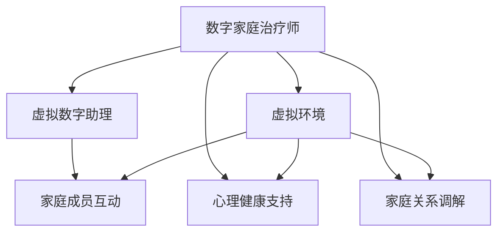

                 

## 数字家庭治疗师:元宇宙时代的家庭关系调解专家

### 1. 背景介绍

在数字化和智能化的浪潮下，家庭关系调解技术正迈入一个全新的发展阶段。过去，心理学家和家庭治疗师往往依赖面对面的沟通，但受时间和地域的限制，很多家庭无法获得及时的咨询服务。而如今，伴随着元宇宙技术的兴起，通过虚拟现实(VR)、增强现实(AR)、虚拟数字助理(Virtual Assistant)等技术的结合，家庭关系调解师能够以全新的方式，为家庭成员提供更个性化、更便捷、更高效的心理支持和治疗服务。

### 2. 核心概念与联系

#### 2.1 核心概念概述

要理解数字家庭治疗师在元宇宙时代的角色，首先需要明确几个关键概念：

- **数字家庭治疗师**：使用数字化手段，通过虚拟现实、增强现实等技术，为家庭成员提供心理支持和治疗的专业人员。他们不仅需要具备心理咨询和治疗的专业知识和技能，还需要掌握数字技术和元宇宙环境的运用能力。
- **元宇宙**：基于VR、AR、云计算等技术构建的虚拟空间，用户可以通过头盔、手柄、手势识别等设备，在虚拟环境中进行互动和体验。
- **虚拟数字助理**：在元宇宙环境中，以数字形式呈现的虚拟助手，可以理解自然语言、执行任务、提供信息和建议，支持家庭成员的日常生活和情感交流。
- **心理健康**：包括情感健康、心理平衡、社会适应、人际关系等，是维持家庭和谐、促进家庭成员身心健康的重要方面。

这些概念之间存在着紧密的联系，共同构成了数字家庭治疗师在元宇宙时代的工作基础：

1. **数字技术**：为虚拟环境和虚拟数字助理的创建和操作提供支持。
2. **心理健康**：数字家庭治疗师通过虚拟环境和虚拟数字助理，为家庭成员提供心理支持和治疗方法。
3. **家庭关系**：家庭成员通过虚拟环境进行互动和交流，增强情感连接，促进家庭关系和谐。
4. **元宇宙**：为数字家庭治疗师提供了一个全新的环境，拓展了其工作场景和方式。

#### 2.2 核心概念原理和架构的 Mermaid 流程图



### 3. 核心算法原理 & 具体操作步骤

#### 3.1 算法原理概述

数字家庭治疗师在元宇宙环境中，利用虚拟现实和增强现实技术，为家庭成员提供心理支持和关系调解服务。其算法原理包括以下几个关键部分：

1. **虚拟现实(VR)技术**：通过创建沉浸式的虚拟环境，家庭成员可以在虚拟空间中进行互动和体验，增强情感连接。
2. **增强现实(AR)技术**：将数字信息叠加在现实世界环境中，帮助家庭成员理解和处理现实问题，增强现实感。
3. **自然语言处理(NLP)**：通过语音识别和自然语言理解技术，数字家庭治疗师可以与家庭成员进行自然的对话和交流。
4. **情感分析**：通过分析家庭成员的语言和行为，识别其情感状态，提供针对性的支持和建议。
5. **关系建模**：通过关系图谱等方法，建立家庭成员之间的互动关系，分析关系质量，提供调解建议。

#### 3.2 算法步骤详解

数字家庭治疗师在元宇宙环境中的操作步骤如下：

1. **环境创建与设置**：根据家庭成员的需求和偏好，创建和设置虚拟环境，如家庭场景、学校环境等。
2. **成员加入与互动**：家庭成员通过VR头盔、手柄、手势识别等设备，加入虚拟环境，进行互动和交流。
3. **情感监测与分析**：利用情感分析技术，实时监测家庭成员的语言和行为，识别情感状态，进行情绪支持。
4. **关系分析与调解**：通过关系图谱等方法，分析家庭成员之间的关系，提供调解建议和指导。
5. **反馈与调整**：根据家庭成员的反馈，调整虚拟环境的设置，优化互动和交流的方式，提高治疗效果。

#### 3.3 算法优缺点

数字家庭治疗师的算法具有以下优点：

- **灵活性高**：虚拟环境和虚拟数字助理可以根据家庭成员的需要进行定制，提供个性化的心理支持和关系调解服务。
- **便捷性**：家庭成员可以随时随地加入虚拟环境，进行互动和交流，不受时间和地域的限制。
- **沉浸感强**：通过VR和AR技术，家庭成员可以在沉浸式的虚拟环境中进行互动，增强情感连接和理解。

但同时也存在一些缺点：

- **技术依赖**：需要依赖VR、AR、云计算等技术，设备成本和技术门槛较高。
- **数据隐私**：家庭成员在虚拟环境中的数据和行为需要保护，避免隐私泄露。
- **情感真实性**：虚拟环境中的互动缺乏真实的物理接触，可能影响情感的深度和真实性。

#### 3.4 算法应用领域

数字家庭治疗师的算法主要应用于以下领域：

1. **家庭教育**：通过虚拟环境提供亲子沟通、学习指导、情绪支持等服务，帮助家庭关系和谐。
2. **婚姻咨询**：通过虚拟环境提供婚姻关系调解、情感支持、问题解决等服务，维护婚姻稳定。
3. **青少年心理辅导**：通过虚拟环境提供心理支持、情感引导、行为干预等服务，帮助青少年健康成长。
4. **老年心理关怀**：通过虚拟环境提供陪伴、情绪支持、认知训练等服务，提升老年人的生活质量。
5. **特殊教育**：通过虚拟环境提供个性化教学、特殊需求支持、情感引导等服务，帮助有特殊需求的孩子成长。

### 4. 数学模型和公式 & 详细讲解 & 举例说明

#### 4.1 数学模型构建

数字家庭治疗师在元宇宙环境中的算法，可以通过以下几个数学模型来构建：

1. **虚拟环境创建模型**：根据家庭成员的需求和偏好，构建虚拟环境的几何模型，包括场景布局、家具摆放、光照效果等。
2. **情感状态识别模型**：利用自然语言处理技术，建立情感识别模型，识别家庭成员的语言和行为，评估其情感状态。
3. **关系图谱建模模型**：建立家庭成员之间互动关系的图谱模型，分析关系质量和互动频率，提供调解建议。

#### 4.2 公式推导过程

以情感状态识别模型为例，假设家庭成员的语言和行为可以用向量$X$表示，情感状态可以用向量$Y$表示，情感识别模型可以表示为：

$$
Y = f(X; \theta)
$$

其中$f$为情感识别函数，$\theta$为模型参数，包括语言特征提取、行为特征提取等。

情感识别模型的训练过程，可以通过最大似然估计或最小化交叉熵损失函数进行优化：

$$
\hat{\theta} = \mathop{\arg\min}_{\theta} -\sum_{i=1}^N \log P(Y_i|X_i; \theta)
$$

其中$N$为样本数量，$P(Y_i|X_i; \theta)$为在给定输入$X_i$的情况下，情感状态$Y_i$的概率分布，可以通过条件概率模型或分类模型进行估计。

#### 4.3 案例分析与讲解

以一个简单的家庭咨询案例为例，家庭成员A和B在虚拟环境中发生争吵，数字家庭治疗师通过语音识别技术，获取他们的对话内容：

- 家庭成员A：“你总是这样，让我很生气！”
- 家庭成员B：“我不是故意的，只是太累了。”

数字家庭治疗师使用情感状态识别模型，分析A和B的情感状态，发现A处于愤怒状态，B处于疲惫状态。

根据关系图谱建模模型，数字家庭治疗师进一步分析A和B之间的关系，发现他们在过去一周内的互动次数和质量都有所下降。

综合情感状态和关系分析结果，数字家庭治疗师给出以下调解建议：

- 建议A学会情绪管理，尝试通过深呼吸、冥想等方法平复心情。
- 建议B调整作息时间，尽量保证充足的休息。
- 建议A和B共同进行情感沟通，了解彼此的感受和需求，增强情感连接。

通过以上案例，可以看出数字家庭治疗师在元宇宙环境中，通过情感分析和关系建模，为家庭成员提供及时的情感支持和关系调解，帮助他们化解矛盾，增强情感连接。

### 5. 项目实践：代码实例和详细解释说明

#### 5.1 开发环境搭建

要实现数字家庭治疗师在元宇宙环境中的功能，需要搭建以下开发环境：

1. **虚拟现实环境**：安装VR头盔、手柄、手势识别设备，搭建虚拟现实开发环境。
2. **增强现实环境**：安装AR设备，搭建增强现实开发环境。
3. **云计算平台**：使用云计算服务，如AWS、Google Cloud等，搭建数据存储和计算环境。
4. **自然语言处理工具**：使用NLTK、SpaCy等自然语言处理工具，进行语言特征提取和情感识别。
5. **关系图谱工具**：使用Gephi、NetworkX等关系图谱工具，进行关系建模和分析。

#### 5.2 源代码详细实现

以情感状态识别模型为例，以下是使用Python和TensorFlow实现情感识别的代码：

```python
import tensorflow as tf
from tensorflow.keras import layers

# 定义情感状态识别模型
def build_model(input_dim):
    model = tf.keras.Sequential([
        layers.Embedding(input_dim, 64, input_length=128),
        layers.LSTM(128, return_sequences=True),
        layers.LSTM(64),
        layers.Dense(1, activation='sigmoid')
    ])
    return model

# 加载数据
input_data = load_data()

# 构建模型
model = build_model(input_dim)

# 编译模型
model.compile(optimizer='adam', loss='binary_crossentropy', metrics=['accuracy'])

# 训练模型
model.fit(input_data, labels, epochs=10, batch_size=32)
```

#### 5.3 代码解读与分析

上述代码中，首先定义了一个简单的情感状态识别模型，包括嵌入层、LSTM层和输出层，用于从语言特征中识别情感状态。

加载数据部分，使用了NLTK等工具，从文本文件中加载情感标注数据。

模型构建部分，调用了TensorFlow的Keras API，创建了一个包含嵌入层、LSTM层和输出层的神经网络模型。

模型编译部分，定义了优化器、损失函数和评价指标，准备开始训练。

模型训练部分，通过`fit`方法，对模型进行训练，使用情感标注数据进行监督学习。

#### 5.4 运行结果展示

训练完成后，使用测试数据对模型进行评估，得到情感状态识别的准确率和其他指标：

```python
test_data = load_test_data()
test_labels = load_test_labels()

scores = model.evaluate(test_data, test_labels)
print('Test loss:', scores[0])
print('Test accuracy:', scores[1])
```

### 6. 实际应用场景

数字家庭治疗师在元宇宙环境中的应用场景非常广泛，以下是几个典型应用案例：

#### 6.1 家庭教育

在虚拟家庭环境中，数字家庭治疗师可以为父母和子女提供互动和沟通平台，帮助解决家庭教育中的问题，如亲子沟通、学习指导、情绪管理等。

#### 6.2 婚姻咨询

在虚拟婚姻环境中，数字家庭治疗师可以为夫妻提供情感支持、问题解决、关系调解等服务，帮助维护婚姻稳定。

#### 6.3 青少年心理辅导

在虚拟学校环境中，数字家庭治疗师可以为青少年提供心理健康支持、行为指导、情感引导等服务，帮助他们健康成长。

#### 6.4 老年心理关怀

在虚拟社区环境中，数字家庭治疗师可以为老年人提供陪伴、情绪支持、认知训练等服务，提升老年人的生活质量。

#### 6.5 特殊教育

在虚拟教育环境中，数字家庭治疗师可以为有特殊需求的孩子提供个性化教学、特殊需求支持、情感引导等服务，帮助他们克服困难，实现自我成长。

### 7. 工具和资源推荐

#### 7.1 学习资源推荐

要掌握数字家庭治疗师在元宇宙环境中的技术，可以阅读以下学习资源：

1. **《数字家庭治疗师手册》**：全面介绍了数字家庭治疗师在元宇宙环境中的角色、技术、应用等。
2. **《虚拟现实技术与应用》**：详细讲解了虚拟现实技术的基本原理和应用场景。
3. **《增强现实技术与应用》**：介绍了增强现实技术的基本原理和应用场景。
4. **《自然语言处理与深度学习》**：讲解了自然语言处理和深度学习的基本原理和常用技术。
5. **《家庭关系调解与心理健康》**：介绍了家庭关系调解和心理健康的基本理论和实践方法。

#### 7.2 开发工具推荐

数字家庭治疗师在元宇宙环境中的开发，需要使用以下工具：

1. **Unity**：虚拟现实和增强现实开发工具，支持VR和AR应用开发。
2. **Unreal Engine**：虚拟现实和增强现实开发工具，支持高精度渲染和复杂场景模拟。
3. **TensorFlow**：深度学习框架，支持自然语言处理和情感识别等任务。
4. **PyTorch**：深度学习框架，支持复杂的神经网络和关系图谱建模。
5. **Gephi**：关系图谱工具，支持关系图谱的创建和分析。

#### 7.3 相关论文推荐

数字家庭治疗师在元宇宙环境中的研究，可以参考以下论文：

1. **《虚拟现实在心理健康治疗中的应用》**：探讨了虚拟现实技术在心理健康治疗中的作用和效果。
2. **《增强现实在家庭关系调解中的应用》**：介绍了增强现实技术在家庭关系调解中的实践案例和效果。
3. **《数字助理在心理支持中的作用》**：探讨了数字助理在心理支持中的作用和效果。
4. **《元宇宙中的心理健康研究》**：介绍了元宇宙技术在心理健康研究中的应用和前景。
5. **《虚拟家庭环境下的家庭教育》**：探讨了虚拟家庭环境在家庭教育中的作用和效果。

### 8. 总结：未来发展趋势与挑战

#### 8.1 研究成果总结

数字家庭治疗师在元宇宙环境中的研究，已经取得了一定的进展，但仍然面临一些挑战。未来需要进一步提升技术的成熟度和应用的普及度。

#### 8.2 未来发展趋势

1. **技术成熟度提升**：随着技术的不断发展和完善，虚拟现实、增强现实等技术将更加成熟，数字家庭治疗师在元宇宙环境中的应用将更加广泛和高效。
2. **应用场景多样化**：数字家庭治疗师将在家庭教育、婚姻咨询、青少年心理辅导等多个领域得到应用，拓展其服务范围。
3. **用户接受度提升**：随着用户对虚拟现实和增强现实技术的接受度提升，数字家庭治疗师在元宇宙环境中的应用将更加普及。
4. **伦理和社会影响**：数字家庭治疗师需要考虑伦理和社会影响，确保其应用符合道德标准和社会规范。

#### 8.3 面临的挑战

1. **技术瓶颈**：虚拟现实和增强现实技术仍然面临一些技术瓶颈，如设备的普及率、性能提升等。
2. **数据隐私**：数字家庭治疗师在元宇宙环境中，需要处理大量的用户数据，保护用户隐私是一个重要挑战。
3. **伦理和法律问题**：数字家庭治疗师在元宇宙环境中的应用，需要遵守伦理和法律规定，避免滥用技术。
4. **用户体验**：数字家庭治疗师需要考虑用户体验，提升其在元宇宙环境中的使用体验和效果。

#### 8.4 研究展望

未来，数字家庭治疗师在元宇宙环境中的研究，需要在以下几个方面进行探索和突破：

1. **个性化定制**：根据家庭成员的需求和偏好，提供个性化的虚拟环境和虚拟数字助理。
2. **情感智能增强**：提升情感识别和情感引导的准确性和智能性，增强家庭成员的情感连接和支持。
3. **多模态融合**：将虚拟现实、增强现实、自然语言处理等多种技术融合，提供更全面、更丰富的心理支持和关系调解服务。
4. **跨界合作**：与其他领域的专业人士和机构合作，提供综合性的心理支持和关系调解服务。

总之，数字家庭治疗师在元宇宙环境中的研究，是一个充满挑战和机遇的领域，需要各方面的共同努力，才能实现其在家庭关系调解和心理健康支持中的应用。

### 9. 附录：常见问题与解答

#### Q1: 数字家庭治疗师在元宇宙环境中的技术瓶颈有哪些？

A: 数字家庭治疗师在元宇宙环境中的技术瓶颈主要包括以下几个方面：

1. **设备成本高**：虚拟现实和增强现实设备的成本较高，普及率有待提升。
2. **技术复杂**：虚拟现实和增强现实技术相对复杂，需要专业的开发和维护。
3. **数据传输延迟**：虚拟现实和增强现实环境中，数据传输和处理延迟可能会影响用户体验。
4. **用户体验限制**：虚拟环境中的交互和反馈可能缺乏真实感，影响情感连接和沟通效果。

#### Q2: 数字家庭治疗师在元宇宙环境中如何保障用户数据隐私？

A: 数字家庭治疗师在元宇宙环境中，保障用户数据隐私可以通过以下几个措施：

1. **数据加密**：使用加密技术对用户数据进行加密处理，确保数据传输和存储的安全性。
2. **权限控制**：设置严格的权限控制机制，限制访问数据的用户和操作权限。
3. **数据匿名化**：对用户数据进行匿名化处理，避免隐私泄露。
4. **合规监管**：遵守相关法律法规，进行合规性的数据处理和保护。

#### Q3: 数字家庭治疗师在元宇宙环境中的伦理和社会影响有哪些？

A: 数字家庭治疗师在元宇宙环境中的伦理和社会影响主要包括以下几个方面：

1. **伦理问题**：数字家庭治疗师需要考虑伦理问题，避免滥用技术、侵犯隐私等。
2. **社会影响**：数字家庭治疗师可能会影响社会对虚拟现实和增强现实技术的看法和接受度。
3. **心理影响**：过度依赖虚拟现实和增强现实技术，可能会影响家庭成员的现实沟通和情感连接。

#### Q4: 数字家庭治疗师在元宇宙环境中的用户体验如何提升？

A: 数字家庭治疗师在元宇宙环境中的用户体验可以通过以下几个措施提升：

1. **设备优化**：优化虚拟现实和增强现实设备，提升设备性能和用户体验。
2. **界面设计**：设计更加友好、直观的用户界面，提高用户操作便捷性。
3. **情感引导**：通过虚拟数字助理和情感引导，增强家庭成员的情感连接和支持。
4. **实时反馈**：提供实时反馈和互动，增强用户体验的沉浸感和真实感。

---

作者：禅与计算机程序设计艺术 / Zen and the Art of Computer Programming

