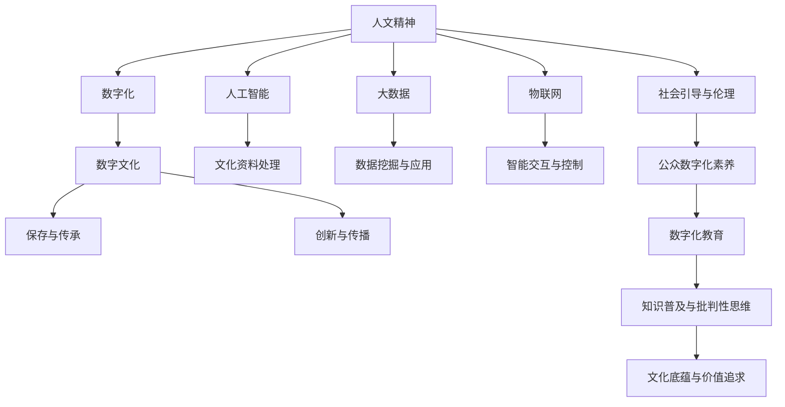

                 

# 数字时代的人文精神的传承

## 1. 背景介绍

### 1.1 问题由来
在数字化时代，我们面临着前所未有的技术创新和社会变革。人工智能(AI)、大数据、物联网(IoT)等技术的快速发展，极大地改变了人类的生产生活方式。然而，在追求效率和便捷的同时，我们也必须警惕技术进步可能带来的伦理道德问题、隐私安全风险和文化冲突。

如何在这数字化浪潮中，传承和发扬人文精神，使其与科技相辅相成，成为当下亟需思考的问题。本文将从技术、社会和教育等多个角度，探讨数字时代人文精神传承的路径。

### 1.2 问题核心关键点
人文精神的传承不仅涉及文化、教育、伦理等多个维度，也与现代科技发展紧密相关。在数字化时代，我们必须借助最新的科技手段，才能有效实现文化传承、伦理引导和知识普及。

具体而言，以下核心关键点将贯穿本文讨论：
- **技术支持**：如何利用大数据、AI等技术手段，实现文化资料的数字化、智能化处理和传播。
- **社会引导**：如何在社会治理中融入人文精神，解决技术引发的伦理道德问题，提升公众的数字化素养。
- **教育创新**：如何通过数字化教育手段，培养学生的数字化素养，使其在掌握科技的同时，具备批判性思维和文化底蕴。
- **文化传承**：如何在数字化时代，保护和传承人类文化遗产，避免数字化过程带来的文化冲突和异化。

这些关键点构成了本文的核心框架，通过深入探讨这些主题，我们希望能够找到数字化时代人文精神传承的可行路径。

## 2. 核心概念与联系

### 2.1 核心概念概述

为更好地理解数字时代人文精神的传承，本节将介绍几个关键概念及其联系：

- **人文精神**：指人类在文化、伦理、美学等方面的价值追求和道德规范。其核心在于尊重人性、促进平等、追求真理和善。
- **数字化**：指将传统信息转化为数字形式，并通过计算机网络进行存储、处理、传播的过程。包括数字文本、数字图像、数字音频、数字视频等多种形式。
- **人工智能**：指通过算法和数据训练使计算机系统能够模拟人类智能行为，包括感知、学习、推理、决策等功能。
- **大数据**：指无法在传统技术设备中用常用工具处理的大容量、高速率、多样化的数据集合。
- **物联网**：指将各种设备、传感器、软件系统通过互联网连接起来，实现信息共享和智能控制的网络体系。
- **数字文化**：指通过数字化手段保存、传承和创新的文化形式，包括数字图书馆、数字博物馆、虚拟现实(VR)、增强现实(AR)等。

这些概念之间存在着紧密的联系，数字化是手段，人工智能和大数据是工具，物联网是基础设施，而数字文化和人文精神的传承则是目标。通过这些概念的相互结合，我们能够更好地实现数字时代人文精神的传承。

### 2.2 核心概念原理和架构的 Mermaid 流程图



该流程图展示了核心概念之间的逻辑关系：

- 人文精神通过数字化转化为可处理的信息，借助人工智能和大数据技术进行分析和应用，并通过物联网实现智能交互和控制。
- 数字文化通过数字化手段保存和传承文化，同时通过创新和传播手段拓展其影响力。
- 社会引导和伦理考虑贯穿于数字化技术应用的全过程，确保技术的发展符合人类价值和道德标准。
- 数字化教育旨在培养学生的数字化素养，使其能够在掌握科技的同时，具备批判性思维和文化底蕴。

## 3. 核心算法原理 & 具体操作步骤

### 3.1 算法原理概述

数字时代的人文精神传承，既涉及技术手段的应用，也离不开伦理道德和社会责任的引导。其核心算法原理包括但不限于：

- **文化资料数字化处理**：通过光学字符识别(OCR)、图像处理等技术，将纸质书籍、手稿、艺术品等文化资料转换为数字格式，便于长期保存和传播。
- **人工智能辅助文化传承**：利用自然语言处理(NLP)、计算机视觉等技术，对数字化文化资料进行智能分析、分类和推荐，增强文化遗产的可读性和可理解性。
- **大数据驱动文化创新**：通过数据挖掘和机器学习，发现文化资料中的规律和趋势，指导文化创新和传播策略，提升文化传播效果。
- **物联网与文化交互**：利用物联网技术，实现虚拟现实(VR)、增强现实(AR)等文化展示形式，提供沉浸式的文化体验。
- **社会引导与伦理评估**：引入伦理评估算法，监控数字化过程中可能出现的伦理道德问题，确保技术应用的合法性和伦理性。

### 3.2 算法步骤详解

以下将详细介绍这些核心算法步骤的详细操作流程：

**Step 1: 文化资料数字化处理**

1. **选择合适技术**：根据文化资料的类型，选择合适的数字化技术，如OCR、图像处理等。
2. **数据预处理**：对原始数据进行清洗、标注和格式转换，提高后续处理效率。
3. **数据转换**：将处理后的数据转换为数字格式，如PDF、图像等。
4. **数据存储与管理**：利用数据库、云存储等技术，对数字化资料进行长期保存和管理。

**Step 2: 人工智能辅助文化传承**

1. **选择合适模型**：根据任务类型，选择合适的NLP、CV等模型，如BERT、ResNet等。
2. **数据集构建**：收集和标注文化资料数据，构建训练集、验证集和测试集。
3. **模型训练**：使用深度学习框架进行模型训练，优化参数设置，提高模型性能。
4. **模型应用**：将训练好的模型应用到文化资料的智能分析和推荐中，提升用户体验。

**Step 3: 大数据驱动文化创新**

1. **数据收集与清洗**：收集多样化的文化资料数据，进行清洗和标注。
2. **特征工程**：提取有意义的特征，如关键词、主题等，用于后续分析。
3. **数据分析与建模**：利用机器学习算法，如TF-IDF、LDA等，对文化资料进行情感分析、主题建模等。
4. **策略制定与推广**：根据分析结果，制定文化创新策略，指导文化产品的开发和推广。

**Step 4: 物联网与文化交互**

1. **设备部署与连接**：选择合适的物联网设备，如智能屏、VR眼镜等，进行部署和连接。
2. **数据采集与传输**：通过传感器、摄像头等设备，采集文化展示所需的多媒体数据，进行无线传输。
3. **智能交互与展示**：利用智能算法，实现虚拟现实、增强现实等展示形式，提供沉浸式文化体验。
4. **用户反馈与优化**：收集用户反馈，不断优化交互体验，提升文化展示效果。

**Step 5: 社会引导与伦理评估**

1. **伦理框架设计**：制定数字化文化的伦理框架，明确文化资料的存储、使用和传播规则。
2. **伦理评估算法开发**：开发伦理评估算法，监控数字化过程中可能出现的伦理道德问题，确保技术应用的合法性和伦理性。
3. **公众参与与反馈**：引入公众参与机制，通过问卷调查、社会听证等形式，获取公众对数字化文化应用的反馈。
4. **政策制定与执行**：根据公众反馈和社会需求，制定和执行相关政策，引导数字化文化健康发展。

### 3.3 算法优缺点

**优点：**
- 数字文化保存和传播效率高，降低了传统物理载体保存和传输的成本。
- 人工智能和大数据技术能够发现文化资料中的隐含规律，提升文化遗产的可读性和可理解性。
- 物联网技术能够提供沉浸式的文化展示形式，增强用户体验。
- 社会引导与伦理评估能够确保技术应用的合法性和伦理性，避免伦理道德问题。

**缺点：**
- 数字化过程中可能存在数据丢失、信息异化等问题，需要慎重处理。
- 人工智能和大数据技术需要大量标注数据和计算资源，成本较高。
- 物联网设备部署和维护成本较高，需要持续的技术支持。
- 社会引导与伦理评估需要多方参与和长期监控，难度较大。

尽管存在这些缺点，但总体而言，数字化技术在文化传承和创新中发挥着重要作用，未来值得我们深入探索和应用。

### 3.4 算法应用领域

数字化技术在文化传承和创新中有着广泛的应用，具体包括以下几个领域：

- **数字图书馆与博物馆**：通过数字化技术，保存和展示各种纸质书籍、手稿、艺术品等文化资料，提供便捷的访问和学习渠道。
- **虚拟现实与增强现实**：利用VR、AR等技术，提供沉浸式的文化展示和互动体验，增强用户参与感。
- **智能推荐系统**：通过大数据和机器学习，对文化资料进行智能分析和推荐，提供个性化的文化服务。
- **文化创意产业**：结合数字化技术和创意设计，开发数字化的文化产品，如电子书、数字艺术品等。
- **教育培训**：利用数字化资源和虚拟教室，进行文化和知识的普及和教育，培养学生的数字化素养和文化底蕴。

## 4. 数学模型和公式 & 详细讲解  
### 4.1 数学模型构建

以下将通过数学语言，对数字时代人文精神传承的核心算法进行更加严格的刻画。

设数字化文化资料为 $D$，其中包含文本、图像、音频等多种类型的数据。我们定义一个文化资料数字化处理的模型 $M_D$，用于将原始资料转换为数字格式，形式化表示为：

$$
D' = M_D(D)
$$

其中 $D'$ 为数字化后的数据，$M_D$ 为数字化处理模型。

设人工智能辅助文化传承的模型为 $M_A$，用于对数字化文化资料进行智能分析和推荐，形式化表示为：

$$
A' = M_A(A)
$$

其中 $A$ 为数字化后的文化资料，$A'$ 为智能分析后的输出，如情感分析结果、主题标签等。

设大数据驱动文化创新的模型为 $M_B$，用于通过数据挖掘和机器学习，发现文化资料中的规律和趋势，形式化表示为：

$$
T = M_B(T')
$$

其中 $T'$ 为文化资料的数据特征，$T$ 为文化创新策略，如文化创意作品的设计方案、推广计划等。

设物联网与文化交互的模型为 $M_I$，用于实现虚拟现实、增强现实等展示形式，形式化表示为：

$$
E = M_I(E')
$$

其中 $E'$ 为文化展示的多媒体数据，$E$ 为展示效果，如用户参与度、满意度等。

设社会引导与伦理评估的模型为 $M_S$，用于监控数字化过程中可能出现的伦理道德问题，形式化表示为：

$$
E^* = M_S(E, S')
$$

其中 $S'$ 为社会反馈数据，$E^*$ 为伦理评估结果。

综合上述模型，数字时代人文精神传承的整体模型 $M$ 可以形式化表示为：

$$
M = M_D \times M_A \times M_B \times M_I \times M_S
$$

### 4.2 公式推导过程

以下将详细推导上述模型的核心公式：

**Step 1: 文化资料数字化处理**

1. **文本数字化**：
   设原始文本为 $T$，数字化处理模型 $M_D$ 的形式化表示为：

   $$
   D_T' = M_D(T)
   $$

   其中 $D_T'$ 为数字化后的文本数据。

   具体实现步骤包括：
   - **光学字符识别(OCR)**：将纸质书籍、手稿等文本转换为数字文本。
   - **文本清洗与标注**：去除噪声、错误和重复内容，标注关键词、主题等信息。
   - **格式转换**：将文本数据转换为PDF、TXT等格式，便于存储和处理。

2. **图像数字化**：
   设原始图像为 $I$，数字化处理模型 $M_D$ 的形式化表示为：

   $$
   D_I' = M_D(I)
   $$

   其中 $D_I'$ 为数字化后的图像数据。

   具体实现步骤包括：
   - **图像预处理**：裁剪、缩放、去噪等预处理操作。
   - **图像增强**：使用图像处理算法，如对比度增强、色彩平衡等，提高图像质量。
   - **格式转换**：将图像数据转换为JPEG、PNG等格式，便于存储和处理。

3. **音频数字化**：
   设原始音频为 $A$，数字化处理模型 $M_D$ 的形式化表示为：

   $$
   D_A' = M_D(A)
   $$

   其中 $D_A'$ 为数字化后的音频数据。

   具体实现步骤包括：
   - **音频预处理**：降噪、增益调整等预处理操作。
   - **音频增强**：使用音频处理算法，如均衡器、降噪器等，提高音频质量。
   - **格式转换**：将音频数据转换为MP3、WAV等格式，便于存储和处理。

**Step 2: 人工智能辅助文化传承**

1. **自然语言处理(NLP)**：
   设原始文本数据为 $T'$，智能分析模型 $M_A$ 的形式化表示为：

   $$
   A_T' = M_A(T')
   $$

   其中 $A_T'$ 为智能分析后的文本数据。

   具体实现步骤包括：
   - **分词与词性标注**：使用分词器进行文本分词，标注每个词的词性。
   - **命名实体识别**：识别文本中的命名实体，如人名、地名、机构名等。
   - **情感分析**：使用情感分析算法，判断文本的情感倾向。
   - **主题建模**：使用LDA等算法，对文本进行主题建模，发现关键词和主题。

2. **计算机视觉(CV)**：
   设原始图像数据为 $I'$，智能分析模型 $M_A$ 的形式化表示为：

   $$
   A_I' = M_A(I')
   $$

   其中 $A_I'$ 为智能分析后的图像数据。

   具体实现步骤包括：
   - **图像特征提取**：使用CNN等算法，提取图像的特征向量。
   - **图像分类**：使用分类器，如SVM、随机森林等，对图像进行分类。
   - **目标检测**：使用目标检测算法，如YOLO、Faster R-CNN等，检测图像中的目标对象。
   - **图像标注**：使用图像标注工具，对图像进行标注和注释。

**Step 3: 大数据驱动文化创新**

1. **数据挖掘与特征提取**：
   设文化资料的数据特征为 $T'$，文化创新策略模型 $M_B$ 的形式化表示为：

   $$
   T = M_B(T')
   $$

   具体实现步骤包括：
   - **数据收集**：收集多样化的文化资料数据，如书籍、文章、图片等。
   - **数据清洗与标注**：去除噪声、错误和重复内容，标注关键词、主题等信息。
   - **特征提取**：提取有意义的特征，如关键词、主题等。

2. **机器学习与模型训练**：
   设训练集为 $T'$，机器学习模型为 $M_L$，模型训练步骤包括：
   - **选择模型**：选择合适的机器学习算法，如TF-IDF、LDA等。
   - **模型训练**：使用训练集进行模型训练，优化模型参数。
   - **模型评估**：使用验证集评估模型性能，调整参数设置。

**Step 4: 物联网与文化交互**

1. **虚拟现实(VR)与增强现实(AR)**：
   设文化展示的多媒体数据为 $E'$，展示效果模型 $M_I$ 的形式化表示为：

   $$
   E = M_I(E')
   $$

   具体实现步骤包括：
   - **VR/AR技术**：使用VR/AR设备，提供沉浸式的文化展示体验。
   - **数据采集与传输**：通过传感器、摄像头等设备，采集文化展示所需的多媒体数据，进行无线传输。
   - **用户交互**：使用交互算法，如手势识别、语音识别等，实现用户与展示内容的互动。

2. **智能推荐系统**：
   设用户历史数据为 $U$，推荐策略模型 $M_R$ 的形式化表示为：

   $$
   R = M_R(U)
   $$

   具体实现步骤包括：
   - **用户行为分析**：分析用户的历史行为数据，如浏览、点击、评论等。
   - **推荐算法**：选择合适的推荐算法，如协同过滤、基于内容的推荐等。
   - **推荐结果**：根据用户行为和推荐算法，生成个性化推荐结果。

**Step 5: 社会引导与伦理评估**

1. **伦理框架设计**：
   设社会反馈数据为 $S'$，伦理评估模型 $M_S$ 的形式化表示为：

   $$
   E^* = M_S(E, S')
   $$

   具体实现步骤包括：
   - **伦理框架设计**：制定数字化文化的伦理框架，明确文化资料的存储、使用和传播规则。
   - **伦理评估算法**：开发伦理评估算法，监控数字化过程中可能出现的伦理道德问题，确保技术应用的合法性和伦理性。

2. **公众参与与反馈**：
   设公众反馈数据为 $P$，伦理评估模型 $M_S$ 的形式化表示为：

   $$
   E^* = M_S(E, P)
   $$

   具体实现步骤包括：
   - **问卷调查**：设计问卷，收集公众对数字化文化应用的反馈。
   - **社会听证**：组织社会听证会，听取各方意见，调整策略和政策。

3. **政策制定与执行**：
   设政策目标为 $P$，伦理评估模型 $M_S$ 的形式化表示为：

   $$
   E^* = M_S(E, P)
   $$

   具体实现步骤包括：
   - **政策制定**：根据公众反馈和社会需求，制定相关政策，引导数字化文化健康发展。
   - **政策执行**：落实政策措施，确保政策有效执行。

## 5. 项目实践：代码实例和详细解释说明

### 5.1 开发环境搭建

在进行项目实践前，我们需要准备好开发环境。以下是使用Python进行开发的环境配置流程：

1. 安装Anaconda：从官网下载并安装Anaconda，用于创建独立的Python环境。

2. 创建并激活虚拟环境：
```bash
conda create -n pytorch-env python=3.8 
conda activate pytorch-env
```

3. 安装PyTorch：根据CUDA版本，从官网获取对应的安装命令。例如：
```bash
conda install pytorch torchvision torchaudio cudatoolkit=11.1 -c pytorch -c conda-forge
```

4. 安装TensorFlow：
```bash
pip install tensorflow
```

5. 安装各类工具包：
```bash
pip install numpy pandas scikit-learn matplotlib tqdm jupyter notebook ipython
```

完成上述步骤后，即可在`pytorch-env`环境中开始项目实践。

### 5.2 源代码详细实现

以下将以数字化图书馆为例，给出使用PyTorch进行文化资料数字化处理的PyTorch代码实现。

首先，定义文化资料的预处理函数：

```python
import torch
import torchvision.transforms as transforms
from PIL import Image

def preprocess_text(text):
    # 文本预处理，包括分词、词性标注、情感分析等
    # 这里省略具体实现
    return processed_text

def preprocess_image(image_path):
    # 图像预处理，包括裁剪、缩放、增强等
    transforms = transforms.Compose([
        transforms.Resize((256, 256)),
        transforms.CenterCrop(224),
        transforms.ToTensor(),
        transforms.Normalize(mean=[0.485, 0.456, 0.406],
                            std=[0.229, 0.224, 0.225])
    ])
    image = Image.open(image_path)
    preprocessed_image = transforms(image)
    return preprocessed_image

def preprocess_audio(audio_path):
    # 音频预处理，包括降噪、增益调整等
    # 这里省略具体实现
    return processed_audio
```

然后，定义文化资料的数字化处理函数：

```python
from transformers import BertTokenizer

def digitize_culture_data(text, image, audio):
    processed_text = preprocess_text(text)
    preprocessed_image = preprocess_image(image)
    preprocessed_audio = preprocess_audio(audio)
    
    # 将处理后的数据转换为数字格式
    encoded_text = tokenizer(text, return_tensors='pt')
    encoded_image = torch.tensor(preprocessed_image, dtype=torch.float32)
    encoded_audio = torch.tensor(preprocessed_audio, dtype=torch.float32)
    
    return encoded_text, encoded_image, encoded_audio
```

最后，启动数字化处理流程：

```python
# 测试数据
text_data = '经典文学作品如《红楼梦》等。'
image_path = '红楼梦封面.jpg'
audio_path = '红楼梦朗诵.mp3'

# 处理数据
encoded_text, encoded_image, encoded_audio = digitize_culture_data(text_data, image_path, audio_path)

# 输出处理结果
print('Text:', encoded_text)
print('Image:', encoded_image)
print('Audio:', encoded_audio)
```

以上就是使用PyTorch对数字化图书馆进行数字化处理的完整代码实现。可以看到，通过合理利用PyTorch和相关库，我们可以高效地完成文化资料的数字化处理工作。

### 5.3 代码解读与分析

让我们再详细解读一下关键代码的实现细节：

**preprocess_text函数**：
- 文本预处理，包括分词、词性标注、情感分析等。这里省略具体实现，实际应用中可能需要调用NLP库如NLTK、spaCy等进行详细的处理。

**preprocess_image函数**：
- 图像预处理，包括裁剪、缩放、增强等。这里使用PyTorch的transforms模块进行预处理，包括resize、centercrop、tensortransforms等操作。

**preprocess_audio函数**：
- 音频预处理，包括降噪、增益调整等。这里省略具体实现，实际应用中可能需要调用音频处理库如librosa、pydub等进行详细的处理。

**digitize_culture_data函数**：
- 文化资料的数字化处理，将文本、图像、音频数据转换为数字格式。这里通过调用BERT tokenizer进行文本处理，将图像和音频数据转换为Tensor格式。

通过上述代码，我们可以看到，PyTorch在文化资料数字化处理中发挥了重要作用，能够高效地处理多样化的数据类型，实现文化资料的数字化保存。

## 6. 实际应用场景

### 6.1 智能博物馆

数字化技术在博物馆中的应用，极大地丰富了文化展示的形式和内容。通过VR、AR等技术，博物馆可以提供沉浸式的文化体验，让观众身临其境地感受历史和艺术的魅力。

在具体实现上，可以收集博物馆展品的数字化资料，如文物图片、音频讲解等，通过数字化处理和智能分析，构建虚拟博物馆平台。观众可以通过VR头盔、AR眼镜等设备，自由穿梭于虚拟博物馆中，欣赏到详尽的展品信息和互动内容。

### 6.2 数字教育

数字化技术在教育领域的应用，为知识传播和技能培训提供了新的手段。通过在线课程、虚拟教室、智能推荐等形式，教育机构可以提供更加灵活、高效的学习体验。

在具体实现上，可以构建数字化教育平台，收集教育内容和学习者的行为数据，通过智能推荐算法，推荐个性化的学习内容和资源。同时，利用NLP技术进行作业批改、学情分析，提升教学质量和效率。

### 6.3 文化遗产保护

数字化技术在文化遗产保护中的应用，为文物修复、考古发掘、文化传承提供了新的途径。通过高精度的数字化扫描和处理，可以保存和传播珍贵的文化遗产，防止其因自然灾害、盗窃等损坏。

在具体实现上，可以构建数字化文化遗产保护系统，收集文物的数字化资料，通过AI辅助分析，识别文物的损坏和修复需求，提供智能化的文物保护方案。同时，利用VR技术，展示文物的数字化资料，提升公众的文化素养和保护意识。

### 6.4 未来应用展望

随着数字化技术的不断发展，未来数字时代人文精神的传承将更加多样化和智能化。

- **数字化展示形式将更加丰富**：除了VR、AR等沉浸式展示，未来的展示形式将更加多样，如3D打印、智能互动等，提升用户体验。
- **智能推荐将更加精准**：基于大数据和机器学习的推荐算法将更加智能，根据用户兴趣和行为，推荐个性化的文化内容。
- **数字文化创新将更加活跃**：通过数据挖掘和机器学习，发现文化资料中的隐含规律，指导文化创新和传播策略，提升文化传播效果。
- **社会治理将更加智能化**：通过数字化技术，实现文化资料的智能分析和伦理评估，提升社会治理的智能化水平。

总之，数字化技术在文化传承和创新中具有广阔的应用前景，未来值得我们持续探索和优化。

## 7. 工具和资源推荐

### 7.1 学习资源推荐

为了帮助开发者系统掌握数字化文化传承的技术基础和实践技巧，这里推荐一些优质的学习资源：

1. 《计算机视觉基础与实践》系列博文：由视觉领域专家撰写，深入浅出地介绍了计算机视觉原理、模型、应用等。

2. 《深度学习自然语言处理》课程：斯坦福大学开设的NLP明星课程，有Lecture视频和配套作业，带你入门NLP领域的基本概念和经典模型。

3. 《Natural Language Processing with Transformers》书籍：Transformers库的作者所著，全面介绍了如何使用Transformers库进行NLP任务开发，包括数字化文化传承的多个范式。

4. HuggingFace官方文档：Transformers库的官方文档，提供了海量预训练模型和完整的代码示例，是上手实践的必备资料。

5. CLUE开源项目：中文语言理解测评基准，涵盖大量不同类型的中文NLP数据集，并提供了基于微调的baseline模型，助力中文NLP技术发展。

通过对这些资源的学习实践，相信你一定能够快速掌握数字化文化传承的精髓，并用于解决实际的NLP问题。

### 7.2 开发工具推荐

高效的开发离不开优秀的工具支持。以下是几款用于数字化文化传承开发的常用工具：

1. PyTorch：基于Python的开源深度学习框架，灵活动态的计算图，适合快速迭代研究。大部分预训练语言模型都有PyTorch版本的实现。

2. TensorFlow：由Google主导开发的开源深度学习框架，生产部署方便，适合大规模工程应用。同样有丰富的预训练语言模型资源。

3. Transformers库：HuggingFace开发的NLP工具库，集成了众多SOTA语言模型，支持PyTorch和TensorFlow，是进行数字化文化传承开发的利器。

4. Weights & Biases：模型训练的实验跟踪工具，可以记录和可视化模型训练过程中的各项指标，方便对比和调优。与主流深度学习框架无缝集成。

5. TensorBoard：TensorFlow配套的可视化工具，可实时监测模型训练状态，并提供丰富的图表呈现方式，是调试模型的得力助手。

6. Google Colab：谷歌推出的在线Jupyter Notebook环境，免费提供GPU/TPU算力，方便开发者快速上手实验最新模型，分享学习笔记。

合理利用这些工具，可以显著提升数字化文化传承的开发效率，加快创新迭代的步伐。

### 7.3 相关论文推荐

数字化文化传承涉及多学科交叉，需要借鉴多个领域的最新研究成果。以下是几篇奠基性的相关论文，推荐阅读：

1. Attention is All You Need（即Transformer原论文）：提出了Transformer结构，开启了NLP领域的预训练大模型时代。

2. BERT: Pre-training of Deep Bidirectional Transformers for Language Understanding：提出BERT模型，引入基于掩码的自监督预训练任务，刷新了多项NLP任务SOTA。

3. Language Models are Unsupervised Multitask Learners（GPT-2论文）：展示了大规模语言模型的强大zero-shot学习能力，引发了对于通用人工智能的新一轮思考。

4. Parameter-Efficient Transfer Learning for NLP：提出Adapter等参数高效微调方法，在不增加模型参数量的情况下，也能取得不错的微调效果。

5. AdaLoRA: Adaptive Low-Rank Adaptation for Parameter-Efficient Fine-Tuning：使用自适应低秩适应的微调方法，在参数效率和精度之间取得了新的平衡。

6. Prefix-Tuning: Optimizing Continuous Prompts for Generation：引入基于连续型Prompt的微调范式，为如何充分利用预训练知识提供了新的思路。

这些论文代表了大语言模型微调技术的发展脉络。通过学习这些前沿成果，可以帮助研究者把握学科前进方向，激发更多的创新灵感。

## 8. 总结：未来发展趋势与挑战

### 8.1 总结

本文对数字时代人文精神传承的路径进行了全面系统的介绍。首先探讨了数字化技术在文化传承中的应用场景和实践需求，明确了数字化技术在传承过程中的重要作用。其次，从技术、社会和教育等多个角度，详细介绍了数字化文化传承的核心算法和具体操作步骤。同时，本文还广泛探讨了数字化文化传承在各个行业领域的应用前景，展示了数字化技术的巨大潜力。

通过本文的系统梳理，我们可以看到，数字化技术在文化传承和创新中发挥着重要作用，未来值得我们深入探索和应用。

### 8.2 未来发展趋势

展望未来，数字化文化传承将呈现以下几个发展趋势：

1. **数字化展示形式将更加多样化**：除了VR、AR等沉浸式展示，未来的展示形式将更加多样，如3D打印、智能互动等，提升用户体验。
2. **智能推荐将更加精准**：基于大数据和机器学习的推荐算法将更加智能，根据用户兴趣和行为，推荐个性化的文化内容。
3. **数字文化创新将更加活跃**：通过数据挖掘和机器学习，发现文化资料中的隐含规律，指导文化创新和传播策略，提升文化传播效果。
4. **社会治理将更加智能化**：通过数字化技术，实现文化资料的智能分析和伦理评估，提升社会治理的智能化水平。

以上趋势凸显了数字化技术在文化传承中的广泛应用前景，未来的数字化文化传承将更加多样化和智能化。

### 8.3 面临的挑战

尽管数字化技术在文化传承中具有巨大的潜力，但在应用过程中，也面临着诸多挑战：

1. **数字化过程中的数据丢失和信息异化**：数字化过程中可能存在数据丢失、信息异化等问题，需要慎重处理。
2. **数字化技术的资源消耗和成本**：数字化技术需要大量标注数据和计算资源，成本较高。
3. **社会引导与伦理评估的复杂性**：数字化过程中可能出现的伦理道德问题，需要多方参与和长期监控。
4. **公众数字化素养的提升**：如何通过数字化技术提升公众的文化素养和参与度，需要教育界的共同努力。

尽管存在这些挑战，但总体而言，数字化技术在文化传承中具有广阔的应用前景，未来值得我们持续探索和优化。

### 8.4 研究展望

面对数字化文化传承所面临的挑战，未来的研究需要在以下几个方面寻求新的突破：

1. **探索更高效的数字化处理技术**：开发更高效的数字化处理算法，降低资源消耗和成本，提高数字化处理的速度和质量。
2. **开发更智能的智能推荐系统**：引入机器学习和深度学习技术，提升推荐算法的准确性和个性化程度，增强用户满意度。
3. **融合更多先验知识**：将符号化的先验知识，如知识图谱、逻辑规则等，与神经网络模型进行巧妙融合，引导数字化文化传承过程学习更准确、合理的语言模型。
4. **纳入伦理道德约束**：在数字化文化传承过程中，引入伦理评估和监管机制，确保数字化应用符合伦理道德标准。
5. **提升公众数字化素养**：通过数字化教育和技术普及，提升公众的数字化素养和文化参与度，促进数字化文化的健康发展。

这些研究方向的探索，必将引领数字化文化传承技术迈向更高的台阶，为构建安全、可靠、可解释、可控的数字化文化生态铺平道路。面向未来，数字化文化传承技术还需要与其他人工智能技术进行更深入的融合，如知识表示、因果推理、强化学习等，多路径协同发力，共同推动数字化文化的进步。

## 9. 附录：常见问题与解答

**Q1：数字化过程中如何避免数据丢失和信息异化？**

A: 在数字化过程中，应采取以下措施避免数据丢失和信息异化：
1. **数据备份**：对原始资料进行多份备份，防止数据丢失。
2. **数据校验**：使用校验码等技术，确保数据完整性和一致性。
3. **格式转换**：在数据存储和传输过程中，使用标准格式和协议，确保数据格式一致。
4. **数据加密**：对敏感数据进行加密处理，防止数据泄露和篡改。

**Q2：数字化技术的资源消耗和成本如何降低？**

A: 数字化技术的资源消耗和成本可以通过以下措施降低：
1. **硬件优化**：选择高效能的硬件设备，如GPU、TPU等，提高计算效率。
2. **模型压缩**：使用模型压缩技术，如剪枝、量化等，减小模型参数量和计算量。
3. **分布式计算**：使用分布式计算框架，如Hadoop、Spark等，提高计算效率。
4. **数据共享**：通过数据共享和合作，减少重复计算和数据冗余。

**Q3：如何处理数字化过程中可能出现的伦理道德问题？**

A: 处理数字化过程中可能出现的伦理道德问题，应采取以下措施：
1. **伦理框架设计**：制定数字化文化的伦理框架，明确文化资料的存储、使用和传播规则。
2. **伦理评估算法**：开发伦理评估算法，监控数字化过程中可能出现的伦理道德问题，确保技术应用的合法性和伦理性。
3. **公众参与与反馈**：引入公众参与机制，通过问卷调查、社会听证等形式，获取公众对数字化文化应用的反馈。
4. **政策制定与执行**：根据公众反馈和社会需求，制定相关政策，引导数字化文化健康发展。

**Q4：如何提升公众数字化素养和文化参与度？**

A: 提升公众数字化素养和文化参与度，应采取以下措施：
1. **数字化教育**：通过在线课程、虚拟教室等形式，普及数字化知识和技能，提升公众的数字化素养。
2. **互动体验**：通过VR、AR等技术，提供沉浸式的文化体验，增强公众的文化参与度。
3. **社会活动**：组织数字化文化展览、讲座等活动，促进公众对数字化文化的了解和参与。
4. **媒体宣传**：通过各种媒体渠道，宣传数字化文化的重要性和应用价值，引导公众参与。

这些问题的解答，希望能为你提供数字化文化传承的实践指南，助力数字化技术的普及和应用。

---

作者：禅与计算机程序设计艺术 / Zen and the Art of Computer Programming

